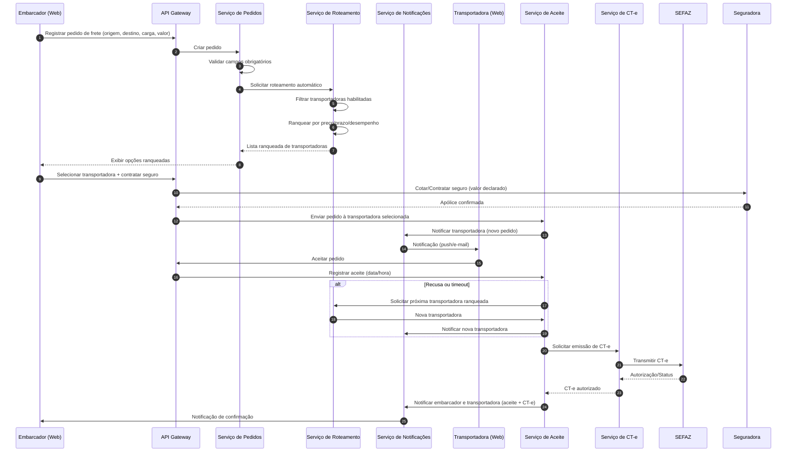
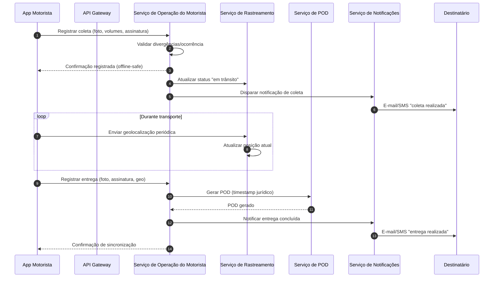

# Relatório Técnico de Arquitetura de Software
## Plataforma de Gestão de Transporte de Cargas (G04)

---

## 1. Identificação das HUs

| HU | Título | Perfil | RFs Relacionados |
|----|--------|--------|-------------------|
| HU01 | Registrar pedido de frete | Embarcador | RF05, RF06, RF09, RF10 |
| HU02 | Selecionar transportadora e contratar seguro | Embarcador | RF11, RF12, RF13, RF17, RF41 |
| HU03 | Acompanhar pedidos e receber comprovante de entrega | Embarcador | RF07, RF37, RF39, RF33 |
| HU04 | Abrir sinistro por avaria ou extravio | Embarcador | RF42, RF43, RF44 |
| HU05 | Aceitar pedidos de frete e gerenciar frota | Transportadora | RF13, RF14, RF15, RF03 |
| HU06 | Acompanhar operação dos motoristas em tempo real | Transportadora | RF25, RF26, RF32 |
| HU07 | Consultar demonstrativo financeiro de repasse | Transportadora | RF48, RF46 |
| HU08 | Executar coleta com registro de evidências | Motorista | RF24, RF26 |
| HU09 | Registrar entrega com assinatura digital | Motorista | RF27, RF37, RF38, RF40, RF28 |
| HU10 | Registrar ocorrência durante o transporte | Motorista | RF26, RF35, RF34 |
| HU11 | Rastrear carga em tempo real sem cadastro | Destinatário | RF30, RF31, RF32 |
| HU12 | Receber notificações de cada etapa da entrega | Destinatário | RF33 |
| HU13 | Monitorar SLA de fretes e acionar contingência | Administrador | RF36, RF15 (índice desempenho) |
| HU14 | Acompanhar painel financeiro da plataforma | Administrador | RF49, RF47 |

---

## 2. Diagramas de Arquitetura (Mermaid)

### 2.1 Diagrama de Componentes (Visão Macro)

```mermaid
flowchart TB
    subgraph Clientes
        WebEmbarcador[Portal Web - Embarcador/Transportadora/Admin]
        AppMotorista[App Mobile - Motorista]
        LinkRastreio[Página Pública de Rastreamento]
    end

    subgraph GatewayAcesso["Camada de Acesso"]
        APIGateway[API Gateway / BFF]
        AuthService[Serviço de Autenticação e Autorização]
    end

    subgraph DominioNucleo["Domínio Núcleo de Negócio"]
        UserMgmt[Serviço de Gestão de Usuários e Frota]
        PedidoService[Serviço de Pedidos de Frete]
        RoteamentoService[Serviço de Roteamento e Ranqueamento]
        AceiteService[Serviço de Aceite de Frete]
        DesempenhoService[Serviço de Índice de Desempenho]
        CTeService[Serviço de Emissão de CT-e]
        OperacaoMotoristaService[Serviço de Operação do Motorista]
        RastreioService[Serviço de Rastreamento e Geolocalização]
        NotificacaoService[Serviço de Notificações]
        PODService[Serviço de Comprovante de Entrega]
        SeguroSinistroService[Serviço de Seguros e Sinistros]
        FinanceiroService[Serviço Financeiro e Faturamento]
        AuditoriaService[Serviço de Auditoria]
        MonitoramentoService[Serviço de Monitoramento/SLA]
    end

    subgraph Integracoes["Integrações Externas"]
        SEFAZ[SEFAZ]
        Seguradoras[Seguradoras Parceiras]
        ProvedorNotificacao[Provedor de E-mail/SMS]
    end

    subgraph Armazenamento["Armazenamento de Dados"]
        BDTransacional[(Base Transacional)]
        BDGeoespacial[(Base de Séries Temporais/Geoespacial)]
        BDDocumentos[(Repositório de Documentos/Evidências)]
        BDAuditoria[(Log de Auditoria Imutável)]
    end

    WebEmbarcador --> APIGateway
    AppMotorista --> APIGateway
    LinkRastreio --> APIGateway
    APIGateway --> AuthService
    APIGateway --> UserMgmt
    APIGateway --> PedidoService
    APIGateway --> RastreioService
    APIGateway --> FinanceiroService
    APIGateway --> SeguroSinistroService
    APIGateway --> MonitoramentoService

    PedidoService --> RoteamentoService
    RoteamentoService --> AceiteService
    AceiteService --> DesempenhoService
    AceiteService --> CTeService
    AceiteService --> NotificacaoService
    CTeService <--> SEFAZ

    OperacaoMotoristaService --> RastreioService
    OperacaoMotoristaService --> PODService
    OperacaoMotoristaService --> NotificacaoService
    PODService --> BDDocumentos

    SeguroSinistroService <--> Seguradoras
    SeguroSinistroService --> BDDocumentos

    FinanceiroService --> BDTransacional
    RastreioService --> BDGeoespacial
    NotificacaoService <--> ProvedorNotificacao

    UserMgmt --> BDTransacional
    PedidoService --> BDTransacional
    AuditoriaService --> BDAuditoria

    UserMgmt -.log.-> AuditoriaService
    PedidoService -.log.-> AuditoriaService
    CTeService -.log.-> AuditoriaService
    FinanceiroService -.log.-> AuditoriaService
    MonitoramentoService --> RoteamentoService
    MonitoramentoService --> RastreioService
```

### 2.2 Diagrama de Sequência — Fluxo de Pedido, Aceite e CT-e (HU01/HU02/HU05)

### 2.3 Diagrama de Sequência — Coleta, Entrega e POD (HU08/HU09)

---

## 3. Decisões de Arquitetura

| ID | Decisão | Justificativa |
|----|---------|----------------|
| DA01 | Arquitetura orientada a serviços/domínios desacoplados | Facilita evolução independente de módulos com ciclos de vida distintos (fiscal, financeiro, rastreamento). |
| DA02 | API Gateway/BFF centralizando autenticação e roteamento de requisições | Simplifica controle de acesso por perfil (RF02) e ponto único de entrada para múltiplos clientes (web/mobile). |
| DA03 | Serviço de Rastreamento desacoplado com armazenamento otimizado para dados geoespaciais/temporais | Atende RNF16, RNF23 (alto volume de atualizações sem degradar consultas). |
| DA04 | Serviço de CT-e isolado com contrato de integração versionado com SEFAZ | Atende RNF24 e permite evolução independente do leiaute fiscal (RNF07/RNF08). |
| DA05 | Suporte a operação offline no app do motorista com fila local de eventos e sincronização posterior | Atende RF28, RNF17 — nenhum evento pode ser perdido. |
| DA06 | Serviço de Auditoria centralizado e imutável, alimentado por eventos de todos os domínios | Atende RF04 e RNF11 (trilha imutável, retenção de 5 anos). |
| DA07 | Link de rastreamento público desacoplado da autenticação principal, baseado em token de escopo limitado | Atende RF30, RNF05. |
| DA08 | Comunicação assíncrona baseada em eventos entre Roteamento, Aceite, Notificação e Desempenho | Permite reação a timeouts de aceite (RF15) sem acoplamento síncrono rígido. |
| DA09 | Serviço de Seguros/Sinistros como módulo de integração externa isolado | Minimiza impacto de mudanças em contratos de seguradoras parceiras. |
| DA10 | Serviço Financeiro separado do núcleo operacional | Isola regras de comissão/faturamento de mudanças em roteamento/operação. |

---

## 4. Tabela de Componentes e Rastreabilidade

| Componente | Responsabilidade Principal | Comunica-se com | Origem (HU / Critério de Aceite) |
|------------|------------------------------|------------------|-------------------------------------|
| API Gateway / BFF | Roteamento de requisições, agregação de respostas para clientes | Todos os serviços de domínio | RF02, todas HUs |
| Serviço de Autenticação e Autorização | Autenticação MFA, controle de perfis, tokens de sessão | API Gateway, Serviço de Usuários | RF01, RF02, RNF03, RNF04 |
| Serviço de Gestão de Usuários e Frota | Cadastro de usuários, motoristas, veículos | Auth Service, Auditoria | RF01, RF03 |
| Serviço de Pedidos de Frete | Registro, cancelamento, consolidação de status de pedidos | Roteamento, Notificação | HU01, HU03, RF05-RF09 |
| Serviço de Roteamento e Ranqueamento | Seleção automática e ranqueamento de transportadoras | Pedidos, Aceite, Desempenho | HU01, HU02, RF10-RF12 |
| Serviço de Aceite de Frete | Registro de aceite/recusa, reassignação automática | Roteamento, Notificação, CT-e | HU05, RF13-RF15 |
| Serviço de Índice de Desempenho | Cálculo contínuo de desempenho de transportadoras | Roteamento, Aceite | RF16 |
| Serviço de Emissão de CT-e | Geração, transmissão e controle de status fiscal | SEFAZ, Aceite, Auditoria | HU02, RF17-RF22 |
| Serviço de Operação do Motorista | Registro de coleta, entrega, ocorrências, modo offline | App Motorista, Rastreamento, POD, Notificação | HU08, HU09, HU10 |
| Serviço de Rastreamento e Geolocalização | Captura, armazenamento e disponibilização de posição em tempo real | Operação Motorista, Página Pública, Painel Transportadora | HU06, HU11, RF25, RF30-RF32 |
| Serviço de Notificações | Envio de e-mail/SMS/push conforme eventos | Todos os domínios, Provedor externo | HU12, RF33-RF36 |
| Serviço de Comprovante de Entrega (POD) | Geração, timestamp jurídico e disponibilização do POD | Operação Motorista, Repositório de Documentos | HU09, RF37-RF40 |
| Serviço de Seguros e Sinistros | Cotação, contratação, abertura e acompanhamento de sinistros | Seguradoras, Pedidos, Notificação | HU02, HU04, RF41-RF44 |
| Serviço Financeiro e Faturamento | Cálculo de frete, comissão, fatura e repasse | Pedidos, Painel Admin | HU07, HU14, RF45-RF49 |
| Serviço de Auditoria | Registro imutável de ações críticas | Todos os domínios | RF04, RNF11 |
| Serviço de Monitoramento/SLA | Detecção de riscos de SLA e pedidos sem aceite | Roteamento, Rastreamento, Notificação | HU13, RF36 |
| Página Pública de Rastreamento | Interface sem cadastro, protegida por token | Rastreamento, Notificação | HU11, RF30, RNF05 |
| App Mobile do Motorista | Interface offline-first para operação de campo | Operação do Motorista, Rastreamento | HU08, HU09, HU10, RNF17-RNF21 |
| Repositório de Documentos/Evidências | Armazenamento estruturado de fotos, assinaturas, laudos | POD, Sinistro, Pedidos | RF09, RF44, RF37 |

---

## 5. Bloqueios e Pendências

| ID | Descrição | Impacto | Responsável Sugerido |
|----|-----------|---------|------------------------|
| BP01 | Não há definição do provedor/protocolo de integração para emissão de CT-e (schema XSD específico, ambiente homologação) | Bloqueia detalhamento do contrato de integração fiscal | Time de Integrações Fiscais |
| BP02 | Regras de política de cancelamento (RF08) não estão detalhadas (prazos, penalidades) | Impede modelagem completa da máquina de estados do pedido | Product Owner |
| BP03 | Critérios de "prazo configurado" para aceite (RF15) e timeout de resposta não possuem valores padrão definidos | Impacta design do mecanismo de reassignação automática | Product Owner |
| BP04 | Não especificado o provedor de assinatura eletrônica compatível com Lei 14.063/2020 | Bloqueia certificação jurídica do fluxo de POD | Time Jurídico/Compliance |
| BP05 | Modalidades de recusa de recebimento (RF40) sem fluxo de reversão logística definido (devolução ao remetente) | Falta de especificação de reentrega/logística reversa | Product Owner |
| BP06 | Regras de rateio de comissão variável por transportadora/tipo de carga não detalhadas | Impacta modelagem do serviço financeiro | Área Financeira |

---

## 6. Cobertura de Requisitos

| Categoria | RFs/RNFs Cobertos | Observação |
|-----------|--------------------|------------|
| Gestão de Usuários e Acesso | RF01-RF04 | Totalmente coberto por Auth Service + User Mgmt + Auditoria |
| Pedidos de Frete | RF05-RF09 | Coberto pelo Serviço de Pedidos |
| Roteamento/Seleção | RF10-RF16 | Coberto por Roteamento, Aceite e Desempenho |
| CT-e | RF17-RF22 | Coberto pelo Serviço de CT-e, integração SEFAZ |
| Operação do Motorista | RF23-RF29 | Coberto por App Motorista + Operação Motorista |
| Rastreamento | RF30-RF32 | Coberto por Serviço de Rastreamento + Página Pública |
| Notificações | RF33-RF36 | Coberto pelo Serviço de Notificações |
| POD | RF37-RF40 | Coberto pelo Serviço de POD |
| Seguros/Sinistros | RF41-RF44 | Coberto pelo Serviço de Seguros e Sinistros |
| Financeiro | RF45-RF49 | Coberto pelo Serviço Financeiro |
| Segurança (RNF01-06) | Coberto | Auth Service, TLS, criptografia em repouso, tokens |
| Conformidade (RNF07-11) | Coberto parcialmente | CT-e e POD cobertos; retenção de auditoria depende de definição de política de storage (BP04) |
| Disponibilidade/Desempenho (RNF12-17) | Coberto | Requer validação de capacidade em testes de carga (não especificado neste documento) |
| Usabilidade/Compatibilidade (RNF18-21) | Coberto no nível de app mobile | Depende de definição de design system (fora do escopo arquitetural) |
| Infraestrutura/Dados (RNF22-25) | Coberto conceitualmente | Backup, séries temporais, contratos de API versionados |

---

## 7. Gap Analysis

| Gap | Descrição | Impacto Arquitetural | Ação Recomendada |
|-----|-----------|------------------------|---------------------|
| G01 | Ausência de definição de SLA diferenciado por tipo de carga (ex: perigosa, refrigerada) | Roteamento e ranqueamento podem não considerar restrições especiais de veículo/habilitação | Levantar requisitos específicos de compliance para cargas especiais (ADR, temperatura controlada) |
| G02 | Não há especificação de como ocorre a reversão financeira em caso de cancelamento pós-aceite | Serviço Financeiro não tem regra clara de estorno/multa | Definir fluxo de estorno com PO e time financeiro |
| G03 | Falta detalhamento do mecanismo de "prazo configurado" (RF15, RF36) — não define unidade de tempo, escopo de configuração (global/por transportadora) | Impacta design do motor de regras de timeout | Especificar parametrização em RFC complementar |
| G04 | Ausência de requisito sobre versionamento e auditoria de alterações nas tabelas de preço de transportadoras (RF45) | Risco de inconsistência em cálculo retroativo de fretes | Definir histórico versionado de tabelas de preço |
| G05 | Não há requisito claro sobre retenção/expurgo de dados de geolocalização após conclusão do frete (LGPD) | Risco de não conformidade com minimização de dados (RNF09) | Definir política de retenção e anonimização pós-entrega |
| G06 | Ausência de definição de fallback quando integração com SEFAZ estiver indisponível além do modo contingência (RF19) — ex.: fila de reprocessamento, alertas | Risco operacional em picos de indisponibilidade da SEFAZ | Detalhar estratégia de resiliência e monitoramento de fila de sincronização |
| G07 | Não há requisito de idempotência explícito para eventos duplicados do app offline do motorista ao sincronizar | Risco de duplicação de coletas/entregas/ocorrências | Especificar identificadores únicos de evento e deduplicação no Serviço de Operação do Motorista |
| G08 | Ausência de definição sobre multi-tenancy/isolamento de dados entre transportadoras concorrentes na mesma plataforma | Impacto em modelagem de segurança e particionamento lógico de dados | Confirmar com stakeholders se há necessidade de isolamento lógico rígido entre transportadoras |