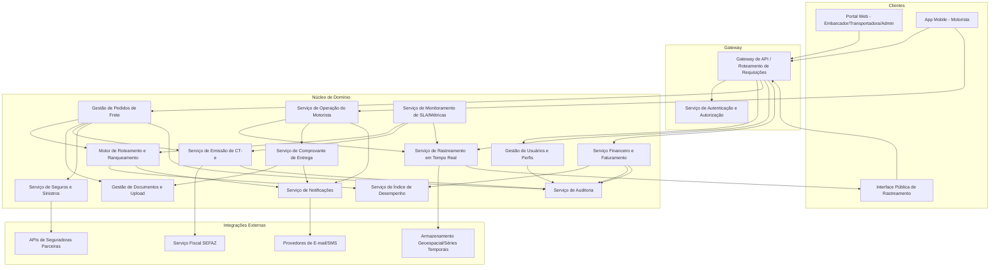
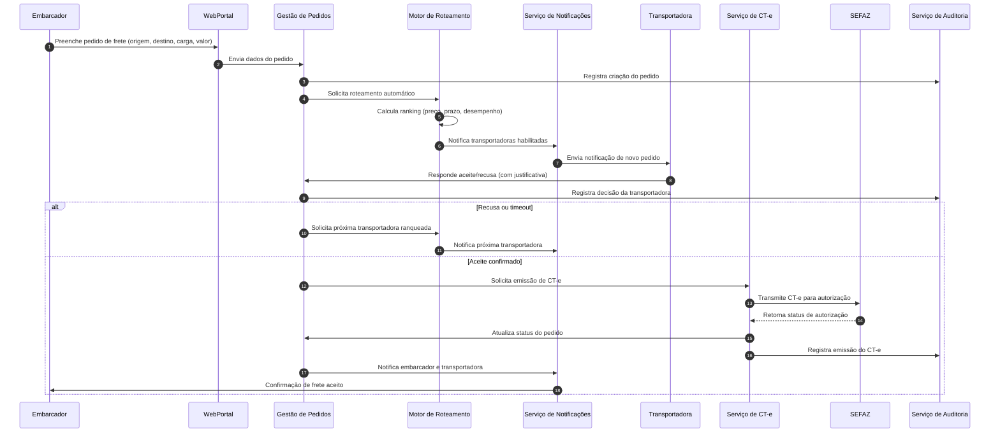
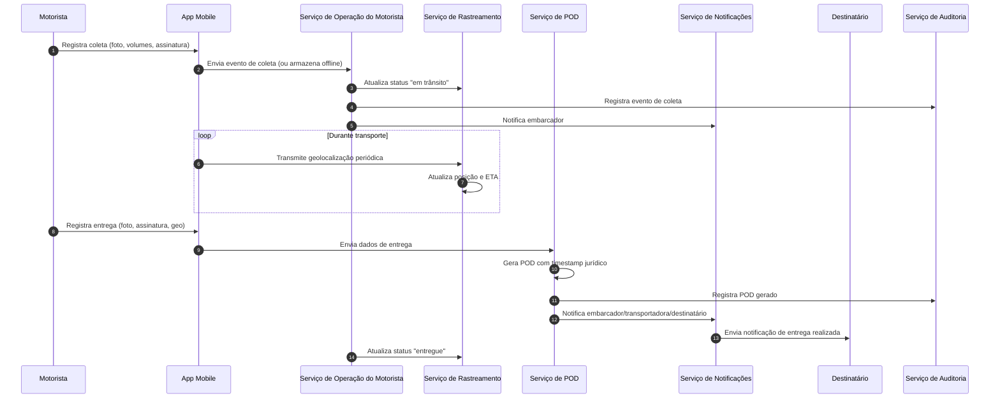

# Relatório Técnico de Arquitetura de Software
## Plataforma de Gestão de Transporte de Cargas (G04)

---

## 1. Identificação das HUs

| HU | Título | Perfil | RFs Relacionados |
|----|--------|--------|-------------------|
| HU01 | Registrar pedido de frete | Embarcador | RF05, RF06, RF09, RF10 |
| HU02 | Selecionar transportadora e contratar seguro | Embarcador | RF11, RF12, RF13, RF17, RF41 |
| HU03 | Acompanhar pedidos e receber comprovante de entrega | Embarcador | RF07, RF33, RF34, RF37, RF39 |
| HU04 | Abrir sinistro por avaria ou extravio | Embarcador | RF42, RF43, RF44 |
| HU05 | Aceitar pedidos de frete e gerenciar frota | Transportadora | RF13, RF14, RF15, RF03 |
| HU06 | Acompanhar operação dos motoristas em tempo real | Transportadora | RF25, RF26, RF31, RF32 |
| HU07 | Consultar demonstrativo financeiro de repasse | Transportadora | RF46, RF48 |
| HU08 | Executar coleta com registro de evidências | Motorista | RF23, RF24, RF26 |
| HU09 | Registrar entrega com assinatura digital | Motorista | RF27, RF28, RF37, RF38, RF40 |
| HU10 | Registrar ocorrência durante transporte | Motorista | RF26, RF35 |
| HU11 | Rastrear carga em tempo real sem cadastro | Destinatário | RF30, RF31, RF32 |
| HU12 | Receber notificações de cada etapa | Destinatário | RF33 |
| HU13 | Monitorar SLA de fretes e acionar contingência | Administrador | RF36, RF15, RF16 |
| HU14 | Acompanhar painel financeiro da plataforma | Administrador | RF49 |

---

## 2. Diagramas de Arquitetura (Mermaid)

### 2.1 Diagrama de Componentes (Visão Macro)

### 2.2 Diagrama de Sequência — Fluxo Principal (Pedido → Aceite → CT-e)

### 2.3 Diagrama de Sequência — Coleta, Entrega e POD

---

## 3. Decisões de Arquitetura

| # | Decisão | Justificativa |
|---|---------|----------------|
| D01 | Arquitetura orientada a serviços com domínios de negócio isolados (Pedidos, Roteamento, CT-e, Rastreamento, Financeiro, Seguros) | Permite evolução independente de módulos com alto acoplamento regulatório (CT-e, seguros) sem afetar módulos operacionais (rastreamento, mobile). |
| D02 | Gateway de API único como ponto de entrada para clientes web e mobile | Centraliza autenticação, controle de perfil (RF02) e facilita auditoria (RF04). |
| D03 | Serviço de Rastreamento desacoplado do núcleo transacional, com armazenamento otimizado para dados geoespaciais/temporais | Atende RNF15, RNF16, RNF23 — alto volume de eventos de posição sem impactar desempenho transacional. |
| D04 | Comunicação assíncrona baseada em eventos entre Roteamento, Notificações e Operação do Motorista | Necessário para reação a timeouts (RF15), notificações multi-perfil (RF33-36) e resiliência offline (RF28, RNF17). |
| D05 | Serviço de Auditoria centralizado e imutável, consumido por todos os domínios críticos | Atende RF04, RNF11 (trilha imutável, retenção 5 anos). |
| D06 | Integrações externas (SEFAZ, Seguradoras, Notificação) isoladas por adaptadores de contrato versionado | Atende RNF24, permite substituição/atualização sem impacto no núcleo. |
| D07 | Aplicativo do motorista com camada de persistência local e fila de sincronização | Atende RF28, RNF17 — garantia de não perda de eventos offline. |
| D08 | Serviço de POD independente, gerando documento com timestamp de validade jurídica antes de disponibilizar downloads | Atende RF37, RF38, RNF10. |
| D09 | Modelo de autenticação diferenciado por canal: MFA para perfis administrativos/embarcador, token de sessão renovável para motorista, token único de acesso público para rastreamento | Atende RNF03, RNF04, RNF05 sem exigir cadastro do destinatário (RF30). |
| D10 | Painel de Monitoramento/Métricas como serviço transversal, consumindo indicadores de todos os domínios | Atende RNF25, HU13, HU14. |

---

## 4. Tabela de Componentes e Rastreabilidade

| Componente | Responsabilidade Principal | Comunica-se com | Origem (HU / Critério de Aceite) |
|---|---|---|---|
| Gestão de Usuários e Perfis | Cadastro e controle de perfis, vínculo transportadora-motorista-veículo | Gateway, Auditoria | RF01-RF04 |
| Serviço de Autenticação e Autorização | Autenticação, MFA, tokens de sessão e tokens públicos | Gateway, todos os clientes | RNF03, RNF04, RNF05 |
| Gestão de Pedidos de Frete | Registro, status, cancelamento e consolidação de pedidos | Motor de Roteamento, Documentos, CT-e, Auditoria | HU01, HU03, RF05-RF09 |
| Motor de Roteamento e Ranqueamento | Seleção automática de transportadoras, cálculo comparativo, reoferta em recusa | Pedidos, Índice de Desempenho, Notificações | HU02, HU05, RF10-RF15 |
| Serviço de Índice de Desempenho | Atualização contínua de métricas de transportadoras | Motor de Roteamento, Financeiro | RF16 |
| Gestão de Documentos e Upload | Armazenamento de NF-e, fichas técnicas, laudos | Pedidos, Sinistros, POD | RF09, HU04 |
| Serviço de Emissão de CT-e | Geração, transmissão, contingência e cancelamento de CT-e | SEFAZ, Pedidos, Auditoria | RF17-RF22, RNF07, RNF08 |
| Serviço de Operação do Motorista | Ordens do dia, coleta, ocorrências, entrega, rotas | App Mobile, Rastreamento, POD, Notificações | HU08, HU09, HU10, RF23-RF29 |
| Serviço de Rastreamento em Tempo Real | Ingestão de geolocalização, ETA dinâmico, histórico de eventos | Armazenamento Geoespacial, Interface Pública | HU06, HU11, RF25, RF30-RF32 |
| Serviço de Notificações | Disparo de e-mail/SMS/push para todos os perfis | Todos os domínios de negócio | HU12, RF33-RF36 |
| Serviço de Comprovante de Entrega (POD) | Consolidação de assinatura, foto, geo e timestamp jurídico | Operação do Motorista, Documentos, Notificações | HU09, RF37-RF40 |
| Serviço de Seguros e Sinistros | Cotação, contratação, abertura e acompanhamento de sinistros | Seguradoras, Documentos, Notificações | HU04, RF41-RF44 |
| Serviço Financeiro e Faturamento | Cálculo de frete, comissão, faturas e repasses | Índice de Desempenho, Auditoria | HU07, HU14, RF45-RF49 |
| Serviço de Auditoria | Registro imutável de operações críticas | Todos os domínios | RF04, RNF11 |
| Serviço de Monitoramento de SLA/Métricas | Painel de indicadores operacionais e alertas de risco | Roteamento, CT-e, Rastreamento | HU13, RF36, RNF25 |
| Interface Pública de Rastreamento | Exibição de mapa e histórico sem autenticação | Serviço de Rastreamento | HU11, RF30 |
| Aplicativo Mobile do Motorista | Interface offline-first para operação em campo | Serviço de Operação do Motorista | RNF17-RNF21 |

---

## 5. Bloqueios e Pendências

| # | Descrição | Impacto | Responsável Sugerido |
|---|---|---|---|
| B01 | Não há definição de política de cancelamento configurável (RF08) — regras específicas de prazo/multa não detalhadas | Bloqueia implementação do fluxo de cancelamento | Time de Negócio/Produto |
| B02 | Critérios de configuração do roteamento (RF11/RF12) não especificam pesos padrão nem regras de aceite automático | Impacta design do Motor de Roteamento | Time de Negócio |
| B03 | Não há detalhamento do processo de contingência de CT-e offline (RF19) quanto à sincronização e reprocessamento de falhas | Risco de inconsistência fiscal | Especialista Fiscal/SEFAZ |
| B04 | Ausência de definição de SLA/tempo de expiração do token de rastreamento público (RNF05) | Bloqueia design de segurança da interface pública | Time de Segurança |
| B05 | Não há especificação de formato/schema para dados de sinistro trocados com seguradoras (RF41-44) | Impacta contrato de integração | Time de Integrações |
| B06 | Falta definição de regras de inadimplência e cobrança para o painel financeiro do administrador (RF49) | Impacta modelagem do domínio financeiro | Time Financeiro |

---

## 6. Cobertura de Requisitos

| Categoria | RFs/RNFs Cobertos | Observações |
|---|---|---|
| Gestão de Usuários e Acesso | RF01-RF04 | Totalmente coberto por Gestão de Usuários + Autenticação + Auditoria |
| Pedidos de Frete | RF05-RF09 | Coberto por Gestão de Pedidos + Documentos |
| Roteamento e Seleção | RF10-RF16 | Coberto por Motor de Roteamento + Índice de Desempenho |
| CT-e | RF17-RF22 | Coberto por Serviço de CT-e; pendência de detalhamento de contingência (B03) |
| Operação do Motorista | RF23-RF29 | Coberto por Serviço de Operação + App Mobile offline-first |
| Rastreamento | RF30-RF32 | Coberto por Serviço de Rastreamento + Interface Pública |
| Notificações | RF33-RF36 | Coberto por Serviço de Notificações |
| POD | RF37-RF40 | Coberto por Serviço de POD |
| Seguros e Sinistros | RF41-RF44 | Coberto parcialmente; pendência de schema de integração (B05) |
| Financeiro | RF45-RF49 | Coberto por Serviço Financeiro; pendência de regras de inadimplência (B06) |
| Segurança (RNF01-06) | Coberto | Autenticação diferenciada por canal, criptografia em repouso e trânsito |
| Conformidade (RNF07-11) | Coberto | CT-e e POD com atenção jurídica; auditoria imutável |
| Desempenho/Disponibilidade (RNF12-17) | Coberto | Rastreamento e roteamento com SLAs definidos no design |
| Usabilidade/Compatibilidade (RNF18-21) | Coberto | Requisitos de UX mobile atendidos no design do App |
| Infraestrutura (RNF22-25) | Coberto | Backup, armazenamento geoespacial, contratos versionados e monitoramento |

---

## 7. Gap Analysis

| # | Lacuna Identificada | Impacto Arquitetural | Ação Recomendada |
|---|---|---|---|
| G01 | Ausência de regras claras de precificação e comissão (RF45-46) | Modelagem do domínio financeiro pode exigir retrabalho | Levantar especificação detalhada de tabelas de preço e regras de comissão com stakeholders de negócio |
| G02 | Falta de definição do algoritmo/pesos do ranqueamento de transportadoras (RF11) | Motor de Roteamento pode requerer refatoração ao mudar critérios | Definir matriz de critérios configuráveis e pesos em documento de regras de negócio |
| G03 | Não há especificação de formato/versão do webhook ou API de retorno da SEFAZ para status assíncrono do CT-e | Risco de acoplamento incorreto no adaptador de integração | Levantar contrato técnico junto ao provedor de emissão de CT-e |
| G04 | Ausência de detalhamento sobre retenção e expurgo de dados de geolocalização além do RNF22 (backup) | Pode gerar crescimento não controlado da base de séries temporais | Definir política de retenção/expurgo específica para dados de rastreamento |
| G05 | Não há requisito explícito sobre reconciliação de eventos duplicados em sincronização offline do motorista (RF28) | Risco de inconsistência de estado (ex.: duas confirmações de entrega) | Especificar estratégia de idempotência e resolução de conflitos no serviço de sincronização |
| G06 | Ausência de requisito sobre versionamento/histórico de alterações em cadastro de veículos/motoristas (RF03) | Dificulta auditoria de mudanças de frota | Avaliar necessidade de histórico versionado no domínio de Gestão de Usuários |
| G07 | Não há SLA definido para resposta das seguradoras parceiras (RF41-43) | Pode comprometer experiência do embarcador em sinistros | Incluir SLA contratual como critério de aceite em integração com seguradoras |
| G08 | Ausência de requisito de internacionalização/multi-moeda, assumindo operação apenas nacional | Baixo risco atual, mas limita expansão futura | Documentar como fora de escopo explícito ou item de roadmap futuro |