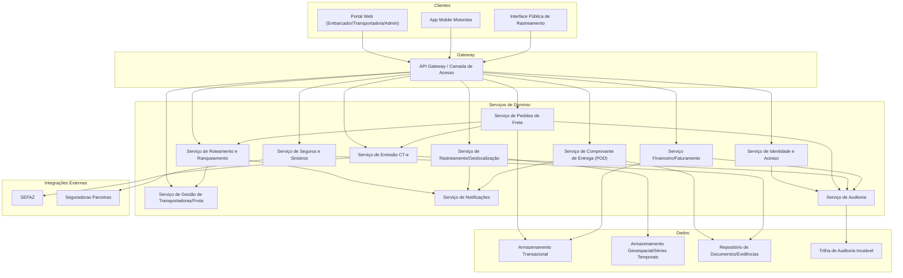
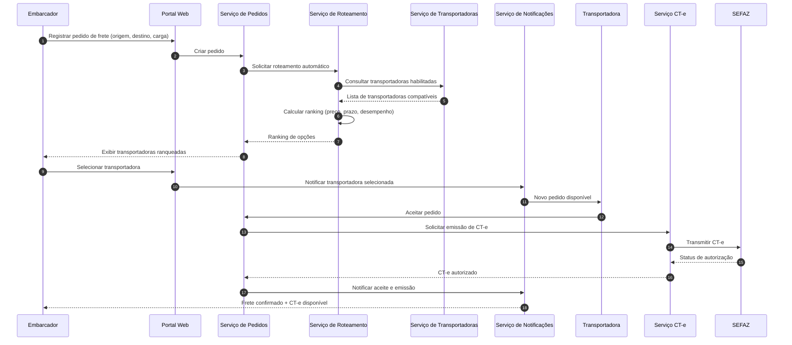
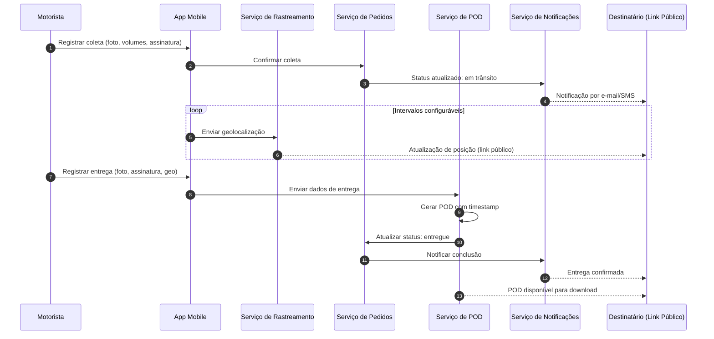

# Relatório Técnico de Arquitetura de Software
## Plataforma de Gestão de Transporte de Cargas (G04)

---

## 1. Identificação das HUs

| HU | Título | Perfil | RFs Relacionados |
|----|--------|--------|-------------------|
| HU01 | Registrar pedido de frete | Embarcador | RF05, RF06, RF09, RF10 |
| HU02 | Selecionar transportadora e contratar seguro | Embarcador | RF11, RF12, RF17, RF41 |
| HU03 | Acompanhar pedidos e receber comprovante de entrega | Embarcador | RF07, RF33, RF34, RF37, RF39 |
| HU04 | Abrir sinistro por avaria ou extravio | Embarcador | RF42, RF43, RF44 |
| HU05 | Aceitar pedidos de frete e gerenciar frota | Transportadora | RF13, RF14, RF15 |
| HU06 | Acompanhar operação dos motoristas em tempo real | Transportadora | RF25, RF26, RF32 |
| HU07 | Consultar demonstrativo financeiro de repasse | Transportadora | RF46, RF48 |
| HU08 | Executar coleta com registro de evidências | Motorista | RF24, RF26 |
| HU09 | Registrar entrega com assinatura digital do destinatário | Motorista | RF27, RF28, RF37, RF38, RF40 |
| HU10 | Registrar ocorrência durante o transporte | Motorista | RF26, RF35, RF34 |
| HU11 | Rastrear carga em tempo real sem cadastro | Destinatário | RF30, RF31, RF32, RNF05 |
| HU12 | Receber notificações de cada etapa da entrega | Destinatário | RF33 |
| HU13 | Monitorar SLA de fretes e acionar contingência | Administrador | RF36, RF15, RF16 |
| HU14 | Acompanhar painel financeiro da plataforma | Administrador | RF49 |

---

## 2. Diagramas de Arquitetura (Mermaid)

### 2.1 Diagrama de Componentes (Visão Macro)

### 2.2 Diagrama de Sequência: Fluxo de Pedido → Roteamento → Aceite → CT-e (HU01/HU02/HU05)

### 2.3 Diagrama de Sequência: Coleta, Rastreamento e Entrega (HU08/HU09/HU11)

---

## 3. Decisões de Arquitetura

| # | Decisão | Justificativa | Requisitos Relacionados |
|---|---------|----------------|--------------------------|
| D01 | Arquitetura orientada a serviços de domínio desacoplados (Pedidos, Roteamento, CT-e, Rastreamento, Notificações, POD, Seguros, Financeiro) | Permite evolução e escalabilidade independente por área funcional, especialmente crítica para rastreamento em alto volume | RNF16, RNF24 |
| D02 | Camada de API Gateway única para todos os clientes (Web, Mobile, Link Público) | Centraliza autenticação, controle de acesso por perfil e rate-limiting | RF02, RNF01, RNF05 |
| D03 | Armazenamento de geolocalização segregado em base otimizada para dados espaço-temporais | Requisito explícito de otimização para séries temporais/geoespaciais | RNF23, RF25, RF32 |
| D04 | Integrações externas (SEFAZ, Seguradoras) via contratos de API versionados e isolados em serviços dedicados | Permite atualização independente sem impacto no core, essencial dada a volatilidade do leiaute CT-e | RNF24, RF17-RF21, RF41 |
| D05 | Serviço de Auditoria centralizado, alimentado por eventos de todos os domínios, com trilha imutável | Atende exigência de auditoria de operações críticas e retenção fiscal | RF04, RNF11 |
| D06 | App Mobile do motorista com camada de persistência local e fila de sincronização para operação offline completa | Requisito crítico de não perda de eventos sem conectividade | RF28, RNF17 |
| D07 | Serviço de Notificações desacoplado, orientado a eventos, consumido por múltiplos domínios (Roteamento, Rastreamento, POD, Sinistros) | Evita acoplamento direto entre domínios e centraliza políticas de envio (e-mail/SMS) | RF33-RF36 |
| D08 | Link de rastreamento público implementado como interface isolada, sem exigir autenticação, mas validado por token único com expiração | Atende requisito de acesso sem cadastro com segurança | RF30, RNF05 |
| D09 | Serviço de Roteamento como componente de decisão configurável (regras de ranking, timeout de aceite, reoferta automática) | Permite ajuste de critérios de negócio sem alteração estrutural | RF11, RF12, RF15, RNF13 |
| D10 | POD tratado como serviço próprio, gerando artefato jurídico com timestamp qualificado, independente do fluxo operacional de entrega | Isola responsabilidade de conformidade legal (Lei 14.063/2020) | RF37, RF38, RNF10 |
| D11 | Painel de métricas operacionais como camada transversal de observabilidade, consumindo eventos de todos os serviços | Requisito de monitoramento em tempo real de indicadores diversos | RNF25 |

---

## 4. Tabela de Componentes e Rastreabilidade

| Componente | Responsabilidade Principal | Comunica-se com | Origem (HU / Critério de Aceite) |
|------------|------------------------------|------------------|-------------------------------------|
| Serviço de Identidade e Acesso | Autenticação, autorização por perfil, MFA, gestão de sessão mobile | API Gateway, Serviço de Auditoria | RF01-RF04, RNF03, RNF04 |
| Serviço de Pedidos de Frete | CRUD de pedidos, status consolidado, cancelamento, upload de documentos | Serviço de Roteamento, CT-e, Notificações | HU01, HU03 (RF05-RF09) |
| Serviço de Roteamento e Ranqueamento | Seleção de transportadoras compatíveis, cálculo de ranking, reoferta automática | Serviço de Transportadoras, Notificações | HU01, HU02, HU05 (RF10-RF16) |
| Serviço de Gestão de Transportadoras/Frota | Cadastro de motoristas/veículos, índice de desempenho | Serviço de Roteamento, Auditoria | HU05 (RF03, RF16) |
| Serviço de Emissão CT-e | Geração, transmissão, contingência e cancelamento de CT-e | SEFAZ, Serviço de Pedidos, Auditoria | HU02 (RF17-RF22) |
| Serviço de Rastreamento/Geolocalização | Captura, armazenamento e distribuição de posição em tempo real | App Mobile, Interface Pública, Notificações | HU06, HU11 (RF25, RF30-RF32) |
| Serviço de Notificações | Disparo de e-mail/SMS/push conforme eventos de domínio | Todos os serviços de domínio | HU03, HU10, HU12 (RF33-RF36) |
| Serviço de Comprovante de Entrega (POD) | Consolidação de assinatura, foto, geo e timestamp jurídico | Serviço de Pedidos, Repositório de Documentos | HU09 (RF37-RF40) |
| Serviço de Seguros e Sinistros | Cotação, contratação, abertura e acompanhamento de sinistros | Seguradoras, Repositório de Documentos | HU04 (RF41-RF44) |
| Serviço Financeiro/Faturamento | Cálculo de frete, comissão, faturas e repasses | Serviço de Pedidos, Painel Administrativo | HU07, HU14 (RF45-RF49) |
| Serviço de Auditoria | Registro imutável de operações críticas | Todos os serviços de domínio | RF04, RNF11 |
| App Mobile do Motorista | Coleta, entrega, ocorrências, rotas, operação offline | Serviço de Rastreamento, Pedidos, POD | HU08, HU09, HU10 (RF23-RF29) |
| Interface Pública de Rastreamento | Exibição de mapa e histórico sem autenticação, via token | Serviço de Rastreamento, Notificações | HU11, HU12 (RF30-RF33) |
| Painel Administrativo | Monitoramento de SLA, alertas, painel financeiro consolidado | Serviço de Roteamento, Financeiro, Notificações | HU13, HU14 (RF36, RF49) |
| Repositório de Documentos/Evidências | Armazenamento estruturado de fotos, laudos, PODs, NF-e | Serviço de Pedidos, POD, Sinistros | RF09, RF44 |
| API Gateway | Ponto único de entrada, roteamento de requisições, controle de acesso | Todos os clientes e serviços | RF02, RNF01 |

---

## 5. Bloqueios e Pendências

| # | Descrição | Impacto | Responsável Sugerido |
|---|-----------|---------|------------------------|
| B01 | Não há definição de qual(is) provedor(es) de emissão de CT-e serão homologados nem SLA de disponibilidade da SEFAZ | Impacta contrato de integração e estratégia de contingência (RF19) | Time de Integrações Fiscais |
| B02 | Política de cancelamento de pedido (RF08) não especifica regras de prazo/multas — depende de "configuração" não detalhada | Impacta modelagem de regras de negócio do Serviço de Pedidos | Product Owner |
| B03 | Critérios exatos de cálculo do índice de desempenho da transportadora (RF16) não são detalhados (pesos, fórmula) | Impacta algoritmo do Serviço de Roteamento | Especialista de Negócio |
| B04 | Não há definição do intervalo padrão de captura de geolocalização (RF25) nem estratégia de throttling para alto volume | Impacta dimensionamento do Serviço de Rastreamento | Arquitetura + Operações |
| B05 | Ausência de especificação sobre o formato/prazo de validade jurídica do timestamp do POD (RNF10) — depende de prestador de carimbo de tempo qualificado | Impacta conformidade legal do Serviço de POD | Jurídico + Compliance |
| B06 | Não há definição de quais seguradoras parceiras serão integradas nem formato de contrato de API (RF41) | Impacta Serviço de Seguros e Sinistros | Time de Integrações |
| B07 | Regras de reassignação manual pelo Administrador (HU13) não definem limites de tentativas nem escalonamento | Impacta Painel Administrativo e Serviço de Roteamento | Product Owner |

---

## 6. Cobertura de Requisitos

| Categoria | RFs/RNFs Cobertos | Observação |
|-----------|--------------------|------------|
| Gestão de Usuários e Acesso | RF01-RF04 | Cobertos por Serviço de Identidade + Auditoria |
| Pedidos de Frete | RF05-RF09 | Cobertos por Serviço de Pedidos |
| Roteamento e Seleção | RF10-RF16 | Cobertos por Serviço de Roteamento + Transportadoras |
| CT-e | RF17-RF22 | Cobertos por Serviço CT-e + integração SEFAZ |
| Operação do Motorista | RF23-RF29 | Cobertos por App Mobile + Rastreamento |
| Rastreamento em Tempo Real | RF30-RF32 | Cobertos por Serviço de Rastreamento + Interface Pública |
| Notificações | RF33-RF36 | Cobertos por Serviço de Notificações |
| POD | RF37-RF40 | Cobertos por Serviço de POD |
| Seguros e Sinistros | RF41-RF44 | Cobertos por Serviço de Seguros |
| Financeiro | RF45-RF49 | Cobertos por Serviço Financeiro + Painel Admin |
| Segurança (RNF01-RNF06) | Total | Cobertos por API Gateway, Identidade, Rastreamento |
| Conformidade (RNF07-RNF11) | Total | Cobertos por CT-e, POD, Auditoria |
| Disponibilidade/Desempenho (RNF12-RNF17) | Total | Cobertos por decisões arquiteturais de desacoplamento e observabilidade |
| Usabilidade/Compatibilidade (RNF18-RNF21) | Parcial | Requisitos de UI/UX não detalhados neste nível arquitetural (ver Gap Analysis) |
| Infraestrutura e Dados (RNF22-RNF25) | Total | Cobertos por Repositório de Documentos, GeoDB, Painel de Métricas |

**Cobertura geral estimada: 100% dos RFs mapeados a pelo menos um componente; RNFs de usabilidade cobertos apenas conceitualmente (fora do escopo de arquitetura de backend).**

---

## 7. Gap Analysis

| # | Lacuna Identificada | Impacto Arquitetural | Ação Recomendada |
|---|----------------------|------------------------|---------------------|
| G01 | Ausência de modelo de dados detalhado para eventos de rastreamento (schema de eventos, granularidade) | Dificulta dimensionamento do armazenamento geoespacial e consultas de histórico (RF31) | Definir modelo de evento canônico (tipo, timestamp, payload) antes da implementação |
| G02 | Não há especificação de política de retry/circuit breaker para integrações externas (SEFAZ, Seguradoras) | Risco de indisponibilidade em cascata durante falhas externas | Especificar estratégia de resiliência e fallback (contingência já prevista apenas para CT-e) |
| G03 | Falta de definição sobre consentimento e direitos do titular (LGPD) para dados de motoristas e destinatários sem cadastro | Risco de não conformidade com RNF09 no fluxo de rastreamento público | Detalhar fluxo de consentimento/anonimização para HU11 |
| G04 | Não há requisito explícito sobre versionamento de tabelas de preço/comissão ao longo do tempo | Impacta auditabilidade de cálculos financeiros retroativos | Incluir requisito de histórico versionado de tabelas de preços |
| G05 | Ausência de definição de SLA/tempo de resposta para o Serviço de Notificações (e-mail/SMS) | Pode comprometer RNF13/RNF15 indiretamente se notificações atrasarem decisões críticas | Definir SLA de entrega de notificações e fila de prioridade |
| G06 | Não há detalhamento de como o app mobile prioriza sincronização de dados após reconexão (ordem de eventos) | Risco de inconsistência de estado (ex.: ocorrência registrada após entrega) | Especificar algoritmo de reconciliação de eventos offline por ordem cronológica |
| G07 | Ausência de requisito sobre observabilidade fim-a-fim do fluxo de aceite de transportadora (tempo entre notificação e resposta) | Dificulta atendimento pleno de RNF25 | Adicionar métrica específica de "tempo médio de aceite" ao painel de monitoramento |
| G08 | Não há definição de multi-tenancy ou isolamento de dados entre diferentes transportadoras/embarcadores | Risco de vazamento de dados entre clientes da plataforma | Definir estratégia de segregação lógica de dados por tenant |