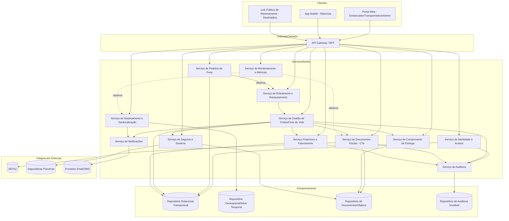
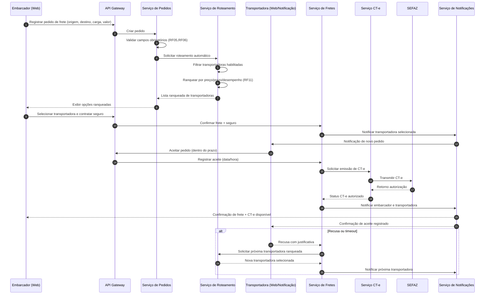
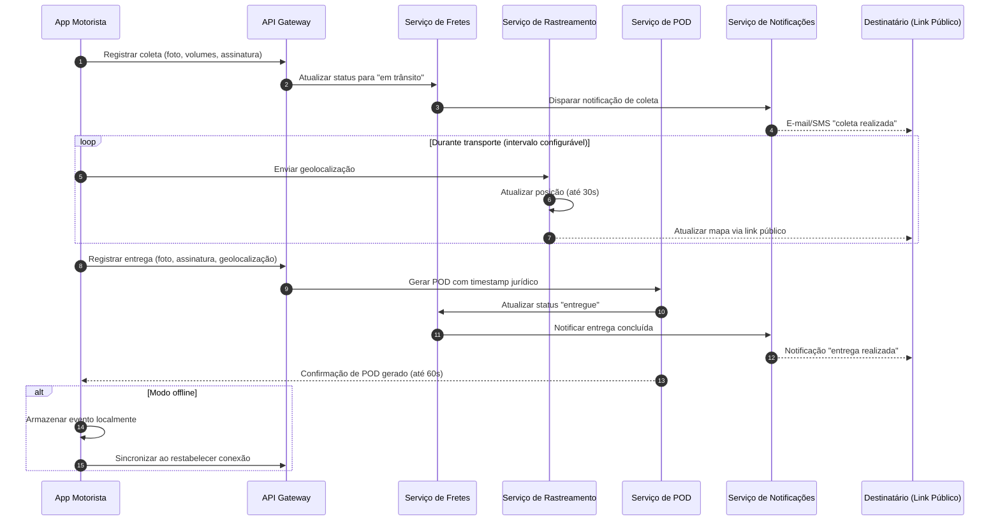

# Relatório Técnico de Arquitetura de Software
## Plataforma de Gestão de Transporte de Cargas (G04)

---

## 1. Identificação das HUs

| HU | Título | Perfil | RFs Relacionados |
|----|--------|--------|-------------------|
| HU01 | Registrar pedido de frete | Embarcador | RF05, RF06, RF09, RF10 |
| HU02 | Selecionar transportadora e contratar seguro | Embarcador | RF11, RF12, RF17, RF41 |
| HU03 | Acompanhar pedidos e receber comprovante de entrega | Embarcador | RF07, RF31, RF33, RF37, RF39 |
| HU04 | Abrir sinistro por avaria ou extravio | Embarcador | RF42, RF43, RF44 |
| HU05 | Aceitar pedidos de frete e gerenciar frota | Transportadora | RF03, RF13, RF14, RF15 |
| HU06 | Acompanhar operação dos motoristas em tempo real | Transportadora | RF25, RF26, RF32, RF35 |
| HU07 | Consultar demonstrativo financeiro de repasse | Transportadora | RF46, RF48 |
| HU08 | Executar coleta com registro de evidências | Motorista | RF23, RF24, RF26 |
| HU09 | Registrar entrega com assinatura digital do destinatário | Motorista | RF27, RF28, RF37, RF38, RF40 |
| HU10 | Registrar ocorrência durante o transporte | Motorista | RF26, RF34, RF35 |
| HU11 | Rastrear carga em tempo real sem cadastro | Destinatário | RF30, RF31, RF32 |
| HU12 | Receber notificações de cada etapa da entrega | Destinatário | RF33 |
| HU13 | Monitorar SLA de fretes e acionar contingência | Administrador | RF15, RF36 |
| HU14 | Acompanhar painel financeiro da plataforma | Administrador | RF49 |

---

## 2. Diagramas de Arquitetura (Mermaid)

### 2.1 Diagrama de Componentes (Visão Macro)

### 2.2 Diagrama de Sequência — Fluxo Pedido → Roteamento → Aceite → CT-e (HU01, HU02, HU05)

### 2.3 Diagrama de Sequência — Coleta, Rastreamento e Entrega (HU08, HU09, HU11)

---

## 3. Decisões de Arquitetura

| # | Decisão | Justificativa | Requisitos Relacionados |
|---|---------|----------------|--------------------------|
| D1 | Arquitetura orientada a serviços desacoplados por domínio de negócio (Pedidos, Roteamento, Fretes, Documentos Fiscais, Rastreamento, Financeiro, Seguros, Notificações) | Permite evolução e escala independente, especialmente crítico para rastreamento (alto volume) e integrações fiscais (alta conformidade) | RNF16, RNF24 |
| D2 | Comunicação assíncrona baseada em eventos entre serviços de ciclo de vida do frete (aceite, coleta, entrega, ocorrência) | Reduz acoplamento temporal, permite notificações e auditoria reagirem sem bloquear o fluxo principal | RF13-RF16, RF33-RF36 |
| D3 | Camada de API Gateway/BFF única para clientes (Web, Mobile, Link Público) | Centraliza autenticação, autorização por perfil e limita superfície de ataque | RF02, RNF01, RNF05 |
| D4 | Serviço de Rastreamento isolado com armazenamento otimizado para dados geoespaciais/série temporal | Requisito explícito de performance e volume de atualizações contínuas | RF25, RNF15, RNF16, RNF23 |
| D5 | Serviço de Documentos Fiscais (CT-e) com integração via contrato de API versionado e suporte a modo de contingência local | Conformidade regulatória SEFAZ exige resiliência e independência de disponibilidade externa | RF17-RF21, RNF07, RNF08, RNF24 |
| D6 | Serviço de Auditoria centralizado e append-only, alimentado por eventos de todos os serviços críticos | Necessidade de trilha imutável para operações financeiras/fiscais com retenção de 5 anos | RF04, RNF11 |
| D7 | App Mobile do Motorista com persistência local e fila de sincronização (offline-first) | Requisito explícito de operação totalmente offline sem perda de eventos | RF28, RNF17 |
| D8 | Link de rastreamento público stateless, autenticado por token de escopo único e com expiração | Evita exposição de dados de outros fretes sem exigir cadastro do destinatário | RF30, RNF05 |
| D9 | Serviço de Notificações desacoplado com múltiplos canais (e-mail, SMS) consumindo eventos de domínio | Múltiplos perfis precisam ser notificados por eventos distintos sem acoplamento direto aos serviços de origem | RF33-RF36 |
| D10 | Serviço de Monitoramento/Métricas transversal, observando indicadores operacionais dos demais serviços | Requisito explícito de painel de métricas em tempo real | RNF25 |

---

## 4. Tabela de Componentes e Rastreabilidade

| Componente | Responsabilidade Principal | Comunica-se com | Origem (HU / Critério de Aceite) |
|------------|------------------------------|------------------|-------------------------------------|
| API Gateway / BFF | Autenticação, roteamento de requisições, controle de acesso por perfil | Todos os serviços de domínio | RF02, HU01-HU14 (todas) |
| Serviço de Identidade e Acesso | Cadastro de usuários, perfis, vínculo motorista/veículo/transportadora, MFA | API Gateway, Auditoria | RF01, RF03, RNF03, RNF04 |
| Serviço de Pedidos de Frete | Registro, cancelamento e consolidação de pedidos, upload de documentos | Roteamento, Documentos, Notificações | HU01, RF05-RF09 |
| Serviço de Roteamento e Ranqueamento | Seleção automática de transportadoras, cálculo e comparação de fretes, reoferta em recusa | Pedidos, Fretes, Notificações | HU02, HU05, RF10-RF16 |
| Serviço de Gestão de Fretes (ciclo de vida) | Orquestra estados do frete (aceito, coletado, em trânsito, entregue, ocorrência) | Roteamento, CT-e, POD, Notificações, Financeiro, Seguros | HU02, HU03, HU05, HU08-HU10 |
| Serviço de Documentos Fiscais (CT-e) | Emissão, transmissão, contingência e cancelamento de CT-e junto à SEFAZ | Fretes, SEFAZ, Auditoria | RF17-RF22, HU02 |
| Serviço de Rastreamento e Geolocalização | Captura, armazenamento e disponibilização de posição em tempo real | App Motorista, Notificações, Link Público | HU06, HU11, RF25, RF30-RF32 |
| Serviço de Comprovante de Entrega (POD) | Geração e armazenamento de POD com timestamp jurídico | Fretes, Repositório de Documentos | HU09, RF37-RF40 |
| Serviço de Seguros e Sinistros | Cotação, contratação, abertura e acompanhamento de sinistros | Fretes, Seguradoras externas, Notificações | HU02, HU04, RF41-RF44 |
| Serviço Financeiro e Faturamento | Cálculo de frete, comissão, fatura e repasse | Fretes, Painel Admin | HU07, HU14, RF45-RF49 |
| Serviço de Notificações | Disparo de e-mail/SMS/push para todos os perfis conforme eventos | Fretes, Rastreamento, Roteamento, Seguros | HU03, HU05, HU10, HU12, RF33-RF36 |
| Serviço de Auditoria | Registro imutável de ações críticas de todos os serviços | Identidade, Fretes, Documentos Fiscais, Financeiro | RF04, RNF11 |
| Serviço de Monitoramento e Métricas | Coleta e exposição de métricas operacionais em painel | Roteamento, CT-e, Rastreamento | RNF25, HU13 |
| App Mobile do Motorista | Interface de coleta, entrega, ocorrência, rota, operação offline | API Gateway (via sincronização) | HU08, HU09, HU10, RF23-RF29 |
| Portal Web (Embarcador/Transportadora/Admin) | Interfaces de gestão, acompanhamento e painéis | API Gateway | HU01-HU07, HU13, HU14 |
| Link Público de Rastreamento | Interface stateless para destinatário sem cadastro | Serviço de Rastreamento, Notificações | HU11, HU12, RF30 |
| Repositório Geoespacial/Série Temporal | Armazenamento de posições e histórico de eventos de localização | Serviço de Rastreamento | RNF23, RF25, RF32 |
| Repositório de Documentos/Objetos | Armazenamento de NF-e, DACTE, POD, laudos de sinistro | Documentos Fiscais, POD, Seguros | RF09, RF22, RF39, RF44 |
| Repositório de Auditoria Imutável | Armazenamento de logs com retenção de longo prazo | Serviço de Auditoria | RNF11 |

---

## 5. Bloqueios e Pendências

| # | Descrição do Bloqueio/Pendência | Impacto | Responsável Sugerido |
|---|-----------------------------------|---------|------------------------|
| B1 | Não há definição do contrato/protocolo exato de integração com o serviço de emissão de CT-e (formato de request/response, SLA da SEFAZ em contingência) | Bloqueia detalhamento do Serviço de Documentos Fiscais | Time de Integração Fiscal |
| B2 | Critérios de "prazo configurado" para aceite de transportadora (RF15) e SLA em risco (RF36) não possuem valores/regras definidos | Impede parametrização do motor de regras de roteamento e monitoramento | Product Owner / Negócio |
| B3 | Não há definição de política de retenção/anonimização de dados de geolocalização após conclusão do frete (LGPD) | Risco de não conformidade com RNF09 | DPO / Jurídico |
| B4 | Modelo de dados para "índice de desempenho" da transportadora (RF16) não especifica fórmula ou pesos dos critérios | Impacta design do serviço de Roteamento e Ranqueamento | Product Owner |
| B5 | Não há definição de qual mecanismo garante validade jurídica do timestamp do POD (RNF10 / Lei 14.063/2020) — se selo de tempo próprio ou serviço externo | Impacta arquitetura do Serviço de POD e integrações externas | Jurídico / Arquitetura |
| B6 | Não há requisito claro sobre multi-tenancy/isolamento de dados entre diferentes transportadoras e embarcadores no mesmo ambiente | Impacta modelo de autorização e particionamento de dados | Arquitetura de Segurança |
| B7 | Ausência de definição sobre idioma/moeda/regionalização — assume-se operação nacional (Brasil) apenas | Impacta escopo de internacionalização, se aplicável futuramente | Product Owner |

---

## 6. Cobertura de Requisitos

| Categoria | RFs/RNFs Cobertos | Observação |
|-----------|--------------------|------------|
| Gestão de Usuários e Acesso | RF01-RF04 | Cobertos por Serviço de Identidade e Acesso + Auditoria |
| Pedidos de Frete | RF05-RF09 | Cobertos por Serviço de Pedidos |
| Roteamento e Seleção | RF10-RF16 | Cobertos por Serviço de Roteamento |
| CT-e | RF17-RF22 | Cobertos por Serviço de Documentos Fiscais |
| Operação do Motorista | RF23-RF29 | Cobertos por App Mobile + Serviço de Fretes/Rastreamento |
| Rastreamento em Tempo Real | RF30-RF32 | Cobertos por Serviço de Rastreamento + Link Público |
| Notificações | RF33-RF36 | Cobertos por Serviço de Notificações |
| POD | RF37-RF40 | Cobertos por Serviço de POD |
| Seguros e Sinistros | RF41-RF44 | Cobertos por Serviço de Seguros |
| Financeiro | RF45-RF49 | Cobertos por Serviço Financeiro |
| Segurança | RNF01-RNF06 | Cobertos por API Gateway + Identidade + design de token de rastreamento |
| Conformidade | RNF07-RNF11 | Cobertos por Documentos Fiscais + POD + Auditoria (parcial, ver B3, B5) |
| Disponibilidade/Desempenho | RNF12-RNF17 | Cobertos por decisões de desacoplamento e serviço de rastreamento dedicado |
| Usabilidade/Compatibilidade | RNF18-RNF21 | Requisitos de interface — a serem detalhados na camada de apresentação (fora do escopo arquitetural de backend) |
| Infraestrutura e Dados | RNF22-RNF25 | Cobertos por repositórios especializados e serviço de monitoramento |

**Cobertura geral estimada: 49/49 RFs endereçados arquiteturalmente; 25/25 RNFs endereçados, com 2 pendências de detalhamento (B3, B5).**

---

## 7. Gap Analysis

| # | Gap Identificado | Impacto Arquitetural | Ação Recomendada |
|---|--------------------|------------------------|----------------------|
| G1 | Ausência de especificação sobre motor de regras configurável (RF08, RF11, RF12, RF15) — não fica claro se é engine de regras genérico ou lógica fixa por serviço | Definição tardia pode gerar acoplamento rígido no Serviço de Roteamento | Especificar um componente de "Motor de Regras" desacoplado, parametrizável por configuração, consumido por Pedidos/Roteamento/Fretes |
| G2 | Não há requisito de versionamento de tabela de preços por transportadora (RF45) | Risco de inconsistência no cálculo de fretes históricos vs. atuais | Adicionar histórico versionado de tabelas de preço ao Serviço Financeiro |
| G3 | Falta de definição sobre reconciliação entre eventos offline do motorista e estado atual do frete em caso de conflito (ex: duas atualizações concorrentes) | Pode gerar inconsistência de estado no Serviço de Fretes | Definir estratégia de resolução de conflito (ex: last-write-wins com timestamp de origem, ou fila ordenada por evento) |
| G4 | Ausência de requisito sobre como o histórico de desempenho da transportadora (RF16) é recalculado — em tempo real ou batch | Impacta escolha entre processamento síncrono/assíncrono no Roteamento | Definir job de recalculação periódica assíncrona alimentado por eventos de entrega/ocorrência |
| G5 | Não há menção a testes de carga/volume esperado (nº de motoristas simultâneos, frequência de geolocalização) | Impede dimensionamento adequado do Serviço de Rastreamento | Solicitar ao Produto estimativas de volume (motoristas ativos, frequência de ping) para dimensionamento de capacidade |
| G6 | Falta de requisito sobre versionamento/deprecação de contratos de API para integrações externas (RNF24 menciona versionamento mas não política) | Risco de quebra ao evoluir integrações com SEFAZ/seguradoras | Definir política de versionamento semântico e prazo de suporte a versões antigas |
| G7 | Ausência de requisito sobre disaster recovery cross-region (apenas backup é mencionado) | Risco à disponibilidade de 99,5% (RNF12) em cenário de falha regional | Avaliar necessidade de estratégia de recuperação de desastre com RTO definido, a validar com stakeholders |
| G8 | Não há definição do fluxo de estorno/cancelamento financeiro em caso de cancelamento de pedido após emissão parcial de documentos | Impacta consistência entre Serviço Financeiro e Documentos Fiscais | Especificar fluxo de compensação financeira e fiscal para cancelamentos tardios |