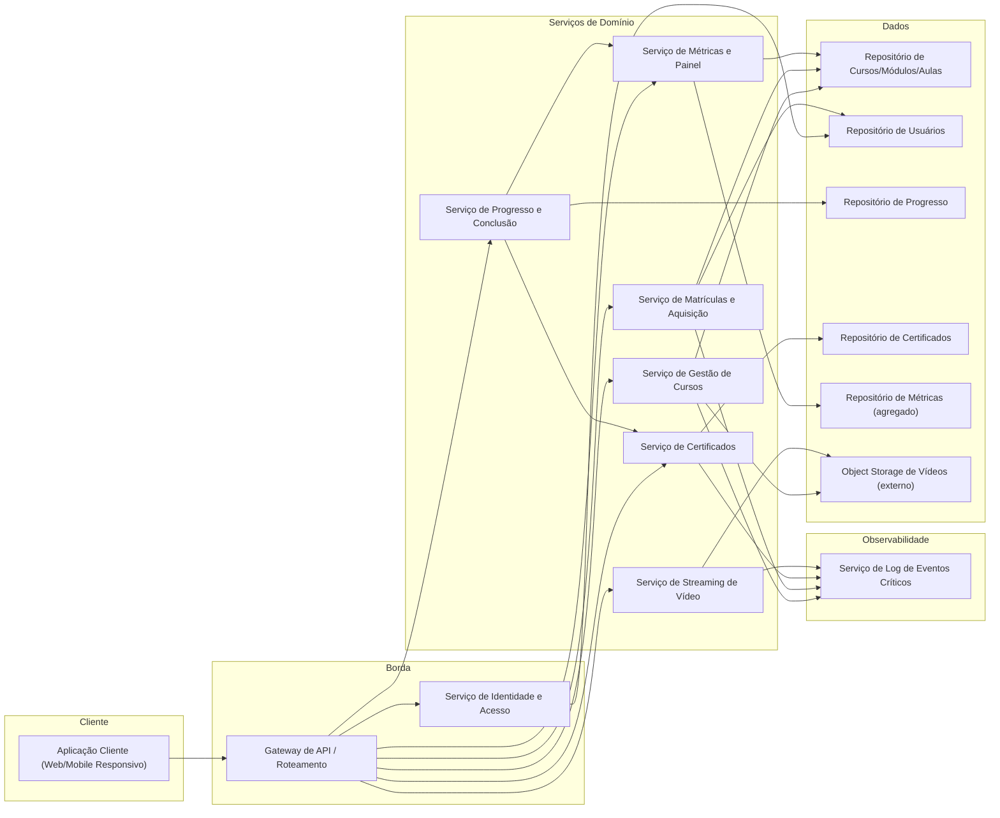
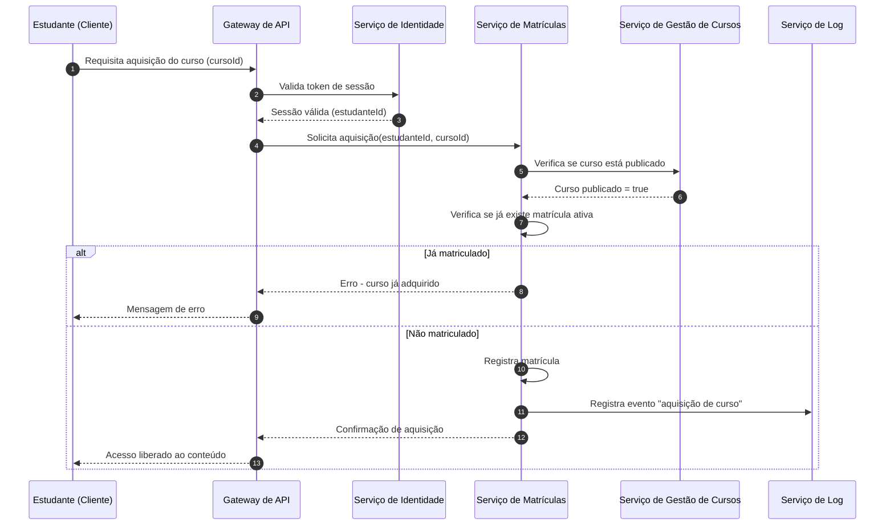
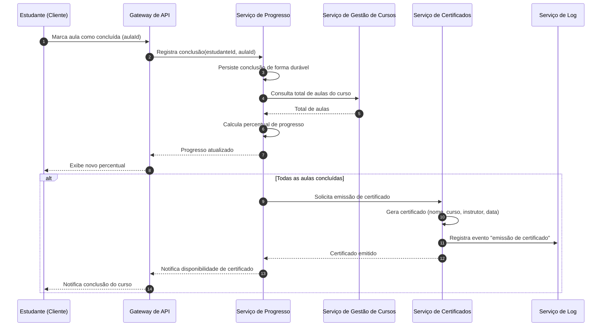

# Relatório Técnico de Arquitetura de Software

## 1. Identificação das HUs

| HU | Título | Perfil | RFs relacionados | RNFs relacionados |
|----|--------|--------|-------------------|--------------------|
| HU01 | Criar e estruturar um curso | Instrutor | RF01, RF02, RF03, RF04 | RNF04 |
| HU02 | Publicar e despublicar curso | Instrutor | RF05 | RNF01 |
| HU03 | Acompanhar matrículas do curso | Instrutor | RF13 | RNF06 |
| HU04 | Acompanhar engajamento por aula | Instrutor | RF14 | RNF06 |
| HU05 | Cadastrar-se na plataforma | Estudante | RF06 | RNF02 |
| HU06 | Adquirir um curso | Estudante | RF07, RF08 | RNF01 |
| HU07 | Assistir aulas e acompanhar progresso | Estudante | RF09, RF10, RF12 | RNF03, RNF07, RNF10 |
| HU08 | Receber e baixar o certificado de conclusão | Estudante | RF11, RF15 | RNF09 |
| HU09 | Acessar meus cursos adquiridos | Estudante | RF12 | RNF05, RNF08 |

Transversal: RF16 (login/logout) suporta todas as HUs; RNF09 (logs) e RNF02 (hash de senha) aplicam-se a autenticação/segurança de forma global.

---

## 2. Diagramas de Arquitetura (Mermaid)

### 2.1 Diagrama de Componentes (Visão Geral)

### 2.2 Diagrama de Sequência — Aquisição de Curso e Liberação de Acesso (HU06 / RF07 / RF08 / RNF01)

### 2.3 Diagrama de Sequência — Conclusão de Aula, Progresso e Emissão de Certificado (HU07 / HU08 / RF09-RF11 / RNF07)

---

## 3. Decisões de Arquitetura

| # | Decisão | Justificativa | Requisitos relacionados |
|---|---------|----------------|---------------------------|
| D01 | Separar o serviço de gestão de conteúdo (cursos/módulos/aulas) do serviço de streaming de vídeo | Vídeos possuem características de armazenamento e entrega distintas (grandes volumes, entrega contínua), exigindo escalabilidade independente | RF03, RNF03, RNF04 |
| D02 | Armazenamento de vídeo delegado a um serviço de objeto externo, desacoplado da aplicação | Requisito explícito de desacoplamento e escalabilidade | RNF04 |
| D03 | Entrega de vídeo via streaming, sem download integral | Exigência funcional e de desempenho | RF03, RNF03 |
| D04 | Controle de acesso a conteúdo centralizado no Serviço de Matrículas, validado antes de liberar streaming | Garantir que apenas estudantes com aquisição ativa acessem o conteúdo | RF08, RNF01 |
| D05 | Serviço de Progresso independente do Serviço de Certificados, comunicando-se via evento/interface de conclusão total | Separação de responsabilidades: progresso é operação frequente, certificado é operação pontual e com regras próprias (geração de documento) | RF09-RF11 |
| D06 | Persistência de progresso com escrita síncrona e confirmação antes de resposta ao cliente | Atender à garantia de não perda de progresso | RNF07 |
| D07 | Serviço de Métricas mantém modelo de dados agregado/desnormalizado, distinto do modelo operacional de cursos | Atender ao requisito de carregamento do painel em até 3 segundos sem sobrecarregar dados transacionais | RF13, RF14, RNF06 |
| D08 | Serviço de Identidade centralizado para autenticação de estudantes e instrutores | Reutilização de fluxo de login/logout e política de senha para os dois perfis | RF16, RNF02 |
| D09 | Registro de logs de eventos críticos como responsabilidade transversal, acionada pelos serviços de domínio | Rastreabilidade de aquisição, certificado e erros de upload | RNF09 |
| D10 | Despublicação de curso não revoga acesso de estudantes já matriculados — controle de visibilidade e controle de acesso são regras distintas | Requisito explícito da HU02 | RF05, RNF01 |
| D11 | Interface do cliente construída sob princípio de responsividade, sem prescrição de tecnologia específica | Atender RNF05 mantendo neutralidade tecnológica | RNF05, RNF08 |

---

## 4. Tabela de Componentes e Rastreabilidade

| Componente | Responsabilidade Principal | Comunica-se com | Origem (HU / Critério de Aceite) |
|---|---|---|---|
| Aplicação Cliente | Interface responsiva para instrutores e estudantes; player de vídeo com controles de acessibilidade | Gateway de API | HU01-HU09; RNF05, RNF10 |
| Gateway de API | Roteamento de requisições, validação superficial de sessão | Todos os serviços de domínio | Transversal |
| Serviço de Identidade e Acesso | Cadastro, login, logout, hash de senha | Repositório de Usuários, Gateway | HU05 (critérios de e-mail/senha), RF16, RNF02 |
| Serviço de Gestão de Cursos | CRUD de cursos, módulos, aulas; controle de publicação/status | Repositório de Cursos, Object Storage, Serviço de Matrículas, Log | HU01, HU02 (todos critérios) |
| Serviço de Streaming de Vídeo | Entrega de vídeo em streaming a partir do armazenamento externo | Object Storage, Serviço de Matrículas (validação de acesso) | HU07 (critério de streaming), RNF03 |
| Object Storage de Vídeos | Armazenamento desacoplado de arquivos de vídeo | Serviço de Cursos, Serviço de Streaming | RF03, RNF04 |
| Serviço de Matrículas e Aquisição | Processa aquisição, valida duplicidade, libera acesso | Repositório de Cursos/Usuários, Serviço de Cursos, Log | HU06 (todos critérios) |
| Serviço de Progresso e Conclusão | Registra conclusão de aulas, calcula percentual, persiste de forma durável | Repositório de Progresso, Serviço de Certificados, Serviço de Métricas | HU07, HU09 (percentual de progresso) |
| Serviço de Certificados | Gera, armazena e disponibiliza certificado em PDF | Repositório de Certificados, Serviço de Progresso, Log | HU08 (todos critérios) |
| Serviço de Métricas e Painel | Agrega dados de matrícula e engajamento por aula para exibição em painel | Repositório de Métricas, Serviço de Cursos | HU03, HU04 (todos critérios) |
| Serviço de Log de Eventos Críticos | Registra aquisição, emissão de certificado e erros de upload | Recebe eventos dos demais serviços | RNF09 |
| Repositório de Cursos/Módulos/Aulas | Persistência estruturada do conteúdo | Serviço de Cursos, Serviço de Matrículas, Métricas | RF01, RF02, RF04 |
| Repositório de Usuários | Persistência de dados de estudantes/instrutores e credenciais | Serviço de Identidade, Matrículas | RF06 |
| Repositório de Progresso | Persistência de conclusões de aula por estudante | Serviço de Progresso | RF09, RF10, RNF07 |
| Repositório de Certificados | Armazenamento de certificados emitidos | Serviço de Certificados | RF11, RF15 |
| Repositório de Métricas | Dados agregados para painéis | Serviço de Métricas | RF13, RF14 |

---

## 5. Bloqueios e Pendências

| # | Item | Descrição | Impacto |
|---|------|-----------|---------|
| B01 | Modelo de precificação e pagamento | RF01 menciona "preço" e RF07 "aquisição", mas não há requisito descrevendo processamento de pagamento, reembolso ou gateway financeiro | Bloqueia definição completa do Serviço de Matrículas/Aquisição |
| B02 | Definição de papéis e permissões refinadas | Não há especificação sobre múltiplos instrutores por curso, coautoria, ou hierarquia de administração da plataforma | Impacta modelo de autorização no Serviço de Identidade |
| B03 | Critérios de "tempo real" para métricas (HU03) | "Tempo real ou defasagem máxima de 1 hora" não define mecanismo de atualização; requer decisão de arquitetura futura (síncrono vs. processamento periódico) | Impacta desenho do Serviço de Métricas |
| B04 | Formato/layout do certificado | RF11/HU08 não especificam template visual ou padrão de assinatura digital/validação de autenticidade do PDF | Impacta Serviço de Certificados |
| B05 | Política de retenção de vídeo após despublicação/exclusão de curso | Não definido o que ocorre com o vídeo armazenado quando o curso é removido | Impacta Object Storage e Serviço de Cursos |

---

## 6. Cobertura de Requisitos

| RF/RNF | Coberto por Componente(s) | Status |
|--------|----------------------------|--------|
| RF01 | Serviço de Gestão de Cursos | Coberto |
| RF02 | Serviço de Gestão de Cursos | Coberto |
| RF03 | Serviço de Gestão de Cursos, Object Storage | Coberto |
| RF04 | Serviço de Gestão de Cursos | Coberto |
| RF05 | Serviço de Gestão de Cursos | Coberto |
| RF06 | Serviço de Identidade e Acesso | Coberto |
| RF07 | Serviço de Matrículas e Aquisição | Coberto |
| RF08 | Serviço de Matrículas e Aquisição, Serviço de Streaming | Coberto |
| RF09 | Serviço de Progresso e Conclusão | Coberto |
| RF10 | Serviço de Progresso e Conclusão | Coberto |
| RF11 | Serviço de Certificados | Coberto |
| RF12 | Serviço de Progresso, Aplicação Cliente | Coberto |
| RF13 | Serviço de Métricas e Painel | Coberto |
| RF14 | Serviço de Métricas e Painel | Coberto |
| RF15 | Serviço de Certificados | Coberto |
| RF16 | Serviço de Identidade e Acesso | Coberto |
| RNF01 | Serviço de Matrículas, Serviço de Streaming | Coberto |
| RNF02 | Serviço de Identidade e Acesso | Coberto |
| RNF03 | Serviço de Streaming de Vídeo | Coberto |
| RNF04 | Object Storage de Vídeos | Coberto |
| RNF05 | Aplicação Cliente | Coberto (nível conceitual) |
| RNF06 | Serviço de Métricas e Painel | Coberto (parcial — ver B03) |
| RNF07 | Serviço de Progresso e Conclusão | Coberto |
| RNF08 | Aplicação Cliente | Coberto (nível conceitual) |
| RNF09 | Serviço de Log de Eventos Críticos | Coberto |
| RNF10 | Aplicação Cliente (player de vídeo) | Coberto |

---

## 7. Gap Analysis

| # | Lacuna Identificada | Impacto Arquitetural | Ação Recomendada |
|---|----------------------|------------------------|--------------------|
| G01 | Ausência de requisito sobre pagamento/transação financeira apesar de existir "preço" e "aquisição" | Serviço de Matrículas não pode ser finalizado sem definir integração com meio de pagamento | Levantar requisito específico de pagamento junto ao Product Owner antes do detalhamento do Serviço de Matrículas |
| G02 | Não há requisito de recuperação de senha / redefinição de credenciais | Serviço de Identidade incompleto para operação real | Incluir HU/RF de "recuperação de senha" no próximo backlog |
| G03 | Não há requisito de avaliação/nota do curso (rating, comentários) | Ausência de componente de feedback, mencionado implicitamente em plataformas de curso | Validar com stakeholders se está fora de escopo do M01 |
| G04 | RNF06 define tempo de carregamento do painel, mas não define volume de dados/usuários simultâneos esperado | Dificulta dimensionamento do Serviço de Métricas | Solicitar requisito de carga (usuários concorrentes, volume de cursos) |
| G05 | Não há definição de política de erro/reprocessamento para upload de vídeo com falha | RNF09 exige log de erro de upload, mas não há fluxo de reprocessamento ou notificação ao instrutor | Especificar HU/critério de aceite para tratamento de falha de upload |
| G06 | Ausência de requisito sobre expiração de acesso (ex.: curso vitalício vs. por assinatura) | Afeta modelagem do Serviço de Matrículas quanto à duração do direito de acesso | Confirmar com negócio se acesso é vitalício |
| G07 | Não há requisito de internacionalização/idioma | Pode impactar Aplicação Cliente e Serviço de Certificados (texto do certificado) | Registrar como possível requisito futuro, fora do escopo atual |
| G08 | Falta de definição sobre concorrência de conclusão de curso e emissão de certificado (ex.: aulas adicionadas após conclusão) | Pode gerar inconsistência entre "curso concluído" e alterações posteriores no conteúdo pelo instrutor | Definir regra de negócio: recalcular progresso ou congelar estrutura do curso na aquisição/conclusão |