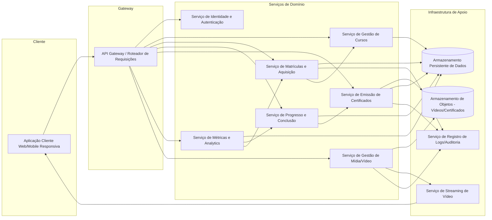
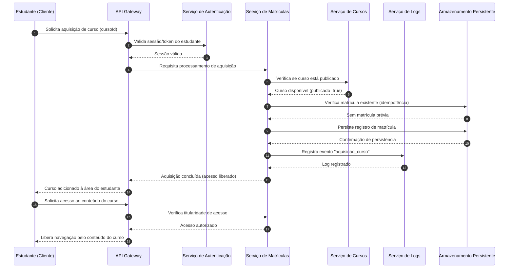
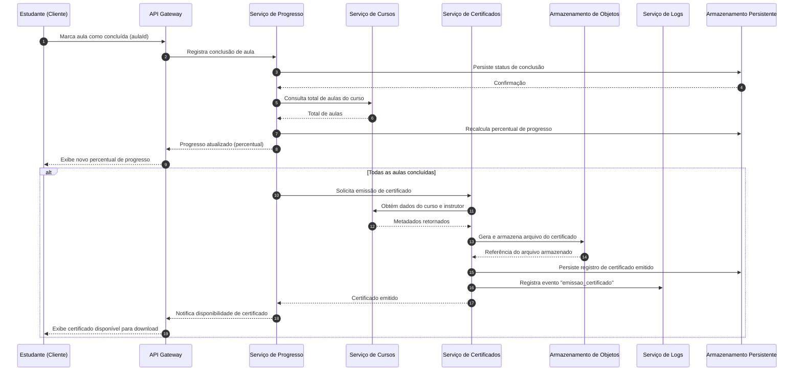

# Relatório Técnico de Arquitetura de Software
## Plataforma de Cursos em Vídeo (M01)

---

## 1. Identificação das HUs

| HU | Título | Perfil | RFs Relacionados | RNFs Relacionados |
|----|--------|--------|-------------------|---------------------|
| HU01 | Criar e estruturar um curso | Instrutor | RF01, RF02, RF03, RF04 | RNF04, RNF05 |
| HU02 | Publicar e despublicar curso | Instrutor | RF05, RF08 | RNF01 |
| HU03 | Acompanhar matrículas do curso | Instrutor | RF13 | RNF06 |
| HU04 | Acompanhar engajamento por aula | Instrutor | RF14 | RNF06 |
| HU05 | Cadastrar-se na plataforma | Estudante | RF06, RF16 | RNF02, RNF05, RNF08 |
| HU06 | Adquirir um curso | Estudante | RF07, RF08 | RNF01, RNF09 |
| HU07 | Assistir aulas e acompanhar progresso | Estudante | RF09, RF10, RF12 | RNF03, RNF07, RNF10 |
| HU08 | Receber e baixar certificado | Estudante | RF11, RF15 | RNF09 |
| HU09 | Acessar cursos adquiridos | Estudante | RF07, RF12 | RNF05, RNF08 |

---

## 2. Diagramas de Arquitetura (Mermaid)

### 2.1 Diagrama de Componentes (Visão Macro)

### 2.2 Diagrama de Sequência — Aquisição de Curso e Liberação de Acesso (HU06, RF07, RF08)

### 2.3 Diagrama de Sequência — Conclusão de Aula, Progresso e Emissão de Certificado (HU07, HU08, RF09-RF11)

---

## 3. Decisões de Arquitetura

| ID | Decisão | Justificativa | Requisitos Relacionados |
|----|---------|----------------|---------------------------|
| DA01 | Separação em serviços de domínio independentes (Cursos, Matrículas, Progresso, Certificados, Métricas, Mídia) | Isola responsabilidades divergentes (gestão de conteúdo vs. consumo vs. analytics), permitindo evolução e escalabilidade independentes | RF01-RF15 |
| DA02 | Entrega de vídeo via componente de streaming dedicado, desacoplado do armazenamento bruto | Atende à exigência de streaming sem download integral e permite escalar entrega de mídia separadamente da aplicação | RNF03, RNF04 |
| DA03 | Armazenamento de vídeos e certificados em serviço de objetos externo e desacoplado | Reduz acoplamento com o servidor de aplicação e permite escalabilidade de armazenamento | RNF04 |
| DA04 | Controle de acesso centralizado no Serviço de Matrículas, validado antes de qualquer entrega de conteúdo | Garante que RNF01 (restrição de acesso) seja aplicado uniformemente, independente do canal de acesso | RF08, RNF01 |
| DA05 | Emissão de certificado disparada de forma reativa pelo Serviço de Progresso ao detectar 100% de conclusão | Automatiza RF11 sem acoplar lógica de certificação à lógica de progresso | RF11, RF15 |
| DA06 | Serviço de Métricas consome dados de Matrículas e Progresso de forma assíncrona/consolidada, não em tempo real síncrono | Atende RNF06 (painel em até 3s) sem sobrecarregar serviços transacionais em cada consulta | RF13, RF14, RNF06 |
| DA07 | Serviço de Logs centralizado e transversal, consumido por múltiplos serviços via interface padronizada | Atende RNF09 exigindo rastreabilidade de eventos críticos sem duplicar lógica de auditoria | RNF09 |
| DA08 | Autenticação centralizada com hashing de senha delegado ao Serviço de Identidade | Isola responsabilidade de segurança de credenciais, atendendo RNF02 | RF06, RF16, RNF02 |
| DA09 | Estado de publicação do curso mantido no Serviço de Cursos, consultado por Matrículas antes de nova aquisição | Impede aquisição de cursos não publicados, mas preserva acesso de quem já adquiriu (regra de HU02) | RF05, RF08 |
| DA10 | Interface de cliente única e responsiva (Web/Mobile) consumindo a mesma API Gateway | Atende RNF05 e RNF08 sem duplicar lógica de negócio por plataforma | RNF05, RNF08 |

---

## 4. Tabela de Componentes e Rastreabilidade

| Componente | Responsabilidade Principal | Comunica-se com | Origem (HU / Critério de Aceite) |
|------------|------------------------------|-------------------|-------------------------------------|
| Aplicação Cliente (Web/Mobile) | Interface responsiva para instrutores e estudantes; reprodução de vídeo com controles de acessibilidade | API Gateway | HU01-HU09; RNF05, RNF10 |
| API Gateway | Roteamento, validação superficial de requisições, ponto único de entrada | Todos os serviços de domínio | Transversal a todas as HUs |
| Serviço de Identidade e Autenticação | Cadastro, login/logout, hash de senha, emissão de sessão/token | API Gateway, Armazenamento Persistente | HU05 (critérios de unicidade/senha); RF16, RNF02 |
| Serviço de Gestão de Cursos | CRUD de cursos, módulos e aulas; controle de status publicado/rascunho | API Gateway, Serviço de Matrículas, Serviço de Métricas, Armazenamento Persistente | HU01, HU02 (critérios de reordenação e visibilidade) |
| Serviço de Matrículas e Aquisição | Processa aquisição, garante unicidade de matrícula, valida acesso ao conteúdo | API Gateway, Serviço de Cursos, Serviço de Progresso, Serviço de Logs, Armazenamento Persistente | HU06 (critérios de acesso imediato e não duplicidade); RF07, RF08, RNF01 |
| Serviço de Progresso e Conclusão | Registra conclusão de aulas, calcula percentual de progresso, dispara emissão de certificado | API Gateway, Serviço de Cursos, Serviço de Certificados, Armazenamento Persistente | HU07 (critério de atualização imediata); RF09, RF10, RF12, RNF07 |
| Serviço de Emissão de Certificados | Gera certificado com dados do estudante/curso/instrutor, disponibiliza download em PDF | Serviço de Progresso, Serviço de Cursos, Armazenamento de Objetos, Serviço de Logs | HU08 (critérios de conteúdo do certificado e download); RF11, RF15 |
| Serviço de Métricas e Analytics | Consolida matrículas por curso e engajamento por aula (visualizações, taxa de conclusão) | Serviço de Matrículas, Serviço de Progresso, Armazenamento Persistente | HU03, HU04; RF13, RF14, RNF06 |
| Serviço de Gestão de Mídia | Upload, versionamento e organização de arquivos de vídeo por aula | API Gateway, Armazenamento de Objetos, Serviço de Streaming | HU01 (critério de upload por aula); RF03, RNF04 |
| Serviço de Streaming de Vídeo | Entrega de vídeo em fluxo contínuo ao cliente, sem download integral | Serviço de Gestão de Mídia, Aplicação Cliente | HU07 (critério de reprodução via streaming); RNF03 |
| Armazenamento de Objetos | Guarda binários de vídeo e certificados de forma desacoplada | Serviço de Mídia, Serviço de Certificados | RNF04; RF03, RF15 |
| Armazenamento Persistente | Guarda dados estruturados: usuários, cursos, matrículas, progresso, métricas | Todos os serviços de domínio | Transversal |
| Serviço de Logs/Auditoria | Registra eventos críticos: aquisição, emissão de certificado, erros de upload | Serviço de Matrículas, Serviço de Certificados, Serviço de Mídia | RNF09 |

---

## 5. Bloqueios e Pendências

| ID | Descrição do Bloqueio/Pendência | Impacto | Componente(s) Afetado(s) |
|----|----------------------------------|---------|-----------------------------|
| BL01 | Não há definição de política de reembolso/estorno para aquisição de curso | Impacta modelagem do Serviço de Matrículas quanto a estados de cancelamento | Serviço de Matrículas |
| BL02 | Não há definição de formato/regra de precificação (moeda, descontos, promoções) além de "preço" simples | Impacta modelagem do domínio de Curso e possível serviço de pagamento (inexistente nos requisitos) | Serviço de Gestão de Cursos |
| BL03 | Nenhum requisito trata explicitamente de processamento de pagamento (gateway de pagamento) | RF07 assume "aquisição" mas não especifica meio de pagamento — bloqueio para implementação real de compra | Serviço de Matrículas |
| BL04 | Não há definição de política de retenção/expiração de logs (RNF09) | Impacta dimensionamento do Serviço de Logs | Serviço de Logs |
| BL05 | Não há SLA definido para "tempo real ou defasagem máxima de 1 hora" nas métricas de matrícula (HU03) — mecanismo de atualização não especificado (síncrono vs. assíncrono) | Impacta decisão de arquitetura de consolidação de métricas | Serviço de Métricas |
| BL06 | Não há definição de papel "Administrador" da plataforma para moderação de conteúdo/usuários | Pode impactar futuras necessidades de governança, sem afetar o escopo atual | Transversal |
| BL07 | Ausência de requisito sobre revogação de acesso em caso de fraude/chargeback | Impacta regra de RNF01 quanto à permanência de acesso ao conteúdo | Serviço de Matrículas |

---

## 6. Cobertura de Requisitos

| Requisito | Coberto? | Componente(s) Responsável(is) |
|-----------|----------|-------------------------------|
| RF01 | Sim | Serviço de Gestão de Cursos |
| RF02 | Sim | Serviço de Gestão de Cursos |
| RF03 | Sim | Serviço de Gestão de Mídia, Armazenamento de Objetos |
| RF04 | Sim | Serviço de Gestão de Cursos |
| RF05 | Sim | Serviço de Gestão de Cursos |
| RF06 | Sim | Serviço de Identidade e Autenticação |
| RF07 | Sim | Serviço de Matrículas e Aquisição |
| RF08 | Sim | Serviço de Matrículas, Serviço de Cursos |
| RF09 | Sim | Serviço de Progresso e Conclusão |
| RF10 | Sim | Serviço de Progresso e Conclusão |
| RF11 | Sim | Serviço de Emissão de Certificados |
| RF12 | Sim | Serviço de Progresso e Conclusão |
| RF13 | Sim | Serviço de Métricas e Analytics |
| RF14 | Sim | Serviço de Métricas e Analytics |
| RF15 | Sim | Serviço de Emissão de Certificados, Armazenamento de Objetos |
| RF16 | Sim | Serviço de Identidade e Autenticação |
| RNF01 | Sim | Serviço de Matrículas (validação de acesso) |
| RNF02 | Sim | Serviço de Identidade e Autenticação |
| RNF03 | Sim | Serviço de Streaming de Vídeo |
| RNF04 | Sim | Armazenamento de Objetos, Serviço de Mídia |
| RNF05 | Sim | Aplicação Cliente |
| RNF06 | Parcial | Serviço de Métricas (depende de estratégia de consolidação a definir) |
| RNF07 | Sim | Serviço de Progresso e Conclusão |
| RNF08 | Sim | Aplicação Cliente |
| RNF09 | Sim | Serviço de Logs/Auditoria |
| RNF10 | Sim | Aplicação Cliente (player de vídeo) |

---

## 7. Gap Analysis

| Gap Identificado | Impacto Arquitetural | Ação Recomendada |
|-------------------|------------------------|----------------------|
| Ausência de fluxo de pagamento explícito na "aquisição de curso" (RF07) | O Serviço de Matrículas hoje assume aquisição como ato atômico e gratuito/simplificado; sem gateway de pagamento, o fluxo real de cobrança fica indefinido | Definir com stakeholders se haverá integração com processador de pagamento externo e modelar estado transacional (pendente/aprovado/recusado) |
| Falta de especificação sobre concorrência/atomicidade na marcação de conclusão de aula (RF09/RNF07) | Risco de inconsistência em cenários de múltiplos dispositivos marcando a mesma aula simultaneamente | Especificar requisito de idempotência e estratégia de reconciliação de estado no Serviço de Progresso |
| RNF06 não detalha se a defasagem de métricas é aceitável em todos os cenários ou apenas leitura de painel | Impacta se Serviço de Métricas deve operar em modelo consolidado periódico ou cálculo sob demanda | Definir SLA único e explícito de atualização de métricas, incluindo comportamento em caso de indisponibilidade |
| Ausência de regra de exclusão de curso com estudantes matriculados (RF04) | Risco de estudantes perderem acesso a conteúdo já adquirido; conflita implicitamente com HU02 (garantia de acesso pós-despublicação) | Definir regra de negócio: cursos com matrículas ativas não podem ser excluídos, apenas despublicados/arquivados |
| Nenhum requisito trata de reenvio/recuperação de senha | Lacuna funcional relevante para operação real da plataforma, embora não bloqueie o design atual | Incluir HU e RF específicos em iteração futura para recuperação de credenciais |
| Ausência de definição sobre versionamento de vídeo após edição de aula publicada (RF04 + RF03) | Pode gerar inconsistência entre progresso do estudante e conteúdo alterado após conclusão prévia | Definir política de re-upload de vídeo (nova versão vs. substituição) e efeito sobre progresso já registrado |
| Não há critério de unicidade/expiração para certificados re-emitidos (RF11) | Ambiguidade sobre se certificado pode ser gerado múltiplas vezes ou é único e imutável | Definir regra de imutabilidade do certificado e comportamento em caso de nova tentativa de emissão |