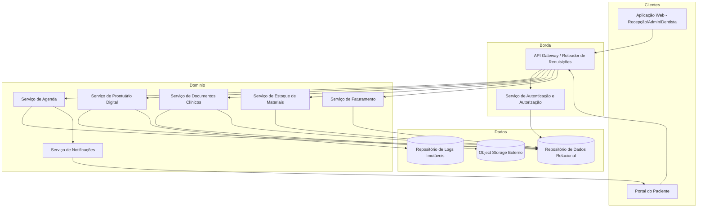
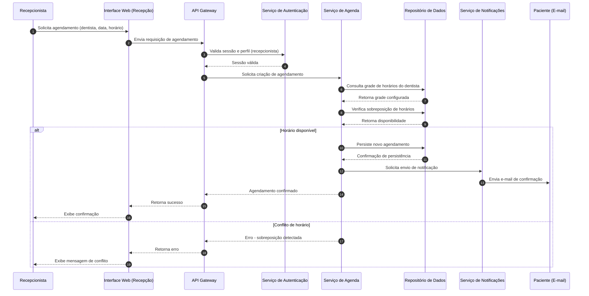
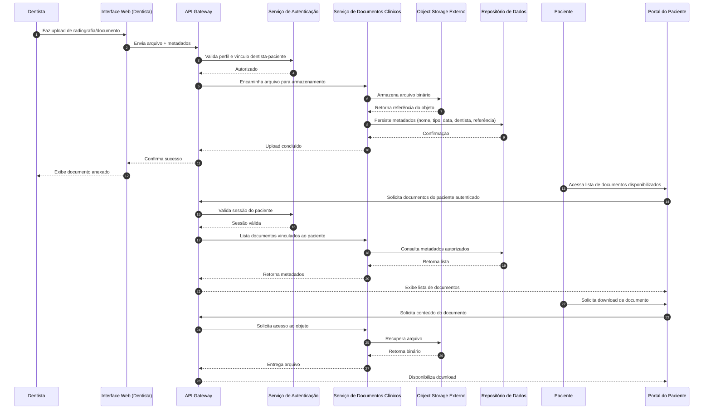

# Relatório Técnico de Arquitetura de Software
## Sistema de Gestão de Clínica Odontológica (M02)

---

## 1. Identificação das HUs

| HU | Perfil | Título | RFs Relacionados | RNFs Relacionados |
|----|--------|--------|-------------------|--------------------|
| HU01 | Recepcionista | Visualizar agenda unificada dos dentistas | RF03, RF04 | RNF06, RNF09, RNF10 |
| HU02 | Recepcionista | Agendar, cancelar e remarcar consulta | RF05, RF06, RF07, RF08 | RNF01 |
| HU03 | Recepcionista | Registrar pagamento de cobrança | RF20, RF21 | RNF01 |
| HU04 | Dentista | Registrar procedimento no prontuário | RF09, RF10, RF13 | RNF05 |
| HU05 | Dentista | Anexar radiografias e documentos clínicos | RF11 | RNF02, RNF03, RNF07 |
| HU06 | Dentista | Consultar prontuário completo do paciente | RF09, RF12 | RNF02, RNF03 |
| HU07 | Dentista | Gerar cobrança após atendimento | RF18, RF19, RF20 | — |
| HU08 | Administrador | Gerenciar dentistas e grades de horário | RF03, RF07 | — |
| HU09 | Administrador | Gerenciar materiais e alertas de estoque | RF14, RF15, RF16 | — |
| HU10 | Administrador | Consultar relatório de faturamento | RF22 | — |
| HU11 | Paciente | Acessar agendamentos pelo portal | RF23, RF24 | RNF01, RNF09, RNF10 |
| HU12 | Paciente | Acessar e baixar documentos clínicos pelo portal | RF23, RF25 | RNF02, RNF03, RNF07 |

Requisitos transversais: RF01, RF02, RF17 (consumo de materiais vinculado a atendimento — sem HU explícita, ver Seção 7), RNF04, RNF08, RNF11.

---

## 2. Diagramas de Arquitetura (Mermaid)

### 2.1 Diagrama de Componentes (Visão Macro)

### 2.2 Diagrama de Sequência — HU02 (Agendar Consulta)

### 2.3 Diagrama de Sequência — HU05/HU12 (Upload e Acesso a Documento Clínico)

---

## 3. Decisões de Arquitetura

| ID | Decisão | Justificativa | Requisitos Relacionados |
|----|---------|----------------|--------------------------|
| DA01 | Separação de serviços por domínio funcional (Agenda, Prontuário, Documentos, Estoque, Faturamento, Notificações) | Reduz acoplamento, permite evolução e escalabilidade independentes por área de negócio | RF03-RF25 |
| DA02 | Autenticação e autorização centralizadas em serviço dedicado, com controle de perfis (RBAC) | Garante que restrições de acesso por perfil sejam aplicadas de forma consistente em todos os pontos de entrada | RF01, RF02, RNF01, RNF04 |
| DA03 | Armazenamento de documentos clínicos em serviço de object storage externo, desacoplado da aplicação | Requisito explícito de escalabilidade e desacoplamento | RNF07, RF11, RF25 |
| DA04 | Registro de log imutável e append-only para alterações em prontuário | Garante rastreabilidade e conformidade com auditoria clínica | RNF05, RF13 |
| DA05 | Comunicação entre clientes e serviços de domínio mediada por um componente de borda (Gateway) | Centraliza autenticação, roteamento e políticas de acesso, simplificando os serviços internos | RF02, RNF01 |
| DA06 | Serviço de Notificações desacoplado, acionado de forma assíncrona por eventos de agenda | Evita bloqueio do fluxo principal de agendamento por falhas/latência no envio de e-mail | RF08 |
| DA07 | Modelo de dados de Faturamento referencia tabelas de procedimentos e convênios como entidades independentes | Permite reuso e atualização de valores sem duplicação de regras de negócio | RF18, RF19, RF20 |
| DA08 | Controle de acesso a documentos e prontuário aplicado na camada de serviço de domínio, não apenas na interface | Atende à exigência de que dados sensíveis sejam protegidos independentemente do canal de acesso | RNF02, RNF03 |
| DA09 | Sessões com expiração automática por inatividade tratadas no serviço de Autenticação | Centraliza política de segurança de sessão | RNF01 |
| DA10 | Portal do Paciente tratado como cliente distinto da aplicação interna, mas consumindo os mesmos serviços de domínio via Gateway | Evita duplicação de lógica de negócio entre canais interno e externo | RF23-RF25 |

---

## 4. Tabela de Componentes e Rastreabilidade

| Componente | Responsabilidade Principal | Comunica-se com | Origem (HU / Critério de Aceite) |
|------------|------------------------------|-------------------|-------------------------------------|
| Serviço de Autenticação e Autorização | Autenticar usuários, gerenciar perfis e sessões, aplicar RBAC, expirar sessões inativas | API Gateway, Repositório de Dados | RF01, RF02, RNF01, RNF04 |
| API Gateway | Rotear requisições, aplicar validação de sessão antes de encaminhar aos serviços de domínio | Todos os serviços de domínio, Serviço de Autenticação | Todas as HUs |
| Serviço de Agenda | Gerenciar grades de horário, criação/cancelamento/remarcação de consultas, bloqueio de sobreposição | Repositório de Dados, Serviço de Notificações | HU01, HU02, HU08 |
| Serviço de Notificações | Enviar e-mails de confirmação, cancelamento e remarcação | Serviço de Agenda, Paciente (canal externo) | HU02 (critério de aceite: e-mail automático) |
| Serviço de Prontuário Digital | Registrar e consultar histórico clínico, garantir rastreabilidade das entradas | Repositório de Dados, Repositório de Logs Imutáveis | HU04, HU06 |
| Serviço de Documentos Clínicos | Gerenciar upload, metadados e controle de acesso a arquivos clínicos | Object Storage Externo, Repositório de Dados | HU05, HU12 |
| Serviço de Estoque de Materiais | Cadastrar materiais, registrar entradas/saídas, emitir alertas de estoque mínimo | Repositório de Dados | HU09, RF14-RF17 |
| Serviço de Faturamento | Gerar cobranças, aplicar tabelas de convênio, controlar pagamentos, gerar relatórios | Repositório de Dados, Serviço de Agenda (referência de atendimento) | HU03, HU07, HU10 |
| Portal do Paciente (cliente) | Interface de acesso do paciente a agendamentos e documentos | API Gateway | HU11, HU12 |
| Aplicação Web Interna (cliente) | Interface para recepcionista, dentista e administrador | API Gateway | HU01-HU10 |
| Repositório de Dados | Persistência estruturada de entidades de negócio (usuários, agenda, prontuário, estoque, faturamento) | Todos os serviços de domínio | Transversal |
| Repositório de Logs Imutáveis | Armazenar registros append-only de alterações em prontuário | Serviço de Prontuário Digital | RNF05 |
| Object Storage Externo | Armazenar arquivos binários (radiografias, laudos, documentos) | Serviço de Documentos Clínicos | RNF07, RF11, RF25 |

---

## 5. Bloqueios e Pendências

| ID | Descrição | Impacto | Ação Recomendada |
|----|-----------|---------|-------------------|
| BQ01 | Não há definição de regras de negócio para agendamentos parcialmente pagos ou cancelamento de cobrança já quitada | Pode gerar inconsistência no módulo de Faturamento | Especificar fluxo de estorno/cancelamento com equipe de negócio |
| BQ02 | RF17 (vincular consumo de materiais a atendimento) não possui HU associada, sem detalhamento de fluxo de interação | Risco de implementação divergente entre Estoque e Agenda/Prontuário | Elicitar HU específica com critérios de aceite |
| BQ03 | Não há definição clara de como o vínculo "dentista-paciente" é estabelecido para efeitos de controle de acesso (RNF03) | Bloqueia implementação de regras de autorização em Documentos e Prontuário | Definir critério de vínculo (ex.: histórico de atendimento) junto ao negócio |
| BQ04 | Não há especificação de formato/estrutura para exportação de relatórios (CSV/PDF) quanto a layout | Risco de retrabalho na geração de relatórios | Validar template de relatório com stakeholders |
| BQ05 | Ausência de definição sobre política de retenção/expurgo de documentos clínicos e logs além do backup (RNF11) | Impacto em conformidade LGPD/CFO a longo prazo | Definir política de retenção documental com jurídico/compliance |
| BQ06 | Não há requisito sobre auditoria de acessos a documentos clínicos (apenas alteração de prontuário está coberta por RNF05) | Lacuna de rastreabilidade em RNF03 | Avaliar necessidade de log de acesso a documentos |

---

## 6. Cobertura de Requisitos

| Categoria | Requisitos Cobertos | Requisitos Parcialmente Cobertos | Requisitos Não Cobertos |
|-----------|----------------------|-------------------------------------|---------------------------|
| Usuários e Acesso | RF01, RF02 | — | — |
| Agenda | RF03-RF08 | — | — |
| Prontuário Digital | RF09, RF10, RF11, RF12, RF13 | — | — |
| Estoque | RF14, RF15, RF16 | RF17 (sem HU detalhada) | — |
| Faturamento | RF18-RF22 | — | — |
| Portal do Paciente | RF23, RF24, RF25 | — | — |
| Segurança | RNF01, RNF02, RNF03, RNF04 | — | — |
| Rastreabilidade | RNF05 | — | Auditoria de acesso a documentos (não solicitada explicitamente) |
| Desempenho/Escalabilidade | RNF06, RNF07 | — | — |
| Disponibilidade/Backup | RNF08, RNF11 | — | — |
| Usabilidade/Compatibilidade | RNF09, RNF10 | — | — |

**Cobertura geral estimada: ~96% dos requisitos funcionais e não funcionais mapeados em componentes arquiteturais.**

---

## 7. Gap Analysis

| Gap | Descrição | Impacto Arquitetural | Ação Recomendada |
|-----|-----------|------------------------|---------------------|
| G01 | RF17 (consumo de materiais vinculado a atendimento) carece de HU/critérios de aceite | Interface entre Serviço de Estoque e Serviço de Agenda/Prontuário não está bem definida | Elicitar história de usuário específica com fluxo de baixa automática de estoque por procedimento |
| G02 | Ausência de definição formal do conceito de "vínculo dentista-paciente" usado em RNF03 e HU06/HU12 | Regra de autorização crítica para dados sensíveis fica em aberto | Definir modelo de vínculo (ex.: paciente atendido pelo dentista) antes da implementação de autorização |
| G03 | Não há requisito sobre cancelamento/estorno de cobrança já registrada como paga | Fluxo de Faturamento incompleto para cenários de exceção | Levantar regra de negócio para estornos e emitir novo RF |
| G04 | Falta detalhamento sobre o que constitui "sessão inativa" para múltiplos dispositivos/abas | Pode gerar comportamento inconsistente na expiração de sessão (RNF01) | Especificar critério técnico de inatividade (ex.: ausência de requisições) |
| G05 | Não há requisito de auditoria/log de leitura sobre documentos clínicos, apenas sobre alterações no prontuário | Lacuna de rastreabilidade para fins de compliance LGPD | Avaliar inclusão de RNF adicional para logs de acesso a documentos |
| G06 | Retenção de dados após término de relacionamento com paciente (ex.: exclusão de dados sob LGPD) não está especificada | Pode gerar não conformidade legal | Definir política de retenção/exclusão de dados pessoais com área jurídica |
| G07 | Não há requisito sobre concorrência simultânea de edição no prontuário (dois dentistas editando o mesmo registro) | Risco de inconsistência de dados em cenários multiusuário | Definir estratégia de controle de concorrência (ex.: bloqueio otimista) |
| G08 | Format de exportação de relatórios de faturamento (CSV/PDF) não define layout, colunas obrigatórias ou totalizações detalhadas | Retrabalho potencial na camada de geração de relatórios | Validar wireframe/template do relatório com o time de negócio antes da implementação |