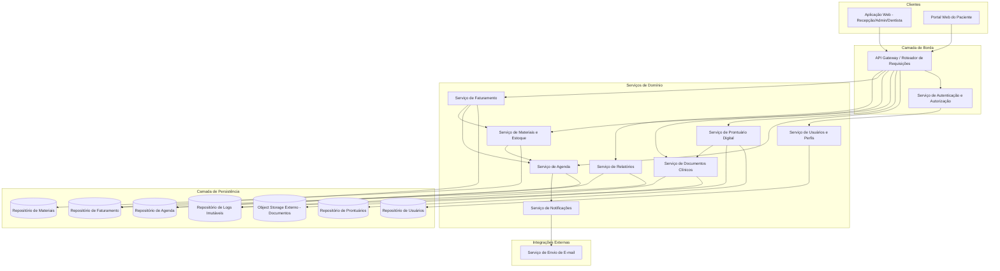
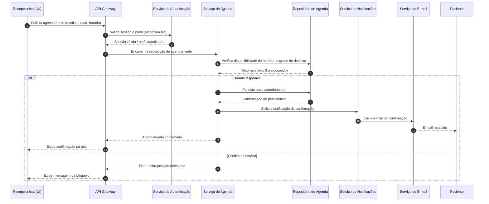
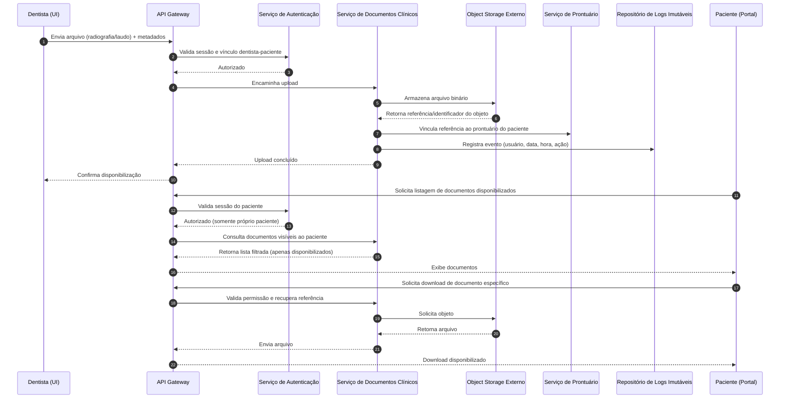

# Relatório Técnico de Arquitetura de Software
## Sistema de Gestão de Clínica Odontológica (M02)

---

## 1. Identificação das HUs

| HU | Título | Perfil | RFs Relacionados | RNFs Relacionados |
|----|--------|--------|-------------------|--------------------|
| HU01 | Visualizar agenda unificada dos dentistas | Recepcionista | RF03, RF04 | RNF06, RNF09, RNF10 |
| HU02 | Agendar, cancelar e remarcar consulta | Recepcionista | RF05, RF06, RF07, RF08 | RNF06 |
| HU03 | Registrar pagamento de cobrança | Recepcionista | RF20, RF21 | RNF01 |
| HU04 | Registrar procedimento no prontuário | Dentista | RF09, RF10, RF13 | RNF05 |
| HU05 | Anexar radiografias e documentos clínicos | Dentista | RF11 | RNF02, RNF03, RNF07 |
| HU06 | Consultar prontuário completo do paciente | Dentista | RF09, RF12 | RNF02, RNF03 |
| HU07 | Gerar cobrança após atendimento | Dentista | RF17, RF18, RF19, RF20 | — |
| HU08 | Gerenciar dentistas e grades de horário | Administrador | RF01, RF03, RF07 | — |
| HU09 | Gerenciar materiais e alertas de estoque | Administrador | RF14, RF15, RF16 | — |
| HU10 | Consultar relatório de faturamento | Administrador | RF22 | — |
| HU11 | Acessar agendamentos pelo portal | Paciente | RF23, RF24 | RNF01, RNF09, RNF10 |
| HU12 | Acessar e baixar documentos clínicos pelo portal | Paciente | RF23, RF25 | RNF02, RNF03, RNF07 |

Requisitos transversais (não vinculados diretamente a uma HU específica, mas suportando todo o sistema): RF01, RF02 (gestão de usuários/perfis), RNF01, RNF04 (autenticação/segurança), RNF08 (disponibilidade), RNF11 (backup).

---

## 2. Diagramas de Arquitetura (Mermaid)

### 2.1 Diagrama de Componentes (Visão Macro)

### 2.2 Diagrama de Sequência — Agendamento com Notificação (HU02)

### 2.3 Diagrama de Sequência — Upload e Acesso a Documento Clínico (HU05/HU12)

---

## 3. Decisões de Arquitetura

| ID | Decisão | Justificativa | Requisitos Atendidos |
|----|---------|----------------|------------------------|
| DA01 | Adotar arquitetura em camadas com separação entre borda (gateway + autenticação), serviços de domínio e persistência. | Facilita controle de acesso centralizado por perfil e isolamento de responsabilidades. | RF01, RF02, RNF01 |
| DA02 | Armazenamento de documentos clínicos em serviço de object storage externo, desacoplado da aplicação. | Requisito explícito de escalabilidade e desacoplamento. | RF11, RNF07 |
| DA03 | Serviço de Prontuário e Serviço de Documentos separados, mas fortemente vinculados via referências. | Permite políticas de acesso e retenção distintas para dados estruturados e binários. | RF09, RF11, RNF03 |
| DA04 | Registro de log imutável (append-only) para toda alteração de prontuário e acesso a documentos. | Rastreabilidade exigida por RNF05 e RNF02/CFO/LGPD. | RF13, RNF05 |
| DA05 | Serviço de Notificações desacoplado do Serviço de Agenda, comunicando-se de forma assíncrona conceitual. | Evita acoplamento direto com provedor de e-mail e permite reuso para outros eventos futuros. | RF08 |
| DA06 | Controle de acesso baseado em perfil (RBAC) aplicado na camada de borda antes de rotear para serviços de domínio. | Atende à exigência de restrição de funcionalidades por perfil. | RF02, RNF01 |
| DA07 | Serviço de Faturamento consulta Serviço de Materiais para vincular consumo a atendimento, mas mantém modelo de dados próprio. | Evita acoplamento forte entre domínios financeiro e de estoque. | RF17, RF20 |
| DA08 | Serviço de Relatórios opera em modo de leitura sobre dados replicados/consultados dos domínios de Agenda e Faturamento, sem lógica de escrita. | Isola operações analíticas de alto custo das transacionais, atendendo RNF06 indiretamente. | RF22, RNF06 |
| DA09 | Sessões expiram automaticamente após período de inatividade controlado pelo Serviço de Autenticação. | Atendimento direto a RNF01. | RNF01 |
| DA10 | Backup e retenção de dados tratados como responsabilidade transversal de infraestrutura, não de um serviço de domínio específico. | RNF11 é requisito operacional, não funcional de negócio. | RNF11 |

---

## 4. Tabela de Componentes e Rastreabilidade

| Componente | Responsabilidade Principal | Comunica-se com | Origem (HU / Critério de Aceite) |
|------------|------------------------------|-------------------|-------------------------------------|
| API Gateway | Rotear requisições, aplicar políticas de borda | Todos os serviços de domínio, Serviço de Autenticação | RF02, HU01–HU12 (transversal) |
| Serviço de Autenticação e Autorização | Autenticar usuários, validar perfis, controlar expiração de sessão | Serviço de Usuários, API Gateway | RF01, RF02, RNF01, RNF04 |
| Serviço de Usuários e Perfis | Cadastro e gestão de usuários (admin, recepcionista, dentista, paciente) | Repositório de Usuários, Serviço de Autenticação | RF01, HU08 |
| Serviço de Agenda | Gerenciar agendas individuais, grade de horários, detectar sobreposição | Repositório de Agenda, Serviço de Notificações, Serviço de Faturamento | RF03–RF07, HU01, HU02, HU08 (Critério: bloqueio de sobreposição) |
| Serviço de Notificações | Disparar notificações de confirmação/cancelamento/remarcação | Serviço de E-mail, Serviço de Agenda | RF08, HU02 (Critério: e-mail automático) |
| Serviço de Prontuário Digital | Manter histórico clínico, registrar entradas com rastreabilidade | Repositório de Prontuários, Repositório de Logs, Serviço de Documentos | RF09, RF10, RF12, RF13, HU04, HU06 |
| Serviço de Documentos Clínicos | Upload, controle de acesso e disponibilização de arquivos clínicos | Object Storage Externo, Serviço de Prontuário, Repositório de Logs | RF11, RF25, HU05, HU12 |
| Serviço de Materiais e Estoque | Cadastro de materiais, controle de entradas/saídas, alertas de estoque mínimo | Repositório de Materiais, Serviço de Faturamento | RF14–RF17, HU09 |
| Serviço de Faturamento | Gerar cobranças, controlar pagamentos, aplicar tabelas de convênio | Repositório de Faturamento, Serviço de Agenda, Serviço de Materiais | RF18–RF21, HU03, HU07 |
| Serviço de Relatórios | Consolidar dados de faturamento e agenda para relatórios filtráveis e exportáveis | Repositório de Faturamento, Repositório de Agenda | RF22, HU10 |
| Portal do Paciente (Front-end) | Interface dedicada para paciente visualizar agendamentos e documentos | API Gateway | RF23–RF25, HU11, HU12 |
| Repositório de Logs Imutáveis | Armazenar registros append-only de alterações e acessos sensíveis | Serviço de Prontuário, Serviço de Documentos | RNF05, HU04 (Critério: associação dentista/data/hora) |
| Object Storage Externo | Armazenar fisicamente radiografias, laudos e documentos | Serviço de Documentos Clínicos | RF11, RNF07 |

---

## 5. Bloqueios e Pendências

| ID | Descrição do Bloqueio/Pendência | Impacto | Responsável Sugerido |
|----|-----------------------------------|---------|------------------------|
| BP01 | Não há definição de política de retenção/expurgo dos documentos clínicos no object storage, além da retenção geral de backup (RNF11). | Pode gerar inconsistência entre exigências da LGPD/CFO e política de armazenamento. | Time de Compliance + Arquitetura |
| BP02 | Não está especificado o mecanismo de confirmação de entrega do e-mail (RF08) — não há tratamento de falha de envio. | Risco de paciente não ser notificado sem que ninguém saiba. | Time de Backend / Produto |
| BP03 | Ausência de regra clara sobre o que ocorre com agendamentos futuros quando um dentista é desativado ou grade é excluída (relacionado a HU08). | Pode gerar inconsistência de agenda. | Product Owner |
| BP04 | Não há definição de formato/estrutura da "tabela de convênio" (RF19) — se é flat ou versionada por vigência. | Impacta modelo de dados do Serviço de Faturamento. | Analista de Negócio |
| BP05 | Critério de "documentos explicitamente disponibilizados pelo dentista" (HU12) não define um fluxo/estado de "publicação" no Serviço de Documentos. | Necessário definir estado (rascunho/publicado) para não vazar documentos internos. | Time de Backend |
| BP06 | Não há requisito sobre auditoria de acesso a documentos por parte do paciente (apenas alterações de prontuário têm log obrigatório — RNF05). | Pode ser exigência implícita da LGPD para dados sensíveis de saúde. | Time de Segurança |

---

## 6. Cobertura de Requisitos

| Categoria | Total | Cobertos por Componentes/Diagramas | Observação |
|-----------|-------|--------------------------------------|------------|
| RF (Funcionais) | 25 | 25 | Todos os RFs foram mapeados a pelo menos um componente. |
| RNF (Não Funcionais) | 11 | 11 | Todos endereçados via decisões arquiteturais (Seção 3) ou como responsabilidade transversal de infraestrutura. |
| HU (Histórias de Usuário) | 12 | 12 | Todas as HUs possuem componente(s) e, quando aplicável, diagrama de sequência associado. |

Observação: RNF06 (desempenho de agenda unificada), RNF08 (disponibilidade) e RNF11 (backup) são requisitos de natureza operacional/infraestrutural — cobertos conceitualmente por decisões arquiteturais, mas não representam componente de domínio dedicado, o que é esperado nesse nível de neutralidade tecnológica.

---

## 7. Gap Analysis

| ID | Gap Identificado | Impacto Arquitetural | Ação Recomendada |
|----|--------------------|-------------------------|---------------------|
| GA01 | Ausência de definição sobre concorrência simultânea no agendamento (dois usuários tentando reservar o mesmo horário no mesmo instante). | Serviço de Agenda precisa de mecanismo de controle de concorrência/exclusão mútua na escrita. | Especificar estratégia de bloqueio otimista/pessimista na camada de persistência da Agenda. |
| GA02 | RF17 (vincular consumo de materiais a atendimento) não define se o desconto de estoque é automático ou manual. | Afeta contrato de integração entre Serviço de Faturamento/Atendimento e Serviço de Materiais. | Detalhar fluxo de baixa de estoque (automático no fechamento do atendimento vs. manual). |
| GA03 | Não há RF/RNF sobre exclusão ou anonimização de dados de pacientes (direito ao esquecimento da LGPD). | Pode exigir novo componente ou funcionalidade no Serviço de Usuários/Prontuário. | Levantar requisito específico de anonimização/exclusão com jurídico/compliance. |
| GA04 | Não há definição de papel para múltiplos dentistas atendendo o mesmo paciente (compartilhamento de prontuário entre profissionais). | Impacta regra de autorização do Serviço de Prontuário (RF12 fala em "seus próprios pacientes", mas HU06 fala em "dentistas da clínica"). | Esclarecer com stakeholders se o acesso é por vínculo direto ou por toda a equipe clínica. |
| GA05 | Ausência de requisito sobre integração com convênios externos (validação eletrônica, TISS, etc.). | Serviço de Faturamento hoje assume tabelas de convênio como dados internos estáticos. | Confirmar com negócio se há necessidade futura de integração com sistemas de convênio. |
| GA06 | Não há menção a versionamento de grade de horários quando alterada (HU08 diz que não afeta agendamentos existentes, mas não define histórico de versões). | Serviço de Agenda pode precisar de modelo temporal para grades. | Modelar grade de horários com vigência (data início/fim) em vez de registro único mutável. |
| GA07 | Ausência de requisito de internacionalização/idioma (não crítico, mas relevante para futura expansão). | Baixo impacto imediato. | Registrar como item de backlog técnico, sem ação imediata. |

---

**Fim do Relatório Técnico de Arquitetura de Software.**