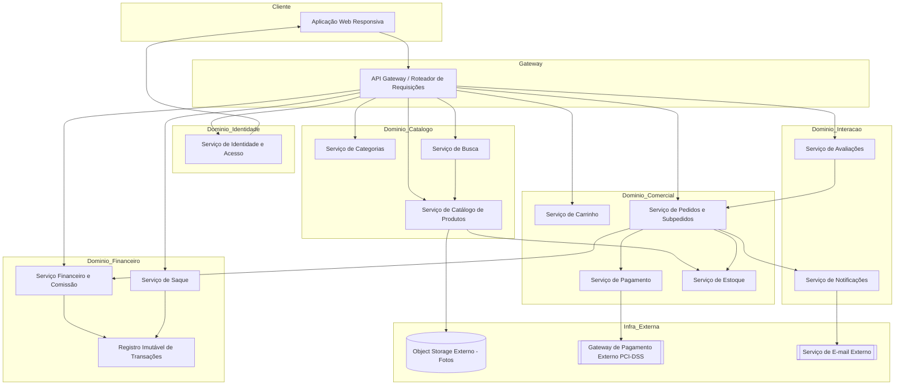
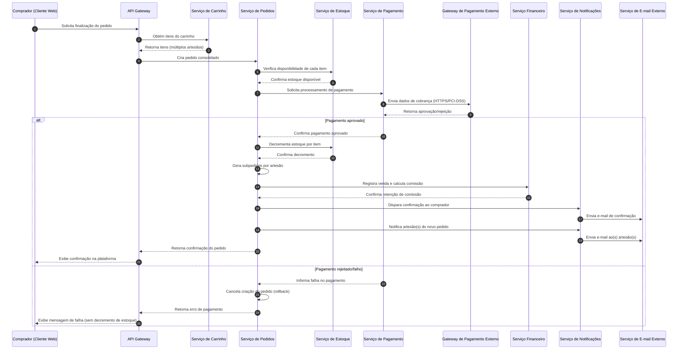
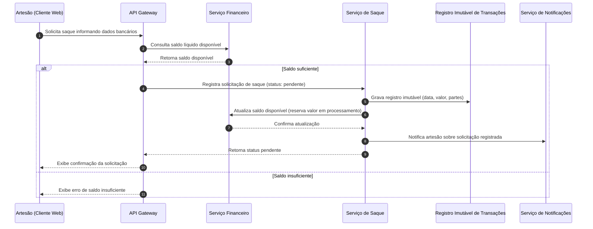

# Relatório Técnico de Arquitetura de Software
## Sistema de Marketplace de Produtos Artesanais (M03)

---

## 1. Identificação das HUs

| HU | Título | Perfil | RFs Relacionados | RNFs Relacionados |
|----|--------|--------|-------------------|--------------------|
| HU01 | Cadastrar produto com fotos | Artesão | RF04, RF06 | RNF04, RNF05, RNF07 |
| HU02 | Gerenciar estoque dos produtos | Artesão | RF07, RF08, RF09 | RNF08 |
| HU03 | Acompanhar/atualizar status de pedidos | Artesão | RF19, RF20, RF22 | RNF09, RNF13 |
| HU04 | Visualizar painel financeiro | Artesão | RF26, RF28, RF29 | RNF06, RNF09 |
| HU05 | Solicitar saque do saldo | Artesão | RF30 | RNF09, RNF13, RNF11 |
| HU06 | Responder avaliações | Artesão | RF25 | RNF07 |
| HU07 | Navegar e pesquisar produtos | Comprador | RF10, RF11 | RNF05, RNF07, RNF10 |
| HU08 | Adicionar itens ao carrinho e finalizar compra | Comprador | RF13-RF19, RF22 | RNF03, RNF08, RNF09 |
| HU09 | Acompanhar status dos pedidos | Comprador | RF21, RF22 | RNF07 |
| HU10 | Avaliar produto após entrega | Comprador | RF23, RF24 | RNF07 |
| HU11 | Gerenciar categorias | Administrador | RF12 | RNF13 |
| HU12 | Configurar percentual de comissão | Administrador | RF27 | RNF09, RNF13 |

**Requisitos transversais sem HU explícita:** RF01, RF02, RF03 (identidade/autenticação), RF05 (edição/remoção de produtos — implícito em HU01), RF24 (exibição pública de avaliações — implícito em HU10).

---

## 2. Diagramas de Arquitetura (Mermaid)

### 2.1 Diagrama de Componentes (Visão Macro)

### 2.2 Diagrama de Sequência — Finalização de Compra com Múltiplos Artesãos (HU08 / RF16-RF22)

### 2.3 Diagrama de Sequência — Solicitação de Saque (HU05 / RF30)

---

## 3. Decisões de Arquitetura

| ID | Decisão | Justificativa | Requisitos Relacionados |
|----|---------|----------------|--------------------------|
| DA01 | Arquitetura orientada a serviços de domínio (Catálogo, Comercial, Financeiro, Interação, Identidade), comunicando-se via API Gateway | Isola responsabilidades de negócio distintas, favorece evolução independente e alinha-se à separação natural do domínio (produtos, pedidos, finanças, avaliações) | RF01-RF30 |
| DA02 | Armazenamento de imagens delegado a serviço externo de object storage, referenciado por URL no Serviço de Catálogo | Atende explicitamente RNF04, desacopla mídia do núcleo transacional, melhora escalabilidade | RF04, RNF04 |
| DA03 | Processamento de pagamento tratado como transação atômica com padrão de compensação (rollback) em caso de falha | Garante que nenhuma cobrança ou decremento de estoque ocorra sem sucesso completo, atendendo RNF08 | RF08, RF09, RF16, RNF08 |
| DA04 | Pedido consolidado é decomposto em subpedidos por artesão após confirmação de pagamento | Atende requisito de múltiplos vendedores por pedido com status independentes | RF22, HU09 |
| DA05 | Registro de transações financeiras (venda, comissão, saque) tratado como estrutura imutável (append-only) | Atende RNF09 (rastreabilidade) e RNF13 (auditoria) sem permitir alteração retroativa | RF26, RF30, RNF09, RNF13 |
| DA06 | Alterações de percentual de comissão aplicadas apenas a vendas futuras, com versionamento do valor vigente | Evita impacto retroativo em vendas já processadas, conforme HU12 | RF27, HU12 |
| DA07 | Autenticação e controle de acesso centralizados em serviço de Identidade, com verificação de perfil em cada chamada sensível | Atende RNF01, RNF02 e suporta múltiplos perfis por usuário (RF03) | RF01-RF03, RNF01, RNF02 |
| DA08 | Comunicação com processador de pagamento externo restrita a canal seguro, sem persistência de dados sensíveis de cartão no domínio da aplicação | Atende RNF03 (PCI-DSS) | RF17, RNF03 |
| DA09 | Notificações (e-mail e in-app) tratadas por serviço dedicado, desacoplado dos serviços de domínio via publicação de eventos | Permite extensão de canais de notificação sem acoplar lógica de negócio | RF18, RF19, RF21 |
| DA10 | Busca de produtos servida por componente especializado, otimizado para consultas por nome/categoria/artesão com baixa latência | Atende RNF05 (2s) e requisito de busca incremental (HU07) | RF11, RNF05 |
| DA11 | Avaliações vinculadas ao ciclo de vida do pedido (liberadas apenas após status "entregue"), com resposta única e imutável do artesão | Atende regras de negócio de HU10 e HU06 | RF23, RF25 |

---

## 4. Tabela de Componentes e Rastreabilidade

| Componente | Responsabilidade Principal | Comunica-se com | Origem (HU / Critério de Aceite) |
|---|---|---|---|
| Serviço de Identidade e Acesso | Cadastro, autenticação, gestão de sessão e perfis múltiplos por usuário | API Gateway, todos os serviços de domínio (validação de perfil) | RF01-RF03, RNF01, RNF02 |
| Serviço de Catálogo de Produtos | CRUD de produtos, controle de visibilidade (publicar/despublicar), vínculo com fotos | Object Storage, Serviço de Estoque, Serviço de Busca | HU01, RF04-RF06 |
| Serviço de Categorias | CRUD de categorias, validação de remoção com produtos ativos | Serviço de Catálogo, Serviço de Notificações | HU11, RF12 |
| Serviço de Busca | Indexação e consulta por nome/categoria/artesão, filtro de itens sem estoque | Serviço de Catálogo | HU07, RF10, RF11 |
| Serviço de Estoque | Controle de quantidade disponível, bloqueio de compra com estoque zero, decremento pós-confirmação | Serviço de Catálogo, Serviço de Pedidos | HU02, RF07-RF09 |
| Serviço de Carrinho | Adição/remoção/ajuste de itens, cálculo de subtotal por sessão de compra | Serviço de Catálogo, Serviço de Pedidos | HU08 (critérios 1-2), RF13-RF15 |
| Serviço de Pedidos e Subpedidos | Consolidação do pedido, geração de subpedidos por artesão, atualização de status | Estoque, Pagamento, Financeiro, Notificações | HU03, HU08, HU09, RF16-RF22 |
| Serviço de Pagamento | Orquestração da transação de pagamento, garantia de atomicidade | Gateway de Pagamento Externo, Serviço de Pedidos | HU08 (critério 4), RF16, RF17, RNF03, RNF08 |
| Serviço Financeiro e Comissão | Cálculo/retenção de comissão, cálculo de saldo líquido, exposição de percentual vigente | Serviço de Pedidos, Ledger, Serviço de Saque | HU04, HU12, RF26-RF29 |
| Serviço de Saque (Payout) | Registro de solicitação de saque, validação de saldo, atualização de saldo em processamento | Serviço Financeiro, Ledger, Notificações | HU05, RF30 |
| Registro Imutável de Transações (Ledger) | Persistência append-only de eventos financeiros com data/hora/valor/partes | Serviço Financeiro, Serviço de Saque | RNF09, RNF13 |
| Serviço de Avaliações | Registro de nota/comentário pós-entrega, resposta única do artesão, exibição pública | Serviço de Pedidos (validação de status entregue), Serviço de Catálogo | HU06, HU10, RF23-RF25 |
| Serviço de Notificações | Disparo de eventos de e-mail e notificação in-app (pedido, status, saque) | Serviço de E-mail Externo, Serviço de Pedidos, Serviço de Saque | RF18, RF19, RF21, HU03 |
| API Gateway | Roteamento de requisições, ponto único de entrada, aplicação de políticas de autenticação | Todos os serviços de domínio | Transversal — RNF01 |
| Aplicação Web Responsiva | Interface de usuário adaptável a dispositivos móveis e desktop | API Gateway | RNF07, RNF10 |
| Object Storage Externo | Armazenamento desacoplado de arquivos de imagem | Serviço de Catálogo | RNF04 |
| Gateway de Pagamento Externo | Processamento de cobrança conforme PCI-DSS, sem retenção de dados de cartão | Serviço de Pagamento | RNF03, RF17 |
| Serviço de E-mail Externo | Entrega de comunicações transacionais por e-mail | Serviço de Notificações | RF18, RF19 |
| Módulo de Log/Auditoria | Registro de eventos críticos (falha de pagamento, saque, alteração de comissão) | Serviço de Pagamento, Serviço de Saque, Serviço Financeiro | RNF13 |

---

## 5. Bloqueios e Pendências

| ID | Descrição | Impacto | Responsável Sugerido |
|----|-----------|---------|------------------------|
| BP01 | Não há definição de qual(is) método(s) de pagamento serão suportados além do exemplo (cartão/PIX) — impacta modelagem de interface do Serviço de Pagamento | Médio | Time de Produto / Negócio |
| BP02 | Não há especificação de política de reembolso/cancelamento de pedido após confirmação | Alto — afeta fluxo de estoque, financeiro e notificações | Time de Produto |
| BP03 | Ausência de regras sobre concorrência de estoque em cenário de alta demanda simultânea (race condition na reserva) | Alto — risco de overselling | Arquitetura/Dev Backend |
| BP04 | Não definido o formato/prazo de processamento efetivo do saque (integração bancária) além do registro do pedido de saque | Médio | Time de Produto / Financeiro |
| BP05 | Não há critério de moderação/conteúdo ofensivo para avaliações e respostas | Médio | Time de Produto / Jurídico (LGPD) |
| BP06 | RNF11 (LGPD) não detalha requisitos específicos de consentimento, retenção e portabilidade de dados | Alto — conformidade legal | Jurídico / DPO |
| BP07 | Não especificado SLA de notificação (tempo máximo entre evento e envio de e-mail) | Baixo | Time de Produto |

---

## 6. Cobertura de Requisitos

| Categoria | Total | Cobertos no Design | Observações |
|---|---|---|---|
| RF Gestão de Usuários (RF01-RF03) | 3 | 3 | Cobertos por Serviço de Identidade |
| RF Catálogo (RF04-RF12) | 9 | 9 | Cobertos por Catálogo, Estoque, Categorias, Busca |
| RF Carrinho/Pedidos (RF13-RF22) | 10 | 10 | Cobertos por Carrinho, Pedidos, Pagamento, Notificações |
| RF Avaliações (RF23-RF25) | 3 | 3 | Cobertos por Serviço de Avaliações |
| RF Comissão/Financeiro (RF26-RF30) | 5 | 5 | Cobertos por Financeiro, Saque, Ledger |
| **Total RF** | **30** | **30** | 100% mapeado a componentes |
| RNF Segurança (RNF01-03) | 3 | 3 | Identidade + Pagamento externo |
| RNF Escalabilidade/Desempenho (RNF04-06) | 3 | 3 | Object Storage, Busca, Financeiro |
| RNF Usabilidade/Compat. (RNF07,10) | 2 | 2 | Aplicação Web Responsiva |
| RNF Confiabilidade (RNF08) | 1 | 1 | Padrão transacional em Pagamento |
| RNF Rastreabilidade/Manutenibilidade (RNF09,13) | 2 | 2 | Ledger + Módulo de Log |
| RNF Conformidade (RNF11) | 1 | Parcial | Ver BP06 — necessita detalhamento |
| RNF Disponibilidade (RNF12) | 1 | Não endereçado no design lógico | Depende de decisão de infraestrutura (fora do escopo neutro) |
| **Total RNF** | **13** | **12 plenos / 1 parcial / 1 dependente de infra** | |

---

## 7. Gap Analysis

| Gap Identificado | Descrição | Impacto Arquitetural | Ação Recomendada |
|---|---|---|---|
| G01 | Falta de especificação sobre concorrência no decremento de estoque (dois compradores simultâneos) | Risco de inconsistência de dados (overselling) mesmo com padrão transacional descrito | Definir estratégia de controle de concorrência (ex.: bloqueio otimista/pessimista) na fase de detalhamento do Serviço de Estoque |
| G02 | Ausência de fluxo de cancelamento/estorno de pedido | Serviço de Pagamento e Financeiro precisarão de operações de compensação não modeladas | Elicitar requisito de cancelamento com o time de produto antes da implementação |
| G03 | RNF12 (disponibilidade 99,5%) não possui componente arquitetural correspondente no design lógico, pois depende de decisões de infraestrutura/operação | Risco de tratar requisito não-funcional crítico apenas na fase de implantação | Incluir estratégia de redundância/monitoramento no plano de operação, fora do escopo de design neutro |
| G04 | Falta de definição sobre retenção e anonimização de dados pessoais (LGPD) além da menção genérica | Serviço de Identidade e Financeiro precisam de políticas de expurgo/anonimização não detalhadas | Realizar levantamento específico de LGPD com DPO/jurídico e traduzir em requisitos técnicos |
| G05 | Não há requisito sobre auditoria de acesso administrativo (quem visualizou dados sensíveis) | Módulo de Log cobre alterações críticas, mas não leitura/acesso | Avaliar necessidade de trilha de auditoria de acesso, não apenas de alteração |
| G06 | Ausência de definição sobre limite de tentativas de pagamento falho (possível fraude) | Serviço de Pagamento não tem regra de bloqueio/rate limiting definida | Especificar política de segurança contra tentativas abusivas de pagamento |
| G07 | Não há critério sobre unicidade de avaliação por item vs. por pedido em caso de múltiplas unidades do mesmo produto | Serviço de Avaliações pode ter ambiguidade na regra "avaliar uma vez" | Esclarecer com stakeholders se a restrição é por produto, por pedido ou por item individual |
| G08 | Falta de detalhamento sobre o formato dos dados bancários exigidos no saque (moeda única? contas internacionais?) | Serviço de Saque pode requerer modelagem de dados distinta conforme escopo geográfico | Confirmar escopo de mercado (nacional/internacional) com time de negócio |