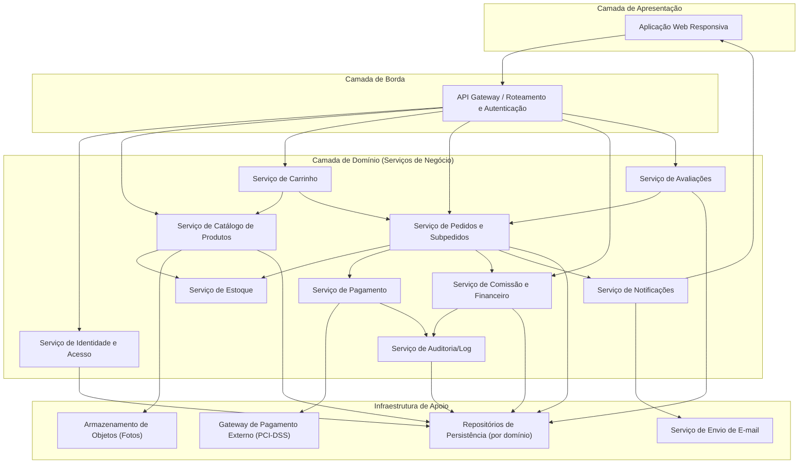
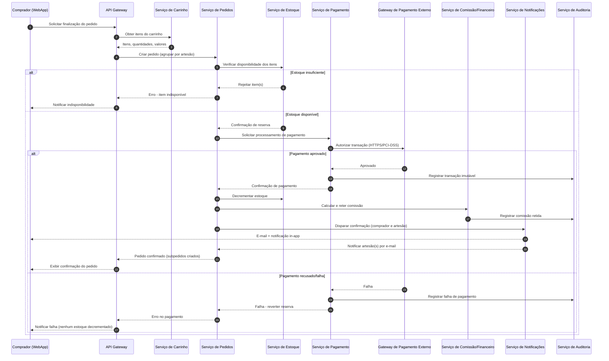
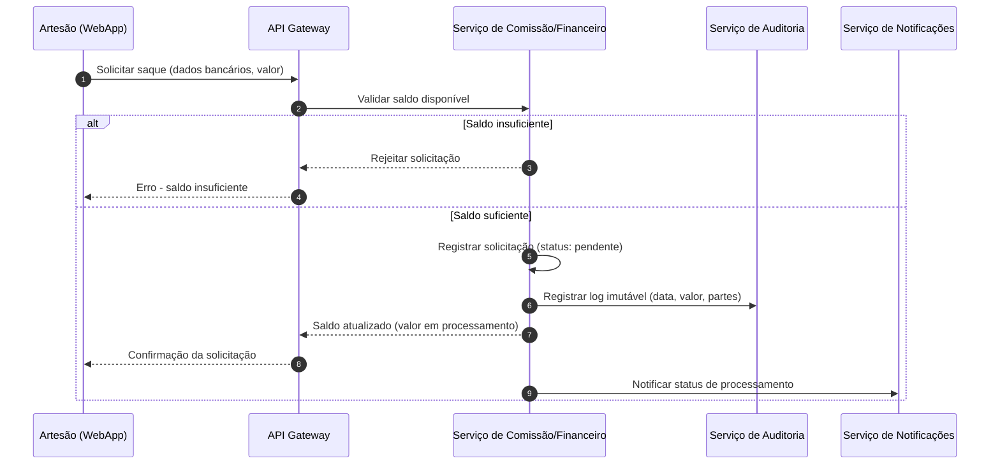

# Relatório Técnico de Arquitetura de Software
## Marketplace de Produtos Artesanais (M03)

---

## 1. Identificação das HUs

| HU | Título | Perfil | RFs Relacionados | RNFs Relacionados |
|----|--------|--------|-------------------|--------------------|
| HU01 | Cadastrar produto com fotos | Artesão | RF04, RF05, RF06 | RNF04 |
| HU02 | Gerenciar estoque dos produtos | Artesão | RF07, RF08, RF09 | RNF08 |
| HU03 | Acompanhar e atualizar status dos pedidos | Artesão | RF20, RF22 | RNF13 |
| HU04 | Visualizar painel financeiro | Artesão | RF28, RF29 | RNF06, RNF09 |
| HU05 | Solicitar saque do saldo disponível | Artesão | RF30 | RNF09, RNF13 |
| HU06 | Responder avaliações de compradores | Artesão | RF25 | - |
| HU07 | Navegar e pesquisar produtos | Comprador | RF10, RF11 | RNF05 |
| HU08 | Adicionar itens ao carrinho e finalizar compra | Comprador | RF13-RF19, RF22 | RNF03, RNF08 |
| HU09 | Acompanhar status dos pedidos | Comprador | RF21, RF22 | - |
| HU10 | Avaliar produto após entrega | Comprador | RF23, RF24 | - |
| HU11 | Gerenciar categorias da plataforma | Admin | RF12 | - |
| HU12 | Configurar percentual de comissão | Admin | RF26, RF27 | RNF09, RNF13 |

Requisitos transversais não vinculados diretamente a HU explícita: RF01, RF02, RF03 (Identidade e Acesso); RNF01, RNF02, RNF07, RNF10, RNF11, RNF12 (qualidade sistêmica).

---

## 2. Diagramas de Arquitetura (Mermaid)

### 2.1 Diagrama de Componentes (Visão Macro)

### 2.2 Diagrama de Sequência — Finalização de Compra (HU08, RF16-RF19, RF22, RNF08)

### 2.3 Diagrama de Sequência — Solicitação de Saque (HU05, RF30, RNF09)

---

## 3. Decisões de Arquitetura

| ID | Decisão | Justificativa | Requisitos Associados |
|----|---------|----------------|------------------------|
| DA01 | Arquitetura orientada a serviços de domínio (Catálogo, Pedido, Pagamento, Comissão, Avaliação, Identidade) desacoplados via API Gateway | Isola responsabilidades de negócio distintas, permite evolução e escala independente por domínio | RF01-RF30 |
| DA02 | Armazenamento de fotos em serviço externo de objetos, desacoplado da aplicação | Requisito explícito de escalabilidade (RNF04) | RF04, RNF04 |
| DA03 | Processamento de pagamento delegado a gateway externo especializado, sem persistência de dados de cartão | Conformidade PCI-DSS obrigatória; reduz superfície de risco | RF16, RF17, RNF03 |
| DA04 | Transação de pedido tratada como operação atômica (reserva de estoque → pagamento → confirmação → decremento) | Garante que falha de pagamento não gere decremento de estoque nem cobrança indevida | RF08, RF09, RNF08 |
| DA05 | Serviço de Auditoria dedicado para registro imutável de eventos financeiros e críticos | Atende rastreabilidade e manutenibilidade (RNF09, RNF13) sem acoplar lógica de auditoria aos serviços de negócio | RF26, RNF09, RNF13 |
| DA06 | Pedido decomposto em subpedidos por artesão, com ciclo de vida de status independente | Suporta pedidos multi-artesão com rastreamento individual | RF22, HU03, HU09 |
| DA07 | Autenticação centralizada com controle de perfil (RBAC conceitual) aplicada no API Gateway | Restringe acesso a áreas administrativas/vendedor de forma uniforme | RNF01, RNF02 |
| DA08 | Notificações desacopladas via serviço próprio, com múltiplos canais (e-mail, in-app) | Permite extensão futura de canais sem alterar serviços de domínio | RF18, RF19, RF21 |
| DA09 | Percentual de comissão versionado (histórico de vigência), aplicado apenas a vendas futuras | Preserva integridade de registros já processados (HU12) | RF27, HU12 |
| DA10 | Interface de apresentação única e responsiva, consumindo os mesmos serviços via API Gateway | Atende requisito de responsividade e compatibilidade multi-navegador sem duplicar lógica de negócio | RNF07, RNF10 |

---

## 4. Tabela de Componentes e Rastreabilidade

| Componente | Responsabilidade Principal | Comunica-se com | Origem (HU / Critério de Aceite) |
|------------|------------------------------|-------------------|-------------------------------------|
| Aplicação Web Responsiva | Interface única para todos os perfis, adaptável a dispositivos | API Gateway | RNF07, RNF10 |
| API Gateway | Roteamento de requisições, aplicação de autenticação/autorização por perfil | Todos os serviços de domínio | RF01, RF02, RNF01 |
| Serviço de Identidade e Acesso | Cadastro, autenticação, gestão de múltiplos perfis por usuário | API Gateway, Repositório de Dados | RF01, RF02, RF03, RNF02 |
| Serviço de Catálogo de Produtos | CRUD de produtos, categorias, publicação/despublicação, busca | Estoque, Object Storage, Repositório de Dados | HU01, HU07, RF04-RF12 |
| Serviço de Estoque | Controle de quantidade disponível, bloqueio de compra com estoque zero, decremento automático | Catálogo, Serviço de Pedidos | HU02, RF07-RF09 |
| Serviço de Carrinho | Gestão de itens, quantidades e valores antes da finalização | Catálogo, Serviço de Pedidos | HU08, RF13-RF15 |
| Serviço de Pedidos e Subpedidos | Orquestração do ciclo de vida do pedido, divisão por artesão, atualização de status | Estoque, Pagamento, Comissão, Notificação | HU03, HU08, HU09, RF16-RF22 |
| Serviço de Pagamento | Interface com gateway externo, garantia de transação atômica | Gateway de Pagamento Externo, Auditoria | HU08, RF16, RF17, RNF03, RNF08 |
| Serviço de Comissão e Financeiro | Cálculo/retenção de comissão, painel financeiro, saques, versionamento de percentual | Auditoria, Repositório de Dados | HU04, HU05, HU12, RF26-RF30 |
| Serviço de Avaliações | Registro de nota/comentário, resposta única do artesão, exibição pública | Serviço de Pedidos, Repositório de Dados | HU06, HU10, RF23-RF25 |
| Serviço de Notificações | Disparo de e-mails e notificações in-app para eventos de pedido/status | Serviço de E-mail, Aplicação Web | RF18, RF19, RF21, HU03 |
| Serviço de Auditoria/Log | Registro imutável de eventos financeiros e críticos | Repositório de Dados | RNF09, RNF13, HU05, HU12 |
| Armazenamento de Objetos (Fotos) | Persistência desacoplada de imagens de produtos | Serviço de Catálogo | RF04, RNF04 |
| Gateway de Pagamento Externo | Processamento seguro de transações de pagamento | Serviço de Pagamento | RF17, RNF03 |
| Repositórios de Persistência | Armazenamento estruturado por domínio | Todos os serviços de domínio | Transversal |

---

## 5. Bloqueios e Pendências

| ID | Descrição | Impacto | Responsável Sugerido |
|----|-----------|---------|------------------------|
| BLQ01 | Não há definição do provedor/método específico de pagamento (cartão, PIX ou ambos) além da menção "ao menos um" | Impacta contrato de integração do Serviço de Pagamento | Time de Negócio / Produto |
| BLQ02 | Não há regra de prazo/janela para processamento do saque (RF30) | Impacta modelagem de estados do fluxo financeiro | Time de Negócio |
| BLQ03 | Não há definição de política de reembolso/cancelamento de pedido pós-confirmação | Impacto direto no Serviço de Pedidos e Estoque | Time de Produto / Arquitetura |
| BLQ04 | Ausência de regra sobre reclassificação obrigatória (ou automática) de produtos ao remover categoria (HU11) | Pode gerar produtos "órfãos" sem categoria | Time de Produto |
| BLQ05 | Não especificado limite de tamanho/formato de fotos enviadas | Impacta contrato de integração com Object Storage | Time Técnico |
| BLQ06 | Ausência de SLA de tempo de resposta para o Gateway de Pagamento Externo | Pode comprometer RNF05/RNF06 indiretamente em cenários de timeout | Arquitetura / Infraestrutura |

---

## 6. Cobertura de Requisitos

| Categoria | Total | Cobertos no Design | Observações |
|-----------|-------|----------------------|--------------|
| Requisitos Funcionais (RF01-RF30) | 30 | 30 | Integralmente mapeados a componentes e fluxos |
| Requisitos Não Funcionais (RNF01-RNF13) | 13 | 13 | Cobertos via decisões arquiteturais (Seção 3) |
| Histórias de Usuário (HU01-HU12) | 12 | 12 | Refletidas em componentes e diagramas de sequência |

Todos os requisitos foram endereçados conceitualmente. Detalhamentos finos de regras de negócio (prazos, formatos, políticas) permanecem como pendências (Seção 5).

---

## 7. Gap Analysis

| Gap Identificado | Descrição | Impacto Arquitetural | Ação Recomendada |
|--------------------|-----------|------------------------|---------------------|
| G01 — Consistência multi-subpedido | Não há definição clara de como o pagamento único é dividido/reconciliado entre múltiplos subpedidos de artesãos distintos (RF22) | Requer mecanismo de rateio e reconciliação financeira entre Pedido e Comissão | Especificar regra de negócio de divisão de valores por subpedido antes da implementação do Serviço de Comissão |
| G02 — Concorrência de estoque | Não há requisito explícito sobre tratamento de concorrência (dois compradores disputando última unidade) | Risco de inconsistência de estoque sob carga | Definir estratégia de controle de concorrência (ex.: reserva temporária) no Serviço de Estoque |
| G03 — Idempotência de pagamento | Não há menção a reprocessamento/retentativas em caso de timeout do gateway externo | Risco de cobrança duplicada ou pedido órfão | Incluir requisito de idempotência nas interfaces do Serviço de Pagamento |
| G04 — Política de dados pessoais (LGPD) | RNF11 exige conformidade, mas não há requisito funcional de portabilidade/exclusão de dados do usuário | Pode gerar não conformidade legal | Adicionar RFs específicos de exportação/anonimização de dados |
| G05 — Notificação em tempo real de status | HU09 menciona "tempo real", mas não há RF/RNF definindo mecanismo (polling, push, etc.) | Impacta escolha de padrão de comunicação entre Notificação e WebApp | Esclarecer expectativa de latência e mecanismo de atualização com stakeholders |
| G06 — Auditoria de acesso administrativo | RNF13 cobre eventos críticos de negócio, mas não eventos de acesso/autorização (ex.: tentativas de login administrativo) | Lacuna de segurança/rastreabilidade | Expandir escopo do Serviço de Auditoria para eventos de segurança |
| G07 — Limite de avaliações por pedido multi-item | HU10 define uma avaliação por item, mas não trata itens duplicados no mesmo pedido (mesma unidade comprada 2x) | Ambiguidade na regra de unicidade de avaliação | Esclarecer se a unicidade é por produto ou por item de pedido |