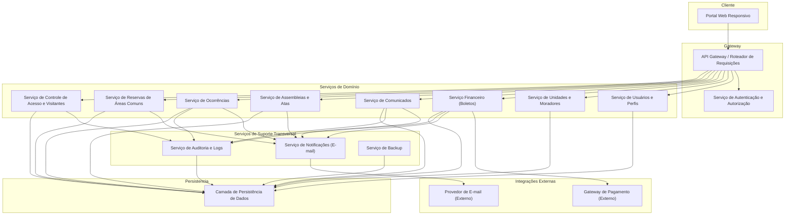
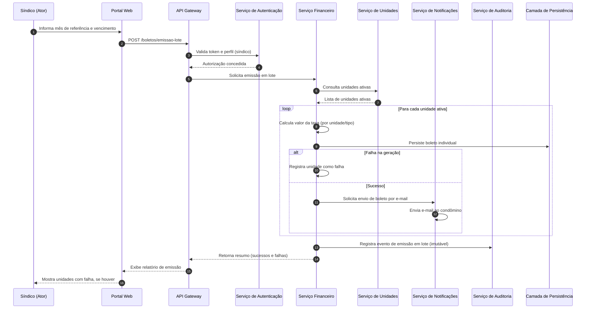
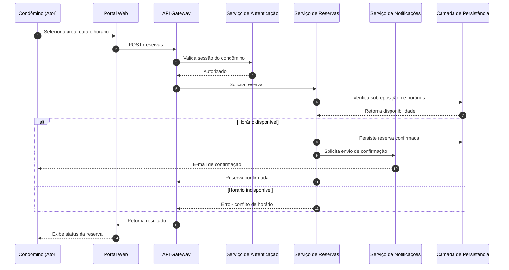
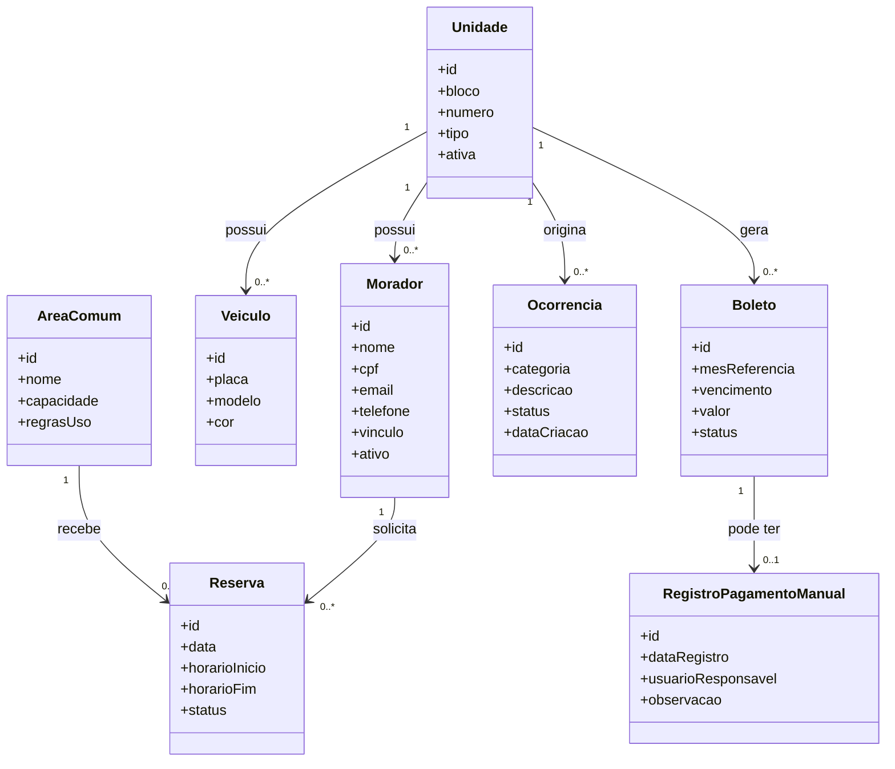

# Relatório Técnico de Arquitetura de Software

## 1. Identificação das HUs

| HU | Título | Perfil | RFs Relacionados |
|----|--------|--------|-------------------|
| HU01 | Cadastrar unidades e moradores | Síndico | RF04, RF05, RF06 |
| HU02 | Emitir boletos em lote | Síndico | RF10, RF13, RF17, RNF11 |
| HU03 | Acompanhar inadimplências | Síndico | RF15, RNF08 |
| HU04 | Publicar comunicados | Síndico | RF16, RF17 |
| HU05 | Gerenciar ocorrências | Síndico | RF23, RF24 |
| HU06 | Criar e registrar assembleias | Síndico | RF18, RF19 |
| HU07 | Gerenciar áreas comuns e reservas | Síndico | RF25, RF27, RF29 |
| HU08 | Visualizar e pagar boleto pelo portal | Condômino | RF10, RF11, RF12 |
| HU09 | Reservar área comum | Condômino | RF26, RF27 |
| HU10 | Registrar e acompanhar ocorrência | Condômino | RF21, RF24 |
| HU11 | Pré-autorizar entrada de visitante | Condômino | RF31, RF32 |
| HU12 | Acompanhar assembleias e consultar atas | Condômino | RF20 |
| HU13 | Registrar entrada e saída de visitantes | Funcionário | RF30, RF32, RF33 |
| HU14 | Consultar pré-autorizações de acesso | Funcionário | RF32 |

**Observação:** RF01, RF02, RF03, RF07, RF08, RF09, RF14, RF22, RF28 não possuem HU explícita associada, mas são requisitos funcionais transversais ou complementares — tratados na Seção 7 (Gap Analysis).

---

## 2. Diagramas de Arquitetura (Mermaid)

### 2.1 Diagrama de Componentes (Visão Macro do Sistema)

### 2.2 Diagrama de Sequência — Emissão de Boletos em Lote (HU02)

### 2.3 Diagrama de Sequência — Reserva de Área Comum (HU09)

### 2.4 Diagrama de Classes Conceitual (Domínio Financeiro e Unidades)

---

## 3. Decisões de Arquitetura

| # | Decisão | Justificativa |
|---|---------|----------------|
| DA01 | Arquitetura organizada em serviços de domínio desacoplados (Usuários, Unidades, Financeiro, Comunicados, Assembleias, Ocorrências, Reservas, Acesso) | Os requisitos apresentam domínios de negócio claramente distintos com ciclos de evolução independentes (ex.: financeiro vs. controle de acesso), favorecendo baixo acoplamento e manutenibilidade (RNF13). |
| DA02 | Centralização de autenticação e autorização em componente único (Serviço de Autenticação) | RF01, RF02, RF03 e RNF01/RNF02 exigem controle uniforme de sessão e perfis de acesso em todos os módulos. |
| DA03 | Serviço de Notificações desacoplado dos serviços de domínio, acionado de forma assíncrona | RF17, RF24, RF31 e HU02/HU04/HU06/HU09 exigem envio de e-mail em múltiplos contextos; centralizar evita duplicação e permite retry independente sem bloquear a operação principal. |
| DA04 | Serviço de Auditoria como componente transversal, registrando eventos de forma imutável | RNF05, RNF06 e RNF13 exigem rastreabilidade de operações financeiras, acessos e eventos críticos; um serviço dedicado evita inconsistência entre domínios. |
| DA05 | Emissão de boletos em lote tratada como processo transacional por unidade, com registro individual de falhas | RNF11 exige que falha parcial não corrompa unidades bem-sucedidas; adotado padrão de processamento item-a-item com resultado agregado. |
| DA06 | Integração com gateway de pagamento isolada em adaptador dedicado dentro do Serviço Financeiro | RNF03 exige conformidade PCI-DSS e não armazenamento de dados de cartão; isolar a integração reduz superfície de risco e facilita substituição do provedor. |
| DA07 | Componente de Persistência abstraído como camada única, sem definição de tecnologia específica | Diretriz de neutralidade tecnológica; requisitos não especificam banco de dados, mantendo-se decisão em aberto para fases posteriores. |
| DA08 | Bloqueio de reservas sobrepostas tratado no Serviço de Reservas via verificação transacional antes da confirmação | RF27 exige garantia de exclusividade de horário; a validação deve ocorrer de forma atômica para evitar condições de corrida. |
| DA09 | Portal Web único responsivo para todos os perfis, com renderização condicional por permissão | RNF09 e RNF10 exigem responsividade e compatibilidade multiplataforma; um único front-end reduz duplicação de esforço de manutenção. |
| DA10 | Backup e retenção tratados como serviço de suporte independente, operando sobre a camada de persistência | RNF12 exige backup diário com retenção de 90 dias, aplicável a todos os domínios de forma uniforme. |

---

## 4. Tabela de Componentes e Rastreabilidade

| Componente | Responsabilidade Principal | Comunica-se com | Origem (HU / Critério de Aceite) |
|------------|------------------------------|-------------------|-------------------------------------|
| Portal Web Responsivo | Interface única de interação para síndico, condômino e funcionário, adaptável a dispositivos | API Gateway | RNF09, RNF10; todas as HUs |
| API Gateway | Roteamento de requisições e ponto único de entrada da aplicação | Todos os serviços de domínio, Serviço de Autenticação | RF02; transversal |
| Serviço de Autenticação | Autenticação, emissão/validação de sessão, controle de expiração e perfis de acesso | API Gateway, Serviço de Usuários | RF01, RF02, RF03, RNF01, RNF02 |
| Serviço de Usuários e Perfis | Cadastro e gestão de perfis (síndico, condômino, funcionário, administrador) | Serviço de Autenticação, Camada de Persistência | RF01, RF02 |
| Serviço de Unidades e Moradores | Cadastro de unidades, moradores, vínculo proprietário/inquilino, veículos | Camada de Persistência, Serviço Financeiro | HU01 (RF04, RF05, RF06, RF07, RF08) |
| Serviço Financeiro (Boletos) | Configuração de taxas, emissão individual/lote de boletos, integração de pagamento, painel de inadimplência | Gateway de Pagamento, Serviço de Unidades, Serviço de Notificações, Serviço de Auditoria | HU02, HU03, HU08 (RF09-RF15, RNF08, RNF11) |
| Serviço de Comunicados | Publicação e fixação de comunicados no portal | Serviço de Notificações, Camada de Persistência | HU04 (RF16, RF17) |
| Serviço de Assembleias e Atas | Criação de assembleias, registro de atas e anexos, consulta pelo condômino | Serviço de Notificações, Camada de Persistência | HU06, HU12 (RF18, RF19, RF20) |
| Serviço de Ocorrências | Registro, categorização, atualização de status e histórico de ocorrências | Serviço de Notificações, Camada de Persistência | HU05, HU10 (RF21, RF22, RF23, RF24) |
| Serviço de Reservas de Áreas Comuns | Cadastro de áreas, validação de sobreposição, calendário de reservas, cancelamento | Serviço de Notificações, Camada de Persistência | HU07, HU09 (RF25-RF29) |
| Serviço de Controle de Acesso e Visitantes | Registro de entrada/saída, pré-autorizações, histórico de acesso | Serviço de Unidades, Serviço de Auditoria, Camada de Persistência | HU11, HU13, HU14 (RF30-RF33) |
| Serviço de Notificações (E-mail) | Disparo assíncrono de e-mails para eventos do sistema | Provedor de E-mail (externo), demais serviços de domínio | RF17, RF24, RF31; múltiplas HUs |
| Serviço de Auditoria e Logs | Registro imutável de eventos críticos (financeiro, acesso, comunicados, ocorrências) | Camada de Persistência, todos os serviços de domínio | RNF05, RNF06, RNF13 |
| Serviço de Backup | Execução de rotinas de backup e retenção de dados | Camada de Persistência | RNF12 |
| Camada de Persistência de Dados | Armazenamento e recuperação de dados de todos os domínios | Todos os serviços de domínio, Auditoria, Backup | Transversal |
| Gateway de Pagamento (Externo) | Processamento e confirmação de pagamentos de boletos | Serviço Financeiro | RF11, RF12, RNF03 |
| Provedor de E-mail (Externo) | Entrega efetiva de mensagens eletrônicas | Serviço de Notificações | RF17, RF24, RF31 |

---

## 5. Bloqueios e Pendências

| # | Descrição | Impacto | Responsável Sugerido |
|---|-----------|---------|------------------------|
| B01 | Não há definição do prazo configurável de cancelamento de reservas (RF28) — regra de negócio incompleta | Impede especificação do fluxo de cancelamento no Serviço de Reservas | Time de Produto / Síndico |
| B02 | Não há definição de política de retenção de dados pessoais para atendimento à LGPD (RNF04) além do genérico "conformidade" | Impacta modelagem de dados e ciclo de vida de moradores/visitantes desativados | Jurídico / Time de Produto |
| B03 | Critérios de desativação de moradores (RF07) não especificam se dados vinculados a boletos/ocorrências passadas permanecem visíveis ao síndico | Afeta modelagem de exclusão lógica vs. física | Time de Produto |
| B04 | Não há SLA definido para o Serviço de Notificações em caso de falha do provedor de e-mail externo | Pode comprometer RF17, RF24 se não houver estratégia de reenvio | Arquitetura / Infraestrutura |
| B05 | Ausência de definição sobre múltiplos síndicos ou substituição temporária de perfil (subsíndico) | Pode impactar modelo de permissões do RF02 | Time de Produto |
| B06 | Não há detalhamento de formato/tamanho de anexos (fotos em ocorrências, PDFs em atas) | Impacta dimensionamento de armazenamento e validações de upload | Arquitetura / UX |

---

## 6. Cobertura de Requisitos

### 6.1 Requisitos Funcionais

| RF | Coberto por HU | Coberto por Componente | Status |
|----|-----------------|--------------------------|--------|
| RF01 | — | Serviço de Usuários e Perfis | Coberto (sem HU dedicada) |
| RF02 | — | Serviço de Autenticação, API Gateway | Coberto (sem HU dedicada) |
| RF03 | — | Serviço de Autenticação | Coberto (sem HU dedicada) |
| RF04 | HU01 | Serviço de Unidades e Moradores | Coberto |
| RF05 | HU01 | Serviço de Unidades e Moradores | Coberto |
| RF06 | HU01 | Serviço de Unidades e Moradores | Coberto |
| RF07 | — | Serviço de Unidades e Moradores | Coberto (sem HU dedicada) |
| RF08 | — | Serviço de Unidades e Moradores | Coberto (sem HU dedicada) |
| RF09 | — | Serviço Financeiro | Coberto (sem HU dedicada) |
| RF10 | HU02, HU08 | Serviço Financeiro | Coberto |
| RF11 | HU08 | Serviço Financeiro, Gateway de Pagamento | Coberto |
| RF12 | HU08 | Serviço Financeiro | Coberto |
| RF13 | HU02 | Serviço Financeiro | Coberto |
| RF14 | — | Serviço Financeiro | Coberto (sem HU dedicada) |
| RF15 | HU03 | Serviço Financeiro | Coberto |
| RF16 | HU04 | Serviço de Comunicados | Coberto |
| RF17 | HU02, HU04 | Serviço de Notificações | Coberto |
| RF18 | HU06 | Serviço de Assembleias e Atas | Coberto |
| RF19 | HU06 | Serviço de Assembleias e Atas | Coberto |
| RF20 | HU12 | Serviço de Assembleias e Atas | Coberto |
| RF21 | HU10 | Serviço de Ocorrências | Coberto |
| RF22 | — | Serviço de Ocorrências | Coberto (sem HU dedicada) |
| RF23 | HU05 | Serviço de Ocorrências | Coberto |
| RF24 | HU05, HU10 | Serviço de Notificações | Coberto |
| RF25 | HU07 | Serviço de Reservas | Coberto |
| RF26 | HU09 | Serviço de Reservas | Coberto |
| RF27 | HU07, HU09 | Serviço de Reservas | Coberto |
| RF28 | — | Serviço de Reservas | Parcial (ver B01) |
| RF29 | HU07 | Serviço de Reservas | Coberto |
| RF30 | HU13 | Serviço de Controle de Acesso | Coberto |
| RF31 | HU11 | Serviço de Controle de Acesso | Coberto |
| RF32 | HU11, HU13, HU14 | Serviço de Controle de Acesso | Coberto |
| RF33 | — | Serviço de Controle de Acesso | Coberto (sem HU dedicada) |

### 6.2 Requisitos Não Funcionais

| RNF | Componente(s) Responsável(is) | Status |
|-----|---------------------------------|--------|
| RNF01 | Serviço de Autenticação | Coberto |
| RNF02 | Serviço de Autenticação | Coberto |
| RNF03 | Serviço Financeiro (adaptador de pagamento) | Coberto |
| RNF04 | Todos os serviços de domínio (transversal) | Parcial (ver B02) |
| RNF05 | Serviço de Auditoria | Coberto |
| RNF06 | Serviço de Auditoria, Serviço de Controle de Acesso | Coberto |
| RNF07 | Arquitetura geral / Infraestrutura (não detalhada) | Pendente de definição de infraestrutura |
| RNF08 | Serviço Financeiro | Coberto |
| RNF09 | Portal Web Responsivo | Coberto |
| RNF10 | Portal Web Responsivo | Coberto |
| RNF11 | Serviço Financeiro | Coberto |
| RNF12 | Serviço de Backup | Coberto |
| RNF13 | Serviço de Auditoria | Coberto |

---

## 7. Gap Analysis

| # | Lacuna Identificada | Impacto Arquitetural | Ação Recomendada |
|---|----------------------|------------------------|---------------------|
| G01 | RF28 (cancelamento de reserva com prazo configurável) não possui HU nem regra de negócio detalhada quanto ao cálculo do prazo | Serviço de Reservas não pode implementar validação de janela de cancelamento sem parâmetro definido | Definir com Produto a regra de configuração de prazo (ex.: horas antes do início) e modelar como atributo de AreaComum |
| G02 | RNF04 (LGPD) carece de detalhamento sobre consentimento, retenção e exclusão de dados de visitantes e moradores desativados | Modelagem de dados pode não atender requisitos legais; risco de retrabalho na camada de persistência | Elaborar política de dados pessoais em conjunto com jurídico antes da modelagem final de entidades |
| G03 | Não há requisito que trate de recuperação de senha ou gestão de conta bloqueada | Serviço de Autenticação incompleto para operação real | Incluir fluxo de recuperação/redefinição de senha como requisito complementar |
| G04 | RNF07 (disponibilidade 24/7, uptime 99,5%) não possui componente de infraestrutura definido (redundância, monitoramento) | Arquitetura lógica não garante, por si só, o SLA de disponibilidade | Endereçar em fase de arquitetura de infraestrutura/implantação, fora do escopo lógico atual |
| G05 | Não há definição de papel "administrador" em nenhuma HU, apenas citado em RF01/RF02 | Ambiguidade sobre limites de atuação do administrador vs. síndico | Detalhar responsabilidades específicas do perfil administrador em requisito futuro |
| G06 | Ausência de requisito sobre exportação de dados além do CSV de inadimplência (HU03) | Pode gerar demandas não previstas de relatórios em outros módulos (ocorrências, acessos) | Validar com stakeholders necessidade de exportação padronizada em outros domínios |
| G07 | Não há definição de idempotência para notificações do gateway de pagamento (RF12) em caso de reenvio de confirmação | Risco de duplicidade de atualização de status de boleto | Especificar mecanismo de deduplicação de eventos de confirmação no Serviço Financeiro |
| G08 | Falta de requisito sobre concorrência simultânea em reservas (RF27) sob alta carga | Pode não ser suficiente apenas verificação prévia; necessário garantir atomicidade | Especificar necessidade de controle transacional/atômico na criação de reservas como requisito não funcional adicional |