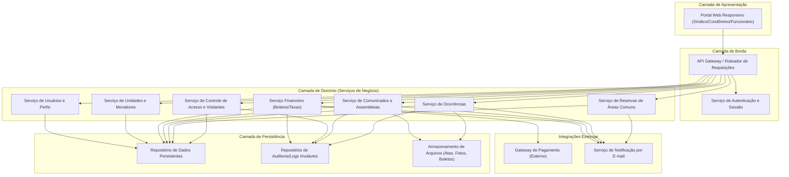
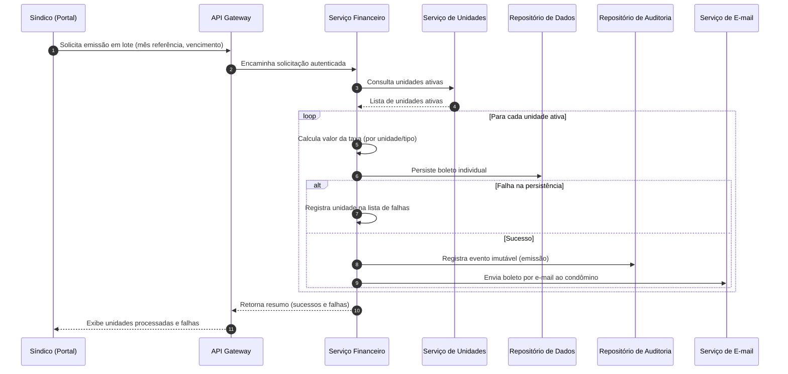
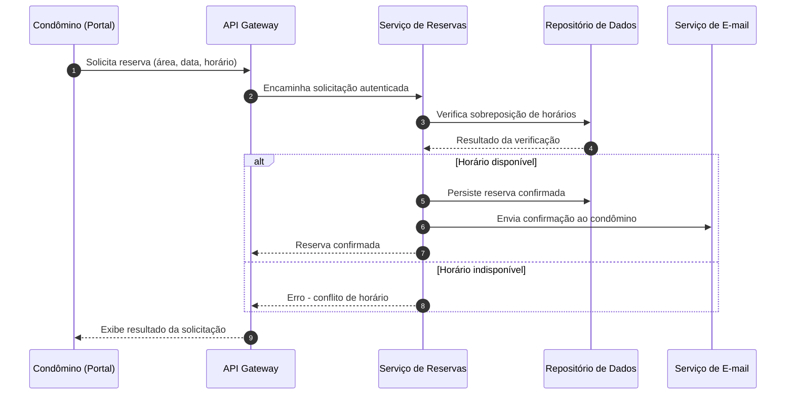

# Relatório Técnico de Arquitetura de Software
## Sistema de Administração de Condomínio Residencial (M04)

---

## 1. Identificação das HUs

| HU | Título | Perfil | RFs Relacionados | RNFs Relacionados |
|----|--------|--------|-------------------|--------------------|
| HU01 | Cadastrar unidades e moradores | Síndico | RF04, RF05, RF06 | RNF04 |
| HU02 | Emitir boletos em lote | Síndico | RF10, RF13, RF17 | RNF05, RNF11, RNF13 |
| HU03 | Acompanhar inadimplências | Síndico | RF15 | RNF08 |
| HU04 | Publicar comunicados | Síndico | RF16, RF17 | RNF13 |
| HU05 | Gerenciar ocorrências | Síndico | RF23, RF24 | RNF13 |
| HU06 | Criar e registrar assembleias | Síndico | RF18, RF19 | RNF13 |
| HU07 | Gerenciar áreas comuns e reservas | Síndico | RF25, RF27, RF29 | RNF08 |
| HU08 | Visualizar e pagar boleto pelo portal | Condômino | RF10, RF11, RF12 | RNF03, RNF05 |
| HU09 | Reservar área comum | Condômino | RF26, RF27 | RNF08 |
| HU10 | Registrar e acompanhar ocorrência | Condômino | RF21, RF24 | RNF13 |
| HU11 | Pré-autorizar entrada de visitante | Condômino | RF31, RF32 | RNF04, RNF06 |
| HU12 | Acompanhar assembleias e consultar atas | Condômino | RF20 | — |
| HU13 | Registrar entrada e saída de visitantes | Funcionário | RF30, RF32 | RNF06, RNF13 |
| HU14 | Consultar pré-autorizações de acesso | Funcionário | RF32 | RNF06 |

**RFs não diretamente cobertos por HUs explícitas (implícitos em fluxos de suporte):** RF01, RF02, RF03 (autenticação/autorização — transversais), RF07, RF08, RF09, RF14, RF22, RF28, RF33.

---

## 2. Diagramas de Arquitetura (Mermaid)

### 2.1 Diagrama de Componentes (Visão Macro)

### 2.2 Diagrama de Sequência — Emissão de Boletos em Lote (HU02 / RF13)

### 2.3 Diagrama de Sequência — Reserva de Área Comum (HU09 / RF26, RF27)

---

## 3. Decisões de Arquitetura

| # | Decisão | Justificativa | Trade-off |
|---|---------|----------------|-----------|
| DA01 | Arquitetura organizada por serviços de domínio (Usuários, Unidades, Financeiro, Comunicados, Ocorrências, Reservas, Acesso) | Reflete os módulos funcionais distintos do condomínio, facilitando manutenção e escalabilidade independente | Maior complexidade de orquestração entre serviços |
| DA02 | Autenticação e controle de acesso centralizados em componente transversal (AuthService) | RF01–RF03 e RNF01/RNF02 exigem controle único de sessão e perfis | Ponto único de dependência crítica |
| DA03 | Comunicação com gateway de pagamento isolada em adaptador dedicado dentro do Serviço Financeiro | RNF03 exige não armazenar dados de cartão; isolamento reduz superfície de risco PCI-DSS | Necessidade de contrato de integração bem definido e versionado |
| DA04 | Registro de auditoria como repositório separado e imutável | RNF05, RNF06 e RNF13 exigem rastreabilidade e imutabilidade de eventos críticos | Custo adicional de armazenamento e sincronização |
| DA05 | Emissão de boletos em lote tratada com processamento item-a-item com registro de falhas individuais (não transação monolítica) | RNF11 exige que falha parcial não corrompa as demais unidades | Necessita de mecanismo de repetição/retomada para unidades falhas |
| DA06 | Notificações (e-mail) desacopladas via serviço de notificação dedicado | Múltiplos fluxos (RF17, RF24, RF31, HU06, HU09) demandam envio assíncrono e reaproveitável | Depende de confiabilidade de entrega e monitoramento de falhas de envio |
| DA07 | Verificação de disponibilidade e bloqueio de sobreposição centralizados no Serviço de Reservas | RF27 exige garantia de exclusão mútua entre reservas concorrentes | Necessário mecanismo de concorrência (lock/verificação atômica) a especificar |
| DA08 | Armazenamento de arquivos (atas, fotos de ocorrências, boletos) como componente conceitual separado | RF19, RF25 (regras), HU06, HU10 exigem anexos | Não prescreve tecnologia; requer definição de política de retenção e acesso |
| DA09 | Portal único responsivo com controle de visibilidade por perfil | RNF09/RNF10 exigem responsividade e compatibilidade; RF02 exige restrição por perfil | Complexidade de UI condicional por papel |

---

## 4. Tabela de Componentes e Rastreabilidade

| Componente | Responsabilidade Principal | Comunica-se com | Origem (HU / Critério de Aceite) |
|------------|-----------------------------|-------------------|-------------------------------------|
| Portal Web Responsivo | Interface única para síndico, condômino e funcionário, adaptada por perfil | API Gateway | RF01–RF03, RNF09, RNF10 |
| API Gateway | Roteamento de requisições, validação de sessão | Todos os serviços de domínio | RF02, RNF01 |
| Serviço de Autenticação e Sessão | Login, logout, expiração de sessão, hash de senha | API Gateway, Serviço de Usuários | RF03, RNF01, RNF02 |
| Serviço de Usuários e Perfis | Cadastro de usuários e controle de perfis de acesso | API Gateway, Repositório de Dados | RF01, RF02 |
| Serviço de Unidades e Moradores | CRUD de unidades, vínculo de moradores, veículos, status ativo/inativo | Serviço Financeiro, Repositório de Dados | HU01, RF04–RF08 |
| Serviço Financeiro | Configuração de taxas, emissão de boletos, integração de pagamento, painel de inadimplência | Gateway de Pagamento, Serviço de Unidades, Repositório de Auditoria, Serviço de E-mail | HU02, HU03, HU08, RF09–RF15 |
| Serviço de Comunicados e Assembleias | Publicação de comunicados, gestão de assembleias e atas | Armazenamento de Arquivos, Serviço de E-mail | HU04, HU06, HU12, RF16–RF20 |
| Serviço de Ocorrências | Registro, categorização e atualização de status de ocorrências | Armazenamento de Arquivos, Serviço de E-mail | HU05, HU10, RF21–RF24 |
| Serviço de Reservas de Áreas Comuns | Cadastro de áreas, verificação de disponibilidade, confirmação/cancelamento de reservas | Serviço de E-mail, Repositório de Dados | HU07, HU09, RF25–RF29 |
| Serviço de Controle de Acesso e Visitantes | Registro de entrada/saída, pré-autorizações, histórico de acessos | Serviço de Unidades, Repositório de Auditoria | HU11, HU13, HU14, RF30–RF33 |
| Gateway de Pagamento (Externo) | Processamento e confirmação de pagamentos de boletos | Serviço Financeiro | RF11, RF12, RNF03 |
| Serviço de Notificação por E-mail | Envio assíncrono de notificações a usuários | Serviço Financeiro, Comunicados, Ocorrências, Reservas, Acesso | RF17, RF24, HU02, HU04, HU05, HU09, HU10 |
| Repositório de Dados | Persistência transacional de entidades de negócio | Todos os serviços de domínio | Transversal |
| Repositório de Auditoria | Armazenamento imutável de eventos críticos | Serviço Financeiro, Serviço de Acesso, Comunicados, Ocorrências | RNF05, RNF06, RNF13 |
| Armazenamento de Arquivos | Guarda de atas, fotos de ocorrências, documentos anexos | Comunicados, Ocorrências | HU06 (anexos), HU10 (fotos) |

---

## 5. Bloqueios e Pendências

| # | Descrição | Impacto | Responsável Sugerido |
|---|-----------|---------|------------------------|
| B01 | Não há definição de contrato/protocolo específico do gateway de pagamento (webhooks, callbacks, timeout) | Impede detalhamento do adaptador de pagamento | Time de Arquitetura + Fornecedor de Pagamento |
| B02 | Não há especificação de política de retenção de dados pessoais conforme LGPD (prazo de exclusão/anonimização) | Bloqueia definição de ciclo de vida de dados no Repositório de Dados | Jurídico/Compliance |
| B03 | Ausência de definição do prazo/regra padrão de cancelamento de reserva (RF28 diz "configurável", mas não define limites) | Impacta modelagem de regras de negócio no Serviço de Reservas | Product Owner / Síndico |
| B04 | Não há definição de SLA/tempo máximo de tentativa de reenvio de e-mails não entregues | Impacta confiabilidade de notificações (RF17, RF24) | Time de Arquitetura |
| B05 | Não há definição de mecanismo de "unicidade" de CPF em cenários de múltiplos condomínios (multi-tenant?) | Impacta modelo de dados de moradores | Product Owner |

---

## 6. Cobertura de Requisitos

| Categoria | Total RF | Cobertos por HU explícita | Cobertos implicitamente (transversal) | Não endereçados |
|-----------|----------|------------------------------|------------------------------------------|--------------------|
| Usuários e Acesso | 3 (RF01–RF03) | 0 | 3 | 0 |
| Unidades e Moradores | 5 (RF04–RF08) | 3 (RF04–06) | 2 (RF07, RF08) | 0 |
| Financeiro | 7 (RF09–RF15) | 5 | 2 (RF09, RF14) | 0 |
| Comunicados/Assembleias | 5 (RF16–RF20) | 5 | 0 | 0 |
| Ocorrências | 4 (RF21–RF24) | 3 | 1 (RF22) | 0 |
| Reservas | 5 (RF25–RF29) | 4 | 1 (RF28) | 0 |
| Acesso/Visitantes | 4 (RF30–RF33) | 3 | 1 (RF33) | 0 |
| **Total** | **33** | **23** | **10** | **0** |

**Observação:** Todos os RNFs (RNF01–RNF13) foram considerados requisitos transversais aplicáveis a múltiplos componentes, e estão refletidos nas Decisões de Arquitetura (Seção 3) e na tabela de componentes (Seção 4), não havendo RNF sem cobertura arquitetural identificada.

---

## 7. Gap Analysis

| # | Lacuna Identificada | Requisito(s) Relacionado(s) | Impacto Arquitetural | Ação Recomendada |
|---|------------------------|-------------------------------|---------------------------|------------------------|
| G01 | Ausência de definição de regras de concorrência para reservas simultâneas no mesmo instante (race condition) | RF27 | Pode gerar reservas duplicadas sob alta concorrência | Especificar mecanismo de verificação atômica/exclusão mútua no Serviço de Reservas |
| G02 | Falta de definição sobre reprocessamento de boletos que falharam na emissão em lote | RF13, RNF11 | Sem fluxo de reemissão, falhas exigem intervenção manual não especificada | Definir HU/fluxo de "reprocessar unidades falhas" |
| G03 | Não há requisito sobre papel do "administrador" além de citado no RF01 | RF01, RF02 | Modelo de permissões incompleto para este perfil | Detalhar casos de uso específicos do administrador |
| G04 | RF14 (registro de pagamento fora da plataforma) não possui HU nem critérios de aceite detalhados | RF14 | Regra de conciliação manual sem especificação de validação/auditoria | Elaborar HU complementar com critérios de aceite |
| G05 | Não há requisito de exclusão/anonimização de dados de visitantes e moradores desligados (retenção LGPD) | RNF04, RNF12 | Risco de não conformidade legal | Definir política de retenção e expurgo de dados pessoais |
| G06 | Ausência de critérios sobre tratamento de conflitos entre múltiplas pré-autorizações para o mesmo visitante/unidade | RF31, RF32 | Comportamento ambíguo na liberação pelo funcionário | Especificar regra de prioridade/validação de pré-autorizações |
| G07 | Não há definição de mecanismo de recuperação de senha (apenas login/logout mencionados) | RF03, RNF02 | Fluxo essencial de segurança ausente | Adicionar RF/HU de recuperação e redefinição de senha |
| G08 | RF08 (veículos) não possui HU nem fluxo de consulta/uso posterior (ex.: portaria) | RF08 | Funcionalidade cadastrada mas sem caso de uso de consumo definido | Esclarecer se veículos são usados no controle de acesso |
| G09 | Não há SLA definido para notificações por e-mail em massa (ex.: HU06 notifica "todos os condôminos") | RF17, HU04, HU06 | Risco de gargalo de desempenho não coberto por RNF08 | Definir requisito de desempenho/assincronismo para notificações em massa |
| G10 | Ausência de requisito sobre exportação de dados além do CSV de inadimplência (ex.: relatórios financeiros gerais) | HU03 | Escopo de relatórios pode estar subespecificado | Validar com stakeholders se há necessidade de relatórios adicionais |