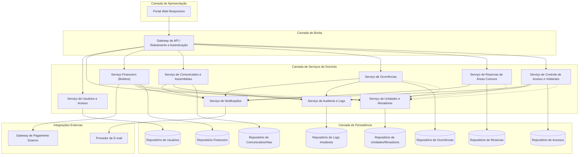
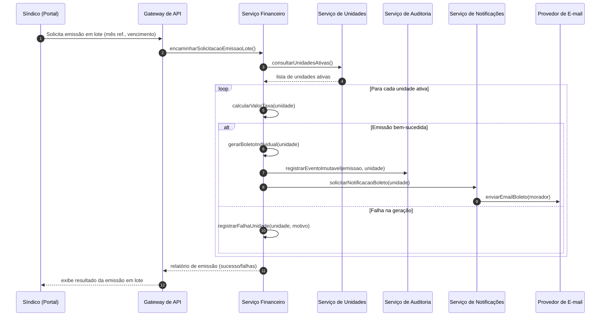
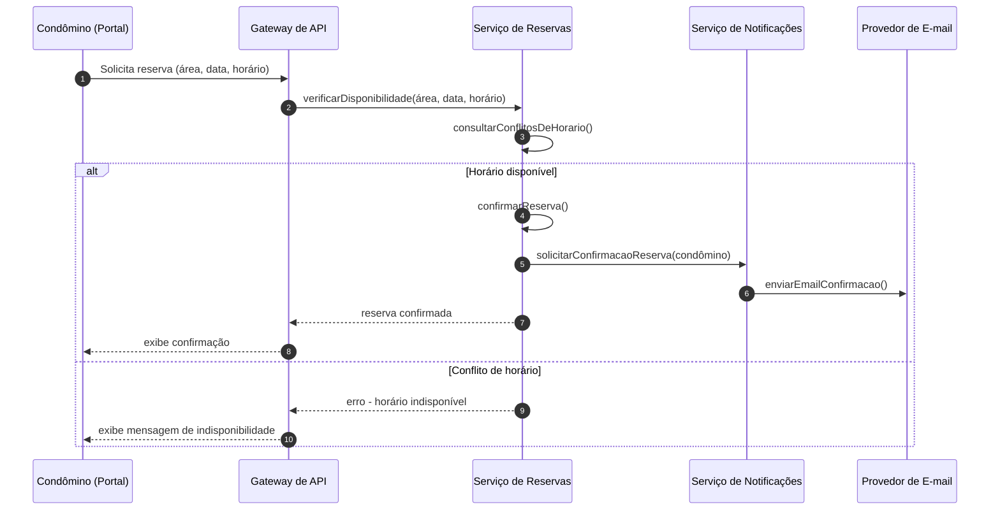

# Relatório Técnico de Arquitetura de Software
## Sistema de Administração de Condomínio Residencial (M04)

---

## 1. Identificação das HUs

| HU | Título | Perfil | RFs Relacionados | RNFs Relacionados |
|----|--------|--------|-------------------|--------------------|
| HU01 | Cadastrar unidades e moradores | Síndico | RF04, RF05, RF06, RF07, RF08 | RNF04 |
| HU02 | Emitir boletos em lote | Síndico | RF09, RF10, RF13, RF17 | RNF05, RNF11, RNF13 |
| HU03 | Acompanhar inadimplências | Síndico | RF15 | RNF08 |
| HU04 | Publicar comunicados | Síndico | RF16, RF17 | RNF13 |
| HU05 | Gerenciar ocorrências | Síndico | RF23, RF24 | RNF13 |
| HU06 | Criar e registrar assembleias | Síndico | RF18, RF19 | RNF13 |
| HU07 | Gerenciar áreas comuns e reservas | Síndico | RF25, RF27, RF29 | RNF08 |
| HU08 | Visualizar e pagar boleto pelo portal | Condômino | RF10, RF11, RF12 | RNF03, RNF05 |
| HU09 | Reservar área comum | Condômino | RF26, RF27 | RNF08 |
| HU10 | Registrar e acompanhar ocorrência | Condômino | RF21, RF24 | RNF13 |
| HU11 | Pré-autorizar entrada de visitante | Condômino | RF31 | RNF04, RNF06 |
| HU12 | Acompanhar assembleias e consultar atas | Condômino | RF20 | — |
| HU13 | Registrar entrada e saída de visitantes | Funcionário | RF30, RF32 | RNF06, RNF13 |
| HU14 | Consultar pré-autorizações de acesso | Funcionário | RF31, RF32 | RNF06 |

**RFs não vinculados diretamente a HUs explícitas** (cobertos transversalmente): RF01, RF02, RF03, RF14, RF22, RF28, RF33.

---

## 2. Diagramas de Arquitetura (Mermaid)

### 2.1 Diagrama de Componentes (Visão Macro)

### 2.2 Diagrama de Sequência — Emissão de Boletos em Lote (HU02)

### 2.3 Diagrama de Sequência — Reserva de Área Comum (HU09)

---

## 3. Decisões de Arquitetura

| # | Decisão | Justificativa | Consequência |
|---|---------|----------------|---------------|
| D01 | Arquitetura organizada em serviços de domínio desacoplados (Usuários, Unidades, Financeiro, Comunicação, Ocorrências, Reservas, Acesso) | Os requisitos apresentam domínios funcionais claramente distintos, com ciclos de mudança e atores diferentes | Facilita manutenção e evolução independente de cada domínio; exige contrato de integração bem definido entre serviços |
| D02 | Serviço de Notificações centralizado e desacoplado dos serviços de domínio | RF17, RF24, RF31 e HUs de comunicados/ocorrências exigem notificação por e-mail em múltiplos contextos | Evita duplicação de lógica de envio; permite trocar o canal de notificação sem alterar serviços de domínio |
| D03 | Serviço de Auditoria dedicado e append-only para eventos críticos | RNF05, RNF06 e RNF13 exigem registro imutável e rastreável | Introduz necessidade de mecanismo de persistência que garanta imutabilidade (a definir na fase técnica) |
| D04 | Gateway de API como ponto único de autenticação e controle de perfil de acesso | RF02, RF03 e RNF01 exigem controle de sessão e restrição por perfil centralizados | Simplifica aplicação de políticas de segurança; ponto único de falha a ser mitigado com redundância |
| D05 | Integração com gateway de pagamento tratada como serviço externo, sem armazenamento de dados sensíveis de cartão | RNF03 exige conformidade PCI-DSS | Serviço Financeiro deve tratar apenas referências/tokens de transação, nunca dados de cartão |
| D06 | Emissão de boletos em lote implementada como processo transacional por unidade, com isolamento de falhas | RNF11 exige que falha parcial não corrompa unidades não afetadas | Necessário mecanismo de processamento item-a-item com registro de exceções, não uma transação monolítica |
| D07 | Consistência de disponibilidade de reservas garantida por verificação síncrona no momento da solicitação | RF27 exige impedir sobreposição de reservas | Serviço de Reservas deve implementar controle de concorrência para evitar condições de corrida em reservas simultâneas |
| D08 | Modelo de "soft delete" para moradores (desativação lógica) | RF07 exige preservar histórico ao desativar morador | Repositórios devem suportar estado "inativo" sem exclusão física dos registros |
| D09 | Perfis de acesso modelados como atributo do usuário, validados centralmente no Gateway e reforçados em cada serviço | RF01, RF02 | Reduz risco de bypass de autorização; exige verificação redundante (defesa em profundidade) |
| D10 | Comunicação entre serviços de domínio realizada via interfaces de consulta (ex.: Financeiro consulta Unidades), evitando duplicação de dados mestres | Unidades/moradores são referenciados por múltiplos domínios (Financeiro, Reservas, Acesso, Ocorrências) | Serviço de Unidades atua como fonte única da verdade para dados cadastrais de unidades e moradores |

---

## 4. Tabela de Componentes e Rastreabilidade

| Componente | Responsabilidade Principal | Comunica-se com | Origem (HU / Critério de Aceite) |
|------------|----------------------------|-------------------|-------------------------------------|
| Portal Web Responsivo | Interface única para síndico, condômino e funcionário, adaptável a dispositivos | Gateway de API | RNF09, RNF10, todas as HUs |
| Gateway de API | Autenticação, roteamento e aplicação de políticas de acesso por perfil | Todos os serviços de domínio | RF01, RF02, RF03, RNF01 |
| Serviço de Usuários e Acesso | Cadastro de usuários, autenticação, controle de sessão | Repositório de Usuários, Gateway de API | RF01-RF03, RNF01, RNF02 |
| Serviço de Unidades e Moradores | Cadastro/edição/remoção de unidades, moradores e veículos; desativação lógica | Repositório de Unidades, Serviço Financeiro, Serviço de Reservas, Serviço de Acesso | RF04-RF08, HU01 |
| Serviço Financeiro | Configuração de taxas, emissão de boletos (individual/lote), registro de pagamentos manuais, painel de inadimplência | Gateway de Pagamento, Serviço de Unidades, Serviço de Auditoria, Serviço de Notificações | RF09-RF15, HU02, HU03, HU08 |
| Gateway de Pagamento (Externo) | Processamento e confirmação de pagamentos | Serviço Financeiro | RF11, RF12, RNF03 |
| Serviço de Comunicados e Assembleias | Publicação de comunicados, criação de assembleias, registro de atas | Serviço de Notificações, Serviço de Auditoria | RF16-RF20, HU04, HU06, HU12 |
| Serviço de Ocorrências | Registro, categorização e atualização de status de ocorrências | Serviço de Notificações, Serviço de Auditoria | RF21-RF24, HU05, HU10 |
| Serviço de Reservas de Áreas Comuns | Cadastro de áreas, verificação de disponibilidade, confirmação/cancelamento de reservas | Serviço de Unidades, Serviço de Notificações | RF25-RF29, HU07, HU09 |
| Serviço de Controle de Acesso e Visitantes | Registro de entrada/saída, pré-autorizações, histórico de acessos | Serviço de Unidades, Serviço de Auditoria | RF30-RF33, HU11, HU13, HU14 |
| Serviço de Notificações | Orquestração e envio de notificações por e-mail | Provedor de E-mail | RF17, RF24, HU02, HU04, HU05, HU09 |
| Provedor de E-mail (Externo) | Entrega efetiva de mensagens eletrônicas | Serviço de Notificações | RF17, RF24, RF31 |
| Serviço de Auditoria e Logs | Registro imutável de eventos críticos (financeiro, acesso, comunicados, ocorrências) | Repositório de Auditoria | RNF05, RNF06, RNF13 |
| Repositório de Usuários | Persistência de credenciais e perfis | Serviço de Usuários | RF01, RNF02 |
| Repositório de Unidades/Moradores | Persistência de unidades, moradores, veículos | Serviço de Unidades | RF04-RF08 |
| Repositório Financeiro | Persistência de boletos, pagamentos, configurações de taxa | Serviço Financeiro | RF09-RF15 |
| Repositório de Comunicados/Atas | Persistência de comunicados, assembleias, atas e anexos | Serviço de Comunicados | RF16-RF20 |
| Repositório de Ocorrências | Persistência de ocorrências e histórico de status | Serviço de Ocorrências | RF21-RF24 |
| Repositório de Reservas | Persistência de áreas comuns e reservas | Serviço de Reservas | RF25-RF29 |
| Repositório de Acessos | Persistência de registros de entrada/saída e pré-autorizações | Serviço de Acesso | RF30-RF33 |
| Repositório de Logs Imutáveis | Armazenamento append-only de eventos auditáveis | Serviço de Auditoria | RNF05, RNF06 |

---

## 5. Bloqueios e Pendências

| # | Descrição do Bloqueio/Pendência | Impacto | Responsável Sugerido |
|---|----------------------------------|---------|------------------------|
| B01 | Não há definição de qual gateway de pagamento será utilizado, nem os métodos suportados (boleto físico, PIX, cartão) | Impacta o desenho do contrato de integração do Serviço Financeiro | Síndico/Product Owner + Arquitetura |
| B02 | Não há especificação de prazo/regra padrão para cancelamento de reservas (RF28 menciona "prazo configurado", mas não define valores default) | Impacto no comportamento do Serviço de Reservas | Time de Negócio |
| B03 | Ausência de definição sobre política de retenção e expurgo de dados pessoais além do backup (RNF04 - LGPD) | Impacto jurídico e no design do Serviço de Auditoria/Repositórios | Jurídico/Compliance |
| B04 | Não há requisito claro sobre recuperação de senha / múltiplos fatores de autenticação | Impacto em RNF01/RNF02 e no Serviço de Usuários | Segurança da Informação |
| B05 | Falta definição de papéis de "administrador" além de síndico/condômino/funcionário nas HUs (RF01 cita, mas nenhuma HU o detalha) | Impacto na matriz de permissões do Gateway de API | Product Owner |
| B06 | Não há critério de aceite sobre concorrência entre múltiplos síndicos/administradores editando o mesmo cadastro | Pode gerar inconsistência em cenários multi-usuário | Arquitetura |

---

## 6. Cobertura de Requisitos

| Categoria | RFs Cobertos | RNFs Cobertos | Observações |
|-----------|----------------|------------------|--------------|
| Usuários e Acesso | RF01, RF02, RF03 | RNF01, RNF02 | Cobertos transversalmente pelo Gateway de API e Serviço de Usuários |
| Unidades e Moradores | RF04-RF08 | RNF04 | Totalmente cobertos por HU01 e Serviço de Unidades |
| Financeiro | RF09-RF15 | RNF03, RNF05, RNF08, RNF11 | Cobertos por HU02, HU03, HU08 |
| Comunicados e Assembleias | RF16-RF20 | RNF13 | Cobertos por HU04, HU06, HU12 |
| Ocorrências | RF21-RF24 | RNF13 | Cobertos por HU05, HU10 (RF22 - funcionário - sem HU dedicada) |
| Reservas | RF25-RF29 | RNF08 | Cobertos por HU07, HU09 |
| Controle de Acesso | RF30-RF33 | RNF04, RNF06 | Cobertos por HU11, HU13, HU14 |
| Transversais | — | RNF07, RNF09, RNF10, RNF12, RNF13 | Requisitos de infraestrutura/qualidade aplicados a todos os componentes |

**Cobertura geral**: 33/33 RFs endereçados (100%); 13/13 RNFs endereçados (100%), sendo alguns tratados como requisitos transversais de arquitetura em vez de vinculados a HUs específicas.

---

## 7. Gap Analysis

| # | Lacuna Identificada | Impacto Arquitetural | Ação Recomendada |
|---|------------------------|--------------------------|------------------------|
| G01 | RF14 (registro de pagamento fora da plataforma) e RF22 (ocorrências internas por funcionário) não possuem HU dedicada com critérios de aceite | Risco de interpretação divergente na implementação do Serviço Financeiro e de Ocorrências | Elicitar critérios de aceite específicos junto ao Product Owner antes do detalhamento técnico |
| G02 | RF28 (cancelamento de reserva dentro do prazo) não define o que ocorre com reservas fora do prazo — bloqueio total ou aprovação do síndico? | Ambiguidade na regra de negócio do Serviço de Reservas | Definir fluxo de exceção (aprovação manual vs. bloqueio automático) |
| G03 | RF33 (histórico de acessos consultável pelo síndico) não define volume esperado nem período de retenção específico, apenas backup geral (RNF12) | Impacto no dimensionamento do Repositório de Acessos e políticas de expurgo | Especificar retenção mínima/máxima de histórico de acessos, alinhado à LGPD |
| G04 | Não há requisito de auditoria/log para ações administrativas de cadastro (RF04-RF08), apenas para financeiro, comunicados, ocorrências e acesso (RNF13) | Risco de rastreabilidade incompleta em alterações cadastrais sensíveis (ex.: exclusão de unidade) | Avaliar extensão do RNF13 para cobrir também operações de cadastro de unidades/moradores |
| G05 | Ausência de requisito sobre idempotência/reprocessamento em caso de falha de comunicação com o gateway de pagamento (RF11, RF12) | Risco de duplicidade ou inconsistência no status de boletos | Definir mecanismo de confirmação idempotente e reconciliação periódica com o gateway |
| G06 | Não há especificação de SLA para o envio de notificações por e-mail (RF17, RF24, RF31) | Pode gerar expectativa não atendida quanto à "imediatidade" mencionada nos critérios de aceite | Definir SLA objetivo (ex.: tempo máximo de envio) e estratégia de reenvio em caso de falha |
| G07 | Não há requisito explícito de internacionalização/multi-idioma, nem de acessibilidade (WCAG) | Pode ser relevante dependendo do público-alvo do condomínio | Confirmar com stakeholders se é necessário considerar acessibilidade como RNF adicional |
| G08 | RF09 permite configurar taxa "por unidade ou por tipo de unidade", mas não há regra de precedência quando ambas configurações coexistem | Ambiguidade na lógica de cálculo do Serviço Financeiro | Definir regra de precedência (ex.: configuração por unidade sobrepõe configuração por tipo) |