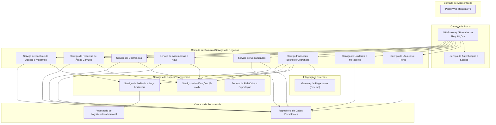
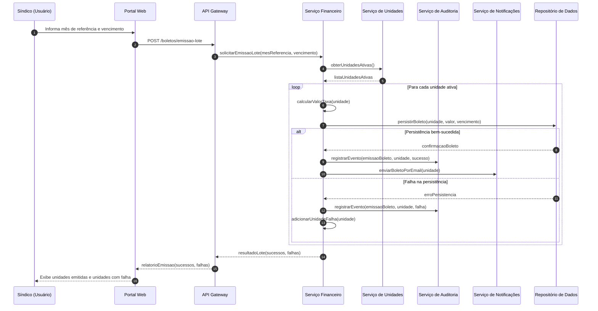
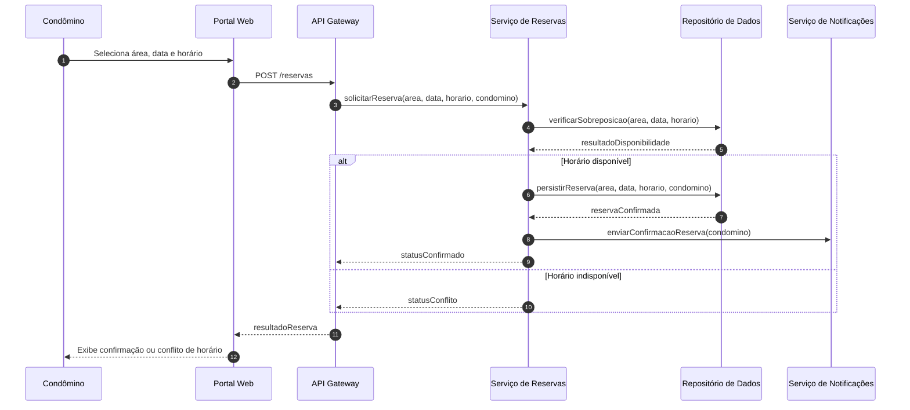

# Relatório Técnico de Arquitetura de Software
## Sistema de Administração de Condomínio Residencial (M04)

---

## 1. Identificação das HUs

| HU | Título | Perfil | RFs Relacionados | RNFs Relacionados |
|----|--------|--------|-------------------|--------------------|
| HU01 | Cadastrar unidades e moradores | Síndico | RF04, RF05, RF06 | RNF04 |
| HU02 | Emitir boletos em lote | Síndico | RF09, RF10, RF13 | RNF05, RNF11 |
| HU03 | Acompanhar inadimplências | Síndico | RF15 | RNF08 |
| HU04 | Publicar comunicados | Síndico | RF16, RF17 | RNF13 |
| HU05 | Gerenciar ocorrências | Síndico | RF23, RF24 | RNF13 |
| HU06 | Criar e registrar assembleias | Síndico | RF18, RF19 | RNF13 |
| HU07 | Gerenciar áreas comuns e reservas | Síndico | RF25, RF27, RF29 | RNF08 |
| HU08 | Visualizar e pagar boleto | Condômino | RF10, RF11, RF12 | RNF03, RNF05 |
| HU09 | Reservar área comum | Condômino | RF26, RF27 | RNF08 |
| HU10 | Registrar e acompanhar ocorrência | Condômino | RF21, RF24 | RNF04, RNF13 |
| HU11 | Pré-autorizar entrada de visitante | Condômino | RF31 | RNF04, RNF06 |
| HU12 | Acompanhar assembleias e atas | Condômino | RF20 | — |
| HU13 | Registrar entrada e saída de visitantes | Funcionário | RF30, RF32 | RNF06 |
| HU14 | Consultar pré-autorizações | Funcionário | RF32, RF33 | RNF06 |

Requisitos transversais não vinculados diretamente a uma HU específica: RF01, RF02, RF03, RF07, RF08, RF14, RF28, RNF01, RNF02, RNF07, RNF09, RNF10, RNF12.

---

## 2. Diagramas de Arquitetura (Mermaid)

### 2.1 Diagrama de Componentes (Visão Macro)

### 2.2 Diagrama de Sequência — Emissão de Boletos em Lote (HU02 / RF13 / RNF11)

### 2.3 Diagrama de Sequência — Reserva de Área Comum (HU09 / RF26 / RF27)

---

## 3. Decisões de Arquitetura

| # | Decisão | Justificativa | Requisitos Relacionados |
|---|---------|----------------|---------------------------|
| D01 | Adoção de arquitetura orientada a serviços de domínio (por capacidade de negócio: Financeiro, Ocorrências, Reservas, Acesso etc.), acessados via um ponto único de entrada (API Gateway). | Isola responsabilidades por domínio funcional, facilita evolução independente e atende à diversidade de perfis de acesso (RF01, RF02). | RF01-RF33 |
| D02 | Centralização da autenticação e controle de sessão em serviço dedicado, com política de expiração de sessão. | Atende RNF01 (expiração de sessão) e RF02/RF03 de forma transversal a todos os módulos. | RF02, RF03, RNF01 |
| D03 | Serviço de Auditoria desacoplado, com repositório de logs apartado do repositório operacional, garantindo imutabilidade dos registros. | Atende RNF05 (registro imutável financeiro) e RNF06 (registro de acesso) e RNF13 (logs de eventos críticos). | RNF05, RNF06, RNF13 |
| D04 | Serviço de Notificações assíncrono e desacoplado dos serviços de domínio, comunicando-se por meio de eventos/solicitações assíncronas. | Evita acoplamento forte entre publicação de comunicado/ocorrência/reserva e envio de e-mail; permite reprocessamento em falhas de envio. | RF17, RF24, RF27 (confirmação), HU02, HU04, HU05, HU09, HU06 |
| D05 | Integração com Gateway de Pagamento tratada por um adaptador dedicado dentro do Serviço Financeiro, sem armazenamento de dados sensíveis de cartão. | Atende RNF03 (PCI-DSS) isolando a complexidade de integração externa e reduzindo superfície de risco. | RF11, RF12, RNF03 |
| D06 | Emissão de boletos em lote tratada como processo transacional por unidade, com registro individual de sucesso/falha (padrão "melhor esforço com rastreamento de falhas parciais"). | Atende RNF11 diretamente — falha parcial não pode corromper unidades bem-sucedidas. | RF13, RNF11 |
| D07 | Serviço de Reservas garante exclusão mútua lógica na verificação de sobreposição antes da confirmação (verificação + persistência tratadas como operação atômica conceitual). | Atende RF27 (impedir sobreposição) sem prescrever mecanismo de banco específico. | RF27, RNF08 |
| D08 | Modelo de dados de Unidade e Morador desacoplado de Usuário (conta de acesso), permitindo que um morador exista antes de possuir credencial de acesso. | Atende RF05-RF07, onde desativação de morador não deve remover histórico. | RF05, RF06, RF07 |
| D09 | Serviço de Relatórios consome dados do Serviço Financeiro por meio de consulta somente leitura, sem duplicar lógica de negócio. | Suporta RF15 (painel de inadimplência) e exportação CSV sem acoplar responsabilidades de emissão à responsabilidade de relatório. | RF15, RNF08 |
| D10 | Interface de apresentação única (Portal Web) responsiva, consumida por todos os perfis, com diferenciação de funcionalidades via controle de acesso (RF02), não por aplicações separadas. | Atende RNF09 e RNF10 de forma simplificada, mantendo consistência de experiência entre perfis. | RF02, RNF09, RNF10 |

---

## 4. Tabela de Componentes e Rastreabilidade

| Componente | Responsabilidade Principal | Comunica-se com | Origem (HU / Critério de Aceite) |
|------------|------------------------------|--------------------|-------------------------------------|
| Portal Web | Interface responsiva de acesso para todos os perfis de usuário | API Gateway | RNF09, RNF10, HU08-HU14 |
| API Gateway | Roteamento de requisições, ponto único de entrada, aplicação de política de acesso por perfil | Todos os serviços de domínio, Serviço de Autenticação | RF02, RF03 |
| Serviço de Autenticação e Sessão | Autenticar usuários, gerenciar sessões, aplicar expiração automática, hash de senha | Serviço de Usuários, API Gateway | RF03, RNF01, RNF02 |
| Serviço de Usuários e Perfis | Cadastro de perfis (síndico, condômino, funcionário, administrador) e controle de permissões | Serviço de Autenticação, Repositório de Dados | RF01, RF02 |
| Serviço de Unidades e Moradores | Cadastro de unidades, vínculo de moradores, registro de veículos, desativação com preservação de histórico | Serviço Financeiro, Serviço de Acesso, Repositório de Dados | HU01 / RF04-RF08 |
| Serviço Financeiro | Configuração de taxas, emissão de boletos (individual/lote), registro de pagamentos manuais, integração com pagamento externo | Gateway de Pagamento, Serviço de Notificações, Serviço de Auditoria, Serviço de Relatórios | HU02, HU03, HU08 / RF09-RF15 |
| Adaptador de Gateway de Pagamento | Encapsular comunicação com provedor de pagamento externo, sem persistir dados sensíveis | Gateway de Pagamento (externo), Serviço Financeiro | RF11, RF12, RNF03 |
| Serviço de Comunicados | Publicação e fixação de comunicados no portal | Serviço de Notificações, Repositório de Dados | HU04 / RF16, RF17 |
| Serviço de Assembleias e Atas | Criação de assembleias, registro de atas, anexos de documentos | Serviço de Notificações, Repositório de Dados | HU06, HU12 / RF18-RF20 |
| Serviço de Ocorrências | Registro, categorização e atualização de status de ocorrências | Serviço de Notificações, Repositório de Dados | HU05, HU10 / RF21-RF24 |
| Serviço de Reservas de Áreas Comuns | Cadastro de áreas, verificação de disponibilidade, confirmação/cancelamento de reservas, calendário | Serviço de Notificações, Repositório de Dados | HU07, HU09 / RF25-RF29 |
| Serviço de Controle de Acesso e Visitantes | Registro de entrada/saída, pré-autorizações, histórico de acesso por unidade | Serviço de Auditoria, Serviço de Unidades, Repositório de Dados | HU11, HU13, HU14 / RF30-RF33 |
| Serviço de Notificações | Envio assíncrono de e-mails de eventos (comunicados, boletos, ocorrências, reservas, assembleias) | Serviços de domínio consumidores | RF17, RF24, HU02, HU04, HU06, HU09, HU10 |
| Serviço de Auditoria e Logs | Registro imutável de eventos críticos e financeiros, com metadados de usuário/data/hora | Repositório de Logs, todos os serviços de domínio | RNF05, RNF06, RNF13 |
| Serviço de Relatórios e Exportação | Geração de painéis (inadimplência, calendário) e exportação CSV | Serviço Financeiro, Serviço de Reservas | HU03 / RF15, RNF08 |
| Repositório de Dados | Persistência operacional de entidades de domínio | Serviços de domínio | Todos os RFs |
| Repositório de Logs/Auditoria | Persistência apartada e imutável de registros de auditoria | Serviço de Auditoria | RNF05, RNF06 |

---

## 5. Bloqueios e Pendências

| # | Descrição | Impacto | Responsável Sugerido |
|---|-----------|---------|------------------------|
| B01 | Não há definição de qual entidade/perfil pode alterar/configurar a taxa condominial por tipo de unidade em conflito com valor por unidade específica (precedência não especificada em RF09). | Ambiguidade na regra de cálculo do valor do boleto. | Analista de Negócio / Síndico |
| B02 | Não há definição do prazo padrão ou configurável de cancelamento de reserva (RF28 menciona "prazo configurado" mas não define limites mínimos/máximos). | Impacta regra de negócio do Serviço de Reservas. | Product Owner |
| B03 | Ausência de especificação sobre o que ocorre com boletos, reservas e ocorrências vinculados a um morador desativado (RF07). | Pode gerar inconsistência de dados órfãos ou impedir consulta de histórico. | Arquiteto de Dados |
| B04 | Não há definição do perfil "Administrador" em nenhuma HU — apenas citado em RF01/RF02, sem casos de uso detalhados. | Responsabilidades e permissões desse perfil ficam indefinidas. | Product Owner |
| B05 | Não há requisito explícito sobre reprocessamento/retentativa em caso de falha no envio de e-mail de notificação. | Risco de perda silenciosa de notificações críticas (boletos, mudanças de status). | Arquiteto de Software |
| B06 | RNF07 exige 99,5% de uptime, mas não há requisito de estratégia de redundância ou plano de contingência definido. | Decisão de infraestrutura de alta disponibilidade fica em aberto. | Arquiteto de Infraestrutura |

---

## 6. Cobertura de Requisitos

| Categoria | RFs/RNFs Cobertos | Observação |
|-----------|--------------------|------------|
| Gestão de Usuários e Acesso | RF01, RF02, RF03 | Totalmente coberto por Serviço de Usuários + Autenticação |
| Gestão de Unidades e Moradores | RF04-RF08 | Totalmente coberto por Serviço de Unidades |
| Financeiro — Boletos | RF09-RF15 | Totalmente coberto por Serviço Financeiro + Adaptador de Pagamento |
| Comunicados e Assembleias | RF16-RF20 | Totalmente coberto |
| Ocorrências | RF21-RF24 | Totalmente coberto |
| Reserva de Áreas Comuns | RF25-RF29 | Totalmente coberto |
| Controle de Acesso e Visitantes | RF30-RF33 | Totalmente coberto |
| Segurança | RNF01-RNF03 | Coberto conceitualmente (Autenticação + Adaptador de Pagamento) |
| Conformidade | RNF04 | Coberto transversalmente — pendente detalhamento operacional (ver Gap Analysis) |
| Rastreabilidade | RNF05, RNF06 | Coberto pelo Serviço de Auditoria |
| Disponibilidade/Desempenho | RNF07, RNF08 | Coberto como atributo de qualidade — decisão de infraestrutura em aberto |
| Usabilidade/Compatibilidade | RNF09, RNF10 | Coberto pela decisão de Portal único responsivo |
| Confiabilidade | RNF11 | Coberto pelo desenho transacional por unidade (D06) |
| Backup | RNF12 | Não endereçado por componente específico — ver Gap Analysis |
| Manutenibilidade | RNF13 | Coberto pelo Serviço de Auditoria e Logs |

**Cobertura geral estimada: 33/33 RFs mapeados a componentes; 12/13 RNFs mapeados diretamente, 1 RNF (backup) sem componente arquitetural dedicado explícito.**

---

## 7. Gap Analysis

| # | Lacuna Identificada | Impacto Arquitetural | Ação Recomendada |
|---|------------------------|--------------------------|------------------------|
| G01 | RNF12 (backup diário, retenção 90 dias) não possui componente ou responsabilidade arquitetural explicitamente definida no desenho de domínio. | Risco de a responsabilidade ficar implícita apenas na camada de infraestrutura, sem processo de verificação/restauração formalizado. | Definir um componente/processo de "Rotina de Backup e Retenção" com política de verificação periódica, independente da escolha tecnológica. |
| G02 | RNF04 (LGPD) é citado como requisito transversal, mas não há especificação de mecanismos como consentimento, anonimização ou direito de exclusão para dados de visitantes/moradores. | Serviços de Unidades e Acesso manipulam dados pessoais sensíveis sem workflow de conformidade definido. | Especificar HUs adicionais para gestão de consentimento e requisições de titulares de dados (ex.: exclusão/anonimização mediante regras de retenção). |
| G03 | Não há definição de idempotência para confirmação de pagamento vindo do Gateway de Pagamento (RF12) — risco de duplicidade de notificação de "pago" em reenvios do provedor externo. | Pode gerar inconsistência no status financeiro e notificações duplicadas. | Incluir critério de aceite explícito sobre tratamento de eventos duplicados/idempotência no Adaptador de Pagamento. |
| G04 | Ausência de regra sobre concorrência simultânea na verificação de disponibilidade de reserva (RF27) quando duas requisições chegam no mesmo instante. | Diagrama de sequência assume verificação e persistência como etapa lógica única, mas a especificação não define exclusividade formal (lock/transação). | Detalhar requisito não funcional de consistência para operações concorrentes no Serviço de Reservas. |
| G05 | Não há especificação de retenção/expurgo de dados de visitantes (RF33 menciona histórico consultável, mas não por quanto tempo). | Pode conflitar com RNF04 (LGPD) quanto à minimização de dados. | Definir política de retenção de histórico de acesso de visitantes em conjunto com requisito de conformidade. |
| G06 | Perfil "Administrador" citado em RF01/RF02 sem nenhuma HU ou responsabilidade descrita. | Componente de Usuários precisa de casos de uso adicionais para não deixar esse perfil arquiteturalmente órfão. | Elicitar requisitos específicos do perfil Administrador junto ao Product Owner antes da implementação. |
| G07 | Não há requisito sobre trilha de auditoria para alterações cadastrais de unidades/moradores (apenas financeiro e acesso possuem RNF de rastreabilidade explícita). | Inconsistência de cobertura de auditoria entre módulos de mesma criticidade. | Avaliar extensão do Serviço de Auditoria para cobrir também operações de cadastro (RF04-RF08). |