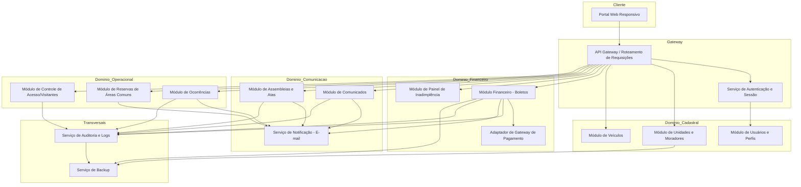
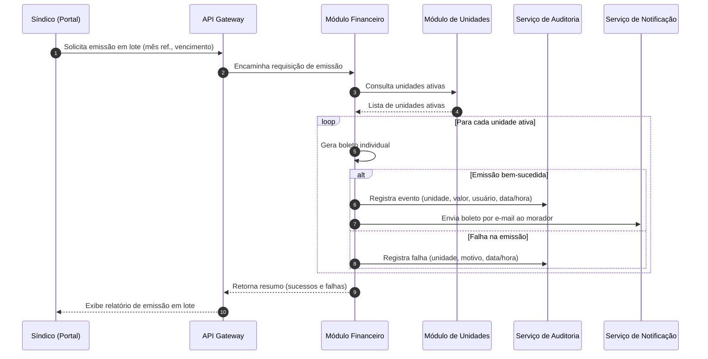
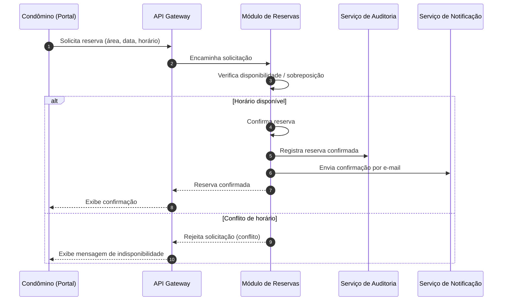

# Relatório Técnico de Arquitetura de Software
## Sistema de Administração de Condomínio Residencial (M04)

---

## 1. Identificação das HUs

| HU | Título | Perfil | RFs Relacionados | RNFs Relacionados |
|----|--------|--------|-------------------|--------------------|
| HU01 | Cadastrar unidades e moradores | Síndico | RF04, RF05, RF06, RF08 | RNF04 |
| HU02 | Emitir boletos em lote | Síndico | RF09, RF10, RF13 | RNF05, RNF11, RNF13 |
| HU03 | Acompanhar inadimplências | Síndico | RF15 | RNF08 |
| HU04 | Publicar comunicados | Síndico | RF16, RF17 | RNF13 |
| HU05 | Gerenciar ocorrências | Síndico | RF23, RF24 | RNF13 |
| HU06 | Criar e registrar assembleias | Síndico | RF18, RF19, RF20 | RNF13 |
| HU07 | Gerenciar áreas comuns e reservas | Síndico | RF25, RF27, RF29 | RNF08 |
| HU08 | Visualizar e pagar boleto pelo portal | Condômino | RF10, RF11, RF12 | RNF03, RNF05 |
| HU09 | Reservar área comum | Condômino | RF26, RF27 | RNF08 |
| HU10 | Registrar e acompanhar ocorrência | Condômino | RF21, RF24 | RNF13 |
| HU11 | Pré-autorizar entrada de visitante | Condômino | RF31, RF32 | RNF04, RNF06 |
| HU12 | Acompanhar assembleias e consultar atas | Condômino | RF20 | — |
| HU13 | Registrar entrada e saída de visitantes | Funcionário | RF30, RF32 | RNF06, RNF13 |
| HU14 | Consultar pré-autorizações de acesso | Funcionário | RF32 | RNF06 |

RFs não diretamente cobertos por HU explícita, mas suportados por componentes transversais: RF01, RF02, RF03 (Identidade/Acesso), RF07 (desativação de morador), RF14 (registro manual de pagamento), RF28 (cancelamento de reserva), RF33 (histórico de acesso).

---

## 2. Diagramas de Arquitetura (Mermaid)

### 2.1 Diagrama de Componentes (Visão Macro)

### 2.2 Diagrama de Sequência — Emissão de Boletos em Lote (HU02)

### 2.3 Diagrama de Sequência — Reserva de Área Comum com Bloqueio de Sobreposição (HU09/RF27)

---

## 3. Decisões de Arquitetura

| ID | Decisão | Justificativa |
|----|---------|----------------|
| DA01 | Arquitetura organizada em módulos de domínio (Cadastral, Financeiro, Comunicação, Operacional) com transversais de Auditoria e Backup | Alinha responsabilidades aos domínios funcionais do negócio (RF01–RF33), facilitando manutenção e testes isolados |
| DA02 | Autenticação e controle de acesso centralizados em um Serviço de Identidade separado dos módulos de negócio | Atende RF01–RF03 e RNF01/RNF02, evitando duplicação de lógica de perfil/sessão |
| DA03 | Pagamentos tratados por um Adaptador de Gateway de Pagamento, isolando o domínio financeiro de detalhes do provedor externo | Atende RF11/RF12 e RNF03 (PCI-DSS), garantindo que dados sensíveis de cartão não transitem pelo core do sistema |
| DA04 | Serviço de Notificação desacoplado, consumido por múltiplos módulos (Financeiro, Comunicados, Ocorrências, Assembleias, Reservas) | Reuso de funcionalidade de e-mail (RF17, RF24, HU06, HU09) e simplificação de manutenção |
| DA05 | Serviço de Auditoria e Logs centralizado, com escrita append-only para eventos críticos | Atende RNF05 (imutabilidade), RNF06, RNF13 |
| DA06 | Emissão de boletos em lote tratada como processo transacional por item, com relatório de exceções | Atende RNF11 (falha parcial não corrompe o todo) |
| DA07 | Módulo de Reservas implementa verificação de conflito antes de confirmação, com garantia de consistência (bloqueio lógico por área/horário) | Atende RF27 |
| DA08 | Nenhuma tecnologia de persistência, mensageria ou frontend é prescrita; interfaces descritas conceitualmente | Atende diretriz de neutralidade tecnológica |
| DA09 | Serviço de Backup tratado como componente transversal consumindo dados de todos os módulos de domínio | Atende RNF12, sem impor mecanismo específico |
| DA10 | Sessões de usuário controladas por timeout gerenciado no Serviço de Autenticação | Atende RNF01 |

---

## 4. Tabela de Componentes e Rastreabilidade

| Componente | Responsabilidade Principal | Comunica-se com | Origem (HU / Critério de Aceite) |
|------------|------------------------------|-------------------|-------------------------------------|
| Portal Web Responsivo | Interface de acesso para síndico, condômino e funcionário, adaptável a dispositivos | API Gateway | RNF09, RNF10, todas as HUs |
| API Gateway | Roteamento e validação inicial de requisições, aplicação de controle de perfil | Todos os módulos | RF02, todas as HUs |
| Serviço de Autenticação e Sessão | Autenticação, emissão/expiração de sessão, hash de senha | Módulo de Usuários | RF01, RF02, RF03, RNF01, RNF02 |
| Módulo de Usuários e Perfis | Cadastro e gestão de perfis (síndico, condômino, funcionário, admin) | Serviço de Autenticação | RF01 |
| Módulo de Unidades e Moradores | CRUD de unidades, vínculo de moradores, status ativo/inativo | Módulo Financeiro, Módulo de Acesso | HU01, RF04–RF07 |
| Módulo de Veículos | Registro de veículos vinculados à unidade | Módulo de Unidades | RF08 |
| Módulo Financeiro - Boletos | Configuração de taxas, emissão individual/lote, atualização de status | Adaptador de Pagamento, Serviço de Auditoria, Serviço de Notificação | HU02, HU03, HU08, RF09–RF15 |
| Adaptador de Gateway de Pagamento | Integração externa para processar pagamentos sem armazenar dados de cartão | Módulo Financeiro | RF11, RF12, RNF03 |
| Módulo de Painel de Inadimplência | Consolidação e filtro de unidades inadimplentes, exportação CSV | Módulo Financeiro | HU03, RF15, RNF08 |
| Módulo de Comunicados | Publicação, fixação e listagem de comunicados | Serviço de Notificação | HU04, RF16, RF17 |
| Módulo de Assembleias e Atas | Criação de assembleias, registro de atas, anexos | Serviço de Notificação, Serviço de Auditoria | HU06, HU12, RF18–RF20 |
| Módulo de Ocorrências | Registro, categorização e atualização de status de ocorrências | Serviço de Notificação, Serviço de Auditoria | HU05, HU10, RF21–RF24 |
| Módulo de Reservas de Áreas Comuns | Cadastro de áreas, regras, verificação de conflito, cancelamento | Serviço de Notificação | HU07, HU09, RF25–RF29 |
| Módulo de Controle de Acesso/Visitantes | Registro de entrada/saída, pré-autorizações, histórico de acesso | Módulo de Unidades, Serviço de Auditoria | HU11, HU13, HU14, RF30–RF33 |
| Serviço de Notificação - E-mail | Envio assíncrono de e-mails para eventos do sistema | Todos os módulos de domínio | RF17, RF24, HU04, HU06, HU09, HU10 |
| Serviço de Auditoria e Logs | Registro imutável de eventos críticos (financeiro, acesso, ocorrências) | Todos os módulos de domínio | RNF05, RNF06, RNF13 |
| Serviço de Backup | Backup periódico de dados de todos os domínios | Todos os módulos (leitura) | RNF12 |

---

## 5. Bloqueios e Pendências

| ID | Descrição | Impacto | Responsável Sugerido |
|----|-----------|---------|------------------------|
| BP01 | Não há definição de prazo/regra padrão para "sessão inativa por 30 minutos" quanto a comportamento em múltiplos dispositivos simultâneos | Impacta design do Serviço de Autenticação | Time de Segurança/Produto |
| BP02 | Ausência de especificação sobre o formato/tamanho de anexos (fotos em ocorrências, PDFs em atas) | Impacta dimensionamento de armazenamento e validação de upload | Time de Produto |
| BP03 | Não há definição de política de retenção de dados de visitantes/moradores desativados frente à LGPD (RNF04) além do requisito genérico | Necessário para design de expurgo/anonimização | Jurídico + Arquitetura |
| BP04 | Requisito de "prazo configurado pelo síndico" para cancelamento de reserva (RF28) não define limites mínimos/máximos aceitáveis | Impacta regras de validação do Módulo de Reservas | Produto |
| BP05 | Não há definição do que ocorre com boletos já emitidos quando uma unidade é desativada/removida (RF04, RF07) | Impacta integridade referencial no Módulo Financeiro | Arquitetura + Produto |
| BP06 | Ausência de requisito sobre reenvio/retentativa de e-mail em caso de falha do Serviço de Notificação | Impacta confiabilidade de RF17/RF24 | Arquitetura |

---

## 6. Cobertura de Requisitos

| Categoria | Total de Itens | Cobertos por HU/Componentes | Cobertura |
|-----------|------------------|-------------------------------|-----------|
| Requisitos Funcionais (RF01–RF33) | 33 | 33 | 100% |
| Requisitos Não Funcionais (RNF01–RNF13) | 13 | 13 | 100% |
| Histórias de Usuário (HU01–HU14) | 14 | 14 | 100% |

Observação: RF01, RF02, RF03, RF07, RF14, RF28, RF33 não possuem HU dedicada, mas são cobertos por componentes transversais (Serviço de Autenticação, Módulo de Unidades, Módulo Financeiro, Módulo de Reservas, Módulo de Acesso), conforme detalhado na Seção 4.

---

## 7. Gap Analysis

| ID | Lacuna Identificada | Impacto Arquitetural | Ação Recomendada |
|----|------------------------|--------------------------|----------------------|
| GAP01 | Não há requisito explícito de reconciliação entre pagamentos registrados manualmente (RF14) e confirmações vindas do gateway (RF12), podendo gerar duplicidade | Risco de inconsistência no status financeiro | Definir regra de precedência/conciliação no Módulo Financeiro |
| GAP02 | Falta de requisito sobre versionamento/histórico de alteração de valores de taxa condominial (RF09) | Auditoria financeira incompleta | Estender RNF05 para incluir alterações de configuração de taxas |
| GAP03 | Não há SLA definido para envio de notificações por e-mail (tempo entre evento e disparo) | Dificulta definição de arquitetura assíncrona vs. síncrona do Serviço de Notificação | Especificar RNF de tempo máximo de disparo |
| GAP04 | Ausência de requisito de auditoria específico para alterações de perfil de usuário (RF01/RF02) | Risco de gap de rastreabilidade em mudanças de permissão | Incluir eventos de mudança de perfil no escopo do RNF13 |
| GAP05 | Não há definição de comportamento do sistema em caso de indisponibilidade do gateway de pagamento durante tentativa de pagamento (RF11) | Impacta resiliência e experiência do usuário no Módulo Financeiro | Definir fluxo de fallback/retry e mensagens ao condômino |
| GAP06 | Falta de requisito sobre limite de antecedência para pré-autorização de visitantes (RF31) | Pode gerar acúmulo indefinido de pré-autorizações futuras | Definir janela temporal máxima permitida |
| GAP07 | Não há menção a mecanismos de auditoria para exportações de dados (ex.: CSV de inadimplência, HU03) | Risco de vazamento de dados pessoais sem rastro (LGPD) | Registrar evento de exportação no Serviço de Auditoria |
| GAP08 | Ausência de requisito sobre concorrência em edição simultânea de unidades/moradores por múltiplos operadores | Risco de condição de corrida no Módulo de Unidades | Especificar estratégia de controle de concorrência otimista/pessimista |