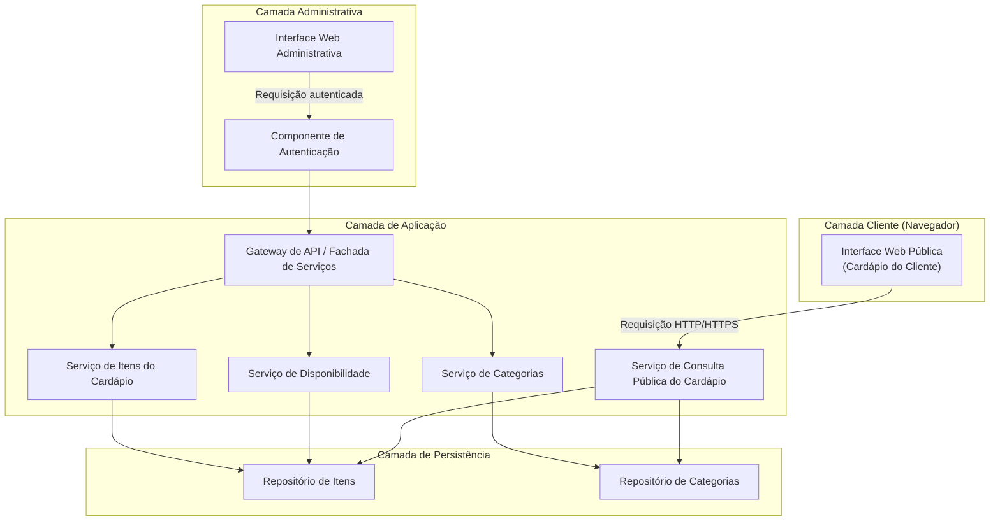
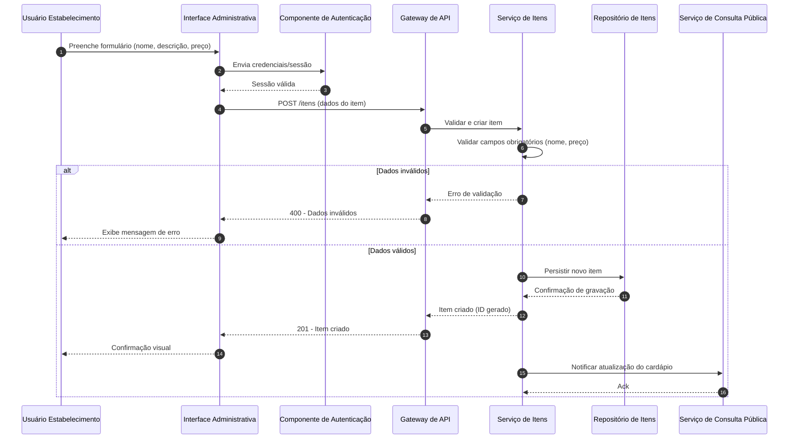
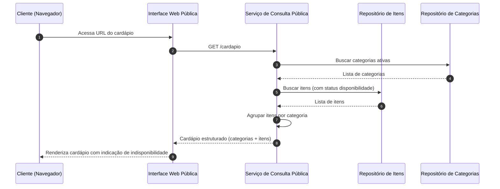

# Relatório Técnico de Arquitetura de Software

## 1. Identificação das HUs

| HU | Título | Perfil | RFs Relacionados | RNFs Relacionados |
|----|--------|--------|-------------------|---------------------|
| HU01 | Cadastrar item no cardápio | Estabelecimento | RF01 | RNF03, RNF05 |
| HU02 | Organizar itens por categoria | Estabelecimento | RF04, RF05 | RNF05 |
| HU03 | Editar item do cardápio | Estabelecimento | RF02 | RNF02, RNF03 |
| HU04 | Marcar item como indisponível | Estabelecimento | RF06, RF07 | RNF03 |
| HU05 | Remover item do cardápio | Estabelecimento | RF03 | RNF03 |
| HU06 | Visualizar cardápio sem cadastro | Cliente | RF08 | RNF01, RNF02, RNF04, RNF06 |
| HU07 | Navegar por categorias | Cliente | RF09 | RNF01, RNF06, RNF07 |
| HU08 | Identificar itens indisponíveis | Cliente | RF10, RF11 | RNF01, RNF07 |

---

## 2. Diagramas de Arquitetura (Mermaid)

### 2.1 Diagrama de Componentes (Visão Macro)

### 2.2 Diagrama de Sequência — Cadastro de Item (HU01)

### 2.3 Diagrama de Sequência — Consulta do Cardápio pelo Cliente (HU06, HU07, HU08)

---

## 3. Decisões de Arquitetura

| ID | Decisão | Justificativa | Requisitos Relacionados |
|----|---------|----------------|---------------------------|
| DA01 | Separação clara entre interface administrativa (autenticada) e interface pública (sem autenticação) | Atende à exigência de acesso sem fricção para o cliente (RF08) e segurança para o estabelecimento (RNF03) | RF08, RNF03 |
| DA02 | Adoção de arquitetura modular em camadas (apresentação, aplicação, persistência) | Facilita manutenibilidade e extensão futura sem acoplamento rígido | RNF05 |
| DA03 | Serviço de Consulta Pública desacoplado dos serviços administrativos | Permite otimizar desempenho e disponibilidade da leitura pública sem impactar operações de escrita | RNF02, RNF04 |
| DA04 | Marcação de indisponibilidade como atributo de estado do item, não como exclusão | Preserva histórico e permite reativação (RF06, RF07) | RF06, RF07 |
| DA05 | Item associado a exatamente uma categoria (relação 1:N) | Simplifica navegação e agrupamento, conforme critério de aceite da HU02 | HU02 |
| DA06 | Autenticação centralizada em componente dedicado | Permite reuso e evolução do mecanismo de autenticação sem afetar demais serviços | RNF03 |
| DA07 | Interface pública desenhada com foco em responsividade e acessibilidade desde a concepção | Atende RNF01, RNF06, RNF07 sem necessidade de retrabalho futuro | RNF01, RNF06, RNF07 |
| DA08 | Neutralidade tecnológica mantida em toda a documentação | Requisitos não especificam tecnologias; decisão de implementação fica a cargo do time de desenvolvimento | Todos |

---

## 4. Tabela de Componentes e Rastreabilidade

| Componente | Responsabilidade Principal | Comunica-se com | Origem (HU / Critério de Aceite) |
|------------|------------------------------|-------------------|-------------------------------------|
| Interface Web Administrativa | Prover telas para cadastro, edição, remoção e gestão de disponibilidade de itens e categorias | Componente de Autenticação, Gateway de API | HU01, HU02, HU03, HU04, HU05 |
| Interface Web Pública | Exibir cardápio ao cliente sem autenticação, de forma responsiva e acessível | Serviço de Consulta Pública do Cardápio | HU06, HU07, HU08 |
| Componente de Autenticação | Validar credenciais e controlar acesso à área administrativa | Interface Web Administrativa, Gateway de API | RNF03 |
| Gateway de API / Fachada de Serviços | Rotear requisições autenticadas para os serviços de domínio apropriados | Componente de Autenticação, Serviço de Itens, Serviço de Categorias, Serviço de Disponibilidade | HU01–HU05 |
| Serviço de Itens do Cardápio | Gerenciar criação, edição e remoção de itens | Repositório de Itens, Gateway de API | HU01 (critério: validação de campos), HU03, HU05 |
| Serviço de Categorias | Gerenciar criação, edição, remoção e ordenação de categorias | Repositório de Categorias, Gateway de API | HU02 (critérios: criação livre, ordem controlável) |
| Serviço de Disponibilidade | Controlar marcação/desmarcação de indisponibilidade de itens | Repositório de Itens, Gateway de API | HU04 (critérios: indicação visual, reversibilidade) |
| Serviço de Consulta Pública do Cardápio | Consolidar itens e categorias para exibição pública, sem exigir autenticação | Repositório de Itens, Repositório de Categorias, Interface Web Pública | HU06, HU07, HU08 |
| Repositório de Itens | Persistir e recuperar dados de itens (nome, descrição, preço, status) | Serviço de Itens, Serviço de Disponibilidade, Serviço de Consulta Pública | RF01, RF06, RF07 |
| Repositório de Categorias | Persistir e recuperar dados de categorias, incluindo ordenação | Serviço de Categorias, Serviço de Consulta Pública | RF04, RF05 |

---

## 5. Bloqueios e Pendências

| ID | Descrição do Bloqueio/Pendência | Impacto | Responsável Sugerido |
|----|-----------------------------------|---------|------------------------|
| BP01 | Não há definição de política de recuperação de senha ou expiração de sessão para o acesso administrativo | Pode comprometer segurança operacional contínua | Equipe de Segurança/Backend |
| BP02 | Não há especificação de limite de tamanho para descrição de itens ou formato de preço (moeda, casas decimais) | Pode gerar inconsistência de validação entre front e back | Equipe de Produto/Negócio |
| BP03 | Ausência de definição sobre múltiplos estabelecimentos (multi-tenant) ou instância única | Impacta diretamente o modelo de dados e isolamento de acesso | Stakeholder de Negócio |
| BP04 | Não há requisito sobre imagens dos itens do cardápio | Pode ser uma lacuna funcional relevante para UX, mas fora do escopo atual | Product Owner |
| BP05 | RF04 menciona reordenação implícita de categorias (HU02), mas não há RF explícito para isso | Necessária clarificação para evitar retrabalho | Analista de Requisitos |

---

## 6. Cobertura de Requisitos

| Requisito | Coberto? | Componente(s) Responsável(is) |
|-----------|----------|-------------------------------|
| RF01 | Sim | Serviço de Itens, Interface Web Administrativa |
| RF02 | Sim | Serviço de Itens |
| RF03 | Sim | Serviço de Itens |
| RF04 | Sim | Serviço de Categorias |
| RF05 | Sim | Serviço de Categorias, Serviço de Itens |
| RF06 | Sim | Serviço de Disponibilidade |
| RF07 | Sim | Serviço de Disponibilidade |
| RF08 | Sim | Interface Web Pública, Serviço de Consulta Pública |
| RF09 | Sim | Serviço de Consulta Pública |
| RF10 | Sim | Interface Web Pública, Serviço de Consulta Pública |
| RF11 | Sim | Interface Web Pública, Serviço de Consulta Pública |
| RNF01 | Sim | Interface Web Pública (design responsivo) |
| RNF02 | Parcial | Serviço de Consulta Pública (decisão arquitetural de desacoplamento); métrica de desempenho depende de infraestrutura não especificada |
| RNF03 | Sim | Componente de Autenticação |
| RNF04 | Parcial | Depende de estratégia de implantação/infraestrutura não detalhada nos requisitos |
| RNF05 | Sim | Arquitetura modular em camadas (DA02) |
| RNF06 | Sim | Interface Web Pública |
| RNF07 | Sim | Interface Web Pública (diretrizes WCAG) |

---

## 7. Gap Analysis

| Gap Identificado | Descrição | Impacto Arquitetural | Ação Recomendada |
|-------------------|-----------|------------------------|---------------------|
| G01 | Ausência de requisito sobre autorização/perfis diferenciados dentro da área administrativa (ex.: múltiplos usuários com papéis distintos) | Componente de Autenticação pode precisar evoluir para suportar RBAC no futuro | Levantar com stakeholders se há necessidade de múltiplos perfis administrativos |
| G02 | Não há definição de estratégia de auditoria/histórico de alterações nos itens (quem editou, quando) | Pode ser necessário para rastreabilidade operacional futura | Avaliar necessidade de componente de auditoria em versão futura |
| G03 | RNF02 (3 segundos) e RNF04 (99% disponibilidade) não possuem estratégia de medição ou monitoramento definida nos requisitos | Arquitetura não contempla componente de observabilidade/monitoramento | Incluir requisito específico de monitoramento em iteração futura |
| G04 | Não há tratamento explícito para concorrência (ex.: dois administradores editando o mesmo item simultaneamente) | Pode gerar inconsistência de dados sem estratégia de controle de concorrência | Definir política de bloqueio otimista/pessimista com o time técnico |
| G05 | Ausência de requisito sobre internacionalização (idioma, moeda) | Pode limitar expansão futura do produto | Confirmar com stakeholders se é escopo atual ou futuro |
| G06 | Não há especificação de comportamento do sistema em caso de falha de rede no lado do cliente (ex.: cache offline) | Pode afetar experiência do usuário em conexões instáveis | Avaliar necessidade de estratégia de cache/fallback na interface pública |
| G07 | Reordenação de categorias mencionada apenas na HU02, sem RF correspondente | Risco de divergência entre times de produto e desenvolvimento | Formalizar RF específico para ordenação de categorias |