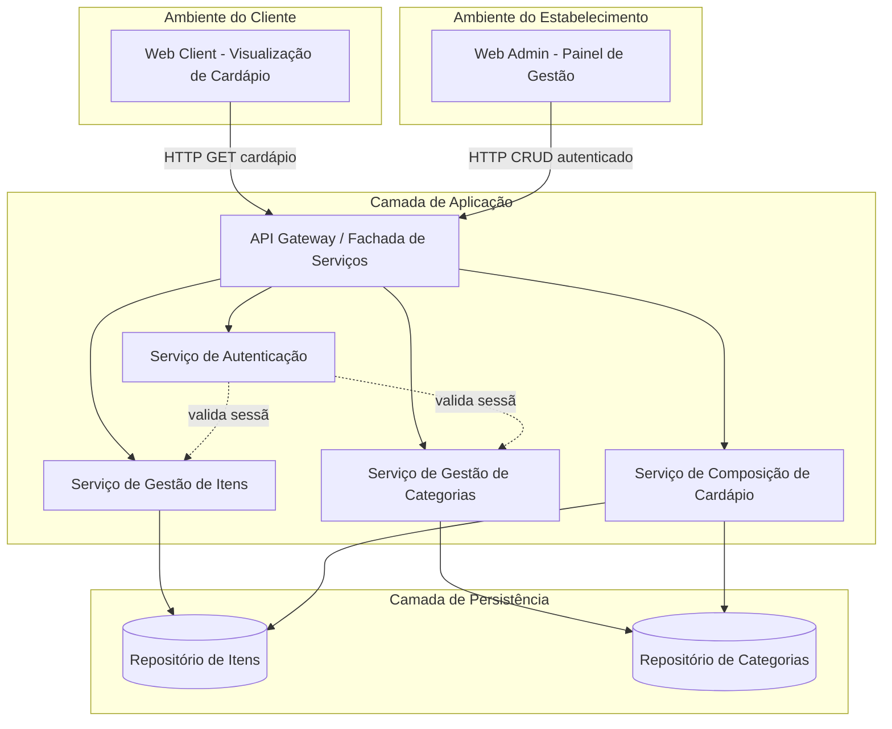
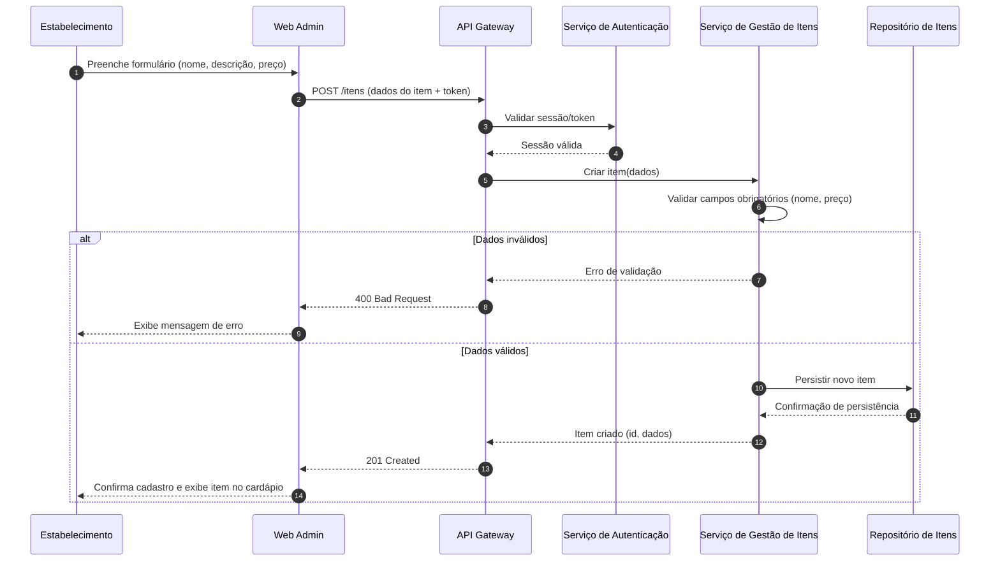
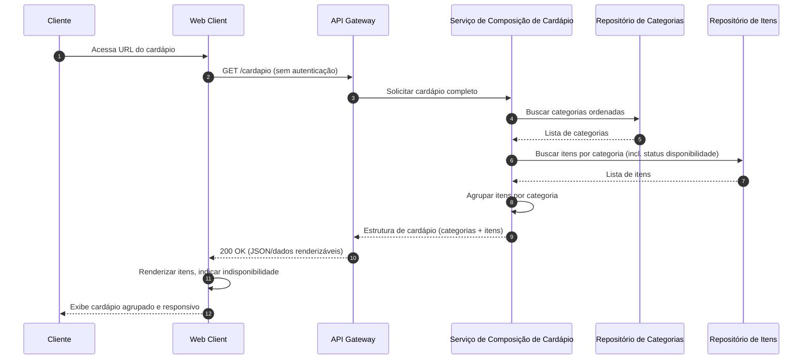

# Relatório Técnico de Arquitetura de Software

## 1. Identificação das HUs

| HU | Título | Perfil | RFs Relacionados |
|----|--------|--------|-------------------|
| HU01 | Cadastrar item no cardápio | Estabelecimento | RF01 |
| HU02 | Organizar itens por categoria | Estabelecimento | RF04, RF05 |
| HU03 | Editar item do cardápio | Estabelecimento | RF02 |
| HU04 | Marcar item como indisponível | Estabelecimento | RF06, RF07 |
| HU05 | Remover item do cardápio | Estabelecimento | RF03 |
| HU06 | Visualizar o cardápio sem cadastro | Cliente | RF08 |
| HU07 | Navegar pelo cardápio por categorias | Cliente | RF09 |
| HU08 | Identificar itens indisponíveis | Cliente | RF10, RF11 |

---

## 2. Diagramas de Arquitetura (Mermaid)

### 2.1 Diagrama de Componentes

### 2.2 Diagrama de Sequência — Cadastro de Item (HU01)

### 2.3 Diagrama de Sequência — Visualização do Cardápio (HU06/HU07/HU08)

---

## 3. Decisões de Arquitetura

| ID | Decisão | Justificativa | Requisitos Relacionados |
|----|---------|----------------|--------------------------|
| DA01 | Separação entre canal público (cliente) e canal administrativo (estabelecimento) | Atende RF08 (sem autenticação para cliente) e RNF03 (autenticação obrigatória para admin) | RF08, RNF03 |
| DA02 | Uso de um Serviço de Composição de Cardápio dedicado, independente dos serviços de CRUD | Permite otimizar leitura pública (RNF02) sem acoplar à lógica de escrita administrativa | RF09, RNF02 |
| DA03 | Arquitetura modular em serviços de responsabilidade única (Itens, Categorias, Autenticação, Composição) | Atende RNF05 (manutenibilidade) e facilita evolução incremental | RNF05 |
| DA04 | Exclusão lógica não obrigatória — decisão de exclusão física vs. lógica delegada à implementação | RF03/HU05 exigem confirmação, mas não especificam retenção de histórico | RF03 |
| DA05 | Modelo de dados prevê que um item pertence a exatamente uma categoria | Conforme critério de aceite de HU02 | RF05, HU02 |
| DA06 | Interface do cliente desacoplada via contrato de API, permitindo múltiplos front-ends compatíveis com RNF06 | Suporta acesso multi-navegador sem dependência de tecnologia específica | RNF06, RNF01 |
| DA07 | Autenticação centralizada em serviço próprio, reutilizável por futuros módulos administrativos | Facilita extensibilidade (RNF05) | RNF03, RNF05 |
| DA08 | Disponibilidade tratada como requisito de infraestrutura/operação, não definida na camada de aplicação | RNF04 depende de decisões de implantação fora do escopo de design lógico | RNF04 |

---

## 4. Tabela de Componentes e Rastreabilidade

| Componente | Responsabilidade Principal | Comunica-se com | Origem (HU / Critério de Aceite) |
|------------|------------------------------|-------------------|-------------------------------------|
| Web Client | Renderizar cardápio para o cliente sem exigir login; responsividade e acessibilidade | API Gateway | HU06, HU07, HU08, RNF01, RNF06, RNF07 |
| Web Admin | Interface de gestão para o estabelecimento (CRUD de itens/categorias, login) | API Gateway | HU01–HU05, RNF03 |
| API Gateway | Ponto único de entrada, roteamento de requisições, aplicação de políticas de acesso | Web Client, Web Admin, Serviço de Autenticação, Serviço de Itens, Serviço de Categorias, Serviço de Composição | Todas as HUs |
| Serviço de Autenticação | Validar credenciais e sessões de acesso administrativo | API Gateway, Serviço de Itens, Serviço de Categorias | RNF03 |
| Serviço de Gestão de Itens | Criar, editar, remover, ativar/desativar itens; validar campos obrigatórios | Repositório de Itens, API Gateway | HU01, HU03, HU04, HU05 (critérios de validação e confirmação) |
| Serviço de Gestão de Categorias | Criar, editar, remover categorias; controlar ordenação | Repositório de Categorias, API Gateway | HU02 (critérios de nomeação e ordenação) |
| Serviço de Composição de Cardápio | Agregar itens e categorias para exibição pública, incluindo status de disponibilidade | Repositório de Itens, Repositório de Categorias, API Gateway | HU06, HU07, HU08 |
| Repositório de Itens | Persistir e recuperar dados de itens (nome, descrição, preço, status, categoria associada) | Serviço de Gestão de Itens, Serviço de Composição | RF01, RF02, RF03, RF06, RF07 |
| Repositório de Categorias | Persistir e recuperar categorias e sua ordem de exibição | Serviço de Gestão de Categorias, Serviço de Composição | RF04, RF05, HU02 (ordem controlável) |

---

## 5. Bloqueios e Pendências

| ID | Descrição | Impacto | Responsável Sugerido |
|----|-----------|---------|------------------------|
| BP01 | Não há definição de política de exclusão (física vs. lógica) para itens removidos (HU05) | Afeta modelagem de dados e auditoria futura | Equipe de Modelagem de Dados |
| BP02 | Ausência de especificação sobre múltiplas imagens/fotos de itens | Requisitos atuais cobrem apenas texto e preço; pode gerar retrabalho se demandado depois | Product Owner |
| BP03 | Não há definição de mecanismo de recuperação de senha para área administrativa | RNF03 exige autenticação, mas fluxo de recuperação não foi especificado | Equipe de Segurança |
| BP04 | RNF04 (disponibilidade 99%) não possui detalhamento sobre estratégia de redundância/monitoramento | Decisão de infraestrutura pendente, fora do escopo lógico atual | Equipe de Infraestrutura |
| BP05 | Ausência de definição sobre múltiplos estabelecimentos (multi-tenant) | Requisitos parecem assumir um único estabelecimento; impacta escalabilidade do modelo | Arquitetura/Product Owner |
| BP06 | Não há critério de aceite sobre ordenação dos itens dentro de uma categoria | HU02 define ordenação de categorias, mas não de itens | Product Owner |

---

## 6. Cobertura de Requisitos

| Requisito | Coberto? | Componente(s) Responsável(is) |
|-----------|----------|----------------------------------|
| RF01 | Sim | Serviço de Gestão de Itens, Repositório de Itens |
| RF02 | Sim | Serviço de Gestão de Itens |
| RF03 | Sim | Serviço de Gestão de Itens |
| RF04 | Sim | Serviço de Gestão de Categorias |
| RF05 | Sim | Serviço de Gestão de Itens, Repositório de Categorias |
| RF06 | Sim | Serviço de Gestão de Itens |
| RF07 | Sim | Serviço de Gestão de Itens |
| RF08 | Sim | Web Client, API Gateway (rota pública) |
| RF09 | Sim | Serviço de Composição de Cardápio |
| RF10 | Sim | Web Client, Serviço de Composição de Cardápio |
| RF11 | Sim | Web Client, Serviço de Composição de Cardápio |
| RNF01 | Parcial | Web Client (decisão de design de UI não detalhada) |
| RNF02 | Parcial | Serviço de Composição (arquitetura suporta, mas SLA depende de infraestrutura) |
| RNF03 | Sim | Serviço de Autenticação |
| RNF04 | Não coberto no design lógico | Depende de decisões de infraestrutura (fora do escopo) |
| RNF05 | Sim | Arquitetura modular geral |
| RNF06 | Parcial | Web Client (depende de implementação de front-end) |
| RNF07 | Parcial | Web Client (depende de implementação de front-end) |

---

## 7. Gap Analysis

| Gap Identificado | Impacto Arquitetural | Ação Recomendada |
|-------------------|------------------------|----------------------|
| Ausência de definição sobre unicidade/multiplicidade de estabelecimentos no sistema | Modelo de dados e serviços podem precisar de segmentação por tenant futuramente | Confirmar com stakeholders se o sistema é single-tenant ou multi-tenant antes da modelagem de dados definitiva |
| RNF04 (disponibilidade 99%) não possui estratégia arquitetural definida | Decisões de redundância, monitoramento e recuperação de falhas ficam em aberto | Elaborar plano de disponibilidade e resiliência em fase de infraestrutura |
| Falta de critério sobre ordenação de itens dentro da categoria | Pode gerar inconsistência de exibição entre estabelecimentos | Adicionar critério de aceite explícito em HU02 ou HU07 |
| Ausência de mecanismo de recuperação/redefinição de senha administrativa | Risco de bloqueio de acesso sem plano de contingência | Especificar fluxo de recuperação de credenciais junto ao Serviço de Autenticação |
| Não há definição sobre limites de caracteres, formatos de preço (moeda) ou upload de imagens | Pode impactar validações no Serviço de Gestão de Itens | Detalhar regras de validação de dados com o Product Owner |
| RNF07 exige WCAG 2.1 nível A, mas não há critérios de aceite associados a nenhuma HU | Dificulta validação objetiva de conformidade | Criar critérios de aceite específicos de acessibilidade vinculados às HUs de visualização (HU06–HU08) |
| Não há indicação de necessidade de histórico/auditoria de alterações (preço, disponibilidade) | Pode ser demandado futuramente para rastreabilidade de mudanças | Avaliar necessidade de registro de auditoria como requisito futuro |