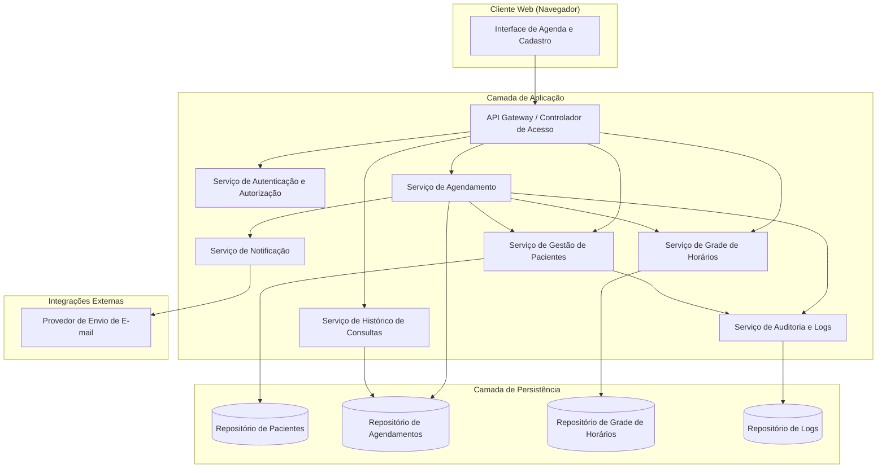
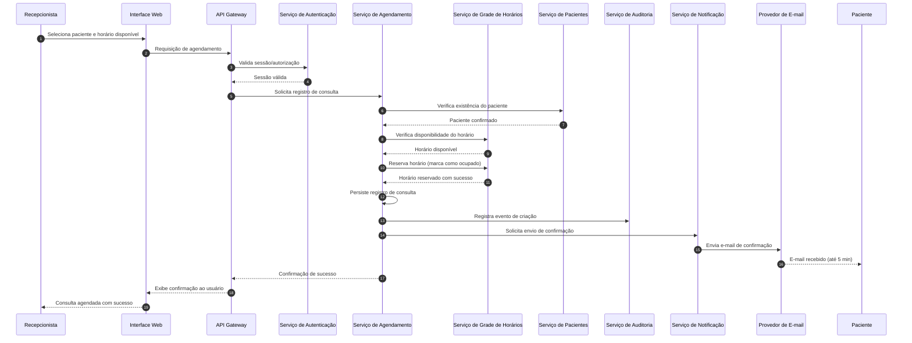
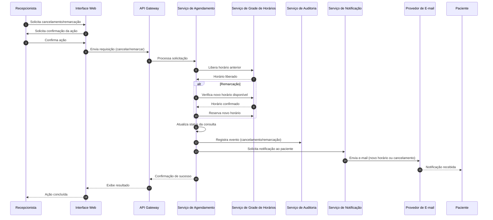

# Relatório Técnico de Arquitetura de Software
## Sistema de Agenda de Clínica (P02)

---

## 1. Identificação das HUs

| ID | História | RFs Relacionados | Perfil |
|----|----------|-------------------|--------|
| HU01 | Cadastrar paciente | RF01 | Recepcionista |
| HU02 | Pesquisar paciente | RF03 | Recepcionista |
| HU03 | Visualizar agenda do profissional | RF04, RF11 | Recepcionista |
| HU04 | Registrar agendamento | RF05, RF06, RF09 | Recepcionista |
| HU05 | Cancelar agendamento | RF07, RF10 | Recepcionista |
| HU06 | Remarcar agendamento | RF08, RF10 | Recepcionista |
| HU07 | Consultar histórico do paciente | RF12 | Recepcionista |
| HU08 | Receber confirmação de agendamento por e-mail | RF09 | Paciente |
| HU09 | Receber notificação de cancelamento/remarcação | RF10 | Paciente |
| — (implícita) | Editar dados de paciente | RF02 | Recepcionista |

**Observação:** RF02 não possui HU explícita associada — tratado como Gap (ver Seção 7).

---

## 2. Diagramas de Arquitetura (Mermaid)

### 2.1 Diagrama de Componentes (Visão Macro)

### 2.2 Diagrama de Sequência — Registrar Agendamento (HU04)

### 2.3 Diagrama de Sequência — Cancelar/Remarcar Agendamento (HU05/HU06)

---

## 3. Decisões de Arquitetura

| Decisão | Justificativa | Requisitos Relacionados |
|---------|----------------|--------------------------|
| Separação em serviços por domínio (Pacientes, Agendamento, Grade, Notificação, Auditoria) | Facilita manutenção isolada e evolução independente conforme RNF08 (manutenibilidade) | RF01-RF12, RNF08 |
| Serviço de Notificação desacoplado via mensageria assíncrona (conceitual) | Garante que falhas no envio de e-mail não bloqueiem o fluxo principal de agendamento; atende RNF05 (SLA de 5 min) | RF09, RF10, RNF05 |
| Verificação de disponibilidade centralizada no Serviço de Grade de Horários | Evita condição de corrida e garante RF06 (impedir conflito de horários) via bloqueio/transação atômica | RF06, RF04, RF11 |
| Autenticação e autorização como camada transversal (Gateway) | Centraliza controle de acesso conforme RNF01 | RNF01 |
| Armazenamento de dados de pacientes com controles de privacidade e minimização | Atende requisitos de conformidade LGPD sem prescrever tecnologia específica | RNF02 |
| Registro de eventos críticos em serviço de auditoria dedicado | Rastreabilidade de operações de criação/cancelamento/remarcação | RNF08 |
| Interface de calendário com visões diária/semanal como responsabilidade exclusiva da camada de apresentação | Isola requisito de usabilidade (RNF03) do núcleo de negócio | RNF03, RF04 |
| Cache de leitura da agenda (conceitual, não prescrito) para atender RNF04 | Necessário para carregamento em até 2s sem definir tecnologia | RNF04 |

---

## 4. Tabela de Componentes e Rastreabilidade

| Componente | Responsabilidade Principal | Comunica-se com | Origem (HU / Critério de Aceite) |
|------------|------------------------------|-------------------|-------------------------------------|
| Interface de Agenda e Cadastro (UI) | Exibir formulários, calendário e resultados de busca | API Gateway | HU01, HU02, HU03 |
| API Gateway | Rotear requisições, aplicar controle de acesso inicial | Todos os serviços de backend | RNF01 |
| Serviço de Autenticação e Autorização | Validar credenciais e permissões de recepcionista/administrador | API Gateway | RNF01 |
| Serviço de Gestão de Pacientes | CRUD de pacientes, validação de duplicidade (CPF/e-mail) e formato de e-mail | Repositório de Pacientes, Serviço de Agendamento, Auditoria | HU01, HU02, RF01-RF03 |
| Serviço de Agendamento | Orquestrar criação, cancelamento e remarcação de consultas | Serviço de Grade, Pacientes, Notificação, Auditoria | HU04, HU05, HU06, RF05-RF08 |
| Serviço de Grade de Horários | Gerenciar disponibilidade, configuração de horários e prevenção de conflitos | Repositório de Grade, Serviço de Agendamento | HU03, RF04, RF06, RF11 |
| Serviço de Histórico de Consultas | Consolidar e expor histórico de consultas por paciente | Repositório de Agendamentos | HU07, RF12 |
| Serviço de Notificação | Compor e disparar e-mails de confirmação/cancelamento/remarcação | Provedor de E-mail, Serviço de Agendamento | HU04, HU05, HU06, HU08, HU09 |
| Provedor de Envio de E-mail | Entregar mensagens ao paciente | Serviço de Notificação | HU08, HU09, RNF05 |
| Serviço de Auditoria e Logs | Registrar eventos críticos do sistema | Repositório de Logs, demais serviços | RNF08 |
| Repositório de Pacientes | Persistir dados cadastrais | Serviço de Pacientes | RF01, RF02, RNF02 |
| Repositório de Agendamentos | Persistir consultas e seus status | Serviço de Agendamento, Histórico | RF05-RF08, RF12 |
| Repositório de Grade de Horários | Persistir configuração e estado de ocupação dos horários | Serviço de Grade | RF04, RF11 |
| Repositório de Logs | Armazenar registros de auditoria | Serviço de Auditoria | RNF08 |

---

## 5. Bloqueios e Pendências

1. **RF02 (edição de dados de paciente) sem HU correspondente** — falta critério de aceite formal (ex.: quais campos são editáveis, restrições de e-mail/CPF na edição).
2. **Ausência de definição de CPF como campo obrigatório** — RF01 não cita CPF, mas HU01 exige verificação de duplicidade por CPF. Necessário esclarecer se CPF é campo obrigatório de cadastro.
3. **Papel do "Administrador" citado em RNF01 não possui HUs ou RFs que detalhem suas permissões** — funcionalidades administrativas (ex.: gestão de usuários, configuração da grade) carecem de especificação.
4. **Ausência de requisito sobre múltiplos profissionais** — o sistema parece assumir um único profissional ("a agenda do profissional"); não há definição de como múltiplos profissionais/especialidades seriam tratados.
5. **Não há definição de política de retenção de dados (LGPD)** — RNF02 menciona conformidade, mas não especifica prazo de retenção, anonimização ou exclusão de dados.
6. **Fluxo de falha no envio de e-mail não especificado** — não há requisito sobre reenvio, fila de tentativa ou alerta em caso de falha do provedor de e-mail.

---

## 6. Cobertura de Requisitos

| Requisito | Coberto por Componente(s) | Status |
|-----------|------------------------------|--------|
| RF01 | Serviço de Gestão de Pacientes | ✅ Coberto |
| RF02 | Serviço de Gestão de Pacientes | ⚠️ Coberto parcialmente (sem HU/critério) |
| RF03 | Serviço de Gestão de Pacientes | ✅ Coberto |
| RF04 | Serviço de Grade de Horários, UI | ✅ Coberto |
| RF05 | Serviço de Agendamento | ✅ Coberto |
| RF06 | Serviço de Grade de Horários | ✅ Coberto |
| RF07 | Serviço de Agendamento | ✅ Coberto |
| RF08 | Serviço de Agendamento, Grade | ✅ Coberto |
| RF09 | Serviço de Notificação | ✅ Coberto |
| RF10 | Serviço de Notificação | ✅ Coberto |
| RF11 | Serviço de Grade de Horários | ✅ Coberto |
| RF12 | Serviço de Histórico de Consultas | ✅ Coberto |
| RNF01 | Autenticação e Autorização, Gateway | ✅ Coberto |
| RNF02 | Serviço de Pacientes, Repositório de Pacientes | ⚠️ Coberto conceitualmente (sem política detalhada) |
| RNF03 | UI | ✅ Coberto |
| RNF04 | Serviço de Grade de Horários (cache conceitual) | ⚠️ Depende de decisão de implementação |
| RNF05 | Serviço de Notificação | ✅ Coberto |
| RNF06 | Arquitetura geral (disponibilidade transversal) | ⚠️ Sem componente dedicado especificado |
| RNF07 | UI (camada de apresentação) | ✅ Coberto |
| RNF08 | Serviço de Auditoria e Logs | ✅ Coberto |

---

## 7. Gap Analysis

| Gap Identificado | Impacto Arquitetural | Ação Recomendada |
|-------------------|------------------------|---------------------|
| RF02 sem HU/critérios de aceite | Risco de implementação inconsistente da edição de dados de pacientes | Elaborar HU específica com critérios (campos editáveis, validações de duplicidade) |
| CPF citado apenas em critério de aceite (HU01), não em RF01 | Ambiguidade sobre obrigatoriedade do campo CPF no cadastro | Atualizar RF01 para incluir CPF explicitamente como campo obrigatório |
| Perfil "Administrador" sem funcionalidades detalhadas | Impede definição de componente/serviço de administração e seus limites de acesso | Levantar requisitos específicos de administração (gestão de usuários, configuração de grade) |
| Ausência de modelo multi-profissional | Arquitetura atual assume agenda única; escalabilidade para múltiplos profissionais não garantida | Confirmar com stakeholders se há necessidade futura de múltiplos profissionais/especialidades |
| Política de retenção/anonimização de dados (LGPD) não definida | Risco de não conformidade legal e dificuldade de implementar rotinas de exclusão de dados | Definir requisito específico de retenção, exclusão e anonimização de dados de pacientes |
| Fluxo de falha no envio de e-mail não especificado | Risco de não cumprimento do RNF05 em cenários de indisponibilidade do provedor de e-mail | Especificar requisito de reenvio/fila de retentativa e alerta operacional |
| RNF06 (99% uptime) sem estratégia de resiliência definida | Falta de componente ou padrão arquitetural (ex.: redundância) para garantir disponibilidade | Definir estratégia de alta disponibilidade em fase de design detalhado, sem prescrever tecnologia |
| RNF04 (carregamento em 2s) sem definição de volume de dados esperado | Dificulta dimensionamento de performance do Serviço de Grade de Horários | Levantar volumetria esperada (nº de profissionais, consultas/dia) para embasar decisão de cache/indexação |