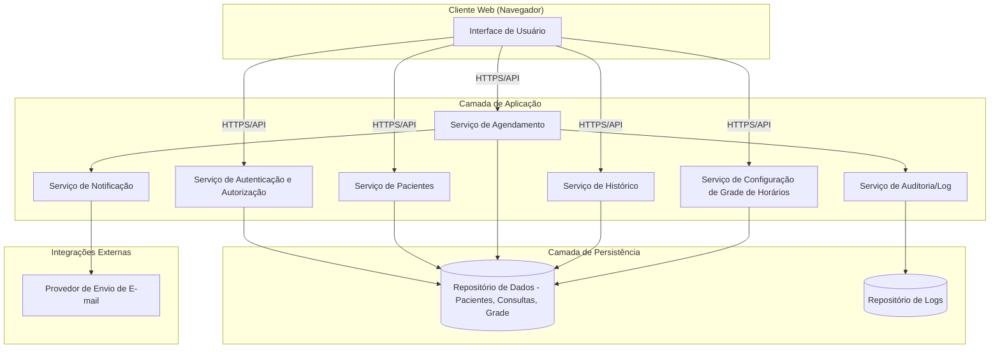
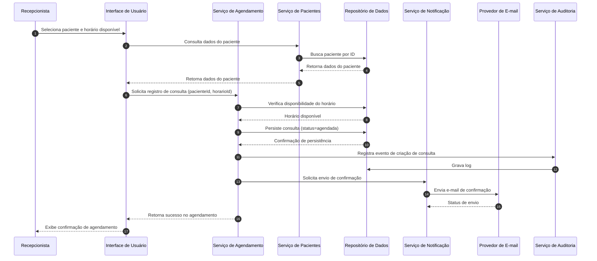
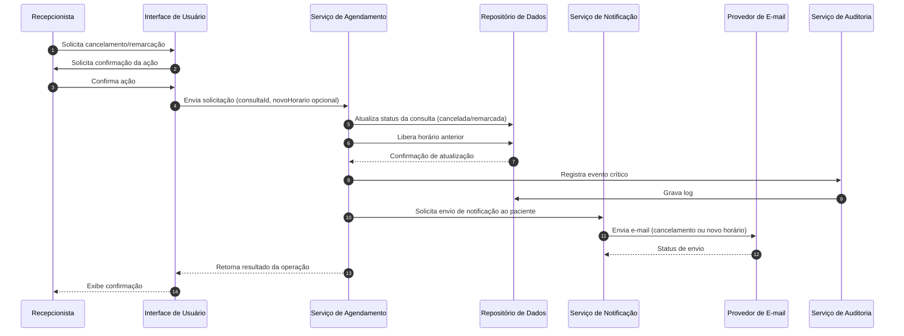

# Relatório Técnico de Arquitetura de Software
## Sistema de Agenda de Clínica (P02)

---

## 1. Identificação das HUs

| ID | Título | Perfil | Requisitos Relacionados |
|----|--------|--------|--------------------------|
| HU01 | Cadastrar paciente | Recepcionista | RF01, RNF02 |
| HU02 | Pesquisar paciente | Recepcionista | RF03 |
| HU03 | Visualizar agenda do profissional | Recepcionista | RF04, RNF03, RNF04 |
| HU04 | Registrar agendamento | Recepcionista | RF05, RF06, RF09, RNF05 |
| HU05 | Cancelar agendamento | Recepcionista | RF07, RF10 |
| HU06 | Remarcar agendamento | Recepcionista | RF08, RF10 |
| HU07 | Consultar histórico do paciente | Recepcionista | RF12 |
| HU08 | Receber confirmação de agendamento por e-mail | Paciente | RF09, RNF05 |
| HU09 | Receber notificação de cancelamento/remarcação | Paciente | RF10 |
| (Sem HU explícita) | Editar cadastro | Recepcionista | RF02 |
| (Sem HU explícita) | Configurar grade de horários | Recepcionista/Admin | RF11 |

---

## 2. Diagramas de Arquitetura (Mermaid)

### 2.1 Diagrama de Componentes (Visão Macro)

### 2.2 Diagrama de Sequência — Registrar Agendamento (HU04)

### 2.3 Diagrama de Sequência — Cancelamento/Remarcação (HU05/HU06)

---

## 3. Decisões de Arquitetura

| Decisão | Justificativa |
|---------|----------------|
| Arquitetura em camadas (apresentação, aplicação, dados) com serviços especializados | Facilita manutenibilidade (RNF08) e separação de responsabilidades entre agendamento, pacientes e notificações |
| Serviço de Notificação assíncrono/desacoplado do fluxo principal de agendamento | Garante que falhas no envio de e-mail não bloqueiem o registro da consulta (RNF05, RF09, RF10) |
| Verificação de disponibilidade de horário centralizada no Serviço de Agendamento com controle transacional | Evita condição de corrida e agendamento duplicado no mesmo horário (RF06) |
| Serviço de Auditoria dedicado, registrando eventos críticos de forma assíncrona | Atende RNF08 sem impactar desempenho das operações principais |
| Autenticação centralizada via serviço de Autorização/Autenticação | Atende RNF01, garantindo acesso restrito a usuários autenticados |
| Modelo de dados dos pacientes com controle de consentimento/retenção | Necessário para conformidade com RNF02 (LGPD), mesmo sem especificar tecnologia |
| Interface single-page/responsiva consumindo API via HTTPS | Atende RNF03 (calendário) e RNF07 (compatibilidade multi-navegador) |
| Separação entre Serviço de Grade de Horários e Serviço de Agendamento | Permite configuração independente da disponibilidade (RF11) sem acoplar à lógica de reserva |

---

## 4. Tabela de Componentes e Rastreabilidade

| Componente | Responsabilidade Principal | Comunica-se com | Origem (HU / Critério de Aceite) |
|------------|------------------------------|------------------|-----------------------------------|
| Interface de Usuário (UI) | Exibir cadastro, agenda, calendário, histórico e formulários de interação | Serviço de Autenticação, Pacientes, Agendamento, Histórico, Grade | HU01–HU07, RNF03, RNF07 |
| Serviço de Autenticação e Autorização | Validar credenciais e controlar acesso por perfil (recepcionista/admin) | UI, todos os serviços de backend | RNF01 |
| Serviço de Pacientes | Cadastrar, editar, pesquisar pacientes; validar duplicidade de CPF/e-mail | UI, Repositório de Dados | HU01 (critérios), HU02, RF01–RF03 |
| Serviço de Agendamento | Registrar, cancelar, remarcar consultas; validar disponibilidade de horário | UI, Repositório de Dados, Serviço de Notificação, Serviço de Auditoria | HU04, HU05, HU06, RF05–RF08 |
| Serviço de Configuração de Grade de Horários | Definir e manter horários de atendimento disponíveis do profissional | UI, Repositório de Dados, Serviço de Agendamento | RF11 |
| Serviço de Histórico | Consolidar e exibir consultas realizadas/canceladas por paciente | UI, Repositório de Dados | HU07, RF12 |
| Serviço de Notificação | Orquestrar envio de e-mails de confirmação/cancelamento/remarcação | Serviço de Agendamento, Provedor de E-mail | HU04, HU05, HU06, HU08, HU09, RF09, RF10, RNF05 |
| Provedor de Envio de E-mail | Efetuar entrega do e-mail ao paciente | Serviço de Notificação | RF09, RF10, RNF05 |
| Serviço de Auditoria/Log | Registrar eventos críticos (criação, cancelamento, remarcação) | Serviço de Agendamento, Repositório de Logs | RNF08 |
| Repositório de Dados | Persistir pacientes, consultas, grade de horários | Todos os serviços de domínio | RF01–RF12, RNF02 |
| Repositório de Logs | Armazenar registros de auditoria | Serviço de Auditoria | RNF08 |

---

## 5. Bloqueios e Pendências

1. **Modelo de autenticação não detalhado**: os requisitos não especificam mecanismo de login (senha, MFA, SSO), nem política de expiração de sessão — necessário para detalhar RNF01.
2. **Perfil "Paciente" sem canal de acesso definido**: HU08/HU09 tratam o paciente apenas como destinatário passivo de e-mails; não há RF que preveja portal ou app para o paciente. Confirmar se este perfil terá acesso direto ao sistema no futuro.
3. **Política de retenção/anonimização de dados (LGPD)** não detalhada: RNF02 exige conformidade, mas não há RF sobre exclusão de dados, consentimento explícito ou portabilidade.
4. **Ausência de definição sobre múltiplos profissionais**: os requisitos mencionam "o profissional" no singular; não fica claro se o sistema deve suportar múltiplos profissionais/agendas simultâneas.
5. **Regras de conflito de horário (RF06)** não detalham granularidade (ex.: consultas com duração variável, intervalos, encaixes).
6. **Falha no envio de e-mail**: não há requisito definindo comportamento em caso de falha de entrega (reenvio, fila, alerta) — impacta RNF05 e desenho do Serviço de Notificação.

---

## 6. Cobertura de Requisitos

| Requisito | Componente(s) Responsável(is) | Coberto? |
|-----------|-------------------------------|----------|
| RF01 | Serviço de Pacientes | ✅ |
| RF02 | Serviço de Pacientes | ✅ |
| RF03 | Serviço de Pacientes | ✅ |
| RF04 | Serviço de Agendamento, UI | ✅ |
| RF05 | Serviço de Agendamento | ✅ |
| RF06 | Serviço de Agendamento | ✅ |
| RF07 | Serviço de Agendamento | ✅ |
| RF08 | Serviço de Agendamento | ✅ |
| RF09 | Serviço de Notificação, Provedor de E-mail | ✅ |
| RF10 | Serviço de Notificação, Provedor de E-mail | ✅ |
| RF11 | Serviço de Configuração de Grade de Horários | ✅ |
| RF12 | Serviço de Histórico | ✅ |
| RNF01 | Serviço de Autenticação e Autorização | ✅ |
| RNF02 | Repositório de Dados, Serviço de Pacientes (parcial — ver Gap Analysis) | ⚠️ Parcial |
| RNF03 | Interface de Usuário | ✅ |
| RNF04 | Serviço de Agendamento, Repositório de Dados (desempenho de consulta) | ✅ (dependente de dimensionamento) |
| RNF05 | Serviço de Notificação | ✅ (dependente de política de retry — ver Gap) |
| RNF06 | Arquitetura geral (disponibilidade — não modelado component-a-component) | ⚠️ Parcial |
| RNF07 | Interface de Usuário | ✅ |
| RNF08 | Serviço de Auditoria/Log | ✅ |

---

## 7. Gap Analysis

| Gap Identificado | Impacto Arquitetural | Ação Recomendada |
|-------------------|------------------------|--------------------|
| Falta de especificação sobre política de retry/fila para envio de e-mails | Serviço de Notificação pode não cumprir RNF05 de forma confiável em caso de falha do provedor externo | Definir mecanismo de reprocessamento assíncrono com fila de mensagens e tentativas configuráveis |
| Ausência de requisito sobre disponibilidade técnica (RNF06) mapeado em componentes | Não há redundância/failover definidos na arquitetura | Especificar estratégia de alta disponibilidade (réplicas, monitoramento) em fase de infraestrutura |
| LGPD (RNF02) sem detalhamento de consentimento, retenção e exclusão de dados | Repositório de Dados e Serviço de Pacientes podem não atender exigências legais completas | Elicitar requisitos específicos de privacidade (consentimento, anonimização, exportação/exclusão de dados) |
| Não há RF que trate múltiplos profissionais/especialidades | Modelo de dados de Agendamento e Grade de Horários pode precisar de reestruturação futura | Confirmar com stakeholders se há previsão de múltiplos profissionais na clínica |
| Falta de requisito sobre autenticação do paciente | Impede evolução futura para portal do paciente (autoagendamento) | Registrar como requisito futuro/backlog, mantendo desacoplamento do Serviço de Notificação |
| RF06 não define regras de duração de consulta/intervalos | Serviço de Agendamento pode ter lógica de conflito simplificada demais | Especificar duração padrão/configurável de consultas e política de encaixes |
| Ausência de requisito de perfil "Administrador" detalhado (apenas citado em RNF01) | Serviço de Autenticação/Autorização não tem escopo claro de permissões diferenciadas | Elicitar RFs específicos para funcionalidades exclusivas do Administrador (ex.: RF11 configuração de grade) |