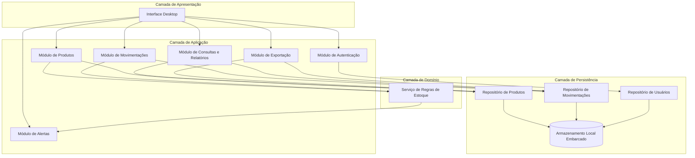
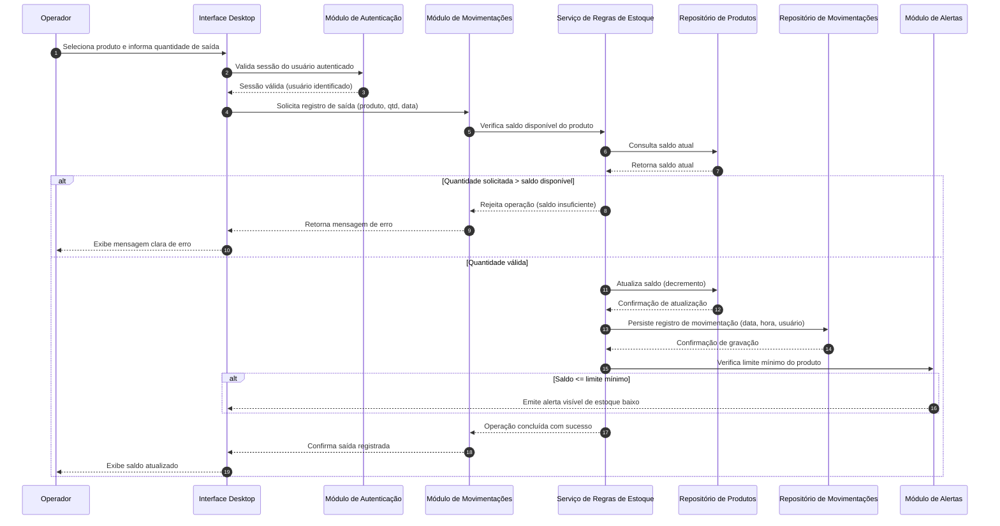
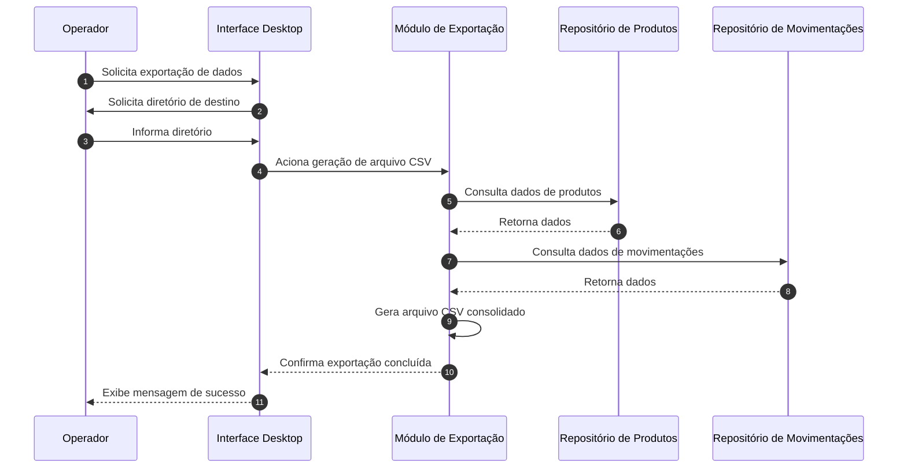

# Relatório Técnico de Arquitetura de Software
## Sistema de Controle de Estoque para Loja Física (P03)

---

## 1. Identificação das HUs

| HU | Título | RFs Relacionados | RNFs Relacionados |
|----|--------|-------------------|--------------------|
| HU01 | Cadastrar produto | RF01, RF12 | RNF06, RNF08 |
| HU02 | Registrar entrada de mercadoria | RF04, RF07 | RNF03, RNF04, RNF08 |
| HU03 | Registrar saída de produto | RF05, RF06, RF07 | RNF03, RNF04, RNF08 |
| HU04 | Ser alertado sobre estoque baixo | RF09 | RNF04 |
| HU05 | Configurar limite mínimo de estoque | RF08 | RNF04 |
| HU06 | Consultar saldo atual do estoque | RF10, RF12 | RNF05 |
| HU07 | Consultar histórico de movimentações | RF11 | RNF05, RNF08 |
| HU08 | Exportar dados de estoque e movimentações | — | RNF07 |

Observação: RF02 (edição) e RF03 (remoção) de produtos não possuem HU explícita associada — tratado como **gap** na Seção 7.

---

## 2. Diagramas de Arquitetura (Mermaid)

### 2.1 Diagrama de Componentes (Visão Estática)

### 2.2 Diagrama de Sequência — Registrar Saída de Produto (HU03)

### 2.3 Diagrama de Sequência — Exportação de Dados (HU08)

---

## 3. Decisões de Arquitetura

| Decisão | Justificativa | Requisitos Relacionados |
|---------|----------------|---------------------------|
| Arquitetura em camadas (Apresentação, Aplicação, Domínio, Persistência) | Facilita manutenibilidade e isolamento de regras de negócio de estoque | RNF07 |
| Persistência local embarcada, sem servidor externo | Requisito explícito de funcionamento offline em desktop | RNF01, RNF02 |
| Serviço de Regras de Estoque centralizado | Concentra validações críticas (saldo insuficiente, limite mínimo) para evitar duplicação de lógica entre módulos de entrada/saída | RF06, RF07, RF09 |
| Módulo de Alertas desacoplado, disparado por eventos do Serviço de Regras de Estoque | Permite reatividade a mudanças de saldo/limite sem acoplar UI diretamente à lógica de negócio | RF09, HU04 |
| Persistência transacional (garantia de gravação síncrona antes de confirmar operação ao usuário) | Atende à exigência de não perda de lançamentos em caso de falha | RNF03 |
| Módulo de Autenticação isolado, validado antes de qualquer operação de escrita | Necessário para rastreabilidade (usuário responsável) e segurança | RNF06, RNF08 |
| Módulo de Exportação com acesso somente leitura aos repositórios | Minimiza risco de efeitos colaterais durante geração de backups | RNF07, HU08 |
| Interface desktop única com fluxos curtos (máx. 3 interações) | Atende requisito de usabilidade sem prescrever tecnologia de UI | RNF04 |

---

## 4. Tabela de Componentes e Rastreabilidade

| Componente | Responsabilidade Principal | Comunica-se com | Origem (HU / Critério de Aceite) |
|------------|------------------------------|-------------------|-------------------------------------|
| Interface Desktop | Apresentar telas de cadastro, movimentação, consulta e alertas ao operador | Todos os módulos de aplicação | HU01–HU08 (todas) |
| Módulo de Autenticação | Validar credenciais e manter sessão do usuário | Interface Desktop, Repositório de Usuários | RNF06, RNF08 |
| Módulo de Produtos | Gerenciar cadastro, edição, remoção e busca de produtos | Interface Desktop, Serviço de Regras de Estoque, Repositório de Produtos | RF01, RF02, RF03, RF12; HU01 (critérios: nome único, obrigatoriedade) |
| Módulo de Movimentações | Registrar entradas e saídas, orquestrar validações de saldo | Interface Desktop, Serviço de Regras de Estoque, Repositório de Movimentações | RF04, RF05; HU02, HU03 (critérios de validação e atualização imediata) |
| Serviço de Regras de Estoque | Validar saldo disponível, atualizar quantidades, disparar verificação de limite mínimo | Módulo de Produtos, Módulo de Movimentações, Módulo de Alertas, Repositórios | RF06, RF07, RF08; HU03 (impedir saída indevida), HU05 |
| Módulo de Alertas | Emitir e manter alerta visível enquanto estoque estiver abaixo do limite | Serviço de Regras de Estoque, Interface Desktop | RF09; HU04 (persistência do alerta) |
| Módulo de Consultas e Relatórios | Exibir saldo atual e histórico filtrável por produto/período | Interface Desktop, Repositório de Produtos, Repositório de Movimentações | RF10, RF11; HU06, HU07 |
| Módulo de Exportação | Gerar arquivo CSV consolidado de estoque e movimentações | Interface Desktop, Repositório de Produtos, Repositório de Movimentações | RNF07; HU08 |
| Repositório de Produtos | Persistir e recuperar dados de produtos e saldos | Módulo de Produtos, Serviço de Regras de Estoque, Módulo de Consultas, Módulo de Exportação | RF01–RF03, RF07, RF10 |
| Repositório de Movimentações | Persistir e recuperar histórico de entradas/saídas | Módulo de Movimentações, Módulo de Consultas, Módulo de Exportação | RF04, RF05, RF11, RNF08 |
| Repositório de Usuários | Armazenar credenciais e dados de autenticação | Módulo de Autenticação | RNF06 |
| Armazenamento Local Embarcado | Prover persistência durável sem servidor externo | Todos os repositórios | RNF01, RNF02, RNF03 |

---

## 5. Bloqueios e Pendências

1. **Ausência de HU para RF02 e RF03** (edição e remoção de produtos): não há critérios de aceite definidos — impacta o desenho de telas e regras de validação (ex.: pode remover produto com movimentações associadas?).
2. **Modelo de perfis de usuário não detalhado**: RNF06 exige autenticação, mas não há definição de papéis (ex.: operador vs. administrador), o que impacta o desenho do Módulo de Autenticação e eventuais permissões diferenciadas.
3. **Comportamento de remoção de produto com histórico associado**: não especificado se remoção é lógica (soft delete) ou física — decisão crítica para integridade do histórico (RF11).
4. **Definição de "grande volume de registros" (RNF05)**: não há métrica quantitativa (ex.: número de produtos/movimentações), dificultando validação objetiva do requisito de desempenho.
5. **Recuperação após falha (RNF03)**: não especifica se deve haver mecanismo de reprocessamento/log de transações pendentes ou apenas garantia de gravação atômica.

---

## 6. Cobertura de Requisitos

| Requisito | Coberto? | Componente(s) Responsável(is) |
|-----------|----------|-------------------------------|
| RF01 | Sim | Módulo de Produtos |
| RF02 | Parcial* | Módulo de Produtos (sem HU/critério associado) |
| RF03 | Parcial* | Módulo de Produtos (sem HU/critério associado) |
| RF04 | Sim | Módulo de Movimentações, Serviço de Regras de Estoque |
| RF05 | Sim | Módulo de Movimentações, Serviço de Regras de Estoque |
| RF06 | Sim | Serviço de Regras de Estoque |
| RF07 | Sim | Serviço de Regras de Estoque |
| RF08 | Sim | Módulo de Produtos, Serviço de Regras de Estoque |
| RF09 | Sim | Módulo de Alertas |
| RF10 | Sim | Módulo de Consultas e Relatórios |
| RF11 | Sim | Módulo de Consultas e Relatórios |
| RF12 | Sim | Módulo de Produtos, Módulo de Consultas |
| RNF01 | Sim | Interface Desktop (decisão arquitetural) |
| RNF02 | Sim | Armazenamento Local Embarcado |
| RNF03 | Sim | Repositórios, Serviço de Regras de Estoque |
| RNF04 | Sim | Interface Desktop (fluxos curtos) |
| RNF05 | Parcial* | Módulo de Consultas (sem métrica de volume definida) |
| RNF06 | Sim | Módulo de Autenticação |
| RNF07 | Sim | Módulo de Exportação |
| RNF08 | Sim | Serviço de Regras de Estoque, Repositório de Movimentações |

\* Cobertura arquitetural existe, porém especificação funcional insuficiente — ver Seção 5 e 7.

---

## 7. Gap Analysis

| Gap Identificado | Impacto Arquitetural | Ação Recomendada |
|-------------------|------------------------|---------------------|
| RF02/RF03 sem HU e critérios de aceite | Módulo de Produtos pode ser implementado com regras inconsistentes de edição/remoção | Elicitar HU específica com critérios (ex.: restrições de remoção com histórico vinculado, validação de duplicidade em edição) |
| Ausência de definição de perfis/papéis de usuário | Módulo de Autenticação pode não suportar diferenciação de permissões futuras (ex.: apenas admin remove produtos) | Definir com stakeholders se há necessidade de perfis distintos antes da implementação |
| Estratégia de remoção de produto não definida (lógica vs. física) | Afeta integridade referencial entre Repositório de Produtos e Repositório de Movimentações | Definir política de exclusão lógica para preservar rastreabilidade histórica (alinhado a RNF08) |
| RNF05 sem métrica quantitativa de "grande volume" | Dificulta definição de estratégias de indexação/paginação no Módulo de Consultas | Solicitar ao cliente estimativa de volume esperado (nº produtos, movimentações/mês) para dimensionar arquitetura de consulta |
| RNF03 sem detalhamento de mecanismo de recuperação | Risco de implementação inconsistente entre "gravação atômica" e "log de auditoria/replay" | Especificar formalmente estratégia de resiliência (ex.: transações atômicas obrigatórias antes de confirmar ao usuário) |
| Formato e campos exatos do CSV de exportação (RF07/HU08) não detalhados | Módulo de Exportação pode gerar arquivo incompatível com expectativas de análise externa | Definir layout de colunas do CSV junto ao time de negócio |
| Ausência de requisito sobre concorrência (múltiplos operadores simultâneos) | Pode gerar inconsistência de saldo em cenários multiusuário | Esclarecer se o sistema é mono-usuário ou multiusuário simultâneo para dimensionar controle de concorrência no Serviço de Regras de Estoque |