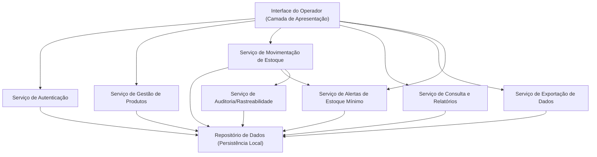
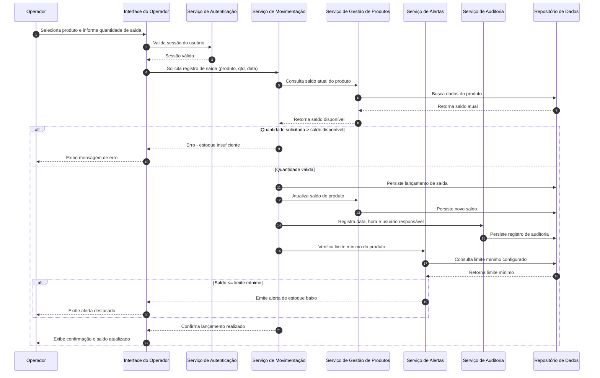
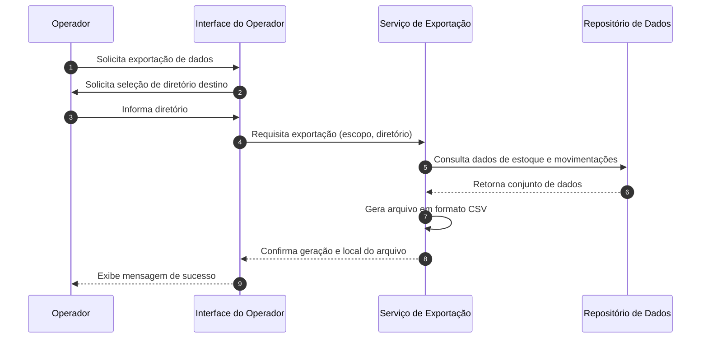

# Relatório Técnico de Arquitetura de Software
## Sistema de Controle de Estoque para Loja Física (P03)

## 1. Identificação das HUs

| HU   | Título                                      | RFs Relacionados      | RNFs Relacionados     |
|------|----------------------------------------------|------------------------|-------------------------|
| HU01 | Cadastrar produto                           | RF01                   | RNF02, RNF03, RNF08     |
| HU02 | Registrar entrada de mercadoria              | RF04, RF07             | RNF02, RNF03, RNF04, RNF08 |
| HU03 | Registrar saída de produto                   | RF05, RF06, RF07        | RNF02, RNF03, RNF04, RNF08 |
| HU04 | Ser alertado sobre estoque baixo             | RF08, RF09              | RNF04, RNF05            |
| HU05 | Configurar limite mínimo de estoque          | RF08                    | RNF04                   |
| HU06 | Consultar saldo atual do estoque             | RF10, RF12              | RNF05                   |
| HU07 | Consultar histórico de movimentações         | RF11                    | RNF05, RNF08            |
| HU08 | Exportar dados de estoque e movimentações    | -                       | RNF07                   |

Requisitos de edição/remoção (RF02, RF03) não possuem HU explícita — ver Seção 7 (Gap Analysis).

---

## 2. Diagramas de Arquitetura (Mermaid)

### 2.1 Diagrama de Componentes

### 2.2 Diagrama de Sequência — Registrar Saída de Produto (HU03)

### 2.3 Diagrama de Sequência — Exportação de Dados (HU08)

---

## 3. Decisões de Arquitetura

| Decisão | Justificativa | Requisitos Relacionados |
|---------|----------------|---------------------------|
| Arquitetura em camadas (Apresentação, Serviços de Domínio, Persistência) | Isola regras de negócio de estoque da interface, facilitando manutenção e testes | RNF04, RNF07 |
| Persistência local embarcada, sem dependência de servidor externo | Requisito explícito de operação standalone em ambiente Windows | RNF01, RNF02 |
| Uso de transações atômicas para lançamentos de entrada/saída | Garante que nenhum lançamento seja perdido em falhas inesperadas | RNF03 |
| Serviço de Alertas desacoplado do serviço de Movimentação | Permite reavaliação de limites mínimos de forma independente (ex: ao editar limite via HU05) sem acoplar lógica de negócio de estoque | RF08, RF09, HU04, HU05 |
| Serviço de Auditoria centralizado (Rastreabilidade) | Consolida registro de usuário, data e hora para todas operações sensíveis, evitando duplicação de lógica em cada serviço | RNF08 |
| Autenticação como camada transversal (cross-cutting) | Necessidade de proteger todas as operações com usuário/senha, aplicada antes de qualquer ação de domínio | RNF06 |
| Índices/estratégia de acesso otimizada para consulta de estoque e histórico | Atender ao requisito de carregamento em até 2 segundos mesmo com grande volume | RNF05 |
| Exportação como serviço isolado, consumindo apenas o repositório de dados | Minimiza acoplamento e permite evolução do formato de exportação sem impactar demais serviços | RNF07, HU08 |
| Fluxo de UI restrito a no máximo 3 interações para entrada/saída | Orienta o desenho de telas, mas a validação final cabe à camada de apresentação | RNF04 |

---

## 4. Tabela de Componentes e Rastreabilidade

| Componente | Responsabilidade Principal | Comunica-se com | Origem (HU / Critério de Aceite) |
|------------|------------------------------|--------------------|-----------------------------------|
| Interface do Operador | Apresentar telas de cadastro, movimentação, consulta, alertas e exportação | Serviço de Autenticação, Serviço de Gestão de Produtos, Serviço de Movimentação, Serviço de Consulta, Serviço de Exportação, Serviço de Alertas | HU01–HU08 |
| Serviço de Autenticação | Validar credenciais e manter sessão do operador | Interface do Operador, Repositório de Dados | RNF06 |
| Serviço de Gestão de Produtos | Cadastrar, editar, remover e pesquisar produtos; gerenciar saldo e limite mínimo | Interface do Operador, Serviço de Movimentação, Repositório de Dados | HU01, HU05, RF01-RF03, RF08, RF12 |
| Serviço de Movimentação de Estoque | Registrar entradas/saídas, validar saldo disponível, atualizar saldo | Serviço de Gestão de Produtos, Serviço de Alertas, Serviço de Auditoria, Repositório de Dados | HU02, HU03, RF04-RF07 |
| Serviço de Alertas de Estoque Mínimo | Verificar limite mínimo e emitir/persistir alertas visuais | Serviço de Movimentação, Repositório de Dados, Interface do Operador | HU04, RF09 |
| Serviço de Consulta e Relatórios | Exibir saldo de estoque e histórico filtrável por produto/período | Interface do Operador, Repositório de Dados | HU06, HU07, RF10, RF11 |
| Serviço de Exportação de Dados | Gerar arquivo CSV com dados de estoque e movimentações | Interface do Operador, Repositório de Dados | HU08, RNF07 |
| Serviço de Auditoria/Rastreabilidade | Registrar data, hora e usuário responsável em cada lançamento | Serviço de Movimentação, Repositório de Dados | RNF08, critérios de aceite HU02/HU03/HU07 |
| Repositório de Dados | Persistir de forma durável e local todas as entidades do domínio | Todos os serviços de domínio | RNF02, RNF03 |

---

## 5. Bloqueios e Pendências

1. **Modelo de permissões não definido**: os requisitos mencionam apenas "operador" como perfil; não há indicação de perfis administrativos distintos (ex.: quem pode editar/remover produtos ou configurar limites). Necessário esclarecimento antes do detalhamento de autorização.
2. **Política de recuperação após falha (RNF03)** não especifica mecanismo esperado (ex: log de transação, escrita síncrona); necessário definir critério de aceite mensurável.
3. **Definição de "grande volume de registros" (RNF05)** não é quantificada — impede dimensionamento de estratégia de indexação/paginação.
4. **Ausência de HU para RF02 (editar produto) e RF03 (remover produto)** — critérios de aceite não definidos, incluindo tratamento de remoção de produtos com movimentações associadas.
5. **Formato/campos exatos do CSV de exportação (HU08)** não estão detalhados — não há especificação clara do delimitador, encoding ou colunas obrigatórias.
6. **Persistência de alertas (HU04)**: não fica claro se o alerta deve ser um registro persistente reavaliado a cada consulta, ou um evento em tempo real armazenado — impacta desenho do serviço de Alertas.

---

## 6. Cobertura de Requisitos

| Requisito | Coberto por Componente(s) | Status |
|-----------|------------------------------|--------|
| RF01 | Serviço de Gestão de Produtos | Coberto |
| RF02 | Serviço de Gestão de Produtos | Coberto (sem HU associada) |
| RF03 | Serviço de Gestão de Produtos | Coberto (sem HU associada) |
| RF04 | Serviço de Movimentação | Coberto |
| RF05 | Serviço de Movimentação | Coberto |
| RF06 | Serviço de Movimentação | Coberto |
| RF07 | Serviço de Movimentação / Gestão de Produtos | Coberto |
| RF08 | Serviço de Gestão de Produtos | Coberto |
| RF09 | Serviço de Alertas | Coberto |
| RF10 | Serviço de Consulta e Relatórios | Coberto |
| RF11 | Serviço de Consulta e Relatórios | Coberto |
| RF12 | Serviço de Gestão de Produtos | Coberto |
| RNF01 | Interface do Operador (camada de apresentação) | Coberto |
| RNF02 | Repositório de Dados | Coberto |
| RNF03 | Repositório de Dados / Serviço de Movimentação | Parcialmente coberto (ver Bloqueios) |
| RNF04 | Interface do Operador | Coberto (dependente de design de UI) |
| RNF05 | Serviço de Consulta e Relatórios | Parcialmente coberto (ver Bloqueios) |
| RNF06 | Serviço de Autenticação | Coberto |
| RNF07 | Serviço de Exportação de Dados | Coberto |
| RNF08 | Serviço de Auditoria/Rastreabilidade | Coberto |

---

## 7. Gap Analysis

| Gap Identificado | Impacto Arquitetural | Ação Recomendada |
|-------------------|------------------------|----------------------|
| Falta de HUs explícitas para edição/remoção de produtos (RF02, RF03) | Componentes já preveem operações, mas critérios de aceite (ex: validação de produto com movimentações) não podem ser confirmados | Solicitar às partes interessadas HUs detalhadas para esses fluxos, incluindo tratamento de exclusão de produtos com histórico |
| Ausência de definição de perfis de acesso além de "operador" | Serviço de Autenticação foi desenhado de forma genérica; pode exigir refatoração se houver múltiplos perfis (ex: gerente) | Levantar requisito de autorização/perfis com stakeholders antes de detalhar o modelo de permissões |
| RNF03 sem mecanismo de recuperação especificado | Dificulta decisão sobre estratégia de persistência transacional/durabilidade | Definir critério objetivo (ex: "nenhuma perda mesmo com falha de energia") e mecanismo de confirmação de escrita |
| RNF05 sem métricas de volume | Impede dimensionamento de estratégia de indexação e paginação na Camada de Consulta | Definir volume esperado (linhas/registros) e SLA de performance sob carga |
| Falta de especificação do formato exato de exportação CSV | Serviço de Exportação pode não atender expectativas de compatibilidade com ferramentas externas | Definir schema de colunas, separador, encoding e formato de datas no CSV |
| Modelo de persistência de alertas não detalhado | Pode gerar inconsistência entre alerta "calculado on-demand" vs "persistido como evento" | Definir se alertas são estado derivado (calculado a cada consulta) ou entidade persistente com histórico |
| Não há requisito de concorrência (múltiplos operadores simultâneos) | Arquitetura assume single-user implícito, mas não está explícito nos requisitos | Confirmar se o sistema deve suportar múltiplos operadores simultâneos na mesma base local |