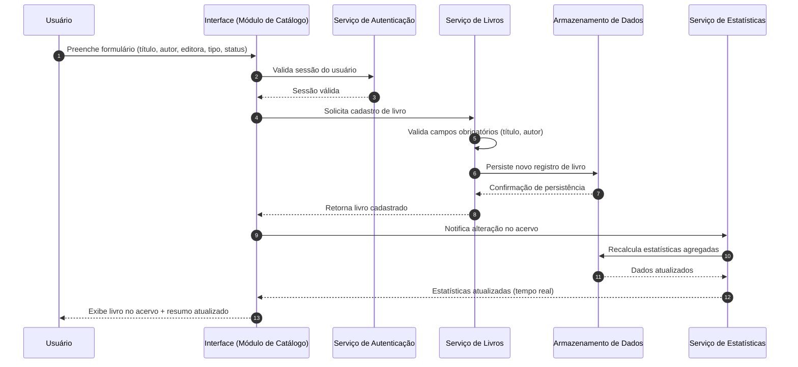
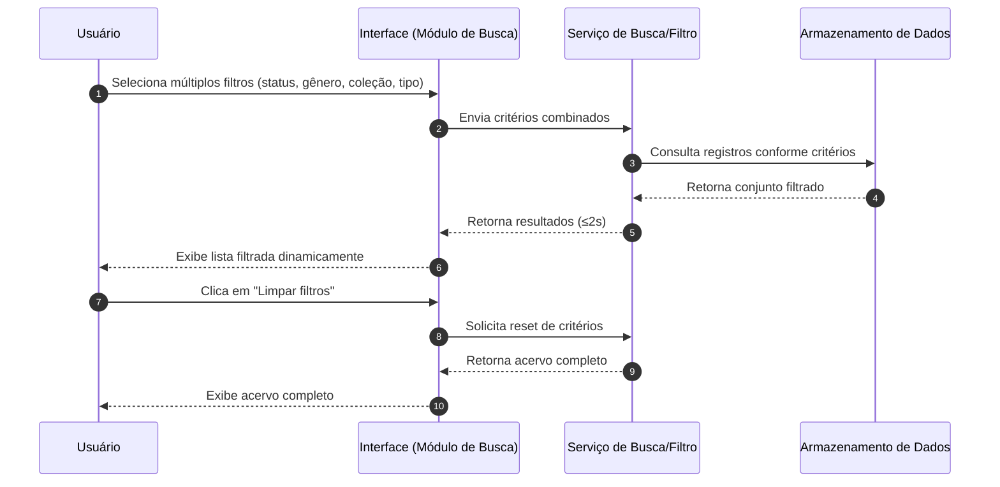
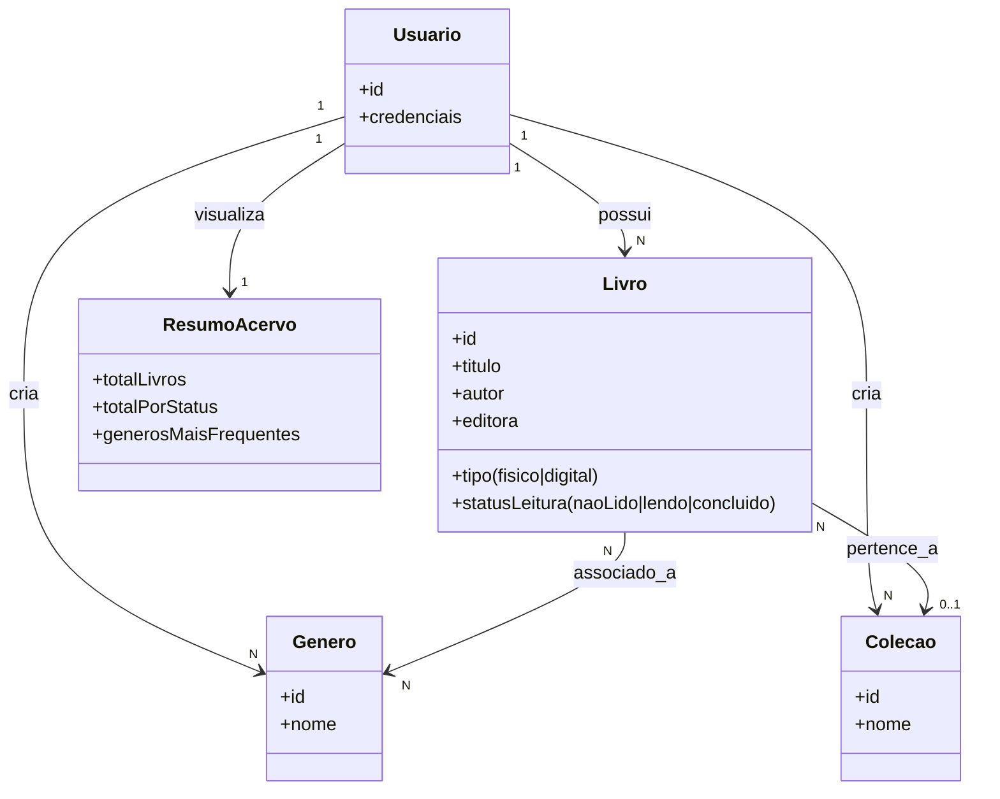

# Relatório Técnico de Arquitetura de Software
## Sistema de Catalogação de Livros — Biblioteca Pessoal (P04)

---

## 1. Identificação das HUs

| HU   | Título                              | RFs Relacionados      | RNFs Relacionados   |
|------|--------------------------------------|------------------------|----------------------|
| HU01 | Cadastrar livro                      | RF01, RF04, RF13       | RNF01, RNF02, RNF04  |
| HU02 | Atualizar status de leitura           | RF05, RF04             | RNF04, RNF05         |
| HU03 | Organizar livros por gênero           | RF06, RF08             | RNF04                |
| HU04 | Organizar livros por coleção          | RF07, RF08             | RNF04                |
| HU05 | Filtrar o acervo                      | RF09                   | RNF03, RNF02         |
| HU06 | Pesquisar livros por título/autor      | RF12                   | RNF03, RNF02         |
| HU07 | Visualizar resumo do acervo           | RF10, RF11             | RNF05                |
| HU08 | Exportar o acervo                     | —                       | RNF07                |

**Observações de rastreabilidade:**
- RF02 (edição) e RF03 (remoção) não possuem HU explícita, sendo tratados como extensões implícitas de HU01 (fluxo CRUD completo).
- RNF01 e RNF06 são requisitos transversais, aplicáveis a todas as HUs.

---

## 2. Diagramas de Arquitetura (Mermaid)

### 2.1 Diagrama de Componentes (Visão Macro)

```mermaid
flowchart TB
    subgraph Cliente["Camada de Interface (Cliente)"]
        UI_Catalogo["Módulo de Catálogo (CRUD Livros)"]
        UI_Organizacao["Módulo de Organização (Gêneros/Coleções)"]
        UI_Busca["Módulo de Busca e Filtros"]
        UI_Resumo["Módulo de Resumo/Estatísticas"]
        UI_Export["Módulo de Exportação"]
    end

    subgraph Backend["Camada de Aplicação (Serviços)"]
        AuthService["Serviço de Autenticação"]
        BookService["Serviço de Livros"]
        GenreService["Serviço de Gêneros"]
        CollectionService["Serviço de Coleções"]
        SearchService["Serviço de Busca/Filtro"]
        StatsService["Serviço de Estatísticas"]
        ExportService["Serviço de Exportação"]
    end

    subgraph Persistencia["Camada de Persistência"]
        DataStore["Armazenamento de Dados (Acervo)"]
    end

    UI_Catalogo -->|CRUD Livro| BookService
    UI_Organizacao -->|CRUD Gênero/Coleção| GenreService
    UI_Organizacao -->|CRUD Gênero/Coleção| CollectionService
    UI_Busca -->|Consulta| SearchService
    UI_Resumo -->|Consulta Agregada| StatsService
    UI_Export -->|Solicita Exportação| ExportService

    AuthService -.->|Valida Sessão| BookService
    AuthService -.->|Valida Sessão| GenreService
    AuthService -.->|Valida Sessão| CollectionService
    AuthService -.->|Valida Sessão| SearchService
    AuthService -.->|Valida Sessão| StatsService
    AuthService -.->|Valida Sessão| ExportService

    BookService --> DataStore
    GenreService --> DataStore
    CollectionService --> DataStore
    SearchService --> DataStore
    StatsService --> DataStore
    ExportService --> DataStore
```

### 2.2 Diagrama de Sequência — Cadastro de Livro (HU01)

### 2.3 Diagrama de Sequência — Filtro Combinado (HU05)

### 2.4 Diagrama de Classes (Modelo Conceitual de Domínio)

---

## 3. Decisões de Arquitetura

| ID  | Decisão | Justificativa |
|-----|---------|----------------|
| DA01 | Adotar arquitetura em camadas (Interface, Aplicação/Serviços, Persistência) com separação clara de responsabilidades. | Facilita manutenibilidade (RNF07) e permite evolução independente dos módulos de busca, estatísticas e exportação. |
| DA02 | Isolamento de dados por usuário aplicado na camada de Aplicação e reforçado na Persistência (particionamento lógico por identificador de usuário). | Atende RNF01 — acervo estritamente pessoal e isolado. |
| DA03 | Serviço de Estatísticas (StatsService) desacoplado do Serviço de Livros, comunicando-se via notificação de eventos de alteração. | Suporta RF10, RF11 e RNF05 (atualização em tempo real) sem acoplar lógica estatística ao CRUD principal. |
| DA04 | Relacionamento N:N entre Livro e Gênero; relacionamento N:1 entre Livro e Coleção. | Reflete diretamente as regras de negócio de HU03 (múltiplos gêneros) e HU04 (uma coleção por vez). |
| DA05 | Exclusão de Gênero/Coleção implementada como desvinculação (soft dissociation), nunca cascata de exclusão de Livro. | Requisito explícito nos critérios de aceite de HU03 e HU04. |
| DA06 | Serviço de Busca/Filtro projetado com suporte a composição dinâmica de critérios (múltiplos atributos simultâneos). | Atende RF09 e HU05 (combinação de filtros). |
| DA07 | Serviço de Exportação desacoplado, consumindo o mesmo modelo de domínio do acervo, com suporte a múltiplos formatos de saída. | Atende RF07 e HU08 sem impor tecnologia de geração de arquivo específica. |
| DA08 | Autenticação centralizada em um serviço transversal, validado antes de qualquer operação nos demais serviços. | Atende RNF01 de forma consistente em toda a superfície de API. |
| DA09 | Interface projetada com princípio de responsividade e compatibilidade multi-navegador desde a concepção dos componentes visuais. | Atende RNF02 e RNF06 sem prescrever framework específico. |
| DA10 | Requisitos de desempenho (RNF03) tratados como restrição arquitetural de índice/consulta na camada de Persistência e de otimização de consulta na camada de Busca. | Garante resposta ≤2s independentemente do volume, sem prescrever tecnologia de armazenamento. |

---

## 4. Tabela de Componentes e Rastreabilidade

| Componente | Responsabilidade Principal | Comunica-se com | Origem (HU / Critério de Aceite) |
|------------|------------------------------|-------------------|-------------------------------------|
| Módulo de Catálogo (UI) | Interface para cadastro, edição e remoção de livros | Serviço de Livros | HU01, RF01, RF02, RF03, RF13 |
| Módulo de Organização (UI) | Interface para gestão de gêneros e coleções | Serviço de Gêneros, Serviço de Coleções | HU03, HU04, RF06, RF07, RF08 |
| Módulo de Busca e Filtros (UI) | Interface para pesquisa textual e filtros combinados | Serviço de Busca/Filtro | HU05, HU06, RF09, RF12 |
| Módulo de Resumo/Estatísticas (UI) | Exibição de indicadores agregados do acervo | Serviço de Estatísticas | HU07, RF10, RF11 |
| Módulo de Exportação (UI) | Interface para seleção de formato e disparo de download | Serviço de Exportação | HU08, RNF07 |
| Serviço de Autenticação | Validação de sessão e isolamento de dados por usuário | Todos os serviços de aplicação | RNF01 |
| Serviço de Livros | Regras de negócio de CRUD de livro, validação de campos obrigatórios | Armazenamento de Dados, Serviço de Estatísticas | HU01, HU02, RF01–RF05, RF13 |
| Serviço de Gêneros | CRUD de gêneros e desvinculação em remoção | Armazenamento de Dados | HU03, RF06 |
| Serviço de Coleções | CRUD de coleções e desvinculação em remoção | Armazenamento de Dados | HU04, RF07 |
| Serviço de Busca/Filtro | Composição dinâmica de critérios e busca textual parcial | Armazenamento de Dados | HU05, HU06, RF09, RF12 |
| Serviço de Estatísticas | Cálculo e atualização em tempo real de indicadores agregados | Armazenamento de Dados | HU07, RF10, RF11, RNF05 |
| Serviço de Exportação | Geração de arquivo estruturado (CSV/JSON) para download | Armazenamento de Dados | HU08, RNF07 |
| Armazenamento de Dados | Persistência durável dos dados do acervo, isolada por usuário | Todos os serviços de aplicação | RNF04, RNF01 |

---

## 5. Bloqueios e Pendências

| ID | Descrição | Impacto | Responsável Sugerido |
|----|-----------|---------|------------------------|
| BP01 | Não há especificação do mecanismo de autenticação (cadastro de usuário, recuperação de senha, tipos de login). | Bloqueia definição detalhada do fluxo de autenticação. | Equipe de Produto/Negócio |
| BP02 | Não há definição de limites de volume de dados (quantidade máxima de livros/gêneros/coleções por usuário). | Impacta dimensionamento da restrição de desempenho RNF03. | Equipe de Produto |
| BP03 | Ausência de critério de desempate para "gêneros mais frequentes" (RF11) em caso de empate. | Impacta lógica de apresentação do resumo (HU07). | Equipe de Produto/UX |
| BP04 | Não há definição de comportamento de exportação para acervos vazios ou muito grandes (paginação, limite de tamanho de arquivo). | Impacta design do Serviço de Exportação. | Equipe de Produto/Dev |
| BP05 | Não há especificação de política de erros/validação para associações inválidas (ex.: associar livro a coleção inexistente). | Impacta contrato de API dos serviços de organização. | Equipe de Dev |

---

## 6. Cobertura de Requisitos

| Requisito | Status de Cobertura | Componente(s) Responsável(is) |
|-----------|----------------------|----------------------------------|
| RF01 | Coberto | Serviço de Livros, Módulo de Catálogo |
| RF02 | Coberto | Serviço de Livros, Módulo de Catálogo |
| RF03 | Coberto | Serviço de Livros, Módulo de Catálogo |
| RF04 | Coberto | Serviço de Livros |
| RF05 | Coberto | Serviço de Livros, Serviço de Estatísticas |
| RF06 | Coberto | Serviço de Gêneros |
| RF07 | Coberto | Serviço de Coleções |
| RF08 | Coberto | Serviço de Livros, Serviço de Gêneros, Serviço de Coleções |
| RF09 | Coberto | Serviço de Busca/Filtro |
| RF10 | Coberto | Serviço de Estatísticas |
| RF11 | Coberto (com pendência BP03) | Serviço de Estatísticas |
| RF12 | Coberto | Serviço de Busca/Filtro |
| RF13 | Coberto | Serviço de Livros |
| RNF01 | Coberto | Serviço de Autenticação |
| RNF02 | Coberto (nível conceitual) | Camada de Interface |
| RNF03 | Coberto (nível conceitual, pendente BP02) | Serviço de Busca/Filtro, Armazenamento de Dados |
| RNF04 | Coberto | Armazenamento de Dados |
| RNF05 | Coberto | Serviço de Estatísticas |
| RNF06 | Coberto (nível conceitual) | Camada de Interface |
| RNF07 | Coberto | Serviço de Exportação |

**Cobertura total estimada:** 19/19 requisitos endereçados arquiteturalmente, com 3 pendências de detalhamento (BP02, BP03, BP04) que não bloqueiam o desenho macro, mas exigem refinamento antes da implementação.

---

## 7. Gap Analysis

| Gap Identificado | Impacto Arquitetural | Ação Recomendada |
|-------------------|------------------------|----------------------|
| Ausência de modelo de gestão de usuários (cadastro, senha, sessão) apesar de RNF01 exigir autenticação. | Serviço de Autenticação não pode ser detalhado em nível de contrato de API sem essa definição. | Levantar requisito complementar de gestão de identidade com o time de produto. |
| Falta de definição sobre concorrência (múltiplos dispositivos/abas editando o mesmo acervo simultaneamente). | Pode gerar inconsistência entre Serviço de Livros e Serviço de Estatísticas em cenários de atualização simultânea. | Definir estratégia de consistência (ex.: last-write-wins ou bloqueio otimista) em fase de detalhamento técnico. |
| RF09 menciona "qualquer atributo cadastrado" mas não define comportamento de filtro sobre campos textuais livres (ex.: busca por trecho de editora). | Ambiguidade na diferenciação entre filtro exato (RF09) e busca parcial (RF12/HU06). | Esclarecer com stakeholders se filtros por texto devem ser exatos ou parciais. |
| Não há requisito sobre versionamento/histórico de alterações de status de leitura. | Resumo estatístico (HU07) pode não suportar análises históricas futuras (ex.: livros lidos por período). | Registrar como possível evolução futura (backlog), sem impacto na arquitetura atual. |
| RF13 diferencia "físico" e "digital", mas não há requisito sobre campos adicionais específicos por tipo (ex.: formato digital: ePub/PDF). | Modelo de domínio pode necessitar de extensão futura sem impacto na estrutura atual, mas deve ser considerado no design de `Livro`. | Validar com produto se há necessidade de metadados adicionais por tipo de livro. |
| Exportação (HU08) não especifica se deve incluir associações de gênero/coleção nominalmente ou por identificador. | Pode gerar arquivo de exportação inconsistente ou pouco útil para o usuário final. | Definir formato de exportação detalhado (schema de CSV/JSON) em especificação complementar. |

---

**Fim do Relatório Técnico de Arquitetura de Software — P04.**