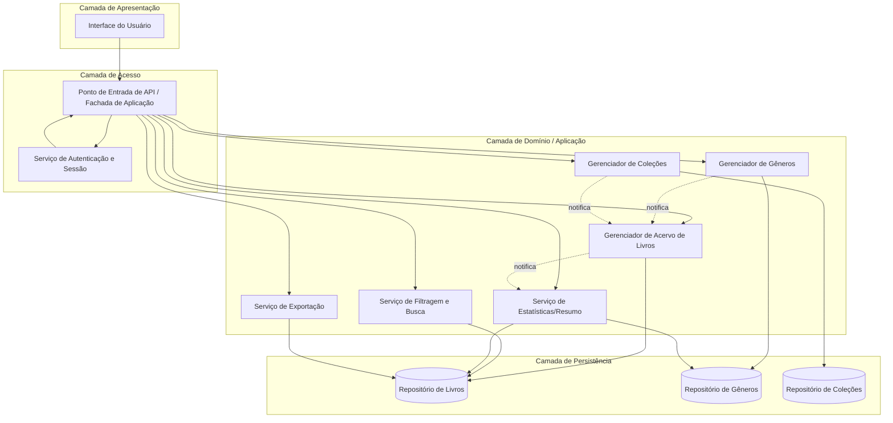
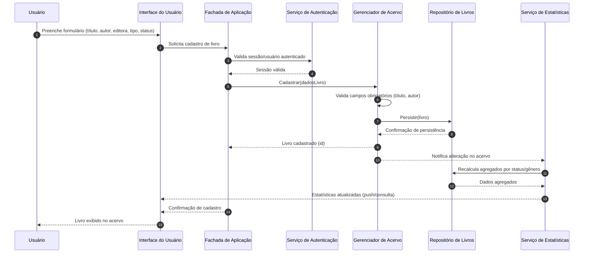
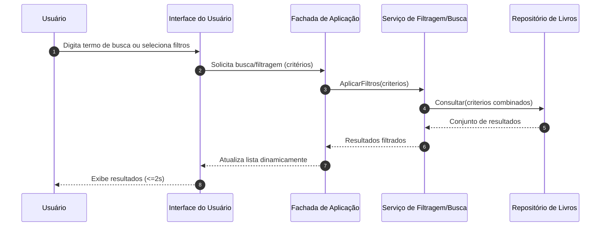

# Relatório Técnico de Arquitetura de Software
## Sistema de Catalogação de Livros (P04)

---

## 1. Identificação das HUs

| HU   | Título                              | RFs Relacionados      | RNFs Relacionados     |
|------|--------------------------------------|------------------------|-------------------------|
| HU01 | Cadastrar livro                      | RF01, RF04, RF13       | RNF01, RNF04            |
| HU02 | Atualizar status de leitura           | RF05, RF04             | RNF05                   |
| HU03 | Organizar livros por gênero           | RF06, RF08             | RNF04                   |
| HU04 | Organizar livros por coleção          | RF07, RF08             | RNF04                   |
| HU05 | Filtrar o acervo                      | RF09                   | RNF03                   |
| HU06 | Pesquisar livros por título ou autor   | RF12                   | RNF03                   |
| HU07 | Visualizar resumo do acervo           | RF10, RF11             | RNF05                   |
| HU08 | Exportar o acervo                     | RF07 (parcial)         | RNF07                   |

Requisitos transversais (aplicam-se a todas as HUs): RNF01 (autenticação/isolamento por usuário), RNF02 (responsividade), RNF06 (compatibilidade de navegadores).

RF02 e RF03 (editar/remover livro) são operações CRUD de suporte, não vinculadas a HU específica, mas cobertas pelo Componente de Gerenciamento de Acervo.

---

## 2. Diagramas de Arquitetura (Mermaid)

### 2.1 Diagrama de Componentes (Visão Geral)

### 2.2 Diagrama de Sequência — Cadastro de Livro e Atualização do Resumo (HU01, HU07)

### 2.3 Diagrama de Sequência — Filtragem e Busca Dinâmica (HU05, HU06)

---

## 3. Decisões de Arquitetura

| # | Decisão | Justificativa |
|---|---------|----------------|
| D01 | Separação em camadas (Apresentação, Aplicação/Domínio, Persistência) | Facilita manutenibilidade (RNF07) e testabilidade isolada de regras de negócio. |
| D02 | Isolamento de dados por usuário na camada de persistência | Atende RNF01 — acervo estritamente pessoal. |
| D03 | Serviço de Estatísticas desacoplado via notificação orientada a eventos internos | Atende RNF05 — atualização em tempo real do resumo sem acoplamento direto entre CRUD e estatísticas. |
| D04 | Serviço de Filtragem/Busca como componente único e independente | Reutilizável para HU05 e HU06, garantindo consistência e desempenho (RNF03). |
| D05 | Gêneros e Coleções como entidades independentes, associadas por referência (não composição) | Atende regra de negócio de desvinculação sem exclusão de livros (HU03, HU04). |
| D06 | Cardinalidade N:N entre Livro e Gênero; 1:N entre Coleção e Livro | Reflete regras: múltiplos gêneros por livro, uma única coleção por livro. |
| D07 | Serviço de Exportação desacoplado, consumindo o mesmo repositório de leitura | Suporta múltiplos formatos (CSV/JSON) sem impactar o modelo de domínio (RNF07). |
| D08 | Autenticação centralizada como camada transversal (cross-cutting) | Atende RNF01 e mantém neutralidade quanto a mecanismos concretos de auth. |
| D09 | Interface responsiva desacoplada da lógica de negócio | Atende RNF02/RNF06 sem prescrever tecnologia de front-end. |

---

## 4. Tabela de Componentes e Rastreabilidade

| Componente | Responsabilidade Principal | Comunica-se com | Origem (HU / Critério de Aceite) |
|---|---|---|---|
| Interface do Usuário | Apresentar formulários, listas, filtros e estatísticas; capturar interações | Fachada de Aplicação | HU01–HU08 (todos os critérios de UI) |
| Serviço de Autenticação e Sessão | Validar identidade do usuário e isolar acervo por usuário | Fachada de Aplicação | RNF01 |
| Fachada de Aplicação | Orquestrar chamadas entre UI e serviços de domínio | Todos os componentes de domínio | Transversal |
| Gerenciador de Acervo de Livros | CRUD de livros, validação de campos obrigatórios, controle de tipo físico/digital e status | Repositório de Livros, Serviço de Estatísticas | HU01 (critérios de obrigatoriedade), RF02, RF03, RF13 |
| Gerenciador de Gêneros | CRUD de gêneros e associação/desvinculação com livros | Repositório de Gêneros, Gerenciador de Acervo | HU03 (todos os critérios) |
| Gerenciador de Coleções | CRUD de coleções e associação/desvinculação (1 livro:1 coleção) | Repositório de Coleções, Gerenciador de Acervo | HU04 (todos os critérios) |
| Serviço de Filtragem e Busca | Aplicar filtros combinados e busca textual parcial dinâmica | Repositório de Livros | HU05, HU06 (todos os critérios) |
| Serviço de Estatísticas/Resumo | Calcular totais por status e gêneros mais frequentes, atualizar em tempo real | Repositório de Livros, Repositório de Gêneros | HU02 (critério de atualização), HU07 (todos os critérios), RNF05 |
| Serviço de Exportação | Gerar arquivo CSV/JSON com todos os campos do acervo | Repositório de Livros | HU08 (todos os critérios), RNF07 |
| Repositório de Livros | Persistência e recuperação de dados de livros | Gerenciador de Acervo, Serviço de Filtragem, Estatísticas, Exportação | RNF04 |
| Repositório de Gêneros | Persistência de gêneros | Gerenciador de Gêneros, Estatísticas | RNF04 |
| Repositório de Coleções | Persistência de coleções | Gerenciador de Coleções | RNF04 |

---

## 5. Bloqueios e Pendências

| # | Item | Descrição | Impacto |
|---|------|-----------|---------|
| B01 | Modelo de autenticação não especificado | Requisitos não definem se é login local, SSO ou outro mecanismo | Impede detalhamento do fluxo de autenticação (RNF01) |
| B02 | Limite de volume de dados não definido | RNF03 exige desempenho independente do volume, mas não há teto informado | Impacta dimensionamento de estratégia de indexação/paginação |
| B03 | Ausência de definição sobre exclusão em cascata de coleções/gêneros no nível de UI | HU03/HU04 definem regra de negócio, mas não fluxo de confirmação ao usuário | Pode gerar ambiguidade de UX |
| B04 | Formato exato dos campos exportados (CSV/JSON) não detalhado | RF07/HU08 não especificam schema de exportação | Pode gerar retrabalho na implementação do exportador |
| B05 | Não há RF/RNF sobre multiusuário simultâneo ou limites de sessão | RNF01 menciona isolamento, mas não concorrência | Pode impactar arquitetura de concorrência de escrita |

---

## 6. Cobertura de Requisitos

| Requisito | Coberto? | Componente(s) Responsável(is) |
|---|---|---|
| RF01 | Sim | Gerenciador de Acervo de Livros |
| RF02 | Sim | Gerenciador de Acervo de Livros |
| RF03 | Sim | Gerenciador de Acervo de Livros |
| RF04 | Sim | Gerenciador de Acervo de Livros |
| RF05 | Sim | Gerenciador de Acervo de Livros, Serviço de Estatísticas |
| RF06 | Sim | Gerenciador de Gêneros |
| RF07 | Sim | Gerenciador de Coleções |
| RF08 | Sim | Gerenciador de Acervo, Gerenciador de Gêneros, Gerenciador de Coleções |
| RF09 | Sim | Serviço de Filtragem e Busca |
| RF10 | Sim | Serviço de Estatísticas/Resumo |
| RF11 | Sim | Serviço de Estatísticas/Resumo |
| RF12 | Sim | Serviço de Filtragem e Busca |
| RF13 | Sim | Gerenciador de Acervo de Livros |
| RNF01 | Sim | Serviço de Autenticação e Sessão |
| RNF02 | Sim | Interface do Usuário |
| RNF03 | Sim | Serviço de Filtragem e Busca (design), pendente validação de carga (B02) |
| RNF04 | Sim | Repositórios (Livros, Gêneros, Coleções) |
| RNF05 | Sim | Serviço de Estatísticas/Resumo |
| RNF06 | Sim | Interface do Usuário |
| RNF07 | Sim | Serviço de Exportação |

**Cobertura total: 100% dos RFs e RNFs mapeados a pelo menos um componente arquitetural.**

---

## 7. Gap Analysis

| # | Lacuna Identificada | Impacto Arquitetural | Ação Recomendada |
|---|---|---|---|
| G01 | Ausência de definição de estratégia de autenticação concreta | Bloqueia especificação do fluxo de login/sessão e políticas de token/expiração | Time de produto deve definir mecanismo de autenticação (ex.: login simples, OAuth, etc.) antes do detalhamento técnico |
| G02 | Falta de critério de desempenho por volume (RNF03) | Dificulta decisão sobre necessidade de paginação, cache ou indexação | Levantar estimativa de volume esperado de livros por usuário |
| G03 | Ausência de regras de auditoria/histórico de alterações | Sistema não versiona alterações de status de leitura ao longo do tempo, apesar de HU02 mencionar "progresso ao longo do tempo" | Avaliar se é necessário um componente de Histórico/Log de Leitura |
| G04 | Sem definição de schema de exportação | Serviço de Exportação pode divergir do modelo de domínio sem contrato claro | Definir estrutura de campos exportados junto com stakeholders |
| G05 | Não há requisito sobre conflitos de edição concorrente | Ausência de tratamento de concorrência em múltiplas abas/dispositivos do mesmo usuário | Investigar necessidade de bloqueio otimista ou last-write-wins |
| G06 | Falta de definição sobre limites de gêneros/coleções por livro além da cardinalidade | Pode impactar UI e modelo de dados (ex: limite de gêneros por livro) | Confirmar com stakeholders se há teto de associações |
| G07 | Ausência de requisito de internacionalização/idioma | Não crítico, mas pode impactar usabilidade futura (RNF02) | Registrar como item de backlog futuro, sem bloquear entrega atual |