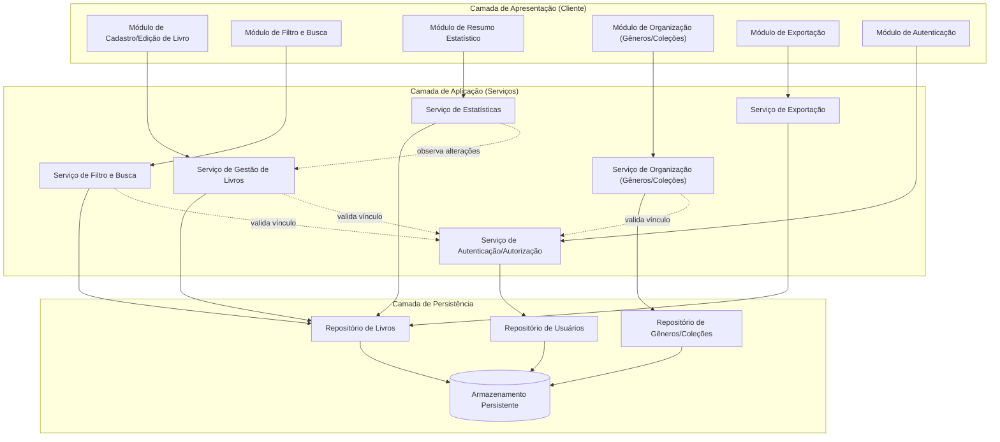
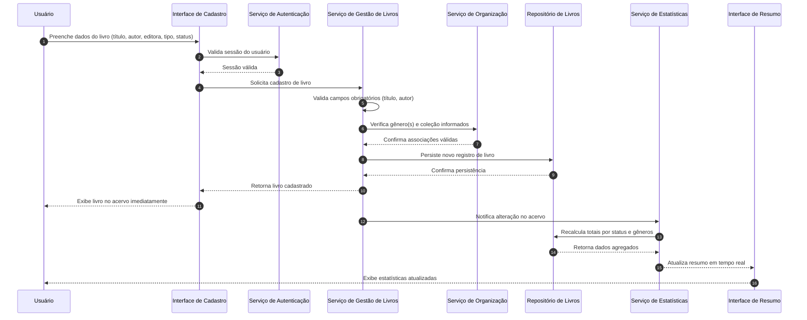
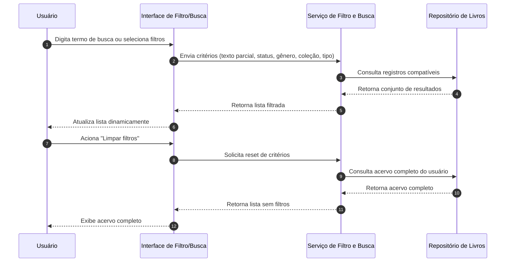

# Relatório Técnico de Arquitetura de Software
## Sistema de Catalogação de Livros — Biblioteca Pessoal (P04)

---

## 1. Identificação das HUs

| HU | Título | RFs Relacionados | RNFs Relacionados |
|----|--------|-------------------|--------------------|
| HU01 | Cadastrar livro | RF01, RF04, RF13 | RNF01, RNF02, RNF04 |
| HU02 | Atualizar status de leitura | RF05 | RNF05 |
| HU03 | Organizar livros por gênero | RF06, RF08 | RNF04 |
| HU04 | Organizar livros por coleção | RF07, RF08 | RNF04 |
| HU05 | Filtrar o acervo | RF09 | RNF03 |
| HU06 | Pesquisar livros por título/autor | RF12 | RNF03 |
| HU07 | Visualizar resumo do acervo | RF10, RF11 | RNF05 |
| HU08 | Exportar o acervo | — | RNF07 |
| Transversal | Autenticação e isolamento de dados | — | RNF01, RNF02, RNF06 |

---

## 2. Diagramas de Arquitetura (Mermaid)

### 2.1 Diagrama de Componentes

### 2.2 Diagrama de Sequência — Cadastro de Livro com Atualização de Estatísticas (HU01 + HU07)

### 2.3 Diagrama de Sequência — Filtro Combinado e Busca Dinâmica (HU05 + HU06)

---

## 3. Decisões de Arquitetura

| # | Decisão | Justificativa |
|---|---------|----------------|
| D01 | Separação em camadas (Apresentação, Aplicação, Persistência) | Facilita manutenção e evolução independente de cada responsabilidade (RNF02, RNF06). |
| D02 | Serviço de Estatísticas desacoplado, orientado a eventos de alteração do acervo | Atende RNF05 (atualização em tempo real) sem acoplar lógica estatística ao serviço de livros. |
| D03 | Isolamento de dados por usuário aplicado na camada de serviço, validado antes de qualquer operação de leitura/escrita | Garante RNF01 (acervo estritamente pessoal). |
| D04 | Gêneros e Coleções tratados como entidades independentes, associadas por referência (não por cópia) | Permite desvincular sem excluir livros (HU03, HU04). |
| D05 | Cardinalidade diferenciada: livro–gênero (N:N) e livro–coleção (N:1) | Reflete regras de negócio explícitas nos critérios de aceite de HU03 e HU04. |
| D06 | Serviço de Busca e Filtro único, com múltiplos critérios combináveis | Atende RF09, RF12 e HU05/HU06 de forma consistente, evitando duplicação de lógica de consulta. |
| D07 | Exportação implementada como serviço assíncrono/sob demanda, gerando arquivo para download client-side | Atende RNF07/HU08 sem impor tecnologia específica de geração de arquivo. |
| D08 | Persistência abstraída via Repositórios (padrão Repository) | Mantém neutralidade tecnológica e permite troca de mecanismo de armazenamento sem impacto na camada de aplicação. |
| D09 | Requisitos de desempenho (RNF03) tratados via indexação lógica nos repositórios (conceito, não produto) | Consulta e filtragem devem responder em até 2s independentemente do volume. |

---

## 4. Tabela de Componentes e Rastreabilidade

| Componente | Responsabilidade Principal | Comunica-se com | Origem (HU / Critério de Aceite) |
|------------|------------------------------|-------------------|-------------------------------------|
| Módulo de Cadastro/Edição de Livro | Capturar e validar dados de entrada do livro (título, autor, editora, tipo, status) | Serviço de Gestão de Livros | HU01, RF01, RF02, RF13 |
| Módulo de Organização | Interface para criação/edição/remoção de gêneros e coleções | Serviço de Organização | HU03, HU04, RF06, RF07, RF08 |
| Módulo de Filtro e Busca | Capturar critérios de filtro e termos de busca, exibir resultados dinâmicos | Serviço de Filtro e Busca | HU05, HU06, RF09, RF12 |
| Módulo de Resumo Estatístico | Exibir totais por status e gêneros mais frequentes | Serviço de Estatísticas | HU07, RF10, RF11 |
| Módulo de Exportação | Permitir escolha de formato e disparar download | Serviço de Exportação | HU08, RNF07 |
| Módulo de Autenticação | Login e gestão de sessão do usuário | Serviço de Autenticação | RNF01 |
| Serviço de Gestão de Livros | Regras de negócio de CRUD de livros, validação de obrigatoriedade | Repositório de Livros, Serviço de Organização, Serviço de Estatísticas | HU01, HU02, RF01–RF05, RF13 |
| Serviço de Organização | Regras de negócio de gêneros/coleções, desvínculo sem exclusão de livros | Repositório de Gêneros/Coleções, Serviço de Gestão de Livros | HU03, HU04, RF06–RF08 |
| Serviço de Filtro e Busca | Executar consultas combinadas e busca textual parcial | Repositório de Livros | HU05, HU06, RF09, RF12 |
| Serviço de Estatísticas | Calcular e atualizar totais e frequências em tempo real | Repositório de Livros | HU07, RF10, RF11, RNF05 |
| Serviço de Exportação | Gerar arquivo de exportação (CSV/JSON) a partir dos dados persistidos | Repositório de Livros | HU08, RNF07 |
| Serviço de Autenticação/Autorização | Validar credenciais e isolar acervo por usuário | Repositório de Usuários, todos os demais serviços | RNF01 |
| Repositório de Livros | Persistir e recuperar registros de livros | Armazenamento Persistente | RF01–RF05, RF09–RF13, RNF04 |
| Repositório de Gêneros/Coleções | Persistir e recuperar entidades de organização | Armazenamento Persistente | RF06–RF08, RNF04 |
| Repositório de Usuários | Persistir credenciais e vínculos de propriedade do acervo | Armazenamento Persistente | RNF01 |

---

## 5. Bloqueios e Pendências

| # | Descrição | Impacto | Responsável Sugerido |
|---|-----------|---------|------------------------|
| B01 | Não há definição de mecanismo de autenticação (login social, senha própria, etc.) | Impede detalhamento do fluxo de sessão | Time de Produto/Segurança |
| B02 | Ausência de regra sobre limite de tamanho do acervo (volume máximo de livros) para validar RNF03 (2s) | Pode afetar dimensionamento da camada de persistência | Time de Arquitetura |
| B03 | Não especificado se exportação (HU08) deve incluir gêneros e coleções vinculados ou apenas campos base do livro | Impacta o contrato do Serviço de Exportação | Time de Produto |
| B04 | Não há definição de comportamento quando usuário remove um gênero/coleção associado a filtros ativos | Pode gerar inconsistência de estado na UI de Filtro | Time de UX/Frontend |
| B05 | RF13 (físico/digital) não possui HU dedicada nem critérios de aceite próprios | Risco de subespecificação de regras de negócio para esse atributo | Time de Produto |

---

## 6. Cobertura de Requisitos

| Requisito | Coberto por Componente(s) | Status |
|-----------|------------------------------|--------|
| RF01 | Módulo/Serviço de Gestão de Livros | ✅ Coberto |
| RF02 | Módulo/Serviço de Gestão de Livros | ✅ Coberto |
| RF03 | Serviço de Gestão de Livros, Repositório de Livros | ✅ Coberto |
| RF04 | Módulo de Cadastro/Edição de Livro | ✅ Coberto |
| RF05 | Serviço de Gestão de Livros | ✅ Coberto |
| RF06 | Serviço de Organização | ✅ Coberto |
| RF07 | Serviço de Organização | ✅ Coberto |
| RF08 | Serviço de Organização + Serviço de Gestão de Livros | ✅ Coberto |
| RF09 | Serviço de Filtro e Busca | ✅ Coberto |
| RF10 | Serviço de Estatísticas | ✅ Coberto |
| RF11 | Serviço de Estatísticas | ✅ Coberto |
| RF12 | Serviço de Filtro e Busca | ✅ Coberto |
| RF13 | Módulo de Cadastro/Edição de Livro | ⚠️ Coberto parcialmente (ver B05) |
| RNF01 | Serviço de Autenticação/Autorização | ✅ Coberto |
| RNF02 | Camada de Apresentação (design conceitual) | ✅ Coberto (nível conceitual) |
| RNF03 | Serviço de Filtro e Busca, Repositório de Livros | ⚠️ Coberto parcialmente (ver B02) |
| RNF04 | Repositórios de Livros/Organização | ✅ Coberto |
| RNF05 | Serviço de Estatísticas | ✅ Coberto |
| RNF06 | Camada de Apresentação (não prescritiva) | ✅ Coberto (nível conceitual) |
| RNF07 | Serviço de Exportação | ⚠️ Coberto parcialmente (ver B03) |

---

## 7. Gap Analysis

| # | Lacuna Identificada | Impacto Arquitetural | Ação Recomendada |
|---|----------------------|------------------------|---------------------|
| G01 | Ausência de especificação do mecanismo de autenticação | Impede definição de contrato de sessão/token no Serviço de Autenticação | Definir com stakeholders o modelo de autenticação antes do detalhamento de baixo nível |
| G02 | Falta de critério de volume máximo do acervo para validar RNF03 | Dificulta decisão de estratégia de indexação/paginação | Estabelecer faixas de volume esperadas (ex.: até N livros) para dimensionar consultas |
| G03 | Escopo de dados na exportação (HU08) não define se inclui relações (gênero/coleção) | Ambiguidade no contrato do Serviço de Exportação | Detalhar schema de exportação junto ao Product Owner |
| G04 | RF13 (físico/digital) sem HU e critérios de aceite dedicados | Risco de tratamento superficial desse atributo em filtros e estatísticas | Criar HU específica ou incorporar explicitamente aos critérios de HU01 e HU05 |
| G05 | Comportamento de filtros ativos ao remover gênero/coleção vinculado não definido | Pode gerar filtro "órfão" na interface, gerando inconsistência de UX | Definir regra de invalidação/limpeza automática de filtro associado à entidade removida |
| G06 | Não há requisito de auditoria/histórico de alterações no acervo | Limita rastreabilidade de mudanças de status ao longo do tempo (mencionado em HU02 como "progresso ao longo do tempo") | Avaliar necessidade de histórico de status como requisito futuro |
| G07 | Ausência de definição sobre paginação ou volume de resultados exibidos na listagem/filtro | Pode impactar RNF03 em acervos grandes | Especificar estratégia de paginação/scroll na camada de apresentação |