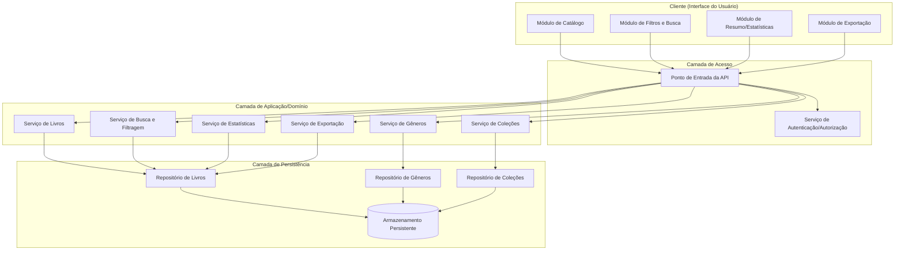
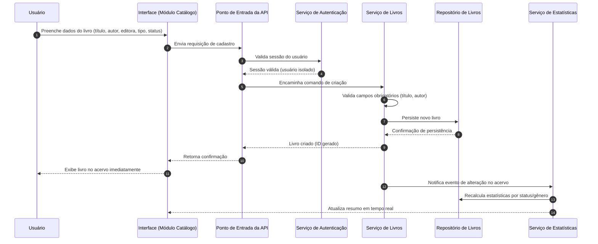
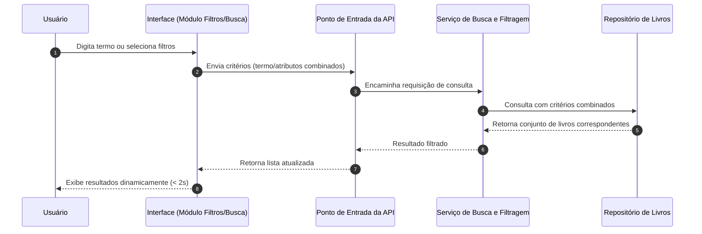

# Relatório Técnico de Arquitetura de Software
## Sistema de Catalogação de Livros (P04)

## 1. Identificação das HUs

| HU | Título | RFs relacionados | RNFs relacionados |
|----|--------|-------------------|---------------------|
| HU01 | Cadastrar livro | RF01, RF04, RF13 | RNF01, RNF03, RNF04 |
| HU02 | Atualizar status de leitura | RF05, RF04 | RNF05, RNF03 |
| HU03 | Organizar livros por gênero | RF06, RF08 | RNF04 |
| HU04 | Organizar livros por coleção | RF07, RF08 | RNF04 |
| HU05 | Filtrar o acervo | RF09 | RNF03 |
| HU06 | Pesquisar livros por título/autor | RF12 | RNF03 |
| HU07 | Visualizar resumo do acervo | RF10, RF11 | RNF05 |
| HU08 | Exportar acervo | RNF07 | RNF04 |

Transversais a todas as HUs: RNF01 (autenticação/isolamento por usuário), RNF02 (responsividade), RNF06 (compatibilidade de navegadores).

---

## 2. Diagramas de Arquitetura (Mermaid)

### 2.1 Diagrama de Componentes (Visão Macro)

### 2.2 Diagrama de Sequência — Cadastro de Livro e Atualização de Resumo (HU01, HU07)

### 2.3 Diagrama de Sequência — Filtragem e Busca Dinâmica (HU05, HU06)

---

## 3. Decisões de Arquitetura

| # | Decisão | Justificativa | Requisitos relacionados |
|---|---------|----------------|--------------------------|
| D01 | Separar responsabilidades em Serviços de Livros, Gêneros, Coleções, Busca, Estatísticas e Exportação | Reduz acoplamento e permite evolução independente de cada domínio funcional | RF01-RF13 |
| D02 | Adotar camada de Autenticação isolada como pré-requisito de acesso a qualquer serviço de domínio | Garante isolamento estrito do acervo por usuário (multi-tenant lógico) | RNF01 |
| D03 | Desacoplamento entre Gênero/Coleção e Livro via associação, não composição | Ao remover gênero/coleção, livros permanecem intactos (apenas desvinculados) | HU03, HU04 |
| D04 | Serviço de Estatísticas reage a eventos de alteração do acervo (padrão observador conceitual) | Atendimento à atualização em tempo real do resumo | RF10, RF11, RNF05 |
| D05 | Serviço de Busca/Filtragem centraliza consultas combinadas por múltiplos atributos | Evita duplicação de lógica de consulta entre filtro e busca textual | RF09, RF12 |
| D06 | Restrição de cardinalidade: livro associado a N gêneros, mas a apenas 1 coleção | Regra de negócio explícita nos critérios de aceite | RF08, HU04 |
| D07 | Exportação como serviço assíncrono/sob demanda, desacoplado da persistência principal | Preserva desempenho da listagem principal (RNF03) mesmo durante exportações grandes | RF07 (implícito via RNF), RNF07 |
| D08 | Camada de Persistência abstrata (repositórios), sem definição de tecnologia concreta | Mantém neutralidade tecnológica, permitindo troca de mecanismo de armazenamento | RNF04 |
| D09 | Interface cliente estruturada em módulos responsivos independentes | Suporta RNF02 e RNF06 sem acoplamento a plataforma específica | RNF02, RNF06 |

---

## 4. Tabela de Componentes e Rastreabilidade

| Componente | Responsabilidade Principal | Comunica-se com | Origem (HU / Critério de Aceite) |
|---|---|---|---|
| Módulo de Catálogo (UI) | Exibir, cadastrar e editar livros na interface | Ponto de Entrada da API | HU01, HU02 |
| Módulo de Filtros e Busca (UI) | Capturar critérios de filtro/busca e exibir resultados dinâmicos | Ponto de Entrada da API | HU05, HU06 |
| Módulo de Resumo/Estatísticas (UI) | Exibir totais por status e gêneros mais frequentes | Ponto de Entrada da API | HU07 |
| Módulo de Exportação (UI) | Permitir escolha de formato e disparar download | Ponto de Entrada da API | HU08 |
| Ponto de Entrada da API | Rotear requisições e aplicar validação de sessão | Serviço de Autenticação, Serviços de domínio | Transversal |
| Serviço de Autenticação/Autorização | Validar identidade e isolar dados por usuário | Ponto de Entrada da API | RNF01 |
| Serviço de Livros | Criar, editar, remover e consultar livros; validar campos obrigatórios | Repositório de Livros, Serviço de Estatísticas | HU01 (critério: título/autor obrigatórios) |
| Serviço de Gêneros | Criar, renomear, remover gêneros e associar a livros | Repositório de Gêneros, Serviço de Livros | HU03 |
| Serviço de Coleções | Criar, renomear, remover coleções e associar livro único por coleção | Repositório de Coleções, Serviço de Livros | HU04 |
| Serviço de Busca e Filtragem | Executar consultas combinadas por múltiplos atributos e busca textual parcial | Repositório de Livros | HU05, HU06 |
| Serviço de Estatísticas | Calcular totais por status e ranking de gêneros; reagir a eventos de alteração | Repositório de Livros | HU02 (critério: reflexo imediato), HU07 |
| Serviço de Exportação | Gerar arquivo consolidado em CSV ou JSON para download | Repositório de Livros | HU08 |
| Repositório de Livros | Persistir e recuperar dados de livros | Armazenamento Persistente | RNF04 |
| Repositório de Gêneros | Persistir e recuperar gêneros | Armazenamento Persistente | RNF04 |
| Repositório de Coleções | Persistir e recuperar coleções | Armazenamento Persistente | RNF04 |
| Armazenamento Persistente | Garantir durabilidade dos dados sem perda | Repositórios | RNF04 |

---

## 5. Bloqueios e Pendências

| # | Descrição | Impacto | Responsável sugerido |
|---|---|---|---|
| B01 | Não há definição de mecanismo de autenticação (login local, provedor externo, etc.) | Impede detalhamento do fluxo de sessão e controle de acesso | Time de Produto/Segurança |
| B02 | Não há especificação de limite de volume de registros para validar RNF03 (2s independente do volume) | Impede definição de estratégia de indexação/paginação | Time de Arquitetura |
| B03 | Não há definição de comportamento ao editar tipo (físico/digital) após cadastro — se gera histórico ou sobrescreve | Ambiguidade na modelagem de auditoria | Time de Produto |
| B04 | Critério de aceite de HU04 não define o que ocorre se usuário tentar mover livro de uma coleção para outra diretamente | Pode gerar inconsistência de regra de negócio | Time de Produto |
| B05 | Não há definição de formato/limite de tamanho para exportação (RNF07) em acervos muito grandes | Risco de degradação de desempenho durante exportação | Time de Arquitetura |

---

## 6. Cobertura de Requisitos

| Requisito | Coberto? | Componente(s) responsável(is) |
|---|---|---|
| RF01 | Sim | Serviço de Livros |
| RF02 | Sim | Serviço de Livros |
| RF03 | Sim | Serviço de Livros |
| RF04 | Sim | Serviço de Livros (validação de domínio) |
| RF05 | Sim | Serviço de Livros, Serviço de Estatísticas |
| RF06 | Sim | Serviço de Gêneros |
| RF07 | Sim | Serviço de Coleções |
| RF08 | Sim | Serviço de Livros, Serviço de Gêneros, Serviço de Coleções |
| RF09 | Sim | Serviço de Busca e Filtragem |
| RF10 | Sim | Serviço de Estatísticas |
| RF11 | Sim | Serviço de Estatísticas |
| RF12 | Sim | Serviço de Busca e Filtragem |
| RF13 | Sim | Serviço de Livros |
| RNF01 | Sim | Serviço de Autenticação |
| RNF02 | Sim | Módulos de UI (design responsivo) |
| RNF03 | Parcial | Serviço de Busca e Filtragem (depende de definição de estratégia de indexação — ver B02) |
| RNF04 | Sim | Camada de Persistência |
| RNF05 | Sim | Serviço de Estatísticas |
| RNF06 | Sim | Módulos de UI (compatibilidade de navegador — decisão de implementação, não arquitetural) |
| RNF07 | Sim | Serviço de Exportação |

---

## 7. Gap Analysis

| # | Lacuna Identificada | Impacto Arquitetural | Ação Recomendada |
|---|---|---|---|
| G01 | Ausência de definição de estratégia de autenticação (single-user local vs. multiusuário com login) | Afeta desenho do Serviço de Autenticação e modelo de dados (chave de isolamento por usuário) | Definir com Produto o modelo de identidade antes do detalhamento técnico |
| G02 | Sem critério explícito de desempenho para volumes grandes (RNF03 diz "independente do volume", o que é tecnicamente inatingível sem estratégia de indexação/paginação) | Risco de não conformidade em acervos extensos | Estabelecer teto realista de volume e política de paginação/indexação |
| G03 | Falta de regra sobre concorrência (dois dispositivos editando o mesmo acervo simultaneamente) | Pode gerar inconsistência de dados no resumo/estatísticas | Definir estratégia de sincronização ou bloqueio otimista |
| G04 | Não há requisito sobre versionamento/histórico de alterações no livro | Pode ser esperado por usuários avançados, mas não está formalizado | Validar com stakeholders se é necessário para o MVP |
| G05 | Ausência de requisito sobre reautenticação/expiração de sessão | Afeta robustez do RNF01 | Incluir critério de expiração/renovação de sessão em versão futura |
| G06 | Não há definição de comportamento de exportação parcial (ex.: exportar apenas resultado filtrado) | HU08 menciona "acervo completo", mas pode ser útil exportar subconjuntos | Esclarecer escopo da exportação com Produto |
| G07 | Falta de requisito de idioma/localização da interface | Pode impactar usabilidade internacional | Confirmar escopo de internacionalização, se aplicável |