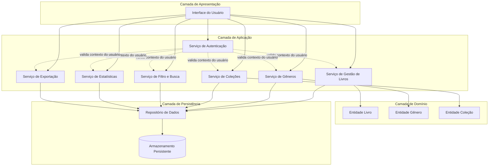
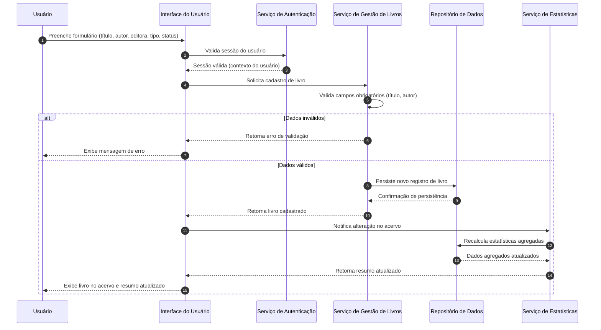
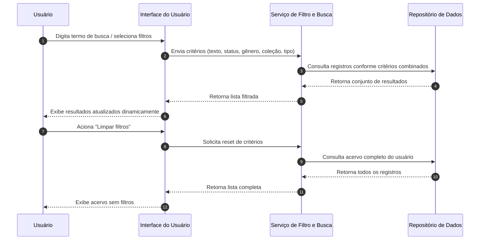
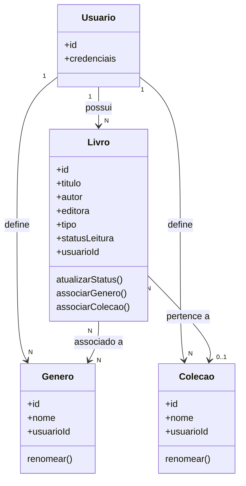

# Relatório Técnico de Arquitetura de Software
## Sistema de Catalogação de Livros — Biblioteca Pessoal (P04)

---

## 1. Identificação das HUs

| HU | Título | RFs Relacionados | RNFs Relacionados |
|----|--------|-------------------|--------------------|
| HU01 | Cadastrar livro | RF01, RF04, RF13 | RNF01, RNF04 |
| HU02 | Atualizar status de leitura | RF05, RF04 | RNF04, RNF05 |
| HU03 | Organizar livros por gênero | RF06, RF08 | RNF04 |
| HU04 | Organizar livros por coleção | RF07, RF08 | RNF04 |
| HU05 | Filtrar o acervo | RF09 | RNF02, RNF03 |
| HU06 | Pesquisar por título/autor | RF12 | RNF03 |
| HU07 | Visualizar resumo do acervo | RF10, RF11 | RNF05 |
| HU08 | Exportar acervo | — | RNF07 |
| Transversal | Isolamento/Autenticação | — | RNF01 |
| Transversal | Responsividade/Compatibilidade | — | RNF02, RNF06 |

---

## 2. Diagramas de Arquitetura (Mermaid)

### 2.1 Diagrama de Componentes (Visão Geral)

### 2.2 Diagrama de Sequência — Cadastro de Livro (HU01)

### 2.3 Diagrama de Sequência — Filtro e Busca Combinados (HU05/HU06)

### 2.4 Diagrama de Classes Conceitual (Domínio)

---

## 3. Decisões de Arquitetura

| ID | Decisão | Justificativa | Requisitos Relacionados |
|----|---------|----------------|--------------------------|
| DA01 | Separação em camadas (Apresentação, Aplicação, Domínio, Persistência) | Facilita manutenibilidade e testes isolados, sem acoplar a produtos específicos | RNF04, transversal |
| DA02 | Isolamento de dados por identificador de usuário em todas as consultas | Garante que o acervo seja estritamente pessoal, atendendo requisito de segurança | RNF01 |
| DA03 | Relacionamento N:N entre Livro e Gênero, e N:1 entre Livro e Coleção | Reflete diretamente as regras de negócio (múltiplos gêneros, uma única coleção) | RF08, HU03, HU04 |
| DA04 | Remoção de Gênero/Coleção apenas desvincula, não exclui livros | Preserva integridade do acervo conforme critérios de aceite | HU03, HU04 |
| DA05 | Serviço de Estatísticas reativo, recalculado a cada alteração no acervo | Atende à exigência de atualização em tempo real do resumo | RF10, RF11, RNF05 |
| DA06 | Serviço de Filtro e Busca centralizado e independente, com suporte a critérios combináveis | Permite extensibilidade de novos atributos filtráveis sem impacto em outros serviços | RF09, RF12, RNF03 |
| DA07 | Serviço de Exportação desacoplado, consumindo apenas o Repositório de Dados | Mantém responsabilidade única e não interfere no fluxo transacional principal | RF07 (implícito via RNF07), RNF07 |
| DA08 | Interface de apresentação responsiva adaptável a múltiplos dispositivos | Atende requisito de usabilidade multiplataforma | RNF02, RNF06 |
| DA09 | Persistência abstrata via Repositório, sem definição de tecnologia concreta | Mantém neutralidade tecnológica e flexibilidade de escolha futura | RNF04 |
| DA10 | Autenticação como serviço transversal validado antes de qualquer operação de domínio | Centraliza controle de acesso e simplifica auditoria | RNF01 |

---

## 4. Tabela de Componentes e Rastreabilidade

| Componente | Responsabilidade Principal | Comunica-se com | Origem (HU / Critério de Aceite) |
|------------|------------------------------|-------------------|-----------------------------------|
| Interface do Usuário | Capturar interações e exibir dados ao usuário de forma responsiva | Todos os serviços de aplicação | HU01–HU08; RNF02, RNF06 |
| Serviço de Autenticação | Validar sessão e garantir isolamento de dados por usuário | Todos os serviços de aplicação | RNF01 |
| Serviço de Gestão de Livros | Cadastrar, editar, remover livros e atualizar status de leitura | Entidade Livro, Repositório, Serviço de Estatísticas | HU01, HU02, RF01–RF05, RF13 |
| Serviço de Gêneros | Criar, editar, remover e associar gêneros a livros | Entidade Gênero, Repositório | HU03, RF06, RF08 |
| Serviço de Coleções | Criar, editar, remover e associar coleções a livros | Entidade Coleção, Repositório | HU04, RF07, RF08 |
| Serviço de Filtro e Busca | Processar filtros combinados e busca textual parcial | Repositório | HU05, HU06, RF09, RF12 |
| Serviço de Estatísticas | Calcular e atualizar resumo do acervo em tempo real | Repositório, Interface do Usuário | HU07, RF10, RF11, RNF05 |
| Serviço de Exportação | Gerar arquivo de exportação em CSV ou JSON | Repositório | HU08, RNF07 |
| Entidade Livro | Representar dados e regras do livro no domínio | Serviço de Gestão de Livros | HU01, HU02, RF01, RF04, RF13 |
| Entidade Gênero | Representar dados e regras de gênero no domínio | Serviço de Gêneros | HU03, RF06 |
| Entidade Coleção | Representar dados e regras de coleção no domínio | Serviço de Coleções | HU04, RF07 |
| Repositório de Dados | Abstrair acesso e persistência das entidades | Armazenamento Persistente | RNF04, todas as HUs |
| Armazenamento Persistente | Garantir durabilidade dos dados sem perda | Repositório de Dados | RNF04 |

---

## 5. Bloqueios e Pendências

| ID | Descrição do Bloqueio/Pendência | Impacto | Ação Recomendada |
|----|-----------------------------------|---------|--------------------|
| BP01 | Não há especificação de mecanismo de autenticação (login social, e-mail/senha, etc.) | Impede definição detalhada do Serviço de Autenticação | Solicitar definição do fluxo de autenticação ao Product Owner |
| BP02 | Não há definição de limites de volume de dados esperado (quantidade de livros por usuário) | Impacta validação do RNF03 (desempenho de 2s) | Levantar estimativa de carga com stakeholders |
| BP03 | Não há regra explícita sobre duplicidade de livros (mesmo título/autor) | Pode gerar inconsistência no acervo | Definir regra de negócio para duplicidade ou permitir explicitamente |
| BP04 | Não há definição de campos adicionais para exportação (ex.: ISBN, ano de publicação) | Pode limitar utilidade do backup gerado | Confirmar escopo completo de campos exportáveis |
| BP05 | Ausência de requisito sobre recuperação de senha ou gestão de conta do usuário | Pode ser lacuna funcional crítica para produção | Validar se está fora de escopo do MVP ou é pendência real |

---

## 6. Cobertura de Requisitos

| Requisito | Coberto por Componente(s) | Status |
|-----------|------------------------------|--------|
| RF01 | Serviço de Gestão de Livros | ✅ Coberto |
| RF02 | Serviço de Gestão de Livros | ✅ Coberto |
| RF03 | Serviço de Gestão de Livros | ✅ Coberto |
| RF04 | Entidade Livro | ✅ Coberto |
| RF05 | Serviço de Gestão de Livros | ✅ Coberto |
| RF06 | Serviço de Gêneros | ✅ Coberto |
| RF07 | Serviço de Coleções | ✅ Coberto |
| RF08 | Serviço de Gêneros / Serviço de Coleções | ✅ Coberto |
| RF09 | Serviço de Filtro e Busca | ✅ Coberto |
| RF10 | Serviço de Estatísticas | ✅ Coberto |
| RF11 | Serviço de Estatísticas | ✅ Coberto |
| RF12 | Serviço de Filtro e Busca | ✅ Coberto |
| RF13 | Entidade Livro | ✅ Coberto |
| RNF01 | Serviço de Autenticação | ✅ Coberto |
| RNF02 | Interface do Usuário | ✅ Coberto |
| RNF03 | Serviço de Filtro e Busca | ⚠️ Coberto parcialmente (falta critério de volume, ver BP02) |
| RNF04 | Repositório / Armazenamento Persistente | ✅ Coberto |
| RNF05 | Serviço de Estatísticas | ✅ Coberto |
| RNF06 | Interface do Usuário | ✅ Coberto |
| RNF07 | Serviço de Exportação | ✅ Coberto |

---

## 7. Gap Analysis

| Gap Identificado | Descrição | Impacto Arquitetural | Ação Recomendada |
|--------------------|-----------|------------------------|---------------------|
| G01 | Ausência de especificação sobre mecanismo concreto de autenticação | Serviço de Autenticação fica com contrato genérico, sem regras de expiração de sessão, recuperação de senha, etc. | Detalhar fluxo de autenticação em requisito complementar |
| G02 | Falta de critério de aceite para desempenho sob grande volume (RNF03) | Dificulta definição de estratégias de indexação/paginação no design detalhado | Estabelecer meta de volume (ex.: até N livros) para dimensionar solução |
| G03 | Não há regra de paginação nem para o acervo nem para resultados de filtro/busca | Pode comprometer RNF03 em acervos grandes | Definir estratégia de paginação ou carregamento incremental |
| G04 | Não há especificação sobre o que ocorre se usuário tentar remover livro associado a estatísticas históricas | Pode gerar inconsistência nos relatórios de resumo | Definir se remoção é lógica (soft delete) ou física |
| G05 | Falta de definição sobre concorrência (múltiplos dispositivos do mesmo usuário editando simultaneamente) | Impacta consistência de dados no Repositório | Avaliar necessidade de controle de concorrência otimista |
| G06 | Não há requisito sobre limite de tamanho de campos (ex.: título muito longo) | Pode gerar inconsistências de UI e persistência | Definir limites de validação de campos no nível de domínio |
| G07 | Ausência de definição sobre internacionalização/idioma da interface | Não crítico, mas pode impactar usabilidade futura | Registrar como possível evolução, fora do escopo atual |