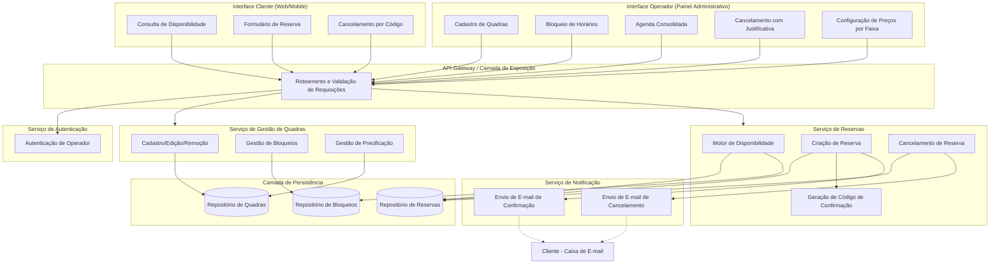
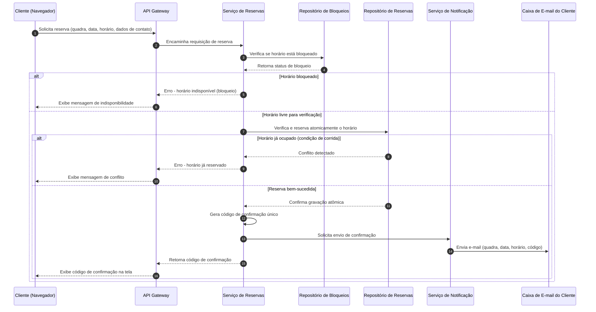
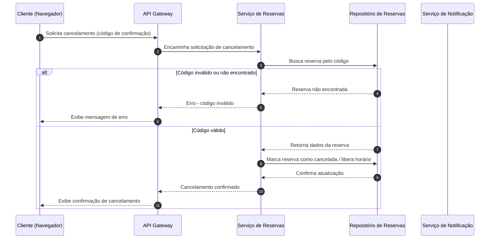

# Relatório Técnico de Arquitetura de Software
## Sistema de Reservas para Quadras Esportivas (P05)

---

## 1. Identificação das HUs

| HU | Título | Perfil | RFs Relacionados | RNFs Relacionados |
|----|--------|--------|-------------------|---------------------|
| HU01 | Cadastrar quadra | Operador | RF01 | RNF07 |
| HU02 | Bloquear horários para manutenção | Operador | RF03 | RNF05 |
| HU03 | Visualizar agenda consolidada | Operador | RF11 | RNF02 |
| HU04 | Cancelar reserva com justificativa | Operador | RF09, RF10 | RNF03 |
| HU05 | Consultar disponibilidade sem cadastro | Cliente | RF04 | RNF01, RNF02, RNF06 |
| HU06 | Realizar reserva | Cliente | RF05, RF06, RF07, RF10 | RNF05 |
| HU07 | Cancelar minha reserva | Cliente | RF08, RF10 | RNF05 |
| (implícita) | Gestão de valores diferenciados | Operador | RF12 | RNF07 |
| (implícita) | Edição/remoção de quadra | Operador | RF02 | RNF07 |

---

## 2. Diagramas de Arquitetura (Mermaid)

### 2.1 Diagrama de Componentes

### 2.2 Diagrama de Sequência — Realizar Reserva (HU06 / RF05-RF07, RF10, RNF05)

### 2.3 Diagrama de Sequência — Cancelamento pelo Cliente (HU07 / RF08)

---

## 3. Decisões de Arquitetura

| # | Decisão | Justificativa | Requisitos Relacionados |
|---|---------|----------------|--------------------------|
| D01 | Separar responsabilidades em serviços conceituais distintos: Gestão de Quadras, Reservas e Notificação | Facilita manutenibilidade e extensão modular para novas modalidades esportivas | RNF07 |
| D02 | A operação de confirmação de reserva deve ocorrer como transação atômica na camada de persistência de reservas | Impede duplo agendamento em concorrência simultânea | RF07, RNF05 |
| D03 | Consulta de disponibilidade não exige autenticação e é servida por rota pública do Gateway | Cliente deve consultar sem login | RF04, HU05 |
| D04 | Área operacional exige autenticação centralizada via componente de Autenticação | Proteger operações administrativas | RNF03 |
| D05 | Geração de código de confirmação deve ser único e determinístico por reserva, gerido pelo próprio Serviço de Reservas | Rastreabilidade e uso posterior para cancelamento | RF06, RF08 |
| D06 | Notificações por e-mail são desacopladas via um serviço dedicado, comunicando-se de forma assíncrona com o Serviço de Reservas | Evita acoplamento forte e falhas de envio bloqueando o fluxo de reserva | RF10 |
| D07 | Bloqueios de horário são tratados como entidade própria, consultada antes da criação de reservas | Permite manutenção/feriados sem impactar modelo de reservas | RF03 |
| D08 | Precificação diferenciada por faixa de horário é responsabilidade do serviço de Gestão de Quadras, consultada no momento da exibição/cálculo de valor | Isola regra de negócio de preço da lógica de disponibilidade | RF12 |
| D09 | Interface do cliente deve ser desenvolvida com abordagem responsiva, sem prescrição de framework específico | Atender RNF01 e RNF06 sem acoplamento tecnológico | RNF01, RNF06 |
| D10 | Carregamento do calendário de disponibilidade deve considerar estratégias de otimização de consulta (ex.: agregação prévia de horários) para cumprir SLA de tempo | Atender RNF02 sem definir tecnologia específica | RNF02 |

---

## 4. Tabela de Componentes e Rastreabilidade

| Componente | Responsabilidade Principal | Comunica-se com | Origem (HU / Critério de Aceite) |
|------------|------------------------------|-------------------|-------------------------------------|
| Interface Cliente (Web/Mobile) | Exibir disponibilidade, formulário de reserva e cancelamento por código | API Gateway | HU05, HU06, HU07 |
| Interface Operador (Painel Administrativo) | Cadastro de quadras, bloqueios, agenda consolidada, cancelamento com justificativa, precificação | API Gateway, Serviço de Autenticação | HU01, HU02, HU03, HU04 |
| API Gateway | Rotear requisições, validar formato e aplicar políticas de acesso público/privado | Todos os serviços | RF04 (público), RNF03 (privado) |
| Serviço de Autenticação | Validar credenciais do operador antes de liberar operações administrativas | API Gateway, Serviço de Gestão de Quadras, Serviço de Reservas | RNF03 |
| Serviço de Gestão de Quadras | Cadastrar, editar, remover quadras; gerenciar bloqueios; configurar preços por faixa | Repositório de Quadras, Repositório de Bloqueios | RF01, RF02, RF03, RF12 / HU01, HU02 |
| Serviço de Reservas | Verificar disponibilidade, criar/cancelar reservas de forma atômica, gerar código de confirmação | Repositório de Reservas, Repositório de Bloqueios, Serviço de Notificação | RF05, RF06, RF07, RF08, RF09, RF11 / HU03, HU04, HU06, HU07 |
| Serviço de Notificação | Enviar e-mails de confirmação e cancelamento de reserva | Serviço de Reservas, Caixa de E-mail do Cliente | RF10 / HU04 (critério: notificação), HU06 (critério: e-mail) |
| Repositório de Quadras | Persistir dados de quadras e configurações de preço | Serviço de Gestão de Quadras | RF01, RF02, RF12 |
| Repositório de Bloqueios | Persistir períodos bloqueados por quadra | Serviço de Gestão de Quadras, Serviço de Reservas | RF03 |
| Repositório de Reservas | Persistir reservas, garantir atomicidade de escrita concorrente | Serviço de Reservas | RF07, RNF05 |

---

## 5. Bloqueios e Pendências

| # | Descrição | Impacto | Responsável Sugerido |
|---|-----------|---------|------------------------|
| B01 | Não há definição de regras de antecedência mínima/máxima para reserva ou cancelamento (ex.: prazo limite antes do horário) | Pode gerar inconsistência operacional e disputas | Equipe de Negócio/Produto |
| B02 | Não há especificação de política de retenção de dados pessoais (nome, e-mail, telefone) do cliente sem cadastro | Impacto em conformidade com privacidade de dados | Equipe Jurídica/Compliance |
| B03 | Ausência de definição sobre reenvio de código de confirmação em caso de cliente perder o e-mail | Pode gerar suporte manual não previsto no fluxo | Equipe de Produto |
| B04 | Não especificado o comportamento em caso de falha no envio do e-mail de confirmação (RF10) — a reserva permanece válida? | Risco de inconsistência entre estado da reserva e notificação | Arquitetura/Dev |
| B05 | RF12 (preços diferenciados) não define como o valor final é comunicado ao cliente antes da confirmação | Pode gerar dúvidas de UX e disputas de cobrança | Equipe de Produto/UX |

---

## 6. Cobertura de Requisitos

| Requisito | Coberto? | Componente(s) Responsável(is) |
|-----------|----------|-------------------------------|
| RF01 | Sim | Serviço de Gestão de Quadras, Interface Operador |
| RF02 | Sim | Serviço de Gestão de Quadras |
| RF03 | Sim | Serviço de Gestão de Quadras, Repositório de Bloqueios |
| RF04 | Sim | API Gateway (rota pública), Interface Cliente |
| RF05 | Sim | Serviço de Reservas, Interface Cliente |
| RF06 | Sim | Serviço de Reservas |
| RF07 | Sim | Serviço de Reservas, Repositório de Reservas |
| RF08 | Sim | Serviço de Reservas, Interface Cliente |
| RF09 | Sim | Serviço de Reservas, Interface Operador |
| RF10 | Sim | Serviço de Notificação |
| RF11 | Sim | Serviço de Reservas (agregação), Interface Operador |
| RF12 | Sim | Serviço de Gestão de Quadras |
| RNF01 | Sim | Interface Cliente (decisão D09) |
| RNF02 | Parcial | Serviço de Reservas / necessidade de estratégia de otimização (D10) |
| RNF03 | Sim | Serviço de Autenticação |
| RNF04 | Não coberto no design lógico | Requer definição de infraestrutura de alta disponibilidade (fora do escopo abstrato) |
| RNF05 | Sim | Repositório de Reservas (transação atômica) |
| RNF06 | Sim | Interface Cliente |
| RNF07 | Sim | Separação modular de serviços (D01) |

---

## 7. Gap Analysis

| # | Lacuna Identificada | Impacto Arquitetural | Ação Recomendada |
|---|------------------------|--------------------------|------------------------|
| G01 | RNF04 (disponibilidade 99%) não possui componente arquitetural definido para redundância/failover | Sem estratégia de resiliência, SLA de disponibilidade não pode ser garantido | Definir estratégia de replicação e recuperação de falhas em fase de infraestrutura, mantendo neutralidade tecnológica |
| G02 | Não há requisito claro de auditoria/histórico de alterações em quadras e bloqueios | Dificulta rastreabilidade de mudanças administrativas | Especificar necessidade (ou não) de log de auditoria com o Product Owner |
| G03 | Ausência de definição sobre limite de tentativas/rate limiting nas consultas públicas (RF04) | Risco de sobrecarga do Motor de Disponibilidade por uso indevido/scraping | Avaliar necessidade de controle de taxa na camada de Gateway |
| G04 | Falta de especificação sobre fuso horário e formato de data/hora para reservas internacionais ou multi-região | Risco de inconsistência em ambientes com múltiplas unidades | Confirmar escopo geográfico do sistema com stakeholders |
| G05 | Não há requisito sobre relatórios financeiros/consolidação de faturamento por período, apesar de existir precificação (RF12) | Pode ser esperado futuramente, impactando modelo de dados de reservas | Levantar com stakeholders se há necessidade de módulo financeiro/relatórios |
| G06 | Ausência de definição para múltiplos operadores com diferentes níveis de permissão (ex.: admin vs. operador comum) | Modelo de autenticação atual assume perfil único de "operador" | Esclarecer se há hierarquia de papéis necessária |
| G07 | Não há critério de aceite sobre o que ocorre se o e-mail do cliente for inválido no momento da reserva (RF05/RF10) | Pode gerar reservas "silenciosas" sem confirmação recebida | Definir validação de formato de e-mail e fluxo de erro correspondente |