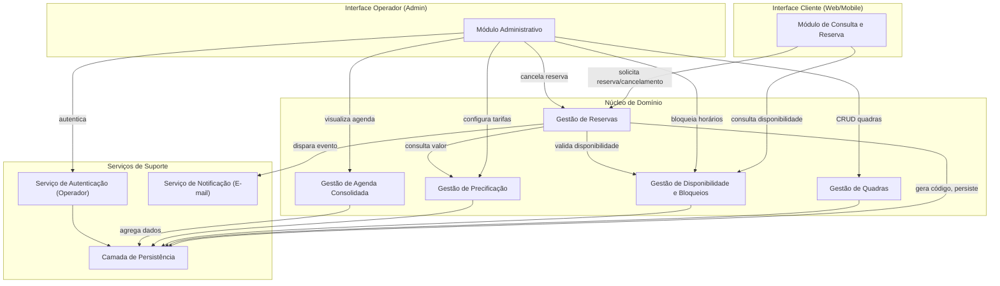
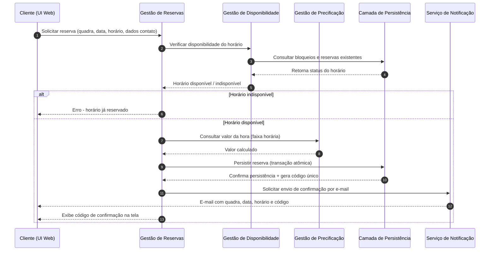
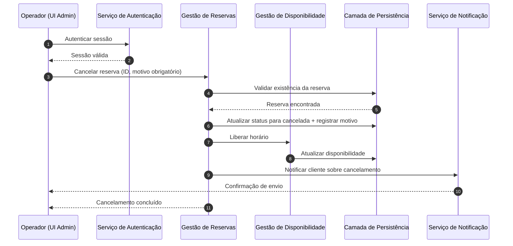

# Relatório Técnico de Arquitetura de Software
## Sistema de Reservas para Quadras Esportivas (P05)

---

## 1. Identificação das HUs

| ID | Título | Perfil | RFs Relacionados | RNFs Relacionados |
|----|--------|--------|-------------------|---------------------|
| HU01 | Cadastrar quadra | Operador | RF01 | RNF03, RNF07 |
| HU02 | Bloquear horários para manutenção | Operador | RF03 | RNF03 |
| HU03 | Visualizar agenda consolidada | Operador | RF11 | RNF02, RNF03 |
| HU04 | Cancelar reserva com justificativa | Operador | RF09, RF10 | RNF03, RNF05 |
| HU05 | Consultar disponibilidade sem cadastro | Cliente | RF04 | RNF01, RNF02, RNF06 |
| HU06 | Realizar reserva | Cliente | RF05, RF06, RF07, RF10 | RNF05, RNF01 |
| HU07 | Cancelar minha reserva | Cliente | RF08 | RNF05 |

Requisitos não vinculados diretamente a nenhuma HU explícita, mas cobertos transversalmente pelos componentes: RF02 (edição/remoção de quadra — extensão natural de HU01), RF12 (precificação por faixa horária — extensão de HU01/gestão de quadras).

---

## 2. Diagramas de Arquitetura (Mermaid)

### 2.1 Diagrama de Componentes (Visão Geral)

### 2.2 Diagrama de Sequência — Realizar Reserva (HU06 / RF05-RF07-RF10)

### 2.3 Diagrama de Sequência — Cancelamento por Operador (HU04 / RF09-RF10)

---

## 3. Decisões de Arquitetura

| Decisão | Justificativa | Requisitos Relacionados |
|---------|----------------|---------------------------|
| Separação entre interface do cliente (pública, sem autenticação) e interface do operador (autenticada) | RF04 exige acesso sem login; RNF03 exige proteção da área administrativa | RF04, RNF03 |
| Módulo de Gestão de Disponibilidade desacoplado da Gestão de Reservas | Permite reutilizar lógica de disponibilidade tanto na consulta pública quanto na validação de reserva, e isolar regras de bloqueio (RF03) | RF04, RF07, HU02, HU05 |
| Operação de confirmação de reserva tratada como transação atômica na camada de persistência | RNF05 exige impedir duplo agendamento em concorrência | RF07, RNF05 |
| Geração de código de confirmação como responsabilidade exclusiva do módulo de Gestão de Reservas | Centraliza unicidade e rastreabilidade (RF06) | RF06, RF08 |
| Serviço de Notificação desacoplado via disparo assíncrono de eventos | Evita acoplamento direto entre fluxo de reserva/cancelamento e envio de e-mail, aumentando resiliência | RF10, HU04 |
| Módulo de Precificação isolado da Gestão de Quadras | RF12 introduz variação de preço por faixa horária, que pode evoluir independentemente do cadastro básico da quadra | RF01, RF12 |
| Arquitetura modular por domínio (quadras, disponibilidade, reservas, precificação, agenda) | RNF07 exige facilidade de inclusão de novas modalidades esportivas sem afetar demais módulos | RNF07 |
| Interface responsiva única adaptável a múltiplos dispositivos, sem prescrição de tecnologia | RNF01, RNF06 | RNF01, RNF06 |
| Não especificação de mecanismo de autenticação concreto, apenas contrato de serviço de autenticação | Neutralidade tecnológica exigida; RNF03 apenas exige proteção | RNF03 |

---

## 4. Tabela de Componentes e Rastreabilidade

| Componente | Responsabilidade Principal | Comunica-se com | Origem (HU / Critério de Aceite) |
|------------|------------------------------|-------------------|-------------------------------------|
| Módulo de Consulta e Reserva (UI Cliente) | Exibir disponibilidade e permitir reserva/cancelamento sem login | Gestão de Disponibilidade, Gestão de Reservas | HU05, HU06, HU07; RF04, RF05, RF08 |
| Módulo Administrativo (UI Operador) | Prover interface autenticada para gestão de quadras, bloqueios, agenda e cancelamentos | Serviço de Autenticação, Gestão de Quadras, Gestão de Disponibilidade, Gestão de Reservas, Gestão de Agenda, Gestão de Precificação | HU01, HU02, HU03, HU04; RF01-RF03, RF09, RF11, RF12 |
| Gestão de Quadras | Cadastrar, editar e remover quadras (nome, tipo, horário, valor) | Camada de Persistência | HU01 (RF01, RF02) — critério: campos obrigatórios, listagem imediata |
| Gestão de Disponibilidade e Bloqueios | Calcular horários livres, aplicar bloqueios de manutenção/feriado | Camada de Persistência, Gestão de Reservas | HU02, HU05 (RF03, RF04) — critério: bloqueios ocultos ao cliente |
| Gestão de Reservas | Orquestrar criação, validação e cancelamento de reservas; gerar código único | Gestão de Disponibilidade, Gestão de Precificação, Camada de Persistência, Serviço de Notificação | HU04, HU06, HU07 (RF05-RF10) |
| Gestão de Precificação | Calcular valor da reserva conforme faixa horária configurada | Camada de Persistência, Gestão de Reservas | HU01 extensão (RF12) |
| Gestão de Agenda Consolidada | Agregar visão diária de todas as quadras e status de ocupação | Camada de Persistência | HU03 (RF11) — critério: navegação entre datas |
| Serviço de Autenticação | Validar credenciais e sessão do operador | Camada de Persistência, Módulo Administrativo | RNF03 |
| Serviço de Notificação | Enviar e-mails de confirmação e cancelamento | Gestão de Reservas | HU04, HU06 (RF10) |
| Camada de Persistência | Armazenar de forma consistente e atômica quadras, reservas, bloqueios e tarifas | Todos os módulos de domínio | RNF05 (transversal) |

---

## 5. Bloqueios e Pendências

1. **Definição de canal de notificação alternativo**: os requisitos mencionam apenas e-mail (RF10); não há especificação sobre notificações via SMS/push, o que pode ser necessário para engajamento.
2. **Política de retenção de dados do cliente**: não há requisito sobre tempo de armazenamento de dados pessoais (nome, e-mail, telefone) coletados sem cadastro formal — pendente de definição para conformidade com privacidade.
3. **Definição de regras de reembolso/multa por cancelamento**: RF09 menciona motivo de cancelamento, mas não trata de eventuais cobranças ou políticas financeiras associadas.
4. **Ausência de especificação de papéis dentro do perfil "operador"**: não há distinção entre múltiplos operadores ou níveis de permissão (ex.: operador master vs. operador comum).
5. **Concorrência em bloqueios simultâneos com reservas**: não está definido o comportamento caso um operador bloqueie um horário no exato momento em que um cliente está confirmando uma reserva — requer definição de prioridade/lock.
6. **Formato do código de confirmação**: não há requisito sobre estrutura, tamanho ou validade temporal do código gerado (RF06).

---

## 6. Cobertura de Requisitos

| Requisito | Coberto? | Componente(s) Responsável(is) |
|-----------|----------|-------------------------------|
| RF01 | Sim | Gestão de Quadras |
| RF02 | Sim | Gestão de Quadras |
| RF03 | Sim | Gestão de Disponibilidade e Bloqueios |
| RF04 | Sim | Gestão de Disponibilidade e Bloqueios, UI Cliente |
| RF05 | Sim | Gestão de Reservas, UI Cliente |
| RF06 | Sim | Gestão de Reservas |
| RF07 | Sim | Gestão de Reservas, Gestão de Disponibilidade |
| RF08 | Sim | Gestão de Reservas, UI Cliente |
| RF09 | Sim | Gestão de Reservas, UI Operador |
| RF10 | Sim | Serviço de Notificação, Gestão de Reservas |
| RF11 | Sim | Gestão de Agenda Consolidada |
| RF12 | Sim | Gestão de Precificação |
| RNF01 | Sim | UI Cliente (responsividade — decisão arquitetural, não implementação) |
| RNF02 | Sim | Gestão de Disponibilidade (design orientado a resposta rápida) |
| RNF03 | Sim | Serviço de Autenticação |
| RNF04 | Parcial | Não há componente dedicado de monitoramento/alta disponibilidade explícito — depende de infraestrutura de implantação (fora do escopo do design lógico) |
| RNF05 | Sim | Camada de Persistência (transação atômica), Gestão de Reservas |
| RNF06 | Parcial | Depende de decisões de implementação de front-end não detalhadas nesta arquitetura conceitual |
| RNF07 | Sim | Arquitetura modular por domínio |

---

## 7. Gap Analysis

| Gap Identificado | Impacto Arquitetural | Ação Recomendada |
|-------------------|------------------------|----------------------|
| Ausência de definição sobre concorrência entre bloqueio de operador e reserva de cliente em andamento | Risco de inconsistência de estado ou violação de RNF05 | Especificar política de precedência (ex.: lock otimista/pessimista) na Gestão de Disponibilidade antes da implementação |
| RNF04 (disponibilidade 99%) sem componente arquitetural correspondente no design lógico | A arquitetura de domínio não trata de redundância/infraestrutura | Tratar em documento de arquitetura de implantação (fora do escopo deste relatório lógico), definindo estratégia de replicação e monitoramento |
| Falta de requisito sobre expiração de reservas não confirmadas/pendentes | Pode gerar acúmulo de estados intermediários inconsistentes | Definir com stakeholders se existe estado "pendente" antes da confirmação e prazo de expiração |
| Ausência de detalhamento sobre auditoria de ações do operador (cadastro, edição, cancelamento) | Dificulta rastreabilidade para fins de suporte e conformidade | Avaliar necessidade de um componente de Log de Auditoria transversal |
| Não há requisito sobre limite de tentativas de cancelamento com código inválido (RF08) | Possível vetor de abuso (força bruta sobre códigos) | Definir requisito de segurança complementar (rate limiting) para o endpoint de cancelamento |
| RF12 (faixas de horário) não detalha se a alteração de tarifa afeta reservas já existentes | Ambiguidade de regra de negócio pode gerar inconsistência de cobrança | Esclarecer com stakeholders se o valor é fixado no momento da reserva (recomendado) ou recalculado dinamicamente |
| Ausência de requisito sobre idioma/localização | Pode impactar formato de datas/horários e comunicação por e-mail | Confirmar escopo de internacionalização com stakeholders, se aplicável |