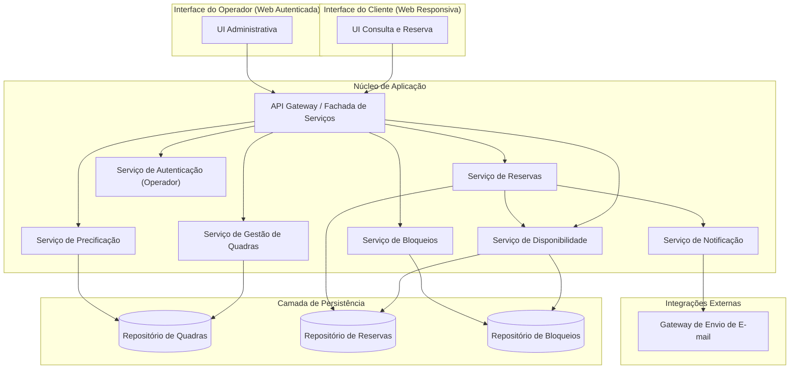
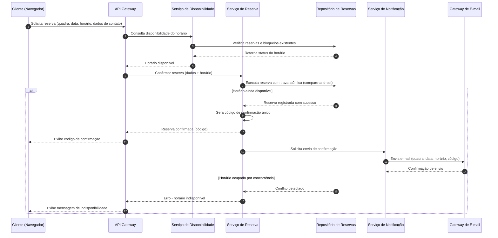
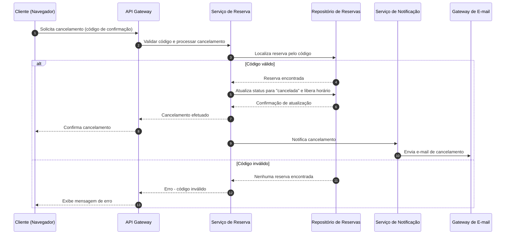

# Relatório Técnico de Arquitetura de Software

## 1. Identificação das HUs

| HU   | Título                                   | Perfil    | RFs Relacionados       | RNFs Relacionados      |
|------|-------------------------------------------|-----------|-------------------------|--------------------------|
| HU01 | Cadastrar quadra                          | Operador  | RF01                    | RNF07                    |
| HU02 | Bloquear horários para manutenção         | Operador  | RF03                    | RNF07                    |
| HU03 | Visualizar agenda consolidada             | Operador  | RF11                    | RNF02                    |
| HU04 | Cancelar reserva com justificativa        | Operador  | RF09, RF10              | RNF05                    |
| HU05 | Consultar disponibilidade sem cadastro    | Cliente   | RF04                    | RNF01, RNF02, RNF06      |
| HU06 | Realizar reserva                          | Cliente   | RF05, RF06, RF07, RF10  | RNF05                    |
| HU07 | Cancelar minha reserva                    | Cliente   | RF08                    | RNF05                    |

Requisitos não diretamente cobertos por HU explícita, mas suportados pela arquitetura:
- RF02 (editar/remover quadra) — extensão natural de HU01.
- RF12 (valores diferenciados por faixa horária) — extensão de HU01/gestão de quadras.
- RNF03 (autenticação do operador) — pré-requisito transversal a todas as HUs de Operador.
- RNF04 (disponibilidade 24/7) — requisito não funcional de infraestrutura, tratado na Seção 3.

---

## 2. Diagramas de Arquitetura (Mermaid)

### 2.1 Diagrama de Componentes (Visão Geral)

### 2.2 Diagrama de Sequência — Realizar Reserva (HU06 / RF05-RF07, RNF05)

### 2.3 Diagrama de Sequência — Cancelamento pelo Cliente (HU07 / RF08)

---

## 3. Decisões de Arquitetura

| Decisão | Justificativa |
|---|---|
| **Separação entre Serviço de Disponibilidade e Serviço de Reserva** | Permite consulta pública sem autenticação (RF04/HU05) desacoplada da lógica transacional de confirmação, reduzindo acoplamento e superfície de risco. |
| **Mecanismo de confirmação atômica na camada de persistência (compare-and-set / lock otimista)** | Atende RNF05, garantindo que requisições concorrentes para o mesmo horário não gerem duplo agendamento. |
| **Autenticação isolada em serviço dedicado (Serviço de Autenticação)** | Atende RNF03, mantendo a área operacional protegida sem impactar o fluxo público do cliente. |
| **Modularização por domínio (Quadras, Bloqueios, Reservas, Precificação, Notificação)** | Atende RNF07 (manutenibilidade), permitindo adicionar novas modalidades esportivas sem impacto nos demais módulos. |
| **API Gateway como fachada única** | Centraliza roteamento, permite políticas de segurança e desempenho (cache do calendário) de forma transversal, atendendo RNF02. |
| **Serviço de Notificação assíncrono/desacoplado** | Evita que falhas ou lentidão no envio de e-mail bloqueiem a confirmação da reserva ao cliente (RF10, HU06). |
| **Repositórios especializados por agregado (Quadra, Reserva, Bloqueio)** | Facilita consistência transacional local e evolução independente dos modelos de dados, sem prescrever tecnologia de persistência. |
| **Disponibilidade calculada combinando Reservas + Bloqueios** | RF03/RF07 exigem que horários bloqueados e reservados sejam tratados de forma unificada na visão de disponibilidade. |

---

## 4. Tabela de Componentes e Rastreabilidade

| Componente | Responsabilidade Principal | Comunica-se com | Origem (HU / Critério de Aceite) |
|---|---|---|---|
| UI Cliente | Exibir disponibilidade e permitir reserva/cancelamento sem login | API Gateway | HU05, HU06, HU07 |
| UI Operador | Gestão de quadras, bloqueios, agenda e cancelamentos | API Gateway, Serviço de Autenticação | HU01, HU02, HU03, HU04 |
| API Gateway | Rotear requisições, aplicar políticas de segurança e desempenho | Todos os serviços de núcleo | RNF02, RNF03 |
| Serviço de Autenticação | Validar credenciais e sessões do operador | API Gateway | RNF03 |
| Serviço de Gestão de Quadras | Cadastrar, editar, remover quadras | Repositório de Quadras | RF01, RF02, HU01 |
| Serviço de Precificação | Configurar valores por faixa de horário | Repositório de Quadras | RF12 |
| Serviço de Bloqueios | Criar/remover bloqueios de horário | Repositório de Bloqueios | RF03, HU02 |
| Serviço de Disponibilidade | Consolidar horários livres/ocupados por quadra e data | Repositório de Reservas, Repositório de Bloqueios | RF04, RF11, HU03, HU05 |
| Serviço de Reserva | Validar, confirmar, gerar código, cancelar reservas | Repositório de Reservas, Serviço de Disponibilidade, Serviço de Notificação | RF05, RF06, RF07, RF08, RF09, RNF05, HU06, HU07, HU04 |
| Serviço de Notificação | Disparar e-mails de confirmação e cancelamento | Gateway de E-mail | RF10, HU04, HU06, HU07 |
| Repositório de Quadras | Persistir dados cadastrais de quadras | Serviço de Gestão de Quadras, Serviço de Precificação | RF01, RF02, RF12 |
| Repositório de Reservas | Persistir reservas com garantia de atomicidade | Serviço de Reserva, Serviço de Disponibilidade | RF06, RF07, RNF05 |
| Repositório de Bloqueios | Persistir bloqueios de horário | Serviço de Bloqueios, Serviço de Disponibilidade | RF03 |
| Gateway de E-mail | Enviar mensagens de confirmação/cancelamento | Serviço de Notificação | RF10, HU04 |

---

## 5. Bloqueios e Pendências

| # | Descrição do Bloqueio/Pendência | Impacto |
|---|---|---|
| 1 | Não há definição de política de retenção/expiração de reservas não confirmadas ou pendentes de pagamento (se houver etapa de pagamento futura). | Pode afetar o modelo de estados da reserva. |
| 2 | Não está especificado se o cancelamento pelo operador (RF09) exige notificação também ao operador responsável ou apenas ao cliente. | Impacta desenho do Serviço de Notificação. |
| 3 | Ausência de critérios de auditoria/log de ações administrativas (quem cadastrou, editou, bloqueou). | Relevante para rastreabilidade e RNF03. |
| 4 | Não há definição de fuso horário e formato de data padrão para múltiplas quadras/regiões. | Pode gerar inconsistência na camada de Disponibilidade. |
| 5 | Ausência de regra sobre limite de antecedência mínima/máxima para reservas e cancelamentos. | Impacta validações do Serviço de Reserva. |

---

## 6. Cobertura de Requisitos

| Requisito | Coberto? | Componente(s) Responsável(is) |
|---|---|---|
| RF01 | Sim | Serviço de Gestão de Quadras |
| RF02 | Sim | Serviço de Gestão de Quadras |
| RF03 | Sim | Serviço de Bloqueios |
| RF04 | Sim | Serviço de Disponibilidade, UI Cliente |
| RF05 | Sim | Serviço de Reserva |
| RF06 | Sim | Serviço de Reserva |
| RF07 | Sim | Serviço de Reserva + Repositório de Reservas (atomicidade) |
| RF08 | Sim | Serviço de Reserva |
| RF09 | Sim | Serviço de Reserva, UI Operador |
| RF10 | Sim | Serviço de Notificação, Gateway de E-mail |
| RF11 | Sim | Serviço de Disponibilidade, UI Operador |
| RF12 | Sim | Serviço de Precificação |
| RNF01 | Sim | UI Cliente (responsividade) |
| RNF02 | Sim | API Gateway (cache/desempenho), Serviço de Disponibilidade |
| RNF03 | Sim | Serviço de Autenticação |
| RNF04 | Parcial | Requisito de infraestrutura — arquitetura lógica suporta, mas SLA depende de decisão de implantação (fora do escopo deste design) |
| RNF05 | Sim | Repositório de Reservas (transação atômica), Serviço de Reserva |
| RNF06 | Parcial | Depende de implementação de front-end — não detalhado neste nível arquitetural |
| RNF07 | Sim | Modularização por domínio de serviços |

---

## 7. Gap Analysis

| Gap Identificado | Impacto Arquitetural | Ação Recomendada |
|---|---|---|
| Falta de definição de SLA técnico para RNF04 (99% de disponibilidade) | Arquitetura lógica não determina redundância ou estratégia de failover | Definir com o time de infraestrutura estratégia de alta disponibilidade e monitoramento |
| Ausência de regra de concorrência explícita além do bloqueio de horário (ex.: múltiplas quadras reservadas pelo mesmo cliente no mesmo horário) | Pode gerar inconsistências de regra de negócio não cobertas pelo modelo atual | Especificar com stakeholders se há restrição de "1 reserva por cliente por horário" |
| Não há especificação de formato/estrutura do código de confirmação (RF06) | Pode gerar ambiguidade na geração/validação do código | Definir formato (ex.: alfanumérico, tamanho, unicidade global vs. por quadra) |
| Falta de detalhamento sobre falhas no envio de e-mail (RF10) | Reserva pode ser confirmada sem que o cliente receba o comprovante | Definir estratégia de reenvio/fila de notificação e fallback (ex.: exibição do código na tela já mitigada em HU06) |
| Ausência de requisito sobre relatórios/histórico de reservas para o operador | Pode ser necessidade implícita de negócio não coberta | Validar com stakeholders se há necessidade de módulo de relatórios/analytics |
| Não há menção a política de dados pessoais (LGPD) para dados de cliente (nome, e-mail, telefone) | Risco de conformidade legal não tratado no design | Incluir requisito de privacidade/retenção de dados em iteração futura |
| RNF06 (compatibilidade com navegadores) não possui critérios de aceite mensuráveis | Dificulta validação objetiva em testes | Especificar lista mínima de navegadores/versões suportados |