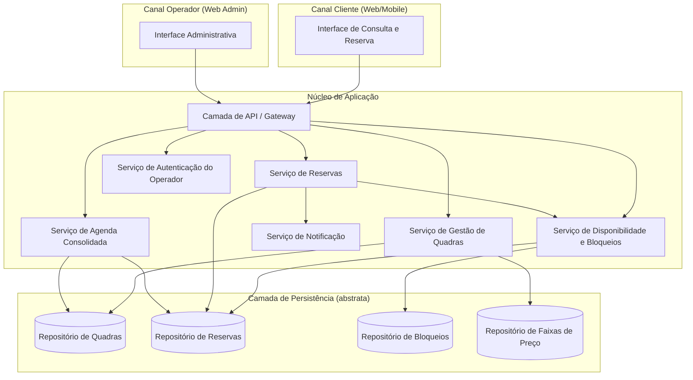
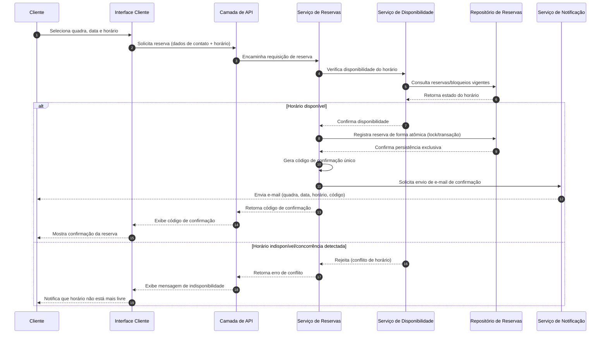
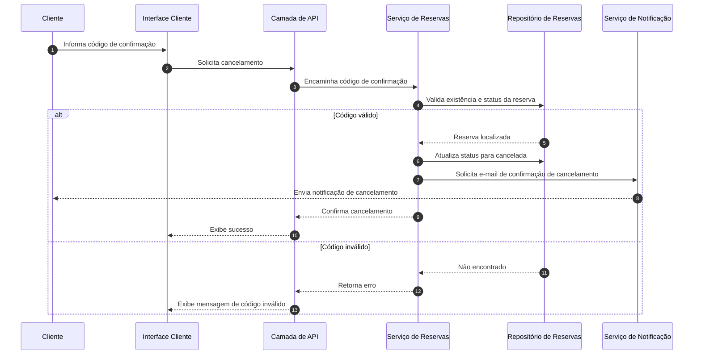

# Relatório Técnico de Arquitetura de Software

## 1. Identificação das HUs

| HU | Perfil | Descrição resumida | RF relacionados | RNF relacionados |
|----|--------|---------------------|------------------|-------------------|
| HU01 | Operador | Cadastrar quadra | RF01 | RNF07 |
| HU02 | Operador | Bloquear horários para manutenção | RF03 | RNF05 |
| HU03 | Operador | Visualizar agenda consolidada | RF11 | RNF02 |
| HU04 | Operador | Cancelar reserva com justificativa | RF09, RF10 | RNF05 |
| HU05 | Cliente | Consultar disponibilidade sem cadastro | RF04 | RNF01, RNF02, RNF06 |
| HU06 | Cliente | Realizar reserva | RF05, RF06, RF07, RF10 | RNF05 |
| HU07 | Cliente | Cancelar minha reserva | RF08 | RNF05 |

RFs sem HU explícita associada: RF02 (edição/remoção de quadra — extensão natural de HU01), RF12 (valores diferenciados por faixa de horário — extensão de HU01/gestão de quadra).

---

## 2. Diagramas de Arquitetura (Mermaid)

### 2.1 Diagrama de Componentes (visão geral do sistema)

### 2.2 Diagrama de Sequência — Realizar Reserva (HU06 / RF05, RF06, RF07, RNF05)

### 2.3 Diagrama de Sequência — Cancelamento pelo Cliente (HU07 / RF08)

---

## 3. Decisões de Arquitetura

| Decisão | Justificativa |
|---------|----------------|
| Separação entre Serviço de Disponibilidade e Serviço de Reservas | Permite reutilizar a lógica de checagem de horários livres tanto na consulta pública (RF04, HU05) quanto na validação de reserva (RF07, RNF05), mantendo coesão. |
| Persistência abstrata via Repositórios | Evita acoplamento a tecnologia específica de armazenamento, preservando neutralidade tecnológica exigida. |
| Confirmação de reserva como operação atômica | Atende RNF05, evitando duplo agendamento em concorrência; requer mecanismo de exclusão mútua/transação na camada de persistência (a ser detalhado na fase de design detalhado). |
| Serviço de Notificação desacoplado (assíncrono) | Evita que falhas no envio de e-mail bloqueiem a confirmação da reserva; permite reuso para confirmações e cancelamentos (RF10, HU04). |
| Autenticação restrita à área do operador | Atende RNF03 e RF04 (cliente não precisa de login), segregando responsabilidades de segurança por perfil de acesso. |
| Modularização por domínio funcional (Quadra, Reserva, Disponibilidade, Agenda, Precificação) | Atende RNF07, facilitando inclusão de novas modalidades esportivas sem impacto nos demais módulos. |
| Serviço de Agenda Consolidada como leitura derivada | HU03/RF11 não introduzem novo estado, apenas agregam dados de Quadra e Reserva, evitando duplicação de fonte de verdade. |
| Precificação por faixa de horário como sub-domínio da Gestão de Quadras | RF12 é tratado como extensão do cadastro de quadra, não como serviço independente, reduzindo complexidade desnecessária. |

---

## 4. Tabela de Componentes e Rastreabilidade

| Componente | Responsabilidade Principal | Comunica-se com | Origem (HU / Critério de Aceite) |
|------------|------------------------------|-------------------|-------------------------------------|
| Interface Cliente (UI_Cliente) | Exibir disponibilidade, capturar dados de reserva e cancelamento, ser responsiva | Camada de API | HU05, HU06, HU07 / RNF01, RNF02, RNF06 |
| Interface Administrativa (UI_Operador) | Cadastro de quadras, bloqueios, agenda consolidada, cancelamento com motivo | Camada de API | HU01, HU02, HU03, HU04 / RNF03 |
| Camada de API / Gateway | Roteamento de requisições, validação de entrada, orquestração de chamadas | Todos os serviços | Transversal a todas as HUs |
| Serviço de Autenticação do Operador | Autenticar e autorizar acesso à área administrativa | Camada de API | RNF03 |
| Serviço de Gestão de Quadras | Cadastro, edição, remoção de quadras e faixas de valor | Repositório de Quadras, Repositório de Precificação | HU01 / RF01, RF02, RF12 |
| Serviço de Disponibilidade e Bloqueios | Calcular horários livres considerando reservas e bloqueios | Repositório de Bloqueios, Repositório de Reservas, Serviço de Reservas | HU02, HU05 / RF03, RF04, RF07 |
| Serviço de Reservas | Criar, validar, cancelar reservas; gerar código de confirmação; garantir atomicidade | Repositório de Reservas, Serviço de Disponibilidade, Serviço de Notificação | HU06, HU07, HU04 / RF05, RF06, RF07, RF08, RF09, RNF05 |
| Serviço de Notificação | Enviar e-mails de confirmação e cancelamento | Cliente (canal externo de e-mail) | HU06, HU04 / RF10 |
| Serviço de Agenda Consolidada | Agregar visão diária de todas as quadras e seus status | Repositório de Reservas, Repositório de Quadras | HU03 / RF11 |
| Repositório de Quadras | Persistir dados cadastrais de quadras | Serviço de Gestão de Quadras, Serviço de Agenda Consolidada | RF01, RF02 |
| Repositório de Reservas | Persistir reservas e seus estados (ativa/cancelada) | Serviço de Reservas, Serviço de Disponibilidade, Serviço de Agenda Consolidada | RF06, RF07, RF08, RF09 |
| Repositório de Bloqueios | Persistir períodos bloqueados por quadra | Serviço de Disponibilidade | RF03 |
| Repositório de Faixas de Preço | Persistir valores diferenciados por horário | Serviço de Gestão de Quadras | RF12 |

---

## 5. Bloqueios e Pendências

| Item | Descrição | Impacto |
|------|-----------|---------|
| Mecanismo de exclusão mútua para atomicidade (RNF05) | Requisitos não especificam estratégia de concorrência (lock otimista/pessimista, fila serializada); necessário detalhamento técnico posterior. | Alto — afeta integridade de dados críticos. |
| Formato e validade do código de confirmação (RF06) | Não há definição de tamanho, expiração ou reutilização do código. | Médio — impacta segurança e usabilidade. |
| Política de retenção de dados do cliente | RF05/RF06 coletam dados pessoais sem menção a LGPD/retenção. | Médio — pendência de compliance. |
| Regras de conflito entre faixas de horário nobre e bloqueios (RF03 vs RF12) | Não especificado comportamento quando faixa de preço coincide com bloqueio. | Baixo/Médio — necessita regra de negócio explícita. |
| Definição de "principais navegadores modernos" (RNF06) | Ausência de lista objetiva de navegadores/versões suportados. | Baixo — impacta critérios de teste de compatibilidade. |
| Processo de reenvio de e-mail em caso de falha (RF10) | Não há especificação de reprocessamento/retentativa. | Médio — pode gerar reservas sem confirmação recebida pelo cliente. |

---

## 6. Cobertura de Requisitos

| Requisito | Coberto? | Componente(s) Responsável(is) |
|-----------|----------|-------------------------------|
| RF01 | Sim | Serviço de Gestão de Quadras |
| RF02 | Sim | Serviço de Gestão de Quadras |
| RF03 | Sim | Serviço de Disponibilidade e Bloqueios |
| RF04 | Sim | Serviço de Disponibilidade e Bloqueios, UI Cliente |
| RF05 | Sim | Serviço de Reservas, UI Cliente |
| RF06 | Sim | Serviço de Reservas |
| RF07 | Sim | Serviço de Reservas + Disponibilidade |
| RF08 | Sim | Serviço de Reservas |
| RF09 | Sim | Serviço de Reservas, UI Operador |
| RF10 | Sim | Serviço de Notificação |
| RF11 | Sim | Serviço de Agenda Consolidada |
| RF12 | Sim | Serviço de Gestão de Quadras, Repositório de Precificação |
| RNF01 | Sim | UI Cliente (responsividade) |
| RNF02 | Parcial | Serviço de Disponibilidade — depende de estratégia de cache/otimização não detalhada |
| RNF03 | Sim | Serviço de Autenticação do Operador |
| RNF04 | Parcial | Arquitetura geral — depende de estratégia de redundância não detalhada nos requisitos |
| RNF05 | Sim (conceitual) | Serviço de Reservas — mecanismo concreto pendente (ver Seção 5) |
| RNF06 | Parcial | UI Cliente — critério objetivo de navegadores pendente |
| RNF07 | Sim | Modularização por domínio (Seção 3) |

---

## 7. Gap Analysis

| Gap Identificado | Impacto Arquitetural | Ação Recomendada |
|-------------------|------------------------|----------------------|
| Ausência de estratégia explícita de concorrência para RNF05 | Risco de duplo agendamento em picos de acesso simultâneo | Definir em fase de design detalhado o mecanismo de controle transacional/exclusão mútua na camada de persistência |
| Falta de especificação de SLA de disponibilidade (RNF04) além do percentual | Dificulta dimensionamento de redundância e recuperação de falhas | Levantar com stakeholders requisitos de failover e tempo de recuperação (RTO/RPO) |
| Ausência de requisitos sobre auditoria/histórico de alterações em quadras e reservas | Impacta rastreabilidade operacional e suporte a disputas com clientes | Avaliar necessidade de módulo de auditoria/log de eventos |
| Não há definição de regras para múltiplos operadores/permissões (perfis dentro do operador) | Modelo de autenticação atual assume perfil único "operador" | Esclarecer com stakeholders se há hierarquia de permissões (ex.: gerente vs atendente) |
| RF12 (faixas de horário nobre) não define como isso reflete no fluxo de reserva do cliente (exibição de preço) | Pode gerar inconsistência entre disponibilidade e precificação exibida | Especificar integração entre Serviço de Disponibilidade e Repositório de Precificação na exibição ao cliente |
| Ausência de requisito sobre limite de reservas simultâneas por cliente (anti-abuso) | Risco de uso indevido do sistema sem autenticação (RF04/RF05) | Avaliar necessidade de controle de taxa (rate limiting) ou validação adicional por e-mail/telefone |
| Falta de definição sobre fuso horário e formato de data/hora para operação 24/7 (RNF04) | Pode gerar ambiguidade em reservas próximas à meia-noite ou mudanças de horário | Definir padrão de referência temporal único para todo o sistema |