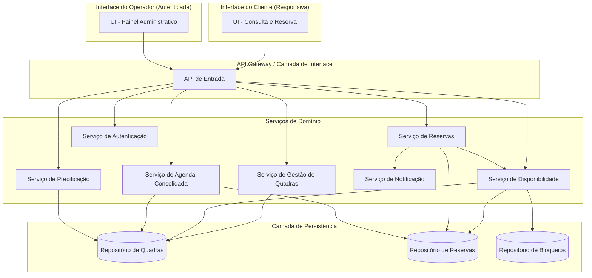
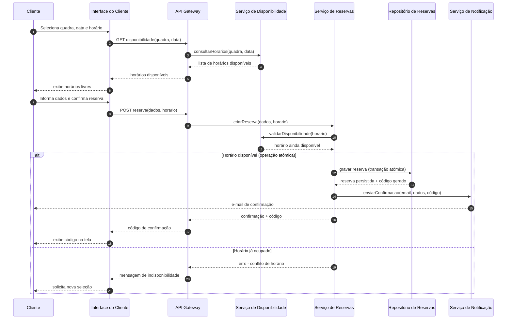
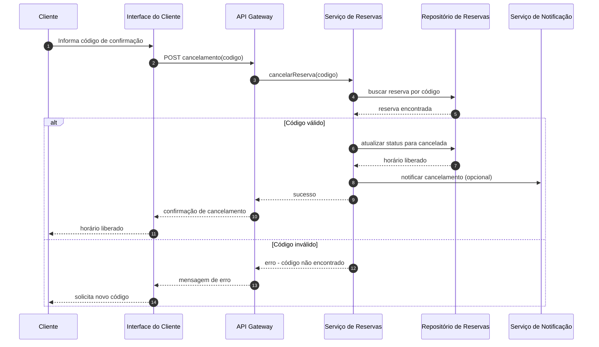

# Relatório Técnico de Arquitetura de Software
## Sistema de Reservas para Quadras Esportivas (P05)

## 1. Identificação das HUs

| HU | Título | Perfil | Requisitos Relacionados |
|----|--------|--------|--------------------------|
| HU01 | Cadastrar quadra | Operador | RF01, RNF03 |
| HU02 | Bloquear horários para manutenção | Operador | RF03, RNF03 |
| HU03 | Visualizar agenda consolidada | Operador | RF11, RNF03 |
| HU04 | Cancelar reserva com justificativa | Operador | RF09, RF10, RNF03 |
| HU05 | Consultar disponibilidade sem cadastro | Cliente | RF04, RNF01, RNF02 |
| HU06 | Realizar reserva | Cliente | RF05, RF06, RF07, RF10, RNF05 |
| HU07 | Cancelar minha reserva | Cliente | RF08, RF10, RNF05 |

*Nota: HU implícitas não numeradas explicitamente, mas cobertas pelos RFs: edição/remoção de quadra (RF02) e configuração de preços diferenciados (RF12) — tratadas como extensões de HU01.*

---

## 2. Diagramas de Arquitetura (Mermaid)

### 2.1 Diagrama de Componentes (Visão Geral do Sistema)

### 2.2 Diagrama de Sequência — Realizar Reserva (HU06, RF05-RF07, RNF05)

### 2.3 Diagrama de Sequência — Cancelamento pelo Cliente (HU07, RF08)

---

## 3. Decisões de Arquitetura

| # | Decisão | Justificativa |
|---|---------|----------------|
| D01 | Separação de interfaces Cliente (pública) e Operador (autenticada) | RF04 exige acesso sem login; RNF03 exige proteção da área administrativa |
| D02 | Serviço de Disponibilidade desacoplado do Serviço de Reservas | Permite consulta rápida (RNF02) sem impactar transações de escrita |
| D03 | Operação de confirmação de reserva deve ser atômica/transacional | Atende diretamente RNF05, evitando duplo agendamento |
| D04 | Geração de código de confirmação centralizada no Serviço de Reservas | Garante unicidade (RF06) e rastreabilidade do ciclo de vida da reserva |
| D05 | Serviço de Notificação assíncrono, desacoplado do fluxo transacional principal | Evita que falhas de envio de e-mail bloqueiem a confirmação da reserva |
| D06 | Arquitetura modular por domínio (Quadras, Disponibilidade, Reservas, Agenda, Precificação) | Atende RNF07 (manutenibilidade e extensão para novas modalidades) |
| D07 | Autenticação como serviço transversal consultado pela API Gateway | Centraliza controle de acesso administrativo (RNF03) |
| D08 | Bloqueios de horário tratados como entidade própria, consultada pelo Serviço de Disponibilidade | Permite manutenção/feriados sem afetar o modelo de reservas (RF03) |
| D09 | Regras de precificação isoladas em serviço próprio | Permite evolução de faixas de horário (RF12) sem acoplar ao núcleo de reservas |
| D10 | Interface do cliente projetada como aplicação responsiva única | Atende RNF01 e RNF06 sem prescrever tecnologia específica |

---

## 4. Tabela de Componentes e Rastreabilidade

| Componente | Responsabilidade Principal | Comunica-se com | Origem (HU / Critério de Aceite) |
|------------|------------------------------|------------------|-------------------------------------|
| Interface do Cliente | Exibir disponibilidade, capturar dados de reserva e cancelamento, responsiva | API Gateway | HU05, HU06, HU07 / RNF01, RNF02, RNF06 |
| Interface do Operador | Gestão de quadras, bloqueios, agenda e cancelamentos administrativos | API Gateway | HU01, HU02, HU03, HU04 / RNF03 |
| API Gateway | Roteamento de requisições, ponto único de entrada | Todos os serviços de domínio | Transversal a todas as HUs |
| Serviço de Autenticação | Validar credenciais e autorizar acesso administrativo | API Gateway | HU01-HU04 / RNF03 |
| Serviço de Gestão de Quadras | Cadastrar, editar, remover quadras | Repositório de Quadras | HU01 / RF01, RF02 |
| Serviço de Disponibilidade | Consolidar horários livres considerando reservas e bloqueios | Repositório de Quadras, Reservas, Bloqueios | HU02, HU05, HU06 / RF03, RF04, RF07 |
| Serviço de Reservas | Criar, validar e cancelar reservas; gerar código único | Repositório de Reservas, Serviço de Disponibilidade, Serviço de Notificação | HU04, HU06, HU07 / RF05-RF10, RNF05 |
| Serviço de Precificação | Calcular valor da reserva conforme faixa de horário | Repositório de Quadras | RF12 |
| Serviço de Agenda Consolidada | Compilar visão diária de todas as quadras | Repositório de Reservas, Quadras | HU03 / RF11 |
| Serviço de Notificação | Enviar e-mails de confirmação e cancelamento | Serviço de Reservas | HU04, HU06, HU07 / RF10 |
| Repositório de Quadras | Persistir dados cadastrais das quadras | Serviço de Gestão de Quadras, Disponibilidade, Precificação | RF01, RF02 |
| Repositório de Reservas | Persistir reservas e seus estados (ativa/cancelada) | Serviço de Reservas, Disponibilidade, Agenda | RF06-RF09 |
| Repositório de Bloqueios | Persistir períodos bloqueados por quadra | Serviço de Disponibilidade | RF03 |

---

## 5. Bloqueios e Pendências

| # | Descrição | Impacto | Responsável Sugerido |
|---|-----------|---------|------------------------|
| B01 | Não há definição de política de retenção/histórico de reservas canceladas | Afeta modelagem do Repositório de Reservas | Time de Domínio |
| B02 | Não há especificação de fuso horário ou regras de duração mínima/máxima de reserva | Impacta cálculo de disponibilidade e precificação | Product Owner |
| B03 | RF12 não detalha como faixas de horário se relacionam com bloqueios (RF03) | Possível conflito de regras no Serviço de Disponibilidade/Precificação | Arquitetura + Negócio |
| B04 | Não há requisito sobre limite de reservas simultâneas por cliente (mesmo e-mail/telefone) | Risco de abuso sem controle | Product Owner |
| B05 | Ausência de especificação de SLA para envio de e-mail (RF10) | Pode impactar percepção de confiabilidade | Time de Infraestrutura |
| B06 | Não há RF/RNF sobre auditoria de ações do operador | Relevante para rastreabilidade de cancelamentos (RF09) | Segurança/Compliance |

---

## 6. Cobertura de Requisitos

| Requisito | Coberto? | Componente(s) Responsável(is) |
|-----------|----------|-------------------------------|
| RF01 | ✅ | Serviço de Gestão de Quadras |
| RF02 | ✅ | Serviço de Gestão de Quadras |
| RF03 | ✅ | Repositório de Bloqueios, Serviço de Disponibilidade |
| RF04 | ✅ | Interface do Cliente, Serviço de Disponibilidade |
| RF05 | ✅ | Serviço de Reservas |
| RF06 | ✅ | Serviço de Reservas |
| RF07 | ✅ | Serviço de Reservas + Disponibilidade (validação) |
| RF08 | ✅ | Serviço de Reservas |
| RF09 | ✅ | Serviço de Reservas (com motivo obrigatório) |
| RF10 | ✅ | Serviço de Notificação |
| RF11 | ✅ | Serviço de Agenda Consolidada |
| RF12 | ✅ | Serviço de Precificação |
| RNF01 | ✅ | Interface do Cliente (responsiva) |
| RNF02 | ✅ | Serviço de Disponibilidade (design para baixa latência) |
| RNF03 | ✅ | Serviço de Autenticação |
| RNF04 | ⚠️ Parcial | Requer decisão de infraestrutura de disponibilidade (fora do escopo abstrato) |
| RNF05 | ✅ | Serviço de Reservas (transação atômica) |
| RNF06 | ✅ | Interface do Cliente (compatibilidade) |
| RNF07 | ✅ | Arquitetura modular por domínio |

---

## 7. Gap Analysis

| # | Gap Identificado | Impacto Arquitetural | Ação Recomendada |
|---|-------------------|------------------------|---------------------|
| G01 | RNF04 (99% disponibilidade) não possui estratégia de redundância definida | Depende de decisões de infraestrutura não cobertas pelo design abstrato | Definir estratégia de alta disponibilidade em fase de infraestrutura, mantendo neutralidade tecnológica no design lógico |
| G02 | Ausência de mecanismo explícito de controle de concorrência para RNF05 | Requer definição de estratégia de bloqueio/transação na camada de persistência | Especificar padrão de concorrência (ex.: bloqueio pessimista/otimista) em documento técnico complementar |
| G03 | Não há RF sobre validação de formato de e-mail/telefone | Pode gerar falhas silenciosas no envio de notificação | Incluir regra de validação no Serviço de Reservas |
| G04 | Falta de definição sobre o que ocorre com reservas durante bloqueio retroativo (RF03) | Pode gerar inconsistência entre reserva existente e novo bloqueio | Definir regra de negócio: bloqueio não afeta reservas já confirmadas ou exige cancelamento manual |
| G05 | RF12 não define hierarquia de prioridade entre preço promocional e horário nobre | Ambiguidade na lógica do Serviço de Precificação | Detalhar matriz de regras de precificação com Product Owner |
| G06 | Nenhum requisito trata de relatórios/métricas de uso (ex.: taxa de ocupação) | Pode ser demanda futura não coberta pela arquitetura atual | Avaliar necessidade de módulo de relatórios em backlog futuro |
| G07 | Ausência de requisito de internacionalização/localização | Baixo risco atual, mas pode limitar expansão | Registrar como requisito futuro, não bloqueante |