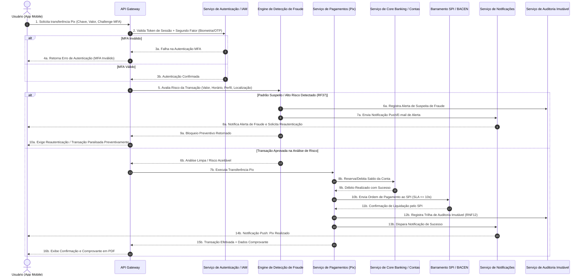
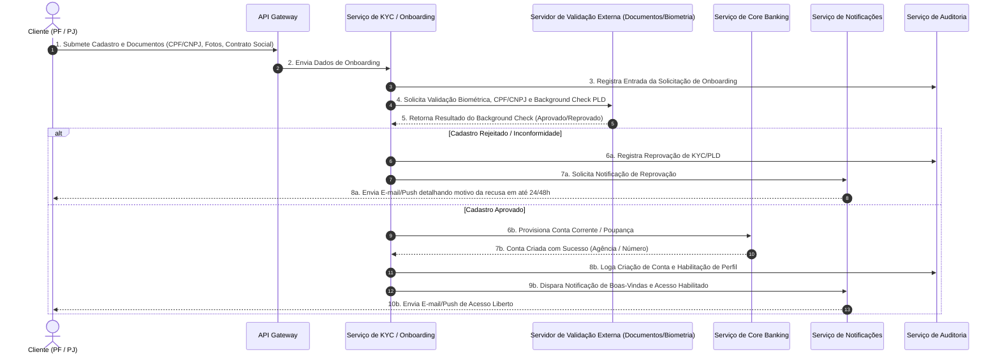

# Relatório Técnico de Arquitetura de Software

---

## 1. Identificação das HUs

A tabela abaixo sintetiza as Histórias de Usuário (HU) fornecidas, identificando os perfis/atores envolvidos, as ações principais e os módulos/componentes arquiteturais afetados.

| ID | Perfil / Ator | Título / Ação Principal | Módulos / Componentes Afetados |
| :--- | :--- | :--- | :--- |
| **HU01** | Pessoa Física (PF) | Abrir conta com validação de identidade (Onboarding PF) | Módulo de Identity & Access Management (IAM), Serviço de KYC/Validação Biométrica, Serviço de Notificações, Core Banking (Contas). |
| **HU02** | Pessoa Física / Jurídica | Autenticar com múltiplos fatores (MFA) | Módulo de IAM, Serviço de MFA (OTP/Biometria), Serviço de Notificações, Engine de Auditoria. |
| **HU03** | Pessoa Física / Jurídica | Realizar transferência via Pix | API Gateway, Módulo de Pagamentos e Transferências (Pix), Dict Manager, Engine de Fraudes, Barramento de Integração SPI/BACEN, Módulo de Notificações. |
| **HU04** | Pessoa Física / Jurídica | Pagar boleto com agendamento | Módulo de Pagamentos (Boletos), Agendador de Tarefas (Scheduler), Core Banking, Módulo de Notificações. |
| **HU05** | Pessoa Física | Gerenciar cartão de crédito (Fatura, Limites, Bloqueio) | Módulo de Cartões, Interface PCI-DSS, Engine de Análise de Crédito, Módulo de Notificações. |
| **HU06** | Pessoa Física / Jurídica | Contestar transação não reconhecida (Disputas/Chargeback) | Módulo de Gestão de Contestação/Disputas, Módulo de Cartões/Extratos, Core Banking, Engine de Auditoria. |
| **HU07** | Pessoa Física / Jurídica | Investir em renda fixa (Aplicação, Resgate, Posição) | Módulo de Investimentos, Core Banking, Serviço de Posição Custódia, Módulo Fiscal (Informe de Rendimentos). |
| **HU08** | Pessoa Física / Jurídica | Gerenciar consentimentos do Open Finance | Gateway Open Finance, Engine de Gestão de Consentimentos, Módulo de Identidade, Módulo de Notificações. |
| **HU09** | Pessoa Física / Jurídica | Receber alertas e responder a suspeita de fraude | Engine de Detecção de Fraudes em Tempo Real, Módulo de Notificações (Push/E-mail), Módulo de IAM, Core Banking. |
| **HU10** | Pessoa Jurídica (PJ) | Abrir conta PJ com documentação societária (Onboarding PJ) | Módulo de IAM, Serviço de KYC/PLD Societário, Servicio de Gestão Documental, Servicio de Notificações, Core Banking. |
| **HU11** | Pessoa Jurídica | Realizar TED para fornecedores | API Gateway, Módulo de Pagamentos e Transferências (TED), Engine de Fraudes, Barramento de Integração STR/BACEN, Servicio de Notificações. |
| **HU12** | Gerente de Relacionamento | Acompanhar carteira de clientes | Portal CRM/Gerencial, Módulo de Consentimento/Autorização de Acesso, Core Banking, Engine de Gestão de Relacionamento. |
| **HU13** | Gerente de Relacionamento | Abrir solicitação de serviço em nome do cliente | Portal CRM/Gerencial, Módulo de Workflows de Serviço, Módulo de Auditoria, Módulo de Notificações. |

---

## 2. Diagramas de Arquitetura (Mermaid)

### 2.1. Diagrama de Visão Geral da Arquitetura (Componentes Lógicos)

```mermaid
graph TD
    %% Clientes / Canais de Entrada
    subgraph Canais_Entrada ["Canais de Entrada / Interfaces"]
        AppMobile["Aplicativo Mobile (iOS / Android)"]
        PortalWeb["Portal Web Responsivo"]
        PortalCRM["Portal Gerencial CRM (Gerentes)"]
        OpenFinanceClients["Instituições Parceiras (Open Finance)"]
    end

    %% Borda / Segurança
    subgraph Camada_Borda ["Camada de Borda & Roteamento"]
        WAF["Web Application Firewall / Rate Limiter"]
        APIGateway["API Gateway Central (TLS 1.2+)"]
        OFGateway["Open Finance Gateway (APIs Padronizadas)"]
    end

    %% Serviços de Negócio (Bounded Contexts)
    subgraph Serviços_Dominio ["Serviços de Domínio (Microserviços Neutros)"]
        AuthService["Serviço de Autenticação & IAM"]
        KYCService["Serviço de KYC / Onboarding & PLD"]
        AccountService["Serviço de Core Banking & Contas"]
        PaymentService["Serviço de Pagamentos (Pix, TED, Boletos)"]
        CardService["Serviço de Gestão de Cartões"]
        InvestmentService["Serviço de Investimentos & Custódia"]
        FraudEngine["Engine de Detecção de Fraudes em Tempo Real"]
        ConsentService["Serviço de Gestão de Consentimento Open Finance"]
        CRMService["Serviço de CRM & Atendimento"]
        NotificationService["Serviço de Notificações Multi-Canal"]
        AuditService["Serviço de Auditoria & Conformidade Imutável"]
    end

    %% Integrações Externas
    subgraph Integracoes_Externas ["Integrações Externas & Regulatória"]
        BACEN_SPI["SPI / DICT (Banco Central - Pix)"]
        BACEN_STR["STR / CIP (TED e Boletos)"]
        CardProcessor["Processador de Cartões (Certificado PCI-DSS)"]
        BACEN_REG["Sistemas Regulatórios BACEN (3040 / SCR)"]
        ValidationProvider["Provedor de Validação de Documentos/Biometria"]
    end

    %% Fluxos Principais
    AppMobile --> WAF
    PortalWeb --> WAF
    PortalCRM --> WAF
    OpenFinanceClients --> OFGateway

    WAF --> APIGateway
    OFGateway --> APIGateway

    APIGateway --> AuthService
    APIGateway --> AccountService
    APIGateway --> PaymentService
    APIGateway --> CardService
    APIGateway --> InvestmentService
    APIGateway --> ConsentService
    APIGateway --> CRMService

    AuthService --> KYCService
    AuthService --> AuditService
    KYCService --> ValidationProvider

    PaymentService --> FraudEngine
    PaymentService --> BACEN_SPI
    PaymentService --> BACEN_STR
    PaymentService --> AccountService

    CardService --> CardProcessor

    FraudEngine --> NotificationService
    FraudEngine --> AuditService

    AccountService --> AuditService
    AccountService --> BACEN_REG

    CRMService --> AccountService
    CRMService --> AuditService
```

---

### 2.2. Diagrama de Sequência: Autenticação MFA e Transação Pix com Detecção de Fraude

---

### 2.3. Diagrama de Sequência: Onboarding de Usuário e KYC (HU01 / HU10)

---

## 3. Decisões de Arquitetura

### 3.1. Estilo Arquitetural Baseado em Domínios (Domain-Driven Design / Microserviços)
*   **Decisão:** Adotar uma arquitetura orientada a serviços de domínio (Microserviços conceituais independentes), delimitados por *Bounded Contexts* bem definidos (Identidade, Contas, Pagamentos, Cartões, Investimentos, Fraude, Open Finance e CRM).
*   **Justificativa:** Atende aos requisitos de escalabilidade horizontal automática (RNF16), disponibilidade de 99,95% (RNF13) e isolamento de falhas (RNF17). A falha no módulo de Investimentos não compromete transações Pix ou consultas de saldo.

### 3.2. Comunicação Híbrida: Síncrona (REST API) e Assíncrona (Event-Driven)
*   **Decisão:** Utilizar comunicação síncrona via HTTP/REST padronizado para consultas em tempo real (saldo, extrato, autenticação) e desacoplamento assíncrono orientado a eventos para operações background (notificações push, conciliação, envio de eventos para engine de fraude e geração de relatórios regulatórios).
*   **Justificativa:** Garante latência inferior a 1 segundo para consultas de saldo (RNF14) e processamento do Pix em até 10 segundos (RF24/RNF15), enquanto desonera o fluxo síncrono para tarefas como auditoria e notificações.

### 3.3. Criptografia e Segurança em Camadas (Defense-in-Depth)
*   **Decisão:**
    1.  **Trânsito:** Comunicação obrigatoriamente protegida por TLS 1.2 ou superior (RNF01).
    2.  **Repouso:** Criptografia de dados sensíveis (PII, documentos, dados bancários) utilizando o padrão AES-256 (RNF02).
    3.  **Credenciais:** Hash de senhas utilizando algoritmos de alto fator de custo como Bcrypt ou Argon2 (RNF03).
    4.  **Cartões:** Desapego completo do armazenamento local de dados de cartão PAN/CVV, delegando a captura e tokenização para um *Processador de Cartões Certificado PCI-DSS* (RNF06).
*   **Justificativa:** Garantir estrita conformidade com RNF01, RNF02, RNF03, RNF06 e normas de segurança do Banco Central e LGPD (RNF10).

### 3.4. Trilha de Auditoria Imutável e Regulatória
*   **Decisão:** Implementar um Serviço de Auditoria e Conformidade centralizado que consome eventos transacionais e grava dados em repositório de dados imutável (*Append-Only*), garantindo a retenção por no mínimo 5 anos.
*   **Justificativa:** Atendimento direto às exigências regulatórias do BACEN (RNF07, RNF12) e conformidade com auditorias internas e externas (RNF05).

### 3.5. Estratégia de Autenticação MFA Integrada
*   **Decisão:** Toda requisição crítica exige a validação de token de sessão curto associado a um segundo fator validado (TOTP via app autenticador ou biometria nativa do dispositivo mobile).
*   **Justificativa:** Cumprimento rigoroso do RF03, RNF04 (rate limiting integrado no API Gateway) e HU02.

---

## 4. Tabela de Componentes e Rastreabilidade

| Componente | Responsabilidade Principal | Comunica-se com | Origem (HU / Critério de Aceite) |
| :--- | :--- | :--- | :--- |
| **API Gateway & Rate Limiter** | Ponto único de entrada, inspeção de tráfego, autenticação primária, limitação de taxa (rate limiting), terminação TLS. | WAF, Auth Service, Todos os Serviços de Domínio. | RF03, RNF01, RNF04, RNF19 |
| **Serviço de Autenticação & IAM** | Gestão de usuários (PF/PJ/Gerente), gerenciamento de sessões, execução e verificação de MFA (OTP/Biometria), revogação/bloqueio de acessos. | API Gateway, KYC Service, Audit Service, Notification Service. | RF01, RF03, RF04, RF05, RF06, HU02 |
| **Serviço de KYC / Onboarding & PLD** | Submissão de documentos, orquestração de validações cadastrais (CPF/CNPJ, sócios, biometria), verificação de regras de Prevenção à Lavagem de Dinheiro. | IAM, External Validation Provider, Account Service, Audit Service. | RF02, RNF08, HU01, HU10 |
| **Serviço de Core Banking & Contas** | Abertura e manutenção de contas correntes e poupança, controle de saldos em tempo real, cálculo de rendimentos de poupança, geração de extratos e comprovantes em PDF. | IAM, Payment Service, Investment Service, CRM Service, Audit Service. | RF08, RF09, RF10, RF11, RF12, RF13, RNF14, HU01, HU10 |
| **Serviço de Pagamentos (Pix, TED, Boletos)** | Gestão e execução de transferências Pix, TED, pagamento e leitura de boletos, agendamento de transações, validação de limites diários/noturnos. | API Gateway, Core Banking, Fraud Engine, Barramentos Externos (SPI, STR, CIP), Audit Service. | RF22, RF23, RF24, RF25, RF26, RF27, RF28, RF29, RF30, RNF15, HU03, HU04, HU11 |
| **Serviço de Gestão de Cartões** | Emissão de cartão de débito/crédito, consulta de faturas, ajuste de limites de gastos, bloqueio/desbloqueio independente, gestão de contestações/disputas. | Processador PCI-DSS, Core Banking, Fraud Engine, Notification Service. | RF14, RF15, RF16, RF17, RF18, RF19, RF20, RF21, RNF06, HU05, HU06 |
| **Serviço de Investimentos & Custódia** | Exibição de catálogo de Renda Fixa, efetivação de aplicações e resgates, cálculo de rentabilidade acumulada/projeções, geração de Informe de Rendimentos IR. | Core Banking, Audit Service, Módulo Fiscal. | RF32, RF33, RF34, RF35, HU07 |
| **Engine de Detecção de Fraude** | Monitoramento transacional em tempo real, identificação de padrões suspeitos, disparo de bloqueio preventivo e exigência de reautenticação. | Payment Service, Card Service, Notification Service, Audit Service. | RF36, RF37, RF38, RF39, RF40, HU09 |
| **Gateway Open Finance & Consentimentos** | Exposição de APIs padronizadas do Open Finance Brasil, gestão do ciclo de vida de consentimentos (concessão, consulta, revogação), iniciação de pagamentos. | API Gateway, Core Banking, IAM, Audit Service, External Open Finance Entities. | RF41, RF42, RF43, RF44, RNF11, HU08 |
| **Portal CRM & Gestão de Relacionamento** | Fornecimento da visão consolidada de carteira de clientes para gerentes, registro de interações/anotações, abertura de solicitações de serviço com auditoria. | Core Banking, Investment Service, Consent Service, Audit Service. | RF07, RF45, RF46, RF47, HU12, HU13 |
| **Serviço de Auditoria & Relatórios BACEN** | Captura de eventos transacionais e de acesso, armazenamento imutável por 5+ anos, geração de relatórios BACEN (3040, SCR, etc.). | Todos os serviços de domínio, Órgãos Reguladores (BACEN). | RNF07, RNF09, RNF10, RNF12 |
| **Serviço de Notificações Multi-Canal** | Disparo de mensagens push, e-mails e alertas operacionais/segurança aos clientes em tempo real. | Fraud Engine, Payment Service, Card Service, KYC Service. | RF20, RF31, RF38, HU01, HU05, HU08, HU09, HU13 |

---

## 5. Bloqueios e Pendências

1.  **SLA e APIs do Provedor de Validação de Documentos / KYC (Dependência Externa)**
    *   *Descrição:* O critério de aceite da HU01 estabelece prazo de resposta de até 24h (PF) e 48h (PJ) para validação de onboarding.
    *   *Bloqueio:* Ausência da definição da API de integração e do SLA de resposta do parceiro externo de OCR/Biometria e validação de documentos societários.
2.  **Integrações Regulatórias de Cartão (PCI-DSS e Processadora Externa)**
    *   *Descrição:* O RNF06 impede o armazenamento local de dados do cartão.
    *   *Pendência:* Faltam a definição do parceiro homologado PCI-DSS e a especificação das APIs de tokenização e envio do *payload* da fatura.
3.  **Ambiente de Homologação / Sandbox do SPI (BACEN)**
    *   *Descrição:* Testes de desempenho e resiliência das transferências Pix (SLA de 10s em RNF15/RF24).
    *   *Bloqueio:* Disponibilidade dos endpoints do ecossistema de testes do SPI/BACEN para validação de alta carga e failover.
4.  **Matriz de Alçadas e Consentimento para Visão do Gerente (RF07 / HU12)**
    *   *Descrição:* O gerente exige consentimento explícito do cliente para visualizar a carteira consolidada.
    *   *Pendência:* Falta a especificação do fluxo UI/UX e do modelo de persistência do termo de consentimento específico para o Gerente de Relacionamento.

---

## 6. Cobertura de Requisitos

| Categoria | IDs dos Requisitos | Coberto pelo(s) Componente(s) Arquitetural(ais) | Status |
| :--- | :--- | :--- | :--- |
| **Gestão de Usuários e Autenticação** | RF01, RF02, RF03, RF04, RF05, RF06, RF07 | Auth Service (IAM), KYC Service, API Gateway, CRM Service. | **100% Coberto** |
| **Conta Corrente e Poupança** | RF08, RF09, RF10, RF11, RF12, RF13 | Core Banking & Contas, Audit Service. | **100% Coberto** |
| **Cartão de Débito e Crédito** | RF14, RF15, RF16, RF17, RF18, RF19, RF20, RF21 | Gestão de Cartões, Processador PCI-DSS, Notification Service. | **100% Coberto** |
| **Transferências** | RF22, RF23, RF24, RF25, RF26, RF27 | Serviço de Pagamentos (Pix, TED), Fraud Engine, Barramentos SPI/STR. | **100% Coberto** |
| **Pagamento de Boletos** | RF28, RF29, RF30, RF31 | Serviço de Pagamentos (Boletos), Notification Service, Core Banking. | **100% Coberto** |
| **Investimentos em Renda Fixa** | RF32, RF33, RF34, RF35 | Serviço de Investimentos & Custódia, Core Banking. | **100% Coberto** |
| **Detecção de Fraudes** | RF36, RF37, RF38, RF39, RF40 | Engine de Detecção de Fraude, Notification Service, Audit Service. | **100% Coberto** |
| **Open Finance** | RF41, RF42, RF43, RF44 | Gateway Open Finance & Consentimentos, IAM, Core Banking. | **100% Coberto** |
| **Gerente de Relacionamento** | RF45, RF46, RF47 | Portal CRM & Gestão de Relacionamento, Audit Service. | **100% Coberto** |
| **RNF - Segurança** | RNF01, RNF02, RNF03, RNF04, RNF05, RNF06 | API Gateway, Auth Service (IAM), Processador PCI-DSS, Criptografia End-to-End. | **100% Coberto** |
| **RNF - Conformidade** | RNF07, RNF08, RNF09, RNF10, RNF11, RNF12 | Servicio de Auditoria & Relatórios BACEN, Gateway Open Finance, KYC Service. | **100% Coberto** |
| **RNF - Disp. e Desempenho** | RNF13, RNF14, RNF15, RNF16, RNF17 | Arquitetura Microserviços, Auto-scaling, Caching Lógico, Failover Circuit Breakers. | **100% Coberto** |
| **RNF - Usab. e Infraestrutura** | RNF18, RNF19, RNF20, RNF21, RNF22, RNF23, RNF24 | Multi-AZ Deployment, Backup Contínuo, Monitoring Dashboard, App/Web Apps. | **100% Coberto** |

---

## 7. Gap Analysis

A análise a seguir identifica lacunas entre os requisitos fornecidos e o detalhamento arquitetural necessário para o desenvolvimento seguro e resiliente do sistema.

### Gap 1: Mecanismo de Conciliação Financeira Assíncrona e Noturna
*   **Descrição da Lacuna:** Os RFs e HUs tratam das transações Pix, TED e Cartões no momento da operação (tempo real), mas omitem o requisito de conciliação bancária/financeira das posições operacionais ao fim do dia (EOD - *End of Day*).
*   **Impacto Arquitetural:** Risco de divergência contábil entre a posição do Core Banking e o extrato do SPI (BACEN) ou da Processadora de Cartões em caso de falhas parciais de rede.
*   **Ação Recomendada:** Adicionar ao *Serviço de Core Banking* um submódulo de **Batch Job de Conciliação Contábil**, capaz de processar arquivos de extrato das câmaras de liquidação (CIP/SPI) e ajustar eventuais pendências financeiras.

### Gap 2: Política de Retenção e Expurgos para Conformidade LGPD (Direito ao Esquecimento vs. Retenção Regulatória)
*   **Descrição da Lacuna:** O RNF10 exige conformidade com a LGPD, enquanto o RNF12 e RNF07 exigem retenção imutável de dados financeiros por no mínimo 5 anos. Há um conflito potencial quando um cliente encerrar a conta e solicitar a exclusão total de dados.
*   **Impacto Arquitetural:** Ambiguidade no design do repositório de dados de auditoria e no repositório de identificação pessoal.
*   **Ação Recomendada:** Arquitetar a separação do dado de identificação pessoal (PII) dos dados transacionais anônimos. Implementar funcionalidade de **Pseudonimização Cryptographic Shredding** (destruição das chaves de criptografia do PII do cliente ao término do prazo regulatório de 5 anos), garantindo o cumprimento da LGPD sem invalidar a integridade dos registros contábeis históricos.

### Gap 3: Estratégia de Fallback e Tratamento de Indisponibilidade dos Serviços Regulatórios Externos (SPI/STR/BACEN)
*   **Descrição da Lacuna:** O RNF17 cita a implementação de mecanismos de *fallback* e recuperação automática em falhas de componentes críticos, mas não detalha a conduta do sistema quando o BACEN/SPI estiver inoperante.
*   **Impacto Arquitetural:** Risco de travamento de recursos ou inconsistência no estado da transação Pix (ex: saldo debitado no Core Banking, mas retido por timeout no SPI).
*   **Ação Recomendada:** Definir o padrão de projeto de resiliência **Circuit Breaker** associado a um mecanismo de **Transaction Two-Phase Commit / Saga Pattern** com estorno automático de saldo retido (*Compensating Transaction*) caso a confirmação do SPI não seja recebida dentro da janela tolerada (até 10 segundos).