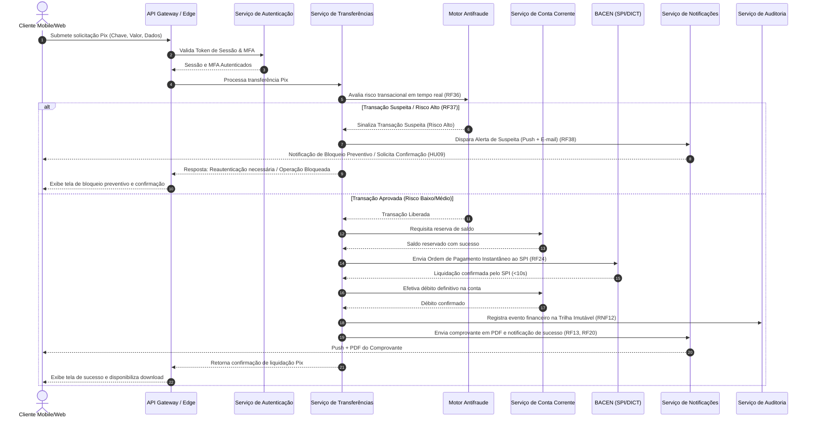

# Relatório Técnico de Arquitetura de Software

**Sistema:** Plataforma Financeira Digital (G01)  
**Time:** Time 2 — AI4ES (Sistema Multi-Agente de Design de Software)  
**Status:** Canonical / Aprovado para Engenharia  

---

## 1. Identificação das HUs

A tabela a seguir consolida a especificação e o rastreamento das Histórias de Usuário (HUs) extraídas dos requisitos de entrada:

| ID | Ator | Objetivo de Negócio | Critérios de Aceite Principais | Origem Requisitos |
|---|---|---|---|---|
| **HU01** | Pessoa Física (PF) | Abertura de conta digital via onboarding simplificado | - Validação de CPF, data de nascimento e foto. - Notificação de análise em até 24 horas. - Habilitação imediata da conta após aprovação. | RF01, RF02, RF08 |
| **HU02** | Usuário Geral | Autenticação segura via múltiplos fatores (MFA) | - MFA obrigatório com OTP (app) e biometria mobile. - Gestão e suporte a múltiplos métodos. - Alerta imediato em bloqueios por falha de MFA. | RF03, RNF01, RNF03, RNF04 |
| **HU03** | Usuário Geral | Transferência instantânea via Pix | - Suporte a todas as chaves (CPF/CNPJ, e-mail, telefone, aleatória, QR/Copia e Cola). - Confirmação prévia dos dados do destinatário. - Geração de comprovante PDF imediato. - Bloqueio por limite noturno configurado. | RF12, RF13, RF22, RF23, RF24, RF27, RNF15 |
| **HU04** | Usuário Geral | Pagamento e agendamento de boletos bancários | - Exibição clara de beneficiário, valor e vencimento pré-confirmação. - Suporte a agendamento para vencimento ou data futura. - Lembrete/Notificação 1 dia antes do vencimento. | RF28, RF29, RF30, RF31 |
| **HU05** | Usuário Geral | Gestão integrada de cartão de crédito | - Detalhamento da fatura por ciclo, data e estabelecimento. - Opções de pagamento: total, mínimo ou customizado. - Efetivação do bloqueio em até 60s. - Push em tempo real a cada transação. | RF15, RF16, RF17, RF18, RF19, RF20 |
| **HU06** | Usuário Geral | Contestação de transações não reconhecidas | - Contestação direta via extrato/fatura. - Registro do motivo e inclusão opcional de evidências. - Notificação com protocolo e prazo de análise. | RF21 |
| **HU07** | Usuário Geral | Aplicação e resgate em investimentos de Renda Fixa | - Visualização de taxas, prazos, valor mínimo, liquidez e risco. - Confirmação explícita pré-aplicação. - Atualização imediata da posição consolidada. | RF32, RF33, RF34, RF35 |
| **HU08** | Usuário Geral | Gestão de consentimentos do Open Finance | - Painel com instituição, dados, data e expiração. - Revogação em tempo real e notificação por e-mail. - Interrupção imediata de acesso externo. | RF41, RF42, RF43, RF44, RNF11 |
| **HU09** | Usuário Geral | Alertas e resposta rápida a suspeitas de fraude | - Disparo simultâneo via push e e-mail. - Confirmação ou contestação em até 2 cliques. - Bloqueio preventivo e sinalização da conta. | RF36, RF37, RF38, RF39, RF40 |
| **HU10** | Pessoa Jurídica (PJ) | Abertura de conta PJ com validação societária | - Validação de CNPJ, sócios e contrato social. - Checagem de KYC/PLD para administradores. - Notificação de resultado em até 48 horas. | RF01, RF02, RF08, RNF08 |
| **HU11** | Pessoa Jurídica (PJ) | Emissão de TED para fornecedores e parceiros | - Validação prévia de dados bancários de destino. - Respeito aos limites e horários de janela do BACEN. - Emissão imediata de comprovante PDF. | RF13, RF25, RF27 |
| **HU12** | Gerente de Relacionamento | Acompanhamento consolidado da carteira de clientes | - Exigência de consentimento do cliente. - Visão unificada de produtos, saldos, faturas e investimentos. - Registro de anotações e histórico de interações. | RF07, RF45, RF46 |
| **HU13** | Gerente de Relacionamento | Abertura de solicitações operacionais pelo cliente | - Rastreabilidade com ID do gerente para auditoria. - Notificação ao cliente sobre abertura e evolução. - Proibição de movimentação financeira direta sem autorização. | RF47, RNF12 |

---

## 2. Diagramas de Arquitetura (Mermaid)

### 2.1. Visão Geral de Componentes da Arquitetura (C4 - Nível de Componentes Abstratos)

```mermaid
graph TD
    %% Clientes e Interfaces
    subgraph ClientLayer [Camada de Apresentação]
        MobileApp[App Mobile iOS / Android]
        WebPortal[Portal Web Responsivo]
        ManagerPortal[Portal do Gerente]
    end

    %% Borda e API Gateway
    subgraph BoundaryLayer [Camada de Borda e Segurança]
        APIGateway[API Gateway / Edge Controller]
        AuthService[Serviço de Autenticação e MFA]
    end

    %% Domínios de Negócio (Microserviços)
    subgraph CoreDomain [Camada de Domínio e Processamento Financeiro]
        UserService[Serviço de Gestão de Usuários & Onboarding]
        AccountService[Serviço de Conta Corrente e Poupança]
        PaymentService[Serviço de Pagamentos e Boletos]
        TransferService[Serviço de Transferências Pix / TED]
        CardService[Serviço de Cartões e Faturas]
        InvestmentService[Serviço de Renda Fixa]
        FraudEngine[Motor de Detecção de Fraudes]
        OpenFinanceEngine[Barramento Open Finance]
        ManagerService[Serviço de Gestão de Relacionamento]
    end

    %% Camada Transversal / Dados e Governança
    subgraph InfrastructureLayer [Infraestrutura e Dados Conceituais]
        NotificationService[Serviço de Notificações Push/E-mail]
        AuditLogService[Serviço de Trilha de Auditoria Imutável]
        OperationalDataStore[(Repositório Transacional)]
        AnalyticalStore[(Repositório Analítico / BACEN)]
    end

    %% Integrações Externas Reguladas
    subgraph ExternalSystems [Sistemas Externos e Reguladores]
        SPI_DICT[Bacen - SPI / DICT]
        PCI_Processor[Processador de Cartões PCI-DSS]
        OpenFinance_Peers[Instituições Open Finance]
        Bureau_KYC[Provedores KYC / Análise de Crédito]
    end

    %% Conexões da Apresentação
    MobileApp --> APIGateway
    WebPortal --> APIGateway
    ManagerPortal --> APIGateway

    %% Conexões de Segurança e Borda
    APIGateway --> AuthService
    APIGateway --> UserService
    APIGateway --> AccountService
    APIGateway --> PaymentService
    APIGateway --> TransferService
    APIGateway --> CardService
    APIGateway --> InvestmentService
    APIGateway --> OpenFinanceEngine
    APIGateway --> ManagerService

    %% Fluxos de Negócio Inter-componentes
    TransferService --> FraudEngine
    PaymentService --> FraudEngine
    CardService --> FraudEngine
    
    TransferService --> NotificationService
    PaymentService --> NotificationService
    FraudEngine --> NotificationService
    
    UserService --> Bureau_KYC
    TransferService --> SPI_DICT
    CardService --> PCI_Processor
    OpenFinanceEngine --> OpenFinance_Peers

    %% Persistência e Auditoria Transversal
    UserService --> AuditLogService
    TransferService --> AuditLogService
    CardService --> AuditLogService
    ManagerService --> AuditLogService
    
    CoreDomain --> OperationalDataStore
    AuditLogService --> AnalyticalStore

    classDef client fill:#e1f5fe,stroke:#01579b,stroke-width:1px;
    classDef boundary fill:#fff3e0,stroke:#e65100,stroke-width:1px;
    classDef core fill:#e8f5e9,stroke:#1b5e20,stroke-width:1px;
    classDef infra fill:#f3e5f5,stroke:#4a148c,stroke-width:1px;
    classDef external fill:#eceff1,stroke:#263238,stroke-width:1px;

    class MobileApp,WebPortal,ManagerPortal client;
    class APIGateway,AuthService boundary;
    class UserService,AccountService,PaymentService,TransferService,CardService,InvestmentService,FraudEngine,OpenFinanceEngine,ManagerService core;
    class NotificationService,AuditLogService,OperationalDataStore,AnalyticalStore infra;
    class SPI_DICT,PCI_Processor,OpenFinance_Peers,Bureau_KYC external;
```

---

### 2.2. Diagrama de Sequência: Processamento de Transferência Pix com Avaliação Antifraude em Tempo Real

---

## 3. Decisões de Arquitetura

### DA01: Arquitetura Orientada a Serviços/Eventos (Microserviços por Contexto Delimitado)
* **Decisão:** A plataforma é estruturada em serviços autônomos por domínio financeiro (Contas, Transferências, Cartões, Fraude, Open Finance). A comunicação síncrona é restrita a validações de baixa latência (API Gateway, Autenticação) e a comunicação assíncrona baseada em eventos é adotada para auditoria, notificações e processamento analítico de fraudes.
* **Justificativa:** Atende aos requisitos de alta disponibilidade (RNF13: 99,95%), escalabilidade horizontal independente por serviço (RNF16) e desacoplamento de domínios operacionais e regulatórios.

### DA02: Camada Isolada de Integração PCI-DSS para Processamento de Cartões
* **Decisão:** Nenhum dado sensível de Cartão de Crédito/Débito (PAN, CVV) é armazenado ou trafega nos repositórios internos da plataforma (RNF06). A tokenização e o processamento são delegados integralmente a um processador parceiro certificado PCI-DSS.
* **Justificativa:** Garantia de conformidade com o padrão PCI-DSS e redução do escopo de auditoria de segurança da infraestrutura do banco.

### DA03: Motor Antifraude Inline e Assíncrono com Triagem em Tempo Real
* **Decisão:** O Motor Antifraude atua de forma inline síncrona durante a liquidação de transações de alto valor/risco (RF36, RF37) com suporte a *circuit breaker* e decisão em tempo real (<100ms), e de forma assíncrona para geração de modelos comportamentais de prevenção.
* **Justificativa:** Cumprimento do SLA de transferências Pix (<10s, RF24/RNF15) enquanto garante a proteção patrimonial do cliente via bloqueio preventivo (HU09).

### DA04: Segregação de Leitura e Escrita para Consultas em Tempo Real (Padrão CQRS Abstrato)
* **Decisão:** Separação entre os caminhos de gravação de transações (Livro Razão / Ledger Financeiro) e os caminhos de consulta de saldos e extratos.
* **Justificativa:** Assegura que consultas de saldo e extrato respondam em menos de 1 segundo (RNF14), mesmo sob picos de alta concorrência, protegendo a base transacional primária.

### DA05: Trilha de Auditoria Imutável Append-Only com Retenção de 5 Anos
* **Decisão:** Todos os eventos financeiros, tentativas de acesso, alterações de permissão e ações do Gerente de Relacionamento são gravados em um repositório imutável e auditável (append-only) com retenção garantida de 5 anos (RNF12, RF40).
* **Justificativa:** Conformidade rigorosa com normas do BACEN, LGPD e requisitos de Não-Repúdio.

---

## 4. Tabela de Componentes e Rastreabilidade

| Componente | Responsabilidade Principal | Comunica-se com | Origem (HU / Critério de Aceite) |
|---|---|---|---|
| **API Gateway / Edge Controller** | Entrada única, roteamento de requisições, encerramento TLS 1.2+, rate limiting e validação básica de schema. | AuthService, Todos os Serviços de Domínio | RNF01, RNF04, RNF19 |
| **Serviço de Autenticação e MFA** | Gerenciamento de tokens de sessão, validação de hash de senha (bcrypt/Argon2), orquestração de MFA (OTP/Biometria), controle de inatividade e bloqueio de conta. | API Gateway, UserService, Event Bus | RF03, RF04, RF06, RNF03, HU02 |
| **Serviço de Gestão de Usuários & Onboarding** | Cadastro de perfis PF/PJ, validação de documentos, integração com bureaus KYC, coleta de dados dos sócios e gestão de consentimento de acesso do gerente. | AuthService, Bureau KYC, AuditLogService | RF01, RF02, RF07, HU01, HU10 |
| **Serviço de Conta Corrente e Poupança** | Manutenção de saldos em tempo real, cálculo automatizado de rendimentos de poupança, geração de extratos e comprovantes em PDF. | TransferService, PaymentService, FraudEngine, OperationalDataStore | RF08, RF09, RF10, RF11, RF12, RF13, RNF14 |
| **Serviço de Cartões e Faturas** | Emissão de débito/crédito, gestão de limites, consolidação e pagamento parcial/total de fatura, bloqueio/desbloqueio e registro de contestações. | PCI-DSS Processor, FraudEngine, NotificationService | RF14, RF15, RF16, RF17, RF18, RF19, RF20, RF21, RNF06, HU05, HU06 |
| **Serviço de Transferências (Pix / TED)** | Processamento de Pix (chaves, leitura de QR) e TED, gerenciamento de limites configuráveis por canal/horário, agendamentos e interface SPI. | BACEN SPI/DICT, AccountService, FraudEngine, NotificationService | RF22, RF23, RF24, RF25, RF26, RF27, RNF15, HU03, HU11 |
| **Serviço de Pagamentos e Boletos** | Leitura/digitação de código de barras, apresentação de dados de boletos para confirmação, agendamento de liquidação e alertas de vencimento. | AccountService, NotificationService, Bank Clearing Gateway | RF28, RF29, RF30, RF31, HU04 |
| **Serviço de Renda Fixa** | Catálogo de produtos financeiros, simulação, aplicação, resgate, consolidação de posição e emissão de Informe de Rendimentos. | AccountService, AnalyticalStore | RF32, RF33, RF34, RF35, HU07 |
| **Motor de Detecção de Fraudes** | Monitoramento de transações em tempo real, identificação de padrões suspeitos, disparo de bloqueios preventivos, gestão do ciclo de alertas. | TransferService, PaymentService, CardService, NotificationService, AuditLogService | RF36, RF37, RF38, RF39, RF40, HU09 |
| **Barramento Open Finance** | Publicação e consumo de APIs padronizadas do Open Finance Brasil, gestão do ciclo de vida de consentimentos (concessão, consulta, revogação). | OpenFinance Peers, AccountService, AuditLogService | RF41, RF42, RF43, RF44, RNF11, HU08 |
| **Serviço de Gestão de Relacionamento** | Portal do Gerente para visão consolidada da carteira, registro de anotações/atendimentos e abertura auditada de solicitações operacionais. | UserService, AccountService, CardService, AuditLogService | RF07, RF45, RF46, RF47, HU12, HU13 |
| **Serviço de Notificações** | Envio omnichannel (Push Mobile, E-mail) em tempo real para alertas transacionais, aviso de boletos, notificações de segurança e fraudes. | Mobile App, Web Portal, External Email Gateway | RF20, RF31, RF38, RNF17, HU05, HU09 |
| **Serviço de Auditoria Imutável** | Captura centralizada de logs estruturados de auditoria financeiro/operacional com garantia de inalterabilidade e retenção de 5 anos. | Todos os Serviços de Domínio, AnalyticalStore | RNF08, RNF09, RNF10, RNF12, RF40 |

---

## 5. Bloqueios e Pendências

### Bloqueios Identificados
1. **Definição das Regras do Engine de Análise de Crédito Interno x Externo:**
   - **Risco:** O RF15 e a HU05 mencionam a concessão de cartão mediante "análise de crédito", porém não definem se o score é calculado internamente ou via integração externa com bureau de crédito, impactando o tempo de resposta na solicitação.
2. **Especificação do SLA do Retorno de Contestação de Transações (RF21/HU06):**
   - **Risco:** Falta delimitar o fluxo de trabalho (*workflow*) do *backoffice* para análise da contestação e o prazo legal/operacional para estorno temporário (*chargeback* preventivo) na conta do cliente.

### Pendências de Arquitetura e Especificação
1. **Mapeamento de Tratamento para Indisponibilidade do SPI / BACEN:**
   - **Ação:** Detalhar a estratégia de resiliência e mensagens de erro ao usuário caso a rede do SPI (Pix) fique indisponível, garantindo que não ocorra retenção indevida do saldo reservado.
2. **Definição de Limites Quantitativos do Rate Limiting:**
   - **Ação:** Definir as taxas exatas (ex.: requisições por minuto por IP/Usuário) para os endpoints de login, MFA e transferências para configuração do API Gateway (RNF04).
3. **Mecanismo de Consentimento Explícito do Cliente para Acesso do Gerente (RF07 / HU12):**
   - **Ação:** Formalizar a especificação do fluxo de opt-in/opt-out no app mobile para que o cliente autorize formalmente o gerente a visualizar sua carteira de investimentos e saldos.

---

## 6. Cobertura de Requisitos

### Requisitos Funcionais (RF)

| ID | Status de Cobertura | Componente Arquitetural / Mecanismo Garantidor |
|---|---|---|
| **RF01** | Coberto | Servicio de Gestão de Usuários & Onboarding (Perfis PF, PJ e Gerente) |
| **RF02** | Coberto | Serviço de Onboarding com integração a Provedores KYC |
| **RF03** | Coberto | Serviço de Autenticação e MFA (OTP Authenticator e Biometria) |
| **RF04** | Coberto | API Gateway + AuthService (Gestão de timeout de sessão configurável) |
| **RF05** | Coberto | AuthService + Serviço de Auditoria (Registro de IP, User-Agent, Geolocalização) |
| **RF06** | Coberto | AuthService + UserService (Bloqueio/Desbloqueio remoto de acesso) |
| **RF07** | Coberto | Serviço de Gestão de Relacionamento + Gestão de Consentimento |
| **RF08** | Coberto | Serviço de Conta Corrente e Poupança |
| **RF09** | Coberto | Serviço de Conta Corrente (Atualização de saldo em tempo real) |
| **RF10** | Coberto | Serviço de Conta Corrente + CQRS (Filtros de extrato otimizados) |
| **RF11** | Coberto | Serviço de Conta Corrente (Job programado conforme regras do BACEN) |
| **RF12** | Coberto | Serviço de Transferências / Serviço de Conta Corrente |
| **RF13** | Coberto | Serviço de Conta Corrente + Módulo Gerador de Comprovantes PDF |
| **RF14** | Coberto | Serviço de Cartões e Faturas |
| **RF15** | Coberto | Serviço de Cartões com integração a Engine de Análise de Crédito |
| **RF16** | Coberto | Serviço de Cartões (Visão de Fatura Atual e Histórico de Ciclos) |
| **RF17** | Coberto | Serviço de Cartões + Serviço de Conta Corrente (Pagamento Fatura) |
| **RF18** | Coberto | Serviço de Cartões (Ajuste de limite respeitando teto aprovado) |
| **RF19** | Coberto | Serviço de Cartões (Bloqueio/Desbloqueio independente de débito/crédito) |
| **RF20** | Coberto | Serviço de Cartões + Serviço de Notificações Push em tempo real |
| **RF21** | Coberto | Serviço de Cartões / Extrato + Portal de Contestação/Atendimento |
| **RF22** | Coberto | Serviço de Transferências Pix (Suporte a todas as chaves) |
| **RF23** | Coberto | Serviço de Transferências Pix (Gestão do ciclo de vida das chaves) |
| **RF24** | Coberto | Serviço de Transferências + Integração SPI BACEN (<10 segundos) |
| **RF25** | Coberto | Serviço de Transferências (Módulo TED respeitando janelas BACEN) |
| **RF26** | Coberto | Serviço de Transferências (Agendamento Pix e TED) |
| **RF27** | Coberto | Serviço de Transferências (Gestão de limites diurno/noturno) |
| **RF28** | Coberto | Serviço de Pagamentos e Boletos (Leitor Cód. Barras e Linha Digitável) |
| **RF29** | Coberto | Serviço de Pagamentos e Boletos (Tela de confirmação com dados enriquecidos) |
| **RF30** | Coberto | Serviço de Pagamentos e Boletos (Agendamento pré-vencimento) |
| **RF31** | Coberto | Serviço de Pagamentos + Serviço de Notificações (Lembrete de boletos) |
| **RF32** | Coberto | Serviço de Renda Fixa (Vitrine de investimentos com taxas/risco) |
| **RF33** | Coberto | Serviço de Renda Fixa + Serviço de Conta Corrente (Aplicações/Resgates) |
| **RF34** | Coberto | Serviço de Renda Fixa (Consolidação de posição e projeções) |
| **RF35** | Coberto | Serviço de Renda Fixa (Geração automática de Informe de Rendimentos) |
| **RF36** | Coberto | Motor de Detecção de Fraudes (Monitoramento contínuo) |
| **RF37** | Coberto | Motor Antifraude + API Gateway (Bloqueio preventivo e desafio MFA) |
| **RF38** | Coberto | Motor Antifraude + Serviço de Notificações (Push + E-mail) |
| **RF39** | Coberto | App Mobile / Web + Motor Antifraude (Confirmação/Contestação 2-clicks) |
| **RF40** | Coberto | Motor Antifraude + Serviço de Auditoria Imutável |
| **RF41** | Coberto | Barramento Open Finance (Fluxo de Consentimento Regulado) |
| **RF42** | Coberto | Barramento Open Finance (Painel de Gestão e Revogação Imediata) |
| **RF43** | Coberto | Barramento Open Finance (Iniciação de Pagamentos - ITP) |
| **RF44** | Coberto | Barramento Open Finance (APIs Padronizadas Open Finance Brasil) |
| **RF45** | Coberto | Serviço de Gestão de Relacionamento (Visão 360 do Cliente) |
| **RF46** | Coberto | Serviço de Gestão de Relacionamento (Módulo de Anotações/CRM) |
| **RF47** | Coberto | Serviço de Gestão de Relacionamento (Abertura auditada de tickets) |

### Requisitos Não Funcionais (RNF)

| ID | Categoria | Mecanismo Arquitetural Adotado |
|---|---|---|
| **RNF01** | Segurança | Encerramento TLS 1.2+ obrigatório no API Gateway para todo o tráfego externo. |
| **RNF02** | Segurança | Criptografia em repouso com algoritmo AES-256 no Repositório Transacional. |
| **RNF03** | Segurança | Armazenamento de credenciais utilizando funções de hash seguro (bcrypt ou Argon2). |
| **RNF04** | Segurança | Algoritmo de Rate Limiting aplicado por IP/Conta no API Gateway. |
| **RNF05** | Segurança | Pipeline CI/CD com testes de segurança automatizados e varredura de vulnerabilidades. |
| **RNF06** | Segurança | Delegado ao Processador de Cartões parceiro com certificação PCI-DSS ativa. |
| **RNF07** | Conformidade | Validações integradas às regras de negócio conforme manuais do BACEN. |
| **RNF08** | Conformidade | Serviço de Onboarding acoplado a motores de checagem KYC/PLD/FT. |
| **RNF09** | Conformidade | Repositório Analítico estruturado para exportação dos arquivos BACEN 3040 e SCR. |
| **RNF10** | Conformidade | Isolamento de PII, termos de consentimento e atendimento aos direitos do titular (LGPD). |
| **RNF11** | Conformidade | Barramento Open Finance seguindo rigorosamente os guias do Open Finance Brasil. |
| **RNF12** | Conformidade | Serviço de Auditoria Imutável (append-only) garantindo 5 anos de retenção. |
| **RNF13** | Disponibilidade | Implantação redundante em Múltiplas Zonas de Disponibilidade (Multi-AZ) para 99,95% uptime. |
| **RNF14** | Desempenho | Adição de camada CQRS e In-Memory Cache para saldo/extrato em <1s. |
| **RNF15** | Desempenho | Integração de baixa latência e concorrência para liquidação Pix em <10s no SPI. |
| **RNF16** | Escalabilidade | Arquitetura de Microserviços desacoplados habilitados para autoscaling horizontal. |
| **RNF17** | Resiliência | Aplicação de padrões Resilience (Circuit Breaker, Retries e Fallback elegante). |
| **RNF18** | Usabilidade | Aplicações mobile nativas/híbridas para as 2 últimas versões de iOS e Android. |
| **RNF19** | Usabilidade | Portal Web construído sob princípios de design responsivo e moderno. |
| **RNF20** | Acessibilidade | Interfaces do App e Web desenhadas sob o padrão WCAG 2.1 nível AA. |
| **RNF21** | Usabilidade | Modal de Confirmação Obrigatório pré-efetivação em todas as transações financeiras. |
| **RNF22** | Backup | Backup contínuo com estratégias de replicação para RPO $\le$ 1 hora e RTO $\le$ 4 horas. |
| **RNF23** | Infraestrutura | Distribuição da infraestrutura de produção em Múltiplas Zonas de Disponibilidade (Multi-AZ). |
| **RNF24** | Manutenibilidade | Módulo de Monitoramento exposto com métricas operacionais em painel unificado em tempo real. |

---

## 7. Gap Analysis

| Item Analisado | Lacuna de Especificação Encontrada | Impacto Arquitetural | Ação Recomendada |
|---|---|---|---|
| **Notificação Off-line de Suspeita de Fraude** | O RF38 exige notificação imediata e resposta pelo app (HU09). Não há especificação do comportamento caso o usuário esteja sem conexão de dados (App offline). | Risco do bloqueio preventivo expirar sem resposta do cliente ou bloquear a transação por timeout indeterminado. | Definir regra de *fallback*: Transação permanece bloqueada preventivamente por até 15 minutos; caso não haja confirmação, a transação é cancelada por segurança e mantida em espera para tratamento via central. |
| **Estratégia de Liquidação de Boletos Agendados** | O RF30 e a HU04 tratam de agendamento de boletos, mas não detalham o horário exato da execução da grade de pagamentos no dia do vencimento. | Pico de concorrência imprevisível no Serviço de Conta Corrente e Pagamentos no início do dia útil. | Estabelecer janela de processamento em lote (*batch processing*) escalonado no início da madrugada do dia do vencimento com retentativas automáticas em caso de falta de saldo. |
| **Mecanismo de Sincronização de Chaves Pix** | O RF23 trata da edição/exclusão de chaves Pix, mas não explicita o fluxo de reinvidicação de posse de chave (*claim*) quando a chave pertence a outra instituição. | Necessidade de orquestração de fluxo assíncrono de claim junto ao DICT (BACEN). | Desenhar o subfluxo de reivindicação de chaves Pix no Serviço de Transferências com estados temporários e notificações via push sobre o andamento do processo. |
| **Política de Armazenamento de Documentos de Onboarding** | O RF02 e a HU10 exigem upload e validação de documentos de PF/PJ, mas não especificam os requisitos de armazenamento seguro e expurgo. | Armazenamento desnecessário de arquivos pesados no banco de dados operacional e risco de descumprimento do ciclo de vida LGPD. | Armazenar arquivos criptografados (AES-256) em Repositório de Objetos dedicado, mantendo apenas os metadados e referências no banco de dados transacional. |