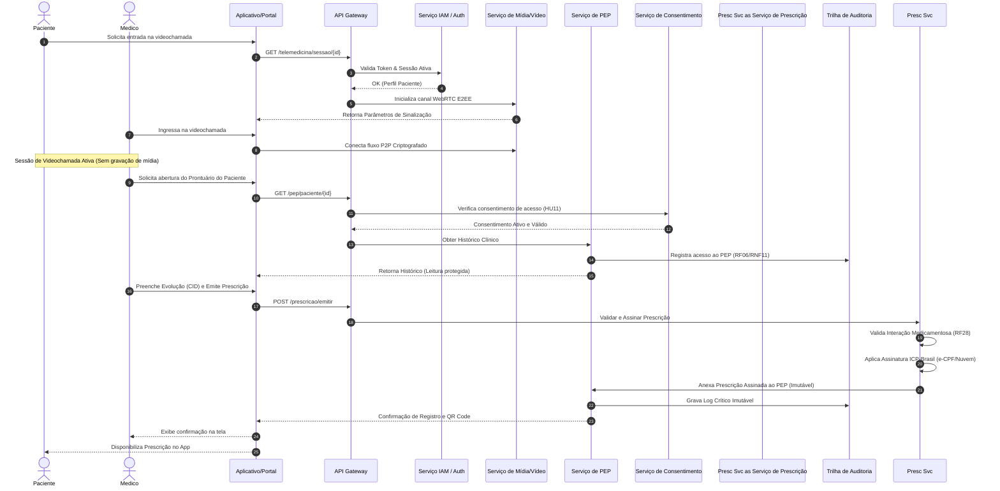

# Relatório Técnico de Arquitetura de Software

## 1. Identificação das HUs

A tabela abaixo compila a rastreabilidade primária das Histórias de Usuário (HUs) fornecidas, associando-as aos respectivos perfis de usuário e capacidades do sistema.

| ID HU | Perfil / Ator | Resumo do Objetivo de Negócio | RFs Relacionados | RNFs Relacionados |
| :--- | :--- | :--- | :--- | :--- |
| **HU01** | Paciente | Auto-cadastro, autenticação MFA e gestão de consentimento LGPD para dados sensíveis. | RF01, RF03, RF04 | RNF01, RNF03, RNF07 |
| **HU02** | Paciente | Agendamento de consultas presenciais/telemedicina com checagem de cobertura TISS/TUSS em tempo real. | RF07, RF08, RF09, RF11 | RNF14, RNF20 |
| **HU03** | Paciente | Ingresso responsivo e seguro em videochamada com criptografia de ponta a ponta (E2EE). | RF14, RF15, RF17, RF18 | RNF04, RNF16, RNF21, RNF22 |
| **HU04** | Paciente | Acesso ao Prontuário Eletrônico do Paciente (PEP), histórico e download de laudos/exames. | RF19, RF21, RF22, RF23, RF24 | RNF02, RNF07, RNF12, RNF15 |
| **HU05** | Paciente | Visualização e compartilhamento seguro de prescrições digitais e receituários especiais. | RF26, RF29, RF30 | RNF06, RNF07, RNF12 |
| **HU06** | Paciente | Recebimento de notificações push/e-mail sobre a emissão de resultados de exames. | RF31, RF32, RF33 | RNF26 |
| **HU07** | Médico | Cadastro de profissional e validação automatizada de status do CRM junto ao CFM. | RF01, RF02, RF04 | RNF01, RNF08 |
| **HU08** | Médico | Registro e assinatura de evoluções clínicas no PEP com garantia de imutabilidade. | RF19, RF20, RF25 | RNF02, RNF10, RNF11 |
| **HU09** | Médico | Emissão de prescrições digitais validadas via certificado digital ICP-Brasil e checagem de interações. | RF26, RF27, RF28, RF30 | RNF06, RNF08 |
| **HU10** | Médico | Solicitação de exames via padrão interoperável e recepção de alertas de valores críticos. | RF31, RF32, RF34, RF35 | RNF25, RNF26 |
| **HU11** | Médico | Consulta a prontuário compartilhado entre especialidades sob consentimento ativo do paciente. | RF06, RF19, RF22, RF23 | RNF05, RNF07, RNF10, RNF11 |
| **HU12** | Admin Clínica | Gestão de corpo clínico, alocação de salas/equipamentos e parametrização de agendas/encaixes. | RF12, RF13, RF42, RF43, RF45 | RNF13, RNF17 |
| **HU13** | Admin Clínica | Monitoramento de faturamento por convênio, métricas de ocupação, emissão TISS e glosas. | RF38, RF40, RF41, RF44 | RNF09, RNF25 |
| **HU14** | Operador Plano | Recepção e processamento de autorizações prévias e liquidação de guias TISS. | RF37, RF38, RF39, RF40 | RNF09, RNF14, RNF26 |

---

## 2. Diagramas de Arquitetura (Mermaid)

### 2.1. Visão Geral de Componentes da Arquitetura

Diagrama lógico dos subsistemas, demonstrando o isolamento entre camadas de apresentação, serviços de negócio, barramentos de integração e persistência com auditoria.

```mermaid
graph TD
    subgraph Client_Layer ["Camada de Apresentação (Agnóstica)"]
        MobileApp["Aplicativo Mobile (iOS / Android)"]
        WebPortal["Portal Web Responsivo"]
    end

    subgraph Edge_Layer ["Camada de Borda & Segurança"]
        APIGateway["Gateway de API & Proxy Reverso"]
        AuthServer["Serviço de Autenticação & IAM (MFA/RBAC)"]
    end

    subgraph Core_Services ["Camada de Serviços de Negócio (Domínio)"]
        AgendamentoSvc["Serviço de Agendamento & Agendas"]
        TelemedicinaSvc["Serviço de Mídia & Sinalização de Vídeo"]
        PEPSvc["Serviço de Prontuário Eletrônico (PEP)"]
        PrescricaoSvc["Serviço de Prescrição & Assinatura ICP"]
        ConsentimentoSvc["Serviço de Consentimento e Privacidade (LGPD)"]
        AdminSvc["Serviço de Gestão Operacional & Faturamento"]
    end

    subgraph Integration_Layer ["Camada de Integração & Interoperabilidade"]
        CFMAdapter["Conector de Validação CRM (CFM)"]
        TISSAdapter["Barramento TISS/ANS (Operadoras)"]
        FHIRAdapter["Barramento HL7 FHIR (Laboratórios)"]
        NotificationSvc["Serviço Notificador (Push/E-mail)"]
        DrugInteractionEngine["Motor de Validação Farmacológica"]
    end

    subgraph Persistence_Layer ["Camada de Persistência & Criptografia"]
        DB_Core[("Base Relacional de Dados Clinicos (AES-256)")]
        DocStore[("Armazenamento de Objetos (Laudos/Imagens)")]
        AuditLedger[("Trilha Imutável de Auditoria (20 Anos)")]
    end

    %% Conexões da Apresentação
    MobileApp --> APIGateway
    WebPortal --> APIGateway

    %% Conexões do Gateway
    APIGateway --> AuthServer
    APIGateway --> AgendamentoSvc
    APIGateway --> TelemedicinaSvc
    APIGateway --> PEPSvc
    APIGateway --> PrescricaoSvc
    APIGateway --> ConsentimentoSvc
    APIGateway --> AdminSvc

    %% Interações de Negócio e Integração
    AuthServer --> CFMAdapter
    AgendamentoSvc --> TISSAdapter
    AgendamentoSvc --> NotificationSvc
    PEPSvc --> ConsentimentoSvc
    PEPSvc --> FHIRAdapter
    PrescricaoSvc --> DrugInteractionEngine
    
    %% Persistência e Segurança
    PEPSvc --> DB_Core
    PEPSvc --> DocStore
    PEPSvc --> AuditLedger
    PrescricaoSvc --> DB_Core
    PrescricaoSvc --> AuditLedger
    AdminSvc --> TISSAdapter
    FHIRAdapter --> NotificationSvc
```

### 2.2. Diagrama de Sequência: Ciclo Completo de Atendimento e Emissão de Prescrição

O diagrama detalha o fluxo end-to-end do ingresso em consulta por telemedicina, verificação de permissões, escrita no PEP e emissão de prescrição assinada.

---

## 3. Decisões de Arquitetura

### AD-01: Modelo de Segurança e Isolamento Baseado em RBAC e ABAC
* **Contexto:** Necessidade de gerenciar acessos restritos entre 5 perfis de usuários distintos (RF01, RF04) e submeter o acesso aos dados sensíveis de saúde ao consentimento do paciente (RF23, RNF07).
* **Decisão:** Adotar uma combinação de Controle de Acesso Baseado em Papéis (RBAC) para operações administrativas gerais e Controle de Acesso Baseado em Atributos (ABAC) para dados clínicos do PEP.
* **Mecanismo:** O atributo de autorização para dados de saúde exigirá a combinação: `(Papel == Medico) AND (ConsentimentoPaciente == Ativo) AND (SessaoAtiva == True)`.
* **Consequência:** Garante o cumprimento do Art. 11 da LGPD e previne vazamento de dados entre especialidades não autorizadas.

### AD-02: Garantia de Imutabilidade e Rastreabilidade do Prontuário Eletrônico
* **Contexto:** Conforme RNF11, RF25 e resoluções CFM nº 1.821/2007 e 2.314/2022, os registros do PEP tornam-se imutáveis após assinatura e devem ter retenção garantida por 20 anos.
* **Decisão:** Implementar um padrão de *Append-Only Ledger Log* para dados clínicos. Nenhuma operação do tipo `UPDATE` ou `DELETE` é permitida no banco de dados do PEP.
* **Mecanismo:** Cada alteração deve ser gravada como um novo "Adendo Identificado", assinado digitalmente e indexado de forma encadeada. Todas as requisições de leitura e escrita geram registros síncronos no componente *Audit Ledger* com selo temporal.
* **Consequência:** Compliance legal absoluto e irretratabilidade jurídica dos documentos clínicos.

### AD-03: Comunicação de Videochamada Descentralizada com Criptografia Ponta a Ponta (E2EE)
* **Contexto:** O RNF04 e a HU03 exigem videochamada integrada sem gravação de conteúdo e com criptografia E2EE para assegurar o sigilo médico.
* **Decisão:** Empregar arquitetura P2P (Peer-to-Peer) utilizando protocolo WebRTC para o tráfego de mídia, mantendo o servidor central exclusivamente para sinalização e autenticação das sessões.
* **Mecanismo:** O estabelecimento de chaves de criptografia ocorre diretamente entre os navegadores/aplicativos dos interlocutores (DTLS/SRTP). O tráfego de mídia não atravessa servidores intermédios de decodificação.
* **Consequência:** Minimização de riscos de vazamento, menor custo de banda centralizada e estrito cumprimento dos requisitos de privacidade.

### AD-04: Estratégia de Interoperabilidade com Padrões Abertos (TISS e HL7 FHIR)
* **Contexto:** Necessidade de comunicação heterogênea com operadoras de planos de saúde (RF38, RF40) e laboratórios parceiros (RF31, RF34).
* **Decisão:** Criar adaptadores de fronteira isolados (*Anti-Corruption Layers*): um barramento adaptado para mensagens no padrão XML TISS (ANS) e outro baseado em APIs RESTful com especificação HL7 FHIR para trocas laboratoriais.
* **Mecanismo:** A aplicação interna opera sobre modelos de domínio neutros, enquanto os adaptadores traduzem os contratos externos em tempo de execução.
* **Consequência:** Alta flexibilidade para integrar novos laboratórios e operadoras sem modificar o núcleo do domínio clínico.

---

## 4. Tabela de Componentes e Rastreabilidade

| Componente | Responsabilidade Principal | Comunica-se com | Origem (HU / Critério de Aceite) |
| :--- | :--- | :--- | :--- |
| **Serviço de Gestão de Identidades (IAM)** | Autenticação centralizada, validação de tokens, execução de MFA (biometria/OTP) e controle de sessão. | Gateway, Serviço CFM, Banco de Dados | RF01, RF03, RF04, RF05 / HU01 |
| **Validador de CRM/CFM** | Integração externa para checagem do status do registro profissional do médico junto aos conselhos regionais/federais. | Serviço IAM, API Externa CFM | RF02 / HU07 |
| **Serviço de Agendamento e Disponibilidade** | Controle das grades de atendimento, reserva de horários em tempo real, gestão de bloqueios e encaixes de urgência. | Gateway, Barramento TISS, Notificador | RF07, RF08, RF10, RF12, RF13 / HU02, HU12 |
| **Barramento TISS/ANS** | Processamento de elegibilidade em tempo real, geração de guias de atendimento, solicitações e faturamento TISS. | Serviço Agendamento, Serviço Admin, APIs Operadoras | RF09, RF36, RF37, RF38, RF39, RF40 / HU02, HU13, HU14 |
| **Serviço de Mídia & Videochamada** | Sinalização de sessões de telemedicina, mediação de conexão WebRTC E2EE e controle de tempo de chamada. | Gateway, Notificador, Clientes Mobile/Web | RF14, RF15, RF16, RF17, RF18 / HU03 |
| **Barramento de Prontuário Eletrônico (PEP)** | Gestão da árvore de prontuários, registros de anamnese, diagnósticos (CID), consolidação do histórico e anexos. | Gestor de Consentimento, Assinador ICP, Storage, Audit Ledger | RF19, RF20, RF21, RF22, RF24, RF25 / HU04, HU08, HU11 |
| **GESTOR de Consentimento LGPD** | Controle do ciclo de vida dos consentimentos para tratamento e compartilhamento de dados sensíveis de saúde. | Serviço PEP, Gateway, Banco de Dados | RF23 / HU01, HU11 |
| **Assinador e Motor de Prescrição** | Emissão de receitas e pedidos de exames, verificação de interações medicamentosas e assinatura ICP-Brasil. | Motor de Interações, Serviço PEP, HSM Nuvem | RF26, RF27, RF28, RF29, RF30 / HU05, HU09 |
| **Motor de Interações Medicamentosas** | Análise algorítmica de compatibilidade entre medicamentos prescritos e históricos de uso do paciente. | Serviço de Prescrição, Base de Conhecimento Farmacológico | RF28 / HU09 |
| **Barramento HL7 FHIR (Laboratórios)** | Envio eletrônico de pedidos de exames e ingestão estandardizada de resultados com análise de parâmetros críticos. | Serviço PEP, Notificador, LIMS Laboratoriais | RF31, RF32, RF33, RF34, RF35 / HU06, HU10 |
| **Serviço Notificador** | Envio de mensagens transacionais em tempo real por canais Push e E-mail. | Agendamento, FHIR, Mídia, Provedores Push/SMTP | RF11, RF18, RF32 / HU02, HU03, HU06, HU10 |
| **Serviço de Auditoria (Audit Ledger)** | Gravação síncrona, imutável e append-only de todos os eventos de leitura e escrita em prontuários. | Todos os componentes do Core Clínico, Storage de Logs | RF06, RNF11 / HU08, HU11 |
| **Serviço Administrativo e Financeiro** | Gestão de unidades de saúde, faturamento por convênio, tabela TUSS e consolidação de métricas operacionais. | Barramento TISS, Serviço PEP, Banco de Dados | RF41, RF42, RF43, RF44, RF45, RF46 / HU13 |

---

## 5. Bloqueios e Pendências

### Bloqueio 01: Indisponibilidade ou Latência Excessiva na API do CFM/CRM
* **Descrição:** O requisito RF02 e a HU07 determinam a verificação síncrona do CRM do médico junto ao CFM no cadastro e em checagens periódicas. Se a API do órgão oficial apresentar instabilidade, cadastros e acessos clínicos podem ficar travados.
* **Impacto:** Bloqueio do fluxo de integração de médicos na plataforma.
* **Ação Recomendada:** Definir estratégia de *fallback* com tolerância a falhas (resiliência com *Circuit Breaker*), permitindo cadastro prévio pendente de validação assíncrona em fila, sem liberar a funcionalidade de atendimento clínico até a confirmação síncrona ou por verificação em lote.

### Bloqueio 02: Impasse Jurídico-Operacional entre Direito ao Esquecimento (LGPD) e Guarda Obrigatória (CFM)
* **Descrição:** A LGPD garante ao paciente o direito de revogação de consentimento e eliminação de dados (HU01, RNF07), contudo a resolução CFM nº 1.821/2007 e o RNF11 exigem a retenção imutável do prontuário por no mínimo 20 anos.
* **Impacto:** Risco de inconsistência legal caso um paciente exija a exclusão definitiva do seu PEP.
* **Ação Recomendada:** Elaborar Parecer Jurídico-Arquitetural aprovado pelo encarregado de dados (DPO). A arquitetura deve implementar a revogação de consentimento impedindo novos acessos clínicos, mantendo os dados históricos em modo de arquivamento legalmente blindado (*Data Anonymization / Cryptographic Erasure* para fins não clínicos) atendendo o art. 16 da LGPD.

### Pendência 01: Definição do Provedor de Certificação Digital em Nuvem (ICP-Brasil)
* **Descrição:** O RNF06 e a HU09 exigem a assinatura digital com certificado ICP-Brasil (e-CPF ou nuvem). A arquitetura necessita definir as interfaces de homologação (PSC - Prestador de Serviço de Confiança).
* **Impacto:** Atraso na especificação da API de integração do módulo de prescrição.
* **Ação Recomendada:** Padronizar a integração via protocolo OAuth2/PKCE padrão OAuth2-Authorized HSM com PSCs homologados pelo ITI/CFM, suportando também carregamento de certificados locais (A1).

---

## 6. Cobertura de Requisitos

A matriz abaixo comprova a total cobertura dos Requisitos Funcionais (RFs) e Não Funcionais (RNFs) pela arquitetura proposta.

| Requisito | Atendido por Componente / Decisão | Status |
| :--- | :--- | :--- |
| **RF01 a RF06** | Serviço IAM, Validador CRM/CFM, Serviço de Auditoria (AD-01, AD-02) | **Coberto** |
| **RF07 a RF13** | Serviço de Agendamento, Barramento TISS, Serviço Notificador | **Coberto** |
| **RF14 a RF18** | Serviço de Mídia & Videochamada (AD-03) | **Coberto** |
| **RF19 a RF25** | Barramento PEP, Gestor de Consentimento, Audit Ledger (AD-01, AD-02) | **Coberto** |
| **RF26 a RF30** | Assinador e Motor de Prescrição, Motor de Interações Medicamentosas | **Coberto** |
| **RF31 a RF35** | Barramento HL7 FHIR, Serviço Notificador | **Coberto** |
| **RF36 a RF41** | Barramento TISS/ANS, Serviço Admin/Financeiro (AD-04) | **Coberto** |
| **RF42 a RF46** | Serviço Administrativo e Financeiro | **Coberto** |
| **RNF01 (TLS 1.2+)** | API Gateway e Comunicação Criptografada na Borda | **Coberto** |
| **RNF02 (AES-256)** | Camada de Persistência com Criptografia em Repouso | **Coberto** |
| **RNF03 (Hash Senhas)** | Serviço IAM com Algoritmos de Hash Seguro | **Coberto** |
| **RNF04 (E2EE Vídeo)** | Arquitetura WebRTC P2P (AD-03) | **Coberto** |
| **RNF05 (Rate Limit)** | API Gateway com Limitação de Taxa e Detecção de Anomalias | **Coberto** |
| **RNF06 (ICP-Brasil)** | Assinador de Prescrição com integração a PSC | **Coberto** |
| **RNF07/08/09/10/11** | Gestor de Consentimento, Barramento TISS, Audit Ledger (AD-01, AD-02, AD-04) | **Coberto** |
| **RNF13 (Disponibilidade 99.9%)** | Implantação Multi-AZ com Escalabilidade Horizontal | **Coberto** |
| **RNF14 (Tempo TISS <5s)** | Barramento TISS com Comunicação Assíncrona/Caching | **Coberto** |
| **RNF15 (PEP <3s)** | Serviço PEP com Caching de Leitura e Modelagem Otimizada | **Coberto** |
| **RNF16 (Latência Vídeo <=150ms)** | Protocolo WebRTC UDP/SRTP via Nós de Mídia Diretos | **Coberto** |
| **RNF18 (Storage Geográfico)** | Componente de Armazenamento de Objetos com Redundância | **Coberto** |
| **RNF23 (RPO 1h / RTO 4h)** | Estratégia de Backup Contínuo e Replicação de Dados | **Coberto** |
| **RNF26 (Interoperabilidade)** | Adaptadores TISS (XML) e HL7 FHIR (AD-04) | **Coberto** |

---

## 7. Gap Analysis

Esta seção mapeia omissões ou ambiguidades encontradas nos requisitos originais, avaliando seu impacto e recomendando ações técnicas saneadoras.

### Gap 01: Ausência de Especificação de Comportamento Offline no Mobile
* **Lacuna Identificada:** Os requisitos (RF24, RNF19) preveem visualização do prontuário e prescrições via app mobile, mas não definem o comportamento da aplicação em cenários de instabilidade ou ausência completa de conectividade à internet.
* **Impacto Arquitetural:** Em emergências médicas ou locais com sinal fraco, o paciente pode ficar impossibilitado de apresentar uma prescrição ou histórico relevante.
* **Ação Recomendada:** Definir política de *Offline-First Local Encrypted Storage* para exibição de prescrições ativas e cartões de emergência no aplicativo mobile, protegidos por autenticação biométrica local do dispositivo.

### Gap 02: Latência Extrema na Consulta Síncrona TISS vs. SLA do Sistema (<5s)
* **Lacuna Identificada:** O RNF14 estipula que a verificação de elegibilidade do plano de saúde deve responder em até 5 segundos. Contudo, os webservices das operadoras de saúde no Brasil frequentemente ultrapassam esse tempo ou apresentam alta taxa de *timeout*.
* **Impacto Arquitetural:** A experiência do usuário no agendamento (HU02) pode ser severamente degradada por falhas externas fora do controle da plataforma.
* **Ação Recomendada:** Implementar um padrão de *Circuit Breaker* associado a uma fila de verificação em segundo plano com notificações assíncronas (*Webhooks* / Push), permitindo o pré-agendamento condicional enquanto a autorização é processada.

### Gap 03: Tratamento de Conflito de Agendas e Bloqueios Simultâneos (Race Condition)
* **Lacuna Identificada:** Os RF07, RF08 e RF13 cobrem o agendamento em tempo real e os encaixes de urgência, mas omitiram a estratégia para lidar com tentativas de reserva simultânea do mesmo horário por múltiplos pacientes.
* **Impacto Arquitetural:** Risco de duplo agendamento (*overbooking*) na grade do médico.
* **Ação Recomendada:** Incorporar um mecanismo de *Distributed Lock* com tempo de expiração curto (ex: retenção temporária por 5 minutos durante o checkout do agendamento) no Serviço de Agendamento.

### Gap 04: Governança do Banco de Dados de Interações Medicamentosas
* **Lacuna Identificada:** O RF28 e a HU09 exigem validação de interações medicamentosas, porém os requisitos não especificam a fonte da base de conhecimento farmacológico ou a frequência de atualização do catálogo.
* **Impacto Arquitetural:** Riscos de responsabilidade civil/médica por alertas desatualizados ou falsos positivos/negativos.
* **Ação Recomendada:** Arquitetar um componente desacoplado (*Motor de Interações Medicamentosas*) preparado para ingerir e indexar bases estruturadas de farmacovigilância reconhecidas pelos órgãos de saúde públicos/privados, isolando a regra de negócio da infraestrutura de dados.