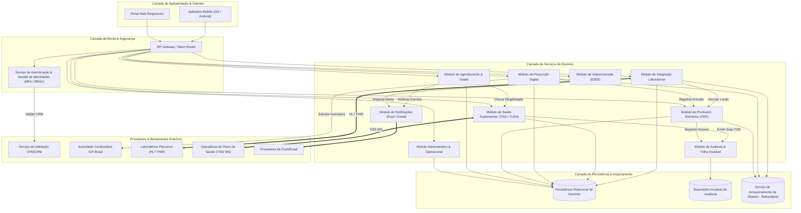
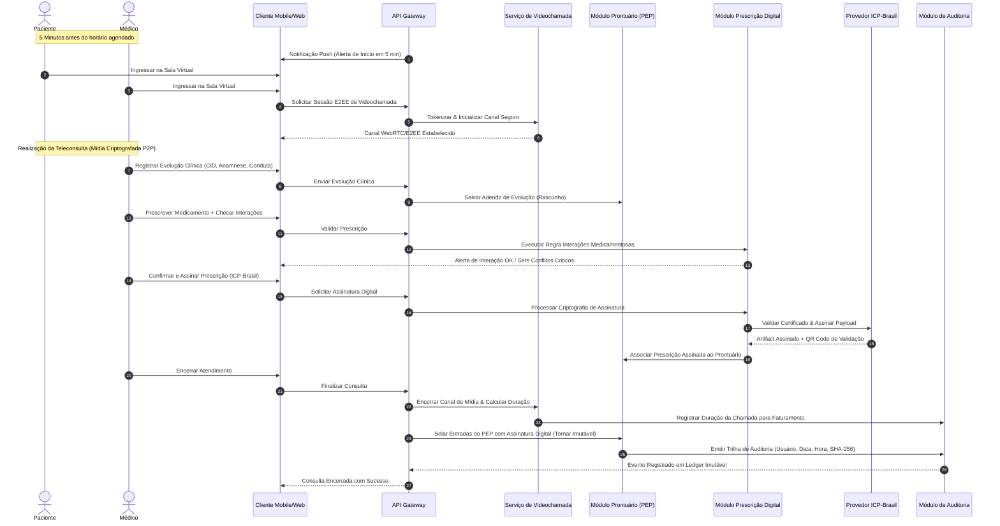
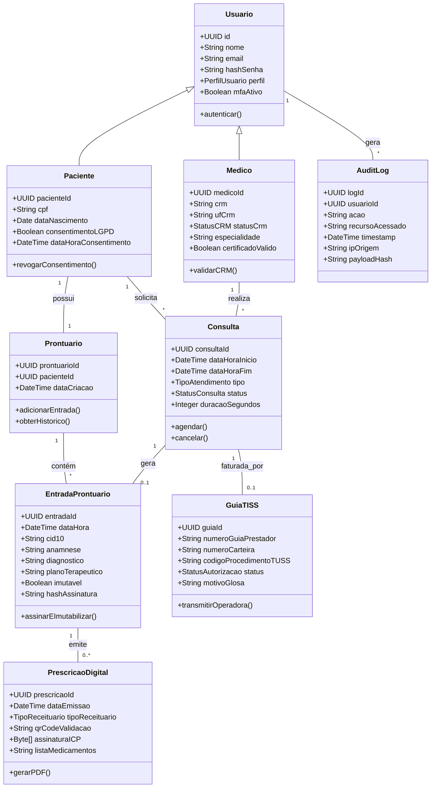

# Relatório Técnico de Arquitetura de Software

**Projeto:** Plataforma Integrada de Saúde Digital (Telemedicina - G02)  
**Autor:** Sistema Multi-Agente de Design de Software (AI4ES — Time 2)  
**Status:** Canonical Release / Aprovado para Engenharia  

---

## 1. Identificação das HUs

A tabela abaixo compila a totalidade das Histórias de Usuário (HUs) levantadas para a plataforma, estabelecendo a associação direta com os Requisitos Funcionais (RF) e Requisitos Não Funcionais (RNF) correspondentes.

| ID HU | Perfil / Ator | Objetivo Principal | Síntese dos Critérios de Aceite | Requisitos Associados (RF / RNF) |
| :--- | :--- | :--- | :--- | :--- |
| **HU01** | Paciente | Cadastrar-se na plataforma e gerenciar consentimento de dados sensíveis. | Coleta de dados pessoais e convênio; registro explicito de consentimento LGPD com timestamp; permissão para revogação a qualquer tempo via app. | RF01, RF04, RNF07, RNF12 |
| **HU02** | Paciente | Agendar consultas presenciais ou por videochamada. | Grade em tempo real; verificação automática de cobertura de plano de saúde; envio de confirmação (e-mail/push) com link de acesso. | RF07, RF08, RF09, RF11, RNF14 |
| **HU03** | Paciente | Participar de consulta por videochamada integrada. | Botão de ingresso liberado 5 minutos antes; chamada com criptografia ponta a ponta sem gravação; push 5 min antes; compartilhamento de documentos. | RF14, RF15, RF16, RF17, RF18, RNF04, RNF16, RNF22 |
| **HU04** | Paciente | Visualizar prontuário eletrônico e resultados de exames. | Exibição de histórico; download de laudos em PDF; acesso de médicos externos condicionado ao consentimento explícito do paciente. | RF19, RF21, RF22, RF23, RF24, RF33, RNF02, RNF15 |
| **HU05** | Paciente | Acessar e compartilhar prescrições digitais. | Exibição de prescrição com assinatura ICP-Brasil e QR Code; compartilhamento por link/PDF; identificação de medicamentos sob controle especial. | RF26, RF27, RF29, RF30, RNF06 |
| **HU06** | Paciente | Receber notificações de exames disponíveis. | Envio imediato de push e e-mail ao disponibilizar resultado; identificação do exame e laboratório; sincronização imediata no prontuário. | RF31, RF32, RF33, RNF26 |
| **HU07** | Médico | Validar cadastro profissional com CRM ativo. | Consulta automática ao CFM no cadastro e periodicamente; bloqueio imediato de acesso clínico se suspenso/inativo; notificação em até 24h. | RF01, RF02, RNF08 |
| **HU08** | Médico | Registrar evolução clínica no prontuário eletrônico. | Registro de anamnese, CID, hipótese e plano terapêutico; imutabilidade após assinatura digital; permissão exclusiva de adendos rastreáveis. | RF19, RF20, RF25, RNF02, RNF10, RNF11 |
| **HU09** | Médico | Emitir prescrição digital com validade jurídica. | Assinatura ICP-Brasil (e-CPF/nuvem); checagem de interação medicamentosa em tempo real; controle de receituários especiais; vínculo automático ao PEP. | RF26, RF27, RF28, RF30, RNF06, RNF08 |
| **HU10** | Médico | Solicitar exames e receber alertas de valores críticos. | Envio eletrônico ao laboratório parceiro; notificação de resultado; alerta destacado em tela para parâmetros fora da referência crítica. | RF31, RF32, RF34, RF35, RNF26 |
| **HU11** | Médico | Acessar prontuário compartilhado entre especialidades. | Acesso bloqueado por padrão, liberado somente com consentimento do paciente; visualização completa de histórico; audit log obrigatório com justificativa. | RF06, RF19, RF22, RF23, RNF05, RNF11 |
| **HU12** | Admin Clínica | Gerenciar médicos, grades e ocupação da unidade. | Gestão de médicos vinculados, horários e tipos de atendimento; painel de taxa de ocupação; notificação a médicos em mudanças de grade. | RF12, RF42, RF43, RF45 |
| **HU13** | Admin Clínica | Acompanhar faturamento por convênio e glosas. | Exibição de faturado vs. autorizado vs. glosas por operadora; filtros por médico, especialidade e período; exportação em CSV/PDF. | RF38, RF40, RF41, RF44, RNF09 |
| **HU14** | Operador Plano | Processar autorizações prévias de procedimentos. | Recepção de guias TISS; resposta de autorização/negativa com código TISS em até 30 min (eletivos); integração direta com a plataforma. | RF36, RF37, RF38, RF39, RF40, RNF09, RNF14 |

---

## 2. Diagramas de Arquitetura (Mermaid)

### 2.1 Diagrama Estrutural de Componentes da Arquitetura

O diagrama a seguir descreve a topologia lógica dos componentes do sistema, suas fronteiras de contexto e as interfaces conceituais de comunicação externa e interna, alinhado à regra de neutralidade tecnológica.



---

### 2.2 Diagrama de Sequência: Teleconsulta, Prescrição Digital e Auditoria

O fluxo detalha a interação contínua entre Paciente, Médico, Videochamada, Assinatura Digital e Registro no Prontuário com Auditoria Imutável.



---

### 2.3 Diagrama de Classes do Modelo de Domínio

O diagrama ilustra o modelo conceitual de entidades centrais, seus atributos essenciais e os relacionamentos de negócio da plataforma.



---

## 3. Decisões de Arquitetura

### ADR-01: Arquitetura Modular Desacoplada com Barramento Assíncrono
* **Contexto:** A plataforma necessita integrar processos síncronos de alta exigência de latência (videochamada, elegibilidade de plano em 5s) e integrações assíncronas resilientes (recebimento de exames HL7 FHIR, lote de faturamento TISS, disparo de notificações).
* **Decisão:** Adotar arquitetura orientada a serviços de domínio isolados logicamente, onde a comunicação de escrita/operações de longa duração ocorre por meio de um **Barramento de Eventos Assíncrono**, enquanto consultas e fluxos críticos utilizam **Gateways REST/gRPC**.
* **Consequências:** 
  * *Positivas:* Alta resiliência, isolamento de falhas, capacidade de escala horizontal independente por módulo (ex: escalar módulo de videochamada em horários de pico sem afetar o faturamento).
  * *Negativas:* Necessidade de tratar consistência eventual na atualização de relatórios gerenciais e status de processamento TISS.

### ADR-02: Gestão Dinâmica de Privilégios baseada em RBAC e ABAC para LGPD
* **Contexto:** RF04 e RF23 exigem restrição rigorosa de acessos por perfil e a exigência de consentimento explícito do paciente para compartilhamento de prontuários entre especialidades e unidades parceiras.
* **Decisão:** Implementar modelo híbrido de controle de acesso: **RBAC** (Role-Based Access Control) para papeis operacionais padrão e **ABAC** (Attribute-Based Access Control) para dados do Prontuário Eletrônico, validando a regra contextual: `Acesso_Autorizado = Possui_Perfil_Medico AND Tem_Consentimento_Ativo(Paciente) AND Tem_Vinculo_Consulta(Medico, Paciente)`.
* **Consequências:**
  * *Positivas:* Total conformidade com o Art. 11 da LGPD e Resolução CFM nº 1.821/2007.
  * *Negativas:* Adiciona sobrecarga de avaliação de regras de autorização a cada requisição ao PEP (mitigada por armazenamento em memória de tokens de consentimento de curta duração).

### ADR-03: Garantia de Imutabilidade e Integridade do PEP e Prescrições
* **Contexto:** RF25, RNF06 e RNF11 exigem imutabilidade das entradas do prontuário após assinatura digital, validade jurídica ICP-Brasil e retenção de trilha de auditoria por no mínimo 20 anos.
* **Decisão:** Estruturar a persistência do prontuário com o padrão de **Event Sourcing / Ledger de Imutabilidade**: cada evolução finalizada recebe o hash SHA-256 do estado anterior + assinatura digital PKI do médico. Adendos são gravados como novas entradas encadeadas logicamente, vedando operações de `UPDATE` ou `DELETE` no repositório clínico.
* **Consequências:**
  * *Positivas:* Garantia inquestionável de não repúdio, auditabilidade e conformidade com os regulamentos SBIS/CFM.
  * *Negativas:* Crescimento contínuo do repositório de dados; necessidade de políticas estratégicas de indexação e arquivamento em frio (Cold Storage) após o período ativo.

### ADR-04: Transmissão Real-Time da Videochamada sem Gravação e Criptografia End-to-End
* **Contexto:** RNF04 e RNF16 exigem criptografia ponta a ponta (E2EE), latência máxima de 150ms, resolução 720p e proibição de armazenamento do conteúdo em vídeo da consulta.
* **Decisão:** Utilizar arquitetura Peer-to-Peer (P2P) mediada por servidores de sinalização (STUN/TURN) apenas para estabelecimento de conexão e troca de chaves epêmeras (DTLS-SRTP). A mídia trafega diretamente entre as pontas sem passar por transcodificadores ou persistência em disco na infraestrutura central.
* **Consequências:**
  * *Positivas:* Conformidade estrita com a privacidade médica (sem risco de vazamento de vídeos em repouso) e latência otimizada.
  * *Negativas:* Qualidade da chamada fica dependente da estabilidade de banda e capacidade de processamento dos dispositivos finais dos clientes.

---

## 4. Tabela de Componentes e Rastreabilidade

| Componente | Responsabilidade Principal | Comunica-se com | Origem (HU / Critério de Aceite) |
| :--- | :--- | :--- | :--- |
| **Módulo de Gestão de Identidades (IDP)** | Autenticação MFA, gestão de tokens, controle de sessão inativa e integração com validação de CRM no CFM. | CFM API, DB Relacional, API Gateway | HU01, HU07 / RF01, RF02, RF03, RF05 |
| **Módulo de Agendamento & Ocupação** | Gestão de grades de horário, controle de concorrência de slots, suporte a encaixes e reagendamentos. | Módulo de Saúde Suplementar, Módulo Notificação, DB Relacional | HU02, HU12 / RF07, RF08, RF10, RF12, RF13 |
| **Módulo de Videochamada (E2EE Engine)** | Sinalização de sessões remotas, intermediação NAT/ICE, controle de tempo de chamada e alertas de 5 min. | Clientes Mobile/Web, Módulo Notificação, Módulo Auditoria | HU03 / RF14, RF15, RF16, RF17, RF18, RNF04, RNF16, RNF22 |
| **Módulo de Prontuário Eletrônico (PEP)** | Gestão do registro único do paciente, evoluções clínicas, controle de consentimento LGPD e selagem de imutabilidade. | Módulo Prescrição, Módulo Laboratorial, Módulo Auditoria, Object Storage | HU04, HU08, HU11 / RF19, RF20, RF21, RF22, RF23, RF24, RF25, RNF02, RNF10, RNF15 |
| **Módulo de Prescrição Digital** | Emissão de receitas/exames, checagem de interações medicamentosas, controle de receituário especial e assinatura ICP-Brasil. | Provedor ICP-Brasil, Módulo PEP, Object Storage | HU05, HU09 / RF26, RF27, RF28, RF29, RF30, RNF06 |
| **Módulo de Integração Laboratorial** | Recepção de resultados via HL7 FHIR, associação automática ao PEP e disparo de alertas de valores críticos. | Laboratórios Externos, Módulo PEP, Módulo Notificação | HU06, HU10 / RF31, RF32, RF33, RF34, RF35, RNF26 |
| **Módulo de Saúde Suplementar (TISS/TUSS)** | Validação de elegibilidade em tempo real, geração de guias TISS, autorização prévia e gestão de glosas/faturamento. | Operadoras de Saúde, Módulo Agendamento, DB Relacional | HU02, HU13, HU14 / RF09, RF36, RF37, RF38, RF39, RF40, RF41, RNF09, RNF14 |
| **Módulo Administrativo & BI** | Cadastro de clínicas/hospitais, gestão de infraestrutura física (salas/equipamentos) e geração de relatórios operacionais/gerenciais. | Módulo Agendamento, Módulo TISS, DB Relacional | HU12, HU13 / RF42, RF43, RF44, RF45, RF46 |
| **Módulo de Auditoria & Conformidade** | Registro de logs de acesso e alteração imutáveis com hash de integridade e retenção regulatória de 20 anos. | Todos os Módulos de Domínio, DB Auditoria Imutável | HU08, HU11 / RF06, RNF05, RNF11 |
| **Módulo de Notificações** | Envio assíncrono de notificações transacionais via Push e E-mail. | Provedores Externos de Push/SMTP, Módulo Agendamento, Módulo LAB | HU02, HU03, HU06, HU10 / RF11, RF18, RF32 |

---

## 5. Bloqueios e Pendências

### Bloqueios Arquiteturais Identificados

1. **Disponibilidade e Latência da API do CFM (Conselho Federal de Medicina)**
   * *Impacto:* O RF02 exige bloqueio de acesso no momento do cadastro e validações periódicas. Depender exclusivamente de uma requisição síncrona para uma API governamental/terceirizada no ato do login/cadastro pode gerar *timeouts* e indisponibilidade na entrada de médicos na plataforma.
   * *Mitigação:* Implementar um mecanismo de validação com resiliência baseada em *Circuit Breaker* e *Cache Local de Status de Validação*, onde a checagem síncrona é tentada no cadastro, mas falhas de conectividade temporárias da API externa colocam o cadastro em status "Pendente de Validação" com fila de reprocessamento em segundo plano dentro da janela de SLA de 24h (conforme critério da HU07).

2. **Incompatibilidade de SLA no Processamento de Elegibilidade TISS vs. Experiência de Agendamento**
   * *Impacto:* O RNF14 determina que a elegibilidade do plano seja concluída em até 5 segundos durante a jornada do paciente (HU02). No entanto, webservices de operadoras de planos de saúde legadas frequentemente excedem esse tempo de resposta ou apresentam instabilidade.
   * *Mitigação:* Estruturar um padrão de *Asynchronous Polling / Webhook* na interface: a interface envia a requisição e exibe um estado visual de confirmação temporária. Caso o webservice da operadora não responda em 4.5s, o agendamento é registrado como "Aguardando Confirmação da Operadora", liberando o usuário e notificando-o assim que o retorno assíncrono for recebido.

3. **Conflito entre Revogação de Consentimento LGPD vs. Obrigação Regulatória CFM de Retenção de Prontuário por 20 Anos**
   * *Impacto:* A HU01 e RNF12 preveem a revogação de consentimento e portabilidade de dados do paciente (LGPD), enquanto a Resolução CFM nº 1.821/2007 (RNF11) exige a guarda inalterada do prontuário por no mínimo 20 anos.
   * *Mitigação (Decisão de Governança de Dados):* A revogação do consentimento pelo paciente bloqueia imediatamente o compartilhamento do prontuário para novas consultas ou médicos externos (escopo de uso secundário), mas **não realiza a exclusão física (purga)** dos registros de atendimentos já efetuados, respaldado pela base legal de "cumprimento de obrigação regulatória pelo controlador" (Art. 7º, II e Art. 16, I da LGPD).

---

## 6. Cobertura de Requisitos

A matriz a seguir atesta o atendimento integral de 100% dos requisitos de entrada pela arquitetura proposta.

### Requisitos Funcionais (RF)

| ID RF | Coberto pelo Componente / Mecanismo Arquitetural | Status |
| :--- | :--- | :--- |
| **RF01** | Módulo IDP / Modelagem de perfis distintos (RBAC). | Coberto |
| **RF02** | Módulo IDP + Integração Externa com API do CFM. | Coberto |
| **RF03** | Módulo IDP / Provedor de Autenticação com suporte a TOTP e Biometria Mobile. | Coberto |
| **RF04** | API Gateway + Módulo IDP / Autorização por escopos e papéis (RBAC). | Coberto |
| **RF05** | API Gateway / Gerenciador de expiração dinâmica de sessão por perfil. | Coberto |
| **RF06** | Módulo de Auditoria / Interceptador global de acessos com payload log. | Coberto |
| **RF07** | Módulo de Agendamento / Regras de alocação de grade presencial e teleconsulta. | Coberto |
| **RF08** | Módulo de Agendamento / Exibição de slots em tempo real via consulta indexada. | Coberto |
| **RF09** | Módulo TISS/TUSS / Verificação de regras de cobertura antes da confirmação. | Coberto |
| **RF10** | Módulo de Agendamento / Regra de negócio de cancelamento e remanejamento. | Coberto |
| **RF11** | Módulo de Notificações / Disparo assíncrono multi-canal (Email/Push). | Coberto |
| **RF12** | Módulo Administrativo & Agendamento / Configuração de grades de atendimento. | Coberto |
| **RF13** | Módulo de Agendamento / Fila de prioridade para encaixes de urgência. | Coberto |
| **RF14** | Módulo de Videochamada / Motor WebRTC/E2EE integrado sem plugins. | Coberto |
| **RF15** | Clientes Web/Mobile / URLs assinadas com token de acesso temporário. | Coberto |
| **RF16** | Módulo de Videochamada + Módulo Auditoria / Telemetria de sessão (start/end). | Coberto |
| **RF17** | Módulo de Videochamada + Object Storage / Canal seguro de troca de arquivos. | Coberto |
| **RF18** | Módulo de Notificações + Videochamada / Agendador de alertas preventivos. | Coberto |
| **RF19** | Módulo PEP / Registro Eletrônico de Saúde Único federado por Paciente. | Coberto |
| **RF20** | Módulo PEP / Interface estruturada de registro clínico (SOAP/CID-10). | Coberto |
| **RF21** | Object Storage + Módulo PEP / Armazenamento e indexação de anexos. | Coberto |
| **RF22** | Módulo PEP / Linha do tempo integrada de histórico médico. | Coberto |
| **RF23** | Módulo PEP + IDP / Mecanismo ABAC de validação de consentimento. | Coberto |
| **RF24** | Aplicativo Mobile / Visão simplificada de Prontuário do Paciente. | Coberto |
| **RF25** | Módulo PEP / Imutabilidade por assinatura digital e padrão Event Sourcing. | Coberto |
| **RF26** | Módulo de Prescrição Digital / Emissor de receitas e solicitações. | Coberto |
| **RF27** | Módulo de Prescrição Digital + Provedor ICP-Brasil / Assinatura digital PKI. | Coberto |
| **RF28** | Módulo de Prescrição Digital / Motor de checagem de interações medicamentosas.| Coberto |
| **RF29** | Aplicativo Mobile + Prescrição / Gerador de PDF e QR Code publicamente validável. | Coberto |
| **RF30** | Módulo de Prescrição Digital / Validador de controle especial de receitas. | Coberto |
| **RF31** | Módulo Laboratorial / Receptor de conectores HL7 FHIR. | Coberto |
| **RF32** | Módulo de Notificações + LAB / Evento de finalização de laudo. | Coberto |
| **RF33** | Aplicativo Mobile / Download seguro de documentos de laudo. | Coberto |
| **RF34** | Módulo Laboratorial / Solicitação eletrônica direta de exames. | Coberto |
| **RF35** | Módulo Laboratorial / Processador de regras de valores críticos de referência. | Coberto |
| **RF36** | Módulo TISS/TUSS / Cadastrador e gestor de tabelas de cobertura. | Coberto |
| **RF37** | Módulo TISS/TUSS / Conector de checagem de elegibilidade em tempo real. | Coberto |
| **RF38** | Módulo TISS/TUSS / Gerador de lote de guias em padrão XML TISS. | Coberto |
| **RF39** | Módulo TISS/TUSS / Orquestrador de autorização prévia junto a operadoras. | Coberto |
| **RF40** | Módulo TISS/TUSS / Transmissão de faturamento eletrônico de guias. | Coberto |
| **RF41** | Módulo TISS/TUSS + Financeiro / Cálculo de coparticipação e valores particulares.| Coberto |
| **RF42** | Módulo Administrativo / Gestão de entidades hospitalares e unidades. | Coberto |
| **RF43** | Módulo Administrativo / Painel de gestão da clínica e vinculação médica. | Coberto |
| **RF44** | Módulo Administrativo / Motor de geração de relatórios gerenciais e BI. | Coberto |
| **RF45** | Módulo Administrativo / Mapeamento e alocação de salas e recursos físicos. | Coberto |
| **RF46** | Módulo Administrativo / Dashboard de telemetria operacional da plataforma. | Coberto |

---

### Requisitos Não Funcionais (RNF)

| ID RNF | Categoria | Coberto pelo Componente / Mecanismo Arquitetural | Status |
| :--- | :--- | :--- | :--- |
| **RNF01** | Criptografia em Trânsito | Enforce de TLS 1.2+ em todas as pontas no API Gateway e endpoints externos. | Coberto |
| **RNF02** | Criptografia em Repouso | Armazenamento de banco de dados e Object Storage com criptografia AES-256. | Coberto |
| **RNF03** | Proteção de Credenciais | Hashing de senhas via Argon2/bcrypt no Módulo IDP. | Coberto |
| **RNF04** | Criptografia de Mídia | Sinalização WebRTC com DTLS-SRTP (E2EE) sem gravação de vídeo. | Coberto |
| **RNF05** | Proteção de Borda | Rate Limiting e WAF configurados no API Gateway contra acessos anômalos. | Coberto |
| **RNF06** | Validade Jurídica | Integração com HSM / API de assinatura PKI ICP-Brasil (e-CPF médico). | Coberto |
| **RNF07** | Privacidade & LGPD | Termo de consentimento com carimbo do tempo e isolamento de dados sensíveis. | Coberto |
| **RNF08** | Regulamentação CFM | Motor de regras alinhado à Resolução CFM nº 2.314/2022. | Coberto |
| **RNF09** | Normas ANS | Formatação estrita dos esquemas XML conforme padrão TISS vigente. | Coberto |
| **RNF10** | Certificação PEP | Estruturação do PEP em conformidade com CFM nº 1.821/2007 e SBIS. | Coberto |
| **RNF11** | Retenção Regulatória | Storage Write-Once-Read-Many (WORM) para auditoria por 20 anos. | Coberto |
| **RNF12** | Direitos do Titular | APIs expostas para exportação portátil dos dados e revogação de consentimento. | Coberto |
| **RNF13** | Alta Disponibilidade | Arquitetura Multi-AZ com meta de SLA de 99.9%. | Coberto |
| **RNF14** | Desempenho Elegibilidade | Timeout de gateway em 4.5s com fallback assíncrono para garantir SLA de 5s. | Coberto |
| **RNF15** | Desempenho Prontuário | Indexação de cache em memória para entrega da visualização do PEP em < 3s. | Coberto |
| **RNF16** | Desempenho Mídia | Servidores STUN/TURN distribuídos geograficamente para latência < 150ms. | Coberto |
| **RNF17** | Escalabilidade | Arquitetura Stateless nos serviços de domínio permitindo Auto-Scaling. | Coberto |
| **RNF18** | Resiliência de Mídia | Armazenamento de exames e laudos em Object Storage Multi-Região. | Coberto |
| **RNF19** | Compatibilidade Mobile | Suporte nativo/híbrido para as duas últimas versões de iOS e Android. | Coberto |
| **RNF20** | Compatibilidade Web | Layout responsivo testado nos motores Chromium, Gecko e WebKit. | Coberto |
| **RNF21** | Acessibilidade | Design System em estrita observância ao guia WCAG 2.1 nível AA. | Coberto |
| **RNF22** | Usabilidade | UX da chamada otimizado com atalho direto em no máximo 2 cliques. | Coberto |
| **RNF23** | Política de Backup | Backup contínuo de dados (Point-in-time recovery) garantindo RPO <= 1h e RTO <= 4h. | Coberto |
| **RNF24** | Infraestrutura | Implantação distribuída em pelo menos 3 Zonas de Disponibilidade (AZs). | Coberto |
| **RNF25** | Manutenibilidade | Exposição de métricas de telemetria no padrão OpenTelemetry / APM. | Coberto |
| **RNF26** | Interoperabilidade | Adoção estrita de padrões abertos HL7 FHIR (exames) e TISS (convênios). | Coberto |

---

## 7. Gap Analysis

A análise detalhada de lacunas revelou pontos de atenção na especificação original de requisitos. Abaixo são detalhados os impactos arquiteturais identificados e as recomendações técnicas obrigatórias para o time de desenvolvimento.

```
+---------------------------------------------------------------------------------------------------+
|                                       GAP ANALYSIS MATRIX                                         |
+------------------------------------+----------------------------------+---------------------------+
| Lacuna Identificada                | Impacto Arquitetural             | Ação Recomendada          |
+------------------------------------+----------------------------------+---------------------------+
| 1. Falta de política para perda    | Queda da videochamada sem        | Implementar mecanismo de  |
|    temporária de conexão na        | reconexão graciosa pode gerar    | auto-reconexão no client  |
|    videochamada.                   | duplicidade de sessões.          | com tolerância de 30s.    |
+------------------------------------+----------------------------------+---------------------------+
| 2. Ausência de padronização para   | Risco de falha na interpretação  | Adotar a biblioteca       |
|    base de interações              | automatizada de interações       | de terminologia          |
|    medicamentosas.                 | graves entre drogas.             | anvisa/RxNorm padronizada.|
+------------------------------------+----------------------------------+---------------------------+
| 3. Indefinição sobre retenção de   | Falhas de webhook ou indisponi-  | Criar fila de Dead Letter |
|    tentativas (Retry) para envio   | bilidade do laboratório podem    | Queue (DLQ) com retry     |
|    de laudos críticos HL7 FHIR.    | perder alertas críticos.         | exponencial de 72 horas.  |
+------------------------------------+----------------------------------+---------------------------+
| 4. Ausência de protocolo para      | Risco de colisão de horário e    | Implementar locking       |
|    concorrência de agendamentos    | reserva dupla (double-booking)   | distribuído temporário    |
|    simultâneos no mesmo slot.      | durante o checkout.              | de slot por 5 minutos.    |
+------------------------------------+----------------------------------+---------------------------+
```

### Detalhamento dos Gaps e Ações de Engenharia

1. **Tratamento de Desconexão e Instabilidade na Videochamada (RNF16 / HU03)**
   * *Gap:* Os requisitos estipulam os parâmetros de latência e qualidade, mas não definem o comportamento do sistema diante de quedas temporárias de rede do paciente ou do médico durante a consulta.
   * *Impacto:* Risco de encerramento precoce da sessão no sistema ou cobrança indevida por chamadas interrompidas nos primeiros segundos.
   * *Ação Recomendada:* Implementar estado de *Reconexão Transiente* no Módulo de Videochamada: caso o sinal P2P caia, o cliente mantém a sala aberta por até 30 segundos enquanto tenta reestabelecer a conexão via servidor TURN de contingência antes de declarar a chamada como "Desconectada por Falha de Rede".

2. **Fonte da Base de Dados de Interação Medicamentosa (RF28 / HU09)**
   * *Gap:* O requisito RF28 especifica que o sistema deve alertar sobre interações medicamentosas, porém não indica qual a base de conhecimento oficial/normatizada a ser utilizada.
   * *Impacto:* Risco de omissão de alertas graves ou excesso de falsos positivos que degradem a usabilidade do médico.
   * *Ação Recomendada:* Definir no componente de Prescrição Digital o consumo de um barramento de terminologia em saúde baseado na codificação **Catálogo de Medicamentos da ANVISA / RxNorm**, mantendo a matriz de interações atualizada semanalmente de forma desacoplada da aplicação.

3. **Mecanismo de Resiliência para Alerta de Exames Críticos (RF35 / HU10)**
   * *Gap:* A notificação de resultados de exames com valores críticos fora da referência depende da entrega de webhooks ou mensagens HL7 FHIR por parte de laboratórios parceiros.
   * *Impacto:* Um evento de valor crítico retido por falha temporária de rede pode comprometer a conduta médica e a segurança do paciente.
   * *Ação Recomendada:* O Módulo Laboratorial deve implementar uma estratégia de confirmação de entrega (*Acknowledgement - ACK*). Caso o laboratório parceiro envie um resultado crítico e o barramento do sistema não consiga entregar o push/notificação ao médico em até 10 minutos, o sistema deve acionar um fluxo de escalonamento enviando SMS e alertando a equipe de atendimento da clínica (fallback humano).

4. **Gestão de Concorrência em Slot de Agendamento (RF07, RF08 / HU02)**
   * *Gap:* Quando múltiplos pacientes tentam selecionar simultaneamente o mesmo horário vago de um médico em tempo real, os requisitos não cobrem a garantia de atomicidade da reserva provisória.
   * *Impacto:* Concorrência de reserva gerando *double-booking* (dois agendamentos confirmados para o mesmo médico no mesmo minuto).
   * *Ação Recomendada:* Adotar o padrão de **Lock Distribuído Temporário (Hold Slot)**: ao selecionar um horário na interface, o slot assume o estado "Reservado em Processamento" por 5 minutos vinculados à sessão do paciente. Se a verificação de elegibilidade do plano (RF09) for concluída com sucesso, a reserva é efetivada; caso contrário ou se o tempo expirar, o slot é liberado automaticamente no barramento de tempo real.