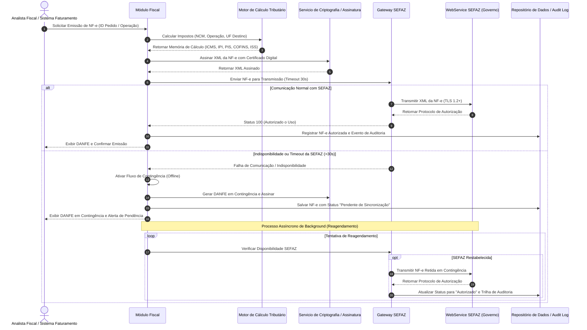

# Relatório Técnico de Arquitetura de Software

## 1. Identificação das HUs

Esta seção mapeia os perfis operacionais e executivos às suas respectivas Histórias de Usuário (HUs), destacando os Requisitos Funcionais (RFs) e Não Funcionais (RNFs) associados, bem como o foco arquitetural primário de cada caso.

| ID HU | Perfil / Papel | Descrição Resumida | RFs Associados | RNFs Associados | Foco Arquitetural Primário |
| :--- | :--- | :--- | :--- | :--- | :--- |
| **HU01** | Planejador de Produção (PCP) | Criar Ordens de Produção (OP) e executar cálculo de MRP automático. | RF05, RF06, RF14 | RNF13, RNF16 | Processamento em lote/assíncrono de alto desempenho, escalabilidade e cálculo de necessidade de materiais. |
| **HU02** | Planejador de Produção (PCP) | Monitorar OEE por centro de trabalho e receber alertas de desvio em tempo real. | RF07, RF08, RF10, RF11, RF12 | RNF12, RNF14, RNF18 | Ingestão de dados em tempo real (Telemetry/IoT), cálculo distribuído de métricas e sistema de notificação por eventos. |
| **HU03** | Comprador / Gestor de Suprimentos | Gerenciar cotações com múltiplos fornecedores e comparar propostas. | RF13, RF15, RF16 | RNF03, RNF19 | Gestão de fluxos de aprovação com alçadas (Workflow Engine) e integração B2B/fornecedores. |
| **HU04** | Comprador / Gestor de Suprimentos | Acompanhar histórico de desempenho de fornecedores (qualidade, prazo, preço). | RF17, RF18, RF19 | RNF14, RNF20 | Agregação analítica de dados históricos e geração de relatórios exportáveis. |
| **HU05** | Analista de Qualidade | Registrar inspeções de lote e bloquear automaticamente lotes reprovados. | RF20, RF21, RF22, RF24 | RNF03, RNF12 | Consistência transacional imediata, bloqueio lógico/físico no estoque e notificações automáticas. |
| **HU06** | Analista de Qualidade | Rastrear lote de matéria-prima desde o recebimento até o produto final expedido. | RF23, RF25 | RNF10, RNF14 | Graph-like/Hierarchical Query traversal (Rastreabilidade bidirecional N-níveis) e trilha de auditoria imutável. |
| **HU07** | Analista Fiscal / Faturamento | Emitir NF-e com cálculo automático de tributos e transmissão à SEFAZ. | RF31, RF32, RF33, RF34 | RNF01, RNF06, RNF07, RNF15, RNF17 | Motor de regras fiscais, integração síncrona/assíncrona com webservices governamentais e fallback para contingência offline. |
| **HU08** | Analista Fiscal / Faturamento | Manter SPED Fiscal e Contribuições atualizados a partir das movimentações. | RF35, RF36, RF48 | RNF08, RNF10 | Transformação de dados transacionais para schemas regulatórios (ETL/Exportação estruturada). |
| **HU09** | Analista de RH / DP | Processar folha de pagamento mensal com encargos, descontos e integração com ponto. | RF37, RF38, RF39, RF41, RF42 | RNF02, RNF03, RNF11 | Motor de cálculo de folha, isolamento de dados sensíveis (LGPD) e integração com dispositivos de ponto. |
| **HU10** | Analista de RH / DP | Gerar obrigações acessórias de RH (eSocial, CAGED, RAIS, DIRF). | RF40 | RNF08, RNF09, RNF10 | Validação de schemas regulatórios governamentais e controle de prazos com alertas. |
| **HU11** | Controller / Diretor Financeiro | Visualizar DRE e Fluxo de Caixa consolidados em tempo real com drill-down. | RF43, RF44, RF45, RF46, RF47, RF49 | RNF02, RNF03, RNF10, RNF14 | Contabilidade por eventos (Event-driven Accounting), consolidação em tempo real e projeção financeira. |
| **HU12** | Diretor / CEO (Executivo) | Acompanhar KPIs operacionais e financeiros em dashboard executivo com drill-down. | RF50, RF51, RF52, RF53 | RNF14, RNF16, RNF24 | Painel analítico de alta performance, consolidação multi-unidade e interface responsiva. |

---

## 2. Diagramas de Arquitetura (Mermaid)

### 2.1. Visão Geral de Componentes da Arquitetura do Sistema (C4 Level 2 / Componentes Conceituais)

```mermaid
graph TB
    subgraph UI_Layer ["Camadas de Apresentação e Interfaces"]
        WEB["Portal Web Responsivo / Dashboard Executivo"]
        IND_GATEWAY["Gateway de Ingestão Chão de Fábrica (OPC-UA / MQTT)"]
        EXT_API["API Gateway para Clientes e Parceiros (REST/JSON)"]
    end

    subgraph Security_Module ["Segurança e Acesso"]
        AUTH["Serviço de Autenticação & Autorização (SSO / AD / RBAC)"]
        AUDIT["Mecanismo de Log e Trilha de Auditoria Imutável"]
    end

    subgraph Core_Business ["Serviços Centrais do ERP"]
        PCP["Módulo de PCP & Cálculo MRP"]
        SUPP["Módulo de Suprimentos & Cotações"]
        QUAL["Módulo de Qualidade & Rastreabilidade de Lotes"]
        LOG["Módulo de Logística & Armazenagem"]
        FISCAL["Módulo Fiscal & Calculadora Tributária"]
        RH["Módulo de RH & Folha de Pagamento"]
        FIN["Módulo Contábil & Financeiro (DRE Real-time)"]
        DASH["Engine de Analytics & KPIs"]
    end

    subgraph External_Integration ["Sistemas Externos / Órgãos Governamentais"]
        SEFAZ["Webservices SEFAZ (NF-e / CT-e)"]
        GOV_RH["Plataformas Governamentais (eSocial / SPED)"]
        BANK["Bancos (Remessa / Pagamentos)"]
        MES["Sistemas Chão de Fábrica (SCADA / MES)"]
    end

    subgraph Data_Layer ["Camada de Dados e Eventos"]
        EVENT_BUS["Barramento de Eventos da Aplicação"]
        DATA_STORE["Repositório Transacional e Histórico Criptografado"]
    end

    %% Relações de Apresentação
    WEB --> AUTH
    WEB --> DASH
    WEB --> PCP
    WEB --> SUPP
    WEB --> QUAL
    WEB --> LOG
    WEB --> FISCAL
    WEB --> RH
    WEB --> FIN

    IND_GATEWAY --> MES
    IND_GATEWAY --> EVENT_BUS
    EXT_API --> EVENT_BUS

    %% Segurança
    PCP & SUPP & QUAL & LOG & FISCAL & RH & FIN --> AUTH
    PCP & SUPP & QUAL & LOG & FISCAL & RH & FIN --> AUDIT

    %% Eventos e Negócio
    PCP --> EVENT_BUS
    QUAL --> EVENT_BUS
    LOG --> EVENT_BUS
    FISCAL --> EVENT_BUS
    RH --> EVENT_BUS
    FIN --> EVENT_BUS

    EVENT_BUS --> DATA_STORE
    AUDIT --> DATA_STORE

    %% Integrações Externas
    FISCAL <--> SEFAZ
    RH <--> GOV_RH
    FIN <--> BANK
```

---

### 2.2. Diagrama de Sequência: Emissão de NF-e e Truncamento de Contingência SEFAZ (HU07, RF31, RF32, RF34, RNF15, RNF17)

---

## 3. Decisões de Arquitetura

### ADR-01: Adoção de Arquitetura Híbrida Orientada a Eventos para Desconexão e Resiliência
* **Contexto:** O sistema necessita interagir com o chão de fábrica via SCADA/MES em tempo real (RF11, RNF18) e emitir NF-e com tolerância a falhas de comunicação da SEFAZ (RF34, RNF17).
* **Decisão:** Adotar um modelo de mensageria assíncrona baseado em eventos para desacoplar a ingestão do chão de fábrica e os processos regulatórios externos dos serviços transacionais centrais. 
* **Consequências:** 
  * *Positivas:* Garante que falhas externas (ex.: indisponibilidade do webservice da SEFAZ) não travem o faturamento do armazém. Mantém a operação fabril isolada de oscilações na rede corporativa.
  * *Negativas:* Introduz complexidade no gerenciamento de estado eventual e na reconciliação de dados em contingência.

### ADR-02: Isolamento Multitenancy/Multi-Unidade com Controle de Acesso Baseado em Papéis e Segregação de Funções (RBAC + SoD)
* **Contexto:** O ERP deve suportar múltiplas unidades fabris com isolamento de dados por hierarquia organizacional (RF01, RF04, RNF16) e segregação estrita de funções fiscais e financeiras (RNF03).
* **Decisão:** Implementar contexto organizacional de segurança injetado em todas as chamadas da aplicação. Cada requisição carrega o token de sessão do usuário contendo suas permissões granulares por unidade fabril, módulo e papel, validado antes de qualquer instrução de banco ou operação de negócio.
* **Consequências:**
  * *Positivas:* Impede vazamento de dados entre plantas fabris distintas e atende plenamente aos requisitos de conformidade e auditoria (RNF03, RNF09).
  * *Negativas:* Exige testes rigorosos de autorização em todas as rotas e consultas do sistema para evitar falhas de escopo.

### ADR-03: Processamento Assíncrono para Cálculos Intensivos (MRP e Consolidação Contábil)
* **Contexto:** O cálculo do MRP para até 50.000 itens (RF06, RNF13) e a atualização da DRE em tempo real (RF45, RNF14) demandam elevado processamento computacional.
* **Decisão:** Isolamento dos motores de cálculo em trabalhadores de background (Background Processors) que consomem filas de execução dedicação exclusiva. O usuário inicia o processamento e recebe atualizações de progresso sem reter a conexão HTTP/UI.
* **Consequências:**
  * *Positivas:* Cumprimento garantido do SLA de 10 minutos para o MRP e eliminação de timeouts na interface com usuário.
  * *Negativas:* Exige coordenação de concorrência para evitar que uma segunda ordem de produção modifique os estoques durante a execução do cálculo.

### ADR-04: Criptografia em Repouso, Trânsito e Trilha de Auditoria Imutável
* **Contexto:** Atendimento às exigências legais da LGPD, CTN (retenção de 10 anos) e requisitos de segurança corporativa (RNF01, RNF02, RNF09, RNF10).
* **Decisão:** Comunicação externa/interna obrigatoriamente sob TLS 1.2+; dados em repouso de RH, financeiro e fiscal criptografados usando algoritmo AES-256; criação de tabela/repositório append-only e assinado para logs de auditoria de operações.
* **Consequências:**
  * *Positivas:* Conformidade legal total e proteção contra violação ou alteração maliciosa de registros retroativos.
  * *Negativas:* Ligeiro impacto de performance nas operações de escrita/leitura de dados sensíveis e aumento no consumo de armazenamento ao longo do período de 10 anos.

---

## 4. Tabela de Componentes e Rastreabilidade

| Componente | Responsabilidade Principal | Comunica-se com | Origem (HU / Critério de Aceite) |
| :--- | :--- | :--- | :--- |
| **Serviço de Autenticação e Acesso** | Gerenciar SSO/AD, autenticação, atribuição de perfis, permissões por fábrica e SoD. | Repositório de Dados, Active Directory / LDAP | HU01-HU12 / RF01, RF02, RF04, RNF03 |
| **Motor de PCP & MRP** | Gerenciar OPs, sequenciamento de máquinas, cálculo de MRP e emissão de alertas de desvio. | Suprimentos, Barramento de Chão de Fábrica, Repositório de Dados | HU01, HU02 / RF05, RF06, RF07, RF09, RF12, RNF13 |
| **Gateway de Ingestão Chão de Fábrica** | Coletar apontamentos, dados de telemetria e status de equipamentos via protocolos industriais (OPC-UA/MQTT). | Sistemas SCADA/MES, Motor de PCP & MRP | HU02 / RF08, RF10, RF11, RNF18 |
| **Módulo de Suprimentos & Compras** | Gerenciar fornecedores, cotações, geração automática de solicitações de compra e OCs por alçada. | PCP, Qualidade, Financeiro, Repositório de Dados | HU03, HU04 / RF13, RF14, RF15, RF16, RF17, RF19 |
| **Módulo de Qualidade & Rastreabilidade** | Gerenciar planos de inspeção, registrar Laudos, aplicar bloqueio de lote e executar rastreabilidade N-níveis. | Suprimentos, PCP, Logística, Repositório de Dados | HU05, HU06 / RF20, RF21, RF22, RF23, RF24, RF25 |
| **Módulo de Logística & Armazenagem** | Controlar endereçamento de WMS, expedição, romaneio, rotas, rastreio e processo de RMA. | Qualidade, Fiscal, Repositório de Dados | HU05, HU06 / RF26, RF27, RF28, RF29, RF30 |
| **Módulo Fiscal & Emissão NF-e** | Realizar cálculo tributário (ICMS, IPI, PIS, COFINS), transmitir NF-e/CT-e à SEFAZ, gerenciar contingência e gerar SPED. | Logística, Financeiro, WebServices SEFAZ, Repositório de Dados | HU07, HU08 / RF31, RF32, RF33, RF34, RF35, RF36, RNF06, RNF07, RNF15, RNF17 |
| **Módulo de RH & Folha de Pagamento** | Manter dados funcionais, integrar ponto eletrônico, calcular folha/encargos e transmitir eSocial/obrigações. | Financeiro, Sistemas de Ponto, Plataformas Governamentais (eSocial) | HU09, HU10 / RF37, RF38, RF39, RF40, RF41, RF42, RNF02, RNF08, RNF09, RNF11 |
| **Módulo Contábil & Financeiro** | Gerar lançamentos contábeis automatizados, DRE real-time, Balanço, Fluxo de Caixa e contas a pagar/receber. | Todos os Módulos de Negócio, Bancos, Repositório de Dados | HU11 / RF43, RF44, RF45, RF46, RF47, RF48, RF49 |
| **Engine de Analytics & Dashboards** | Processar e consolidar KPIs operacionais, OEE, financeiros e permitir navegação drill-down. | Todos os Módulos de Negócio, Interface Usuário | HU02, HU04, HU12 / RF50, RF51, RF52, RF53, RNF14 |
| **Mecanismo de Log e Auditoria** | Gravar eventos imutáveis de todas as operações sensíveis com assinatura de data/hora e identificador. | Todos os Componentes do Sistema, Repositório de Dados | HU01-HU12 / RF03, RNF02, RNF10 |

---

## 5. Bloqueios e Pendências

1. **Volume de Armazenamento para Trilha de Auditoria (10 Anos):**
   * *Pendência:* O requisito RNF10 exige a retenção imutável de logs de auditoria por 10 anos. Falta definir a taxa estimada de transações por segundo para dimensionar o custo de retenção de longo prazo e as políticas de ciclo de vida do repositório (arquivamento frio vs. consulta ativa).
2. **Protocolos dos Relógios de Ponto Existentes:**
   * *Pendência:* O RF38 cita integração com relógios de ponto, porém os modelos e protocolos de comunicação específicos (ex.: REP-C, REP-P, portaria 671 MTE) das fábricas não foram detalhados.
3. **Mecanismo de Reconciliação em Contingência SEFAZ:**
   * *Pendência:* O RNF17 estabelece o envio automatizado pós-contingência da NF-e, mas não especifica a regra de tratamento para o caso em que uma nota emitida em contingência venha a ser rejeitada posteriormente pela SEFAZ por divergência fiscal pré-existente no cadastro do cliente.
4. **Acordo de Nível de Serviço (SLA) para a Rede Industrial (Chão de Fábrica):**
   * *Pendência:* O RF11 requer recepção em tempo real de dados SCADA/MES. É necessário definir a latência máxima suportada pela infraestrutura fabril para evitar inconsistências nos dados de OEE (RF10).

---

## 6. Cobertura de Requisitos

A matriz abaixo comprova a cobertura completa de todos os Requisitos Funcionais e Não Funcionais do projeto.

| Requisito | Coberto por (Componentes / Mecanismos) | Status |
| :--- | :--- | :--- |
| **RF01-RF04** | Serviço de Autenticação e Acesso, Mecanismo de Log e Auditoria | Coberto |
| **RF05-RF12** | Motor de PCP & MRP, Gateway de Ingestão Chão de Fábrica | Coberto |
| **RF13-RF19** | Módulo de Suprimentos & Compras | Coberto |
| **RF20-RF25** | Módulo de Qualidade & Rastreabilidade | Coberto |
| **RF26-RF30** | Módulo de Logística & Armazenagem | Coberto |
| **RF31-RF36** | Módulo Fiscal & Emissão NF-e | Coberto |
| **RF37-RF42** | Módulo de RH & Folha de Pagamento | Coberto |
| **RF43-RF49** | Módulo Contábil & Financeiro | Coberto |
| **RF50-RF53** | Engine de Analytics & Dashboards | Coberto |
| **RNF01-RNF05** | Comunicação TLS 1.2+, Algoritmo AES-256, RBAC+SoD, Rate Limiting | Coberto |
| **RNF06-RNF11** | Motor Tributário, Validador XSD, eSocial/SPED Engine, Assinatura Imutável | Coberto |
| **RNF12-RNF17** | Arquitetura de Alta Disponibilidade, Processadores Assíncronos, Fallback Offline | Coberto |
| **RNF18-RNF20** | Adaptadores OPC-UA/MQTT, API Gateway RESTful, Parsers XML/JSON/CSV | Coberto |
| **RNF21-RNF24** | Sistema de Backup WAL/Diário, Suporte Híbrido, Endpoints de Métricas, Web Responsivo | Coberto |

---

## 7. Gap Analysis

A análise a seguir identifica lacunas de especificação entre as regras de negócio declaradas e os requisitos técnicos exigidos, apontando os impactos e ações mitigatórias.

### Gap 01: Motor de Regras Tributárias e Atualização Legislação Dinâmica
* **Lacuna:** O RF32 exige o cálculo de múltiplos impostos (ICMS, IPI, PIS, COFINS, ISS) considerando NCM e UF, mas os requisitos não especificam como as tabelas de alíquotas e regras fiscais mutáveis serão atualizadas continuamente no sistema.
* **Impacto Arquitetural:** O acoplamento rígido de regras de cálculo no código da aplicação exigirá deploys frequentes e arriscados a cada mudança de legislação fiscal municipal ou estadual.
* **Ação Recomendada:** Isolar a lógica fiscal em um **Motor de Regras de Negócio (Rule Engine)** parametrizável com suporte ao versionamento temporizado de tabelas de alíquotas por vigência.

### Gap 02: Desempenho e Profundidade da Rastreabilidade de Lotes (Graph Traversal)
* **Lacuna:** O RF23 e a HU06 exigem a rastreabilidade completa "desde a matéria-prima até o produto expedido". Em indústrias de manufatura complexa com multi-níveis de subestruturas (BOM), consultas relacionais tradicionais podem apresentar degradação severa de desempenho ao tentar reconstruir a árvore completa de insumos.
* **Impacto Arquitetural:** Risco de violação do tempo de resposta de 5 segundos para consultas analíticas complexas (RNF14).
* **Ação Recomendada:** Modelar o repositório de rastreabilidade com estruturas de dados otimizadas para relacionamento em grafo (ex.: tabelas com queries recursivas otimizadas ou repositório especializado em grafos), pré-calculando as relações de consumo no encerramento de cada Ordem de Produção.

### Gap 03: Ausência de Especificação Formale SLA para Disaster Recovery (RTO / RPO Global)
* **Lacuna:** O RNF21 define um RPO máximo de 1 hora para o backup transacional (WAL), porém não há definição explicita do **RTO (Recovery Time Objective)** para restabelecimento completo do ambiente em caso de falha sistêmica da infraestrutura.
* **Impacto Arquitetural:** Incerteza no dimensionamento da arquitetura de failover (Ativo-Ativo vs. Ativo-Passivo) para garantir a disponibilidade de 99,5% do chão de fábrica (RNF12).
* **Ação Recomendada:** Definir formalmente um RTO máximo de 2 horas e adotar uma estratégia de implantação com redundância geográfica e failover automatizado do repositório de dados.