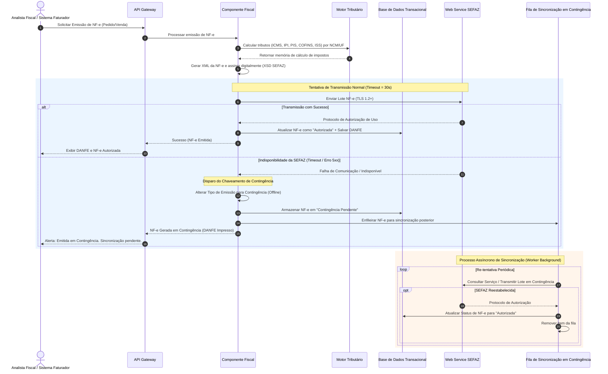

# Relatório Técnico de Arquitetura de Software

## 1. Identificação das HUs

A tabela abaixo mapeia as Histórias de Usuário (HU) com seus respectivos atores, escopo funcional, Requisitos Funcionais (RF) e Requisitos Não Funcionais (RNF) correlacionados.

| HU ID | Perfil / Ator | Resumo da Necessidade | Requisitos Funcionais (RF) | Requisitos Não Funcionais (RNF) |
|---|---|---|---|---|
| **HU01** | Planejador de Produção (PCP) | Criar Ordens de Produção (OP) e executar o cálculo de necessidade de materiais (MRP) gerando solicitações de compra. | RF05, RF06 | RNF13, RNF16 |
| **HU02** | Planejador de Produção (PCP) | Monitorar OEE por centro de trabalho, receber alertas de desvios e realizar drill-down em tempo real. | RF07, RF08, RF10, RF11, RF12 | RNF12, RNF14, RNF18 |
| **HU03** | Comprador / Suprimentos | Gerenciar cotações multifornecedor, comparar propostas automaticamente e emitir Ordens de Compra (OC) via alçadas. | RF13, RF14, RF15, RF16 | RNF03, RNF19 |
| **HU04** | Gestor de Suprimentos | Acompanhar o histórico de desempenho de fornecedores (prazo, qualidade, preço) exportável. | RF13, RF19 | RNF14, RNF20 |
| **HU05** | Analista de Qualidade | Registrar inspeção de lotes por plano de teste e bloquear lotes reprovados automaticamente. | RF20, RF21, RF22, RF24 | RNF02, RNF03 |
| **HU06** | Analista de Qualidade | Rastreabilidade bidirecional completa de lotes (da MP recebida ao produto acabado expedido/cliente). | RF23, RF25 | RNF10, RNF20 |
| **HU07** | Analista Fiscal / Faturamento | Emitir NF-e com cálculo de tributos (ICMS/IPI/PIS/COFINS), transmissão à SEFAZ e fallback para contingência. | RF31, RF32, RF33, RF34 | RNF01, RNF06, RNF07, RNF15, RNF17 |
| **HU08** | Analista Fiscal | Alimentação e validação automatizada dos arquivos do SPED Fiscal (EFD/ECD). | RF35, RF36, RF48 | RNF08, RNF10, RNF20 |
| **HU09** | Analista de RH | Processar folha de pagamento integrada ao ponto eletrônico, encargos (INSS/FGTS/IRRF) e remessa bancária. | RF37, RF38, RF39, RF41, RF42 | RNF02, RNF09, RNF11 |
| **HU10** | Analista de RH | Gerar obrigações acessórias (eSocial, CAGED, RAIS, DIRF) com alertas de prazos legais. | RF40 | RNF08, RNF09, RNF11 |
| **HU11** | Controller / Finanças | Acompanhar DRE em tempo real, Fluxo de Caixa (projetado x realizado) e demonstrativos financeiros com drill-down. | RF43, RF44, RF45, RF46, RF47, RF49 | RNF02, RNF03, RNF10, RNF14 |
| **HU12** | Diretor / Executivo | Dashboard executivo unificado com KPIs consolidados (OEE, Receita, Margem, Qualidade) e navegação hierárquica. | RF50, RF51, RF52, RF53 | RNF14, RNF16, RNF24 |

---

## 2. Diagramas de Arquitetura (Mermaid)

### 2.1 Diagrama Visão Geral de Componentes da Arquitetura (C4 - Nível de Componentes)

O diagrama delimita os módulos do ERP, suas interfaces lógicas e o isolamento entre o consumo de APIs, o barramento de eventos/integração e os dados persistidos.

```mermaid
graph TD
    classDef client fill:#e1f5fe,stroke:#0288d1,stroke-width:2px;
    classDef edge fill:#fff3e0,stroke:#f57c00,stroke-width:2px;
    classDef app fill:#e8f5e9,stroke:#388e3c,stroke-width:2px;
    classDef external fill:#f3e5f5,stroke:#7b1fa2,stroke-width:2px;
    classDef storage fill:#eceff1,stroke:#455a64,stroke-width:2px;

    subgraph Camada_Apresentacao [Camada de Apresentação e Interfaces]
        UI[Interface Web Responsiva]:::client
        MOBILE[Coletores e Aplicações Móveis]:::client
    end

    subgraph Borda_e_Seguranca [Camada de Borda & Segurança]
        GW[API Gateway & Rate Limiter]:::edge
        IAM[Módulo de Identidade, Autenticação e RBAC]:::edge
    end

    subgraph Core_ERP [Módulos da Aplicação ERP]
        PCP[Componente de PCP & MRP Engine]:::app
        SUP[Componente de Suprimentos & Compras]:::app
        QUAL[Componente de Controle de Qualidade]:::app
        LOG[Componente de Logística & Estoque]:::app
        FISC[Componente Fiscal & Motor Tributário]:::app
        RH[Componente de RH & Folha de Pagamento]:::app
        FIN[Componente Contábil & Financeiro]:::app
        DASH[Componente de Aggregation & Dashboards]:::app
    end

    subgraph Integracao_Assincrona [Barramento de Eventos e Integração]
        BUS[Barramento de Mensagens / Event Broker]:::edge
        IOT[Conector Industrial SCADA/MES]:::edge
    end

    subgraph Camada_Persistencia [Camada de Persistência de Dados]
        DB_TRANSACTIONAL[(Base de Dados Transacional)]:::storage
        DB_AUDIT[(Repositório Imutável de Auditoria)]:::storage
    end

    subgraph Sistemas_Externos [Sistemas Externos]
        EXT_AD[Diretório Corporativo Active Directory / LDAP]:::external
        EXT_SEFAZ[Serviços SEFAZ / Governamentais]:::external
        EXT_SCADA[Equipamentos / Sistemas SCADA MES]:::external
    end

    %% Conexões Apresentação -> Borda
    UI --> GW
    MOBILE --> GW
    GW --> IAM

    %% Conexões Autenticação
    IAM --> EXT_AD

    %% Conexões Gateway -> Componentes Core
    GW --> PCP
    GW --> SUP
    GW --> QUAL
    GW --> LOG
    GW --> FISC
    GW --> RH
    GW --> FIN
    GW --> DASH

    %% Integrações de Chão de Fábrica
    EXT_SCADA -->|OPC-UA / MQTT / REST| IOT
    IOT --> BUS
    BUS --> PCP

    %% Fluxos de Eventos Internos
    PCP -->|Eventos de Produção/Consumo| BUS
    SUP -->|Eventos de Recebimento| BUS
    QUAL -->|Eventos de Bloqueio/Inspeção| BUS
    LOG -->|Eventos de Expedição| BUS
    FISC -->|Eventos Fiscais| BUS
    RH -->|Eventos Trabalhistas| BUS

    BUS --> FIN
    BUS --> DASH

    %% Conexões Fiscais Externas
    FISC -->|Transmissão TLS| EXT_SEFAZ

    %% Persistência e Auditoria
    Core_ERP --> DB_TRANSACTIONAL
    Core_ERP -->|Trilha Auditável Append-Only| DB_AUDIT
```

---

### 2.2 Diagrama de Sequência: Emissão de NF-e com Chaveamento de Contingência (HU07 / RF31-RF34 / RNF15, RNF17)

Este diagrama detalha o processo de cálculo de impostos, assinatura, transmissão à SEFAZ e ativação automática do fluxo de contingência com sincronização posterior.

---

## 3. Decisões de Arquitetura

### ADR 01 — Descouplamento e Integração Orientada a Eventos para Chão de Fábrica e Apontamentos
* **Contexto**: O sistema precisa integrar sinais de alta frequência vindos do chão de fábrica (SCADA/MES via OPC-UA/MQTT) com a atualização de estoque, cálculo de OEE e consolidação contábil.
* **Decisão**: Adotar uma arquitetura de integração pub/sub orientada a eventos para o ingestamento de dados industriais. O *Conector Industrial SCADA/MES* normaliza os payloads brutos e publica eventos padronizados no *Barramento de Mensagens*. Os módulos de PCP, Qualidade e Dashboards consomem esses eventos de forma assíncrona.
* **Consequências/Trade-offs**: Elimina o acoplamento direto e protege os bancos transacionais de picos de carga do chão de fábrica. Exige a implementação de mecanismos de idempotência no processamento de eventos para evitar contabilidade dupla de produção.

### ADR 02 — Isolamento do Motor de Cálculo de MRP via Processamento Assíncrono Batch/Worker
* **Contexto**: O cálculo de necessidade de materiais (MRP) deve processar até 50.000 itens ativos em no máximo 10 minutos (RNF13) sem degradar o tempo de resposta das operações online.
* **Decisão**: Executar o cálculo de MRP através de um componente dedicado (*PCP & MRP Engine*) operando via workers assíncronos. O cálculo é disparado por requisição explícita ou agendamento, processando snapshot de dados em memória e gerando requisições de compra e ordens encadeadas via transação isolada.
* **Consequências/Trade-offs**: Evita retentções longas e bloqueios de tabelas (locks) na base transacional primária durante o cálculo. Requer alocação de memória dedicada e consistência eventual momentânea nos relatórios durante o período de execução do cálculo.

### ADR 03 — Estratégia de Fallback Automático para Contingência Fiscal (NF-e)
* **Contexto**: A emissão de NF-e depende de serviços externos de governos estaduais (SEFAZ), sujeitos a indisponibilidade, enquanto a fábrica não pode parar suas rotas de expedição (RNF15, RNF17).
* **Decisão**: Implementar um padrão de resiliência do tipo *Circuit Breaker* no *Componente Fiscal*. Caso a chamada à SEFAZ exceda o timeout configurado ou retorne erros de infraestrutura, o componente chaveia automaticamente para a emissão em contingência, gerando os documentos fiscais autorizados localmente sob regras de contingência legal e enfileirando o payload para sincronização posterior por um worker em segundo plano.
* **Consequências/Trade-offs**: Garante a continuidade operacional das expedições logísticas sem interrupção. Demanda rigoroso controle de duplicidade e validação de consistência ao sincronizar os lotes retidos quando o serviço da SEFAZ restabelecer.

### ADR 04 — Trilhas de Auditoria Imutáveis em Armazenamento Append-Only
* **Contexto**: RNF10 exige a manutenção de trilha de auditoria imutável de operações financeiras, fiscais e de RH por 10 anos, atendendo à LGPD e ao Código Tributário Nacional.
* **Decisão**: Separar os registros de auditoria do banco transacional operacional. Toda alteração de dados sensíveis ou transações críticas emitirá um evento de auditoria assíncrono gravado em um repositório com política de append-only (somente escrita, sem permissão de alteração ou exclusão), indexado por data, hora, usuário, módulo e IP.
* **Consequências/Trade-offs**: Assegura a validade jurídica dos dados e conformidade regulatória sem inchar o banco de dados de produção. Adiciona custo de armazenamento de longo prazo e exige políticas automatizadas de retenção e expiração após o período legal.

---

## 4. Tabela de Componentes e Rastreabilidade

| Componente | Responsabilidade Principal | Comunica-se com | Origem (HU / Critério de Aceite) |
|---|---|---|---|
| **API Gateway & Rate Limiter** | Ponto de entrada unificado, controle de tráfego, roteamento, limitação de taxa de requisições e encriptação TLS. | Interfaces Cliente, Componente IAM, Todos os Componentes Core ERP | RNF01, RNF04, RNF19, RNF24 |
| **Componente de Identidade & RBAC (IAM)** | Autenticação federada SSO via LDAP/AD, gestão de perfis, permissões granulares por unidade fabril e enforcement de SoD. | API Gateway, Diretório AD/LDAP, Banco Transacional | RF01, RF02, RF04, RNF03 |
| **PCP & MRP Engine** | Gestão de OPs, cálculo de MRP, sequenciamento de centros de trabalho, apuração de OEE e emissão de alertas de desvio. | Barramento de Mensagens, Suprimentos, Banco Transacional, SCADA/MES | HU01, HU02, RF05, RF06, RF07, RF08, RF09, RF10, RF12, RNF13 |
| **Conector Industrial SCADA/MES** | Comunicação com equipamentos fabris via OPC-UA/MQTT/REST, captura de dados em tempo real de contagem e status. | Equipamentos SCADA/MES, Barramento de Mensagens | RF11, RNF18 |
| **Componente de Suprimentos & Compras** | Gestão de fornecedores, cotações multifornecedor, alçadas de aprovação de OC e recebimento de mercadorias. | PCP, Qualidade, Contábil/Financeiro, Banco Transacional | HU03, HU04, RF13, RF14, RF15, RF16, RF17, RF18, RF19 |
| **Componente de Controle de Qualidade** | Gestão de planos de inspeção, registro de laudos, bloqueio automático de estoque de lotes reprovados e rastreabilidade. | Suprimentos, Logística/Estoque, PCP, Barramento de Mensagens | HU05, HU06, RF20, RF21, RF22, RF23, RF24, RF25 |
| **Componente de Logística & Armazém** | Endereçamento de armazém, montagem de romaneios, planejamento de expedição e controle de devoluções (RMA). | Qualidade, Componente Fiscal, Banco Transacional | RF26, RF27, RF28, RF29, RF30 |
| **Componente Fiscal & Motor Tributário** | Cálculo automático de tributos (NCM/UF), emissão de NF-e/CT-e, gestão de contingência SEFAZ e geração de SPED. | Logística, Financeiro, Web Services SEFAZ, Fila de Contingência | HU07, HU08, RF31, RF32, RF33, RF34, RF35, RF36, RF48, RNF06, RNF07, RNF15, RNF17 |
| **Componente de RH & Folha** | Gestão de cadastros funcionais, integração com ponto eletrônico, cálculo de folha, encargos e obrigações (eSocial/DIRF/RAIS). | Relógios de Ponto, Contábil/Financeiro, Governo (eSocial), Banco Transacional | HU09, HU10, RF37, RF38, RF39, RF40, RF41, RF42, RNF08, RNF09, RNF11 |
| **Componente Contábil & Financeiro** | Lançamentos contábeis automáticos, contas a pagar/receber, DRE em tempo real, Balanço Patrimonial e Fluxo de Caixa. | Barramento de Mensagens, Todos os Módulos de Origem Transacional, Banco Transacional | HU11, RF43, RF44, RF45, RF46, RF47, RF49 |
| **Aggregator & Dashboards** | Consolidação de KPIs (OEE, Qualidade, Financeiro), suporte a drill-down em 3 cliques e exportação (PDF/Excel). | Barramento de Mensagens, Banco Transacional, Interfaces Usuário | HU02, HU04, HU12, RF50, RF51, RF52, RF53, RNF14 |
| **Engine de Auditoria & Log Imutável** | Captura de eventos auditáveis de negócios e segurança, gravação immutável append-only com retenção legal. | Todos os Componentes Core ERP, Repositório Imutável | RF03, RNF05, RNF10 |

---

## 5. Bloqueios e Pendências

1. **Definição dos Schemas de Payload dos Protocolos Industriais (SCADA/MES)**
   * *Pendência*: O requisito RNF18 menciona suporte a OPC-UA, MQTT ou REST/JSON, porém não especifica os dicionários de dados e estruturas de tópicos padrão por modelo de máquina.
   * *Impacto*: Bloqueia o desenvolvimento final dos drivers do *Conector Industrial SCADA/MES*.
   * *Ação Necessária*: Mapeamento e padronização dos schemas JSON/Tópicos por família de equipamento junto à equipe de Automação Fabril.

2. **Especificação de Regras de Negócio para Tolerância de Erro na Transmissão SEFAZ**
   * *Pendência*: Faltam especificações exatas sobre o tempo limite (timeout) antes de acionar a contingência offline e a janela de retenção máxima de cupons/notas offline antes do bloqueio local.
   * *Impacto*: Riscos de inconsistência fiscal ou rejeição massiva ao reestabelecer conexão.
   * *Ação Necessária*: Definir a matriz de contingência fiscal com o time tributário/jurídico.

3. **Detalhamento dos Algoritmos de Rateio por Centro de Custo para DRE em Tempo Real**
   * *Pendência*: O RF45 exige DRE por centro de custo em tempo real, mas os critérios de rateio indireto de produção e custos fixos não foram detalhados.
   * *Impacto*: Divergência entre o DRE gerado em tempo real e o DRE contábil de fechamento mensal.
   * *Ação Necessária*: Validar com a Controladoria a fórmula exata de apuração de custo indireto em tempo real.

---

## 6. Cobertura de Requisitos

A matriz abaixo comprova a rastreabilidade total de todos os Requisitos Funcionais (RF) e Não Funcionais (RNF).

### Requisitos Funcionais (RF01 a RF53)

| Requisito | Componente Arquitetural Responsável | Estratégia / Decisão de Atendimento |
|---|---|---|
| **RF01** | Componente IAM | Perfis RBAC configuráveis com escopo por Unidade Fabril e Módulo. |
| **RF02** | Componente IAM | Conector de Autenticação Federada integrado com LDAP/Active Directory. |
| **RF03** | Engine de Auditoria & Log Imutável | Interceptador global gravando trilha de auditoria append-only (ADR 04). |
| **RF04** | Componente IAM / Data Access Layer | Filtro multitenancy/multiusina aplicado no nível de consulta de dados. |
| **RF05** | PCP & MRP Engine | Modelagem de dados de OP com roteiro, centro de trabalho e lista de materiais (BOM). |
| **RF06** | PCP & MRP Engine | Processamento assíncrono batch de MRP (ADR 02). |
| **RF07** | PCP & MRP Engine | Algoritmo de sequenciamento e alocação de capacidade de centros de trabalho. |
| **RF08** | PCP & MRP Engine | API de Apontamento de Produção com máquina de estados (Início, Pausa, Fim). |
| **RF09** | PCP & MRP Engine / Logística | Baixa automática de estoque por evento de consumo de produção. |
| **RF10** | PCP & MRP Engine / Dashboards | Engine de apuração contínua do índice OEE (Disponibilidade x Performance x Qualidade). |
| **RF11** | Conector Industrial SCADA/MES | Ingestão pub/sub via protocolo industrial OPC-UA/MQTT (ADR 01). |
| **RF12** | PCP & MRP Engine | Event-driven alerter disparado ao ultrapassar o threshold de desvio configurado. |
| **RF13** | Componente de Suprimentos | Cadastro relacional de fornecedor-item com prazos, moedas e condições. |
| **RF14** | Componente de Suprimentos | Trigger automático disparado no evento de atingimento do ponto de reabastecimento. |
| **RF15** | Componente de Suprimentos | Módulo de cotação com consolidação parametrizável de propostas. |
| **RF16** | Componente de Suprimentos | Engine de workflow para controle de alçadas de aprovação de OCs. |
| **RF17** | Componente de Suprimentos | Tela de conferência de recebimento física e fiscal com conciliação de OC. |
| **RF18** | Componente de Suprimentos / Fiscal | Gestão de RMA de fornecedor integrada à emissão de NF-e de devolução. |
| **RF19** | Componente de Suprimentos | Consolidação histórica de indicadores de desempenho de fornecedores (Vendor Rating). |
| **RF20** | Componente de Qualidade | Cadastro de planos de inspeção e especificações por item/etapa. |
| **RF21** | Componente de Qualidade | Registro de laudos de inspeção por amostragem e parâmetros de tolerância. |
| **RF22** | Componente de Qualidade / Logística | Chaveamento automático do status do lote para "Bloqueado" ao rejeitar laudo. |
| **RF23** | Componente de Qualidade | Grafo/Rastreabilidade bidirecional de lotes da matéria-prima à expedição. |
| **RF24** | Componente de Qualidade | Módulo de Gestão de RNC (Registro de Não Conformidade) com plano de ação. |
| **RF25** | Componente de Qualidade / Dashboards | Emissão de relatórios e relatórios consolidados do custo da não-qualidade. |
| **RF26** | Componente de Logística | Estrutura de endereçamento lógico de armazém (Rua, Prateleira, Box). |
| **RF27** | Componente de Logística | Módulo de montagem de cargas, agrupamento de pedidos e despacho. |
| **RF28** | Componente de Logística / Fiscal | Emissão de romaneio acoplada aos documentos autorizados no Componente Fiscal. |
| **RF29** | Componente de Logística | Atualização de marcos e ocorrências de entrega da frota/transportadora. |
| **RF30** | Componente de Logística | Fluxo de recebimento e inspeção de devoluções de clientes (RMA). |
| **RF31** | Componente Fiscal | Integração síncrona com os webservices da SEFAZ para NF-e modelo 55. |
| **RF32** | Motor Tributário | Regras configuráveis de cálculo de ICMS, IPI, PIS, COFINS, ISS por NCM/UF. |
| **RF33** | Componente Fiscal | Rotinas de evento fiscal de cancelamento e inutilização de numeração. |
| **RF34** | Componente Fiscal | Algoritmo de acionamento e transmissão de contingência offline (ADR 03). |
| **RF35** | Componente Fiscal | Emissão de Conhecimento de Transporte Eletrônico (CT-e). |
| **RF36** | Componente Fiscal | Consolidação e geração de arquivos magnéticos do SPED Fiscal/EFD. |
| **RF37** | Componente de RH | Cadastro unificado do colaborador e histórico de vida funcional. |
| **RF38** | Componente de RH | Módulo de tratamento de ponto com integração a relógios homologados (REP). |
| **RF39** | Componente de RH | Engine de cálculo de folha de pagamento, provisões e encargos legais. |
| **RF40** | Componente de RH | Gerador de layouts das obrigações legais (eSocial, CAGED, RAIS, DIRF). |
| **RF41** | Componente de RH | Controle de concessão de férias, cálculo de 13º e rescisões contratuais (CLT). |
| **RF42** | Componente de RH | Módulo de gestão e elegibilidade de benefícios por categoria. |
| **RF43** | Componente Contábil/Financeiro | Motor de contabilização automática a partir dos eventos de negócio. |
| **RF44** | Componente Contábil/Financeiro | Cadastro de Plano de Contas multinível e centros de custo. |
| **RF45** | Componente Contábil/Financeiro | Apuração dinâmica de DRE em tempo real consolidada/por centro de custo. |
| **RF46** | Componente Contábil/Financeiro | Geração de Balanço Patrimonial e Fluxo de Caixa Direto/Indireto. |
| **RF47** | Componente Contábil/Financeiro | Módulo de Contas a Pagar e Receber com liquidação e baixa de títulos. |
| **RF48** | Componente Fiscal / Contábil | Exportador dos livros digitais do SPED Contábil (ECD) e EFD. |
| **RF49** | Componente Contábil/Financeiro | Motor multi-moeda com tabela de variação cambial e reavaliação periódica. |
| **RF50** | Aggregator & Dashboards | Painéis gráficos executivos consolidados com atualização streaming/near real-time. |
| **RF51** | Aggregator & Dashboards | Sistema de metas e alertas visuais de desvio de KPI. |
| **RF52** | Aggregator & Dashboards | Mecanismo de navegação hierárquica (drill-down até a transação de origem em 3 cliques). |
| **RF53** | Aggregator & Dashboards | Motor de exportação de dados estruturados em PDF e planilha eletrônica (XLSX). |

### Requisitos Não Funcionais (RNF01 a RNF24)

| Requisito | Categoria | Mecanismo Arquitetural de Atendimento |
|---|---|---|
| **RNF01** | Segurança | Encriptação obrigatória de tráfego via TLS 1.2+ terminada no API Gateway. |
| **RNF02** | Segurança | Criptografia AES-256 at-rest para colunas e volumes de dados sensíveis/fiscais/RH. |
| **RNF03** | Segurança | Matriz SoD (Segregação de Funções) aplicada nas alçadas e autorizações do RBAC. |
| **RNF04** | Segurança | Filtro de Rate Limiting e lockout progressivo por IP/usuário no API Gateway. |
| **RNF05** | Segurança | Esteira de desenvolvimento com testes de segurança estáticos (SAST) e testes de penetração. |
| **RNF06** | Conformidade | Motor Tributário parametrizável com atualização dinâmica de regras por UF. |
| **RNF07** | Conformidade | Validação estrita de schemas XSD da SEFAZ antes do envio de documentos. |
| **RNF08** | Conformidade | Validador de esquemas e formatos oficiais do SPED e eSocial. |
| **RNF09** | Conformidade | Mecanismos de governança de dados pessoais, anonimização e consentimento (LGPD). |
| **RNF10** | Conformidade | Armazenamento de logs de auditoria em repositório imutável com retenção legal de 10 anos (ADR 04). |
| **RNF11** | Conformidade | Parametrização de regras CLT e suporte a tabelas de acordos coletivos no módulo de RH. |
| **RNF12** | Disponibilidade | Arquitetura de alta disponibilidade (HA) com meta de SLA de 99,5% no turno produtivo. |
| **RNF13** | Desempenho | Processamento distribuído do cálculo de MRP por workers assíncronos em até 10 minutos. |
| **RNF14** | Desempenho | Camada de cache e consolidação prévia de KPIs garantindo carregamento dos dashboards em até 5 segundos. |
| **RNF15** | Desempenho | Timeout otimizado e conexão dedicada com Web Services da SEFAZ para resposta em até 30s. |
| **RNF16** | Escalabilidade | Design multi-tenant e isolamento lógico por Unidade Fabril com capacidade de expansão horizontal. |
| **RNF17** | Resiliência | Fallback automático para modo contingência fiscal offline com fila de re-sincronização assíncrona. |
| **RNF18** | Interoperabilidade| Conector Industrial SCADA/MES com suporte a OPC-UA, MQTT e REST/JSON. |
| **RNF19** | Interoperabilidade| Exposição de APIs no padrão RESTful com documentação OpenAPI/Swagger. |
| **RNF20** | Interoperabilidade| Módulo de importação/exportação de arquivos estruturados (XML, CSV, JSON, XLSX). |
| **RNF21** | Infraestrutura | Estratégia de backup diário com retenção de 90 dias e gravação contínua de log WAL (RPO <= 1 hora). |
| **RNF22** | Infraestrutura | Implantação orientada a contêineres suportando modelos On-Premises, Nuvem Privada ou Híbrida. |
| **RNF23** | Manutenibilidade| Exposição de métricas operacionais e saúde dos serviços (Health Check) via painel de monitoramento. |
| **RNF24** | Usabilidade | Frontend Web Responsivo baseado em padrões Web modernos sem exigência de plugins proprietários. |

---

## 7. Gap Analysis

| Lacuna Identificada | Requisitos Relacionados | Impacto Arquitetural | Ação Recomendada |
|---|---|---|---|
| **Concorrência de Estoque em Contingência Offline** | RF34, RNF17 | Quando a unidade opera em contingência offline (expedição sem validação síncrona de SEFAZ e rede), pode ocorrer alocação duplicada do mesmo lote para dois pedidos diferentes. | Implementar algoritmo de reserva local temporária de lote (lock lógico por nó de armazém) e processo de reconciliação na sincronização. |
| **Volumetria de Dados de IoT/SCADA vs. Custo de Persistência** | RF11, RNF18 | A ingestão de telemetria contínua em tempo real de equipamentos industriais pode sobrecarregar o banco de dados relacional primário. | Adotar estratégias de armazenamento em duas camadas: dados brutos de alta frequência em banco de séries temporais (Time-Series) e gravação consolidada/agregada no banco transacional. |
| **Latência de Drill-down em 3 Clics em Bases Históricas** | HU12, RF52, RNF14 | O drill-down que parte de um KPI consolidado até o dado transacional bruto de anos anteriores pode ultrapassar o tempo limite de 5 segundos. | Estruturar visões materializadas e tabelas analíticas pré-calculadas para dados históricos, mantendo dados do dia em memória/cache rápido. |
| **Incompatibilidade de Versões de Schemas eSocial / SPED** | RF36, RF40, RNF08 | Mudanças frequentes nas tabelas governamentais (SEFAZ/eSocial) exigem parada de sistema se as regras de cálculo e validação estiverem codificadas de forma rígida (*hardcoded*). | Isolar as regras tributárias e esquemas de validação em um Motor de Regras de Negócio parametrizável e atualizável por arquivo de configuração sem necessidade de novo deploy da aplicação core. |