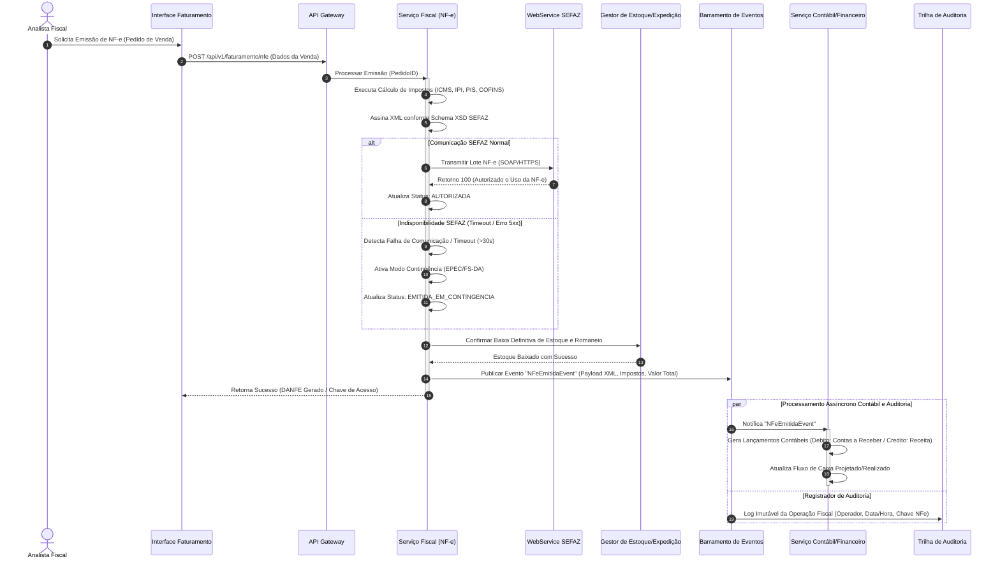

# Relatório Técnico de Arquitetura de Software

**Projeto:** Sistema Integrado de Gestão Empresarial para Manufatura (ERP)  
**Domínio:** Indústria Manufatureira (G03)  
**Autor:** Sistema Multi-Agente de Design de Software (AI4ES — Time 2)  
**Status:** Documento Canônico de Arquitetura  

---

## 1. Identificação das HUs

A tabela a seguir mapeia as Histórias de Usuário (HUs) priorizadas aos Requisitos Funcionais (RF) e Requisitos Não Funcionais (RNF) correspondentes, estabelecendo o escopo arquitetural do sistema.

| ID HU | Perfil / Ator | Resumo do Objetivo | Requisitos Funcionais (RF) | Requisitos Não Funcionais (RNF) |
| :--- | :--- | :--- | :--- | :--- |
| **HU01** | Planejador de Produção (PCP) | Criar Ordens de Produção (OP) e executar cálculo automático do MRP com geração de solicitações de compra. | RF05, RF06 | RNF13 |
| **HU02** | Planejador de Produção (PCP) | Acompanhar OEE por centro de trabalho em tempo real e receber alertas automatizados de desvio. | RF08, RF10, RF11, RF12 | RNF14, RNF18 |
| **HU03** | Comprador / Gestor | Gerenciar cotações multifornecedor e aplicar fluxo de aprovação por alçada em Ordens de Compra (OC). | RF13, RF15, RF16 | RNF03 |
| **HU04** | Gestor de Suprimentos | Analisar histórico de desempenho de fornecedores (prazo, qualidade, preço) com relatórios exportáveis. | RF19 | RNF20 |
| **HU05** | Analista de Qualidade | Registrar inspeções de lote e aplicar bloqueio automático de movimentação/expedição em caso de reprovação. | RF20, RF21, RF22, RF24 | RNF02, RNF10 |
| **HU06** | Analista de Qualidade | Executar rastreabilidade bidirecional do lote (matéria-prima ao produto acabado expedido). | RF23, RF25 | RNF10, RNF20 |
| **HU07** | Analista Fiscal | Emitir NF-e (Modelo 55) com cálculo automatizado de impostos, transmissão SEFAZ e contingência automática. | RF31, RF32, RF33, RF34 | RNF06, RNF07, RNF15, RNF17 |
| **HU08** | Analista Fiscal | Gerar e validar arquivos do SPED Fiscal e Contribuições a partir de movimentações registradas. | RF36, RF48 | RNF08, RNF10 |
| **HU09** | Analista de RH | Processar folha de pagamento mensal integrada ao ponto eletrônico e emitir remessa bancária/eSocial. | RF37, RF38, RF39, RF41 | RNF02, RNF09, RNF11 |
| **HU10** | Analista de RH | Gerar e validar obrigações acessórias trabalhistas (eSocial, EFDR-Reinf, DIRF, etc.). | RF40, RF42 | RNF08, RNF09 |
| **HU11** | Controller | Visualizar DRE e Fluxo de Caixa em tempo real com rastreabilidade *drill-down* até a origem contábil. | RF43, RF44, RF45, RF46, RF47 | RNF02, RNF10 |
| **HU12** | Diretor / Executivo | Monotovar KPIs consolidados através de Dashboard Executivo responsivo com suporte a múltiplos períodos e unidades. | RF50, RF51, RF52, RF53 | RNF14, RNF16, RNF24 |

---

## 2. Diagramas de Arquitetura (Mermaid)

### 2.1 Visão Geral de Componentes e Fronteiras de Contexto (C4 Level 2 - Abstrato)

O diagrama abaixo ilustra a segregação em Contextos Delimitados (*Bounded Contexts*) e a comunicação orientada a serviços/eventos entre os componentes do ERP, integrando os ecossistemas operacionais, administrativos e externos.

```mermaid
graph TB
    subgraph ClientLayer ["Camada de Apresentação & Interfaces"]
        UI_WEB["Interface Web Responsiva (Navegadores Modernos)"]
        UI_DASH["Painel Executivo & BI (Dashboards/KPIs)"]
    end

    subgraph SecurityBoundary ["Fronteira de Segurança & Acesso"]
        GW["API Gateway / Middleware de Roteamento"]
        IAM["Serviço de Autenticação & Autorização (SSO / RBAC / SoD)"]
    end

    subgraph CoreERP ["Núcleo do ERP (Bounded Contexts)"]
        PCP["Motor de PCP & MRP"]
        SUP["Gestão de Suprimentos & Cotações"]
        QUAL["Controle de Qualidade & Rastreabilidade"]
        WMS["Logística, Estoque & Expedição"]
        FISC["Motor Fiscal & Emissão NF-e/CT-e"]
        RH["RH & Folha de Pagamento"]
        CONT["Motor Contábil & Financeiro (DRE / Fluxo de Caixa)"]
        AUDIT["Serviço de Trilha de Auditoria Imutável"]
    end

    subgraph IntegrationLayer ["Camada de Interoperabilidade e Barramento"]
        BUS["Barramento Event-Driven / Integration Broker"]
        EDGE["Gateway Chão de Fábrica (OPC-UA / MQTT / REST)"]
    end

    subgraph ExternalSystems ["Sistemas Externos & Governamentais"]
        AD["Diretório Corporativo (AD / LDAP)"]
        SCADA["Chão de Fábrica (SCADA / MES)"]
        SEFAZ["Servidores SEFAZ (NF-e / CT-e)"]
        GOV["Plataforma eSocial / SPED"]
        BANK["Instituições Bancárias (Remessa/Retorno)"]
    end

    %% Conexões de Apresentação
    UI_WEB --> GW
    UI_DASH --> GW

    %% Segurança e Autenticação
    GW --> IAM
    IAM -.-> AD

    %% Roteamento do Gateway para os Serviços
    GW --> PCP
    GW --> SUP
    GW --> QUAL
    GW --> WMS
    GW --> FISC
    GW --> RH
    GW --> CONT

    %% Comunicação via Barramento de Eventos Interno
    PCP <--> BUS
    SUP <--> BUS
    QUAL <--> BUS
    WMS <--> BUS
    FISC <--> BUS
    RH <--> BUS
    CONT <--> BUS

    %% Trilha de Auditoria Transversal
    PCP -.-> AUDIT
    SUP -.-> AUDIT
    QUAL -.-> AUDIT
    FISC -.-> AUDIT
    RH -.-> AUDIT
    CONT -.-> AUDIT

    %% Integrações Externas
    EDGE <--> SCADA
    EDGE <--> BUS
    FISC <--> SEFAZ
    RH <--> GOV
    FISC -.-> GOV
    CONT <--> BANK
```



---

### 2.2 Diagrama de Sequência: Emissão de NF-e, Contingência, Reserva de Estoque e Integração Contábil Síncrona

O diagrama a seguir detalha o fluxo transacional ponta a ponta desencadeado pelo faturamento e expedição de mercadorias (**HU07**, **HU11**, **RF31**, **RF34**, **RF43**), demonstrando resiliência e acoplamento fraco via eventos.



---

## 3. Decisões de Arquitetura

### AD-01: Estilo Arquitetural Baseado em *Bounded Contexts* e Barramento de Eventos
* **Contexto:** O ERP abrange domínios heterogêneos com diferentes taxas de alteração, regras de negócio complexas e requisitos de integração assíncrona (ex: chão de fábrica vs. fechamento contábil).
* **Decisão:** Adotar uma arquitetura de microsserviços conceituais/serviços de domínio delimitados por *Bounded Contexts* (DDD), interconectados por um Barramento de Eventos de alta disponibilidade.
* **Justificativa:** Garante o desacoplamento entre módulos operacionais (PCP, Qualidade) e financeiros/fiscais, permitindo escalabilidade independente, facilidade de manutenção e tolerância a falhas localizadas.

### AD-02: Mecanismo de Contingência Automatizada para Transmissão Fiscal (SEFAZ)
* **Contexto:** A emissão de NF-e (RF31, RNF15) é crítica para o faturamento e saída de mercadorias. Indisponibilidades na SEFAZ não podem parar a expedição fabril.
* **Decisão:** Implementar um padrão *Circuit Breaker* no Serviço Fiscal. Quando a latência da SEFAZ ultrapassar o limite de 30 segundos (RNF15) ou houver falha de rede, o sistema alterna automaticamente para emissão em Contingência Offline (RF34, RNF17), com fila de ressincronização em segundo plano.
* **Justificativa:** Atende integralmente aos RNF15 e RNF17, garantindo a continuidade operacional da fábrica sem violação fiscal.

### AD-03: Camada de Abstração para Integração de Chão de Fábrica (Edge Industrial Gateway)
* **Contexto:** O sistema deve consumir dados em tempo real de equipamentos (SCADA/MES) via múltiplos protocolos (OPC-UA, MQTT, REST) para cálculo do OEE (RF10, RF11, RNF18).
* **Decisão:** Posicionar um *Industrial Edge Gateway* como intermediário entre a rede operacional (OT) e a rede de TI do ERP. Este gateway traduz protocolos industriais para eventos padronizados no barramento.
* **Justificativa:** Protege a rede interna do ERP contra sobrecarga de alta frequência de eventos de máquinas e isola a complexidade de adaptação de protocolos de hardware.

### AD-04: Trilha de Auditoria Imutável Transversal e Retenção Legada
* **Contexto:** Exigências estritas de conformidade regulatória (RNF10 - CTN 10 anos, LGPD - RNF09) exigem que qualquer alteração fiscal, financeira ou de RH seja inalterável e rastreável.
* **Decisão:** Implementar um Serviço de Auditoria centralizado estruturado sobre um modelo de armazenamento de escrita única e leitura múltipla (*Write Once, Read Many*), registrando contexto, identificador do usuário, *timestamp* UTC e diferencial de dados (*delta*).
* **Justificativa:** Assegura validade jurídica em auditorias e impede a manipulação de dados sensíveis por perfis privilegiados.

---

## 4. Tabela de Componentes e Rastreabilidade

| Componente | Responsabilidade Principal | Comunica-se com | Origem (HU / Critério de Aceite) |
| :--- | :--- | :--- | :--- |
| **Serviço de Autenticação e Acesso (IAM)** | Gerenciar identidades, autenticação via SSO/LDAP, autorização RBAC e políticas de segregação de funções (SoD). | AD/LDAP, API Gateway, Todos os Serviços | RF01, RF02, RF04, RNF03 |
| **Motor de PCP & MRP** | Gestão de Ordens de Produção, cálculo das necessidades de materiais (MRP) e sequenciamento de capacidade. | Suprimentos, WMS, Barramento de Eventos | HU01, RF05, RF06, RF07, RNF13 |
| **Gateway de Chão de Fábrica (Edge)** | Ingestão e normalização de dados operacionais e *status* de máquinas em tempo real via protocolos industriais. | SCADA/MES, PCP/OEE, Barramento de Eventos | HU02, RF08, RF10, RF11, RNF18 |
| **Gestor de Suprimentos & Cotações** | Automação de solicitações de compra, gestão de cotações multifornecedor, aprovações por alçada e histórico de desempenho. | Motor de PCP, WMS, Contábil, Barramento | HU03, HU04, RF13, RF14, RF15, RF16, RF19 |
| **Motor de Qualidade & Rastreabilidade** | Gestão de planos de inspeção, bloqueio automático de lotes reprovados e rastreabilidade bidirecional de insumos/produtos. | WMS, PCP, Barramento, Serviço de Auditoria | HU05, HU06, RF20, RF21, RF22, RF23, RF24, RF25 |
| **Motor Logístico & WMS** | Endereçamento de armazém, planejamento de expedição, geração de romaneios e controle de devoluções (RMA). | Motor Fiscal, Qualidade, Barramento | RF26, RF27, RF28, RF29, RF30 |
| **Motor Fiscal & Emissão SEFAZ** | Cálculo automatizado de tributos, emissão de NF-e/CT-e, tratamento de contingência e geração de arquivos do SPED. | SEFAZ, WMS, Contábil, Barramento | HU07, HU08, RF31, RF32, RF33, RF34, RF35, RF36, RF48, RNF06, RNF07, RNF15, RNF17 |
| **Processador de Folha & RH** | Gestão de cadastro de pessoal, captura de ponto eletrônico, cálculo de folha/encargos e exportação ao eSocial/órgãos. | eSocial/Governo, Bancos, Contábil, Barramento | HU09, HU10, RF37, RF38, RF39, RF40, RF41, RF42, RNF08, RNF09, RNF11 |
| **Motor Contábil & Financeiro** | Contabilização automática de eventos, gestão de contas a pagar/receber, geração de DRE e Fluxo de Caixa em tempo real. | Suprimentos, Faturamento, RH, Barramento | HU11, RF43, RF44, RF45, RF46, RF47, RF49, RNF02 |
| **Serviço de Dashboards & KPIs Executivos** | Consolidação de indicadores em tempo real (OEE, Financeiro, Qualidade), provendo navegação *drill-down* e alertas visuais. | Todos os Serviços de Domínio, Interface UI | HU02, HU12, RF50, RF51, RF52, RF53, RNF14 |
| **Serviço de Trilha de Auditoria Imutável** | Registro centralizado, imutável e temporal de todas as transações fiscais, financeiras e administrativas. | Todos os Serviços do ERP | RNF10 |

---

## 5. Bloqueios e Pendências

1. **Definição dos Critérios de Resolução de Conflitos na Sincronização de Contingência SEFAZ:**
   * *Pendência:* Em casos de emissão prolongada em contingência (RF34/RNF17), não está especificado o protocolo de tratamento caso uma NF-e emitida offline seja rejeitada posteriormente pela SEFAZ por alteração de regra fiscal do governo ocorrida no período offline.
   * *Ação Necessária:* Validar com a equipe fiscal as regras de cancelamento fora do prazo e cartas de correção automatizadas.

2. **Dimensionamento do Volume de Mensageria do Chão de Fábrica (SCADA/MES):**
   * *Pendência:* O requisito RF11 estipula integração via OPC-UA/MQTT, mas não define a frequência (amostragem por segundo/milissegundo) nem a quantidade máxima de sensores acoplados.
   * *Ação Necessária:* Estabelecer a taxa máxima de eventos por segundo (EPS) suportada pelo *Industrial Edge Gateway* para evitar gargalos na apuração do OEE.

3. **Política de Fechamento de Câmbio para Multi-moedas no Módulo Financero:**
   * *Pendência:* O RF49 exige suporte a múltiplas moedas com conversão automática, mas não especifica a fonte oficial (ex: Banco Central) nem a frequência de atualização da taxa de câmbio.
   * *Ação Necessária:* Definir a API/provedor de cotação cambial oficial e a regra para transações ocorridas em finais de semana ou feriados.

---

## 6. Cobertura de Requisitos

A matriz a seguir demonstra a rastreabilidade integral entre os Requisitos de Entrada e os Componentes Arquiteturais projetados.

```
+-----------------------------------------------------------------------------------+
|                        MATRIZ DE COBERTURA ARQUITETURAL                           |
+----------------------+------------------------------------+-----------------------+
| Requisito Entrada    | Componente Arquitetural Responsável | Cobertura / Raciocínio|
+----------------------+------------------------------------+-----------------------+
| RF01, RF02, RF04     | Serviço de Autenticação e Acesso   | Total (RBAC/SSO/Plant)|
| RF03, RNF10          | Serviço de Auditoria Imutável      | Total (Trilha 10 anos)|
| RF05, RF06, RF07     | Motor de PCP & MRP                 | Total (MRP / Capac.) |
| RF08, RF10, RF11, RF12| Gateway Chão de Fábrica / PCP      | Total (OEE / SCADA)   |
| RF13, RF14, RF15, RF16| Gestor de Suprimentos & Cotações   | Total (Cotação/Alçada)|
| RF17, RF18, RF19     | Gestor de Suprimentos / WMS        | Total (Rec./Devol.)   |
| RF20, RF21, RF22, RF24| Motor de Qualidade                 | Total (Bloqueio/NC)   |
| RF23, RF25           | Motor de Qualidade / Rastreab.     | Total (Genealogia)    |
| RF26, RF27, RF28..30 | Motor Logístico & WMS              | Total (Armazém/RMA)   |
| RF31, RF32, RF33..35 | Motor Fiscal & Emissão SEFAZ       | Total (NF-e / CT-e)   |
| RF36, RF48           | Motor Fiscal (Módulo SPED)         | Total (SPED/EFD/ECD)  |
| RF37, RF38, RF39..42 | Processador de Folha & RH          | Total (Folha/eSocial) |
| RF43, RF44, RF45..47 | Motor Contábil & Financeiro        | Total (DRE Real-time) |
| RF49                 | Motor Contábil & Financeiro        | Total (Multi-moeda)   |
| RF50, RF51, RF52, RF53| Serviço de Dashboards Executivos   | Total (KPIs/Drilldown)|
| RNF01, RNF02, RNF04  | Gateway & Infraestrutura           | Total (TLS/AES/Limit) |
| RNF03                | Serviço de Autenticação e Acesso   | Total (SoD / RBAC)    |
| RNF06, RNF07, RNF08  | Motor Fiscal / Processador RH      | Total (Schemas Gover.)|
| RNF09                | Serviço de Autenticação / RH       | Total (LGPD Complian.)|
| RNF12, RNF16, RNF22  | Arquitetura Global do ERP          | Total (99,5% / Nuvem) |
| RNF13                | Motor de PCP & MRP                 | Total (<10 min MRP)   |
| RNF14, RNF15         | Dashboards / Motor Fiscal          | Total (SLA Resposta)  |
| RNF17                | Motor Fiscal & Emissão SEFAZ       | Total (Contingência)  |
| RNF18, RNF19, RNF20  | Camada de Interoperabilidade/APIs  | Total (REST/Protocols)|
| RNF21, RNF23, RNF24  | Camada de Infraestrutura e UX      | Total (WAL/Web/Monit) |
+----------------------+------------------------------------+-----------------------+
```

---

## 7. Gap Analysis

A análise a seguir identifica lacunas de especificação nos requisitos originais, avalia seus impactos na arquitetura e prescreve as ações técnicas recomendadas.

### Gap 01: Frequência e Volume de Dados de Apontamento de Máquinas (SCADA/MES)
* **Descrição da Lacuna:** O **RF11** exige integração com SCADA/MES para receber dados de produção em tempo real, contudo não define o volume diário de eventos nem a amostragem por equipamento.
* **Impacto Arquitetural:** Ingestões síncronas de alto volume diretamente no banco principal do ERP podem causar degradação do desempenho transacional financeiro/contábil, violando o SLA dos dashboards (**RNF14**).
* **Ação Recomendada:** Utilizar o *Gateway Chão de Fábrica* com uma estratégia de pré-agregação de métricas (*edge computing*). Somente mudanças de estado da máquina e consolidados de ciclos produtivos devem ser publicados no Barramento de Eventos.

### Gap 02: Resolução de Conflitos e Atualização de Lançamentos em NF-e Emitidas em Contingência
* **Descrição da Lacuna:** O **RF34** e o **RNF17** preveem a emissão offline e posterior sincronização, mas não detalham o tratamento para o caso em que a SEFAZ rejeitar a nota emitida em contingência após a mercadoria ter deixado a fábrica.
* **Impacto Arquitetural:** Pode ocasionar descasamento entre o estoque fisicamente expedido (WMS) e a escrituração fiscal/contábil (**RF31**, **RF43**).
* **Ação Recomendada:** Implementar um fluxo de exceção fiscal (*Workflow* de Estorno/Retificação) no Motor Fiscal, bloqueando o fechamento do período fiscal até que todas as notas pendentes na fila de contingência sejam homologadas ou corrigidas via carta de correção/cancelamento extemporâneo.

### Gap 03: Mecanismo de Purga x Retenção de Dados de Auditoria (10 Anos)
* **Descrição da Lacuna:** O **RNF10** impõe retenção imutável de dados fiscais/financeiros por 10 anos, enquanto o **RNF21** estabelece retenção de backup diário por 90 dias. Falta a especificação sobre o ciclo de vida e arquivamento de dados operacionais de alta frequência.
* **Impacto Arquitetural:** Crescimento descontrolado do volume de dados (*data bloat*), impactando negativamente o tempo de execução do MRP (**RNF13**, limite de 10 min).
* **Ação Recomendada:** Adotar o padrão de *Data Tiering* (Armazenamento em Camadas): Dados Quentes (últimos 12 meses) mantidos no Repositório Transacional Ativo; Dados Frios (anos 2 a 10) migrados automaticamente para Repositório Histórico Read-Only otimizado para auditoria e consultas fiscais.

### Gap 04: Regra de Consistência para Transações Multi-Unidade (Intercompany)
* **Descrição da Lacuna:** O **RF04** e o **RNF16** especificam o isolamento de dados por unidade fabril com consolidação centralizada, porém não definem as regras para transferência de estoque entre unidades (venda *intercompany*).
* **Impacto Arquitetural:** Ausência de automatização para emissão simultânea de NF-e de saída na unidade origem e NF-e de entrada/recebimento na unidade destino.
* **Ação Recomendada:** Implementar no Motor de Logística e Fiscal um orquestrador de processos *Intercompany*, que gera automaticamente a Ordem de Compra espelhada e automatiza o recebimento fiscal entre filiais do mesmo grupo industrial.