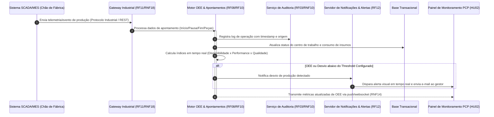
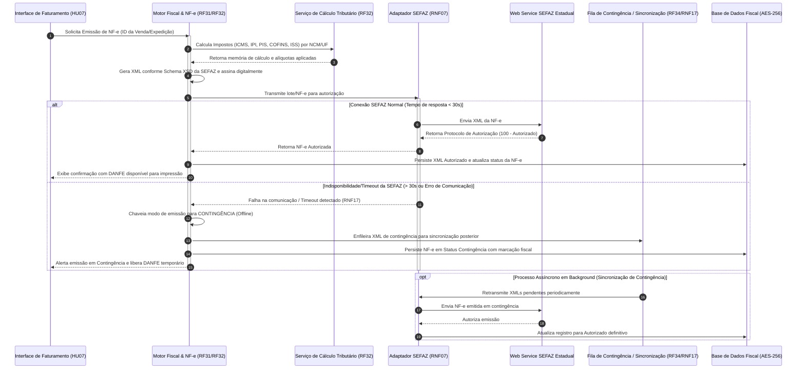

# Relatório Técnico de Arquitetura de Software

**Projeto:** Sistema Integrado de Gestão Empresarial para Manufatura (ERP)  
**Domínio:** Indústria Manufatureira (G03)  
**Autor:** Sistema Multi-Agente de Design de Software (AI4ES - Time 2)  
**Data:** 24 de Maio de 2024  

---

## 1. Identificação das HUs

Abaixo apresenta-se a consolidação das Histórias de Usuário (HUs) extraídas dos requisitos de negócio, categorizadas por perfil de acesso e mapeadas para seus respetivos requisitos funcionais e não funcionais.

| ID | Perfil | Descrição Resumida | Requisitos Associados | Critérios de Aceite Chave |
| :--- | :--- | :--- | :--- | :--- |
| **HU01** | Planejador de Produção (PCP) | Criar Ordens de Produção (OP) e executar o cálculo automático de MRP. | RF05, RF06, RNF13 | Associação de produto/roteiro; cálculo de necessidade líquida; geração de solicitações de compra. |
| **HU02** | Planejador de Produção (PCP) | Monitorar OEE e desvios de produção em tempo real por centro de trabalho. | RF08, RF10, RF12, RNF14, RNF18 | Cálculo de OEE; emissão de alertas em caso de desvio acima do *threshold*; *drill-down* de perdas. |
| **HU03** | Comprador / Gestor de Suprimentos | Gerenciar cotações com múltiplos fornecedores e comparar propostas. | RF13, RF15, RF16, RNF03 | Envio para múltiplos fornecedores; comparação por preço/prazo/qualidade; aprovação por alçada. |
| **HU04** | Gestor de Suprimentos | Acompanhar histórico de desempenho de fornecedores. | RF19, RNF14, RNF20 | Exibição de pontualidade, taxa de rejeição e variação de preço; filtros por período/item; exportação. |
| **HU05** | Analista de Qualidade | Registrar inspeções de lote e bloquear automaticamente lotes reprovados. | RF20, RF21, RF22 | Registro de parâmetros medidos; bloqueio automático no estoque; notificação de responsáveis. |
| **HU06** | Analista de Qualidade | Rastrear lotes de matérias-primas até o produto acabado expedido. | RF23, RNF10 | Rastreabilidade bidirecional completa (NF entrada $\rightarrow$ OP $\rightarrow$ NF-e saída); exportação em PDF. |
| **HU07** | Analista Fiscal / Faturamento | Emitir NF-e com cálculo automático de impostos e suporte à contingência. | RF31, RF32, RF34, RNF06, RNF07, RNF15, RNF17 | Cálculo de impostos por NCM/UF; transmissão $<30s$; chaveamento automático para contingência. |
| **HU08** | Analista Fiscal / Faturamento | Gerar e manter o SPED Fiscal atualizado a partir das movimentações. | RF36, RF48, RNF08, RNF10 | Geração automática a partir de entradas/saídas; validação de estrutura/regras; retenção auditável. |
| **HU09** | Analista de RH / DP | Processar a folha de pagamento mensal com encargos e integração de ponto. | RF37, RF38, RF39, RNF02, RNF11 | Apuração de ponto; cálculo de INSS/FGTS/IRRF; geração de arquivo de remessa bancária e eSocial. |
| **HU10** | Analista de RH / DP | Gerar obrigações acessórias de RH (eSocial, CAGED, RAIS, DIRF). | RF40, RNF08, RNF09 | Emissão no layout vigente; alertas de prazos com 5 dias úteis de antecedência; validação antes do envio. |
| **HU11** | Controller / Dir. Financeiro | Visualizar DRE e Fluxo de Caixa atualizados em tempo real. | RF43, RF45, RF46, RF47, RNF02 | Visão consolidada e por centro de custo; distinção efetuado vs. projetado; *drill-down* até lançamento. |
| **HU12** | Diretor / CEO | Acompanhar KPIs operacionais, financeiros e de qualidade em painéis executivos. | RF50, RF51, RF52, RF53, RNF14 | Exibição de OEE, margem, qualidade; destaque visual de desvios; *drill-down* transacional em até 3 cliques. |

---

## 2. Diagramas de Arquitetura (Mermaid)

### 2.1. Visão Geral da Arquitetura de Componentes

O diagrama a seguir descreve a visão lógica modular da arquitetura do ERP Manufatura, aplicando a separação de responsabilidades por domínios contextuais (DDD - *Domain-Driven Design*), serviços de integração e camadas de dados auditáveis.

```mermaid
graph TB
    subgraph UI_Layer ["Camada de Apresentação & Acesso (Navegador Web / Responsivo)"]
        UI_Exec ["Painel Executivo & Dashboards (HU12)"]
        UI_PCP ["Módulo PCP & Chão de Fábrica (HU01, HU02)"]
        UI_Qual ["Módulo de Qualidade (HU05, HU06)"]
        UI_Sup ["Módulo de Suprimentos (HU03, HU04)"]
        UI_Fisc ["Módulo Fiscal & Financeiro (HU07, HU08, HU11)"]
        UI_RH ["Módulo de RH & Pessoal (HU09, HU10)"]
    end

    subgraph Security_Gateway ["Gateway de API & Controle de Acesso"]
        APIGW ["API Gateway / Load Balancer (RNF01, RNF04)"]
        AuthSvc ["Serviço de Autenticação & Identidade / SSO (RF01, RF02, RF04)"]
        AuditSvc ["Serviço de Auditoria & Trilha Imutável (RF03, RNF10)"]
    end

    subgraph Domain_Services ["Camada de Serviços de Domínio (Business Logic)"]
        PCP_Svc ["Motor de PCP & MRP Engine (RF05, RF06, RF07, RNF13)"]
        OEE_Svc ["Motor de OEE & Alertas (RF08, RF10, RF12)"]
        Quality_Svc ["Serviço de Qualidade & Rastreabilidade (RF20-RF25)"]
        Supply_Svc ["Serviço de Suprimentos & Compras (RF13-RF19)"]
        Fiscal_Svc ["Motor Fiscal & NF-e Engine (RF31-RF36, RNF07, RNF15, RNF17)"]
        HR_Svc ["Motor de Folha & RH (RF37-RF42, RNF11)"]
        Fin_Svc ["Serviço Financeiro & Contabilidade DRE (RF43-RF49)"]
        Analytics_Svc ["Serviço de Analytics & KPIs (RF50-RF53, RNF14)"]
    end

    subgraph Integration_Layer ["Camada de Interoperabilidade & Integração Externa"]
        Ind_Gateway ["Gateway de Integração Industrial SCADA/MES (RF11, RNF18)"]
        SEFAZ_Adapter ["Adaptador SEFAZ / Contingência (RF31, RF34, RNF17)"]
        Gov_Adapter ["Adaptador eSocial / SPED / Gov (RF36, RF40, RNF08)"]
        LDAP_Adapter ["Adaptador LDAP / Active Directory (RF02)"]
    end

    subgraph Persistence_Layer ["Camada de Armazenamento & Dados Criptografados"]
        Transactional_DB [(Base Transacional Operational Data Store - AES-256)]
        Audit_Store [(Repositório de Auditoria Imutável - RNF10)]
        Analytics_Store [(Repositório Analítico de Read-Models / Datamart)]
    end

    %% Relações de Entrada
    UI_Layer --> APIGW
    APIGW --> AuthSvc
    APIGW --> AuditSvc
    APIGW --> Domain_Services

    %% Relações entre Domínios
    PCP_Svc --> Quality_Svc
    PCP_Svc --> Supply_Svc
    Quality_Svc --> Supply_Svc
    Fiscal_Svc --> Fin_Svc
    HR_Svc --> Fin_Svc
    Supply_Svc --> Fin_Svc
    Domain_Services --> Analytics_Svc

    %% Relações de Integração
    OEE_Svc <--> Ind_Gateway
    Fiscal_Svc <--> SEFAZ_Adapter
    HR_Svc <--> Gov_Adapter
    Fiscal_Svc <--> Gov_Adapter
    AuthSvc <--> LDAP_Adapter

    %% Relações de Persistência
    Domain_Services --> Transactional_DB
    AuditSvc --> Audit_Store
    Analytics_Svc --> Analytics_Store
```

---

### 2.2. Diagrama de Sequência: Apontamento de Produção, Cálculo de OEE e Emissão de Alertas (HU02)

O diagrama abaixo ilustra o fluxo síncrono e assíncrono desde a captação de dados no chão de fábrica via SCADA/MES até o processamento de OEE, atualização do painel executivo e disparo de alertas de desvio de produção.



---

### 2.3. Diagrama de Sequência: Emissão de NF-e com Chaveamento Automático de Contingência (HU07)

Este fluxo detalha a inteligência de resiliência aplicada ao módulo fiscal durante a transmissão da Nota Fiscal Eletrônica à SEFAZ.



---

## 3. Decisões de Arquitetura

Para responder aos rígidos requisitos operacionais, de desempenho, fiscais e regulatórios, foram estabelecidas as seguintes decisões diretivas de arquitetura:

### 3.1. Estilo Arquitetural: Monolito Modular Orientado a Eventos Internos
*   **Justificativa:** O domínio industrial e fiscal exige forte consistência transacional (ACID) em fluxos como apontamento de estoque, cálculo contábil e rastreabilidade de lotes (RF09, RF23, RF43), inviabilizando a complexidade e a consistência eventual de microserviços puros na camada core. Optou-se por um **Monolito Modular** com fronteiras de contexto bem definidas (PCP, Fiscal, RH, Qualidade), combinado com barramento de eventos assíncronos em memória/mensageria para integrações de chão de fábrica (SCADA/MES) e relatórios de analytics.

### 3.2. Estratégia de Isolamento Multi-Unidade e Multitenancy Lógico (RF04, RNF16)
*   **Justificativa:** Para atender ao requisito RNF16 (suporte a múltiplas unidades fabris com isolamento e consolidação), a arquitetura adotará isolamento lógico baseado em nível de tenant/unidade (*Plant Context Isolation*). Todas as consultas à camada de persistência passam por um filtro global de contexto atrelado à sessão do usuário (RF01, RF04), garantindo a segregação de dados sem duplicar infraestrutura física.

### 3.3. Padrão Store-and-Forward para Contingência Fiscal (RF34, RNF17)
*   **Justificativa:** A alta disponibilidade do faturamento é vital para o despacho logístico. A emissão em contingência implementará o padrão *Store-and-Forward*: caso a SEFAZ fique indisponível, o sistema gera o XML em contingência (com assinatura e número offline), libera a expedição local e armazena o evento em uma fila de sincronização com retentativas automáticas (*exponential backoff*).

### 3.4. Separação de Leitura e Escrita para Analytics/KPIs (CQRS Pattern) (RF50, RNF14)
*   **Justificativa:** O cálculo de dashboards executivos complexos e DRE em tempo real (RF45, RF50) no mesmo modelo relacional de escrita causaria gargalos de concorrência com o processamento transacional (apontamentos de fábrica e notas fiscais). Os dados para os dashboards serão consolidados de forma assíncrona em uma visualização/modelo otimizado para leitura (*Read Model / Datamart*), garantindo tempo de resposta inferior a 5 segundos (RNF14).

### 3.5. Modelo de Criptografia e Auditoria Imutável (RNF02, RNF10)
*   **Justificativa:** Dados de RH, financeiros e fiscais exigem criptografia em repouso via algoritmo AES-256 (RNF02). As ações de auditoria serão gerenciadas por um componente centralizado que grava registros imutáveis (*append-only*), garantindo a retenção mínima legal de 10 anos (RNF10 e LGPD) sem permitir alteração nem exclusão por usuários administradores.

---

## 4. Tabela de Componentes e Rastreabilidade

A tabela a seguir estabelece o mapeamento direto entre os componentes arquiteturais abstratos, suas responsabilidades técnicas, interfaces com as quais se comunicam e sua origem nos Requisitos Funcionais e Histórias de Usuário.

| Componente | Responsabilidade Principal | Comunica-se com | Origem (HU / Critério de Aceite) |
| :--- | :--- | :--- | :--- |
| **Gateway de API & Autenticação** | Centralizar a recepção de requisições, efetuar autenticação SSO via LDAP/Active Directory, aplicar *rate limiting* e filtrar permissões granulares por unidade fabril. | Adaptador LDAP, Serviço de Auditoria, Serviços de Domínio | RF01, RF02, RF04, RNF01, RNF04 |
| **Serviço de Auditoria Imutável** | Registrar de forma inalterável todas as operações financeiras, fiscais, de RH e de acessos com data, hora e usuário, garantindo temporalidade. | Todos os Serviços de Domínio, Repositório de Auditoria | RF03, RNF03, RNF10 |
| **Motor de PCP & MRP** | Gerenciar OPs, calcular a necessidade de materiais (MRP) considerando saldos e demandas, e realizar o sequenciamento dos centros de trabalho. | Serviço de Suprimentos, Serviço de Qualidade, Base Transacional | HU01, RF05, RF06, RF07, RNF13 |
| **Motor de OEE & Alertas** | Receber eventos de produção, apurar Disponibilidade, Performance e Qualidade, e disparar notificações ao ultrapassar *thresholds*. | Gateway Industrial, Servidor de Notificações, Painel PCP | HU02, RF08, RF10, RF12, RNF14, RNF18 |
| **Gateway de Integração Industrial** | Adaptar e converter protocolos industriais (OPC-UA, MQTT, REST) para mensagens de domínio ERP em tempo real. | Sistemas SCADA/MES, Motor de OEE | RF11, RNF18 |
| **Serviço de Qualidade & Rastreabilidade** | Registrar planos e resultados de inspeção de lotes, realizar o bloqueio automático de saldo e manter a cadeia de rastreamento de lotes. | Motor de PCP, Serviço de Suprimentos, Base Transacional | HU05, HU06, RF20, RF21, RF22, RF23, RF24 |
| **Serviço de Suprimentos & Cotações** | Gerenciar cadastro de fornecedores, automatizar cotações com múltiplos concorrentes, controlar alçadas de compra e entrada de mercadorias. | Servicio de Qualidade, Serviço Financeiro, Base Transacional | HU03, HU04, RF13, RF14, RF15, RF16, RF17, RF19 |
| **Motor Fiscal & Emissão NF-e** | Realizar o cálculo automatizado de tributos, montagem de esquemas XML (SEFAZ), transmissão, contingência offline e geração do SPED. | Adaptador SEFAZ, Serviço Financeiro, Adaptador Gov | HU07, HU08, RF31, RF32, RF33, RF34, RF36, RNF06, RNF07, RNF15 |
| **Serviço de Logística & Expedição** | Gerenciar o endereçamento de armazém, emissão de romaneios, integração com transportadoras/CT-e e controle de RMA. | Motor Fiscal, Servicio de Qualidade, Base Transacional | RF26, RF27, RF28, RF29, RF30, RF35 |
| **Motor de Folha & RH** | Controlar dados de colaboradores, apurar ponto eletrônico, calcular encargos trabalhistas (CLT) e gerar obrigações (eSocial/DIRF). | Adaptador Gov, Serviço Financeiro, Base Transacional | HU09, HU10, RF37, RF38, RF39, RF40, RF41, RF42, RNF09, RNF11 |
| **Serviço Financeiro & Contabilidade** | Gerar lançamentos contábeis automáticos a partir das transações operacionais, gerenciar Contas a Pagar/Receber e computar a DRE em tempo real. | Motor Fiscal, Motor de Folha, Servicio de Suprimentos, Base Transacional | HU11, RF43, RF44, RF45, RF46, RF47, RF48, RF49 |
| **Serviço de Analytics & Dashboards** | Consolidar métricas operacionais e financeiras, alimentar visões multidimensionais para a diretoria com suporte a *drill-down*. | Todos os Serviços de Domínio, Repositório Analítico | HU12, RF50, RF51, RF52, RF53, RNF14 |

---

## 5. Bloqueios e Pendências

Para assegurar o progresso sem sobressaltos durante a fase detalhada de engenharia e implementação, os seguintes bloqueios técnicos e operacionais foram catalogados:

1.  **Pendência de Especificação de Protocolos Chão de Fábrica por Unidade Fabril (RF11, RNF18):**
    *   *Descrição:* A especificação menciona suporte a OPC-UA, MQTT ou REST/JSON, mas não detalha quais plantas fabris utilizam quais protocolos nem o volume exato de dados/segundo.
    *   *Impacto:* Impossibilidade de dimensionar a capacidade necessária para o *Gateway de Integração Industrial*.
    *   *Ação:* Realizar levantamento do parque de equipamentos/máquinas em cada unidade para definir o mapa de adaptadores de hardware/software necessários.

2.  **Definição das Regras de Alçadas e Aprovação Multi-Empresa (RF16, RF04):**
    *   *Descrição:* Não foram fornecidas as matrizes operacionais de alçada para aprovação de ordens de compra por faixa de valor ou por centro de custo/unidade.
    *   *Impacto:* O componente de Suprimentos não pode finalizar a parametrização do motor de *workflow* de aprovações.
    *   *Ação:* Solicitar ao departamento de governança/suprimentos do cliente a matriz formal de alçadas financeiras.

3.  **Certificação Digital e Homologação SEFAZ (RNF07, RF31):**
    *   *Descrição:* Falta definição sobre o modelo de certificado digital a ser adotado (A1 ou A3) e a infraestrutura de HSM (*Hardware Security Module*) para assinatura massiva de NF-e/CT-e.
    *   *Impacto:* Risco de gargalo de performance na emissão de documentos fiscais se utilizado certificado A3 físico.
    *   *Ação:* Recomendar obrigatoriamente o uso de Certificado Digital Tipo A1 em ambiente centralizado seguro.

---

## 6. Cobertura de Requisitos

A matriz a seguir atesta a cobertura total dos Requisitos Funcionais (RF) e Não Funcionais (RNF) pela arquitetura proposta.

### Requisitos Funcionais (RF01 a RF53)

| ID | Coberto pelo Componente / Mecanismo | ID | Coberto pelo Componente / Mecanismo |
| :--- | :--- | :--- | :--- |
| **RF01** | Gateway de API & Autenticação (RBAC) | **RF28** | Serviço de Logística & Expedição |
| **RF02** | Gateway de API & Autenticação (SSO/LDAP) | **RF29** | Serviço de Logística & Expedição |
| **RF03** | Serviço de Auditoria Imutável | **RF30** | Serviço de Logística & Expedição (RMA) |
| **RF04** | Gateway de API & Autenticação (*Tenant Context*) | **RF31** | Motor Fiscal & Emissão NF-e |
| **RF05** | Motor de PCP & MRP | **RF32** | Motor Fiscal (Cálculo Tributário) |
| **RF06** | Motor de PCP & MRP | **RF33** | Motor Fiscal & Emissão NF-e |
| **RF07** | Motor de PCP & MRP | **RF34** | Motor Fiscal (Padrão Store-and-Forward) |
| **RF08** | Motor de OEE & Apontamentos | **RF35** | Motor Fiscal & Servicio de Logística |
| **RF09** | Motor de PCP & Qualidade (Estoque em Tempo Real)| **RF36** | Motor Fiscal (Gerador SPED) |
| **RF10** | Motor de OEE & Apontamentos | **RF37** | Motor de Folha & RH |
| **RF11** | Gateway de Integração Industrial | **RF38** | Motor de Folha & RH (Integração Ponto) |
| **RF12** | Motor de OEE & Alertas | **RF39** | Motor de Folha & RH (Processamento Folha) |
| **RF13** | Serviço de Suprimentos & Cotações | **RF40** | Motor de Folha & RH (Adaptador Gov) |
| **RF14** | Serviço de Suprimentos (Disparo Ponto de Pedido)| **RF41** | Motor de Folha & RH |
| **RF15** | Serviço de Suprimentos & Cotações | **RF42** | Motor de Folha & RH |
| **RF16** | Serviço de Suprimentos (Workflow de Alçadas)| **RF43** | Serviço Financeiro & Contabilidade |
| **RF17** | Serviço de Suprimentos & Qualidade | **RF44** | Serviço Financeiro & Contabilidade |
| **RF18** | Serviço de Suprimentos & Motor Fiscal | **RF45** | Serviço Financeiro (Engine DRE Real-Time) |
| **RF19** | Serviço de Suprimentos (Avaliação Fornecedores)| **RF46** | Serviço Financeiro & Contabilidade |
| **RF20** | Serviço de Qualidade & Rastreabilidade | **RF47** | Serviço Financeiro (Contas Pagar/Receber) |
| **RF21** | Serviço de Qualidade & Rastreabilidade | **RF48** | Motor Fiscal & Serviço Financeiro (ECD/EFD) |
| **RF22** | Serviço de Qualidade (Bloqueio Automático)| **RF49** | Serviço Financeiro (Conversão Multi-moeda) |
| **RF23** | Serviço de Qualidade (Rastreabilidade de Lotes)| **RF50** | Serviço de Analytics & Dashboards |
| **RF24** | Serviço de Qualidade (Gestão de NC) | **RF51** | Serviço de Analytics & Dashboards (Alertas KPI) |
| **RF25** | Serviço de Qualidade (Relatórios de Qualidade)| **RF52** | Serviço de Analytics (Navegação Drill-Down)|
| **RF26** | Serviço de Logística & Expedição | **RF53** | Serviço de Analytics (Exportador PDF/XLSX)|
| **RF27** | Serviço de Logística & Expedição | | |

### Requisitos Não Funcionais (RNF01 a RNF24)

| ID | Mecanismo de Atendimento Arquitetural |
| :--- | :--- |
| **RNF01** | Imposição de TLS 1.2+ na camada do Gateway de API para todas as rotas externas/internas. |
| **RNF02** | Criptografia transparente de dados sensíveis em repouso (*Tablespace / Column Level*) via AES-256 nas tabelas de RH e Finanças. |
| **RNF03** | Aplicação de políticas RBAC e controle cruzado de segregação de funções (SoD) validado nas rotas de aprovação. |
| **RNF04** | Mecanismo de *Rate Limiting* e *Account Lockout* ativado no Gateway de API / Serviço de Autenticação. |
| **RNF05** | Arquitetura modular projetada para facilidade de varredura de código (SAST/DAST) e rotina de pen-tests. |
| **RNF06** | Motor Fiscal atualizável por regras parametrizáveis para absorver mudanças de alíquotas e legislações vigentes. |
| **RNF07** | Validação estrutural rigorosa dos arquivos XML contra os Schemas XSD oficiais disponibilizados pela SEFAZ antes da transmissão. |
| **RNF08** | Componente *Gov_Adapter* isolado para rápida atualização dos layouts e regras do eSocial e SPED. |
| **RNF09** | Anonimização e criptografia de dados de identificação pessoal de colaboradores conforme diretrizes da LGPD. |
| **RNF10** | Trilha de auditoria gravada em modelo *append-only* com política de retenção estendida de 10 anos. |
| **RNF11** | Motor de RH com parametrizador de regras trabalhistas de acordo com tabelas da CLT e convenções sindicais. |
| **RNF12** | Infraestrutura com redundância ativa em camada de aplicação e banco de dados em *High Availability* (HA) garantindo 99,5% de SLA. |
| **RNF13** | Algoritmo de processamento batch otimizado com leitura em memória para concluir o MRP em menos de 10 minutos para 50.000 itens. |
| **RNF14** | Leitura de dashboards ancorada no *Datamart / Read Models* pré-calculados, assegurando carga $<5$ segundos. |
| **RNF15** | Comunicação assíncrona otimizada via *Adaptador SEFAZ* com limite estrito de timeout configurado para 30 segundos. |
| **RNF16** | Mecanismo de Multitenancy Lógico por unidade fabril com consolidação global em banco relacional central. |
| **RNF17** | Fila de mensageria local para acionamento automático do modo de contingência offline na emissão de documentos fiscais. |
| **RNF18** | *Gateway Industrial* com drivers nativos OPC-UA, MQTT e REST/JSON com controle de taxa por planta fabril. |
| **RNF19** | Exposição de conjunto de APIs RESTful documentadas sob o padrão OpenAPI / Swagger. |
| **RNF20** | Componente de conversão de arquivos para suporte completo a XML, CSV, JSON e XLSX nas rotinas de entrada/saída. |
| **RNF21** | Política de backup automatizado diário combinado com envio contínuo de logs de transação (WAL/PITR) garantindo RPO $<1$ hora. |
| **RNF22** | Empacotamento da aplicação em contêineres padrão permitindo implantação flexível em nuvem privada, pública ou on-premises. |
| **RNF23** | Exposição de métricas de telemetria, integridade de componentes e consumo de recursos via *Health-Checks* em tempo real. |
| **RNF24** | Interface desenvolvida em tecnologias Web Padrão (HTML5/CSS/JS) responsivas, dispensando a instalação de *plugins* no cliente. |

---

## 7. Gap Analysis

Durante a análise arquitetural rigorosa dos requisitos e cenários de uso do ERP para manufatura, foram identificadas as seguintes lacunas operacionais e de especificação:

### 7.1. Lacuna de Gargalo no Volume de Ingestão do Chão de Fábrica (RF11 vs RNF18)
*   **Identificação da Lacuna:** Os requisitos RF11 e RNF18 prevêem o recebimento de dados de produção e status de equipamentos em tempo real via SCADA/MES. Contudo, não é estipulada a frequência de transmissão (amostragem em milissegundos vs. por evento de peça produzida) nem o limite máximo de conexões simultâneas de máquinas.
*   **Impacto Arquitetural:** Se a telemetria industrial for enviada em alta frequência por centenas de máquinas diretamente para o banco de dados relacional transacional, o sistema sofrerá esgotamento de conexões e degradação geral de performance no ERP.
*   **Ação Recomendada:** Inserir um *Buffer de Eventos Industriais* ou fila de ingestão temporária no *Gateway Industrial*, permitindo agregação local de dados antes de efetuar a gravação definitiva dos apontamentos de produção no core do ERP.

### 7.2. Lacuna na Concorrência da Execução do MRP Multi-Unidade (HU01, RF06 vs RNF13)
*   **Identificação da Lacuna:** O cálculo do MRP para até 50.000 itens deve ocorrer em até 10 minutos. O documento não especifica o comportamento caso dois planejadores de unidades fabris distintas executem o MRP simultaneamente.
*   **Impacto Arquitetural:** Execuções concorrentes do cálculo de MRP sobre o mesmo cadastro global de insumos podem gerar *locks* prolongados no banco de dados e leituras inconsistentes de saldos de estoque.
*   **Ação Recomendada:** Implementar uma trava distribuída por unidade fabril (*Plant-Level Execution Lock*) e isolar os cálculos do MRP por escopo de planta, de modo que o cálculo de uma unidade não concorra nem bloqueie os dados das demais.

### 7.3. Lacuna de Armazenamento e Custo do Histórico de Auditoria Imutável (RNF10)
*   **Identificação da Lacuna:** O RNF10 exige a retenção imutável de todas as operações financeiras, fiscais e de RH por 10 anos. Não há detalhamento de política de arquivamento em camadas (*Tiered Storage*).
*   **Impacto Arquitetural:** Manter 10 anos de logs detalhados na base de dados principal operacional acarretará crescimento exponencial de disco, encarecendo os custos de infraestrutura e prejudicando a velocidade dos backups diários (RNF21).
*   **Ação Recomendada:** Projetar um ciclo de vida de dados (*Data Lifecycle Management*): registros com mais de 2 anos são movidos automaticamente da base operacional para um repositório histórico codificado como leitura (*Cold Storage Archiving*), preservando a imutabilidade e a acessibilidade para auditorias fiscais sem impactar a base ativa.