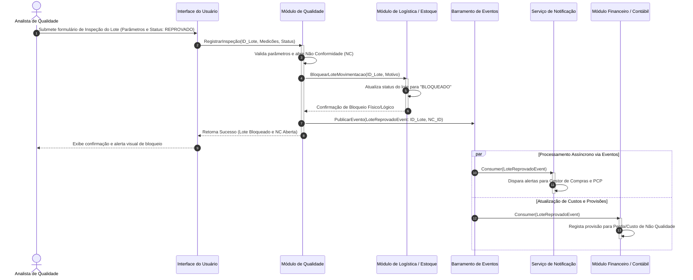

# Relatório Técnico de Arquitetura de Software

## 1. Identificação das HUs

A tabela abaixo mapeia as Histórias de Usuário (HU) extraídas da especificação do sistema ERP para Indústria Manufatureira, identificando seus perfis de acesso, domínios operacionais e os critérios de aceite associados.

| ID HU | Perfil Solicitante | Domínio / Módulo | Descrição Resumida | Critérios de Aceite Mapeados |
| :--- | :--- | :--- | :--- | :--- |
| **HU01** | Planejador de Produção | PCP | Criar ordens de produção (OP) e executar cálculo automático de MRP. | Associação de OP a produto/quantidade/roteiro; cálculo de necessidade líquida; geração automática de solicitações de compra para insumos faltantes. |
| **HU02** | Planejador de Produção | PCP / Chão de Fábrica | Acompanhar OEE e receber alertas em tempo real sobre desvios operacionais. | Cálculo de OEE (Disponibilidade, Performance, Qualidade); disparo de alertas visuais/e-mail para desvios acima do limite configurado; drill-down até o apontamento. |
| **HU03** | Comprador / Gestor | Suprimentos | Gerenciar cotações com múltiplos fornecedores e comparar propostas. | Envio de cotação a múltiplos fornecedores; comparação automática (preço, prazo, histórico); fluxo de aprovação por alçada. |
| **HU04** | Gestor de Suprimentos | Suprimentos | Visualizar histórico de desempenho de fornecedores. | Exibição de pontualidade, rejeição e variação de preço; filtros por período e categoria; exportação em PDF e Excel. |
| **HU05** | Analista de Qualidade | Qualidade | Registrar inspeções de lote e bloquear automaticamente lotes reprovados. | Registro de parâmetros e valores; bloqueio automático de estoque para lotes reprovados; notificação automática a produção e suprimentos. |
| **HU06** | Analista de Qualidade | Qualidade | Rastrear lote do insumo de entrada até o produto acabado expedido. | Rastreabilidade ponta a ponta (NF entrada, inspeção, OP, NF saída); retorno de todas OPs e clientes impactados; exportação do laudo em PDF. |
| **HU07** | Analista Fiscal | Fiscal / Faturamento | Emitir NF-e (Modelo 55) com cálculo de impostos e autorização SEFAZ. | Cálculo automático de tributos (ICMS, IPI, PIS, COFINS); transmissão em < 30s; chaveamento automático para contingência em falhas. |
| **HU08** | Analista Fiscal | Fiscal | Manter arquivos do SPED Fiscal gerados e validados automaticamente. | Geração de registros SPED via movimentações de entrada/saída; validação de consistência prévia; suporte a reprocessamento histórico. |
| **HU09** | Analista de RH | Recursos Humanos | Processar folha de pagamento mensal integrada ao ponto eletrônico. | Integração com relógio de ponto; cálculo de encargos (INSS, FGTS, IRRF); geração de arquivo bancário e eventos do eSocial. |
| **HU10** | Analista de RH | RH / Compliance | Gerar obrigações acessórias trabalhistas (eSocial, CAGED, RAIS, DIRF). | Exportação nos layouts vigentes; alertas visuais com 5 dias de antecedência do prazo legal; ambiente de pré-validação antes do envio. |
| **HU11** | Controller / Diretor | Financeiro / Contábil | Visualizar DRE e Fluxo de Caixa consolidados em tempo real. | DRE consolidada e por centro de custo; DFC distinguindo realizado e projetado; drill-down até a origem da movimentação contábil. |
| **HU12** | Diretor / CEO | Executivo / Analytics | Acompanhar KPIs operacionais e financeiros em dashboard executivo. | Exibição em tempo real de OEE, margem, receita, qualidade e serviço; alertas de desvio de meta; drill-down transacional em até 3 cliques. |

---

## 2. Diagramas de Arquitetura (Mermaid)

### 2.1 Visão de Componentes do Sistema (Modelo Modular Decoplado)

```mermaid
graph TD
    subgraph Camada_Apresentacao ["Camada de Apresentação & Interação"]
        UI_Web["Aplicação Web Responsiva / Dashboard (Navegador)"]
        UI_Mobile["Interface Industrial / Coleta Chão de Fábrica"]
    end

    subgraph Camada_Gateway ["Camada de Borda & Roteamento"]
        API_Gateway["API Gateway / Middleware de Roteamento"]
        Auth_Service["Serviço de Autenticação & SSO (LDAP / AD)"]
        Audit_Logger["Motor de Auditoria & Logs Imutáveis"]
    end

    subgraph Modulos_Negocio ["Núcleo de Processamento de Negócio (Domínios ERP)"]
        PCP_Comp["Módulo PCP & MRP"]
        Supr_Comp["Módulo de Suprimentos & Compras"]
        Qual_Comp["Módulo de Gestão da Qualidade"]
        Log_Comp["Módulo de Logística & Expedição"]
        Fisc_Comp["Módulo Fiscal & Tributário"]
        RH_Comp["Módulo de RH & Folha de Pagamento"]
        Fin_Comp["Módulo Financeiro & Contábil"]
        Exec_Comp["Módulo de Analytics & Dashboards"]
    end

    subgraph Camada_Integracao ["Camada de Integração Externa & IoT"]
        Adapter_SCADA["Adaptador Chão de Fábrica (OPC-UA / MQTT / REST)"]
        Gateway_SEFAZ["Barramento de Transmissão SEFAZ (NF-e / CT-e)"]
        Gateway_Gov["Barramento Governamental (eSocial / SPED)"]
    end

    subgraph Camada_Dados ["Camada de Persistência & Eventos"]
        DB_Relational[("Base Transacional de Dados (AES-256)")]
        Event_Bus["Barramento de Eventos de Negócio"]
    end

    %% Conexões Apresentação -> Borda
    UI_Web -->|HTTPS / TLS 1.2+| API_Gateway
    UI_Mobile -->|HTTPS / TLS 1.2+| API_Gateway

    %% Conexões Borda -> Serviços
    API_Gateway --> Auth_Service
    API_Gateway --> Audit_Logger
    API_Gateway --> PCP_Comp
    API_Gateway --> Supr_Comp
    API_Gateway --> Qual_Comp
    API_Gateway --> Log_Comp
    API_Gateway --> Fisc_Comp
    API_Gateway --> RH_Comp
    API_Gateway --> Fin_Comp
    API_Gateway --> Exec_Comp

    %% Eventos e Comunicação Interna
    PCP_Comp <-->|Eventos / Mensagens| Event_Bus
    Qual_Comp <-->|Eventos / Mensagens| Event_Bus
    Supr_Comp <-->|Eventos / Mensagens| Event_Bus
    Fin_Comp <-->|Eventos / Mensagens| Event_Bus
    Fisc_Comp <-->|Eventos / Mensagens| Event_Bus

    %% Integrações Externas
    Adapter_SCADA -->|Telemetria em Tempo Real| PCP_Comp
    Fisc_Comp <-->|Assíncrono / Sync Contingência| Gateway_SEFAZ
    RH_Comp <-->|Transmissão Lote| Gateway_Gov

    %% Persistência
    PCP_Comp --> DB_Relational
    Supr_Comp --> DB_Relational
    Qual_Comp --> DB_Relational
    Log_Comp --> DB_Relational
    Fisc_Comp --> DB_Relational
    RH_Comp --> DB_Relational
    Fin_Comp --> DB_Relational
    Exec_Comp --> DB_Relational
    Audit_Logger --> DB_Relational
```

### 2.2 Diagrama de Sequência: Inspeção de Qualidade, Bloqueio de Lote e Atualização de Custos (HU05, RF22, RF24, RF43)

---

## 3. Decisões de Arquitetura

### ADR-01: Arquitetura Orientada a Eventos para Desativação do Acoplamento Transacional
* **Contexto**: O sistema precisa processar dados transacionais intensos (apontamento de produção, apuração de OEE, movimentações fiscais) ao mesmo tempo que deve atualizar a DRE em tempo real (RF45), gerar lançamentos contábeis automáticos (RF43) e disparar notificações imediatas de desvio (RF12).
* **Decisão**: Adotar um modelo de arquitetura híbrido onde as operações locais mantêm consistência ACID no seu contexto delimitado, mas a comunicação intermodular é realizada através de um **Barramento de Eventos de Negócio** assíncrono.
* **Consequências**:
  * *Positivas*: Alta resiliência, baixa latência no registro de movimentações fabris, desempacotamento de dependências operacionais e capacidade de processar relatórios/dashboards sem bloquear tabelas de escrita.
  * *Negativas*: Exige estratégia de consistência eventual para visões consolidadas e tratamento de concorrência eventual.

### ADR-02: Isolação de Regras Fiscais e Gateway de Integração Governamental
* **Contexto**: A legislação fiscal brasileira (SEFAZ, SPED, eSocial) é altamente volátil e sujeita a indisponibilidades externas (RNF06, RNF07, RNF08, RNF17). A emissão de NF-e necessita de tempo de resposta menor que 30 segundos e chaveamento contingencial transparente.
* **Decisão**: Encapsular a comunicação externa e o cálculo tributário em módulos dedicados (`Módulo Fiscal` e `Gateway Governamental`). Implementar o padrão *Circuit Breaker* e *Contingency Queue* para alternar automaticamente para emissão offline (contingência) caso a SEFAZ fique indisponível, sincronizando os XMLs assim que a conexão for restabelecida.
* **Consequências**:
  * *Positivas*: Isolamento de falhas de serviços governamentais; flexibilidade para atualização de regras fiscais sem impactar a produção.
  * *Negativas*: Requer infraestrutura com mecanismo de retry e persistência temporária de contingência com garantia de não duplicação.

### ADR-03: Camada Adaptadora de Chão de Fábrica (Edge Industrial Protocol Isolation)
* **Contexto**: Os sistemas SCADA/MES enviam dados de telemetria em tempo real via múltiplos protocolos industriais (OPC-UA, MQTT, REST/JSON) em unidades fabris distintas (RF11, RNF18).
* **Decisão**: Implementar um componente **Adaptador de Chão de Fábrica** desacoplado da aplicação principal. Este componente atuará como um conversor protocolar padronizado, transformando sinais brutos de máquinas e sensores em eventos estruturados de domínio para apuração do OEE.
* **Consequências**:
  * *Positivas*: Padronização da ingestão de dados independente da antiguidade ou protocolo da máquina fabril; proteção do ERP contra sobrecarga de alta frequência de dados de telemetria.
  * *Negativas*: Adiciona um componente intermediário na infraestrutura local/borda que precisa de monitoramento contínuo.

### ADR-04: Estratégia de Criptografia, Trilha de Auditoria Imutável e Multi-Tenancy Multi-Planta
* **Contexto**: RNF02 e RNF10 exigem criptografia em repouso (AES-256) para dados sensíveis e manutenção de trilha de auditoria imutável por 10 anos. RF04 e RNF16 exigem restrição de acesso e isolamento lógico por unidade fabril.
* **Decisão**: Aplicar criptografia transparente no banco de dados para tabelas de RH e Finanças. Implementar um **Motor de Auditoria** centralizado que registra de forma assíncrona operações de inserção/alteração/exclusão em armazenamento append-only imutável. Utilizar padrão de chaveamento de contexto (*Plant Tenant Id*) em todas as consultas persistence-level para garantir segregação multi-planta.
* **Consequências**:
  * *Positivas*: Conformidade estrita com LGPD (RNF09), CTN (RNF10) e garantia de isolamento entre filiais sem duplicar instâncias.
  * *Negativas*: Aumento do volume de armazenamento para logs de auditoria e pequena sobrecarga de processamento para criptografia/descriptografia.

---

## 4. Tabela de Componentes e Rastreabilidade

| Componente | Responsabilidade Principal | Comunica-se com | Origem (HU / Critério de Aceite) |
| :--- | :--- | :--- | :--- |
| **Serviço de Autenticação & IAM** | Gerenciar identidades, autenticação SSO corporativa, permissões granulares e controle de acesso baseado em papéis (RBAC/SoD). | Diretório Corporativo (LDAP/AD), API Gateway, Todos os Módulos. | RF01, RF02, RF04, RNF03 |
| **Motor de Auditoria & Log** | Gravar eventos de auditoria imutáveis (usuário, data/hora, ação, módulo) com retenção de longo prazo. | API Gateway, Todos os Módulos, Camada de Dados. | RF03, RNF10 |
| **Módulo PCP & MRP** | Gerenciar OPs, sequenciamento de centro de trabalho, cálculo MRP e cálculo em tempo real de OEE. | ModuloSuprimentos, ModuloQualidade, AdaptadorSCADA, Barramento de Eventos. | HU01, HU02, RF05, RF06, RF07, RF08, RF10, RF12, RNF13 |
| **Adaptador Chão de Fábrica (SCADA/MES)** | Ingerir dados de telemetria industrial (OPC-UA/MQTT/REST) e traduzir em eventos de produção. | Sistemas SCADA/MES locais, ModuloPCP. | RF11, RNF18 |
| **Módulo de Suprimentos** | Gerenciar fornecedores, cotações, solicitações automatizadas via MRP, ordens de compra e recebimento. | ModuloPCP, ModuloQualidade, ModuloContabil, Barramento de Eventos. | HU03, HU04, RF13, RF14, RF15, RF16, RF17, RF19 |
| **Módulo de Gestão da Qualidade** | Gerenciar planos de inspeção, registrar medições de lote, efetuar bloqueio automático e rastreabilidade ponta a ponta. | ModuloSuprimentos, ModuloPCP, ModuloLogistica, Barramento de Eventos. | HU05, HU06, RF20, RF21, RF22, RF23, RF24, RF25 |
| **Módulo de Logística & Expedição** | Gerenciar endereçamento de armazém, romaneios de carga, expedição e devoluções (RMA). | ModuloQualidade, ModuloFiscal, ModuloContabil. | RF26, RF27, RF28, RF29, RF30 |
| **Módulo Fiscal & Tributário** | Calcular impostos automaticamente (NCM/UF), emitir/cancelar NF-e/CT-e, gerir contingência e criar arquivos do SPED. | ModuloLogistica, GatewaySEFAZ, ModuloContabil. | HU07, HU08, RF31, RF32, RF33, RF34, RF35, RF36, RNF06, RNF07, RNF15, RNF17 |
| **Gateway Governamental (SEFAZ/eSocial)** | Realizar o transporte seguro de mensagens XML/JSON com os webservices de órgãos reguladores. | SEFAZ, Receita Federal, ModuloFiscal, ModuloRH. | RF31, RF40, RNF07, RNF08 |
| **Módulo de RH & Folha** | Manter dados funcionais, integrar ponto eletrônico, calcular folha, encargos e obrigações trabalhistas. | GatewayGov, ModuloContabil, Relógios de Ponto. | HU09, HU10, RF37, RF38, RF39, RF40, RF41, RF42, RNF08, RNF11 |
| **Módulo Financeiro & Contábil** | Processar contas a pagar/receber, conciliação, partidas dobradas automáticas, DRE e Fluxo de Caixa em tempo real. | ModuloSuprimentos, ModuloFiscal, ModuloRH, ModuloPCP, Barramento de Eventos. | HU11, RF43, RF44, RF45, RF46, RF47, RF48, RF49 |
| **Módulo de Analytics & Dashboards** | Consolidar métricas operacionais/financeiras, oferecer recursos de drill-down transacional e alertas de meta. | Todos os Módulos de Negócio, Camada de Apresentação. | HU12, RF50, RF51, RF52, RF53, RNF14 |

---

## 5. Bloqueios e Pendências

1. **Definição de Política para Falha Prolongada da SEFAZ**: 
   * *Pendência*: A regra de emissão em contingência (RF34/RNF17) prevê chaveamento automático, mas não detalha o comportamento do sistema caso a contingência persista por mais de 24 horas (ex: controle de limite numérico de notas em contingência e estouro de memória de filas locais).
   * *Ação Necessária*: Especificar o limite máximo de retenção offline e definir estratégia de armazenamento secundário permanente para XMLs pendentes de homologação.

2. **Protocolo de Conexão Legada com Chão de Fábrica**:
   * *Pendência*: RF11 e RNF18 mencionam integração SCADA via OPC-UA, MQTT ou REST. No entanto, máquinas mais antigas podem requerer intermediadores industriais baseados em arquitetura serial ou bancos de dados proprietários locais.
   * *Ação Necessária*: Mapear a matriz de equipamentos de cada fábrica do cliente para definir a quantidade e escopo exatos de adaptadores locais a serem desenvolvidos.

3. **Fonte Externa de Cotação de Moedas Estrangeiras**:
   * *Pendência*: RF49 especifica suporte a múltiplas moedas e conversão automática, mas não explicita o provedor oficial de taxa de câmbio (ex: Banco Central do Brasil) para atualização automatizada diária.
   * *Ação Necessária*: Definir o contrato de API externa e a política de fallback caso o serviço de cotação fique inacessível.

---

## 6. Cobertura de Requisitos

A matriz a seguir demonstra a cobertura integral dos Requisitos Funcionais (RF) e Não Funcionais (RNF) pelos componentes e mecanismos arquiteturais projetados.

| Requisito | Tipo | Componente Mapeado | Mecanismo Arquitetural de Atendimento |
| :--- | :--- | :--- | :--- |
| **RF01-RF04** | Funcional | Serviço de Autenticação & IAM / Audit_Logger | Controle RBAC granular, validação de token corporativo (SSO) e filtragem de consultas por `Plant Tenant Id`. |
| **RF05-RF09** | Funcional | Módulo PCP & MRP | Algoritmo de necessidade líquida de materiais e motores de alocação sequencial de capacidade em banco transacional. |
| **RF10-RF12** | Funcional | Módulo PCP & MRP / Adaptador SCADA | Ingestão contínua de telemetria industrial, cálculo instantâneo do índice OEE e disparo de eventos de desvio. |
| **RF13-RF19** | Funcional | Módulo de Suprimentos | Regras de matriz de cotação comparativa, controle de alçadas e consolidação do score de fornecedores. |
| **RF20-RF25** | Funcional | Módulo de Gestão da Qualidade | Bloqueio de estado de estoque via instrução atômica e motor de busca em árvore para rastreabilidade de lote. |
| **RF26-RF30** | Funcional | Módulo de Logística & Expedição | Mapeamento lógico de endereçamento (WMS), regras de vinculação NF-e/Romaneio e workflow de RMA. |
| **RF31-RF36** | Funcional | Módulo Fiscal & Tributário / Gateway SEFAZ | Processamento de schema XSD, motor de regras tributárias parametrizável e buffer local para emissão em contingência. |
| **RF37-RF42** | Funcional | Módulo de RH & Folha | Motor de cálculo trabalhista, processador de marcações de ponto e formatador de eventos do eSocial. |
| **RF43-RF49** | Funcional | Módulo Financeiro & Contábil | Processamento de lançamentos contábeis orientados a eventos (event-driven) e consolidação em tempo real de visões financeiras. |
| **RF50-RF53** | Funcional | Módulo de Analytics & Dashboards | Consultas analíticas otimizadas (read-models), agregações pré-calculadas e links diretos para registros de origem (drill-down). |
| **RNF01-RNF05** | Não-Funcional | Infraestrutura / IAM / Audit_Logger | Encriptação de transporte TLS 1.2+, repositório com cifragem AES-256, mecanismo SoD e trilhas imutáveis. |
| **RNF06-RNF11** | Não-Funcional | Módulo Fiscal / Módulo RH / Audit_Logger | Atualização contínua de schemas governamentais, validação prévia de regras tributárias/trabalhistas e retenção 10 anos. |
| **RNF12-RNF17** | Não-Funcional | Todos os Módulos / Infraestrutura | Dimensionamento para 99,5% de SLA, rotinas de MRP otimizadas (<10 min), dashboards cacheados (<5s) e chaveamento transparente de contingência fiscal. |
| **RNF18-RNF20** | Não-Funcional | Adaptador SCADA / API Gateway | Exposição de rotas RESTful padronizadas, suporte a XML/JSON/CSV/XLSX e clientes MQTT/OPC-UA na borda. |
| **RNF21-RNF24** | Não-Funcional | Camada de Dados / Infraestrutura | Mecanismo de backup físico diário + WAL com RPO < 1h, desacoplamento de infraestrutura (Cloud/On-Premises) e UI responsiva baseada em padrões Web. |

---

## 7. Gap Analysis

Durante o processo de análise detalhada dos requisitos fornecidos, foram identificadas lacunas operacionais e técnicas de especificação que exigem alinhamento e definição arquitetural complementar:

### Gap 1: Ausência de Estratégia de Cache e Amostragem Offline para o Chão de Fábrica
* **Descrição da Lacuna**: O RNF12 especifica disponibilidade de 99,5% durante a operação fabril. Contudo, em casos de oscilação momentânea da rede local de computadores da fábrica, os leitores de apontamento manual (RF08) e conectores de máquinas podem perder mensagens caso não exista um mecanismo local de buffer/armazenamento temporário (*Store-and-Forward*).
* **Impacto Arquitetural**: Risco de perda de dados de telemetria ou impossibilidade de apontamento de parada de máquina durante indisponibilidades de rede.
* **Ação Recomendada**: Implementar um agente leve de borda (*Edge Buffer Agent*) nos coletores e gateways de fábrica capaz de armazenar registros localmente em fila persistente e descarregar no sistema central quando a conectividade for restabelecida.

### Gap 2: Falta de Metas Claramente Definidas para RTO (Recovery Time Objective)
* **Descrição da Lacuna**: O RNF21 define rigorosamente o RPO (Recovery Point Objective) máximo de 1 hora através de logs de transação (WAL), mas omite o valor-alvo para o RTO (tempo máximo aceitável para restauração completa do serviço pós-desastre).
* **Impacto Arquitetural**: Dificuldade no dimensionamento das estratégias de alta disponibilidade (HA) e desastre e recuperação (DR), como a necessidade de clusters em modo *Active-Passive* imediato ou restauração via *cold backup*.
* **Ação Recomendada**: Formalizar junto ao comitê de negócio o limite tolerável de RTO (ex: RTO < 2 horas) para desenhar o plano de redundância de infraestrutura adequado.

### Gap 3: Monitoramento de Validade de Certificados Digitais para Emissão Fiscal e eSocial
* **Descrição da Lacuna**: RF31 e RF40 tratam da comunicação contínua com a SEFAZ e eSocial. Esses serviços exigem o uso de certificados digitais corporativos (padrão ICP-Brasil), que possuem validade determinada. Não há requisito funcional prevendo o aviso prévio do vencimento do certificado.
* **Impacto Arquitetural**: O vencimento não detectado paralisa instantaneamente as rotinas de expedição (NF-e) e envio de obrigações de RH.
* **Ação Recomendada**: Adicionar ao Módulo Fiscal e ao Módulo de RH um serviço de monitoramento preventivo que valide a cadeia de certificados e emita alertas aos administradores com 30, 15 e 5 dias de antecedência da expiração.