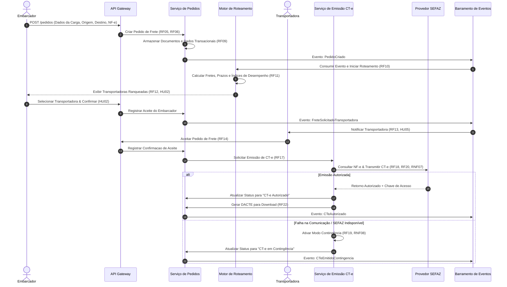
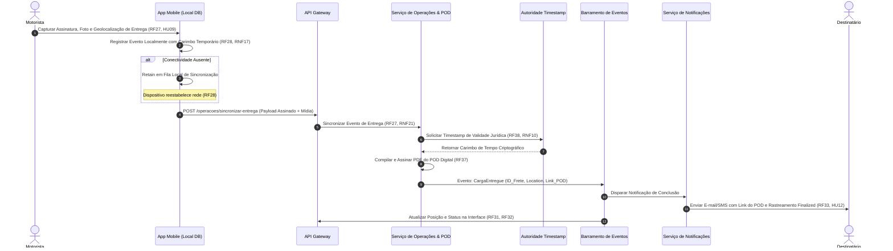

# Relatório Técnico de Arquitetura de Software

---

## 1. Identificação das HUs

A tabela a seguir consolida a relação de Histórias de Usuário (HU) extraídas dos requisitos do projeto, mapeando o perfil do participante, a funcionalidade associada, o domínio de negócio e os componentes de arquitetura afetados.

| ID | Perfil | Funcionalidade Resumida | Domínio de Negócio | RF / RNF Relacionados |
| :--- | :--- | :--- | :--- | :--- |
| **HU01** | Embarcador | Registrar pedido de frete com upload de documentos e valor declarado | Gestão de Pedidos | RF05, RF06, RF09, RNF13 |
| **HU02** | Embarcador | Visualizar ranqueamento, contratar seguro e confirmar frete | Roteamento & Seguros | RF10, RF11, RF12, RF17, RF41 |
| **HU03** | Embarcador | Acompanhar fretes consolidados e receber POD automaticamente | Monitoramento & POD | RF07, RF34, RF39, RNF20 |
| **HU04** | Embarcador | Abrir e acompanhar sinistro por avaria ou extravio | Seguros & Sinistros | RF42, RF43, RF44 |
| **HU05** | Transportadora | Aceitar/recusar pedidos de frete notificados com justificativa | Gestão de Frota & Frete | RF13, RF14, RF15, RF35 |
| **HU06** | Transportadora | Acompanhar posição em tempo real e ocorrências de motoristas | Monitoramento de Operações | RF25, RF26, RF35, RNF15, RNF16 |
| **HU07** | Transportadora | Consultar demonstrativo financeiro de repasses e saldo líquido | Financeiro & Tarifação | RF48, RNF11 |
| **HU08** | Motorista | Executar coleta com conferência, fotos e assinatura digital | Operação de Campo | RF23, RF24, RNF18, RNF21 |
| **HU09** | Motorista | Registrar entrega com POD digital em modo offline/online | Operação de Campo / POD | RF27, RF28, RF37, RF38, RNF10, RNF17 |
| **HU10** | Motorista | Registrar ocorrências de transporte (avaria, roubo, recusa) | Operação de Campo | RF26, RF40, RNF17 |
| **HU11** | Destinatário | Rastrear carga em tempo real via link sem necessidade de login | Rastreamento Público | RF30, RF31, RF32, RNF05, RNF12, RNF15 |
| **HU12** | Destinatário | Receber notificações multicanais de alteração de status | Comunicação & Alertas | RF33, RNF09 |
| **HU13** | Administrador | Monitorar SLAs, pendências de alocação e acionar contingência | Governança Operacional | RF15, RF36, RNF25 |
| **HU14** | Administrador | Acompanhar painel financeiro consolidado, comissões e inadimplência | Governança Financeira | RF46, RF49, RNF11 |

---

## 2. Diagramas de Arquitetura (Mermaid)

### 2.1 Diagrama de Componentes da Plataforma (Visão Geral de Arquitetura)

O diagrama abaixo apresenta os limites contextuais, módulos de domínio, componentes de integração externa e barramentos de comunicação da plataforma.

```mermaid
graph TB
    subgraph Camada_Apresentacao ["Camada de Apresentação e Pontos de Entrada"]
        WEB["Portal Web (Embarcador / Transportadora / Admin)"]
        MOB["Aplicativo Mobile Motorista (Offline-First)"]
        PUB["Interface de Rastreamento Público (Destinatário)"]
    end

    subgraph Camada_API ["Camada de Entrada & Segurança"]
        GW["API Gateway / Middleware de Roteamento"]
        AUTH["Serviço de Autenticação e Autorização (RBAC / MFA)"]
    end

    subgraph Servicos_Core ["Serviços Centrais de Negócio (Core System)"]
        PEDIDOS["Serviço de Pedidos e Documentos"]
        ROTEADOR["Motor de Roteamento e Ranqueamento"]
        MOTORISTAS["Serviço de Operações de Campo & POD"]
        FINANCEIRO["Serviço Financeiro, Tarifação e Repasses"]
        SINISTROS["Serviço de Seguros e Sinistros"]
        AUDITORIA["Serviço de Auditoria Imutável"]
    end

    subgraph Processamento_Realtime ["Processamento em Tempo Real & Eventos"]
        BUS["Barramento de Eventos da Plataforma"]
        GEO_INGEST["Serviço de Ingestão de Geolocalização"]
        NOTIF["Serviço de Notificações Multi-canal"]
    end

    subgraph Camada_Persistencia ["Camada de Armazenamento de Dados"]
        DB_REL["Base de Dados Relacional Transacional"]
        DB_GEO["Base de Dados Séries Temporais / Geoespacial"]
        DB_AUDIT["Repositório Imutável de Log & Auditoria"]
        STORAGE["Armazenamento de Objetos / Documentos (PDF, Fotos)"]
    end

    subgraph Integracoes_Externas ["Provedores de Serviços Externos"]
        SEFAZ["Serviço Emissor CT-e / SEFAZ"]
        INSURANCE["Plataforma de Seguradoras Parceiras"]
        NOTIF_EXT["Gateways de SMS e E-mail"]
        TSA["Autoridade de Carimbo de Tempo (Timestamp)"]
    end

    %% Conexões de Entrada
    WEB --> GW
    MOB --> GW
    PUB --> GW

    GW --> AUTH
    GW --> PEDIDOS
    GW --> ROTEADOR
    GW --> MOTORISTAS
    GW --> FINANCEIRO
    GW --> SINISTROS
    GW --> GEO_INGEST

    %% Conexões com Barramento de Eventos
    PEDIDOS --> BUS
    ROTEADOR --> BUS
    MOTORISTAS --> BUS
    GEO_INGEST --> BUS
    FINANCEIRO --> BUS

    BUS --> NOTIF
    BUS --> AUDITORIA

    %% Conexões com Persistência
    PEDIDOS --> DB_REL
    PEDIDOS --> STORAGE
    ROTEADOR --> DB_REL
    MOTORISTAS --> DB_REL
    MOTORISTAS --> STORAGE
    FINANCEIRO --> DB_REL
    SINISTROS --> DB_REL
    SINISTROS --> STORAGE
    GEO_INGEST --> DB_GEO
    AUDITORIA --> DB_AUDIT

    %% Conexões com Integrações Externas
    PEDIDOS --> SEFAZ
    MOTORISTAS --> TSA
    SINISTROS --> INSURANCE
    NOTIF --> NOTIF_EXT
```



---

### 2.2 Diagrama de Sequência: Ciclo de Vida do Pedido, Ranqueamento e Autorização Fiscal (CT-e)

Este fluxo detalha o registro do pedido pelo embarcador, o algoritmo de roteamento, a confirmação pela transportadora e a integração síncrona/assíncrona com a SEFAZ.



---

### 2.3 Diagrama de Sequência: Operação de Campo, Sincronização Offline e Emissão de POD

Este diagrama ilustra a execução da entrega pelo aplicativo mobile do motorista, demonstrando o tratamento offline, captura de evidências, validação jurídica do POD e atualização em tempo real para o destinatário.



---

## 3. Decisões de Arquitetura

### ADR-01: Arquitetura Orientada a Eventos para Ingestão e Notificação em Tempo Real
- **Contexto:** A plataforma necessita processar dezenas de milhares de atualizações de geolocalização por minuto (RNF16), responder a alterações de status de entregas em até 30 segundos (RNF15) e notificar múltiplos atores em tempo real (RF33-RF36).
- **Decisão Arquitetural:** Adotar o padrão de Arquitetura Orientada a Eventos (EDA) para a comunicação assíncrona entre módulos. Um barramento central de eventos gerenciará tópicos de *pedidos*, *telemetria*, *notificações* e *eventos fiscais*.
- **Justificativa:** Garante desacoplamento extremo entre os serviços, alta capacidade de escala horizontal para a ingestão de coordenadas de GPS e resiliência contra indisponibilidades pontuais de serviços downstream (como gateways de SMS ou emissão de e-mails).
- **Consequências:** Exige implementação de consistência eventual para visões agregadas e tratamento cuidadoso de ordenação de mensagens de rastreamento.

### ADR-02: Modelo de Persistência Poliglota Segregado por Modelo de Acesso
- **Contexto:** Os requisitos demandam armazenamento transacional de fretes (RF05), dados temporais e espacialmente indexados de GPS (RNF23), documentos binários e imagens (RF09, RF24, RF37), e logs imutáveis de auditoria com retenção legal de 5 anos (RNF11).
- **Decisão Arquitetural:** Segregar os dados em três estruturas lógicas independentes:
  1. *Banco de Dados Relacional:* Para entidades de negócio transacionais (Pedidos, Motoristas, Conhecimentos de Transporte, Faturas).
  2. *Banco de Dados Geoespacial / Séries Temporais:* Dedicado exclusivamente a armazenar e consultar históricos e telemetria de veículos.
  3. *Repositório de Objetos e Audit Log Imutável:* Armazenamento binário para documentos (DACTE, fotos, assinaturas) e registro de auditoria à prova de adulteração.
- **Justificativa:** Otimiza o desempenho e o custo de cada tipo de consulta, atendendo ao limite de até 10 segundos no roteamento (RNF13) e consulta ágil no mapa (RNF15).
- **Consequências:** Necessidade de coordenação e sincronização entre repositórios através de eventos do barramento.

### ADR-03: Estratégia Offline-First para a Aplicação Mobile do Motorista
- **Contexto:** Motoristas operam frequentemente em rodovias e zonas rurais com conectividade nula ou intermitente (RF28, RNF17). Perdas de dados de coleta, entrega ou sinistro são inaceitáveis.
- **Decisão Arquitetural:** O aplicativo mobile deve ser desenhado sob o conceito *Offline-First*. Toda ação (coleta, foto, ocorrência, assinatura, geolocalização) é gravada e validada primeiro em armazenamento local estruturado com enfileiramento transacional, sendo sincronizada em segundo plano via protocolo de idempotência quando a conectividade for restabelecida.
- **Justificativa:** Cumpre o RNF17 (nenhum evento pode ser perdido por falta de sinal) e otimiza a usabilidade em campo (RNF21).
- **Consequências:** Requer mecanismo robusto de reconciliação de estado e tratamento de conflitos no servidor.

### ADR-04: Camada Restrita de Segurança e Acesso Anônimo por Token de Rastreamento (Zero-Trust Link)
- **Contexto:** O destinatário deve acompanhar a carga sem login (RF30, HU11), porém os dados de geolocalização e outros fretes do mesmo veículo não podem ser expostos a terceiros (RNF05, RNF06, RNF09).
- **Decisão Arquitetural:** Criar um serviço de autorização restrito para links públicos. O acesso do destinatário será feito mediante tokens criptográficos temporários, de uso único ou com expiração vinculada ao ciclo de vida da entrega, contendo apenas permissão de leitura sobre a projeção truncada da posição do frete específico.
- **Justificativa:** Atende rigorosamente ao RNF05, RNF06 e às diretrizes da LGPD (RNF09), impedindo a varredura inadvertida ou vazamento de dados de outros fretes.
- **Consequências:** Necessidade de gerenciar a revogação e expiração programada de tokens de rastreamento.

---

## 4. Tabela de Componentes e Rastreabilidade

A tabela abaixo define os componentes conceituais do sistema, suas responsabilidades principais, suas interfaces de comunicação e o mapeamento com os requisitos declarados.

| Componente | Responsabilidade Principal | Comunica-se com | Origem (HU / Critério de Aceite) |
| :--- | :--- | :--- | :--- |
| **API Gateway & Access Control** | Autenticação (MFA), autorização RBAC, controle de taxa e roteamento seguro de requisições HTTPS. | Serviço de Autenticação, Módulos Core | RF01, RF02, RNF01, RNF03, RNF04 |
| **Módulo de Pedidos e Documentos** | Registro de pedidos de frete, anexação de NF-es, declaração de valor e gestão do status da carga. | Roteador, Serviço Fiscal, Armazenamento de Objetos | RF05, RF06, RF08, RF09, HU01 |
| **Motor de Roteamento e Seleção** | Algoritmo de cruzamento geográfica/carga, cálculo comparativo de fretes, ranqueamento e cascata de aceite. | Módulo de Pedidos, Barramento de Eventos, BD Relacional | RF10, RF11, RF12, RF15, RNF13, HU02 |
| **Serviço de Operações da Transportadora** | Gestão de frotas, aceite/recusa de frete e atualização contínua do índice de desempenho do transportador. | Motor de Roteamento, Barramento de Eventos | RF03, RF14, RF16, HU05, HU06 |
| **Serviço Emissor Fiscal (CT-e)** | Validação de NF-e, transmissão à SEFAZ, controle de contigência e disponibilização do DACTE. | SEFAZ, Módulo de Pedidos, Barramento de Eventos | RF17, RF18, RF19, RF20, RF21, RF22, RNF07, RNF08, RNF14 |
| **Cliente Mobile Offline (Motorista)** | Apresentação de rotas, captura offline/online de fotos, assinaturas, coletas, ocorrências e telemetria. | API Gateway, Banco Local Mobile | RF23, RF24, RF26, RF27, RF28, RF29, RNF17, RNF18, RNF19, RNF21, HU08, HU09, HU10 |
| **Serviço de Ingestão de Geolocalização** | Ingestão em lote/stream de coordenadas de GPS dos motoristas e atualização da posição dos veículos. | App Mobile, DB Geoespacial, Barramento de Eventos | RF25, RNF02, RNF06, RNF15, RNF16, RNF23 |
| **Portal de Rastreamento Público** | Exibição visual do progresso de entrega no mapa e histórico cronológico via token anônimo. | BD Geoespacial, Módulo de Pedidos | RF30, RF31, RF32, RNF05, HU11 |
| **Serviço de Notificações Multi-canal** | Disparo de alertas por e-mail, SMS e Push sobre mudanças de status, SLA em risco e aceite de fretes. | Gateways de E-mail/SMS, Barramento de Eventos | RF13, RF33, RF34, RF35, RF36, HU12 |
| **Gerenciador de POD Digital** | Consolidação do comprovante de entrega, integração com Autoridade de Carimbo de Tempo e geração de PDF. | App Mobile, Autoridade de Timestamp, Armazenamento Objetos | RF37, RF38, RF39, RF40, RNF10, HU03, HU09 |
| **Módulo de Seguros e Sinistros** | Cotação/contratação automática de apólice por viagem, abertura de sinistro e acompanhamento. | Seguradoras Parceiras, Módulo de Pedidos, Armazenamento | RF41, RF42, RF43, RF44, HU02, HU04 |
| **Módulo Financeiro e Repasses** | Cálculo de fretes, retenção de comissão da plataforma, geração de faturas e demonstrativos de repasse. | BD Relacional, Barramento de Eventos | RF45, RF46, RF47, RF48, RF49, HU07, HU14 |
| **Serviço de Auditoria e Governança** | Registro imutável de todas as ações operacionais, alterações fiscais e monitoramento de SLA da plataforma. | DB Audit Imutável, Todos os Serviços Core | RF04, RNF11, RNF25, HU13 |

---

## 5. Bloqueios e Pendências

A validação dos requisitos e premissas identificou os seguintes bloqueios técnicos e operacionais que demandam definição prévia à implementação final:

1. **Protocolo de Failover e Timeout da SEFAZ:**
   - *Ponto de Bloqueio:* O requisito RF19 exige fallback para contingência offline de CT-e, mas não especifica o tempo exato de espera (*timeout*) ou a quantidade de tentativas antes de chavear automaticamente a operação para contingência sem interromper a operação do frete.
2. **Homologação da Autoridade de Carimbo do Tempo (TSA):**
   - *Ponto de Pendência:* O requisito RF38/RNF10 exige validade jurídica segundo a Lei 14.063/2020. É necessário definir o provedor/órgão emissor do carimbo de tempo para alinhamento dos certificados criptográficos e validação do fluxo de assinatura do POD.
3. **Política de Tratamento de Conflito em Sincronização Offline:**
   - *Ponto de Bloqueio:* Caso um motorista efetue o registro de uma entrega offline (HU09), mas o embarcador tenha efetuado o cancelamento do pedido (RF08) no portal web durante a janela de desconexão, é necessária a definição da regra de negócio de precedência (se prevalece o cancelamento ou a entrega física efetuada).
4. **Volume Máximo e Resolução do Streaming de Geolocalização:**
   - *Ponto de Pendência:* O intervalo de captura do GPS é configurável (RF25), porém o limite máximo aceitável de concorrência simultânea (RNF16) precisa ser quantificado para o dimensionamento exato da capacidade do banco de dados geoespacial.

---

## 6. Cobertura de Requisitos

As matrizes abaixo demonstram a rastreabilidade completa entre os requisitos de entrada, as Histórias de Usuário e os elementos do design de arquitetura.

### 6.1 Mapeamento de Requisitos Funcionais (RF)

| ID RF | Coberto pelo Componente de Arquitetura | Decisão / Mecanismo | HU Relacionada |
| :--- | :--- | :--- | :--- |
| **RF01** | API Gateway & Access Control | Autenticação Única e Perfis RBAC | - |
| **RF02** | API Gateway & Access Control | Middleware de Autorização | - |
| **RF03** | Serviço de Operações da Transportadora | Cadastro e Vínculo de Frota/Motorista | HU05 |
| **RF04** | Serviço de Auditoria e Governança | Trilha Imutável de Auditoria (ADR-02) | - |
| **RF05** | Módulo de Pedidos e Documentos | Cadastro Transacional de Carga | HU01 |
| **RF06** | Módulo de Pedidos e Documentos | Registro de Ad Valorem e Valor | HU01 |
| **RF07** | Módulo de Pedidos e Documentos | Painel Consolidado do Embarcador | HU03 |
| **RF08** | Módulo de Pedidos e Documentos | Regras de Cancelamento de Pedido | - |
| **RF09** | Módulo de Pedidos e Documentos | Repositório de Documentos/NF-e | HU01 |
| **RF10** | Motor de Roteamento e Seleção | Algoritmo de Roteamento Automático | HU02 |
| **RF11** | Motor de Roteamento e Seleção | Ranqueamento Multi-critério | HU02 |
| **RF12** | Motor de Roteamento e Seleção | Exibição e Aceite Automático | HU02 |
| **RF13** | Serviço de Notificações Multi-canal | Publicação em Tópico de Transportadoras | HU05 |
| **RF14** | Serviço de Operações da Transportadora | Registro de Aceite/Recusa e Justificativa | HU05 |
| **RF15** | Motor de Roteamento e Seleção | Algoritmo de Cascata/Fallback | HU13 |
| **RF16** | Serviço de Operações da Transportadora | Cálculo Continuo de Performance | HU02 |
| **RF17** | Serviço Emissor Fiscal (CT-e) | Integração com Emissor Fiscal | HU02 |
| **RF18** | Serviço Emissor Fiscal (CT-e) | Transmissão Síncrona/Assíncrona SEFAZ | - |
| **RF19** | Serviço Emissor Fiscal (CT-e) | Módulo de Contingência Offline | - |
| **RF20** | Serviço Emissor Fiscal (CT-e) | Validação Prévia de NF-e na SEFAZ | - |
| **RF21** | Serviço Emissor Fiscal (CT-e) | Gestão de Cancelamento/Inutilização | - |
| **RF22** | Serviço Emissor Fiscal (CT-e) | Geração de PDF DACTE | - |
| **RF23** | Cliente Mobile Offline (Motorista) | Visualização de Ordens de Serviço | HU08 |
| **RF24** | Cliente Mobile Offline (Motorista) | Captura de Coleta e Assinatura | HU08 |
| **RF25** | Serviço de Ingestão de Geolocalização | Ingestão de Telemetria GPS | HU06 |
| **RF26** | Cliente Mobile Offline (Motorista) | Registro de Ocorrências com Imagem | HU10 |
| **RF27** | Cliente Mobile Offline (Motorista) | Captura de Entrega e Evidências | HU09 |
| **RF28** | Cliente Mobile Offline (Motorista) | Fila Local Transacional (ADR-03) | HU09 |
| **RF29** | Cliente Mobile Offline (Motorista) | Roteamento Multi-paradas no App | HU08 |
| **RF30** | Portal de Rastreamento Público | Token de Acesso Sem Autenticação (ADR-04) | HU11 |
| **RF31** | Portal de Rastreamento Público | Exibição de Linha do Tempo | HU11 |
| **RF32** | Portal de Rastreamento Público | Plotação Geoespacial em Tempo Real | HU11 |
| **RF33** | Serviço de Notificações Multi-canal | Gateway E-mail/SMS para Destinatário | HU12 |
| **RF34** | Serviço de Notificações Multi-canal | Notificação do Embarcador | HU03 |
| **RF35** | Serviço de Notificações Multi-canal | Notificação da Transportadora | HU05, HU06 |
| **RF36** | Serviço de Notificações Multi-canal | Alerta de SLA e Falha de Alocação | HU13 |
| **RF37** | Gerenciador de POD Digital | Gerador de PDF do POD | HU03, HU09 |
| **RF38** | Gerenciador de POD Digital | Integração com Carimbo de Tempo (TSA) | HU09 |
| **RF39** | Gerenciador de POD Digital | Disponibilização Imediata de POD | HU03 |
| **RF40** | Gerenciador de POD Digital | Registro de Recusa de Recebimento | HU09 |
| **RF41** | Módulo de Seguros e Sinistros | Integração com API de Seguradoras | HU02 |
| **RF42** | Módulo de Seguros e Sinistros | Processo de Abertura de Sinistro | HU04 |
| **RF43** | Módulo de Seguros e Sinistros | Acompanhamento de Status de Sinistro | HU04 |
| **RF44** | Módulo de Seguros e Sinistros | Repositório de Documentos de Sinistro | HU04 |
| **RF45** | Módulo Financeiro e Repasses | Cálculo de Frete Baseado em Tabela | HU07 |
| **RF46** | Módulo Financeiro e Repasses | Regra de Retenção de Comissão | HU14 |
| **RF47** | Módulo Financeiro e Repasses | Geração de Faturas para Embarcador | HU14 |
| **RF48** | Módulo Financeiro e Repasses | Extrato de Repasse para Transportador | HU07 |
| **RF49** | Módulo Financeiro e Repasses | Dashboard Financeiro do Admin | HU14 |

---

### 6.2 Mapeamento de Requisitos Não Funcionais (RNF)

| ID RNF | Categoria | Solução de Arquitetura / Mecanismo Adotado |
| :--- | :--- | :--- |
| **RNF01** | Segurança | Criptografia de Transporte TLS 1.2+ em todos os endpoints HTTP/WebSocket. |
| **RNF02** | Segurança | Criptografia de dados sensíveis e localização em repouso com algoritmo AES-256 (ADR-02). |
| **RNF03** | Segurança | Mecanismo de Multi-Factor Authentication (MFA) obrigatório no Gateway para Admin e Embarcador. |
| **RNF04** | Segurança | Tokens de Sessão JWT renováveis com tempo de expiração curto para App Mobile. |
| **RNF05** | Segurança | Tokens únicos contendo hash seguro com tempo de expiração para rastreamento (ADR-04). |
| **RNF06** | Segurança | Filtro de autorização por contexto de frete no pipeline de geolocalização. |
| **RNF07** | Conformidade | Validador de esquemas XSD atualizados integrado ao Serviço Emissor Fiscal (CT-e). |
| **RNF08** | Conformidade | Implementação das regras fiscais para modalidades Normal, Complementar, Anulação e Substituto. |
| **RNF09** | Conformidade | Governança de dados de acordo com a LGPD (anonimização e expiração de dados pessoais). |
| **RNF10** | Conformidade | Assinatura digital e Timestamp emitido por autoridade alinhada à Lei 14.063/2020. |
| **RNF11** | Conformidade | Repositório imutável append-only com retenção configurada para 5 anos (CTN). |
| **RNF12** | Disponibilidade | Arquitetura distribuída de alta disponibilidade com meta de uptime de 99,5%. |
| **RNF13** | Desempenho | Processamento assíncrono e caching de tabelas de roteamento para resposta < 10s. |
| **RNF14** | Desempenho | Integração assíncrona otimizada para envio e recebimento de lote CT-e à SEFAZ < 30s. |
| **RNF15** | Desempenho | Processamento em stream da telemetria garantindo plotação no mapa em até 30s. |
| **RNF16** | Escalabilidade | Barramento de eventos resiliente e banco geoespacial otimizado para alto volume de escritas. |
| **RNF17** | Resiliência | Mecanismo *Offline-First* com persistência local no dispositivo do motorista (ADR-03). |
| **RNF18** | Usabilidade | Interface móvel desenvolvida com alvos de toque expandidos e modo escuro/alto contraste. |
| **RNF19** | Compatibilidade | Suporte multiplataforma (foco prioritário em Android e suporte iOS). |
| **RNF20** | Compatibilidade | Web Portals desenvolvidos com design responsivo multiplataforma. |
| **RNF21** | Usabilidade | Fluxo de captura de entrega otimizado em no máximo 4 etapas de interação no App. |
| **RNF22** | Backup | Rotina automatizada de snapshot diário e replicação contínua para RPO < 1 hora. |
| **RNF23** | Infraestrutura | Uso de Banco de Dados especializado em Séries Temporais e índices Geoespaciais. |
| **RNF24** | Interoperabilidade | Apresentação de APIs RESTful versionadas com contratos definidos para integrações. |
| **RNF25** | Manutenibilidade | Exposição de métricas de saúde da aplicação e latências em tempo real para monitoramento. |

---

## 7. Gap Analysis

A análise detalhada dos requisitos em relação ao design arquitetural revelou as seguintes lacunas técnicas e operacionais, acompanhadas dos respectivos impactos e ações recomendadas para as equipes de desenvolvimento.

```
+---------------------------------------------------------------------------------------------------+
| 1. GAP: Algoritmo de Resolução de Conflitos para Operação Offline do Motorista                    |
+---------------------------------------------------------------------------------------------------+
| Descrição: O RNF17 e RF28 especificam que o aplicativo mobile deve funcionar offline. Contudo,    |
| não há detalhamento sobre o comportamento do sistema quando houver conflitos de estado            |
| ocorridos enquanto o motorista esteve desconectado (ex: pedido cancelado no portal enquanto a     |
| carga era fisicamente entregue).                                                                  |
|                                                                                                   |
| Impacto Arquitetural: Risco de inconsistência de estado entre o Módulo de Pedidos e o Módulo    |
| de Operações de Campo, gerando cobranças indesejadas ou emissão inadequada de comprovantes.      |
|                                                                                                   |
| Ação Recomendada: Implementar o padrão "Server Wins with Exception Alert" no Serviço de           |
| Operações de Campo, onde o status final é avaliado por regras de transição de estado estritas;    |
| entregas realizadas em campo prevalecem como fato real, acionando um alerta de conciliação       |
| para o administrador (HU13).                                                                       |
+---------------------------------------------------------------------------------------------------+

+---------------------------------------------------------------------------------------------------+
| 2. GAP: Estratégia de Atualização Dinâmica do ETA em Rotas Multi-paradas                          |
+---------------------------------------------------------------------------------------------------+
| Descrição: O RF29 (múltiplas paradas) e RF32 (previsão dinâmica) exigem recálculo de horário de   |
| chegada. No entanto, não há especificação de como atrasos em paradas intermediárias afetam o ETA  |
| dos destinatários subsequentes da mesma rota.                                                      |
|                                                                                                   |
| Impacto Arquitetural: Alto custo de processamento se o recálculo for disparado de forma           |
| síncrona a cada nova coordenada de GPS transmitida pelos motoristas.                              |
|                                                                                                   |
| Ação Recomendada: Implementar o recálculo do ETA de forma assíncrona, orientada a eventos         |
| de tempo ou desvio de rota significativo (ex: variação superior a 15 minutos do planejado         |
| ou conclusão de uma etapa intermediária), aliviando o barramento de geolocalização.              |
+---------------------------------------------------------------------------------------------------+

+---------------------------------------------------------------------------------------------------+
| 3. GAP: Gestão de Ciclo de Vida do Dado Pessoal vs. Trilha de Auditoria Fiscal                    |
+---------------------------------------------------------------------------------------------------+
| Descrição: Conflito regulatório em potencial entre a LGPD (RNF09), que estabelece o direito ao    |
| esquecimento ou exclusão de dados pessoais (motoristas/destinatários), e o CTN / SEFAZ           |
| (RNF11), que exige a guarda imutável de dados fiscais por no mínimo 5 anos.                       |
|                                                                                                   |
| Impacto Arquitetural: A exclusão física de registros pode corromper a integridade e a validade   |
| jurídica dos logs de auditoria e documentos fiscais armazenados.                                  |
|                                                                                                   |
| Ação Recomendada: Definir uma política de Pseudonimização/Anonimização Irreversível para a      |
| camada de auditoria. Dados pessoais são anonimizados nos cadastros ativos após o prazo legal,     |
| mantendo os hashes criptográficos e dados estritamente necessários para comprovação fiscal.       |
+---------------------------------------------------------------------------------------------------+

+---------------------------------------------------------------------------------------------------+
| 4. GAP: Tráfego de Mídia e Fotos em Áreas de Baixa Conectividade Mobile                          |
+---------------------------------------------------------------------------------------------------+
| Descrição: O RF24, RF27 e RF40 exigem captura de fotos de volumes, comprovantes e avarias. Em     |
| áreas rurais ou de sinal instável, o upload de arquivos de imagem de alta resolução pode          |
| inviabilizar a sincronização do aplicativo do motorista.                                         |
|                                                                                                   |
| Impacto Arquitetural: Falha ou lentidão excessiva no envio do comprovante de entrega (POD),       |
| descumprindo o prazo limite estipulado no critério de aceite da HU09 (até 60 segundos).          |
|                                                                                                   |
| Ação Recomendada: Incorporar no App Mobile um pipeline local de compressão e redimensionamento    |
| otimizado de imagem antes da geração do payload de transmissão e persistência offline.             |
+---------------------------------------------------------------------------------------------------+
```