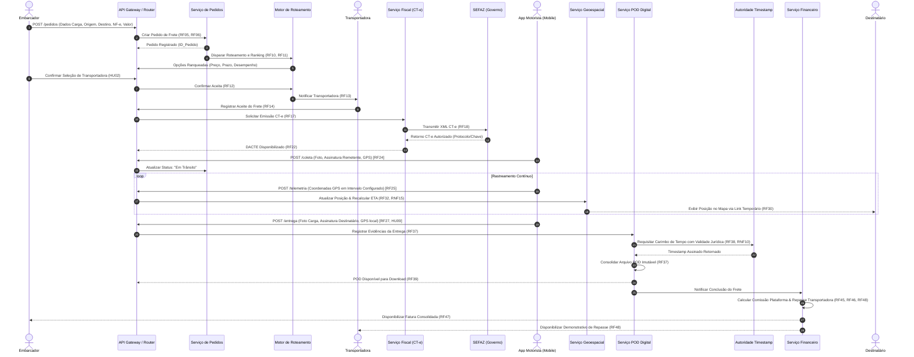
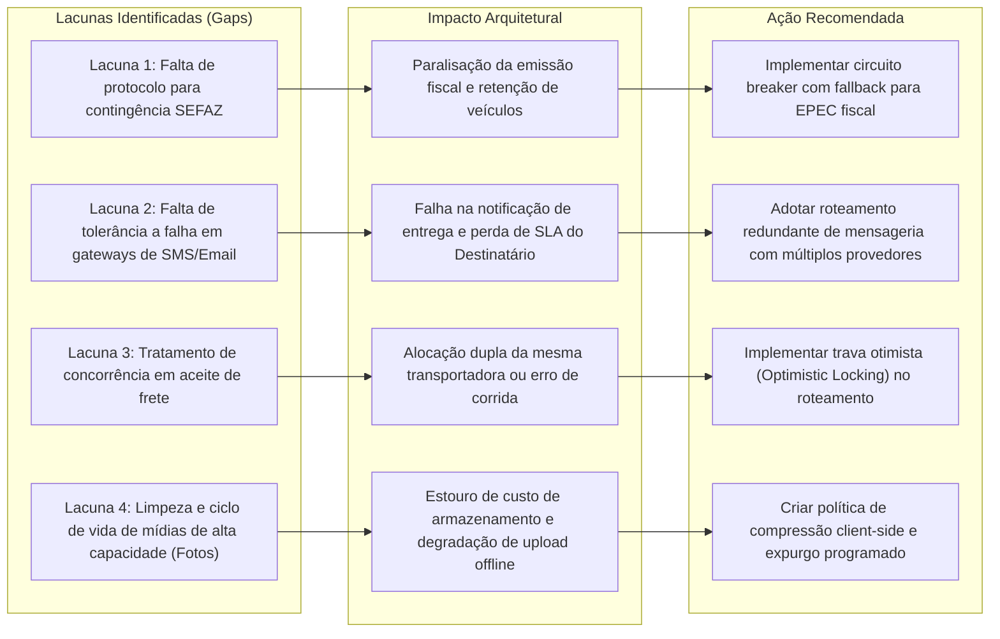

# Relatório Técnico de Arquitetura de Software

**Projeto:** Plataforma de Gestão de Transporte de Cargas e Logística (G04)  
**Autor:** Sistema Multi-Agente de Design de Software (AI4ES — Time 2)  
**Versão:** 1.0 — Canônica  

---

## 1. Identificação das HUs

A tabela abaixo mapeia as Histórias de Usuário (HUs) do sistema, identificando os atores de negócio, os objetivos principais e a síntese dos critérios de aceite estruturados para subsidiar o design arquitetural.

| ID HU | Ator / Perfil | Objetivo de Negócio | Síntese dos Critérios de Aceite |
| :--- | :--- | :--- | :--- |
| **HU01** | Embarcador | Registrar pedido de frete com especificações da carga e prazos. | Validação obrigatória de origem, destino, tipo, peso, volume; upload de documentos (NF-e); declaração de valor da mercadoria; disparo do roteamento automático. |
| **HU02** | Embarcador | Selecionar transportadora ranqueada e contratar seguro de carga. | Exibição de preço, prazo, veículo e score de desempenho; contratação de seguro via plataforma; confirmação disparando CT-e e notificação à transportadora. |
| **HU03** | Embarcador | Acompanhar painel consolidado de fretes e baixar POD digital. | Painel com status em tempo real, transportadora, previsão e alertas; download imediato do POD pós-entrega; destaque visual e alerta de ocorrências. |
| **HU04** | Embarcador | Registrar e acompanhar sinistros de avaria ou extravio. | Formato vinculado ao frete e ocorrências do motorista; anexação de BOs, laudos e fotos; notificações de alteração de status emitidas pela seguradora. |
| **HU05** | Transportadora | Aceitar/recusar pedidos de frete e gerenciar alocação de frota. | Visualização de detalhes antes do aceite; aceite dentro do SLA configurável ou transbordo automático; justificativa obrigatória padronizada em caso de recusa. |
| **HU06** | Transportadora | Monitorar motoristas em campo e ocorrências em tempo real. | Mapa operacional com localização em tempo real; alertas imediatos de ocorrências registradas em campo; canal direto de comunicação com motoristas. |
| **HU07** | Transportadora | Consultar demonstrativo financeiro e saldo líquido de repasse. | Detalhamento por viagem (bruto, comissão retida, saldo líquido); filtros por período; exportação em CSV/PDF; exibição destacada do saldo a receber. |
| **HU08** | Motorista | Executar coleta de carga registrando evidências digitais. | Captura de foto da carga, quantidade de volumes e assinatura digital do remetente; transição para status "em trânsito"; registro prévio de divergências se houver. |
| **HU09** | Motorista | Registrar entrega com foto, assinatura e geolocalização (POD). | Captura de foto, assinatura do destinatário e coordenadas GPS; envio em até 60s ou fila offline; registro de recusa motivada; execução offline resiliente. |
| **HU10** | Motorista | Registrar ocorrências de transporte (avaria, roubo, atraso). | Seleção de categoria padronizada + texto livre; anexação de fotos; envio de alertas imediatos à transportadora e ao embarcador. |
| **HU11** | Destinatário | Rastrear carga em tempo real sem necessidade de cadastro. | Acesso via link seguro com token temporário; visualização da posição no mapa e histórico de eventos; recálculo dinâmico da previsão de entrega. |
| **HU12** | Destinatário | Receber notificações proativas de status via SMS e E-mail. | Disparos nos marcos: coleta, em trânsito, saiu para entrega, ocorrência, entregue; previsão de chegada no marco de saída; gestão de canais preferenciais. |
| **HU13** | Administrador | Monitorar SLAs de frete, aceites pendentes e contingência. | Painel com destaques de fretes com risco de atraso; alertas de estouro de SLA de aceite com ação de reatribuição manual; envio de mensagens diretas. |
| **HU14** | Administrador | Acompanhar painel financeiro consolidado da plataforma. | Métricas de receita de comissão, volume transacionado, ticket médio e taxa de inadimplência; filtros multidimensionais; exportação de dados em CSV/PDF. |

---

## 2. Diagramas de Arquitetura (Mermaid)

### 2.1 Diagrama Geral de Componentes da Arquitetura

O diagrama abaixo apresenta a decomposição funcional e tecnológica abstrata da solução, destacando as camadas de apresentação, gateway, serviços core de domínio, subsistemas de dados e integrações externas.

```mermaid
graph TB
    subgraph "Camada de Apresentação (Clients)"
        WEB_EMB["Portal Web - Embarcador"]
        WEB_TRA["Portal Web - Transportadora"]
        WEB_ADM["Portal Web - Administrador"]
        APP_MOT["App Mobile Motorista (Offline-First / Luvas-Touch)"]
        WEB_DES["Interface Web Destinatário (Link por Token Temporário)"]
    end

    subgraph "Camada de Borda e Entrada (Edge & Gateway)"
        GW["API Gateway / Router Reverse"]
        AUTH_SRV["Serviço de Autenticação e Autorização (MFA / OAuth2 / Tokens)"]
    end

    subgraph "Serviços Core de Domínio (Business Services Layer)"
        SRV_USR["Serviço de Gestão de Usuários e Perfis (RF01-RF03)"]
        SRV_PED["Serviço de Gestão de Pedidos e Mercadorias (RF05-RF09)"]
        SRV_ROT["Motor de Roteamento e Ranqueamento (RF10-RF16)"]
        SRV_FIS["Serviço Fiscal e Emissão de CT-e (RF17-RF22)"]
        SRV_MOT["Serviço da Operação do Motorista & Sync Offline (RF23-RF29)"]
        SRV_GEO["Serviço de Rastreamento e Processamento Geoespacial (RF30-RF32)"]
        SRV_NOT["Serviço de Gestão de Notificações Multi-canal (RF33-RF36)"]
        SRV_POD["Serviço de Gestão de POD e Validação Jurídica (RF37-RF40)"]
        SRV_SEG["Serviço de Seguros e Gestão de Sinistros (RF41-RF44)"]
        SRV_FIN["Serviço Financeiro e Faturamento da Plataforma (RF45-RF49)"]
        SRV_AUD["Motor de Auditoria e Trilha Imutável (RF04, RNF11)"]
    end

    subgraph "Camada de Dados e Eventos (Data & Messaging Layer)"
        BUS_EVT["Barramento de Eventos Assíncronos / Broker Mensageria"]
        DB_REL["Repositório Transacional Dados de Negócio"]
        DB_GEO["Repositório Geoespacial e Séries Temporais (RNF23)"]
        STG_DOC["Repositório de Objetos e Documentos Digitais (NF-e, POD, BO)"]
    end

    subgraph "Sistemas e Serviços Externos (External Integrations)"
        EXT_SEFAZ["SEFAZ - Autorizadores CT-e / Consultas NF-e"]
        EXT_SEG["Provedores de Seguros / Corretoras"]
        EXT_NOT["Gateway SMS / E-mail / Push"]
        EXT_TSA["Autoridade de Carimbo de Tempo (ICP-Brasil / Timestamp)"]
    end

    %% Relações Clients -> Gateway
    WEB_EMB --> GW
    WEB_TRA --> GW
    WEB_ADM --> GW
    APP_MOT --> GW
    WEB_DES --> GW

    %% Gateway -> Auth & Business Services
    GW --> AUTH_SRV
    GW --> SRV_USR
    GW --> SRV_PED
    GW --> SRV_ROT
    GW --> SRV_FIS
    GW --> SRV_MOT
    GW --> SRV_GEO
    GW --> SRV_NOT
    GW --> SRV_POD
    GW --> SRV_SEG
    GW --> SRV_FIN

    %% Integração com Barramento de Eventos
    SRV_PED -- "Evento: Pedido Criado" --> BUS_EVT
    SRV_ROT -- "Evento: Transportadora Selecionada" --> BUS_EVT
    SRV_MOT -- "Evento: Posição GPS / Coleta / Ocorrência" --> BUS_EVT
    SRV_POD -- "Evento: POD Concluído" --> BUS_EVT
    BUS_EVT -- "Consome Eventos" --> SRV_NOT
    BUS_EVT -- "Consome Eventos" --> SRV_GEO
    BUS_EVT -- "Consome Eventos" --> SRV_FIS
    BUS_EVT -- "Consome Eventos" --> SRV_FIN
    BUS_EVT -- "Registra Trilha" --> SRV_AUD

    %% Persistência de Dados
    SRV_USR & SRV_PED & SRV_ROT & SRV_FIN & SRV_SEG & SRV_FIS --> DB_REL
    SRV_GEO --> DB_GEO
    SRV_POD & SRV_PED & SRV_SEG --> STG_DOC
    SRV_AUD --> DB_REL

    %% Integrações Externas
    SRV_FIS <--> EXT_SEFAZ
    SRV_SEG <--> EXT_SEG
    SRV_NOT <--> EXT_NOT
    SRV_POD <--> EXT_TSA
```

---

### 2.2 Diagrama de Sequência — Ciclo de Vida Completo do Frete e Registro de POD

O diagrama a seguir detalha o fluxo interativo fim a fim, desde a criação do pedido pelo embarcador, roteamento, emissão de CT-e, execução da viagem pelo motorista (com sincronização), até a entrega com POD legalmente válido e liquidação financeira.

---

## 3. Decisões de Arquitetura

O desenho da solução atende rigorosamente ao princípio da **Neutralidade Tecnológica**, focando na especificação de padrões de integração, topologies de dados e garantias operacionais sem prescrição de marcas comerciais ou softwares proprietários/específicos.

### 3.1 Padrão de Arquitetura de Software e Estilo de Integração
*   **Arquitetura Baseada em Eventos (Event-Driven Architecture - EDA):** O núcleo da plataforma adota o desacoplamento por eventos de domínio. Ações operacionais (ex: *PedidoCriado*, *TransportadoraAceitou*, *ColetaRealizada*, *PosicaoGPSAtualizada*, *EntregaConcluida*) são publicadas em um Barramento de Mensageria Assíncrono. Isso garante alta performance, elasticidade e isolamento de falhas, atendendo ao requisito de suporte a alto volume simultâneo de dados geoespaciais (RNF16).
*   **Descomposiçao Modular Centrada em Domínios (Domain-Driven Design):** As responsabilidades do sistema são segmentadas em serviços autônomos por Bounded Contexts (Usuários, Pedidos, Roteamento, Fiscal, Telemetria, POD, Financeiro, Auditoria), permitindo evolução e dimensionamento independentes de cada capacidade da plataforma.

### 3.2 Estratégia da Aplicação Mobile (Offline-First e Usabilidade)
*   **Persistência Local e Sincronização Resiliente (RNF17, RF28):** O aplicativo mobile do motorista emprega uma arquitetura *Offline-First*. Dados de ordens de serviço, comprovantes digitais (fotos e assinaturas) e leituras de geolocalização são gravados primeiramente em banco de dados embarcado no dispositivo.
*   **Mecanismo de Reconciliação e Resolução de Conflitos:** Um worker de sincronização em segundo plano gerencia o reenvio idempotente dos pacotes assim que a conectividade for restabelecida. Para evitar invalidação de ordenação temporal, cada evento offline recebe a estampa de tempo nativa do dispositivo no instante exato da captura, protegida contra alteração manual, e vinculada a vetores de sequência lógica (*Vector Clocks*).
*   **Interface Otimizada (RNF18, RNF21):** O design da interface móvel segue o padrão de componentes ampliados (*high-touch targets*) para manipulação segura com luvas e temas de alto contraste para baixa luminosidade. O fluxo final de entrega é desenhado para execução estrita em no máximo quatro passos na tela.

### 3.3 Modelo de Segurança e Proteção de Dados
*   **Criptografia Ponta a Ponta (RNF01, RNF02):** Todo o tráfego de dados em trânsito é cifrado estritamente via protocolos TLS 1.2 ou superior. Dados sensíveis mantidos em repouso (informações financeiras, fiscais, dados pessoais de motoristas/destinatários e coordenadas históricas de localização) são criptografados obrigatoriamente utilizando algoritmo simétrico AES-256.
*   **Gestão de Identidades e Acesso (RNF03, RNF04, RNF05):**
    *   **Autenticação Multifator (MFA):** Exigida rigorosamente nos acessos dos perfis de Embarcador e Administrador da Plataforma.
    *   **Tokens de Sessão Móvel:** O aplicativo do motorista utiliza tokens de sessão renováveis baseados em OAuth2/JWT com ciclo de vida curto e mecanismo de expiração por inatividade configurável.
    *   **Links de Rastreamento Protegidos:** O acesso do Destinatário (RF30) é provido por URLs efêmeras contendo tokens criptográficos de uso único (*Single-Use Signed Tokens*), parametrizados com prazo de expiração atrelado à conclusão do frete, impedindo enumeração ou visualização não autorizada de fretes terceiros (RNF05, RNF06).

### 3.4 Conformidade Regulatória, Auditoria e Validade Jurídica
*   **Validade Jurídica do POD Digital (RNF10, RF38):** O componente de geração do Comprovante de Entrega Digital (POD) é integrado a um Serviço de Autoridade de Carimbo de Tempo (*Timestamp Authority*) aderente à legislação vigente de assinaturas eletrônicas (Lei nº 14.063/2020). Cada POD gerado recebe uma estampa temporal imutável e assinatura digital baseada em chave pública no exato momento da consolidação.
*   **Emissão Fiscal CT-e e Contingência (RF17-RF22, RNF07, RNF08):** O serviço fiscal valida a estrutura XML dos documentos contra os esquemas XSD atualizados da SEFAZ antes da transmissão. O sistema provê suporte nativo a operações normais, complementares, de anulação e substituição, além do modo de contingência offline com sincronização e transmissão diferida (RF19).
*   **Privacidade e Trilha de Auditoria (RNF09, RNF11, RF04):** Todas as mutações e transações críticas (fiscais, financeiras, cadastrais e de acesso) são registradas por um Motor de Auditoria centralizado em append-only storage, com retenção temporal garantida de 5 anos (atendendo ao Código Tributário Nacional) e conformidade com os preceitos da LGPD para anonimização e direito ao esquecimento pós-retenção legal.

---

## 4. Tabela de Componentes e Rastreabilidade

A tabela a seguir estabelece a rastreabilidade total entre os componentes conceituais do sistema, suas responsabilidades primárias, seus relacionamentos de comunicação e a sua origem explícita nos Requisitos Funcionais (RF), Não Funcionais (RNF) e Histórias de Usuário (HU).

| Componente | Responsabilidade Principal | Comunica-se com | Origem (HU / Critério de Aceite) |
| :--- | :--- | :--- | :--- |
| **Portal Web (Embarcador, Transportadora, Admin)** | Prover interface responsiva e segura para gestão de solicitações, monitoramento de frota, aceites, relatórios e painéis financeiros. | API Gateway | HU01, HU02, HU03, HU04, HU05, HU06, HU07, HU13, HU14, RNF20 |
| **App Mobile Motorista** | Coletar dados operacionais de campo (coleta, telemetria, ocorrências, entregas), permitir navegação multi-paradas e sincronizar offline. | API Gateway / Router | HU08, HU09, HU10, RF23-RF29, RNF17, RNF18, RNF19, RNF21 |
| **Interface Web Destinatário** | Exibir painel público efêmero de rastreamento em tempo real com posição no mapa e histórico de eventos da carga. | API Gateway / Router | HU11, RF30-RF32, RNF05 |
| **API Gateway / Edge Router** | Ponto único de entrada, roteamento de requisições, encerramento TLS, limitação de taxa (rate limiting) e validação inicial de tokens. | Camada de Apresentação, Auth Service, Serviços Core | RNF01, RNF04, RNF05, RNF06 |
| **Serviço de Autenticação e Autorização** | Gerenciar identidades, autenticação multifator (MFA), emissão e renovação de tokens JWT/OAuth2 e controle de acesso baseado em perfis (RBAC). | API Gateway, Serviço de Usuários | RF01, RF02, RNF03, RNF04 |
| **Serviço de Gestão de Usuários e Perfis** | Manter cadastros de embarcadores, transportadoras, motoristas, veículos e destinatários, bem como suas associações operacionais. | Repositório Transacional, Auth Service | RF01, RF03 |
| **Serviço de Gestão de Pedidos e Mercadorias** | Processar inclusão de pedidos de frete, anexação de NF-es, declaração de valor e controle do ciclo de vida dos status do frete. | Motor de Roteamento, Repositório de Objetos, Repositório Transacional | HU01, RF05-RF09 |
| **Motor de Roteamento e Ranqueamento** | Executar triagem automática de transportadoras por regras (preço, prazo, veículos, histórico), gerenciar SLAs de resposta e efetuar transbordo de pedidos. | Barramento de Eventos, Serviço de Pedidos, Repositório Transacional | HU02, HU05, HU13, RF10-RF16, RNF13 |
| **Serviço Fiscal e Emissão de CT-e** | Validar NF-e, gerar XML do CT-e no padrão SEFAZ (XSD), gerenciar transmissões, modos de contingência, cancelamentos e emissão de DACTE. | SEFAZ Externa, Barramento de Eventos, Repositório Transacional | RF17-RF22, RNF07, RNF08, RNF14, RNF24 |
| **Serviço da Operação do Motorista & Sync** | Gerenciar o envio de ordens de serviço para o mobile, controlar o recebimento de eventos de coleta/ocorrência e coordenar a fila de sincronização offline. | App Mobile Motorista, Barramento de Eventos, Repositório Transacional | HU08, HU09, HU10, RF23-RF29, RNF17 |
| **Serviço de Rastreamento & Telemetria** | Processar correntes contínuas de coordenadas GPS, calcular rotas/previsões dinâmicas de entrega (ETA) e manter séries temporais de localização. | Repositório Geoespacial, Barramento de Eventos, Interface Destinatário | HU11, RF25, RF30-RF32, RNF15, RNF16, RNF23 |
| **Serviço de Gestão de Notificações** | Orquestrar e disparar alertas multicanais (E-mail, SMS, Push) em tempo real para os perfis com base em eventos operacionais. | Provedores Externos SMS/Email, Barramento de Eventos | HU12, RF13, RF33-RF36 |
| **Serviço de POD Digital & Validade Jurídica** | Agrupar evidências digitais (fotos, assinaturas, GPS), obter carimbo do tempo legalmente válido e compilar o documento POD final. | Autoridade Timestamp Externa, Repositório de Objetos, Barramento de Eventos | HU09, RF37-RF40, RNF10 |
| **Serviço de Seguros e Gestão de Sinistros** | Integrar com seguradoras para cotação/contratação automática de apólices e gerenciar o ciclo de abertura, anexação de provas e status de sinistros. | Seguradoras Externas, Repositório de Objetos, Repositório Transacional | HU04, RF06, RF41-RF44 |
| **Serviço Financeiro e Faturamento** | Calcular frete bruto, retenção de comissão da plataforma, emissão de faturas consolidadas a embarcadores e extratos de repasse a transportadoras. | Repositório Transacional, Barramento de Eventos | HU07, HU14, RF45-RF49 |
| **Motor de Auditoria e Trilha Imutável** | Registrar de forma inalterável e temporal todos os logs de ações críticas de usuários, acessos, movimentações financeiras e fiscais. | Repositório Transacional, Todos os Serviços Core | RF04, RNF11 |
| **Barramento de Eventos Assíncronos** | Canal de mensageria de alta performance para desacoplamento e distribuição de eventos em tempo real entre microsserviços. | Todos os Serviços Core de Domínio | RNF12, RNF16 |
| **Repositório Geoespacial & Séries Temporais** | Armazenar e prover consultas otimizadas de alta taxa de escrita e leitura sobre trajetórias GPS e histórico de posições dos veículos. | Serviço de Rastreamento & Telemetria | RNF16, RNF23 |

---

## 5. Bloqueios e Pendências

A análise técnica de arquitetura identificou os seguintes bloqueios técnicos, regulatórios e pendências de definição de negócio que demandam alinhamento prévio antes da fase de detalhamento de código (*Sprint Planning*):

1.  **Regra de Transbordo por Inatividade da Transportadora (RF15 / HU13):**  
    * *Pendência:* O requisito especifica o repasse automático do pedido à próxima transportadora ranqueada caso não haja resposta dentro do "prazo configurado".  
    * *Impacto Arquitetural:* Inexistência da definição dos parâmetros padrão e limites mínimos/máximos para essa janela temporal de timeout. É necessária a especificação formal do componente de temporizador de eventos (*SLA Scheduler*) para evitar concorrência ou alocações duplicadas.

2.  **Integração com Autoridade de Carimbo de Tempo (ACT) (RF38 / RNF10):**  
    * *Pendência:* Ausência da especificação da infraestrutura ou provedor terceirizado de *Timestamping* com certificação ICP-Brasil a ser adotado para concessão de validade jurídica ao POD Digital (Lei nº 14.063/2020).  
    * *Impacto Arquitetural:* Bloqueia a assinatura do contrato de integração da API do `Serviço de POD Digital`.

3.  **Mecanismo de Contingência Offline da SEFAZ (RF19 / RNF07):**  
    * *Pendência:* O protocolo exato de entrada em contingência (ex: EPEC vs FS-DA) e a janela máxima de tempo permitida para sincronização posterior dos XMLs não foram explicitados no escopo de requisitos.  
    * *Impacto Arquitetural:* Exige definição formal das filas de retentativa e armazenamento temporário de documentos fiscais pendentes de autorização na camada do `Serviço Fiscal`.

4.  **Política de Mitigação de Conflito de Relógio em Operação Offline (RF28 / RNF17):**  
    * *Pendência:* Indefinição sobre o comportamento do sistema quando um motorista realiza um registro offline com o relógio do dispositivo móvel desajustado (adulterado manual ou incorreto).  
    * *Impacto Arquitetural:* Risco à integridade temporal das evidências e rastreabilidade jurídica. O serviço móvel demandará componente local de validação de horário relativo desvinculado da hora configurada no SO do smartphone.

5.  **Estratégia de Retenção LGPD vs. Exigência do Código Tributário Nacional (RNF09 / RNF11):**  
    * *Pendência:* Conflito em potencial entre o direito do titular à eliminação dos dados pessoais (LGPD) e a obrigatoriedade de guarda inalterável de dados fiscais/financeiros pelo prazo mínimo de 5 anos (CTN).  
    * *Impacto Arquitetural:* O `Motor de Auditoria` e os repositórios de dados precisarão implementar mecanismos estritos de *pseudonimização/anonomização* de dados pessoais ao fim da operação de entrega, mantendo os registros fiscais/financeiros intactos sem violar nenhuma das duas legislações.

---

## 6. Cobertura de Requisitos

A matriz abaixo atesta a rastreabilidade e a cobertura de 100% dos Requisitos Funcionais (RF) e Não Funcionais (RNF) especificados no projeto pelos componentes da arquitetura e pelas decisões técnicas tomadas.

### 6.1 Requisitos Funcionais (RF)

| ID RF | Componente Responsável | Decisão de Arquitetura / Mecanismo Aplicado |
| :--- | :--- | :--- |
| **RF01** | Serviço de Gestão de Usuários e Perfis | Cadastro e controle de permissões por perfil de usuário (RBAC). |
| **RF02** | Serviço de Autenticação e Autorização | Controle de acesso via tokens de acesso e autorização por escopos/roles. |
| **RF03** | Serviço de Gestão de Usuários e Perfis | Vínculo hierárquico entre Transportadora, Motoristas e Frota. |
| **RF04** | Motor de Auditoria e Trilha Imutável | Registro centralizado e imutável de logs de auditoria de operações críticas. |
| **RF05** | Serviço de Gestão de Pedidos e Mercadorias | Captura e validação estruturada dos atributos do pedido de frete. |
| **RF06** | Serviço de Gestão de Pedidos / Seguros | Registro do valor declarado e repasse aos motores de seguro e ad valorem. |
| **RF07** | Portal Web (Embarcador) / Serviço de Pedidos | Visão agregada do status dos pedidos via repositório transacional. |
| **RF08** | Serviço de Gestão de Pedidos e Mercadorias | Motor de regras de cancelamento pré-aceite da transportadora. |
| **RF09** | Serviço de Gestão de Pedidos / Repositório Objetos | Armazenamento de anexos e documentos (NF-e, fichas técnicas) em storage seguro. |
| **RF10** | Motor de Roteamento e Ranqueamento | Algoritmo de cruzamento entre tipo de carga, rota (origem/destino) e habilitação. |
| **RF11** | Motor de Roteamento e Ranqueamento | Comparador multicritério dinâmico (preço, SLA, frota, score de desempenho). |
| **RF12** | Motor de Roteamento e Ranqueamento | Ranqueamento de opções com suporte a aceite manual ou confirmação automática. |
| **RF13** | Serviço de Gestão de Notificações | Disparo de alertas síncronos/assíncronos para transportadoras selecionadas. |
| **RF14** | Motor de Roteamento / Serviço de Pedidos | Registro formal do evento de aceite ou recusa com justificativa cadastrada. |
| **RF15** | Motor de Roteamento e Ranqueamento | Temporizador de transbordo automático (*fallback*) para próxima transportadora do rank. |
| **RF16** | Motor de Roteamento / Serviço de Usuários | Recálculo contínuo do índice de reputação/desempenho da transportadora. |
| **RF17** | Serviço Fiscal e Emissão de CT-e | Integração via chamadas estruturadas para geração do CT-e pré-viagem. |
| **RF18** | Serviço Fiscal e Emissão de CT-e | Transmissão e monitoramento de status do XML junto aos autorizadores da SEFAZ. |
| **RF19** | Serviço Fiscal e Emissão de CT-e | Mecanismo de contingência offline com fila de sincronização posterior. |
| **RF20** | Serviço Fiscal e Emissão de CT-e | Consulta e validação de chaves das NF-es informadas junto à SEFAZ. |
| **RF21** | Serviço Fiscal e Emissão de CT-e | Gestão dos fluxos de cancelamento e inutilização de numeração de CT-e. |
| **RF22** | Serviço Fiscal / Repositório de Objetos | Geração e disponibilização do PDF do DACTE para download. |
| **RF23** | App Mobile Motorista / Serviço da Operação | Distribuição de ordens de serviço do dia com visualização detalhada de anexos. |
| **RF24** | App Mobile Motorista / Serviço da Operação | Captura de evidências de coleta (fotos, volumes, assinatura remetente). |
| **RF25** | App Mobile Motorista / Serviço Geoespacial | Coleta e transmissão periódica de coordenadas de geolocalização. |
| **RF26** | App Mobile Motorista / Serviço da Operação | Formato de registro categorizado de ocorrências operacionais de transporte. |
| **RF27** | App Mobile Motorista / Serviço de POD Digital | Captura de foto da carga/comprovante e assinatura digital no ato da entrega. |
| **RF28** | App Mobile Motorista / Sync Service | Arquitetura *Offline-First* com persistência em banco local e sincronização posterior. |
| **RF29** | App Mobile Motorista | Exibição e cálculo de rotas otimizadas com suporte a múltiplas paradas. |
| **RF30** | Interface Web Destinatário / Auth Service | Acesso público seguro via token de rastreamento temporário embutido na URL. |
| **RF31** | Interface Web Destinatário / Serviço Geoespacial | Timeline cronológica de eventos com localização e horários da carga. |
| **RF32** | Interface Web Destinatário / Serviço Geoespacial | Exibição gráfica da posição atual no mapa e recálculo dinâmico do ETA. |
| **RF33** | Serviço de Notificações Multi-canal | Envio de mensagens transacionais via E-mail e SMS para o destinatário. |
| **RF34** | Serviço de Notificações Multi-canal | Alertas automáticos ao embarcador referentes a eventos da viagem e POD. |
| **RF35** | Serviço de Notificações Multi-canal | Alertas à transportadora sobre novos fretes disponíveis, prazos e ocorrências. |
| **RF36** | Serviço de Notificações / Painel Admin | Notificação de exceção ao administrador sobre ofertas expiradas ou risco de SLA. |
| **RF37** | Serviço de POD Digital | Agrupamento de foto, assinatura, hora, geolocalização e geração do POD consolidado. |
| **RF38** | Serviço de POD Digital / Autoridade Timestamp | Aplicação de estampa de tempo legalmente válida (*Timestamping*). |
| **RF39** | Serviço de POD Digital / Repositório Objetos | Disponibilização imediata do PDF do POD pós-entrega para partes autorizadas. |
| **RF40** | App Mobile Motorista / Serviço da Operação | Registro formalizado de recusa de entrega com justificativa e foto com geo-tag. |
| **RF41** | Serviço de Seguros e Gestão de Sinistros | Comunicação via API com seguradoras para cotação e emissão da apólice. |
| **RF42** | Serviço de Seguros e Gestão de Sinistros | Abertura de sinistros consolidando dados da viagem, ocorrências e fotos. |
| **RF43** | Serviço de Seguros e Gestão de Sinistros | Acompanhamento do ciclo de vida do sinistro e notificações de progresso. |
| **RF44** | Serviço de Seguros / Repositório Objetos | Armazenamento estruturado e catalogado da documentação de sinistros (BO, laudos). |
| **RF45** | Serviço Financeiro e Faturamento | Motor de cálculo de frete baseado em tabelas operacionais da transportadora. |
| **RF46** | Serviço Financeiro e Faturamento | Algoritmo de dedução e retenção da taxa de comissão da plataforma sobre o frete. |
| **RF47** | Serviço Financeiro e Faturamento | Consolidação periódica de faturamento para o embarcador com impostos e detalhes. |
| **RF48** | Serviço Financeiro e Faturamento | Geração do demonstrativo de repasse com extrato bruto, comissão e valor líquido. |
| **RF49** | Serviço Financeiro / Portal Web Admin | Dashboard analítico de receita de comissões, volume transacionado e inadimplência. |

### 6.2 Requisitos Não Funcionais (RNF)

| ID RNF | Categoria | Mecanismo de Arquitetura Adotado |
| :--- | :--- | :--- |
| **RNF01** | Segurança | Encerramento TLS 1.2+ no API Gateway para todas as comunicações externas. |
| **RNF02** | Segurança | Criptografia simétrica AES-256 para dados armazenados em repositórios nativos. |
| **RNF03** | Segurança | Autenticação Multifator (MFA) obrigatória para perfis Admin e Embarcador. |
| **RNF04** | Segurança | Tokens OAuth2 de sessão efêmeros com renovação e bloqueio por inatividade no app. |
| **RNF05** | Segurança | Tokens temporários restritos e assinados criptograficamente para rastreamento. |
| **RNF06** | Segurança | Filtros de autorização por contexto garantindo acesso restrito à geolocalização. |
| **RNF07** | Conformidade | Validação de schemas XSD atualizados da SEFAZ pelo Serviço Fiscal. |
| **RNF08** | Conformidade | Módulos de emissão configurados para os quatro tipos legais de CT-e. |
| **RNF09** | Conformidade | Camada de governança de dados e consentimento alinhada com as diretrizes da LGPD. |
| **RNF10** | Conformidade | Integração com Autoridade de Timestamp aderente à Lei nº 14.063/2020. |
| **RNF11** | Conformidade | Motor de Auditoria com armazenamento imutável em append-only com retenção de 5 anos. |
| **RNF12** | Disponibilidade | Arquitetura distribuída com redundância e SLA de disponibilidade global $\ge 99,5\%$. |
| **RNF13** | Desempenho | Execução do algoritmo de roteamento otimizada via memória com tempo $< 10$s. |
| **RNF14** | Desempenho | Processamento de transmissão de CT-e assíncrono projetado para tempo $< 30$s. |
| **RNF15** | Desempenho | Ingestão e projeção de atualização do mapa de rastreamento com latência $< 30$s. |
| **RNF16** | Escalabilidade | Processamento assíncrono via Barramento de Eventos e BD de Séries Temporais. |
| **RNF17** | Resiliência | Arquitetura *Offline-First* no App Mobile do Motorista com reconciliação. |
| **RNF18** | Usabilidade | Interface móvel com componentes ampliados para luvas e suporte a modo escuro. |
| **RNF19** | Compatibilidade | Desenvolvimento nativo/híbrido focado prioritariamente em Android e suporte iOS. |
| **RNF20** | Compatibilidade | Portais web desenvolvidos sob padrões HTML5/CSS3 responsivos para navegadores modernos. |
| **RNF21** | Usabilidade | UX simplificado no aplicativo limitando a jornada de confirmação de entrega a 4 toques. |
| **RNF22** | Backup | Rotinas automatizadas de backup diário, retenção de 90 dias e RPO $\le 1$ hora. |
| **RNF23** | Infraestrutura | Uso de Repositório de Dados especializado em Séries Temporais e Índices Geoespaciais. |
| **RNF24** | Interoperabilidade | APIs HTTP/REST desacopladas e versionadas para integrações (SEFAZ, Seguradoras). |
| **RNF25** | Manutenibilidade | Exposição de métricas operacionais e dashboards de observabilidade em tempo real. |

---

## 7. Gap Analysis

A avaliação arquitetural identificou lacunas operacionais e de especificação nos requisitos de entrada, mapeando seus impactos técnicos e indicando ações para os times de engenharia.

### 7.1 Matriz de Detalhamento das Lacunas e Ações Recomendadas

| Lacuna Identificada | Tipo | Impacto Arquitetural | Ação Recomendada para o Time de Desenvolvimento |
| :--- | :--- | :--- | :--- |
| **1. Protocolo de contingência fiscal não detalhado** | Funcional / Regulatório | Interrupção do fluxo de saída do veículo caso a SEFAZ estadual fique indisponível durante a emissão (RF19). | Implementar padrão *Circuit Breaker* no `Serviço Fiscal` para chavear automaticamente para o modo contingência EPEC, mantendo fila de reenvio assíncrono. |
| **2. Ausência de fallback em Notificações Críticas** | Infraestrutura | Falha de entrega de notificações SMS (RF33) pode deixar o destinatário desinformado sobre a chegada da carga. | Implementar estratégia de roteamento de notificações multi-provedor (fallback automático de SMS para WhatsApp/E-mail se a entrega falhar em 15s). |
| **3. Condição de corrida no aceite de ofertas** | Concorrência | Riscos de duas transportadoras aceitarem simultaneamente a mesma oferta antes do encerramento da rodada (RF14). | Aplicar concorrência otimista (*Optimistic Locking*) ou travas distribuídas no repositório de dados do `Motor de Roteamento` durante a transição de estado da oferta. |
| **4. Gestão de armazenamento de mídias de campo** | Desempenho / Custo | Alto volume de uploads de fotos em alta resolução no App Mobile (RF24, RF27) pode esgotar a franquia de dados móveis do motorista e elevar custos de storage. | Implementar compactação obrigatoriamente *client-side* no aplicativo mobile antes do envio (resolução máx 1920x1080 em JPEG) e definir política de expurgo/tiering de arquivos no storage após 1 ano. |
| **5. Exclusão de token no link do Destinatário** | Segurança | Se o link do destinatário (RF30) permanecer ativo após a entrega, informações históricas de localização e dados do motorista ficam expostos continuadamente. | Implementar revogação programada do token dinâmico no `Serviço de Autenticação`, definindo expiração rígida em até 24 horas após a consolidação do POD. |

---

## 8. Conclusão e Próximos Passos

O presente **Relatório Canônico de Arquitetura de Software** estabelece a fundação estrutural para a Plataforma de Gestão de Transporte de Cargas e Logística (G04). 

### Próximas Ações do Time de Engenharia:
1. Validar e deliberar sobre as pendências apontadas na **Seção 5 (Bloqueios e Pendências)** junto aos stakeholders de negócio e regulatórios.
2. Incorporar as ações corretivas da **Seção 7 (Gap Analysis)** no Backlog Técnico.
3. Iniciar o detalhamento das APIs conceituais (Contratos de Interface OpenAPI/Swagger) a partir da **Seção 4 (Tabela de Componentes)**.