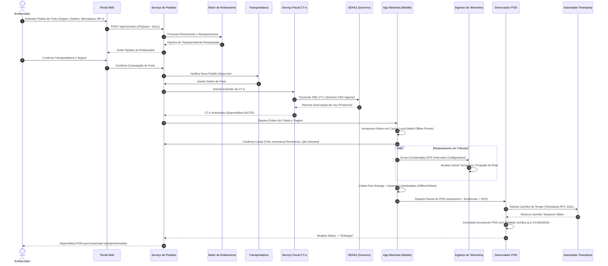

# Relatório Técnico de Arquitetura de Software

## 1. Identificação das HUs

A tabela a seguir consolida a relação de Histórias de Usuário (HUs) com seus respectivos atores, objetivos de negócio e o impacto arquitetural gerado no sistema.

| ID | Título | Ator / Perfil | Objetivo de Negócio | Impacto Arquitetural Principal |
| :--- | :--- | :--- | :--- | :--- |
| **HU01** | Registrar pedido de frete | Embarcador | Permite registrar solicitações de frete sem negociação manual. | Requer validação de payload, cálculo preliminar de ad valorem, upload seguro de documentos e disparo assíncrono do motor de roteamento. |
| **HU02** | Selecionar transportadora e contratar seguro | Embarcador | Comparar ofertas ranqueadas e contratar apólice em fluxo único. | Integração síncrona/assíncrona com API de Seguradoras, orquestração de confirmação de frete e disparo de emissão fiscal (CT-e). |
| **HU03** | Acompanhar pedidos e receber comprovante | Embarcador | Visibilidade centralizada dos fretes e acesso instantâneo ao POD. | Consolidação de estados em visão agregada, alertas via mensageria e repositório de alta disponibilidade para arquivos do POD. |
| **HU04** | Abrir sinistro por avaria ou extravio | Embarcador | Acionar cobertura de seguro diretamente pela plataforma. | Módulo de gestão de sinistros com anexação de documentos e integração bidirecional de status com a seguradora parceira. |
| **HU05** | Aceitar pedidos de frete e gerenciar frota | Transportadora | Gestão de capacidade e decisão sobre solicitações de transporte. | Exposição de ordens com *timeout* de aceite e roteamento automático em cascata (*fallback*) em caso de recusa. |
| **HU06** | Acompanhar operação dos motoristas | Transportadora | Monitoramento geográfico da frota ativa e gestão de ocorrências. | Ingestão e processamento de telemetria em tempo real com renderização geoespacial no painel operacional. |
| **HU07** | Consultar demonstrativo financeiro | Transportadora | Conciliação e transparência sobre comissões e valores líquidos. | Processamento de relatórios consolidados, extrato de repasse e exportação de dados em formatos estruturados. |
| **HU08** | Executar coleta com registro de evidências | Motorista | Formalização do início do transporte com captura de dados. | Execução via cliente móvel com persistência local, fotos, assinatura digital e sincronização bidirecional de status. |
| **HU09** | Registrar entrega com assinatura digital | Motorista | Geração de comprovante de entrega digital com validade jurídica. | Operação *Offline-First*, captura de biometria/assinatura, carimbo do tempo (timestamp) legal e upload do pacote POD. |
| **HU10** | Registrar ocorrência durante transporte | Motorista | Notificação imediata de imprevistos na rota (avaria, assalto). | Publicação de eventos de exceção com prioridade alta, anexação de mídias e notificação das partes interessadas. |
| **HU11** | Rastrear carga sem necessidade de cadastro | Destinatário | Transparência no recebimento via acesso público tokenizado. | Endpoint público protegido por token temporário de uso único, consulta otimizada a histórico de eventos e posição geográfica. |
| **HU12** | Receber notificações de cada etapa | Destinatário | Atualização proativa via múltiplos canais (e-mail/SMS). | Gateway de Notificações orientado a eventos de transição de estado da carga. |
| **HU13** | Monitorar SLA de fretes e acionar contingência | Administrador | Gestão operacional proativa e intervenção em fretes críticos. | Motor de regras de SLA, monitoramento de prazos em tempo real e capacidade de sobrescrita/reatribuição manual. |
| **HU14** | Acompanhar painel financeiro | Administrador | Visão consolidada da receita, volume e saúde financeira da plataforma. | Agregação analítica de métricas financeiras, cálculo de comissões e dashboards analíticos de consolidação. |

---

## 2. Diagramas de Arquitetura (Mermaid)

### 2.1 Diagrama de Componentes e Visão Geral da Arquitetura

O diagrama a seguir ilustra a separação de responsabilidades em camadas, os componentes centrais da plataforma e as integrações com sistemas externos (SEFAZ, Seguradoras, Autoridade Certificadora de Tempo).

```mermaid
graph TB
    subgraph ClientLayer [Camada de Apresentação & Clientes]
        WebPortal[Portal Web Responsivo<br/>Embarcador / Transportadora / Admin]
        MobileApp[Aplicativo Mobile Native/Hybrid<br/>Motorista - Offline First]
        PublicTrack[Web View de Rastreamento<br/>Destinatário - Accs via Token]
    end

    subgraph GatewayLayer [Camada de Borda & Segurança]
        APIGateway[API Gateway / Ingress Controller]
        AuthService[Serviço de Autenticação & MFA]
    end

    subgraph CoreDomainLayer [Camada de Domínio & Serviços de Negócio]
        OrderService[Gerenciador de Pedidos de Frete]
        RoutingEngine[Motor de Roteamento & Ranqueamento]
        FiscalService[Serviço Fiscal Integrador CT-e]
        DriverService[Gerenciador de Operações & Coleta]
        TelemetryService[Serviço de Ingestão de Telemetria]
        PODService[Gerenciador de POD & Validação Jurídica]
        NotificationService[Serviço Notificador Multi-Canal]
        InsuranceService[Gerenciador de Seguros e Sinistros]
        FinancialService[Motor Financeiro & Faturamento]
    end

    subgraph EventLayer [Camada de Integração Reativa]
        EventBus[Barramento de Eventos e Mensageria]
    end

    subgraph PersistenceLayer [Camada de Armazenamento de Dados]
        RelationalDB[(Banco de Dados Relacional<br/>Transacional & Fiscal)]
        GeoTimeDB[(Banco de Dados Geoespacial<br/>& Séries Temporais)]
        ObjectStore[(Storage de Objetos<br/>Documentos / POD / Fotos)]
    end

    subgraph ExternalSystems [Sistemas Externos / Parceiros]
        SEFAZ[SEFAZ - Autorização CT-e]
        InsuranceAPIs[APIs de Seguradoras]
        TSAService[Autoridade de Carimbo do Tempo - TSA]
        NotificationGateways[Gateways SMS / E-mail]
    end

    %% Relações de Entrada
    WebPortal -->|HTTPS / TLS 1.2+| APIGateway
    MobileApp -->|HTTPS / REST / Sync| APIGateway
    PublicTrack -->|HTTPS / Token Auth| APIGateway

    APIGateway --> AuthService
    APIGateway --> OrderService
    APIGateway --> RoutingEngine
    APIGateway --> DriverService
    APIGateway --> TelemetryService
    APIGateway --> PODService
    APIGateway --> InsuranceService
    APIGateway --> FinancialService

    %% Relações com Barramento de Eventos
    OrderService -->|PedidoCriado / Cancelado| EventBus
    RoutingEngine -->|FreteOfertado / Recusado| EventBus
    DriverService -->|ColetaRegistrada / Ocorrência| EventBus
    TelemetryService -->|PosicaoAtualizada| EventBus
    PODService -->|EntregaConcluida| EventBus
    
    EventBus --> NotificationService
    EventBus --> FiscalService
    EventBus --> FinancialService

    %% Relações de Persistência
    OrderService & RoutingEngine & FinancialService & DriverService --> RelationalDB
    TelemetryService --> GeoTimeDB
    PODService & OrderService & InsuranceService --> ObjectStore

    %% Relações Externas
    FiscalService <-->|HTTPS / SOAP / XML XSD| SEFAZ
    InsuranceService <-->|HTTPS / REST| InsuranceAPIs
    PODService <-->|RFC 3161 / HTTPS| TSAService
    NotificationService -->|REST API| NotificationGateways
```

---

### 2.2 Diagrama de Sequência: Ciclo de Vida do Pedido ao Comprovante de Entrega Digital (POD)

O diagrama abaixo detalha o fluxo transacional de ponta a ponta, demonstrando a interação entre os componentes para criação do pedido, roteamento, emissão de CT-e, rastreamento geográfico, finalização de entrega em modo offline/online e assinatura legal do POD.

---

## 3. Decisões de Arquitetura

As decisões técnicas e de design estrutural apresentadas abaixo garantem a aderência rigorosa aos Requisitos Não Funcionais (RNFs), sem prescrição de nomes comerciais de fornecedores.

### 3.1 Estilo Arquitetural: Microsserviços Orientados a Eventos (*Event-Driven Microservices*)
*   **Justificativa:** O domínio de logística possui múltiplos momentos de acoplamento assíncrono e picos de tráfego em tempo real (ex: transmissão contínua de telemetria por milhares de veículos simultâneos). A segregação do sistema em serviços independentes conectados por um barramento de eventos garante escalabilidade isolada para o componente de telemetria sem comprometer a estabilidade do módulo fiscal ou de relatórios (RNF16).
*   **Consequências:** Exige a implementação do padrão *Saga* para transações distribuídas entre pedidos, emissão fiscal e financeira, além de estratégias robustas de idempotência na ingestão de eventos.

### 3.2 Estratégia Movel: Operação *Offline-First* com Sincronização Assíncrona
*   **Justificativa:** Atendimento ao RNF17 e RNF18. Devido à frequente ausência de sinal de dados móveis em rodovias e zonas de entrega, a aplicação móvel armazena transações (coletas, ocorrências e entregas) em banco de dados local criptografado.
*   **Consequências:** As operações realizadas offline recebem um marcador de data/hora local confiável do dispositivo, além de fila prioritária de sincronização ao restabelecer a conectividade. Resolução de conflitos de sincronização é gerenciada no lado do servidor via ordenação estrita de eventos (*Vector Clocks* ou carimbo temporal).

### 3.3 Estrutura de Armazenamento Híbrido e Poliglota
*   **Justificativa:** RNF02 e RNF23. A natureza dos dados exige modelos de dados distintos:
    1.  **Modelo Relacional ACID:** Garantia de consistência estrita para gestão de contratos, pedidos, faturamento e registros fiscais.
    2.  **Modelo de Séries Temporais / Geoespacial:** Otimizado para alta taxa de gravação e consulta geográfica eficiente (*geofencing*, cálculo de distância/trajetória).
    3.  **Repositório de Objetos Semiestruturado:** Destinado a arquivos binários imutáveis (fotos de comprovantes, PDFs de DACTE, XMLs e artefatos de POD).
*   **Consequências:** Necessidade de coordenação na manutenção de referências cruzadas através de identificadores únicos universais (UUIDs).

### 3.4 Conformidade Fiscal e Validade Jurídica do POD (Lei 14.063/2020)
*   **Justificativa:** Atendimento aos RNFs RNF07, RNF08 e RNF10. A validação legal do comprovante de entrega digital requer integridade, irreputabilidade e tempestividade.
*   **Consequências:** O módulo de POD engloba em um mesmo pacote digital a assinatura eletrônica do destinatário, a foto da entrega, a coordenada GPS e o carimbo do tempo (*timestamp*) obtido via integração com Autoridade Certificadora de Tempo padronizada. Todo o arquivo é assinado criptograficamente antes do armazenamento.

### 3.5 Modelo de Segurança, Isolamento e Trilha de Auditoria Imutável
*   **Justificativa:** Atendimento aos RNFs RNF01 a RNF06 e RNF11.
*   **Consequências:** 
    *   **Em Trânsito:** Protocolos TLS 1.2+ em todos os endpoints públicos e de comunicação interna.
    *   **Em Repouso:** Criptografia de dados sensíveis (PII, localização, dados financeiros) empregando algoritmo AES-256.
    *   **Autenticação:** Otimizada por perfil: MFA obrigatório via Web Portal para perfis críticos; Tokens OAuth2/JWT de curta duração com renovação contínua no cliente mobile.
    *   **Auditoria Imutável:** Todas as transações fiscais e financeiras gravam logs append-only com hash em cadeia (*hash-chaining*) para garantir a retenção inalterável de 5 anos estipulada pelo CTN.

---

## 4. Tabela de Componentes e Rastreabilidade

| Componente | Responsabilidade Principal | Comunica-se com | Origem (HU / Critério de Aceite) |
| :--- | :--- | :--- | :--- |
| **API Gateway & Auth Service** | Ponto de entrada único, autenticação (MFA), autorização de perfis, controle de *rate limit* e gerenciamento de tokens expiráveis. | Clientes Web/Mobile, Todos os Serviços do Domínio | RF01, RF02, RNF01, RNF03, RNF04, RNF05 |
| **Gerenciador de Pedidos de Frete** | Gestão do ciclo de vida dos pedidos (criação, declaração de ad valorem, cancelamento e alteração de status). | Routing Engine, Fiscal Service, Event Bus, Object Store | RF05, RF06, RF07, RF08, RF09, HU01, HU03 |
| **Motor de Roteamento & Seleção** | Algoritmo de cruzamento geográfica/operacional, cálculo e ranqueamento de fretes, orquestração de convite e aceite/recusa automática com tempo limite. | Order Service, Carrier Portal, Event Bus | RF10, RF11, RF12, RF13, RF14, RF15, RF16, RNF13, HU02, HU05 |
| **Serviço Fiscal Integrador CT-e** | Montagem do XML, validação contra XSD oficial da SEFAZ, transmissão, acompanhamento do status, contingência offline e geração do DACTE. | Order Service, SEFAZ, Event Bus | RF17, RF18, RF19, RF20, RF21, RF22, RNF07, RNF08, RNF14 |
| **Gerenciador de Operações & Coleta** | Gestão de ordens de serviço do motorista, suporte ao registro de coletas, envio de rotas e sincronização de dados do dispositivo móvel. | Mobile App, Telemetry Service, POD Service, Relational DB | RF23, RF24, RF28, RF29, RNF17, RNF18, RNF21, HU08 |
| **Ingestor de Telemetria & Rastreamento** | Recebimento massivo de pontos GPS, processamento de séries temporais, atualização da posição no mapa em tempo real e cálculo de ETA. | Mobile App, Public Track Viewer, GeoTime DB | RF25, RF30, RF31, RF32, RNF06, RNF15, RNF16, RNF23, HU06, HU11 |
| **Gerenciador de Ocorrências** | Registro e classificação de eventos de exceção durante o transporte (avarias, acidentes, ausência do destinatário), coleta de mídias e disparo de alertas. | Mobile App, Notification Service, Insurance Service, Object Store | RF26, RF40, HU10 |
| **Gerenciador de POD & Validação Jurídica** | Consolidação dos elementos da entrega (foto, assinatura, GPS), consumo de autoridade de carimbo do tempo e geração de POD imutável. | Mobile App, TSA Service, Object Store, Event Bus | RF27, RF37, RF38, RF39, RNF10, HU09 |
| **Serviço Notificador Multi-Canal** | Disparo de mensagens proativas (E-mail/SMS) baseadas nos eventos de mudança de status da carga para destinatários, embarcadores e transportadoras. | Notification Gateways, Event Bus | RF33, RF34, RF35, RF36, HU12, HU13 |
| **Gerenciador de Seguros e Sinistros** | Integração com seguradoras para cotação/contratação automática de apólice e canal de abertura/acompanhamento de sinistros. | Insurance APIs, Order Service, Object Store | RF41, RF42, RF43, RF44, HU02, HU04 |
| **Motor Financeiro & Faturamento** | Cálculo do frete, retenção da comissão da plataforma, consolidação de faturas de embarcadores, extratos de repasse de transportadoras e relatórios operacionais. | Order Service, Relational DB | RF45, RF46, RF47, RF48, RF49, RNF11, HU07, HU14 |

---

## 5. Bloqueios e Pendências

### 5.1 Bloqueios Técnicos e Operacionais
1.  **Disponibilidade e Sincronismo do Serviço SEFAZ:**
    *   *Descrição:* A latência ou inoperabilidade dos webservices estaduais da SEFAZ impede a emissão direta do CT-e no momento do aceite.
    *   *Ação Necessária:* Implementar obrigatoriamente a funcionalidade de Contingência (EPEC/FS-DA) conforme prevê o RF19, com mecanismo de fila para sincronização assíncrona assim que o serviço fiscal for reestabelecido.
2.  **Provedor de Carimbo do Tempo (TSA - *Time Stamping Authority*):**
    *   *Descrição:* A garantia de validade legal do POD (Lei 14.063/2020) exige integração com uma autoridade com suporte ao protocolo RFC 3161. A ausência de contrato com um provedor homologado impede a assinatura válida das entregas.
    *   *Ação Necessária:* Selecionar e formalizar a contratação de serviço de Carimbo de Tempo compatível com as exigências da legislação antes da homologação do módulo POD.

### 5.2 Pendências de Especificação de Negócio
1.  **Algoritmo Exato de Expiração de Aceite da Transportadora:**
    *   *Descrição:* O RF15 e a HU05 mencionam "prazo configurável" para aceite do pedido antes de acionar a próxima transportadora, mas não definem o tempo padrão e se o valor varia por tipo de carga ou região.
    *   *Impacto:* Risco de gargalo operacional ou transferência prematura de fretes.
2.  **Política de Sobrescrita e Intervenção Manual de SLA pelo Administrador:**
    *   *Descrição:* A HU13 prevê que o Administrador possa reatribuir pedidos manualmente. Faltam regras claras para precificação e notificação caso um pedido seja reatribuído a uma transportadora com tabela de preços diferente da selecionada originalmente.

---

## 6. Cobertura de Requisitos

A matriz abaixo comprova a total cobertura dos Requisitos Funcionais e Não Funcionais pela arquitetura projetada.

| Requisito | Tipo | Componente / Mecanismo Arquitetural de Atendimento | Status de Cobertura |
| :--- | :--- | :--- | :--- |
| **RF01 - RF04** | Funcional | API Gateway, AuthService com MFA, Trilha de Auditoria no banco relacional. | Coberto |
| **RF05 - RF09** | Funcional | Gerenciador de Pedidos de Frete, Object Store (documentos), Relational DB. | Coberto |
| **RF10 - RF16** | Funcional | Motor de Roteamento & Seleção, Event Bus para timeout e cascata. | Coberto |
| **RF17 - RF22** | Funcional | Serviço Fiscal Integrador CT-e, Comunicação SOAP/XML SEFAZ com Contingência. | Coberto |
| **RF23 - RF29** | Funcional | Mobile App (Offline-First), Gerenciador de Coleta, Ingestor de Telemetria. | Coberto |
| **RF30 - RF32** | Funcional | Public Track Viewer (Tokenizado), Ingestor de Telemetria, GeoTime DB. | Coberto |
| **RF33 - RF36** | Funcional | Serviço Notificador Multi-Canal acionado por eventos do Event Bus. | Coberto |
| **RF37 - RF40** | Funcional | Gerenciador de POD, Integração TSA RFC 3161, Storage de Objetos imutável. | Coberto |
| **RF41 - RF44** | Funcional | Gerenciador de Seguros e Sinistros, APIs REST das Seguradoras. | Coberto |
| **RF45 - RF49** | Funcional | Motor Financeiro & Faturamento, Consultas agregadas e exportadores PDF/CSV. | Coberto |
| **RNF01 - RNF06** | Segurança | TLS 1.2+, AES-256 em repouso, MFA no Web Portal, Tokens JWT e Links Únicos. | Coberto |
| **RNF07 - RNF11** | Conformidade| Validadores XML XSD SEFAZ, Criptografia ICP-Brasil/TSA, Logs imutáveis por 5 anos. | Coberto |
| **RNF12 - RNF17** | Desempenho | Arquitetura de Microsserviços, BD de Séries Temporais, Ingestão Assíncrona, Mobile Offline. | Coberto |
| **RNF18 - RNF21** | Usabilidade | UX Mobile otimizada (Toque ampliado, <=4 passos no POD), Web Responsivo. | Coberto |
| **RNF22 - RNF25** | Infraestrutura| Backup Automatizado RPO 1h, APIs Versionadas (REST), Telemetria de Métricas. | Coberto |

---

## 7. Gap Analysis

Identificação de lacunas de especificação nos requisitos de entrada, avaliação de seus impactos na arquitetura e ações corretivas/recomendadas para o time de desenvolvimento.

### 7.1 Lacuna 1: Estratégia de Purga e Retenção LGPD vs. Exigência Fiscal do CTN
*   **Descrição da Lacuna:** O RNF09 exige conformidade com a LGPD no tratamento de dados pessoais (incluindo localização do motorista e dados do destinatário). Em contrapartida, o RNF11 e o CTN exigem a retenção imutável de dados fiscais e operacionais por no mínimo 5 anos. O requisito não especifica como tratar o direito ao esquecimento/exclusão do titular frente às obrigações legais fiscais.
*   **Impacto Arquitetural:** Risco de nao conformidade jurídica ou degradação de integridade referencial dos dados fiscais se for executada uma exclusão física (*hard delete*).
*   **Ação Recomendada:** Adotar técnica de **Anonimização e Pseudonimização irreversível** para os dados pessoais expirados (nome do motorista, CPF, telefone do destinatário), mantendo intactos os valores fiscais, geolocalização agregada e os metadados do CT-e e POD estritamente necessários para auditoria legal.

### 7.2 Lacuna 2: Inconsistência de Dados em Sincronização *Offline* do Mobile (Tratamento de Colisões)
*   **Descrição da Lacuna:** Os requisitos RNF17 e RF28 detalham que o motorista pode registrar eventos offline e sincronizar posteriormente. No entanto, não há especificação sobre como proceder se um pedido for cancelado pelo embarcador (RF08) ou reatribuído pelo administrador (HU13) enquanto o motorista estiver executando a coleta desconectado.
*   **Impacto Arquitetural:** Ocorrência de concorrência e estado inconsistente (ex: motorista realiza coleta de um pedido cancelado no servidor central).
*   **Ação Recomendada:** 
    1.  Inserir regra de transição no servidor: ao receber a sincronização de uma coleta realizada offline sobre um pedido cancelado, o evento de coleta é aceito no log de auditoria, mas move o pedido para um estado de exceção "Coleta Efetuada sob Pedido Cancelado", alertando imediatamente o Administrador.
    2.  No app mobile, forçar uma checagem de status (*heartbeat*) prévia a cada tentativa de início de deslocamento sempre que houver conectividade momentânea.

### 7.3 Lacuna 3: Tratamento de Entregas Parciais e Reentrega no POD
*   **Descrição da Lacuna:** O RF40 descreve o registro de "recusa de recebimento", e o RF27 descreve a "entrega da carga". Não há previsão arquitetural para cenários de **entrega parcial** (aceita-se apenas parte das NF-es vinculadas) ou agendamento automático de **reentrega**.
*   **Impacto Arquitetural:** O modelo de dados do POD e do CT-e (complementar/substituto - RNF08) precisa suportar desmembramento da ordem de frete original.
*   **Ação Recomendada:** Estender a entidade de domínio `ComprovanteEntrega` e `PedidoFrete` para suportar *status* por item/nota fiscal (Status: Entregue, Recusado Parcial, Avaria Parcial), permitindo a emissão automática de CT-e de Anulação/Substituição ou ordem de retorno sem necessidade de nova digitação manual.