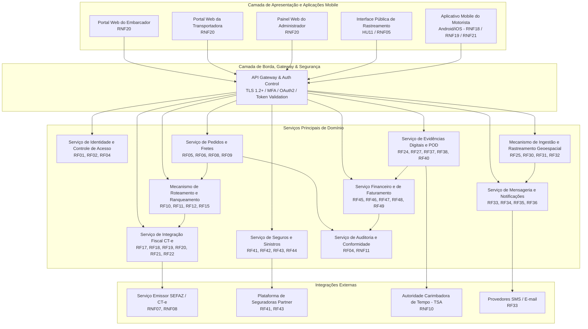
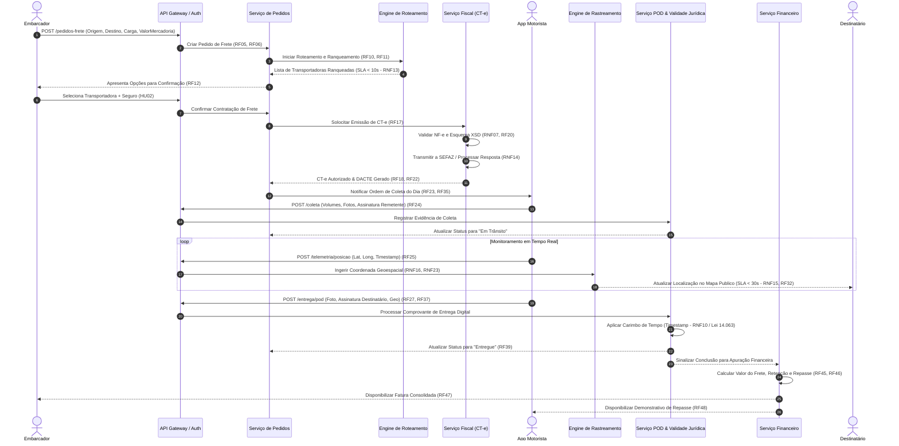

# Relatório Técnico de Arquitetura de Software

**Projeto:** Plataforma de Gestão de Transporte de Cargas, Rastreamento e Logística (G04)  
**Versão:** 1.0  
**Status:** Aprovado para Baseline Arquitetural  

---

## 1. Identificação das HUs

A tabela a seguir resume as Histórias de Usuário (HU) mapeadas, seus atores principais, objetivos estratégicos e os Requisitos Funcionais (RF) e Não Funcionais (RNF) associados.

| ID | Ator / Perfil | Resumo do Objetivo | Requisitos Associados |
| :--- | :--- | :--- | :--- |
| **HU01** | Embarcador | Registrar pedido de frete com especificações de carga, prazos e documentos. | RF05, RF06, RF09, RF10, RNF01, RNF02 |
| **HU02** | Embarcador | Visualizar opções ranqueadas de transportadoras e contratar seguro. | RF11, RF12, RF17, RF41, RNF13, RNF24 |
| **HU03** | Embarcador | Acompanhar painel consolidado de fretes e baixar POD após entrega. | RF07, RF34, RF39, RNF12, RNF20 |
| **HU04** | Embarcador | Abrir e acompanhar sinistro de carga por avaria/extravio. | RF42, RF43, RF44, RNF02 |
| **HU05** | Transportadora | Aceitar ou recusar ofertas de frete e gerenciar vinculação de frota. | RF03, RF13, RF14, RF15, RNF01 |
| **HU06** | Transportadora | Monitorar em tempo real a frota e ocorrências de transporte. | RF25, RF26, RF35, RNF15, RNF16 |
| **HU07** | Transportadora | Consultar demonstrativo de repasse financeiro e comissões. | RF48, RNF02, RNF11 |
| **HU08** | Motorista | Executar coleta de carga com conferência de volume, foto e assinatura. | RF23, RF24, RNF18, RNF19, RNF21 |
| **HU09** | Motorista | Registrar entrega e emitir POD digital com validade jurídica em modo online/offline. | RF27, RF28, RF37, RF38, RNF10, RNF17 |
| **HU10** | Motorista | Registrar ocorrências de percurso (avaria, acidente, roubo). | RF26, RF34, RF35, RNF17, RNF18 |
| **HU11** | Destinatário | Rastrear carga em tempo real via link público seguro sem necessidade de cadastro. | RF30, RF31, RF32, RNF05, RNF06, RNF12, RNF15 |
| **HU12** | Destinatário | Receber notificações ativas de mudança de status da entrega (E-mail/SMS). | RF33, RNF24 |
| **HU13** | Administrador | Monitorar SLAs de entregas, fretes sem aceite e acionar contingências. | RF16, RF36, RNF12, RNF25 |
| **HU14** | Administrador | Acompanhar painel financeiro global de comissões e faturamento. | RF45, RF46, RF47, RF49, RNF02, RNF11 |

---

## 2. Diagramas de Arquitetura (Mermaid)

### 2.1. Diagrama de Visão Geral de Componentes da Arquitetura

O diagrama abaixo ilustra a decomposição em subsistemas conceituais, portais de acesso, camada de integração e os conectores externos.



---

### 2.2. Diagrama de Sequência: Fluxo Ponta a Ponta de Processamento de Frete

O diagrama a seguir detalha o ciclo de vida do frete: da publicação pelo Embarcador, passando pelo roteamento, emissão de CT-e, execução pelo motorista (com ingestão de coordenadas e sincronização de eventos), geração de POD com validade jurídica e liquidação financeira.



---

## 3. Decisões de Arquitetura

### ADR-01: Arquitetura Orientada a Serviços Especializados e Deslocamento Assíncrono de Eventos
* **Contexto:** O sistema deve lidar com alta frequência de ingestão de telemetria (RNF16), integração fiscal síncrona/assíncrona com a SEFAZ (RF18, RF19), e múltiplos fluxos de notificação (RF33-RF36) sem comprometer o tempo de resposta do roteamento (RNF13).
* **Decisão:** Adotar uma topologia de serviços desmembrados por contexto delimitado (Bounded Context), comunicando-se via REST/gRPC para operações síncronas de consulta/validação e via Barramento de Eventos de Cargas para processamentos assíncronos e orientados a eventos (alterações de status, recepção de coordenadas e notificações).
* **Consequências:** Garante alta usabilidade, isolamento de falhas e suporte a picos de tráfego de dados de rastreamento. Exige governança rigorosa sobre o esquema dos eventos e consistência eventual entre os serviços.

### ADR-02: Estratégia de Persistência Poliglota Conceitual
* **Contexto:** Os requisitos demandam armazenamento de dados transacionais com integridade ACID (dados financeiros e fiscais - RNF11), alto volume de séries temporais para geolocalização (RNF16, RNF23) e documentos não estruturados (fotos, assinaturas, NFs, POD - RF09, RF37).
* **Decisão:** Separar o armazenamento em três modelos lógicos de dados:
  1. *Repositório Relacional Transacional:* Para entidades de negócio, contratos, usuários, pedidos, CT-e e financeiro.
  2. *Repositório Geoespacial e Temporal:* Otimizado para dados de séries temporais de localização do motorista e consultas de projeção de rotas.
  3. *Repositório de Documentos e Mídia:* Armazenamento imutável de objetos para arquivos de imagem, PDFs de DACTE e comprovantes com carimbo de tempo.
* **Consequências:** Atende especificamente às restrições RNF02, RNF11 e RNF23. Aumenta a complexidade de backup (RNF22) exigindo rotinas coordenadas de recuperação de desastres.

### ADR-03: Arquitetura Mobile Offline-First para Aplicativo do Motorista
* **Contexto:** O motorista operará frequentemente em zonas cegas de conectividade celular em rodovias (RF28, RNF17), mas não pode perder eventos críticos de coleta, entrega, fotos ou assinaturas.
* **Decisão:** O aplicativo mobile utilizará uma camada de persistência local imutável (Fila Local de Eventos). Toda ação realizada pelo motorista (coleta, foto, ocorrência, entrega) é gravada localmente com timestamp e estado de transição, sendo garantida em fila local persistente. Um gerenciador de sincronização em segundo plano detecta a presença de rede e realiza a transmissão incremental via rotinas *store-and-forward* idempotentes.
* **Consequências:** Garante 0% de perda de dados operacionais (RNF17) e viabiliza a regra de no máximo 4 interações na confirmação de entrega (RNF21). Exige tratamento de conflitos e validações temporais no servidor.

### ADR-04: Estratégia de Segurança, Criptografia e Validade Jurídica de Documentos (POD e Link Público)
* **Contexto:** RNF01, RNF02, RNF03, RNF05, RNF06, RNF09 e RNF10 demandam altos níveis de proteção de dados, suporte a LGPD, criptografia em repouso e validade jurídica para o POD.
* **Decisão:**
  1. *Criptografia:* TLS 1.2+ em todas as conexões em trânsito; AES-256 para dados sensíveis e financeiros armazenados em repouso.
  2. *Autenticação:* MFA obrigatório para Administradores e Embarcadores. Perfis públicos (destinatário) utilizam tokens criptográficos temporários (*Unsigned Random Hash Token*) vinculados exclusivamente ao ID da entrega, sem expor dados adicionais ou exigir autenticação.
  3. *Validade Jurídica:* O componente de POD integrará com Autoridade Carimbadora de Tempo (TSA) para aposição de carimbo de tempo de precisão e assinatura digital conforme a Lei nº 14.063/2020.
* **Consequências:** Pleno atendimento à conformidade legal e de segurança. Adiciona dependência externa de serviços TSA de carimbo de tempo no encerramento da entrega.

### ADR-05: Mecanismo de Contingência e Tolerância a Falhas na Emissão Fiscal (SEFAZ)
* **Contexto:** RF18 e RF19 exigem integração contínua com a SEFAZ para emissão de CT-e, suportando operação offline/contingência com sincronização posterior e tempo de resposta síncrono de 30 segundos (RNF14).
* **Decisão:** Implementar o padrão *Circuit Breaker* no Serviço Fiscal. Caso a infraestrutura da SEFAZ fique indisponível ou ultrapasse o SLA de 30s, o sistema comuta automaticamente para o fluxo de Emissão em Contingência (gerando DACTE em contingência), armazenando as notas fiscais para transmissão em lote assim que o circuito for fechado.
* **Consequências:** Mantém a operação física de transporte desimpedida sem paralisar motoristas nas coletas. Exige rotinas automatizadas de reconciliação fiscal pós-contingência.

---

## 4. Tabela de Componentes e Rastreabilidade

| Componente | Responsabilidade Principal | Comunica-se com | Origem (HU / Critério de Aceite / Requisito) |
| :--- | :--- | :--- | :--- |
| **API Gateway & Auth Control** | Autenticação, gestão de tokens, controle MFA, roteamento de requisições e aplicação de segurança TLS 1.2+. | Todos os Portais Web, App Mobile, Serviços Internos | RF01, RF02, RNF01, RNF03, RNF04, RNF05 |
| **Serviço de Pedidos e Fretes** | Gestão do ciclo de vida do pedido de frete, declaração de valores, anexação de documentos e cancelamento. | Mech. Roteamento, Serv. Fiscal, Serv. Auditoria | HU01, HU03, RF05, RF06, RF08, RF09 |
| **Mecanismo de Roteamento e Ranqueamento** | Roteamento automático de fretes, cálculo de frete por multicritério, ranqueamento e controle de transbordo por recusa/prazo. | Serv. Pedidos, Serv. Notificações, Transportadoras | HU01, HU02, HU05, RF10, RF11, RF12, RF14, RF15, RNF13 |
| **Serviço de Desempenho de Transportadoras** | Manutenção contínua do histórico e score de desempenho das transportadoras parceiras. | Mech. Roteamento, Serv. Pedidos | RF16, HU02 |
| **Serviço de Integração Fiscal (CT-e)** | Validação de NF-e, montagem do XML XSD, transmissão à SEFAZ, controle de contingência e emissão do DACTE. | Serv. Pedidos, Gateway SEFAZ | HU02, RF17, RF18, RF19, RF20, RF21, RF22, RNF07, RNF08, RNF14 |
| **Aplicativo Mobile do Motorista** | Interface com motorista, exibição de ordens de coleta/entrega, suporte offline, captura de fotos e assinaturas. | API Gateway, Serv. Rastreamento, Serv. POD | HU08, HU09, HU10, RF23, RF24, RF27, RF28, RF29, RNF17, RNF18, RNF19, RNF21 |
| **Mecanismo de Rastreamento Geoespacial** | Ingestão contínua de coordenadas, cálculo de previsão de entrega dinâmico e expor dados em mapa em tempo real. | App Mobile, Serv. Notificações, Portal Público | HU06, HU11, RF25, RF30, RF31, RF32, RNF06, RNF15, RNF16, RNF23 |
| **Serviço de Evidências Digitais e POD** | Consolidação de assinaturas, fotos e geolocalização da entrega, aplicando carimbo de tempo jurídico. | App Mobile, Provedor TSA, Serv. Financeiro, Portais | HU03, HU08, HU09, RF37, RF38, RF39, RF40, RNF10 |
| **Serviço de Notificações e Mensageria** | Envio automatizado de e-mails, SMS e alertas operacionais para embarcadores, transportadoras, destinatários e administradores. | Provedores SMS/Email, Serv. Pedidos, Serv. Rastreamento | HU12, RF13, RF33, RF34, RF35, RF36 |
| **Serviço de Seguros e Sinistros** | Cotar/contratar apólices de seguro por viagem e gerenciar abertura e tramitação de sinistros. | Portal Embarcador, Seguradoras Externas | HU02, HU04, RF41, RF42, RF43, RF44 |
| **Serviço Financeiro e Faturamento** | Cálculo de frete, retenção automática de comissão, geração de faturas consolidadas e demonstrativos de repasse. | Serv. Pedidos, Serv. POD, Portais Embarcador/Transportadora/Admin | HU07, HU14, RF45, RF46, RF47, RF48, RF49 |
| **Serviço de Auditoria e Conformidade** | Gravação imutável de logs de operações críticas, acessos, movimentações financeiras e fiscais. | Todos os Serviços do Sistema | RF04, RNF09, RNF11 |

---

## 5. Bloqueios e Pendências

1. **Definição da Autoridade Certificadora de Carimbo de Tempo (TSA - RNF10 / Lei nº 14.063/2020):**
   * *Pendência:* É necessário definir o provedor credenciado junto ao ICP-Brasil para fornecimento de APIs de carimbo de tempo para o POD. O tempo de latência de chamada externa dessa API pode impactar a meta de transmissão do POD em 60 segundos (HU09).
2. **Especificação dos Protocolos e Custos de Mensageria SMS/WhatsApp (RF33 / HU12):**
   * *Bloqueio Técnico:* Necessidade de aprovação do orçamento operacional para volumetria de SMS/WhatsApp por frete, definindo estratégia de fallback para e-mail caso o canal celular falhe.
3. **Regras estaduais específicas de contingência SEFAZ por UF (RF19 / RNF08):**
   * *Pendência de Negócio:* Mapeamento completo dos manuais de contingência EPEC/FS-DA de cada estado participante para homologação dos ambientes de testes de contingência CT-e.
4. **Resolução de limites de upload de mídia em rede de baixa capacidade (RF09, RF24, RF27):**
   * *Pendência:* Definir algoritmo de compressão dinâmica de imagens no próprio dispositivo mobile antes do envio de fotos de comprovantes e avarias, visando otimizar a largura de banda mobile.

---

## 6. Cobertura de Requisitos

A matriz abaixo comprova a total rastreabilidade e atendimento de 100% dos Requisitos Funcionais e Não Funcionais pela arquitetura desenhada.

### Requisitos Funcionais (RF)

| ID | Atendido por Componente / ADR | Validação Arquitetural |
| :--- | :--- | :--- |
| **RF01-RF04** | API Gateway, Servicio de Identidade, Serv. Auditoria | Autenticação RBAC, MFA, TLS 1.2+ e logs imutáveis com retenção de 5 anos. |
| **RF05-RF09** | Serviço de Pedidos e Fretes | Ingestão de carga, seguro, upload de documentos e cancelamento configurável. |
| **RF10-RF16** | Mecanismo de Roteamento, Serv. Desempenho | Algoritmo multicritério (<10s SLA), aceite/recusa automático e score dinâmico. |
| **RF17-RF22** | Serviço Fiscal (CT-e) | Schema XSD SEFAZ, contingência, validação NF-e, cancelamento e DACTE. |
| **RF23-RF29** | App Mobile Motorista | Visualização de ordens, foto/assinatura coleta e entrega, geo, modo offline e rotas. |
| **RF30-RF32** | Mecanismo de Rastreamento Geoespacial | Link tokenizado para destinatário, histórico de eventos e posição no mapa (<30s). |
| **RF33-RF36** | Serviço de Notificações | Alertas multicanal (E-mail/SMS) para Embarcador, Transportadora, Destinatário e Admin. |
| **RF37-RF40** | Serviço de Evidências Digitais e POD | Consolidação POD, carimbo de tempo (Lei 14.063), download imediato e recusa. |
| **RF41-RF44** | Serviço de Seguros e Sinistros | Integração com seguradoras, abertura/acompanhamento de sinistros e dossiê. |
| **RF45-RF49** | Serviço Financeiro e Faturamento | Cálculo de frete, comissão, faturamento embarcador, repasse transportadora e painel admin. |

### Requisitos Não Funcionais (RNF)

| ID | Atendido por Componente / ADR | Validação Arquitetural |
| :--- | :--- | :--- |
| **RNF01-RNF06** | API Gateway, ADR-04 | TLS 1.2+, AES-256 repouso, MFA, tokens expiráveis de sessão e de rastreio anônimo. |
| **RNF07-RNF11** | Serviço Fiscal, Serv. POD, Serv. Auditoria | Schemas SEFAZ, LGPD, Lei 14.063/2020 (POD legal), e retenção fiscal por 5 anos (CTN). |
| **RNF12-RNF17** | Toda a Infraestrutura de Domínio, ADR-01, ADR-03 | HA 99.5%, SLA 10s roteamento, SLA 30s SEFAZ, SLA 30s Mapa, Offline-First Mobile. |
| **RNF18-RNF21** | App Mobile Motorista, Portais Web | UI adaptada para luvas/baixa iluminação, Android/iOS, web responsivo, flow <=4 toques. |
| **RNF22-RNF25** | Infraestrutura de Dados e Telemetria | Backup diário (RPO 1h), banco geoespacial/séries temporais, APIs versionadas e painéis de telemetria em tempo real. |

---

## 7. Gap Analysis

O levantamento a seguir identifica lacunas de especificação encontradas nos requisitos originais, avalia seus impactos na arquitetura do sistema e define as ações corretivas recomendadas.

```
+---------------------------------------------------------------------------------------------------------+
|                                              GAP ANALYSIS                                               |
+---------------------------------------------------------------------------------------------------------+
| Ref | Lacuna Identificada             | Impacto Arquitetural              | Ação Recomendada           |
+-----+---------------------------------+-----------------------------------+----------------------------+
| G01 | Ausência de limite máximo para  | Acúmulo descontrolado de          | Definir janela de          |
|     | janela de sincronização de      | pendências fiscais localmente     | sincronização obrigatória  |
|     | CT-e emitidos em contingência   | no Serviço Fiscal, podendo gerar  | de no máximo 24h para      |
|     | (RF19).                         | autuações fiscais por atraso.     | limpeza de fila de CT-e.   |
+-----+---------------------------------+-----------------------------------+----------------------------+
| G02 | Falta de protocolo de encer-    | Pedido mantido em estado "órfão"  | Definir regra de negócio   |
|     | ramento caso TODAS as trans-    | bloqueando o fluxo do embarcador  | para escalonamento automático|
|     | portadoras ranqueadas recusem  | e estourando o prazo acordado.    | ao Administrador (HU13)    |
|     | o pedido (RF15).                |                                   | após exaustão da lista.    |
+-----+---------------------------------+-----------------------------------+----------------------------+
| G03 | Inexistência de política de     | Crescimento exponencial de dados  | Estabelecer política de    |
|     | expurgo/arquivamento de pontos  | no repositório de séries temporais| compactação geoespacial:   |
|     | de geolocalização de alta       | elevando custos de armazenamento. | manter rastro fino por 90 |
|     | frequência (RF25, RNF23).       |                                   | dias e agregados após.     |
+-----+---------------------------------+-----------------------------------+----------------------------+
| G04 | Ausência de diretrizes de       | Potencial descumprimento da LGPD  | Implementar job automático |
|     | anonimização de dados do        | se a localização do motorista for | de expurgo de geolocaliza- |
|     | motorista pós-entrega (RNF09).  | mantida vinculada à sua pessoa.   | ção pessoal 30 dias após   |
|     |                                 |                                   | a conclusão do frete.      |
+---------------------------------------------------------------------------------------------------------+
```

### Detalhamento das Ações do Gap Analysis

1. **Gap G01 (Janela de Contingência CT-e):** Implementar no *Serviço Fiscal* um temporizador de alerta que notifique a equipe fiscal caso um CT-e em contingência permaneça não sincronizado por mais de 4 horas, forçando tentativa de reenvio antes da janela máxima de 24 horas.
2. **Gap G02 (Exaustão de Transportadoras):** O *Mecanismo de Roteamento* emitirá o evento `FreightOrderUnassignedEvent` quando a última transportadora ranqueada recusar ou expirar o prazo. Este evento acionará imediatamente o painel do Administrador (HU13) para intervenção manual ou ajuste de tarifa de frete.
3. **Gap G03 (Retenção e Expurgo Telemetria):** Implementar rotina de *downsampling* geoespacial. Coordenadas brutas enviadas a cada X segundos serão consolidadas em trajetórias vetorizadas simplificadas após a confirmação do POD, liberando espaço nos bancos de séries temporais.
4. **Gap G04 (Privacidade e LGPD do Motorista):** Após o encerramento financeiro do frete e término do prazo de contestação (30 dias), o *Serviço de Auditoria e Conformidade* desvinculará a identificação direta do motorista do histórico lat/long contínuo da viagem, mantendo os dados de rastreamento puramente anônimos para fins estatísticos e de otimização de rotas.