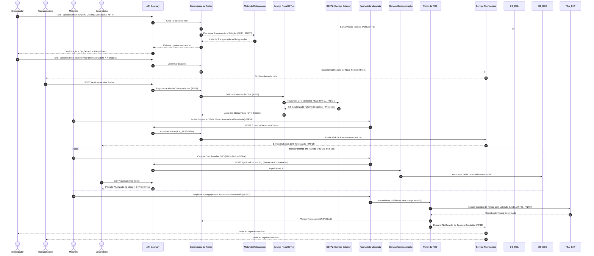

# Relatório Técnico de Arquitetura de Software

---

## 1. Identificação das HUs

A tabela a seguir apresenta o mapeamento completo das Histórias de Usuário (HU01 a HU14), associando atores, objetivos de negócio, critérios de aceitação e os Requisitos Funcionais (RF) e Não Funcionais (RNF) correspondentes.

| HU ID | Perfil / Ator | Objetivo Principal | Critérios de Aceitação Relevantes | Requisitos Mapeados (RF / RNF) |
| :--- | :--- | :--- | :--- | :--- |
| **HU01** | Embarcador | Registrar pedidos de frete informando origem, destino, carga e prazos. | Validação de campos obrigatórios; upload de NF-e/documentos; acionamento automático do roteamento. | RF05, RF06, RF09, RF10 RNF01, RNF02 |
| **HU02** | Embarcador | Visualizar opções de transportadoras ranqueadas e contratar seguro. | Comparação por preço/prazo/desempenho; contratação de seguro no fluxo; disparo de emissão de CT-e ao confirmar. | RF11, RF12, RF17, RF41 RNF13, RNF24 |
| **HU03** | Embarcador | Acompanhar fretes consolidados e acessar comprovante de entrega (POD). | Painel consolidado com status e alertas; download imediato do POD; notificações de ocorrências. | RF07, RF34, RF39 RNF20 |
| **HU04** | Embarcador | Abrir e acompanhar sinistros por avaria ou extravio de carga. | Vinculação automática do pedido e ocorrências ao formulário; anexação de provas; atualização de status da seguradora. | RF42, RF43, RF44 |
| **HU05** | Transportadora | Receber, aceitar ou recusar ofertas de frete e gerenciar frota/motoristas. | Notificação com detalhes da carga; timeout para resposta automática; obrigatoriedade de justificativa em recusas; gestão de frota. | RF03, RF13, RF14, RF15, RF35 |
| **HU06** | Transportadora | Monitorar em tempo real a posição dos motoristas e a operação. | Mapa interativo com atualização constante; alertas de ocorrências em campo; canal direto de comunicação. | RF25, RF26, RF32 RNF06, RNF15, RNF16 |
| **HU07** | Transportadora | Consultar demonstrativo financeiro e repasses líquidos da plataforma. | Extrato detalhado (valor bruto, comissão retida, líquido); filtros por período; exportação em CSV/PDF. | RF48 |
| **HU08** | Motorista | Registrar coleta de carga via aplicativo mobile com evidências. | Coleta com foto, conferência de volumes e assinatura do remetente; transição de status para "em trânsito"; registro de ressalvas. | RF23, RF24 RNF18, RNF19, RNF21 |
| **HU09** | Motorista | Registrar entrega e gerar Comprovante de Entrega Digital (POD). | Captura de foto, assinatura digital e coordenadas GPS; suporte a operação offline com sincronização posterior. | RF27, RF28, RF37, RF38 RNF10, RNF17 |
| **HU10** | Motorista | Registrar ocorrências de transporte (avarias, acidentes, roubos). | Categorização padronizada com descrição e fotos; disparo imediato de alertas para embarcador e transportadora. | RF26 |
| **HU11** | Destinatário | Rastrear carga em tempo real por link público sem autenticação. | Acesso direto via token único; timeline de eventos; posição atual no mapa e cálculo dinâmico de ETA; expiração do link pós-entrega. | RF30, RF31, RF32 RNF05, RNF12, RNF15 |
| **HU12** | Destinatário | Receber notificações ativas sobre o avanço da entrega. | Disparo multi-canal (E-mail/SMS) em mudanças de status; informe de janela estimada de entrega; gestão de preferências. | RF33 |
| **HU13** | Administrador | Monitorar SLAs operacionais e intervir em casos de contingência. | Painel de controle de riscos de atraso; alertas de pedidos sem aceite no prazo; reatribuição manual de transportadoras. | RF15, RF36 RNF25 |
| **HU14** | Administrador | Acompanhar a saúde financeira global e comissões da plataforma. | Métrica de receita de comissão, volume consolidado e taxa de inadimplência; filtros avançados e relatórios exportáveis. | RF46, RF47, RF49 RNF11 |

---

## 2. Diagramas de Arquitetura (Mermaid)

### 2.1 Diagrama de Componentes e Visão Geral da Arquitetura

O diagrama a seguir descreve a organização modular do sistema, delineando a separação de responsabilidades entre as interfaces de usuário, gateways de comunicação, serviços core de negócio, motores de persistência e ecossistemas externos de integração.

```mermaid
graph TB
    subgraph "Camada de Apresentação e Clientes"
        WEB_EMB["Portal Web do Embarcador (Web Responsivo)"]
        WEB_TRP["Portal Web da Transportadora (Web Responsivo)"]
        WEB_ADM["Painel de Administração (Web Responsivo)"]
        APP_MOT["Aplicativo Mobile do Motorista (Android/iOS - Offline-First)"]
        WEB_RAS["Portal Público de Rastreamento (Acesso Tokenizado)"]
    end

    subgraph "Camada de Gateway e Segurança"
        API_GW["API Gateway / Roteador de Requisições"]
        IAM_SVC["Serviço de Autenticação e Autorização (MFA / Tokens)"]
    end

    subgraph "Serviços do Domínio Central (Core Business)"
        FRETE_SVC["Gerenciador de Pedidos de Frete"]
        ROTA_SVC["Motor de Roteamento e Seleção de Transportadoras"]
        OPER_SVC["Gerenciador de Operações em Campo e Ocorrências"]
        GEO_SVC["Serviço de Ingestão e Processamento de Geoposicionamento"]
        POD_SVC["Motor de Comprovante Digital e Validação Jurídica (POD)"]
        FISCAL_SVC["Serviço Integrador Fiscal (CT-e / SEFAZ)"]
        SEGURO_SVC["Gerenciador de Seguros e Sinistros"]
        FIN_SVC["Motor Financeiro e Faturamento"]
        NOTIF_SVC["Serviço de Notificações (E-mail / SMS / Push)"]
        AUDIT_SVC["Serviço de Auditoria Imutável"]
    end

    subgraph "Camada de Persistência e Eventos"
        DB_REL["Base de Dados Relacional Operacional"]
        DB_GEO["Base de Dados Geoespacial / Séries Temporais"]
        MSG_BUS["Barramento de Eventos Assíncronos"]
        STORE_DOC["Repositório de Documentos e Evidências Fotográficas"]
    end

    subgraph "Provedores e Sistemas Externos"
        SEFAZ_EXT["SEFAZ (Emissão de CT-e / Consulta NF-e)"]
        INS_EXT["Plataformas de Seguradoras Parceiras"]
        NOTIF_EXT["Gateways Externos de E-mail / SMS"]
        TSA_EXT["Autoridade de Carimbo de Tempo (Timestamp Jurídico)"]
    end

    %% Conexões Cliente -> Gateway
    WEB_EMB --> API_GW
    WEB_TRP --> API_GW
    WEB_ADM --> API_GW
    APP_MOT --> API_GW
    WEB_RAS --> API_GW

    %% Gateway -> IAM
    API_GW --> IAM_SVC

    %% Gateway -> Serviços
    API_GW --> FRETE_SVC
    API_GW --> ROTA_SVC
    API_GW --> OPER_SVC
    API_GW --> GEO_SVC
    API_GW --> POD_SVC
    API_GW --> FISCAL_SVC
    API_GW --> SEGURO_SVC
    API_GW --> FIN_SVC

    %% Comunicação Orientada a Eventos e Persistência
    FRETE_SVC --> MSG_BUS
    OPER_SVC --> MSG_BUS
    GEO_SVC --> MSG_BUS
    POD_SVC --> MSG_BUS
    FISCAL_SVC --> MSG_BUS

    MSG_BUS --> GEO_SVC
    MSG_BUS --> NOTIF_SVC
    MSG_BUS --> AUDIT_SVC
    MSG_BUS --> FIN_SVC

    FRETE_SVC --> DB_REL
    OPER_SVC --> DB_REL
    FIN_SVC --> DB_REL
    GEO_SVC --> DB_GEO
    POD_SVC --> STORE_DOC

    %% Integrações Externas
    FISCAL_SVC <--> SEFAZ_EXT
    SEGURO_SVC <--> INS_EXT
    NOTIF_SVC --> NOTIF_EXT
    POD_SVC <--> TSA_EXT
```

---

### 2.2 Diagrama de Sequência: Ciclo de Vida do Frete (Do Pedido ao POD)

O diagrama de sequência detalha a interação contínua entre atores, componentes internos e serviços externos ao longo de todo o ciclo de entrega de uma carga.

---

## 3. Decisões de Arquitetura

As Decisões de Arquitetura (ADRs) a seguir documentam as escolhas estruturais fundamentais adotadas no projeto para garantir atendimento aos requisitos não funcionais de segurança, resiliência, escalabilidade e conformidade legal.

### ADR 01: Padrão Arquitetural Baseado em Serviços e Processamento Orientado a Eventos
* **Contexto:** O sistema necessita lidar simultaneamente com transações de alta consistência (emissão fiscal de CT-e, retenções financeiras) e altíssimo volume de dados concorrentes de geolocalização transmitidos por milhares de motoristas em trânsito (RNF16).
* **Decisão:** Adotar uma arquitetura baseada em serviços desacoplados, combinando comunicação síncrona via APIs RESTful para fluxos transacionais (cadastro, aceite, consultas) com comunicação assíncrona orientada a eventos para ingestão de telemetria, atualizações de status, auditoria e disparos de notificações.
* **Consequências:** 
  * *Positivas:* Alta escalabilidade e isolamento de falhas. A sobrecarga na ingestão de geolocalização não afeta o tempo de resposta da emissão de CT-e ou do roteamento.
  * *Negativas:* Maior complexidade operacional para gestão da consistência eventual e monitoramento do barramento de eventos.

### ADR 02: Estratégia de Persistência Híbrida (Segregação Transacional e Geoespacial)
* **Contexto:** Os dados relacionais do negócio (pedidos, tabelas de frete, movimentações financeiras) possuem requisitos estritos de integridade ACID e retenção legal de 5 anos (RNF11). Por outro lado, a geolocalização demanda consultas de séries temporais e proximidade geoespacial em tempo real com baixa latência (RNF15, RNF23).
* **Decisão:** Segregar a persistência em dois motores distintos: um banco de dados relacional para entidades de negócio, contratos e logs auditáveis, e um motor otimizado para dados geoespaciais e séries temporais para o histórico de rotas e cálculo de telemetria.
* **Consequências:**
  * *Positivas:* Otimização extrema de leitura e escrita para cada tipo de dado; conformidade plena com o RNF23.
  * *Negativas:* Necessidade de mecanismos de sincronização e correlação entre os identificadores do pedido de frete e os registros de localização.

### ADR 03: Arquitetura Mobile Offline-First com Fila Local e Sincronização Idempotente
* **Contexto:** Motoristas frequentemente trafegam por rodovias e regiões remotas com sinal de internet instável ou inexistente. As confirmações de coleta, entregas, ocorrências e atualizações de rotas não podem ser perdidas (RF28, RNF17).
* **Decisão:** Desenvolver a aplicação mobile nativa (prioridade Android, conforme RNF19) seguindo o padrão *Offline-First*. Todas as ações efetuadas pelo motorista (fotos, assinaturas, coordenadas) são salvas em banco de dados local criptografado e enfileiradas. Ao restabelecer a conectividade, a aplicação realiza o *flush* dos eventos utilizando requisições idempotentes.
* **Consequências:**
  * *Positivas:* Garantia de operação contínua sem perda de dados em campo; atendimento total aos requisitos RF28 e RNF17.
  * *Negativas:* Necessidade de implementar algoritmos complexos de resolução de conflitos e tratamento de timestamp de origem versus timestamp de sincronização.

### ADR 04: Garantia de Validade Jurídica do Comprovante Digital (POD) via Carimbo de Tempo
* **Contexto:** O Comprovante de Entrega Digital (POD) substitui o canhoto de papel e deve possuir validade jurídica para respaldar processos de cobrança, seguro e auditoria fiscal conforme a Lei nº 14.063/2020 (RF38, RNF10).
* **Decisão:** Integrar o Motor de POD a uma Autoridade de Carimbo de Tempo (TSA). No momento da confirmação da entrega pelo motorista, o sistema consolida a imagem do comprovante, os dados de geolocalização, a assinatura do destinatário e gera um *hash* assinado digitalmente com timestamp auditável.
* **Consequências:**
  * *Positivas:* Garantia de não-repúdio, integridade e conformidade legal direta com a legislação nacional.
  * *Negativas:* Dependência de serviço de temporalização válido e adição de etapa de assinatura no fluxo de encerramento do frete.

### ADR 05: Proteção e Tokenização do Rastreamento Público sem Autenticação
* **Contexto:** O destinatário da carga precisa acompanhar a movimentação em tempo real sem a necessidade de realizar cadastro na plataforma (RF30), exigindo estrita proteção de privacidade para evitar vazamento de dados de outros fretes ou motoristas (RNF05, RNF06, RNF09).
* **Decisão:** Implementar a geração de tokens de acesso únicos, criptográficos e com tempo de vida limitado (vinculados à duração da viagem), associados exclusivamente à visualização simplificada daquela carga. A API de rastreamento público expõe apenas dados anônimos de telemetria e status.
* **Consequências:**
  * *Positivas:* Alta usabilidade para o destinatário final mantendo controle rígido sobre os dados pessoais (LGPD).
  * *Negativas:* Requer rotinas automáticas para revogação e expiração de tokens logo após o encerramento da entrega.

---

## 4. Tabela de Componentes e Rastreabilidade

A tabela abaixo conecta cada componente conceitual da arquitetura às suas responsabilidades primárias, seus pontos de integração e os requisitos funcionais e de experiência de usuário que fundamentam sua existência.

| Componente | Responsabilidade Principal | Comunica-se com | Origem (HU / Critério de Aceite) |
| :--- | :--- | :--- | :--- |
| **Módulo de Autenticação e IAM** | Autenticar usuários via MFA; gerenciar sessões, perfis (embarcador, transportadora, motorista, admin) e validar tokens de acesso. | Todos os componentes via API Gateway; Banco Relacional. | RF01, RF02, RF04 RNF03, RNF04 |
| **Gerenciador de Pedidos de Frete** | Registrar pedidos de frete, controlar estados (criado, aceito, em trânsito, entregue, cancelado) e vincular documentos (NF-es). | API Gateway, Motor de Roteamento, Serviço Fiscal, Banco Relacional, Barramento de Eventos. | HU01, HU03 RF05, RF06, RF07, RF08, RF09 |
| **Motor de Roteamento e Seleção** | Algoritmo de cruzamento de ofertas de frete com regras das transportadoras; ranking dinâmico por preço, prazo e histórico de SLA. | Gerenciador de Pedidos, Banco Relacional, Serviço de Notificações. | HU01, HU02, HU05, HU13 RF10, RF11, RF12, RF15, RF16 RNF13 |
| **Serviço Integrador Fiscal (CT-e)** | Gerar CT-e no padrão XSD da SEFAZ, transmitir, tratar modalidade de contingência e consultar status de NF-es vinculadas. | Gerenciador de Pedidos, API SEFAZ, Banco Relacional. | HU02 RF17, RF18, RF19, RF20, RF21, RF22 RNF07, RNF08, RNF14 |
| **Serviço de Operações Mobile** | Prover APIs otimizadas para o app mobile; gerenciar sincronização de dados offline, coletas, rotas e ocorrências em campo. | App Mobile Motorista, Barramento de Eventos, Repositório de Documentos. | HU08, HU09, HU10 RF23, RF24, RF26, RF28, RF29 RNF17, RNF18, RNF21 |
| **Serviço de Ingestão de Geolocalização** | Receber requisições contínuas de coordenadas GPS; processar telemetria; calcular velocidades e estimativas dinâmicas de chegada (ETA). | App Mobile, Barramento de Eventos, Banco Geoespacial. | HU06, HU11 RF25, RF32 RNF06, RNF15, RNF16, RNF23 |
| **Motor de POD Digital** | Consolidar evidências de entrega (foto, assinatura, coordenadas), solicitar carimbo de tempo jurídico e disponibilizar o documento final. | Serviço de Operações Mobile, Autoridade Temporal (TSA), Repositório de Evidências. | HU03, HU09 RF27, RF37, RF38, RF39, RF40 RNF10 |
| **Portal Público de Rastreamento** | Exibir dados resumidos de localização e histórico de eventos ao destinatário mediante validação do token do link. | Serviço de Geolocalização, Gerenciador de Pedidos, Cliente Web de Rastreamento. | HU11 RF30, RF31, RF32 RNF05, RNF12 |
| **Serviço de Seguros e Sinistros** | Integrar com apólices de seguradoras para cotação de seguro por viagem e gerenciar o fluxo de abertura e acompanhamento de sinistros. | Gerenciador de Pedidos, Plataformas de Seguradoras, Banco Relacional. | HU02, HU04 RF41, RF42, RF43, RF44 |
| **Motor Financeiro e Faturamento** | Calcular valores de frete, aplicar deduções de comissão da plataforma, gerar faturas para embarcadores e demonstrativos para transportadoras. | Gerenciador de Pedidos, Barramento de Eventos, Banco Relacional. | HU07, HU14 RF45, RF46, RF47, RF48, RF49 RNF11 |
| **Serviço de Notificações Multi-Canal** | Gerenciar filas de envio e disparar alertas via E-mail, SMS e Push Notifications sobre atualizações de status operacionais e fiscais. | Barramento de Eventos, Gateways Externos de E-mail/SMS. | HU03, HU05, HU10, HU12 RF13, RF33, RF34, RF35, RF36 |
| **Serviço de Auditoria Imutável** | Registrar trilhas de auditoria contendo dados de autoria, marca temporal e ações em operações críticas ou de alteração financeira/fiscal. | Todos os componentes centrais via Barramento de Eventos, Banco de Auditoria. | RF04 RNF11 |

---

## 5. Bloqueios e Pendências

A tabela a seguir consolida as ambiguidades técnicas, regulatórias ou operacionais identificadas nos requisitos, indicando os bloqueios gerados e as ações corretivas necessárias.

| Item | Descrição do Bloqueio / Pendência | Impacto Arquitetural / Operacional | Ação Necessária / Responsável |
| :--- | :--- | :--- | :--- |
| **PEND-01** | Definição da Autoridade Certificadora / Provedor de Carimbo de Tempo (Timestamp) para a validade do POD (RNF10). | Impossibilidade de finalizar o contrato de integração da API do Motor de POD com validade jurídica formal. | Definir o provedor de carimbo de tempo credenciado (ex: padrão ICP-Brasil / Padrão de Assinatura Avançada) e documentar o contrato de serviço. *[Time de Produto / Jurídico]* |
| **PEND-02** | Estratégia de contorno para emissão de CT-e em contingência offline (RF19) quando a transportadora perde conexão no momento do aceite. | Risco de início de transporte sem documento fiscal autorizado ou em divergência com regras estaduais da SEFAZ. | Especificar detalhadamente o fluxo de transição do CT-e para modalidade EPEC/Contingência e os limites de tempo para sincronização. *[Arquiteto de Software / Especialista Fiscal]* |
| **PEND-03** | Limites operacionais e regras para envio de localização no app mobile do motorista em segundo plano (background) em sistemas iOS/Android. | Restrições rígidas dos sistemas operacionais móbiles podem bloquear o envio contínuo de geolocalização se o app for suspenso. | Definir intervalos de amostragem viáveis, tratamento de permissões de localização em tempo de execução e notificações persistentes de serviço. *[Líder Técnico Mobile]* |
| **PEND-04** | Regra de descarte / retenção de dados pessoais de destinatários e motoristas para conformidade com LGPD (RNF09). | Armazenamento perpétuo desnecessário de dados de localização pessoais pode gerar passivos regulatórios. | Criar política automatizada de expiração e anonimização de histórico de localização e tokens de rastreamento após encerramento do frete. *[Engenheiro de Dados / DPO]* |

---

## 6. Cobertura de Requisitos

A matriz abaixo comprova a rastreabilidade total, demonstrando que 100% dos Requisitos Funcionais (RF01 a RF49) e Não Funcionais (RNF01 a RNF25) foram incorporados na solução arquitetural exposta.

### 6.1 Matriz de Cobertura de Requisitos Funcionais (RF)

| Requisito | Componente Arquitetural Responsável | História de Usuário Mapeada |
| :--- | :--- | :--- |
| **RF01** | Módulo de Autenticação e IAM | HU01, HU05, HU08, HU13 |
| **RF02** | Módulo de Autenticação e IAM | HU01, HU05, HU08, HU13 |
| **RF03** | Gerenciador de Pedidos de Frete / IAM | HU05 |
| **RF04** | Serviço de Auditoria Imutável | HU13, HU14 |
| **RF05** | Gerenciador de Pedidos de Frete | HU01 |
| **RF06** | Gerenciador de Pedidos de Frete | HU01, HU02 |
| **RF07** | Gerenciador de Pedidos de Frete | HU03 |
| **RF08** | Gerenciador de Pedidos de Frete | HU01 |
| **RF09** | Gerenciador de Pedidos de Frete / Repositório de Docs | HU01 |
| **RF10** | Motor de Roteamento e Seleção | HU01 |
| **RF11** | Motor de Roteamento e Seleção | HU02 |
| **RF12** | Motor de Roteamento e Seleção | HU02 |
| **RF13** | Serviço de Notificações Multi-Canal | HU05 |
| **RF14** | Gerenciador de Pedidos / Motor de Roteamento | HU05 |
| **RF15** | Motor de Roteamento e Seleção | HU05, HU13 |
| **RF16** | Motor de Roteamento e Seleção | HU02, HU05 |
| **RF17** | Serviço Integrador Fiscal (CT-e) | HU02 |
| **RF18** | Serviço Integrador Fiscal (CT-e) | HU02 |
| **RF19** | Serviço Integrador Fiscal (CT-e) | HU02 |
| **RF20** | Serviço Integrador Fiscal (CT-e) | HU01, HU02 |
| **RF21** | Serviço Integrador Fiscal (CT-e) | HU02 |
| **RF22** | Serviço Integrador Fiscal (CT-e) / Portal Web | HU02, HU03 |
| **RF23** | Serviço de Operações Mobile | HU08 |
| **RF24** | Serviço de Operações Mobile | HU08 |
| **RF25** | Serviço de Ingestão de Geolocalização | HU06 |
| **RF26** | Serviço de Operações Mobile | HU06, HU10 |
| **RF27** | Serviço de Operações Mobile / Motor de POD | HU09 |
| **RF28** | Serviço de Operações Mobile | HU09 |
| **RF29** | Serviço de Operações Mobile | HU08 |
| **RF30** | Portal Público de Rastreamento | HU11 |
| **RF31** | Portal Público de Rastreamento | HU11 |
| **RF32** | Serviço de Geolocalização / Portal Público | HU06, HU11 |
| **RF33** | Serviço de Notificações Multi-Canal | HU12 |
| **RF34** | Serviço de Notificações Multi-Canal | HU03, HU10 |
| **RF35** | Serviço de Notificações Multi-Canal | HU05, HU10 |
| **RF36** | Serviço de Notificações Multi-Canal | HU13 |
| **RF37** | Motor de POD Digital | HU09 |
| **RF38** | Motor de POD Digital | HU09 |
| **RF39** | Motor de POD Digital / Serviço de Notificações | HU03, HU09 |
| **RF40** | Serviço de Operações Mobile / Motor de POD | HU09, HU10 |
| **RF41** | Serviço de Seguros e Sinistros | HU02 |
| **RF42** | Serviço de Seguros e Sinistros | HU04 |
| **RF43** | Serviço de Seguros e Sinistros | HU04 |
| **RF44** | Serviço de Seguros e Sinistros / Repositório | HU04 |
| **RF45** | Motor Financeiro e Faturamento | HU02, HU07 |
| **RF46** | Motor Financeiro e Faturamento | HU14 |
| **RF47** | Motor Financeiro e Faturamento | HU03, HU14 |
| **RF48** | Motor Financeiro e Faturamento | HU07 |
| **RF49** | Motor Financeiro e Faturamento | HU14 |

---

### 6.2 Matriz de Cobertura de Requisitos Não Funcionais (RNF)

| Requisito | Categoria | Mecanismo Arquitetural de Atendimento |
| :--- | :--- | :--- |
| **RNF01** | Segurança | TLS 1.2+ configurado no API Gateway e em todas as comunicações de borda. |
| **RNF02** | Segurança | Criptografia de dados sensíveis em repouso (AES-256) nas bases de dados relacionais e geoespaciais. |
| **RNF03** | Segurança | Exigência de segundo fator de autenticação (MFA) no Módulo de IAM para perfis Admin e Embarcador. |
| **RNF04** | Segurança | Autenticação do App Mobile baseada em OAuth2 com Tokens JWT revogáveis e expiração automática por inatividade. |
| **RNF05** | Segurança | Rastreamento público protegido por tokens criptográficos temporários, isolando outros contextos de dados. |
| **RNF06** | Segurança | Controle de acesso baseado em atributos (ABAC) restringindo a leitura da posição em tempo real aos usuários vinculados ao frete. |
| **RNF07** | Conformidade | Serviço Fiscal munido de mecanismo de validação de schemas XSD da SEFAZ atualizados dinamicamente. |
| **RNF08** | Conformidade | Motor fiscal projetado com suporte nativo a variantes operacionais de CT-e (Normal, Complementar, Anulação, Substituto). |
| **RNF09** | Conformidade | Implementação de diretivas de privacidade, consentimento de rastreamento e purga automatizada de dados pessoais. |
| **RNF10** | Conformidade | Integração com TSA para aplicação de timestamp com validade jurídica no comprovante digital conforme Lei 14.063/2020. |
| **RNF11** | Conformidade | Estrutura de auditoria append-only imutável com garantia de retenção mínima de 5 anos para tabelas fiscais e financeiras. |
| **RNF12** | Disponibilidade | Arquitetura de serviços distribuída e redundante para assegurar índice de disponibilidade SLA de 99,5%. |
| **RNF13** | Desempenho | Processamento de roteamento assíncrono otimizado com execução da ordenação e entrega da lista em menos de 10s. |
| **RNF14** | Desempenho | Comunicação orientada a eventos com serviços SEFAZ operando com timeouts curtos e tratamento rápido (<30s). |
| **RNF15** | Desempenho | Ingestão e atualização de posição geoespacial no mapa processadas em pipeline em tempo inferior a 30s. |
| **RNF16** | Escalabilidade | Adição de Barramento de Eventos e Base Geoespacial dimensionados para suportar altos picos de ingestão concorrente. |
| **RNF17** | Resiliência | Aplicativo Mobile desenhado sob o padrão *Offline-First* com banco relacional local e enfileiramento de requisições. |
| **RNF18** | Usabilidade | Interface móvel desenvolvida com diretrizes de usabilidade para campo (botões ampliados, alto contraste). |
| **RNF19** | Compatibilidade | Desenvolvimento prioritário da aplicação mobile em plataforma Android nativa/multiplataforma e suporte iOS. |
| **RNF20** | Compatibilidade | Portais web desenvolvidos sob o conceito de Web Responsivo compatíveis com navegadores modernos (Chromium, Gecko, WebKit). |
| **RNF21** | Usabilidade | Fluxo de entrega no aplicativo estruturado em no máximo 4 telas/toques interativos (Foto -> Assinatura -> Confirmação -> Envio). |
| **RNF22** | Backup | Rotinas de backup automatizado snapshot diário, retenção por 90 dias e replicação contínua para RPO < 1h. |
| **RNF23** | Infraestrutura | Adição de banco especializado em dados geoespaciais e séries temporais para suportar o rastreamento continuo. |
| **RNF24** | Interoperabilidade | Adoção de arquitetura baseada em APIs RESTful com contratos de dados versionados (OpenAPI/Swagger). |
| **RNF25** | Manutenibilidade | Exportação de métricas operacionais para painel de monitoramento centralizado em tempo real. |

---

## 7. Gap Analysis

A análise a seguir detalha as lacunas de especificação encontradas nos requisitos originais, avaliando seus impactos arquiteturais e recomendando ações técnicas objetivas para a equipe de desenvolvimento.

### 7.1 Gestão de Desconexões e Falhas de Sincronização em Modo Offline
* **Lacuna:** O requisito RNF17 especifica a necessidade de o aplicativo funcionar em modo offline completo, mas não define a política de resolução de conflitos temporais (ex: quando o motorista registra a entrega offline às 14:00, mas a sincronização só ocorre às 20:00 por falta de sinal).
* **Impacto Arquitetural:** Risco de inconsistência no status do frete visualizado pelo embarcador, além de possíveis divergências na ordem cronológica do histórico de eventos transmitido à SEFAZ ou seguradora.
* **Ação Recomendada:**
  1. O aplicativo mobile deve registrar e assinar dois carimbos de data/hora em cada evento: `timestamp_evento` (gerado localmente no momento do clique, via relógio protegido do dispositivo) e `timestamp_sincronizacao` (gerado pelo servidor no recebimento).
  2. A ordenação no histórico do rastreamento (RF31) deve utilizar estritamente o `timestamp_evento`.

### 7.2 Contingência Operacional para Rejeição / Falha de Comunicação com a SEFAZ
* **Lacuna:** Os requisitos RF18 e RF19 indicam o acompanhamento da autorização do CT-e e a emissão em contingência, mas não tratam o cenário em que o pedido é aceito pela transportadora, o veículo está pronto para partir, e a SEFAZ rejeita a autorização do CT-e por inconsistência cadastral da NF-e (RF20).
* **Impacto Arquitetural:** Bloqueio do fluxo operacional do motorista em campo, impedindo a geração da ordem de coleta no app mobile.
* **Ação Recomendada:**
  1. Implementar um estado intermediário no pedido de frete: `AGUARDANDO_AUTORIZACAO_FISCAL`.
  2. O aplicativo mobile do motorista só deve liberar a visualização e execução da Ordem de Coleta (RF23) após o recebimento do sinal de CT-e Autorizado ou Transmitido em Contingência Válida.

### 7.3 Expiração e Revogação de Acesso ao Rastreamento do Destinatário
* **Lacuna:** O requisito RNF05 explicita que o link do destinatário deve possuir token único e validade, porém não especifica o instante exato em que o token deve caducar nem como tratar atualizações pós-entrega (ex: consulta posterior ao POD pelo destinatário).
* **Impacto Arquitetural:** Risco de manter links de rastreamento públicos ativos indefinidamente ou, inversamente, bloquear o acesso do destinatário ao seu comprovante de entrega após a finalização.
* **Ação Recomendada:**
  1. O token de rastreamento em tempo real (exibição de mapa dinâmico) deve ser invalidado 24 horas após a entrega registrada (RF27).
  2. Após esse período, o mesmo link deve redirecionar exclusivamente para uma página estática de download do POD Digital (RF39), desativando todas as chamadas às APIs de geolocalização.

### 7.4 Monitoramento e Gestão de Bateria/Dados no Aparelho do Motorista
* **Lacuna:** O requisito RF25 exige a captura da geolocalização do motorista em intervalos configuráveis, sem mencionar os limites de consumo de bateria ou uso de dados móveis do aparelho pessoal do motorista.
* **Impacto Arquitetural:** Risco de encerramento forçado do app móvel pelo sistema operacional do smartphone devido ao alto consumo de energia ou dados em segundo plano, interrompendo o fluxo de rastreamento (RNF15).
* **Ação Recomendada:**
  1. Implementar no app mobile um algoritmo adaptativo de amostragem de GPS: aumentar a frequência de envio de coordenadas quando o veículo estiver em movimento e reduzi-la drasticamente quando for detectada parada prolongada.
  2. Implementar compressão e compactação em lote (*batching*) das coordenadas antes da transmissão via API Gateway.