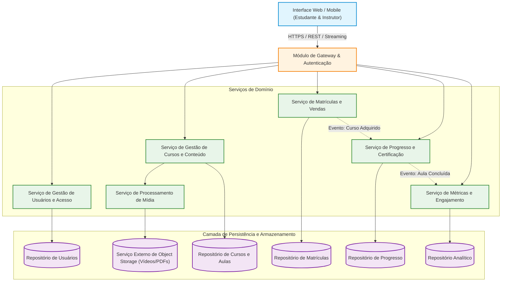
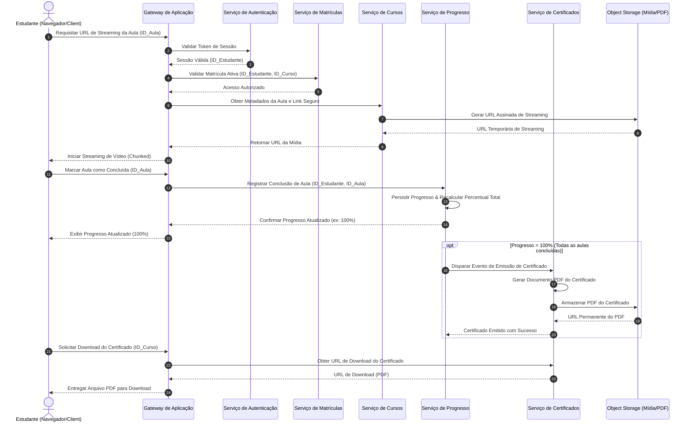

# Relatório Técnico de Arquitetura de Software

---

## 1. Identificação das HUs

A tabela a seguir consolida a rastreabilidade entre as Histórias de Usuário (HUs), seus respectivos papéis, Requisitos Funcionais (RF), Requisitos Não Funcionais (RNF) e critérios essenciais de aceite.

| HU ID | Perfil | Resumo do Objetivo | RFs Cobertos | RNFs Relacionados | Critérios de Aceite Chave |
|---|---|---|---|---|---|
| **HU01** | Instrutor | Criar e estruturar cursos (módulos, aulas e upload de vídeos) | RF01, RF02, RF03, RF04 | RNF04, RNF09 | Título/descrição obrigatórios; reordenação livre; upload de vídeo por aula. |
| **HU02** | Instrutor | Publicar e despublicar cursos (controle de visibilidade) | RF05 | RNF01 | Cursos despublicados somem da vitrine; estudantes já matriculados mantêm acesso. |
| **HU03** | Instrutor | Acompanhar total de matrículas por curso | RF13 | RNF06 | Exibição no painel do instrutor; atualização com defasagem máxima de 1 hora. |
| **HU04** | Instrutor | Acompanhar engajamento por aula (views e taxa de conclusão) | RF14 | RNF06 | Métricas por aula visíveis no painel; tempo de resposta do painel <= 3s. |
| **HU05** | Estudante | Cadastrar-se na plataforma | RF06 | RNF02 | E-mail único e válido; senha >= 8 caracteres armazenada com hash seguro. |
| **HU06** | Estudante | Adquirir um curso disponível | RF07, RF08 | RNF01, RNF09 | Liberação imediata após compra; impede compra duplicada do mesmo curso. |
| **HU07** | Estudante | Assistir aulas e marcar progresso | RF08, RF09, RF10, RF12 | RNF01, RNF03, RNF05, RNF07, RNF08, RNF10 | Streaming de vídeo (sem download integral); progresso atualizado e salvo automaticamente. |
| **HU08** | Estudante | Receber e baixar certificado de conclusão | RF11, RF15 | RNF09 | Emissão automática ao concluir 100% das aulas; download em PDF contendo dados obrigatórios. |
| **HU09** | Estudante | Acessar área de cursos adquiridos | RF12, RF16 | RNF05, RNF08 | Painel centralizado com status/progresso; acesso direto às aulas; destaque para concluídos. |

---

## 2. Diagramas de Arquitetura (Mermaid)

### 2.1. Diagrama de Componentes (Visão Estrutural e Conceitual)

---

### 2.2. Diagrama de Sequência (Fluxo Completo: Consumo de Aula, Conclusão e Emissão de Certificado)

---

## 3. Decisões de Arquitetura

### ADR-01: Desacoplamento do Armazenamento de Vídeo e Entrega via Streaming (RNF03, RNF04)
* **Contexto:** A aplicação necessita fornecer vídeos para milhares de alunos concorrentes sem comprometer a largura de banda do servidor de aplicação e garantindo reprodução contínua sem necessidade de download prévio integral.
* **Decisão:** O upload de arquivos de vídeo pelos instrutores e a entrega dos vídeos aos estudantes serão delegados integralmente a um componente de *Object Storage* externo abstrato. A aplicação fornecerá URLs temporárias assinadas (pre-signed URLs) para streaming direto entre o cliente e o serviço de armazenamento.
* **Consequências:** 
  * *Positivas:* Alta escalabilidade, redução severa de carga e custos de E/S no backend, conformidade técnica com RNF03 e RNF04.
  * *Mitigações:* Necessidade de pipeline assíncrono para validação de uploads e geração de assinaturas de acesso baseadas em tempo.

### ADR-02: Modelo de Segurança e Controle de Acesso Baseado em Hash e Tokens (RNF01, RNF02)
* **Contexto:** Garantir que conteúdos pagos sejam acessíveis estritamente por estudantes com matrícula ativa e assegurar a proteção de credenciais armazenadas.
* **Decisão:** Senhas de usuários serão obrigatoriamente transformadas via algoritmos de hash adaptativo seguro de uma via (ex.: bcrypt) antes da persistência. O acesso a recursos protegidos usará autorização via tokens validados no Gateway da Aplicação, checando rigorosamente a tabela de matrículas ativas antes da liberação de streams ou emissão de certificados.
* **Consequências:** Alta proteção contra vazamento de credenciais e garantia de cumprimento integral do RNF01 e RNF02.

### ADR-03: Atualização Event-Driven para Progresso e Métricas de Engajamento (RNF06, RNF07)
* **Contexto:** A gravação de progresso do aluno deve ser instantânea e confiável, enquanto a consolidação de métricas do painel do instrutor necessita ser carregada em até 3 segundos sem sobrecarregar as tabelas transacionais de consumo diário.
* **Decisão:** A gravação do progresso individual utilizará persistência síncrona com transações atômicas para evitar perdas (RNF07). Contudo, o cômputo de métricas analíticas agregadas (visualizações, taxa de conclusão do painel do instrutor) funcionará de forma assíncrona orientada a eventos, alimentando um repositório otimizado para leitura.
* **Consequências:** Garante o RNF06 (carregamento do painel em até 3s) e atende ao requisito de defasagem aceitável de até 1 hora citado nos critérios de aceite da HU03.

---

## 4. Tabela de Componentes e Rastreabilidade

| Componente | Responsabilidade Principal | Comunica-se com | Origem (HU / Critério de Aceite) |
|---|---|---|---|
| **Módulo de Gateway & Autenticação** | Ponto de entrada único, autenticação de sessão, autorização de acesso e roteamento de requisições. | Serviço de Gestão de Usuários, Todos os Serviços de Domínio | HU05, HU09, RF16, RNF01 |
| **Serviço de Gestão de Usuários e Acesso** | Cadastro de estudantes/instrutores, criptografia/hash de senhas e autenticação. | Repositório de Usuários | HU05, RF06, RF16, RNF02 |
| **Serviço de Gestão de Cursos e Conteúdo** | Gestão de ciclo de vida de cursos, módulos, aulas e status de publicação/rascunho. | Serviço de Mídia, Repositório de Cursos | HU01, HU02, RF01, RF02, RF04, RF05 |
| **Serviço de Processamento de Mídia** | Intermediar upload e gerar links de streaming de vídeos junto ao Object Storage. | Serviço externo de Object Storage, Serviço de Cursos | HU01, RF03, RNF03, RNF04 |
| **Serviço de Matrículas e Vendas** | Gestão de aquisição de cursos, validação de acesso prévio e liberação imediata. | Repositório de Matrículas, Serviço de Progresso | HU06, RF07, RF08, RNF01, RNF09 |
| **Serviço de Progresso e Certificação** | Registro atômico de conclusão de aulas, cálculo do percentual e geração automática/download de certificados em PDF. | Serviço de Cursos, Repositório de Progresso, Object Storage | HU07, HU08, HU09, RF09, RF10, RF11, RF12, RF15, RNF07, RNF09 |
| **Serviço de Métricas e Engajamento** | Consolidação de estatísticas de visualização, taxa de conclusão e matrículas por curso para o painel do instrutor. | Repositório Analítico | HU03, HU04, RF13, RF14, RNF06 |

---

## 5. Bloqueios e Pendências

1. **Integração com Gateway de Pagamentos (Lacuna da HU06 / RF07):**
   * *Pendência:* O requisito cita que o estudante "adquire" um curso, mas não detalha o fluxo de pagamento (cartão, boleto, transação síncrona ou assíncrona/webhook).
   * *Impacto Arquitetural:* A liberação "imediata" do acesso depende do processamento do meio de pagamento. Necessário especificar a interface de integração de pagamentos.

2. **Pipeline de Transcodificação e Adaptação de Vídeos (Lacuna da HU01 / RNF03):**
   * *Pendência:* Não há especificação sobre os formatos de vídeo aceitos no upload ou se haverá transcodificação para formatos de taxa de bits adaptável (ex.: HLS / DASH).
   * *Impacto Arquitetural:* Fazer streaming de arquivos brutos enviados pelos instrutores pode quebrar a experiência em conexões lentas ou dispositivos móveis (violando RNF05).

3. **Política de Alteração/Exclusão de Conteúdo em Cursos com Alunos Matriculados (Lacuna da HU02 / HU01 / RF04):**
   * *Pendência:* O RF04 permite editar e remover aulas/módulos, mas o critério de aceite da HU02 garante acesso a quem comprou. Não está definido o comportamento caso o instrutor exclua uma aula que faça parte do cálculo de progresso de um estudante em andamento.
   * *Impacto Arquitetural:* Risco de corrupção do percentual de progresso ou quebra na emissão de certificados.

---

## 6. Cobertura de Requisitos

### Requisitos Funcionais (RF)

| ID RF | Coberto? | Componente / Elemento Arquitetural Responsável |
|---|---|---|
| **RF01** | Sim | Serviço de Gestão de Cursos e Conteúdo |
| **RF02** | Sim | Serviço de Gestão de Cursos e Conteúdo |
| **RF03** | Sim | Serviço de Processamento de Mídia & Object Storage |
| **RF04** | Sim | Serviço de Gestão de Cursos e Conteúdo |
| **RF05** | Sim | Serviço de Gestão de Cursos e Conteúdo |
| **RF06** | Sim | Serviço de Gestão de Usuários e Acesso |
| **RF07** | Sim | Serviço de Matrículas e Vendas |
| **RF08** | Sim | Módulo de Gateway (Autorização) + Serviço de Matrículas |
| **RF09** | Sim | Serviço de Progresso e Certificação |
| **RF10** | Sim | Serviço de Progresso e Certificação |
| **RF11** | Sim | Serviço de Progresso e Certificação |
| **RF12** | Sim | Serviço de Progresso e Certificação |
| **RF13** | Sim | Serviço de Métricas e Engajamento |
| **RF14** | Sim | Serviço de Métricas e Engajamento |
| **RF15** | Sim | Serviço de Progresso e Certificação & Object Storage |
| **RF16** | Sim | Serviço de Gestão de Usuários e Acesso |

### Requisitos Não Funcionais (RNF)

| ID RNF | Coberto? | Estratégia Arquitetural de Atendimento |
|---|---|---|
| **RNF01** | Sim | Verificação de permissão centralizada no Gateway consultando a tabela de matrículas ativas. |
| **RNF02** | Sim | Criptografia hashing de mão única (ex: bcrypt) aplicada no Serviço de Usuários antes de salvar credenciais. |
| **RNF03** | Sim | Entrega de vídeos via URLs assinadas para streaming direto do Object Storage. |
| **RNF04** | Sim | Desacoplamento da camada de mídia utilizando interface abstrata para Object Storage. |
| **RNF05** | Sim | Interface Web/Mobile responsiva consumindo APIs REST puras. |
| **RNF06** | Sim | Separação entre base transacional e base analítica agregada para o painel do instrutor. |
| **RNF07** | Sim | Transação síncrona e atômica para registro de progresso individual a cada marcação de aula. |
| **RNF08** | Sim | Padrões abertos de API (REST/JSON) e formatos nativos de vídeo (HLS/MP4) suportados por navegadores modernos. |
| **RNF09** | Sim | Módulo centralizado de logging para eventos críticos (compra, certificado, erro de upload). |
| **RNF10** | Sim | Inclusão de requisitos de player acessível na camada de frontend/cliente. |

---

## 7. Gap Analysis

| Lacuna Identificada | Requisito Origem | Impacto Arquitetural / Operacional | Ação Recomendada para o Time de DEV |
|---|---|---|---|
| **Ausência de Gateway de Pagamento e Tratamento de Falhas** | HU06 / RF07 | Impossibilidade de integrar fluxo real de vendas. Incerteza sobre comportamento em pagamentos assíncronos (ex.: boleto ou PIX). | Modelar um módulo de integração de pagamentos assíncrono baseado em Webhooks, garantindo desacoplamento do motor de matrícula. |
| **Ausência de Transcodificação Adaptativa de Mídia** | HU01 / RNF03 / RNF05 | Vídeos em alta resolução enviados por instrutores podem travar a reprodução em conexões móveis ou ocupar espaço excessivo. | Adicionar um pipeline de pré-processamento/transcodificação assíncrona após o upload para gerar resoluções múltiplas (HLS). |
| **Regra de Versionamento de Curso e Aulas Excluídas** | RF04 / HU02 | Excluir uma aula pode invalidar o cálculo do percentual de progresso de alunos em andamento ou históricos de certificados. | Implementar padrão de *Soft Delete* para aulas/módulos e congelar a estrutura do curso (snapshot) no momento da matrícula do estudante. |
| **Mecanismo de Auditoria e Logs de Eventos Críticos** | RNF09 | Ausência de definição de infraestrutura para armazenamento e análise de logs estruturados de auditoria. | Padronizar um serviço de logging centralizado para capturar payloads de eventos críticos (aquisições, emissões de certificados e erros de upload). |