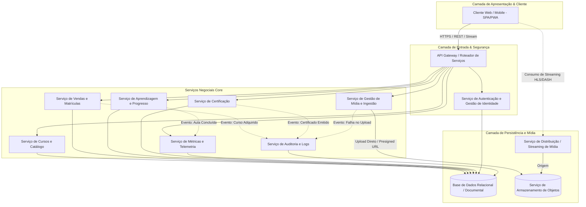
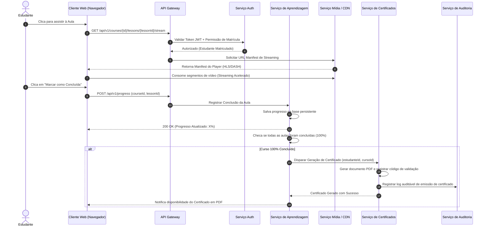

# Relatório Técnico de Arquitetura de Software

## 1. Identificação das HUs

A tabela abaixo compila as Histórias de Usuário (HUs) fornecidas, estabelecendo o mapeamento direto entre personas, proposta de valor, critérios de aceite e os respectivos Requisitos Funcionais (RF) e Não Funcionais (RNF) correlacionados.

| ID | Persona | Proposta de Valor | Critérios de Aceite | Requisitos Correlacionados |
| :--- | :--- | :--- | :--- | :--- |
| **HU01** | Instrutor | Criar e estruturar curso com módulos, aulas e uploads de vídeo. | - Título e descrição obrigatórios.<br>- Permite reordenar, adicionar e remover módulos/aulas antes de publicar.<br>- Upload de vídeo por aula. | RF01, RF02, RF03, RF04, RNF04 |
| **HU02** | Instrutor | Controlar visibilidade do curso (publicar/despublicar). | - Cursos despublicados não aparecem no catálogo público.<br>- Alunos matriculados mantêm acesso a cursos despublicados.<br>- Status (rascunho/publicado) visível no painel. | RF05, RNF01 |
| **HU03** | Instrutor | Acompanhar total de matrículas por curso. | - Exibição do total de alunos por curso.<br>- Dados atualizados em tempo real ou defasagem máxima de 1 hora. | RF13, RNF06 |
| **HU04** | Instrutor | Acompanhar métricas de engajamento (visualizações e conclusão por aula). | - Exibição de visualizações e % de conclusão por aula.<br>- Acesso às métricas via painel do curso. | RF14, RNF06 |
| **HU05** | Estudante | Cadastrar-se na plataforma. | - E-mail único e válido; e-mail e senha obrigatórios.<br>- Senha com no mínimo 8 caracteres.<br>- Redirecionamento para a página inicial após cadastro. | RF06, RF16, RNF02 |
| **HU06** | Estudante | Adquirir um curso disponível. | - Liberação imediata do acesso após aquisição.<br>- Curso adicionado à área do estudante.<br>- Bloqueio de compra duplicada. | RF07, RF08, RNF01, RNF09 |
| **HU07** | Estudante | Assistir às aulas e registrar progresso. | - Reprodução via streaming sem download integral.<br>- Marcação manual de aula concluída.<br>- Atualização imediata do % de progresso do curso. | RF08, RF09, RF10, RF12, RNF01, RNF03, RNF07, RNF10 |
| **HU08** | Estudante | Receber e baixar certificado de conclusão. | - Emissão automática ao concluir 100% das aulas.<br>- Certificado com nome do aluno, curso, instrutor e data.<br>- Download em PDF disponível a qualquer tempo após emissão. | RF11, RF15, RNF09 |
| **HU09** | Estudante | Visualizar painel centralizado de cursos adquiridos. | - Listagem dos cursos com título, capa e progresso.<br>- Acesso direto às aulas a partir da listagem.<br>- Destaque visual distinto para cursos concluídos. | RF12, RNF05, RNF08 |

---

## 2. Diagramas de Arquitetura (Mermaid)

### 2.1. Visão Geral de Componentes (C2 Level - Abstrato)



### 2.2. Diagrama de Sequência: Ciclo Completo de Aprendizagem e Certificação

O diagrama abaixo ilustra o fluxo transacional completo desde o acesso ao conteúdo protegido, consumo de vídeo via streaming, registro de progresso, até a emissão do certificado.



---

## 3. Decisões de Arquitetura

### ADR-01: Deslocamento do Processamento e Armazenamento de Vídeo para Provedor de Objetos e CDN
* **Contexto**: O RNF03 e o RNF04 exigem que os vídeos sejam entregues por streaming e armazenados em *Object Storage* externo desacoplado da aplicação.
* **Decisão**: A aplicação não receberá o tráfego binário do vídeo através de seus servidores principais de aplicação. O upload utilizará URLs pré-assinadas (*Presigned URLs*) geradas pelo `Serviço de Mídia`, permitindo o envio direto do cliente para o `Serviço de Armazenamento de Objetos`. A distribuição para reprodução ocorrerá via `Serviço de Distribuição de Mídia / CDN` utilizando protocolos de streaming adaptativo (como HLS ou DASH).
* **Consequência**: Minimiza a carga nos servidores de aplicação, previne gargalos de I/O e garante escalabilidade ilimitada no consumo de mídia.

### ADR-02: Mecanismo de Proteção de Senhas e Controle de Acesso Baseado em Modéis de Identidade (RBAC)
* **Contexto**: O RNF02 exige que as senhas sejam armazenadas de forma segura com hash unidirecional (ex: bcrypt), e o RNF01 exige controle estrito de acesso aos conteúdos pagos.
* **Decisão**: Adotar-se-á um algoritmo de hash de senha criptográfico forte, desacoplado na camada do `Serviço de Autenticação`. A validação de direitos de acesso a cursos (seja publicado ou despublicado para alunos com histórico de compra) será realizada via autorização granular por escopo (*Role-Based Access Control* - RBAC) avaliada na camada do API Gateway e validada pelos serviços internos.
* **Consequência**: Conformidade estrita com padrões de segurança; garantia de que o aluno mantiver acesso ao conteúdo previamente adquirido, mesmo que o instrutor altere o estado do curso para despublicado (atendendo à HU02 e ao RNF01).

### ADR-03: Estratégia de Persistência do Progresso e Atualização de Métricas
* **Contexto**: O RNF07 exige salvamento automático de progresso sem perda de dados, o RNF06 estabelece limite de 3 segundos para carregamento do painel de métricas e as HUs 03 e 04 exigem consistência nas métricas do instrutor.
* **Decisão**: A gravação da conclusão da aula será síncrona no banco de dados principal para garantir atomicidade e imunidade à perda de dados. O recálculo de agregação de métricas para o painel do instrutor poderá utilizar visões pré-computadas ou uma camada de cache temporário (máximo de 1 hora de defasagem permitida), garantindo resposta rápida (< 3s) ao instrutor.
* **Consequência**: Garante confiabilidade no progresso do aluno e atende integralmente ao tempo de resposta exigido para requisições analíticas.

### ADR-04: Padronização do Serviço de Log e Auditoria Centralizada
* **Contexto**: O RNF09 especifica a necessidade explícita de log de eventos críticos (aquisição de cursos, emissão de certificados e falhas de upload de vídeo).
* **Decisão**: Criação de uma interface unificada de Auditoria. Os serviços de Vendas, Certificação e Mídia enviarão eventos estruturados de auditoria contendo *timestamp*, ID do usuário, tipo de evento e contexto estruturado para o `Serviço de Auditoria e Logs`.
* **Consequência**: Facilidade de rastreabilidade, depuração e conformidade regulatória.

---

## 4. Tabela de Componentes e Rastreabilidade

| Componente | Responsabilidade Principal | Comunica-se com | Origem (HU / Critério de Aceite) |
| :--- | :--- | :--- | :--- |
| **API Gateway / Auth Service** | Roteamento de requisições, autenticação de usuários, validação de tokens e hashing seguro de senhas. | Todos os Clientes, Base de Dados, Serviços Core | HU05, HU06, RF06, RF16, RNF01, RNF02 |
| **Serviço de Cursos e Catálogo** | Gestão do ciclo de vida dos cursos (criar, editar, remover, publicar, despublicar, reordenar módulos/aulas). | Base de Dados, Servicio de Mídia, API Gateway | HU01, HU02, RF01, RF02, RF04, RF05 |
| **Serviço de Mídia e Ingestão** | Geração de links pré-assinados para upload de vídeos e emissão das URLs de streaming via CDN. | Armazenamento de Objetos, CDN, Serviço de Auditoria | HU01, HU07, RF03, RNF03, RNF04, RNF09, RNF10 |
| **Serviço de Vendas e Matrículas** | Processamento de compras de cursos, garantia de não duplicidade de matrículas e liberação de acesso. | Base de Dados, Serviço de Cursos, Serviço de Auditoria | HU06, RF07, RF08, RNF01, RNF09 |
| **Serviço de Aprendizagem e Progresso** | Controle de avanço do aluno, registro síncrono de aulas concluídas e cálculo percentual de progresso. | Base de Dados, Serviço de Certificados, Serviço de Métricas | HU07, HU09, RF09, RF10, RF12, RNF07 |
| **Serviço de Certificação** | Geração automática de certificados em formato PDF, persistência do registro e disponibilização para download. | Base de Dados, Serviço de Aprendizagem, Serviço de Auditoria | HU08, RF11, RF15, RNF09 |
| **Serviço de Métricas e Analytics** | Consolidação de dados de matrículas, visualizações por aula e taxas de conclusão para exibições em painéis. | Base de Dados, Serviço de Aprendizagem, API Gateway | HU03, HU04, RF13, RF14, RNF06 |
| **Serviço de Logs e Auditoria** | Centralização e tratamento de eventos auditáveis críticos do sistema. | Serviço de Vendas, Serviço de Certificação, Serviço de Mídia | RNF09 |

---

## 5. Bloqueios e Pendências

1. **Ausência de Integração com Gateway de Pagamento Formal**:
   * *Descrição*: Os requisitos (RF07, HU06) estabelecem a funcionalidade de "adquirir curso", mas não detalham o fluxo transacional com um provedor de pagamento (ex: webhook de confirmação, estados da transação como pendente, recusado, estornado).
   * *Impacto*: Dificulta a definição exata das interfaces do `Serviço de Vendas e Matrículas`.

2. **Políticas de Retenção e Transcodificação de Mídia**:
   * *Descrição*: Não há especificação sobre os formatos aceitos no upload de vídeo (MP4, MOV, MKV) nem sobre a esteira de conversão (transcodificação) para gerar os perfis de taxa de bits adaptativa para o streaming (RNF03).
   * *Impacto*: Pode gerar falhas de upload não tratadas no cliente se arquivos incompatíveis forem enviados.

3. **Mecanismos de Validação Pública do Certificado**:
   * *Descrição*: A HU08 e o RF15 exigem a emissão e download em PDF, mas não especificam se deve haver um código hash público para verificação da autenticidade por terceiros.
   * *Impacto*: O layout e a infraestrutura de dados do certificado exigirão ajustes futuros caso a validação externa seja necessária.

---

## 6. Cobertura de Requisitos

A matriz abaixo comprova o atendimento integral de todos os Requisitos Funcionais e Não Funcionais pela arquitetura desenhada.

| ID Requisito | Atendido pelo Componente / Mecanismo de Arquitetura | Status |
| :--- | :--- | :--- |
| **RF01** | Serviço de Cursos e Catálogo (Criação de metadata do curso) | OK |
| **RF02** | Serviço de Cursos e Catálogo (Estrutura hierárquica Módulo/Aula) | OK |
| **RF03** | Serviço de Mídia / Upload desacoplado com Armazenamento de Objetos | OK |
| **RF04** | Serviço de Cursos e Catálogo (Edição/Remoção lógica ou física) | OK |
| **RF05** | Serviço de Cursos e Catálogo (Controle de Visibilidade/Status) | OK |
| **RF06** | API Gateway / Auth Service (Cadastro de Usuário com validação) | OK |
| **RF07** | Serviço de Vendas e Matrículas (Geração de Matrícula) | OK |
| **RF08** | API Gateway + Auth Service (Políticas de Autorização/RBAC) | OK |
| **RF09** | Serviço de Aprendizagem e Progresso (Registro síncrono de conclusão) | OK |
| **RF10** | Serviço de Aprendizagem e Progresso (Cálculo de progresso acumulado) | OK |
| **RF11** | Serviço de Certificação (Disparo automático de regras no término do curso) | OK |
| **RF12** | Serviço de Aprendizagem + Cliente Web (Exibição de progresso visual) | OK |
| **RF13** | Serviço de Métricas e Analytics (Consolidação do total de alunos) | OK |
| **RF14** | Serviço de Métricas e Analytics (Métricas de engajamento e visualizações) | OK |
| **RF15** | Serviço de Certificação (Download de arquivo PDF renderizado) | OK |
| **RF16** | API Gateway / Auth Service (Sessões e Gestão de Tokens JWT) | OK |
| **RNF01** | Auth Service / Middleware de Autorização do Gateway | OK |
| **RNF02** | Auth Service (Algoritmo seguro de hash de senha) | OK |
| **RNF03** | Serviço de Mídia + CDN (Entrega por Streaming HLS/DASH) | OK |
| **RNF04** | Serviço de Armazenamento de Objetos (Desacoplado dos servidores WEB) | OK |
| **RNF05** | Cliente Web / Mobile (Layout Responsivo SPA/PWA) | OK |
| **RNF06** | Servicio de Métricas e Analytics (Estratégia de Pré-agregação / Cache) | OK |
| **RNF07** | Serviço de Aprendizagem (Persistência síncrona relacional) | OK |
| **RNF08** | Cliente Web (Compatibilidade através de Padrões Web W3C) | OK |
| **RNF09** | Serviço de Logs e Auditoria (Registros centralizados de eventos) | OK |
| **RNF10** | Cliente Web / Player de Mídia (Padrões de Acessibilidade WCAG/HTML5) | OK |

---

## 7. Gap Analysis

Esta seção aponta as lacunas de especificação encontradas nos requisitos originais, avalia o impacto arquitetural envolvido e recomenda as correções/ações necessárias para o time de implementação.

```
+---------------------------------------------------------------------------------------------------------+
|                                              GAP ANALYSIS                                               |
+--------------------------+-------------------------------------+----------------------------------------+
| Lacuna Identificada      | Impacto Arquitetural                | Ação Recomendada                      |
+--------------------------+-------------------------------------+----------------------------------------+
| 1. Fluxo de Pagamento    | O Serviço de Vendas fica vulnerável | Implementar padronização de Webhooks   |
|    não especificado      | a inconsitências na liberação de    | assíncronos e tabela de estados de     |
|    (RF07 / HU06)         | acesso caso o pagamento falhe.      | pedidos (PENDENTE, PAGO, CANCELADO).   |
+--------------------------+-------------------------------------+----------------------------------------+
| 2. Pipeline de Conversão | Ingestão de vídeos pesados sem      | Adicionar um fluxo assíncrono de       |
|    e Transcodificação    | padronização pode degradar a        | Transcodificação na nuvem pós-upload  |
|    de Vídeo (RNF03/04)   | experiência de streaming móvel.     | para gerar perfis multi-bitrate.       |
+--------------------------+-------------------------------------+----------------------------------------+
| 3. Concorrência na       | Múltiplas requisições simultâneas   | Desenvolver mecanismo idempotente no   |
|    Marcação de Progresso | de conclusão podem gerar inconsist- | registro de conclusão de aulas         |
|    (RF09 / RNF07)        | ência no percentual do curso.       | (Chave composta: Estudante + Aula).    |
+--------------------------+-------------------------------------+----------------------------------------+
| 4. Despublicação de      | Risco de revogação indevida de      | Garantir na camada de autorização      |
|    Curso e Direitos      | acesso para quem já comprou o       | que a consulta de acesso verifique a   |
|    Adquiridos (HU02)     | curso despublicado pelo instrutor.  | matrícula do aluno, não o status do    |
|                          |                                     | curso.                                 |
+--------------------------+-------------------------------------+----------------------------------------+
```