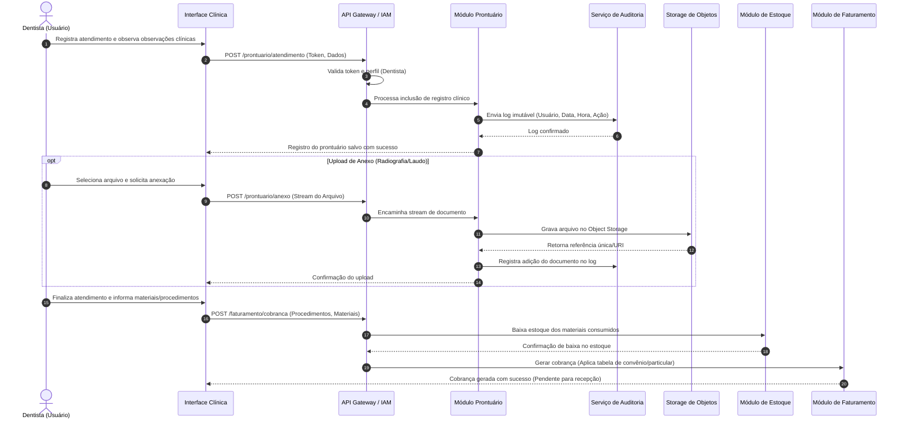

# Relatório Técnico de Arquitetura de Software

## 1. Identificação das HUs

A tabela abaixo sintetiza a relação entre as Histórias de Usuário (HUs), os perfis de acesso, seus objetivos funcionais primários e a rastreabilidade com os Requisitos Funcionais (RF) e Requisitos Não Funcionais (RNF) correspondentes.

| HU ID | Perfil | Objetivo Principal | RFs Relacionados | RNFs Relacionados |
| :--- | :--- | :--- | :--- | :--- |
| **HU01** | Recepcionista | Visualização unificada e filtrada da agenda de todos os dentistas. | RF03, RF04 | RNF06, RNF09, RNF10 |
| **HU02** | Recepcionista | Agendar, cancelar e remarcar consultas sem sobreposição de horários e com disparo de notificações. | RF05, RF06, RF07, RF08 | RNF01, RNF08 |
| **HU03** | Recepcionista | Registrar pagamentos totais ou parciais e acompanhar cobranças em aberto. | RF20, RF21 | RNF01, RNF08 |
| **HU04** | Dentista | Registrar procedimentos e observações no prontuário digital com rastreabilidade cronológica. | RF09, RF10, RF12, RF13 | RNF02, RNF05 |
| **HU05** | Dentista | Efetuar upload de radiografias e documentos clínicos associados ao prontuário. | RF11, RF12 | RNF02, RNF03, RNF07 |
| **HU06** | Dentista | Consultar o prontuário clínico completo do paciente por nome ou CPF com restrição de acesso. | RF09, RF12 | RNF02, RNF03, RNF09 |
| **HU07** | Dentista | Gerar cobrança pós-atendimento vinculando procedimentos, tabela de convênio e consumo de materiais. | RF17, RF18, RF19, RF20 | RNF01, RNF08 |
| **HU08** | Administrador | Cadastrar dentistas e parametrizar grades de horários de atendimento futuras. | RF01, RF03, RF07 | RNF01, RNF04 |
| **HU09** | Administrador | Gerenciar estoque de materiais, receber alertas de nível crítico e registrar reposições. | RF14, RF15, RF16 | RNF01, RNF09 |
| **HU10** | Administrador | Emitir e exportar relatórios consolidados de faturamento por período, dentista e modalidade. | RF22 | RNF01, RNF08 |
| **HU11** | Paciente | Autenticar no portal web e consultar agendamentos futuros e histórico de consultas. | RF23, RF24 | RNF01, RNF09, RNF10 |
| **HU12** | Paciente | Visualizar e realizar download de documentos e exames liberados, mantendo sigilo de notas internas. | RF23, RF25 | RNF02, RNF03, RNF07 |

---

## 2. Diagramas de Arquitetura (Mermaid)

### 2.1. Diagrama de Visão Geral de Componentes (Arquitetura Lógica)

O diagrama a seguir descreve a decomposição modular da aplicação, destacando a separação entre as interfaces de usuário, o barramento/gateway de serviços, a lógica de domínio e os subsistemas de persistência e integração externa.

```mermaid
componentDiagram
    [Portal do Paciente (Web/Mobile)] as UI_PAC
    [Interface Administrativa e Clínica (Web)] as UI_ADM

    package "Camada de Entrada & Segurança" {
        [API Gateway / Gateway de Acesso] as GW
        [Módulo de Gestão de Identidade e Acesso (IAM)] as IAM
    }

    package "Núcleo de Negócio (Serviços Lógicos)" {
        [Módulo de Agendamento e Grade] as MOD_AGENDA
        [Módulo de Prontuário Eletrônico] as MOD_PRONTUARIO
        [Módulo de Faturamento e Financeiro] as MOD_FINANCEIRO
        [Módulo de Controle de Estoque] as MOD_ESTOQUE
        [Módulo de Notificações] as MOD_NOTIF
        [Serviço de Auditoria e Logs] as MOD_AUDIT
    }

    package "Subsistemas de Persistência e Infraestrutura" {
        database "Banco de Dados Operacional" as DB_APP
        database "Repositório de Logs Imutáveis" as DB_AUDIT
        node "Serviço Externo de Armazenamento de Objetos" as OBJ_STORE
        node "Servidor Externo de Envio de E-mail" as EMAIL_SERVICE
    }

    UI_PAC --> GW
    UI_ADM --> GW

    GW --> IAM : Autenticação / Autorização
    GW --> MOD_AGENDA
    GW --> MOD_PRONTUARIO
    GW --> MOD_FINANCEIRO
    GW --> MOD_ESTOQUE

    MOD_AGENDA --> MOD_NOTIF : Dispara evento de agendamento
    MOD_AGENDA --> DB_APP : Consulta/Persiste agendas
    
    MOD_PRONTUARIO --> MOD_AUDIT : Transmite evento de alteração
    MOD_PRONTUARIO --> OBJ_STORE : Upload/Download de anexos
    MOD_PRONTUARIO --> DB_APP : Persiste evolução clínica

    MOD_FINANCEIRO --> DB_APP : Registra cobranças e pagamentos
    
    MOD_ESTOQUE --> MOD_PRONTUARIO : Vincula consumo
    MOD_ESTOQUE --> DB_APP : Atualiza saldos/alertas

    MOD_NOTIF --> EMAIL_SERVICE : Envia e-mails aos pacientes
    MOD_AUDIT --> DB_AUDIT : Registra log imutável
```

---

### 2.2. Diagrama de Sequência: Atendimento, Registro Prontuário, Anexo e Cobrança

O fluxo abaixo representa o ciclo completo de um atendimento realizado pelo Dentista, contemplando a validação de acesso, o registro do prontuário com auditoria, o envio de documento para o armazenamento de objetos e a geração automática da cobrança financeira com dedução de material.



---

## 3. Decisões de Arquitetura

### ADR-01: Desacoplamento de Documentos Clínicos via Armazenamento de Objetos (Object Storage)
*   **Contexto:** Conforme exigido pelo **RNF07**, a aplicação precisa suportar o armazenamento escalável de radiografias e laudos médicos pesados, sem degradar a performance do servidor web nem a escalabilidade da base de dados principal.
*   **Decisão:** Toda a gestão de arquivos binários será realizada de forma assíncrona/direta por meio de uma interface abstrata de *Object Storage*. A base de dados principal armazenará apenas os metadados (nome, hash, tipo MIME, data, dentista responsável e URI de acesso).
*   **Consequência:** Garante alta disponibilidade, conformidade com o RNF07, flexibilidade para troca de provedor de nuvem sem impacto na aplicação e otimização do tamanho dos backups da base relacional.

### ADR-02: Garantia de Rastreabilidade e Imutabilidade do Prontuário Digital (Audit Trail)
*   **Contexto:** Os requisitos **RF13**, **RNF02** (LGPD/CFO) e **RNF05** estabelecem a obrigação de registrar todas as alterações feitas em prontuários de forma imutável e auditável.
*   **Decisão:** O módulo de Prontuário Eletrônico emitirá eventos síncronos de auditoria para um componente dedicado de *Audit Log*. Registros de prontuário não sofrerão comandos de alteração destrutiva (*DELETE* ou *UPDATE* sobrescritivo na base principal); edições criarão novas revisões vinculadas ao histórico, gravando id do usuário, timestamp de precisão e fingerprint da alteração.
*   **Consequência:** Assegura conformidade total legal e regulatória com as normas do Conselho Federal de Odontologia e LGPD.

### ADR-03: Mecanismo Concorrente Anti-Sobreposição para Agendamento de Consultas
*   **Contexto:** O **RF06** e **HU02** demandam o bloqueio estrito de consultas sobrepostas na agenda de um mesmo profissional, mesmo que múltiplas recepcionistas tentem agendar simultaneamente.
*   **Decisão:** O Módulo de Agendamento aplicará controle de concorrência com travas de transação em nível de intervalometria de horários (*pessimistic lock* no momento da seleção do slot ou validação estrita com exclusão mútua na transação de escrita).
*   **Consequência:** Previne *race conditions*, inconsistências na agenda e garante o cumprimento estrito do RF06.

### ADR-04: Isolamento de Acesso e Exposição Controlada do Portal do Paciente
*   **Contexto:** Os requisitos **RF25**, **HU12** e **RNF03** estabelecem que os pacientes têm acesso a documentos clínicos e agendamentos, mas não podem ter acesso às anotações clínicas internas do dentista contidas no prontuário.
*   **Decisão:** A API do Portal do Paciente utilizará *Data Transfer Objects* (DTOs) sanitizados e específicos para a visualização externa. Anotações classificadas como "Evolução Interna/Observações Clínicas" não farão parte dos endpoints consumidos pelo Portal do Paciente.
*   **Consequência:** Mitiga vazamento de dados confidenciais de uso exclusivo da equipe médica e cumpre as diretrizes de privacidade do RNF03.

---

## 4. Tabela de Componentes e Rastreabilidade

| Componente | Responsabilidade Principal | Comunica-se com | Origem (HU / Critério de Aceite) |
| :--- | :--- | :--- | :--- |
| **API Gateway / Auth (IAM)** | Autenticar usuários, gerenciar sessões (30 min inatividade), validar hashes de senha e controlar permissões RBAC. | Todos os módulos de frontend e backend. | RF01, RF02, RNF01, RNF04 |
| **Módulo de Agendamento e Grade** | Gerenciar grades individuais de horários, impedir sobreposições, exibir agenda unificada e emitir eventos de alteração de agenda. | IAM, Módulo de Notificações, Banco de Dados Operacional. | HU01, HU02, HU08, HU11, RF03-RF07, RNF06 |
| **Módulo de Prontuário Eletrônico** | Manter histórico clínico, gerenciar entradas cronológicas, associar documentos e controlar a visibilidade de anotações médicas. | IAM, Object Storage, Serviço de Auditoria, Banco de Dados. | HU04, HU05, HU06, HU12, RF09-RF13, RNF02, RNF03 |
| **Módulo de Faturamento e Financeiro** | Gerenciar procedimentos, convênios, gerar cobranças por atendimento e controlar pagamentos (totais/parciais). | IAM, Módulo de Prontuário, Módulo de Estoque, Banco de Dados. | HU03, HU07, HU10, RF18-RF22 |
| **Módulo de Controle de Estoque** | Controlar materiais, registrar movimentações (entradas/saídas), dar baixa por atendimento e gerar alertas de estoque mínimo. | IAM, Módulo de Faturamento, Banco de Dados Operacional. | HU09, RF14-RF17 |
| **Módulo de Notificações** | Processar e disparar e-mails automáticos transacionais de confirmação, remarcação e cancelamento. | Módulo de Agendamento, Servidor Externo de E-mail. | HU02 (Critério 3), RF08 |
| **Serviço de Auditoria e Logs** | Gravar registros imutáveis e auditáveis contendo usuário, data, hora e dados de alteração do prontuário. | Módulo de Prontuário, Repositório de Logs Imutáveis. | RNF05, RF13 |
| **Serviço de Armazenamento de Objetos** | Prover persistência segura, isolada e escalável para documentos clínicos e radiografias. | Módulo de Prontuário, Serviço Externo de Storage. | HU05, HU12, RF11, RNF03, RNF07 |

---

## 5. Bloqueios e Pendências

1. **Definição de Política para Conciliação de Pagamentos Parciais (HU03 / RF21):**
   * *Pendência:* O requisito prevê pagamento parcial, porém não explicita a regra para parcelamento, cobrança de juros/multas ou prazos de vencimento do saldo remanescente.
   * *Risco:* Modelagem financeira incompleta exigindo refatoração estrutural da entidade Cobrança.

2. **Protocolo e Infraestrutura de Envio de E-mails Transacionais (RF08):**
   * *Pendência:* Não há especificação de tolerância a falhas caso o serviço de e-mail fique indisponível durante o agendamento (o agendamento deve ser revertido ou a notificação entra em fila de reprocessamento?).
   * *Risco:* Bloqueio na experiência da recepcionista caso a chamada de e-mail seja síncrona e ocorram timeouts externos.

3. **Política de Revogação e Retenção do Portal do Paciente (RF23 / RNF02):**
   * *Pendência:* Ausência de especificação sobre o tempo de vida útil de links temporários (*signed URLs*) para download de arquivos pelo paciente.
   * *Risco:* Vulnerabilidade de segurança caso URIs diretas do armazenamento de objetos sejam vazadas ou continuem acessíveis indefinidamente.

---

## 6. Cobertura de Requisitos

A matriz abaixo comprova o atendimento integral de todos os Requisitos Funcionais e Não Funcionais pelo design de arquitetura proposto.

### Requisitos Funcionais (RF)

| ID | Status de Cobertura | Componente Responsável |
| :--- | :--- | :--- |
| **RF01** | Coberto | API Gateway / Auth (IAM) |
| **RF02** | Coberto | API Gateway / Auth (IAM) |
| **RF03** | Coberto | Módulo de Agendamento e Grade |
| **RF04** | Coberto | Módulo de Agendamento e Grade |
| **RF05** | Coberto | Módulo de Agendamento e Grade |
| **RF06** | Coberto | Módulo de Agendamento e Grade |
| **RF07** | Coberto | Módulo de Agendamento e Grade |
| **RF08** | Coberto | Módulo de Notificações |
| **RF09** | Coberto | Módulo de Prontuário Eletrônico |
| **RF10** | Coberto | Módulo de Prontuário Eletrônico |
| **RF11** | Coberto | Módulo de Prontuário Eletrônico / Serviço de Armazenamento de Objetos |
| **RF12** | Coberto | Módulo de Prontuário Eletrônico |
| **RF13** | Coberto | Módulo de Prontuário Eletrônico / Serviço de Auditoria e Logs |
| **RF14** | Coberto | Módulo de Controle de Estoque |
| **RF15** | Coberto | Módulo de Controle de Estoque |
| **RF16** | Coberto | Módulo de Controle de Estoque |
| **RF17** | Coberto | Módulo de Controle de Estoque / Módulo de Faturamento |
| **RF18** | Coberto | Módulo de Faturamento e Financeiro |
| **RF19** | Coberto | Módulo de Faturamento e Financeiro |
| **RF20** | Coberto | Módulo de Faturamento e Financeiro |
| **RF21** | Coberto | Módulo de Faturamento e Financeiro |
| **RF22** | Coberto | Módulo de Faturamento e Financeiro |
| **RF23** | Coberto | Portal do Paciente (Interface) / API Gateway |
| **RF24** | Coberto | Módulo de Agendamento e Grade / Portal do Paciente |
| **RF25** | Coberto | Módulo de Prontuário Eletrônico / Serviço de Armazenamento de Objetos |

### Requisitos Não Funcionais (RNF)

| ID | Status de Cobertura | Estratégia Arquitetural Adoptada |
| :--- | :--- | :--- |
| **RNF01** | Coberto | Gestão de sessão por middleware no Gateway com expiração automática por inatividade de 30 minutos. |
| **RNF02** | Coberto | Módulo de auditoria, criptografia em trânsito/repouso e isolamento de visibilidade técnica conforme normas LGPD/CFO. |
| **RNF03** | Coberto | Controle de acesso refinado (RBAC) no download de arquivos via Object Storage e sanitização de rotas. |
| **RNF04** | Coberto | Utilização obrigatória de algoritmo de hash seguro (ex.: bcrypt) na camada de IAM para persistência de credenciais. |
| **RNF05** | Coberto | Envio de logs de alteração para repositório de logs imutáveis através do Serviço de Auditoria. |
| **RNF06** | Coberto | Otimização de consultas, indexação por dentista/data no Banco de Dados Operacional para garantir resposta em < 3s. |
| **RNF07** | Coberto | Desacoplamento do armazenamento de binários utilizando Serviço de Armazenamento de Objetos. |
| **RNF08** | Coberto | Arquitetura de microsserviços/módulos independentes com balanceamento de carga para garantir 99,5% de uptime. |
| **RNF09** | Coberto | Interfaces clientes desenvolvidas sob o conceito de Web Responsivo para suporte a múltiplos dispositivos. |
| **RNF10** | Coberto | Adoção de padrões Web universais (HTML5/CSS3/JavaScript standard) compatíveis com navegadores modernos. |
| **RNF11** | Coberto | Rotina programada de backup diário na camada de infraestrutura com política de retenção mínima de 30 dias. |

---

## 7. Gap Analysis

Esta seção analisa as lacunas identificadas na especificação de requisitos, avalia o impacto técnico envolvido e formaliza as recomendações direcionadas à equipe de engenharia.

### Lacuna 1: Ausência de Comunicação Assíncrona no Envio de Notificações (RF08 / HU02)
*   **Descrição do Gap:** O requisito RF08 exige envio de e-mail no agendamento, cancelamento ou remarcação. A execução síncrona desse envio durante a requisição de agendamento pode inflar o tempo de resposta e provocar falhas na transação se o servidor de e-mail estiver lento ou indisponível.
*   **Impacto Arquitetural:** Degradação do desempenho e violação pontual do RNF08 (Disponibilidade e resiliência das operações de agendamento).
*   **Ação Recomendada:** Adotar um padrão de publicação/assinatura (*Event Driven*) com mensageria assíncrona. O Módulo de Agendamento apenas publica o evento `AgendamentoRealizado`, liberando a interface da recepcionista imediatamente. Um worker assíncrono do Módulo de Notificações consome a mensagem e tenta efetuar a entrega do e-mail com política de retry.

### Lacuna 2: Falta de Mecanismo de Expiração de URLs Temporárias de Exames (RF25 / RNF03)
*   **Descrição do Gap:** O portal do paciente permite download de radiografias e laudos do *Object Storage*, mas não especifica a forma segura como os links serão disponibilizados sem expor os endereços públicos permanentes do storage.
*   **Impacto Arquitetural:** Risco de segurança e descumprimento potencial do RNF03/LGPD se os caminhos dos arquivos forem previsíveis ou estáticos.
*   **Ação Recomendada:** O Módulo de Prontuário deve gerar *Signed URLs* (URLs assinadas temporárias) válidas por um período curto (ex.: 15 minutos) a cada requisição do paciente autenticado. O download ocorrerá diretamente do armazenamento de objetos de forma segura sem sobrecarregar a aplicação principal.

### Lacuna 3: Regras para Tratamento de Inconsistências de Estoque durante Atendimentos (RF15 / RF17)
*   **Descrição do Gap:** Não há especificação do comportamento do sistema no momento da baixa de estoque oriunda de um atendimento (RF17) caso o material selecionado esteja com saldo zerado na base de dados.
*   **Impacto Arquitetural:** Risco de gerar saldo negativo inconsistente ou travar a conclusão do registro do atendimento clínico.
*   **Ação Recomendada:** Permitir a gravação do consumo vinculado ao atendimento mesmo que o estoque saldo esteja insuficiente, gerando um evento imediato de alertamento ao administrador e registrando o saldo negativo temporário com indicação visual para conciliação física obrigatória na rotina do Módulo de Estoque.