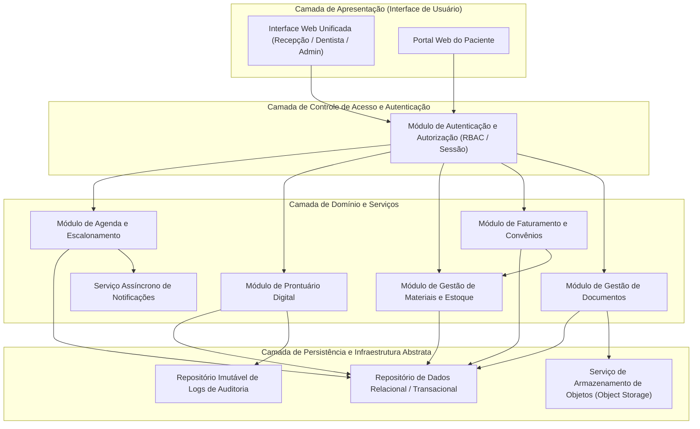
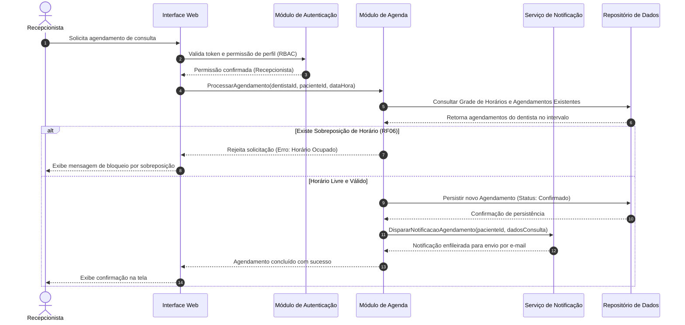
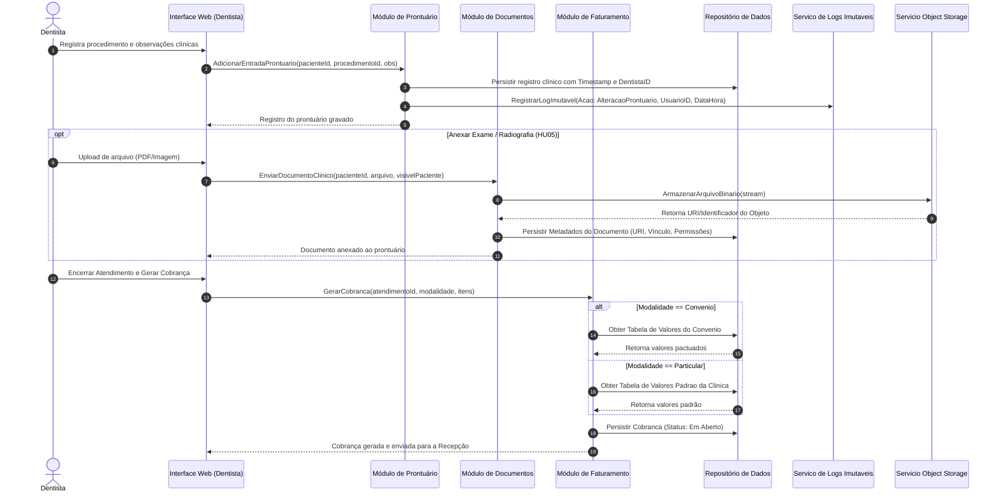

# Relatório Técnico de Arquitetura de Software

## 1. Identificação das HUs

| HU ID | Perfil | Objetivo / Descrição | Critérios de Aceite Chave | Requisitos Vinculados |
| :--- | :--- | :--- | :--- | :--- |
| **HU01** | Recepcionista | Visualizar agenda unificada dos dentistas em tela única. | Visão diária/semanal; distinção visual de horários; filtros por dentista. | RF03, RF04, RNF06, RNF09, RNF10 |
| **HU02** | Recepcionista | Agendar, cancelar e remarcar consultas para qualquer dentista. | Seleção dentro da grade; bloqueio de sobreposição; envio automático de e-mail ao paciente. | RF05, RF06, RF08, RNF01 |
| **HU03** | Recepcionista | Registrar pagamento de cobranças (total ou parcial) geradas pós-atendimento. | Pagamento total/parcial; controle de cobranças em aberto; atualização de status imediata. | RF20, RF21 |
| **HU04** | Dentista | Registrar procedimentos no prontuário digital com histórico cronológico. | Inclusão de data/descrição/observações; associação automática do dentista; ordem cronológica decrescente. | RF09, RF10, RF12, RF13, RNF02, RNF05 |
| **HU05** | Dentista | Anexar radiografias e documentos clínicos ao prontuário do paciente. | Suporte a JPEG, PNG, PDF; identificação de autoria e data; restrição de acesso por vínculo. | RF11, RNF02, RNF03, RNF07 |
| **HU06** | Dentista | Consultar prontuário completo e histórico do paciente. | Organização por abas; busca por nome/CPF; acesso restrito aos profissionais da clínica. | RF09, RF12, RNF02, RNF03 |
| **HU07** | Dentista | Gerar cobrança discriminando procedimentos e modalidade (particular/convênio). | Seleção da tabela de procedimentos/convênios; aplicação automática de valores; disponibilização para a recepção. | RF18, RF19, RF20 |
| **HU08** | Administrador | Gerenciar cadastro de dentistas e configurações de grades de horário. | Definição de dias/horários; alterações afetam apenas agendamentos futuros. | RF01, RF03, RF07 |
| **HU09** | Administrador | Gerenciar estoque de materiais e receber alertas de quantidade mínima. | Exibição em painel destacado com saldo atual; registro de entradas diretamente pelo alerta. | RF14, RF15, RF16 |
| **HU10** | Administrador | Consultar e exportar relatórios de faturamento. | Filtros por data, dentista e modalidade; totais agrupados; exportação em CSV/PDF. | RF22 |
| **HU11** | Paciente | Visualizar agendamentos futuros e histórico no portal do paciente. | Exigência de autenticação; exibição de datas, horários e dentistas; histórico de consultas. | RF23, RF24, RNF01, RNF09, RNF10 |
| **HU12** | Paciente | Acessar e baixar documentos clínicos disponibilizados pelo dentista. | Download de laudos/exames; visibilidade restrita a arquivos explicitamente liberados; sem acesso a notas internas. | RF25, RNF02, RNF03, RNF07 |

---

## 2. Diagramas de Arquitetura (Mermaid)

### 2.1. Diagrama de Visão Geral de Componentes da Arquitetura



---

### 2.2. Diagrama de Sequência: Agendamento de Consulta e Notificação (HU02 / RF05, RF06, RF08)



---

### 2.3. Diagrama de Sequência: Atendimento, Registro de Prontuário e Geração de Cobrança (HU04, HU05, HU07)



---

## 3. Decisões de Arquitetura

### ADR-01: Separação do Armazenamento de Arquivos Binários (Object Storage)
*   **Contexto**: O sistema exige upload e consulta de radiografias, laudos e exames clínicos (RF11, HU05, HU12), com alto impacto no volume de dados acumulado.
*   **Decisão**: Adotar o padrão de desacoplamento onde o repositório relacional transacional armazena estritamente os metadados dos documentos e permissões de acesso. Os arquivos binários pesados são direcionados a um serviço dedicado de Armazenamento de Objetos (*Object Storage*).
*   **Justificativa**: Atende diretamente ao requisito **RNF07** (desacoplamento e escalabilidade do armazenamento) e previne degradação de desempenho no repositório de dados estruturados.

### ADR-02: Garantia de Integridade Concorrencial na Agenda
*   **Contexto**: O agendamento concorrente por múltiplas recepcionistas pode gerar reservas duplicadas no mesmo horário para o mesmo dentista (RF06, HU02).
*   **Decisão**: Implementar controle de concorrência na camada de domínio antes da conversão da transação no repositório, garantindo exclusão mútua na alocação de horários da grade.
*   **Justificativa**: Previne *race conditions*, cumprindo o requisito de negócio crítico de impedir atendimentos sobrepostos (RF06) mantendo o tempo de consulta dentro do SLA estipulado (**RNF06**).

### ADR-03: Trilha de Auditoria Imutável para Dados Clínicos
*   **Contexto**: Normas regulatórias legais e do CFO, juntamente com a LGPD e o requisito **RNF05**, exigem rastreabilidade inalterável sobre cadastros e edições no prontuário digital dos pacientes.
*   **Decisão**: Toda operação de inclusão ou alteração no módulo de prontuário disparará, de forma síncrona com a transação clínica, um evento assinado para um Repositório de Logs de Auditoria Imutável (registro *append-only*).
*   **Justificativa**: Garante não-repúdio e conformidade jurídica com órgãos reguladores (RNF02, RNF05).

### ADR-04: Estratégia de Isolamento de Visibilidade do Portal do Paciente
*   **Contexto**: O paciente deve acessar apenas suas consultas e documentos expressamente autorizados pelo dentista, sem acesso às anotações clínicas internas da equipe de odontologia (RF25, HU12, RNF03).
*   **Decisão**: O Módulo de Gestão de Documentos aplicará uma camada rígida de filtragem baseada na flag de visibilidade (*visivel_paciente: boolean*) e validação de vínculo de identidade na camada de aplicação.
*   **Justificativa**: Impede o vazamento de informações sigilosas e dados restritos à equipe médica, garantindo estrita aderência ao RNF02 e RNF03.

---

## 4. Tabela de Componentes e Rastreabilidade

| Componente | Responsabilidade Principal | Comunica-se com | Origem (HU / Critério de Aceite) |
| :--- | :--- | :--- | :--- |
| **Módulo de Autenticação e Acesso (RBAC)** | Gerenciar identidades, autenticação com *hash* seguro, encerramento de sessão inativa (30m) e controle de permissões por perfil. | Interface Web, Portal do Paciente, Todos os Módulos da Aplicação | RF01, RF02, RNF01, RNF04 |
| **Módulo de Agenda e Escalonamento** | Gerenciar a agenda individual e unificada, grades de horário, validação de sobreposição e alterações de status de consulta. | Interface Web, Repositório de Dados, Serviço de Notificações | RF03, RF04, RF05, RF06, RF07, HU01, HU02, HU08, RNF06 |
| **Módulo de Prontuário Digital** | Gerenciar o registro do histórico clínico, inserções cronológicas e auditoria de modificações do prontuário. | Interface Web, Repositório de Dados, Módulo de Auditoria | RF09, RF10, RF12, RF13, HU04, HU06, RNF02, RNF05 |
| **Módulo de Gestão de Documentos Clínicos** | Processar *upload*, controle de permissão e *download* de radiografias, laudos e exames anexados. | Interface Web, Portal do Paciente, Repositório de Dados, *Object Storage* | RF11, RF25, HU05, HU12, RNF02, RNF03, RNF07 |
| **Módulo de Estoque e Materiais** | Controlar o cadastro, movimentações (entradas/saídas) de materiais, vínculo com atendimentos e alertas de estoque mínimo. | Interface Web, Repositório de Dados, Módulo de Faturamento | RF14, RF15, RF16, RF17, HU09 |
| **Módulo de Faturamento e Convênios** | Gerenciar procedimentos, tabelas de convênios, geração de cobranças e controle de recebimentos (totais e parciais). | Interface Web, Repositório de Dados, Módulo de Estoque | RF18, RF19, RF20, RF21, RF22, HU03, HU07, HU10 |
| **Portal do Paciente** | Expor área restrita para consulta de agenda do paciente e *download* de documentos autorizados. | Módulo de Autenticação, Módulo de Agenda, Módulo de Gestão de Documentos | RF23, RF24, RF25, HU11, HU12, RNF09, RNF10 |
| **Serviço Assíncrono de Notificações** | Processar o envio de comunicações e e-mails de confirmação/remarcação/cancelamento para pacientes. | Módulo de Agenda, Infraestrutura Externa de E-mail | RF08, HU02 |
| **Serviço de Registro de Auditoria** | Gravar registros imutáveis de alterações realizadas em prontuários contendo identificação, data e hora. | Módulo de Prontuário Digital, Repositório de Logs Imutáveis | RNF05 |

---

## 5. Bloqueios e Pendências

1. **Definição das Regras para Modificação Retroativa de Grade de Horários (HU08 / RF07):**
   * *Pendência*: O requisito informa que a alteração da grade deve impactar apenas agendamentos futuros. Faz-se necessário especificar a conduta do sistema caso uma alteração na grade afete um horário futuro que *já* possua consulta agendada (ex: cancelamento automático, alerta de conflito para a recepção ou bloqueio da alteração).

2. **Detalhamento do Modelo de Cobrança e Repasse por Convênio (RF19, RF20, HU07):**
   * *Pendência*: Não está especificado se há controle de glosas, regras de coparticipação do paciente ou prazos de faturamento por lote com as operadoras de plano de saúde.

3. **Tempo de Retenção e Política de Descarte de Documentos Clínicos / LGPD vs. CFO (RNF02, RNF11):**
   * *Pendência*: A LGPD exige eliminação de dados pessoais sob solicitação, porém as normas do Conselho Federal de Odontologia (CFO) obrigam a retenção do prontuário por pelo menos 20 anos. É necessária a validação do comitê jurídico sobre as regras de anonimização *versus* retenção mandatória.

---

## 6. Cobertura de Requisitos

```
Matriz de Rastreadilidade de Requisitos (Cobertura 100%)
=========================================================

Requisitos Funcionais (RF):
- RF01 -> Módulo de Autenticação e Acesso / HU08
- RF02 -> Módulo de Autenticação e Acesso / HU01-HU12
- RF03 -> Módulo de Agenda e Escalonamento / HU01, HU08
- RF04 -> Módulo de Agenda e Escalonamento / HU01
- RF05 -> Módulo de Agenda e Escalonamento / HU02
- RF06 -> Módulo de Agenda e Escalonamento / HU02
- RF07 -> Módulo de Agenda e Escalonamento / HU08
- RF08 -> Serviço Assíncrono de Notificações / HU02
- RF09 -> Módulo de Prontuário Digital / HU04, HU06
- RF10 -> Módulo de Prontuário Digital / HU04
- RF11 -> Módulo de Gestão de Documentos Clínicos / HU05
- RF12 -> Módulo de Prontuário Digital / HU04, HU06
- RF13 -> Módulo de Prontuário Digital / HU04
- RF14 -> Módulo de Estoque e Materiais / HU09
- RF15 -> Módulo de Estoque e Materiais / HU09
- RF16 -> Módulo de Estoque e Materiais / HU09
- RF17 -> Módulo de Estoque e Materiais / HU07
- RF18 -> Módulo de Faturamento e Convênios / HU07
- RF19 -> Módulo de Faturamento e Convênios / HU07
- RF20 -> Módulo de Faturamento e Convênios / HU03, HU07
- RF21 -> Módulo de Faturamento e Convênios / HU03
- RF22 -> Módulo de Faturamento e Convênios / HU10
- RF23 -> Portal do Paciente / HU11
- RF24 -> Portal do Paciente / HU11
- RF25 -> Portal do Paciente / Módulo de Gestão de Documentos / HU12

Requisitos Não-Funcionais (RNF):
- RNF01 -> Módulo de Autenticação e Acesso
- RNF02 -> Diretriz Transversal de Segurança / Prontuário / Gestão de Documentos
- RNF03 -> Módulo de Gestão de Documentos / RBAC
- RNF04 -> Módulo de Autenticação e Acesso
- RNF05 -> Serviço de Registro de Auditoria / Prontuário
- RNF06 -> Módulo de Agenda (Otimização de Consultas de Visão Unificada)
- RNF07 -> Módulo de Gestão de Documentos / Object Storage
- RNF08 -> Diretriz de Infraestrutura de Implantação e Monitoramento
- RNF09 -> Diretriz de Design de Interface de Usuário (Apresentação Responsiva)
- RNF10 -> Diretriz de Compatibilidade Web (Frontend Adaptativo)
- RNF11 -> Módulo de Backup e Recuperação de Infraestrutura
```

---

## 7. Gap Analysis

### 7.1. Lacunas Identificadas e Impactos Arquiteturais

| ID Lacuna | Descrição da Lacuna | Impacto Arquitetural | Ação Recomendada |
| :--- | :--- | :--- | :--- |
| **GAP-01** | **Prescrição / Receituário Odontológico Digital:** O sistema contempla salvamento de receitas no portal do paciente (RF25), mas não detalha o fluxo de geração e assinatura digital da receita pelo dentista. | Alto risco de não conformidade legal na emissão de receitas de medicamentos controlados. | Incluir componente de Integração com Serviço de Assinatura Digital (Padrão ICP-Brasil) no Módulo de Prontuário. |
| **GAP-02** | **Tratamento de Falhas no Envio de E-mails (RF08 / HU02):** Não há especificação de comportamento quando o serviço externo de e-mail estiver indisponível. | Falhas na entrega de e-mails podem travar o fluxo principal de agendamento caso seja síncrono. | Definir o envio via Fila de Mensagens Assíncrona com política de reprocessamento (*retry*) e *Dead Letter Queue*. |
| **GAP-03** | **Exportação e Formato de Relatórios (HU10):** A HU10 solicita exportação em CSV/PDF, mas não define se relatórios grandes devem ser gerados sob demanda em background. | Risco de degradação do desempenho do repositório transacional em horários de pico. | Implementar a geração de relatórios utilizando réplica de leitura e processamento assíncrono para volumes grandes. |
| **GAP-04** | **Cancelamento e Estorno Financeiro (HU03 / RF21):** O sistema prevê o registro de pagamentos, mas omite a operação de estorno/cancelamento de cobrança e histórico de ajustes. | Inconsistência financeira em casos de pagamentos indevidos ou erros operacionais na recepção. | Adicionar operações formais de estorno financeiro com registro de log de auditoria no Módulo de Faturamento. |