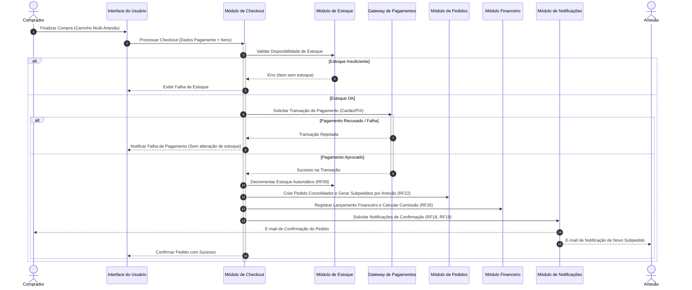

# Relatório Técnico de Arquitetura de Software

## 1. Identificação das HUs

Abaixo apresenta-se o mapeamento consolidado das Histórias de Usuário (HUs), relacionando seus respectivos perfis, objetivos, escopo funcional e critérios de aceite chave.

| HU ID | Perfil | Resumo do Objetivo | Critérios de Aceite Relevantes |
| :--- | :--- | :--- | :--- |
| **HU01** | Artesão | Cadastrar produtos com atributos e fotos. | OBRIGATÓRIOS: Nome, preço e quantidade. Múltiplas fotos. Publicação imediata no catálogo após cadastro. |
| **HU02** | Artesão | Gerenciar estoque dos produtos. | Atualização manual de estoque. Decremento automático na venda. Bloqueio e destaque para estoque zerado. |
| **HU03** | Artesão | Acompanhar e atualizar status de subpedidos. | Listagem com detalhes. Estados do ciclo: Recebido, Em preparação, Enviado, Entregue. Notificação ao comprador. |
| **HU04** | Artesão | Consultar painel financeiro. | Exibição por venda (valor bruto, comissão retida, líquido). Totais por período. Destaque para saldo disponível. |
| **HU05** | Artesão | Solicitar saque do saldo disponível. | Coleta de dados bancários. Registro da solicitação (Data, Valor, Status). Atualização imediata do saldo líquido. |
| **HU06** | Artesão | Responder avaliações de compradores. | Resposta única por avaliação. Exibição pública abaixo do comentário. Imutabilidade da resposta. |
| **HU07** | Comprador | Navegar e pesquisar no catálogo. | Navegação por categorias. Busca por termo em tempo real. Ocultação padrão de produtos sem estoque. |
| **HU08** | Comprador | Gerenciar carrinho e realizar checkout. | Carrinho consolida itens de múltiplos artesãos. Alteração de quantidades. Checkout com pagamento integrado e transacional. |
| **HU09** | Comprador | Acompanhar status dos pedidos e subpedidos. | Visualização detalhada do progresso de entrega em tempo real, dividida por subpedido de cada artesão. |
| **HU10** | Comprador | Avaliar produto após entrega. | Avaliação (nota 1-5 + texto) permitida apenas após status "Entregue". Avaliação única por item. |
| **HU11** | Admin | Gerenciar categorias do catálogo. | Criar, editar e remover categorias. Confirmação obrigatória ao remover categoria com produtos e notificação para reclassificação. |
| **HU12** | Admin | Configurar percentual de comissão. | Aplicação do novo percentual apenas em vendas futuras. Registro de log de alteração. Transparência ao artesão. |

---

## 2. Diagramas de Arquitetura (Mermaid)

### 2.1. Visão Geral da Arquitetura de Componentes

O diagrama abaixo apresenta os subsistemas conceituais da plataforma, suas fronteiras operacionais e as dependências de integração.

```mermaid
componentDiagram
    [Interface do Usuário (Web/Mobile)] as UI

    package "Fronteira da Aplicação Marketplace" {
        [Módulo de Autenticação e Perfis] as ModAuth
        [Módulo de Catálogo e Categorias] as ModCat
        [Módulo de Estoque] as ModEstoque
        [Módulo de Carrinho e Checkout] as ModCheckout
        [Módulo de Pedidos e Subpedidos] as ModPedidos
        [Módulo Financeiro e Comissões] as ModFin
        [Módulo de Avaliações] as ModAval
        [Módulo de Notificações] as ModNotif
        [Módulo de Auditoria e Logs] as ModAudit
    }

    package "Serviços Externos / Integrações" {
        [Gateway de Pagamentos Externo] as ExtPayment
        [Provedor de Object Storage] as ExtStorage
    }

    UI --> ModAuth
    UI --> ModCat
    UI --> ModCheckout
    UI --> ModPedidos
    UI --> ModFin
    UI --> ModAval

    ModCat --> ExtStorage : Upload/Retrieval de Fotos
    ModCheckout --> ExtPayment : Processamento de Pagamento (PCI-DSS)
    ModCheckout --> ModEstoque : Reserva/Baixa Transacional
    ModCheckout --> ModPedidos : Criação de Pedido e Subpedidos
    ModCheckout --> ModFin : Cálculo e Retenção de Comissão
    ModPedidos --> ModNotif : Disparo de Alertas
    ModFin --> ModAudit : Registros Imutáveis
    ModAuth --> ModAudit : Logs de Acesso/Alteração
```

### 2.2. Diagrama de Sequência: Processamento de Checkout e Split de Subpedidos (HU08, HU02, RF09, RF22, RF26, RNF08)

O diagrama a seguir detalha a orquestração transacional do checkout contendo itens de múltiplos artesãos, a geração dos subpedidos correspondentes e a baixa de estoque.



---

## 3. Decisões de Arquitetura

### ADR 01: Divisão Logica de Pedidos em Subpedidos por Artesão
* **Contexto:** Um único carrinho de compras pode conter produtos pertencentes a diferentes artesãos (RF22, HU08).
* **Decisão:** A plataforma adotará o padrão de *Pedido Principal e Subpedidos*. O pedido consolidador atende à visão do comprador (transação financeira única), enquanto cada artesão gerencia individualmente o seu *Subpedido* associado (ciclo de vida de entrega, alteração de status e comissionamento).
* **Consequências:** Garante o desacoplamento do ciclo de entrega entre vendedores. Facilita o rastreamento independente (HU03, HU09) e reduz complexidade na apuração do painel financeiro por artesão.

### ADR 02: Processamento Transacional Crítico (Atomicidade entre Pagamento e Estoque)
* **Contexto:** Erros de pagamento não podem resultar em baixa de estoque ou cobranças parciais (RNF08, RF08, RF09).
* **Decisão:** O pipeline de finalização de compra deve atuar sob o princípio da ACID/Saga Transacional Compensatória. O estoque é validado de forma otimista, a cobrança é executada via Gateway externo e, somente mediante a confirmação síncrona/webhook de aprovação, a baixa definitiva do estoque e a persistência dos subpedidos ocorrem de forma atômica.
* **Consequências:** Impede consistência eventual indesejada no estoque e previne sobrevenda (*overbooking*).

### ADR 03: Desacoplamento do Armazenamento de Arquivos via Object Storage
* **Contexto:** Produtos possuem fotos que demandam alto desempenho e resiliência sem onerar a aplicação principal (RF04, RNF04).
* **Decisão:** Todo conteúdo estático/binário (fotos de produtos) será armazenado em um serviço externo especializado de *Object Storage*. A aplicação armazenará exclusivamente as URLs assinadas/públicas correspondentes.
* **Consequências:** Mantém o servidor de aplicação sem estado (*stateless*), viabiliza escalabilidade horizontal e atende rigorosamente ao RNF04.

### ADR 04: Regras de Imutabilidade Financeira e Log de Auditoria
* **Contexto:** Operações de venda, comissionamento e saques exigem idoneidade e conformidade regulatória/LGPD (RNF09, RNF13, RF26, HU12).
* **Decisão:** Todas as movimentações financeiras e alterações críticas de configuração (como mudanças de taxa de comissão pelo Admin) serão registradas em um repositório append-only (somente leitura e escrita de novos eventos imutáveis), contendo *timestamp*, ator, valor e snapshot das regras aplicadas no momento da transação.
* **Consequências:** A alteração futura na taxa de comissão (HU12) não afetará transações passadas. Facilita auditorias e suporta o cumprimento da rastreabilidade exigida.

### ADR 05: Modelo de Identidade com Suporte a Multi-Perfil Simultâneo
* **Contexto:** O mesmo usuário pode atuar como comprador e artesão simultaneamente (RF01, RF03).
* **Decisão:** O modelo de identidade desassocia a entidade *Conta/Usuário* das papéis de autorização (*Roles/Profiles*). A autorização em nível de API verificará as permissões contextuais ativas da requisição.
* **Consequências:** Elimina a necessidade de contas duplicadas para a mesma pessoa física, simplificando a jornada do usuário e garantindo a segregação de acessos (RNF01).

---

## 4. Tabela de Componentes e Rastreabilidade

| Componente | Responsabilidade Principal | Comunica-se com | Origem (HU / Critério de Aceite) |
| :--- | :--- | :--- | :--- |
| **Módulo de Autenticação e Perfis** | Gerenciar contas, autenticação de usuários, perfis simultâneos e hash de senhas seguros (bcrypt). | Módulo de Auditoria e Logs, Interface do Usuário | RF01, RF02, RF03, RNF01, RNF02 |
| **Módulo de Catálogo e Categorias** | Gerenciar produtos, categorias, buscas por termos e vinculação de imagens. | Provedor de Object Storage, Módulo de Avaliações, Interface | RF04, RF05, RF06, RF10, RF11, RF12, HU01, HU07, HU11 |
| **Módulo de Gestão de Estoque** | Controlar quantidades disponíveis, atualizar estoque manualmente e efetuar baixas automáticas pós-venda. | Módulo de Carrinho e Checkout, Módulo de Catálogo | RF07, RF08, RF09, HU02 |
| **Módulo de Carrinho e Checkout** | Agrupar itens de compras, consolidar totais, orquestrar transações de pagamento e criar pedidos. | Gateway de Pagamentos, Módulo de Estoque, Módulo de Pedidos, Módulo Financeiro | RF13, RF14, RF15, RF16, RF17, HU08, RNF08 |
| **Módulo de Pedidos e Subpedidos** | Gerenciar o ciclo de vida dos pedidos, faturar subpedidos por artesão e atualizar status de entrega. | Módulo de Notificações, Módulo Financeiro, Interface | RF18, RF20, RF21, RF22, HU03, HU09 |
| **Módulo Financeiro e Comissões** | Calcular comissões, gerenciar saldos de artesãos, registrar histórico de movimentações e processar saques. | Módulo de Auditoria, Módulo de Pedidos, Interface | RF26, RF27, RF28, RF29, RF30, HU04, HU05, HU12 |
| **Módulo de Avaliações** | Processar notas, comentários textuais e respostas públicas do artesão vinculadas aos produtos. | Módulo de Catálogo, Módulo de Pedidos | RF23, RF24, RF25, HU06, HU10 |
| **Módulo de Notificações** | Enviar alertas transacionais via e-mail e notificações internas na plataforma para compradores e artesãos. | Módulo de Pedidos, Módulo de Checkout | RF18, RF19, HU03 |
| **Módulo de Auditoria e Logs** | Gravar registros imutáveis de transações financeiras, alterações de taxa de comissão e eventos críticos. | Módulo Financeiro, Módulo de Autenticação | RNF09, RNF13, HU12 |
| **Provedor de Object Storage (Externo)** | Armazenar e servir arquivos de imagens de produtos de forma escalável e desacoplada. | Módulo de Catálogo | RF04, RNF04, HU01 |
| **Gateway de Pagamentos (Externo)** | Processar transações financeiras sob regras PCI-DSS via comunicação segura. | Módulo de Carrinho e Checkout | RF16, RF17, RNF03, RNF08 |

---

## 5. Bloqueios e Pendências

1. **Definição do Mecanismo de Liquidação Financeira nos Saques (HU05 / RF30):**
   * *Pendência:* O requisito especifica a solicitação de saque via dados bancários, mas não define se a liquidação com a instituição financeira será automatizada via Gateway/PIX ou se haverá uma etapa de aprovação e processamento manual por parte do Administrador.
   * *Impacto:* Risco de atraso na integração bancária e necessidade de tela administrativa adicional para controle de saques pendentes.

2. **Regra de Exclusão de Categorias com Produtos Ativos (HU11 / RF12):**
   * *Bloqueio Técnico:* HU11 especifica que produtos associados devem ser notificados ao artesão para reclassificação, mas não detalha para qual categoria o produto é temporariamente movido (ex: categoria padrão "Sem Categoria" ou "Rascunho/Despublicado").
   * *Impacto:* Pode gerar inconsistência na navegação do catálogo (HU07) caso a reclassificação pelo artesão não ocorra imediatamente.

3. **Estratégia de Reserva Temporária de Estoque no Carrinho:**
   * *Pendência:* Não está especificado se a inclusão do produto no carrinho (RF13) realiza a reserva temporária (com tempo de expiração) ou se a trava ocorre puramente no momento do pagamento (RF08, RF09).
   * *Impacto:* Risco de concorrência onde dois compradores tentam pagar simultaneamente o mesmo item com apenas 1 unidade disponível.

---

## 6. Cobertura de Requisitos

A matriz abaixo comprova a total cobertura dos Requisitos Funcionais (RF) e Não Funcionais (RNF) pelos componentes e decisões arquiteturais propostas.

| Requisito | Tipo | Componente / Decisão Responsável | Status de Cobertura |
| :--- | :--- | :--- | :--- |
| **RF01, RF02, RF03** | Funcional | Módulo de Autenticação e Perfis / ADR 05 | Coberto |
| **RF04, RF05, RF06** | Funcional | Módulo de Catálogo e Categorias / ExtStorage / ADR 03 | Coberto |
| **RF07, RF08, RF09** | Funcional | Módulo de Gestão de Estoque / ADR 02 | Coberto |
| **RF10, RF11, RF12** | Funcional | Módulo de Catálogo e Categorias | Coberto |
| **RF13, RF14, RF15, RF16, RF17** | Funcional | Módulo de Carrinho e Checkout / Gateway de Pagamentos | Coberto |
| **RF18, RF19** | Funcional | Módulo de Notificações | Coberto |
| **RF20, RF21, RF22** | Funcional | Módulo de Pedidos e Subpedidos / ADR 01 | Coberto |
| **RF23, RF24, RF25** | Funcional | Módulo de Avaliações | Coberto |
| **RF26, RF27, RF28, RF29, RF30** | Funcional | Módulo Financeiro e Comissões / ADR 04 | Coberto |
| **RNF01, RNF02** | Não Funcional | Módulo de Autenticação (bcrypt / Perfil de Acesso) | Coberto |
| **RNF03** | Não Funcional | Gateway de Pagamentos / Comunicação HTTPS e PCI-DSS | Coberto |
| **RNF04** | Não Funcional | Provedor de Object Storage / ADR 03 | Coberto |
| **RNF05, RNF06** | Não Funcional | Estratégia de Indexação e Consultas do Módulo de Catálogo e Financeiro | Coberto |
| **RNF07, RNF10** | Não Funcional | Interface do Usuário (Responsiva e Multi-Browser) | Coberto |
| **RNF08** | Não Funcional | Módulo de Carrinho e Checkout / ADR 02 | Coberto |
| **RNF09, RNF13** | Não Funcional | Módulo de Auditoria e Logs / ADR 04 | Coberto |
| **RNF11** | Não Funcional | Diretrizes de Privacidade e Criptografia em Todos os Módulos | Coberto |
| **RNF12** | Não Funcional | Arquitetura Stateless Suportando Alta Disponibilidade | Coberto |

---

## 7. Gap Analysis

A análise a seguir identifica lacunas de especificação e omissões operacionais nos requisitos de entrada, avaliando seus impactos na arquitetura e recomendando ações corretivas imediatas.

### 7.1. Ausência de Especificação do Fluxo de Cancelamento, Reembolso e Devolução
* **Gap Detectado:** Os requisitos cobrem detalhadamente o fluxo feliz da compra (RF16 ao RF21), contudo omitiram por completo as regras de negócio para cancelamento de pedido pelo comprador, devolução de itens por defeito/desistência ou recusa de entrega.
* **Impacto Arquitetural:** 
  1. O Módulo Financeiro não prevê estorno de comissão retida nem reposição de saldo líquido deduzido.
  2. O Módulo de Estoque não possui fluxo para reintrodução (*restock*) automática de itens de pedidos cancelados.
* **Ação Recomendada:** Definir formalmente os requisitos funcionais para "Solicitar Cancelamento" e "Efetuar Estorno", prevendo eventos compensatórios no modelo financeiro e de estoque.

### 7.2. Mecanismo de Reclassificação Temporária na Exclusão de Categorias
* **Gap Detectado:** A HU11 exige que ao remover uma categoria os produtos ativos fiquem pendentes de reclassificação pelo artesão. Não foi definida a regra de exibição pública do produto enquanto ele não for reclassificado.
* **Impacto Arquitetural:** Exibir produtos com categoria nula pode quebrar filtros de busca (RF10, RF11, RNF05).
* **Ação Recomendada:** Especificar que produtos vinculados a categorias removidas passem automaticamente para o status `Despublicado` ou assumam uma categoria padrão de sistema denominada `Unassigned` (não visível nos menus de navegação primários).

### 7.3. Política de Expiração de Carrinho e Gestão de Concorrência de Estoque
* **Gap Detectado:** Não há definição sobre o tempo de vida de um item no carrinho de compras antes do checkout.
* **Impacto Arquitetural:** Se dois compradores colocarem o último item disponível no carrinho ao mesmo tempo, a falha só será percebida na tentativa de pagamento, gerando má experiência de usuário (UX).
* **Ação Recomendada:** Implementar uma estratégia de bloqueio temporário (*Soft Lock*) de estoque durante o processo ativo de checkout (ex: reserva garantida por 15 minutos), liberando o item caso o pagamento não seja finalizado dentro do prazo.

### 7.4. Ausência de Critérios para Direito de Esquecimento e Exclusão de Dados (LGPD - RNF11)
* **Gap Detectado:** O RNF11 menciona conformidade com a LGPD, mas os requisitos de negócio não definem o tratamento de dados pessoais de compradores e artesãos no caso de encerramento de conta, nem como tratar os registros financeiros imutáveis (RNF09).
* **Impacto Arquitetural:** Conflito entre a obrigação legal de retenção de registros fiscais/financeiros (RNF09) e a solicitação de anonimização de dados pessoais pelo titular.
* **Ação Recomendada:** Adotar técnica de *Anonimização de Dados de Usuário* mantendo os registros transacionais (valores, datas e IDs anonimizados) intactos no Módulo Financeiro/Auditoria, desassociando qualquer dado pessoal identificável (PII).